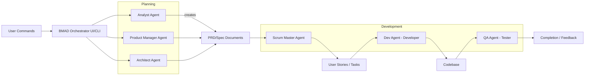
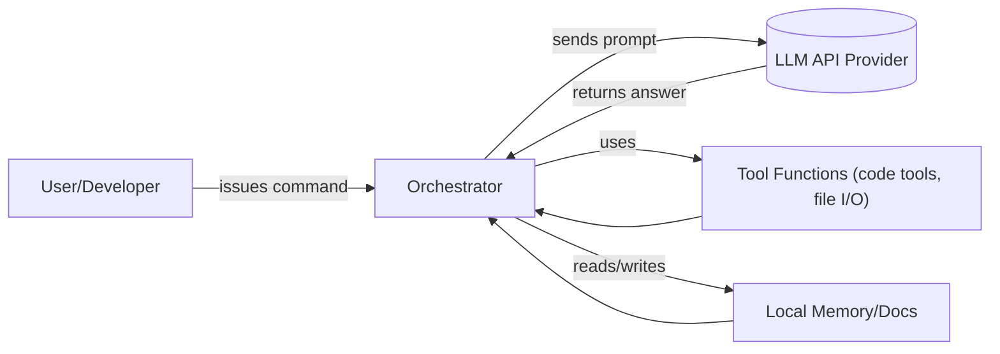
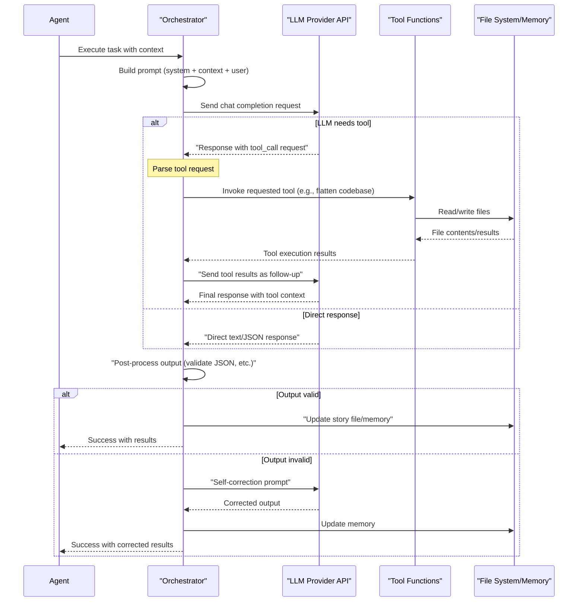
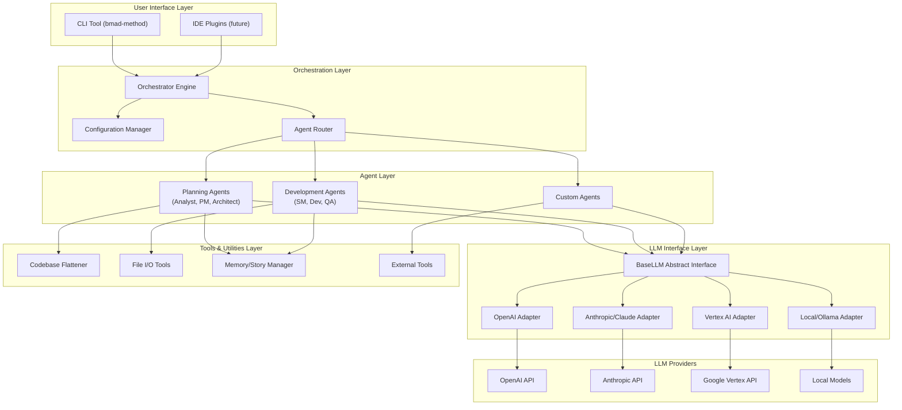
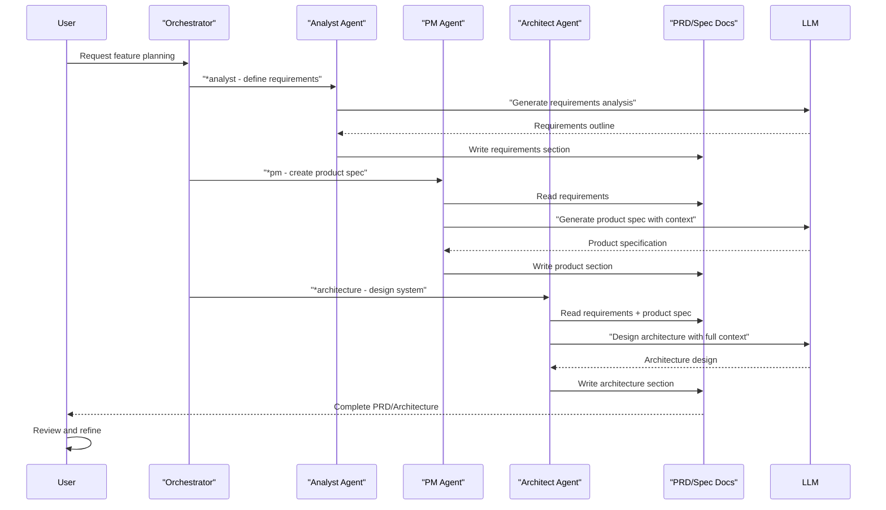
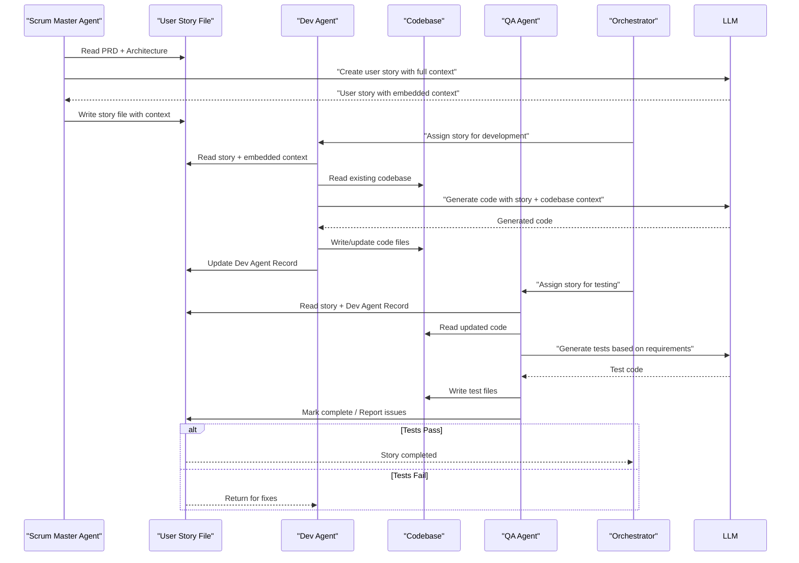
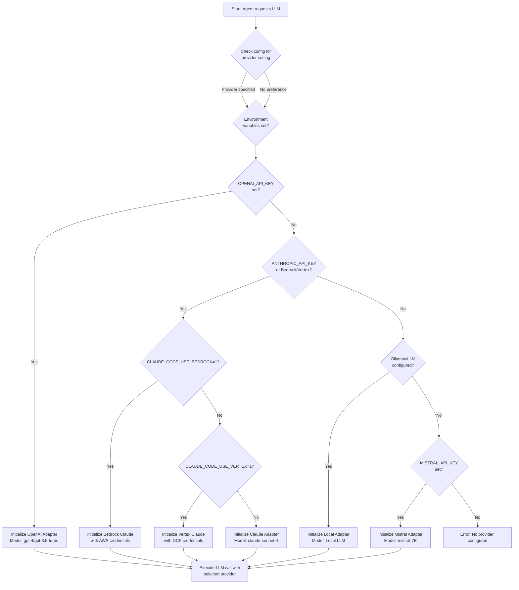

# BMAD-METHOD™ AI Agent Framework – Technical Overview

## Executive Summary

BMAD-METHOD (Breakthrough Method of Agile AI-Driven Development) is an open-source agent orchestration framework that transforms large language models into specialized development team members. By organizing LLMs into distinct roles—Analyst, Product Manager, Architect, Scrum Master, Developer, and QA—BMAD creates a systematic workflow for AI-assisted software development from planning through deployment.

The framework's core innovation lies in its two-phase approach: dedicated planning agents collaborate to generate comprehensive requirements and architecture documents, which are then transformed into self-contained user stories by a Scrum Master agent. Development and QA agents consume these context-rich stories to produce code and tests, eliminating the common LLM problems of context loss and planning inconsistency. BMAD is provider-agnostic, supporting OpenAI, Anthropic Claude, Google Vertex, and local models through a unified interface.

Implemented as an npm CLI tool with Node.js and extensible to Python, BMAD includes utilities like codebase flattening (for full-repo context injection) and template-driven prompting for each agent role. The system maintains memory through persistent story files rather than external vector databases, though it's architected to support RAG extensions. This makes BMAD particularly suitable for teams wanting structured, auditable AI collaboration without vendor lock-in.

---

[BMAD-METHOD](#glossary) (Breakthrough Method of Agile AI-Driven Development) is an open-source **[agent](#glossary) framework** that orchestrates [large language models](#glossary) ([LLMs](#glossary)) as specialized [agents](#glossary) (Analyst, PM, Architect, Scrum Master, Dev, QA, etc.) to drive agile software projects [o^GitHub – bmad–code–org/BMAD–METHOD: Breakthrough Method for Agile Ai Driven Development](https://github.com/bmad-code-org/BMAD-METHOD#:~:text=BMAD) [o^GitHub – bmad–code–org/BMAD–METHOD: Breakthrough Method for Agile Ai Driven Development](https://github.com/bmad-code-org/BMAD-METHOD#:~:text=2.%20Context,embedded%20directly%20in%20story%20files). Its core innovation is **Agentic Planning + [Context-Engineered](#glossary) Development**: dedicated planning [agents](#glossary) (Analyst, PM, Architect) collaborate to generate detailed [PRDs](#glossary) and architecture docs, then a [Scrum Master](#glossary) agent turns these into self-contained [user stories](#glossary) for developer and QA [agents](#glossary) [o^GitHub – bmad–code–org/BMAD–METHOD: Breakthrough Method for Agile Ai Driven Development](https://github.com/bmad-code-org/BMAD-METHOD#:~:text=BMAD) [o^GitHub – bmad–code–org/BMAD–METHOD: Breakthrough Method for Agile Ai Driven Development](https://github.com/bmad-code-org/BMAD-METHOD#:~:text=2.%20Context,embedded%20directly%20in%20story%20files). This two-phase workflow "eliminates planning inconsistency and context loss" [o^GitHub – bmad–code–org/BMAD–METHOD: Breakthrough Method for Agile Ai Driven Development](https://github.com/bmad-code-org/BMAD-METHOD#:~:text=This%20two,to%20build%20it%2C%20and%20why), so that Dev [agents](#glossary) get *complete* context to build code and QA [agents](#glossary) can test reliably. 

[BMAD-METHOD](#glossary) is packaged as an **[npm](#glossary)/Node [CLI](#glossary) tool** (`bmad-method`), with components in directories like `bmad-core/` (core engine and configs) and `bmad-agent/` ([persona templates](#glossary), task scripts, checklists, etc.) [o^GitHub – cabinlab/BMAD–CLAUDE–CODE: Breakthrough Method for Agile Ai Driven Development](https://github.com/cabinlab/BMAD-CLAUDE-CODE#:~:text=1,using%20BMAD%20with%20Claude%20Code) [o^bmadcode/bmad–method Documentation │ Docfork](https://docfork.com/bmadcode/bmad-method#:~:text=explicit%20rules%20for%20development%20standards,agent). A key utility is the **[codebase flattener](#glossary)** [CLI](#glossary), which aggregates your project's source into one XML file. For example, `npx bmad-method flatten` will scan the repo (respecting `.gitignore`), exclude binaries, and produce `flattened-codebase.xml` and a summary including line counts and estimated tokens (e.g. "Estimated tokens: 542,891" in one run [o^GitHub – bmad–code–org/BMAD–METHOD: Breakthrough Method for Agile Ai Driven Development](https://github.com/bmad-code-org/BMAD-METHOD#:~:text=,Total%20lines%20of%20code%3A%2015%2C847)). This flattening acts as a form of [RAG](#glossary) – giving the [agents](#glossary) the full code context in [LLM](#glossary)-readable form.

## Architecture & Data Flow 

The high-level architecture comprises an **[Orchestrator](#glossary)** and multiple **[Agent](#glossary) roles**, all driven by [LLM](#glossary) calls. In the diagram below, the [CLI](#glossary) (or IDE plugin) accepts user commands which route through the [Orchestrator](#glossary) to the appropriate [agents](#glossary). Planning [agents](#glossary) generate documents ([PRDs](#glossary), architecture specs), which the [Scrum Master](#glossary) agent ingests to emit self-contained development stories. Developer/QA [agents](#glossary) then consume those [story files](#glossary) and the code context (from the codebase or version control) to produce code and tests. All [LLM](#glossary) calls (Chat Completions) happen under the hood and are orchestrated by the system based on [agent prompts](#glossary). [Tools](#glossary) like the [code flattener](#glossary) or file I/O are called as needed to support tasks (e.g. "read project files", "commit code").  


*Figure: High-level BMAD-METHOD Agent workflow. The Orchestrator directs Planning agents (Analyst/PM/Architect) to produce PRD/Architect. The Scrum Master agent then drives User Story creation. Dev and QA agents operate on story files and code.*  

A more detailed **[LLM](#glossary) call flow** is as follows: for each [agent prompt](#glossary), [BMAD](#glossary) constructs a chat message set (system + user + history). It sends this to the configured [LLM](#glossary) provider API; the [LLM](#glossary) returns a response. The [Orchestrator](#glossary) may then invoke a [tool](#glossary) if the [agent's](#glossary) action involves external resources (e.g. running the flatten [CLI](#glossary), executing a function, or reading memory). Results are appended back into the [agent's](#glossary) context or to the shared [story file](#glossary) ("Dev Agent Record") and persisted. In effect, the system maintains "memory" of the conversation via the [agent's](#glossary) local [story file](#glossary) and any loaded documents, but it currently does not use an external vector store – rather it relies on the DSL and files it has pulled into context. The developers may manually refine and load content as needed for [RAG](#glossary)-like augmentation.


*Figure: LLM-driven agent loop. The Orchestrator (System) sends prompts to the LLM provider ([OpenAI](#glossary), [Claude](#glossary), etc.), receives replies, possibly invokes external [tools](#glossary), and reads/writes local memory (story files, code docs) to maintain context.*

### LLM Call with Tool Invocation

This sequence diagram shows the detailed flow when an [LLM](#glossary) needs to invoke a [tool function](#glossary) during agent execution:


*Figure: Detailed sequence of [LLM](#glossary) call flow showing tool invocation, result handling, and self-correction mechanisms.*  

## Components & Responsibilities

### BMAD Architecture Layers

The following diagram shows the layered architecture of BMAD-METHOD, from the user interface down through the [LLM](#glossary) providers:


*Figure: BMAD-METHOD layered architecture showing separation of concerns from CLI through orchestration, agents, LLM interface, tools, and provider APIs.*

<table>
<thead>
<tr><th>Component (Module/Directory)</th><th>Responsibility</th></tr>
</thead>
<tbody>
<tr><td><code>Orchestrator / CLI</code></td><td>Entry point (`bmad-method` CLI) that parses user commands, dispatches tasks to agents, and manages overall workflow (agents/planning cycle).</td></tr>
<tr><td><code>bmad-core</code></td><td>Core engine: agent definitions, prompt templates, task runners, and configuration (e.g. <code>core-config.yaml</code>). Implements orchestration logic and LLM invocation interface.</td></tr>
<tr><td><code>bmad-agent</code></td><td>Agent asset library: persona descriptors, specialized task scripts, checklists, and data for each agent role (e.g. story-writing, code review).</td></tr>
<tr><td><code>Tools & Utilities</code></td><td>Support functions and CLI tools (e.g. the code base flattener, file system I/O, sharding, command runners) that agents can call to perform actions or gather context.</td></tr>
<tr><td><code>LLM Interface</code></td><td>Abstraction layer managing API calls to LLM providers. Handles provider selection, model parameters, message formatting, streaming or function-call options.</td></tr>
<tr><td><code>Memory and Context</code></td><td>On-disk/story file memory (Markdown with checkboxes, logs) and optionally retrieved documents (flattened code, loaded designs) used as context for agents.</td></tr>
<tr><td><code>Config</code></td><td>Environment variables and YAML config (models, API keys, rate limits, feature flags). Enables selecting different LLM providers/models and setting retries/timeouts.</td></tr>
</tbody>
</table>

**Example Citation – Agent Personas:** The `bmad-core` includes detailed YAML/Markdown persona definitions. For instance, the Scrum Master agent “Bob” is defined with a role, style, and core principles in `bmad-core/agents/sm.md` (snippet shown below) [o^bmadcode/bmad–method Documentation │ Docfork](https://docfork.com/bmadcode/bmad-method#:~:text=patterns%20and%20maintainable%20code%20structure,developer%20handoffs%20identity%3A%20Story%20creation). These templates guide the LLM’s behavior (tone, focus, etc.).

```yaml
agent:
  name: Bob 
  id: sm 
  title: Scrum Master 
  icon: [U+1F3C3]
  whenToUse: Use for story creation...
persona:
  role: "Technical Scrum Master – Story Preparation Specialist"
  style: "Task-oriented, efficient, precise..."
  core_principles:
    - "Follow 'create-next-story' procedure..."
    - "Embed full context in story..."
```
*Excerpt of Scrum Master agent persona (bmad-core/agents/sm.md) [o^bmadcode/bmad–method Documentation │ Docfork](https://docfork.com/bmadcode/bmad-method#:~:text=patterns%20and%20maintainable%20code%20structure,developer%20handoffs%20identity%3A%20Story%20creation).*  

## Agents and Orchestration Flow

BMAD's orchestrator distinguishes **planning vs. development phases**. During planning, the user might invoke tokens like `*analyst` or `*architecture`, launching the respective agent to produce sections of a [PRD](#glossary) or architecture doc. For example, "Analyst: define MVP features" yields an outline; "Architect: detail tech stack and constraints" expands spec. Human-in-the-loop editing is expected: the user reviews and refines outputs before committing them. Once planning docs ([PRD](#glossary), architectures, briefs) are complete, the workflow shifts to the **development cycle**. The [Scrum Master](#glossary) agent shreds large stories (applying MECE principles) and writes detailed [user stories](#glossary). Then Developer and Tester agents pick up each story, open the corresponding file, consume the embedded context, and generate code or tests respectively.

### Planning Phase Agent Collaboration

The following sequence diagram illustrates how Planning agents collaborate to produce comprehensive requirements and architecture documents:


*Figure: Planning Phase sequence showing how Analyst, PM, and Architect agents collaborate through the Orchestrator to build comprehensive planning documents.* 

### Development Cycle: SM → Dev → QA Flow

Once planning is complete, the development cycle begins with the [Scrum Master](#glossary) agent breaking down work into stories, followed by Developer and QA agents executing those stories:


*Figure: Development cycle sequence showing the flow from Scrum Master creating context-rich stories, through Developer implementation, to QA validation.*

Internally, the orchestrator likely maintains an **agent execution graph** (per [35] "Agent Workflow Example"). Each [agent](#glossary) invocation is a function call chain: the [orchestrator](#glossary) builds a [prompt](#glossary) (system + context + user message), calls the [LLM](#glossary), post-processes output (often [JSON](#glossary)), logs results, and updates the story/issue state. If an agent's response violates policy (detected by parsing), it triggers a self-correct prompt (e.g. "Your output did not match schema X, try again" – a form of *ReAct* or function calling error handling). The overall **call graph** thus alternates between orchestrator logic, [LLM](#glossary) APIs, and any [tool function](#glossary) invocations.

## Memory, RAG, and Prompting

[BMAD](#glossary) does *not* use an external vector DB by default. Instead, memory is managed via persistent files: every [story](#glossary) or doc has sections for "Dev Agent Record", "Debug Log", etc., which accumulate conversation history and outputs. The [code flattening tool](#glossary) ensures the [LLMs](#glossary) have access to the entire codebase when needed (e.g. Dev Agent can refer to the flattened XML as context). These documents serve as retrieval sources. One could implement a [RAG](#glossary) extension by plugging in a vector store (e.g. using LangChain or LlamaIndex) to index [PRDs](#glossary), code, or meeting notes and retrieve relevant chunks into [prompts](#glossary). This would augment the existing *"[context-engineered](#glossary)"* approach. 

Prompting in [BMAD](#glossary) is [template-driven](#glossary). Each [agent](#glossary) likely has system and user [prompt templates](#glossary) (possibly in `bmad-core/agents/*.md`), including:

- **System prompts**: Instructions defining the [agent's](#glossary) role (like the YAML above), goals, and do's/don'ts.
- **User prompts**: The task or question (e.g., "Write the introduction to [PRD](#glossary) chapter 1").
- **[Context injection](#glossary)**: Preceding conversation and relevant docs ([PRD](#glossary) drafts, architectures, code snippets) are included inline.

This pattern is akin to a [RAG](#glossary) pipeline where the "knowledge" (documents) is embedded directly into the [prompt](#glossary). [Tools](#glossary) may also be described in [prompts](#glossary) (e.g. "You have access to a [Code Flattener tool](#glossary). Use it as needed."). The system may utilize [LLM](#glossary) [JSON](#glossary) or function-call APIs for structured outputs: for example, [agents](#glossary) might be asked to return [JSON](#glossary) with specific fields (title, body, checklist) for a new [story](#glossary), enabling downstream automation.

## Configuration: Providers, Models, APIs

### Provider Selection and Configuration Flow

The following flowchart illustrates how BMAD selects and configures the appropriate [LLM](#glossary) provider:


*Figure: Provider selection flowchart showing how BMAD determines which [LLM](#glossary) provider to use based on configuration and environment variables.*

[BMAD](#glossary) supports multiple [LLM](#glossary) providers, configurable via environment variables or config files. Typical configurations include:

- **[OpenAI](#glossary) (ChatGPT/GPT-4 family):** Set `OPENAI_API_KEY` (or specify via [CLI](#glossary) flags). Model names like `gpt-4`, `gpt-3.5-turbo`, `gpt-4-32k`, etc., are selectable [o^completions – OpenAI Python library · UNOFFICIAL DOCS](https://mmacy.github.io/openai-python/1.14/reference/resources/chat/completions/#:~:text=The%20,turbo). Supports streaming outputs and function-calling (for [tool](#glossary) integration) via the [OpenAI](#glossary) Chat API. Rate limits depend on plan; [BMAD](#glossary) should handle retries/timeouts (e.g. exponential backoff on 429 errors).
- **[Anthropic](#glossary) ([Claude](#glossary)):** Set `ANTHROPIC_API_KEY` for [Anthropic's](#glossary) cloud API [o^Claude Code SDK – Anthropic](https://docs.anthropic.com/s/claude-code-sdk#:~:text=). [Claude](#glossary) models include `claude-2`, `claude-2.1`, Sonnet 3/4 variants, and the latest `claude-sonnet-4` (Opus) model. ([Claude's](#glossary) API uses the newer *Messages* format and supports a "[JSON mode](#glossary)" where you can ask [Claude](#glossary) to output [JSON](#glossary).) The [Anthropic](#glossary) SDK/[CLI](#glossary) (Claude Code) supports function-calling and [tool](#glossary) use out-of-the-box. You can also route to [Claude](#glossary) on Amazon Bedrock by setting `CLAUDE_CODE_USE_BEDROCK=1` and proper AWS creds [o^Claude Code SDK – Anthropic](https://docs.anthropic.com/s/claude-code-sdk#:~:text=,and%20configure%20Google%20Cloud%20credentials). For [Vertex AI](#glossary) hosting of [Claude](#glossary), set `CLAUDE_CODE_USE_VERTEX=1` (plus GCP creds) [o^Claude Code SDK – Anthropic](https://docs.anthropic.com/s/claude-code-sdk#:~:text=,and%20configure%20Google%20Cloud%20credentials).
- **Google [Vertex](#glossary) (PaLM/Claude):** If using [Vertex](#glossary), set `GOOGLE_APPLICATION_CREDENTIALS` or use the [Vertex](#glossary) SDK. [Claude](#glossary) and Gemini models can be invoked through [Vertex's](#glossary) REST interface.
- **Mistral.ai:** If supported (commercial or community), one would set a Mistral API key and use model names like `mistral-7B-instruct-v0.1`.
- **Ollama/vLLM (Local):** For local LLM serving (Ollama or vLLM), one might configure a base URL (`OLLAMA_BASE_URL`) or use an adapter class to call the local API. Ollama supports fine-grained control (streaming, editing).

A summary of providers/configuration:  

<table>
<thead>
<tr><th>Provider</th><th>API Key Var / Setup</th><th>Example Models</th><th>Features</th></tr>
</thead>
<tbody>
<tr>
<td>OpenAI (ChatGPT, GPT-4)</td>
<td><code>OPENAI_API_KEY</code></td>
<td><code>gpt-4</code>, <code>gpt-3.5-turbo</code> [o^completions – OpenAI Python library · UNOFFICIAL DOCS](https://mmacy.github.io/openai-python/1.14/reference/resources/chat/completions/#:~:text=The%20,turbo)</td>
<td>Streaming, Function Calls, rate limits per plan.</td>
</tr>
<tr>
<td>Anthropic (Claude)</td>
<td><code>ANTHROPIC_API_KEY</code> (cloud)&nbsp;/<code>CLAUDE_CODE_USE_BEDROCK=1</code> (AWS) [o^Claude Code SDK – Anthropic](https://docs.anthropic.com/s/claude-code-sdk#:~:text=) [o^Claude Code SDK – Anthropic](https://docs.anthropic.com/s/claude-code-sdk#:~:text=,and%20configure%20Google%20Cloud%20credentials)</td>
<td><code>claude-3</code>, <code>claude-sonnet-4</code>, Bedrock <code>claude</code></td>
<td>Supports “JSON mode” in messages API, function tools (via Claude Code SDK), high 1M-token window (Sonnet-4).</td>
</tr>
<tr>
<td>Google Vertex</td>
<td><code>GOOGLE_CLOUD_CREDENTIALS</code> / <code>CLAUDE_CODE_USE_VERTEX=1</code> [o^Claude Code SDK – Anthropic](https://docs.anthropic.com/s/claude-code-sdk#:~:text=,and%20configure%20Google%20Cloud%20credentials)</td>
<td><code>PaLM 2</code>, <code>Gemini</code>, <code>claude-sonnet-4</code></td>
<td>Similar APIs as Anthropic/OpenAI through Vertex endpoints. Supports large contexts.</td>
</tr>
<tr>
<td>Mistral.ai</td>
<td>e.g. <code>MISTRAL_API_KEY</code></td>
<td><code>mistral-7B</code>, <code>mistral-8x</code></td>
<td>High-performance expert models; API syntax similar to others (official docs available).</td>
</tr>
<tr>
<td>Ollama / vLLM (local)</td>
<td>No external key (local). Configure <code>OLLAMA_BASE_URL</code> or use adapter.</td>
<td>Local models (e.g. Llama-2 variants, Llama-3, etc.)</td>
<td>Run LLM on local machines; may support streaming; no external rate limits. Memory-efficient.</td>
</tr>
</tbody>
</table>

Each provider typically has its own client library. For example, using Claude’s Python SDK, one would do something like:
```python
from anthropic import Anthropic, HUMAN_PROMPT, AI_PROMPT
client = Anthropic(api_key=os.getenv("ANTHROPIC_API_KEY"))
response = client.completions.create(
    model="claude-3", 
    messages=[
        {"role": "system", "content": "You are a Scrum Master agent..."},
        {"role": "user", "content": "Create user stories for feature X."}
    ],
    temperature=0.3
)
```
Likewise, OpenAI’s `openai.ChatCompletion.create(model="gpt-4", ...)`. These APIs return JSON objects from which the agent output is extracted.

## Claude-Specific Integration

To integrate **[Claude](#glossary) ([Anthropic](#glossary))** into [BMAD](#glossary):

- **Environment Setup**: Install the `anthropic` or `claude-code` Python SDK. Set the `ANTHROPIC_API_KEY` from your [Claude](#glossary) account (see [Anthropic](#glossary) docs) [o^Claude Code SDK – Anthropic](https://docs.anthropic.com/s/claude-code-sdk#:~:text=). For Bedrock-hosted [Claude](#glossary), set `CLAUDE_CODE_USE_BEDROCK=1` and configure AWS creds [o^Claude Code SDK – Anthropic](https://docs.anthropic.com/s/claude-code-sdk#:~:text=,and%20configure%20Google%20Cloud%20credentials).
- **Model Names**: In the configuration, use a model like `claude-3-100k` ([Claude](#glossary) 3 with 100k context) or `claude-sonnet-4` for the latest. These names evolve; refer to [Anthropic's](#glossary) [Model Cards] for names.
- **Message API**: Use the Chat (Messages) API. [Claude](#glossary) uses slightly different conventions (e.g. roles are `human`/`assistant`). Illustrative message format (shown in [Anthropic's](#glossary) "Migrating from Text Completions"):
  ```json
  [
    {"role":"system","content":"You are a QA agent..."},
    {"role":"user","content":"Review this code for security issues."}
  ]
  ```
- **Function/[Tool](#glossary) Calls**: Claude Code supports [tools](#glossary) (bing search, web, shell). In the Python SDK, you can load a "[tool](#glossary) set" or use the `--allowedTools` flag in [CLI](#glossary). For [JSON](#glossary) [tools](#glossary), there's support in Claude Code for returning well-defined [JSON](#glossary) (via a "[JSON mode](#glossary)" or a system [prompt](#glossary) like `You must output valid JSON matching this schema:`).
- **Retries/Timeouts**: Implement exponential backoff on 429/overload errors. [Anthropic](#glossary) may return `rate_limit_error`; on Transient errors (overloaded), retry after a delay. Timeouts can be set via HTTP client options.
- **Streaming**: To stream [Claude's](#glossary) results as they're generated, use the streaming interface of the SDK or [CLI](#glossary) (`--stream`). The [Anthropic](#glossary) SDK supports iterating on partial tokens.

Overall, [BMAD's](#glossary) architecture is provider-agnostic: it should wrap any [LLM](#glossary) behind a common interface. If the built-in system lacks a [Claude](#glossary) adapter, one can add a `ClaudeLLM` class implementing `send_messages()` under the hood. ([BMAD](#glossary) documentation implies a [BaseLLM](#glossary) adapter pattern: each provider class implements `generate_chat()` given messages and returns text or [JSON](#glossary).)  

## Provider-Agnostic BaseLLM Interface

In designing a cross-provider interface, [BMAD](#glossary) could define a `[BaseLLM](#glossary)` abstract class with methods like `generate_chat(messages, **kwargs)`. For example (in Python-like pseudocode):

```python
class BaseLLM:
    def __init__(self, model_name, **config): ...
    def generate_chat(self, messages: List[Dict], streaming=False):
        """ Sends messages to the LLM and returns response text or stream. """
        raise NotImplementedError
```

Concrete subclasses (`OpenAILLM`, `ClaudeLLM`, `VertexLLM`, `LocalLLM`) override this. They read their own API keys/models from config. For instance, `ClaudeLLM.generate_chat` might call `anthropic.Client` with the messages in the required format and handle [JSON](#glossary) parsing. This allows the rest of [BMAD](#glossary) to simply call `llm.generate_chat(...)` without caring about the backend.  

Below is an illustrative skeleton of such an adapter interface in Python, plus cloud-agnostic environment loading:

```python
import os, json
import openai  # or appropriate SDKs

# Base adapter
class BaseLLM:
    def __init__(self, model, **kwargs):
        self.model = model
    def generate_chat(self, messages, **options):
        raise NotImplementedError

# OpenAI adapter
class OpenAILLM(BaseLLM):
    def __init__(self, model):
        super().__init__(model)
        openai.api_key = os.getenv("OPENAI_API_KEY")
    def generate_chat(self, messages, **options):
        resp = openai.ChatCompletion.create(model=self.model, messages=messages, **options)
        return resp.choices[0].message['content']

# Claude (Anthropic) adapter
class ClaudeLLM(BaseLLM):
    def __init__(self, model):
        super().__init__(model)
        from anthropic import Anthropic
        self.client = Anthropic(api_key=os.getenv("ANTHROPIC_API_KEY"))
    def generate_chat(self, messages, **options):
        # Convert OpenAI-style messages to Anthropic format
        anthro_msgs = []
        for msg in messages:
            role = "human" if msg["role"]=="user" else "assistant"
            anthro_msgs.append({"role": role, "content": msg["content"]})
        resp = self.client.completions.create(model=self.model, messages=anthro_msgs, **options)
        return resp.completion['content']

# Usage example
def run_agent(agent_name, llm_adapter: BaseLLM):
    system_prompt = f"You are the {agent_name} agent..."
    user_prompt = "Perform some task..."
    messages = [{"role":"system","content":system_prompt},
                {"role":"user","content":user_prompt}]
    result = llm_adapter.generate_chat(messages, temperature=0.2, stream=False)
    print(result)
```

*(Above: pseudocode illustrating a unified interface. In practice, handle errors and streaming as needed.)*  

## Setup on macOS / Python

[BMAD-METHOD](#glossary) itself is installed via **[npm](#glossary)** in a Node project. However, since we're focusing on Python integration: we recommend Python 3.10+ on macOS (Intel or Apple Silicon). Steps:

1. **Install Node.js** (v20+). [BMAD's](#glossary) [CLI](#glossary) tools (`bmad-method`) are Node-based.
2. **Clone BMAD-METHOD**: `git clone https://github.com/bmad-code-org/BMAD-METHOD.git` and `cd BMAD-METHOD`.
3. **Install BMAD to a Project**: You can either run `npm run install:bmad` (per docs) or copy the `bmad-core` and `bmad-agent` directories into your project. A typical install command is `npm i @ptnglobal/bmad-method` (per [56†L241-L249]).
4. **Python Environment**: Create a venv (`python3 -m venv venv && source venv/bin/activate`).
5. **Python Dependencies**: Install [LLM](#glossary) SDKs you plan to use: e.g. `pip install openai anthropic` and any others (vertex-ai, mistral, etc.). Optionally install the [BMAD](#glossary) [CLI's](#glossary) [JSON](#glossary) parser if available (`pip install py-yaml`).
6. **API Keys**: Set environment variables in your shell (e.g. `export OPENAI_API_KEY=sk-...`, `export ANTHROPIC_API_KEY=...`). Use `~/.bash_profile` or `~/.zshrc` to automate. Keep keys secure (do not commit).
7. **Run Installation**: As docs say, update [BMAD](#glossary) files with `npx bmad-method install` to populate your project.
8. **Optional Docker**: A Dockerfile could bundle Node and Python. Useful for CI. (There is no official Docker provided, but a simple image just needs Node, [npm](#glossary), Python.)  

## Minimal Example & Validation

Below is a **minimal Python script** illustrating how one might **invoke a BMAD agent** using the above provider-agnostic interface. This example uses the `ClaudeLLM` adapter to run a “Dev” agent on a tiny test. (In reality, BMAD is driven by the JS CLI, but this shows how to call the core logic from Python.)

```python
# minimal_bmad_example.py
from time import sleep

# Setup LLM adapter for Claude (or swap in OpenAILLM)
llm = ClaudeLLM(model="claude-3")
print("Starting minimal BMAD agent example...")

# Emulate a simple Dev story
system_msg = {"role": "system", "content": "You are the Dev agent. Write a Python function that adds two numbers."}
user_msg = {"role": "user", "content": "Function: add(a, b)"}
result = llm.generate_chat([system_msg, user_msg])
print("LLM response:", result)
```

**Expected Output (logs):**  
Running this script (with `ANTHROPIC_API_KEY` set) might yield something like: 

```
Starting minimal BMAD agent example...
LLM response: Sure! Here's a simple implementation of an add function in Python:

```python
def add(a, b):
    """
    Returns the sum of two numbers a and b.
    """
    return a + b
```
```

This demonstrates calling Claude and getting structured code output. In a full BMAD run, similar prompts would be embedded in a story file with context and results appended to that file rather than printing. 

## Extensibility

- **Custom [Agents](#glossary):** To add a new [agent](#glossary), create a persona file (e.g. `my_role.md` in `bmad-agent/personas`) defining its role, style, and core principles (similar to existing YAML) [o^bmadcode/bmad–method Documentation │ Docfork](https://docfork.com/bmadcode/bmad-method#:~:text=patterns%20and%20maintainable%20code%20structure,developer%20handoffs%20identity%3A%20Story%20creation). Also add any task [templates](#glossary) or checklists in `bmad-agent/tasks/`. Finally register it in your config so the [orchestrator](#glossary) knows the trigger command (e.g. `*my_role`).
- **New [Tools](#glossary):** Add a new Node/Python command and mention it in the [agent's](#glossary) allowed [tools](#glossary). For example, define a [CLI](#glossary) script that wraps your custom API, and update the [agent prompt](#glossary) to mention `Tool: my_tool()`. Handle invocation in the [orchestrator](#glossary) (like [BMAD's](#glossary) flattened code) so [LLM](#glossary) can call it.
- **New Providers:** Implement and register a new `[BaseLLM](#glossary)` subclass (as sketched above). Map its config (env vars/models) and factory usage in the [orchestrator](#glossary) code so it can be selected (e.g. `provider: "mistral"` in config could instantiate `MistralLLM`).

Regarding **Training/Evaluation**, the [BMAD](#glossary) repo currently contains no machine-learning training components (it orchestrates existing [LLMs](#glossary)). There are no provided datasets or evaluation scripts. Best practice: one could simulate workflows with different [agents](#glossary) and measure efficiency or plan accuracy against human standards. For [RAG](#glossary) or retrieval quality, integrating benchmark Q&A pipelines (using e.g. Husky or LLMAtten) could be explored. But officially, [BMAD](#glossary) is not a training framework, so there's no training code.

## Security & Licensing 

[BMAD-METHOD](#glossary) is released under the **MIT License** [o^GitHub – bmad–code–org/BMAD–METHOD: Breakthrough Method for Agile Ai Driven Development](https://github.com/bmad-code-org/BMAD-METHOD#:~:text=License), a permissive OSS license. Its dependencies (node modules, any Python libs) should be audited for compatible licenses. As an [agent](#glossary) framework, [BMAD](#glossary) will send your project's data ([prompts](#glossary), context) to third-party [LLM](#glossary) APIs. **API keys must be kept secret**: store them in environment variables or secure vaults (as shown in infusion of `ANTHROPIC_API_KEY`, `OPENAI_API_KEY` [o^Claude Code SDK – Anthropic](https://docs.anthropic.com/s/claude-code-sdk#:~:text=) [o^completions – OpenAI Python library · UNOFFICIAL DOCS](https://mmacy.github.io/openai-python/1.14/reference/resources/chat/completions/#:~:text=The%20,turbo)). [BMAD](#glossary) itself does not log API keys or sensitive data, but developers must avoid printing secrets.

Data handling: By default, [BMAD](#glossary) **does not** report usage telemetry to [BMAD](#glossary) authors; however, calls to any [LLM](#glossary) provider are subject to that provider's data policies (e.g. [OpenAI](#glossary) may log or use data unless opted out). Users should review privacy terms of each [LLM](#glossary) API. Ensure any files with secrets (`.env`) are `.gitignore`-ed.

Security risks include the usual [LLM](#glossary) caveats: hallucinations (code bugs from models), prompt injection if [agent](#glossary) instructions are maliciously altered, and over-permission of [tools](#glossary) (e.g. a [tool](#glossary) that can execute shell commands should be carefully sandboxed). The DevOps persona, for instance, is aware of containerization ("Kubernetes, Docker, ..." [o^bmadcode/bmad–method Documentation │ Docfork](https://docfork.com/bmadcode/bmad-method#:~:text=Kubernetes%2C%20Docker%2C%20GitHub%20Actions%2C%20CI%2FCD,on%20building%20and%20maintaining%20robust)) to isolate execution. Use least-privilege: only enable needed [tools](#glossary), and review the [agent](#glossary) outputs.

Finally, check third-party modules: [BMAD's](#glossary) Node modules come from [npm](#glossary) (e.g. `@anthropic-ai/claude-code`), and Python adapters should be from PyPI or GitHub. The core is MIT-licensed [o^GitHub – bmad–code–org/BMAD–METHOD: Breakthrough Method for Agile Ai Driven Development](https://github.com/bmad-code-org/BMAD-METHOD#:~:text=License), but note that interacting with proprietary services ([OpenAI](#glossary), [Anthropic](#glossary)) may impose additional terms.

---

## Glossary

This section provides comprehensive definitions of key terms used throughout the BMAD-METHOD framework.

### BMAD-METHOD
- **Description**: Breakthrough Method of Agile AI-Driven Development. An open-source agent orchestration framework that transforms large language models into specialized development team members organized into distinct roles (Analyst, Product Manager, Architect, Scrum Master, Developer, QA).
- **Use this when**: You need a structured, systematic workflow for AI-assisted software development from planning through deployment with multiple specialized AI agents working in concert.
- **Like**: A virtual software development team where each AI agent is a specialist consultant focused on their domain of expertise (analysis, architecture, development, testing).

### Agent / Agent Roles
- **Description**: Specialized AI personas in BMAD that perform specific functions in the software development lifecycle. Each agent has defined responsibilities, behavioral traits, and domain expertise encoded in persona templates. Core agents include Analyst (requirements gathering), Product Manager (feature definition), Architect (system design), Scrum Master (story creation), Developer (code generation), and QA (testing).
- **Use this when**: You need to understand the different specialized functions available in BMAD or when configuring which agent should handle a particular development task.
- **Like**: Members of a software development team where each person has a specific job title and area of expertise, except these are AI-powered roles that can be invoked on demand.

### LLM (Large Language Model)
- **Description**: A machine learning model trained on vast amounts of text data that can understand and generate human-like text. In BMAD, LLMs power the intelligence behind each agent. Examples include GPT-4 (OpenAI), Claude (Anthropic), PaLM/Gemini (Google), and Mistral models. These models process prompts and context to generate responses, code, documentation, and other outputs.
- **Use this when**: Discussing the underlying AI technology that powers BMAD agents, configuring which model to use, or understanding token limits and model capabilities.
- **Like**: The "brain" behind each agent - similar to how a human expert would think through problems and generate solutions, but powered by advanced AI trained on millions of documents and code repositories.

### Orchestrator
- **Description**: The central coordination engine in BMAD that manages workflow, dispatches tasks to appropriate agents, handles agent-to-agent communication, and maintains execution state. The orchestrator receives user commands via CLI, routes them to agents, manages the planning-to-development phase transition, handles LLM API calls, and coordinates tool invocations.
- **Use this when**: Understanding BMAD's architecture, debugging workflow issues, or extending BMAD with custom agents or workflows.
- **Like**: A project manager or conductor who coordinates all team members, ensuring work flows smoothly from planning through development and that everyone has the information they need when they need it.

### PRD (Product Requirements Document)
- **Description**: A comprehensive document that defines what a product or feature should do, why it's needed, who will use it, and success criteria. In BMAD, planning agents (Analyst, PM, Architect) collaborate to generate PRDs which serve as the source of truth for development. PRDs include sections on business objectives, user stories, technical requirements, constraints, and architecture decisions.
- **Use this when**: Starting a new project or feature in BMAD, during the planning phase when defining what should be built, or when developers need comprehensive context about requirements and design decisions.
- **Like**: A detailed blueprint for a building that architects and builders reference throughout construction - it captures the "what" and "why" before any code is written.

### User Story
- **Description**: A self-contained unit of work that describes a feature or requirement from the user's perspective, typically following the format "As a [user type], I want [action] so that [benefit]." In BMAD, the Scrum Master agent creates user stories from PRDs, embedding full context including relevant requirements, architecture decisions, and code snippets. Each story is written to a file that Developer and QA agents consume.
- **Use this when**: Breaking down large features into implementable chunks, assigning work to Developer agents, or tracking progress on specific functionality.
- **Like**: A focused assignment or task card that contains everything a developer needs to complete a specific piece of work without having to hunt for additional information.

### Codebase Flattener
- **Description**: A utility tool in BMAD (`npx bmad-method flatten`) that aggregates an entire project's source code into a single XML file, respecting .gitignore rules and excluding binaries. The output includes file paths, content, line counts, and token estimates. This flattened representation can be injected into LLM prompts to give agents full codebase context.
- **Use this when**: Agents need to understand existing code structure, during development when context about other files is needed, or when implementing features that span multiple files.
- **Like**: Taking all the papers and files from multiple filing cabinets and creating one master index with photocopies of everything, making it easy to search and reference the entire collection at once.

### RAG (Retrieval Augmented Generation)
- **Description**: A technique that enhances LLM outputs by retrieving relevant information from a knowledge base or document store and including it in the prompt context. While BMAD doesn't use a vector database by default, it implements RAG-like patterns through codebase flattening and document embedding in prompts. Users can extend BMAD with vector stores (Weaviate, LlamaIndex, etc.) for more sophisticated retrieval.
- **Use this when**: Discussing how BMAD provides context to agents, considering extensions for large codebases that exceed token limits, or implementing knowledge base systems.
- **Like**: Having a research assistant who quickly finds and summarizes relevant documents before you write a report, ensuring you have all the pertinent information at hand.

### Context Engineering
- **Description**: The practice of carefully crafting and structuring the information provided to an LLM to maximize quality and relevance of outputs. In BMAD, context engineering is a core principle - agents receive comprehensive context through PRDs, architecture docs, code flatteners, and previous agent outputs embedded directly in prompts. This eliminates context loss and planning inconsistency.
- **Use this when**: Designing custom agents, improving output quality, understanding why BMAD embeds extensive information in user stories, or debugging agent behavior.
- **Like**: Preparing a comprehensive briefing document for a consultant that includes all relevant background, constraints, examples, and expectations so they can deliver exactly what you need.

### Prompt Template
- **Description**: Pre-defined text structures that guide LLM behavior by specifying role, goals, constraints, formatting requirements, and task instructions. In BMAD, each agent has prompt templates (stored in `bmad-core/agents/*.md`) that include system prompts (defining the agent's persona), user prompts (the specific task), and context injection points (where documents and code are inserted).
- **Use this when**: Creating custom agents, modifying agent behavior, understanding how BMAD guides LLMs to produce consistent outputs, or debugging unexpected agent responses.
- **Like**: A template email or form letter with blanks to fill in - it provides consistent structure and tone while allowing specific details to be customized for each use.

### BaseLLM
- **Description**: An abstract interface or base class in BMAD that defines a standard contract for interacting with any LLM provider. Concrete implementations (OpenAILLM, ClaudeLLM, VertexLLM, LocalLLM) inherit from BaseLLM and implement provider-specific API calls, authentication, message formatting, and response parsing. This abstraction enables BMAD to be provider-agnostic.
- **Use this when**: Integrating a new LLM provider into BMAD, understanding the architecture's flexibility, or switching between different AI services without changing application code.
- **Like**: A universal power adapter that works in any country - you plug in the same device but the adapter handles the specific voltage and plug shape for each location.

### Tool Functions
- **Description**: Executable utilities that agents can invoke to perform actions beyond text generation, such as file I/O, code execution, API calls, database queries, or system commands. In BMAD, common tools include the codebase flattener, file read/write operations, git commands, and test runners. LLMs can request tool invocations, and the orchestrator executes them and returns results.
- **Use this when**: Extending BMAD with custom capabilities, understanding how agents interact with the external world, or implementing function calling/tool use patterns.
- **Like**: The tools in a mechanic's toolbox - while the mechanic knows what needs to be done (the LLM's reasoning), they need specific tools (wrench, screwdriver, diagnostic scanner) to actually perform the work.

### OpenAI
- **Description**: An AI research company that created GPT models (GPT-3.5, GPT-4, GPT-4 Turbo, etc.). In BMAD, OpenAI is a supported LLM provider configured via `OPENAI_API_KEY`. OpenAI models are accessed through their Chat Completions API, supporting features like streaming, function calling, and JSON mode. Popular for strong reasoning and code generation capabilities.
- **Use this when**: Configuring BMAD to use GPT models, comparing provider options, or troubleshooting OpenAI-specific integration issues.
- **Like**: A brand name for a specific type of AI service, similar to how "Google" is a brand name for a search engine - it's one of several options you can choose from.

### Anthropic/Claude
- **Description**: Anthropic is an AI safety company that created Claude, a family of large language models (Claude 2, Claude 3, Claude Sonnet 4, etc.). Claude emphasizes helpfulness, harmlessness, and honesty. In BMAD, Claude is configured via `ANTHROPIC_API_KEY` or can be accessed through AWS Bedrock or Google Vertex. Known for long context windows (up to 200K+ tokens) and strong instruction following.
- **Use this when**: Configuring BMAD to use Claude models, leveraging extended context capabilities for large codebases, or choosing a provider focused on AI safety.
- **Like**: Another expert consulting firm with a different specialty and approach, available as an alternative to OpenAI for powering your AI agents.

### Vertex AI
- **Description**: Google Cloud's unified AI platform that provides access to Google's models (PaLM, Gemini) and third-party models like Claude through a consistent API. In BMAD, Vertex AI can be configured using `GOOGLE_APPLICATION_CREDENTIALS` or `CLAUDE_CODE_USE_VERTEX=1` for Claude on Vertex. Offers enterprise features like VPC networking, audit logging, and data residency controls.
- **Use this when**: Working in Google Cloud environments, requiring enterprise compliance features, accessing Google's Gemini models, or running Claude with GCP infrastructure.
- **Like**: A one-stop marketplace for AI services integrated with your existing cloud infrastructure, similar to how AWS Marketplace offers various software services.

### npm/CLI
- **Description**: npm (Node Package Manager) is the package manager for JavaScript/Node.js, used to install BMAD-METHOD (`npm i @ptnglobal/bmad-method`). CLI (Command Line Interface) refers to text-based interfaces for interacting with software through terminal commands. BMAD provides a CLI tool (`bmad-method`) with commands like `bmad-method flatten`, `bmad-method interact *analyst`, etc.
- **Use this when**: Installing BMAD, running BMAD commands, automating workflows through scripts, or integrating BMAD into CI/CD pipelines.
- **Like**: The app store and remote control for BMAD - npm is how you download and install it, CLI is how you operate it through typed commands rather than clicking buttons.

### JSON Mode
- **Description**: A feature in modern LLMs where the model is constrained to output valid JSON (JavaScript Object Notation) matching a specified schema. In BMAD, JSON mode is used for structured agent outputs like story creation, task lists, or configuration objects. This enables reliable parsing and downstream automation. Supported by OpenAI's `response_format: {type: "json_object"}` and Claude's system prompts requesting JSON.
- **Use this when**: Ensuring agent outputs are machine-readable and structured, implementing validation logic, integrating agent outputs with other systems, or debugging malformed responses.
- **Like**: Asking someone to fill out a structured form with specific fields rather than writing a free-form letter - it ensures information is organized consistently and can be processed automatically.

---

### Q&A Cheat Sheet

- **Q: How do I run [BMAD](#glossary) [agents](#glossary) from Python?**
  A: [BMAD](#glossary) is primarily Node-based, but you can invoke its core logic by either calling the `bmad-method` [CLI](#glossary) (e.g. via `subprocess`) or by bridging to the JS code. Alternatively, use our provider-agnostic Python interface (as above) and replicate the [prompt-engineering](#glossary) logic. For example, call `npx bmad-method interact *analyst` from Python to start an interactive session.

- **Q: How to configure which [LLM](#glossary) to use?**
  A: Set an environment variable or config entry for the provider. For [OpenAI](#glossary), set `OPENAI_API_KEY` and use `gpt-4` or similar. For [Claude](#glossary), set `ANTHROPIC_API_KEY`. In the core config (e.g. `core-config.yaml`), there can be a section like `llm_provider: anthropic` or similar (see repo docs). [BMAD](#glossary) will then instantiate the appropriate adapter.

- **Q: How do I add a custom [agent](#glossary) or persona?**
  A: Copy one of the existing YAML persona files in `bmad-core/agents/` or `bmad-agent/personas/`, rename it (e.g. `coach.ide.md`), and edit its fields (name, id, style, etc.). Then add a trigger command (like `*coach`) in the [orchestrator](#glossary) config. The system will load your new persona and use it when that command is invoked.

- **Q: Can I use [RAG](#glossary) (retrieval) with [BMAD](#glossary)?**
  A: Out-of-the-box, [BMAD](#glossary) doesn't integrate a vector DB, but you can implement [RAG](#glossary) by hooking a retrieval [tool](#glossary). For example, use `bmrad flatten` to create a knowledge base XML, index it with a [tool](#glossary) like `weaviate` or `LlamaIndex`, and add a step in the [prompt template](#glossary) for "retrieve relevant docs". [BMAD's](#glossary) architecture allows inserting such a retrieval step before or during an [agent's](#glossary) [prompt](#glossary) construction.

- **Q: What to do if an [agent's](#glossary) output is invalid?**
  A: The [CLI](#glossary) and persona [templates](#glossary) encourage the [agent](#glossary) to verify its own [JSON](#glossary) schema. If the [LLM](#glossary) returns malformed [JSON](#glossary) or an error, [BMAD](#glossary) typically logs it under "Debug" and re-[prompts](#glossary) (e.g. "You produced invalid [JSON](#glossary); please correct"). You can also manually intervene by editing the [story file](#glossary). Ensuring patterns like numbered lists (for options) is encoded in the [agent's](#glossary) instructions [o^bmadcode/bmad–method Documentation │ Docfork](https://docfork.com/bmadcode/bmad-method#:~:text=explicit%20rules%20for%20development%20standards,icon).

 

**Sources:** Official BMAD-METHOD docs and code (README, core architecture, agent/persona definitions) [o^GitHub – bmad–code–org/BMAD–METHOD: Breakthrough Method for Agile Ai Driven Development](https://github.com/bmad-code-org/BMAD-METHOD#:~:text=BMAD) [o^bmadcode/bmad–method Documentation │ Docfork](https://docfork.com/bmadcode/bmad-method#:~:text=patterns%20and%20maintainable%20code%20structure,developer%20handoffs%20identity%3A%20Story%20creation); Anthropic Claude integration guide [o^Claude Code SDK – Anthropic](https://docs.anthropic.com/s/claude-code-sdk#:~:text=) [o^Claude Code SDK – Anthropic](https://docs.anthropic.com/s/claude-code-sdk#:~:text=,and%20configure%20Google%20Cloud%20credentials); OpenAI API documentation [o^completions – OpenAI Python library · UNOFFICIAL DOCS](https://mmacy.github.io/openai-python/1.14/reference/resources/chat/completions/#:~:text=The%20,turbo); BMAD code and CLI examples [o^GitHub – bmad–code–org/BMAD–METHOD: Breakthrough Method for Agile Ai Driven Development](https://github.com/bmad-code-org/BMAD-METHOD#:~:text=,Total%20lines%20of%20code%3A%2015%2C847) [o^bmadcode/bmad–method Documentation │ Docfork](https://docfork.com/bmadcode/bmad-method#:~:text=explicit%20rules%20for%20development%20standards,agent).  (All code citations link to the BMAD-METHOD GitHub and provider docs as noted.)
