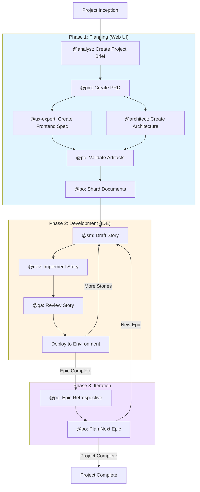
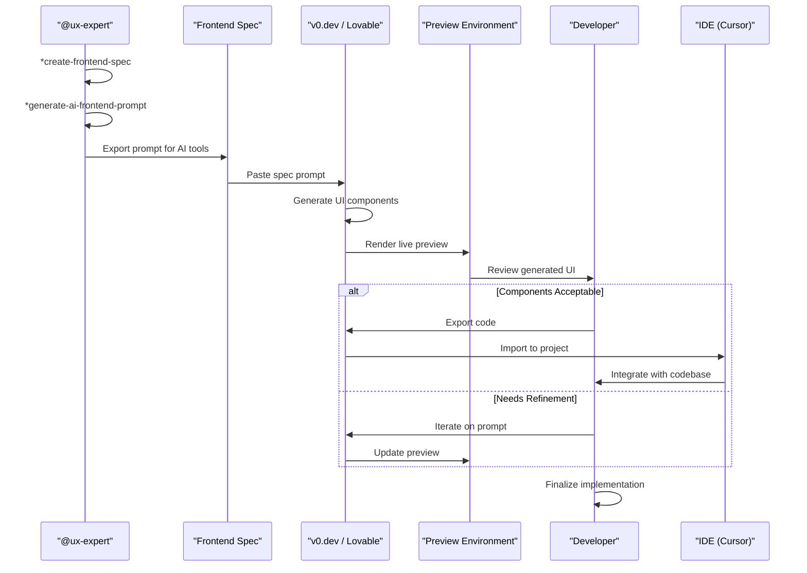
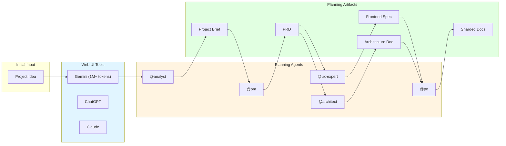
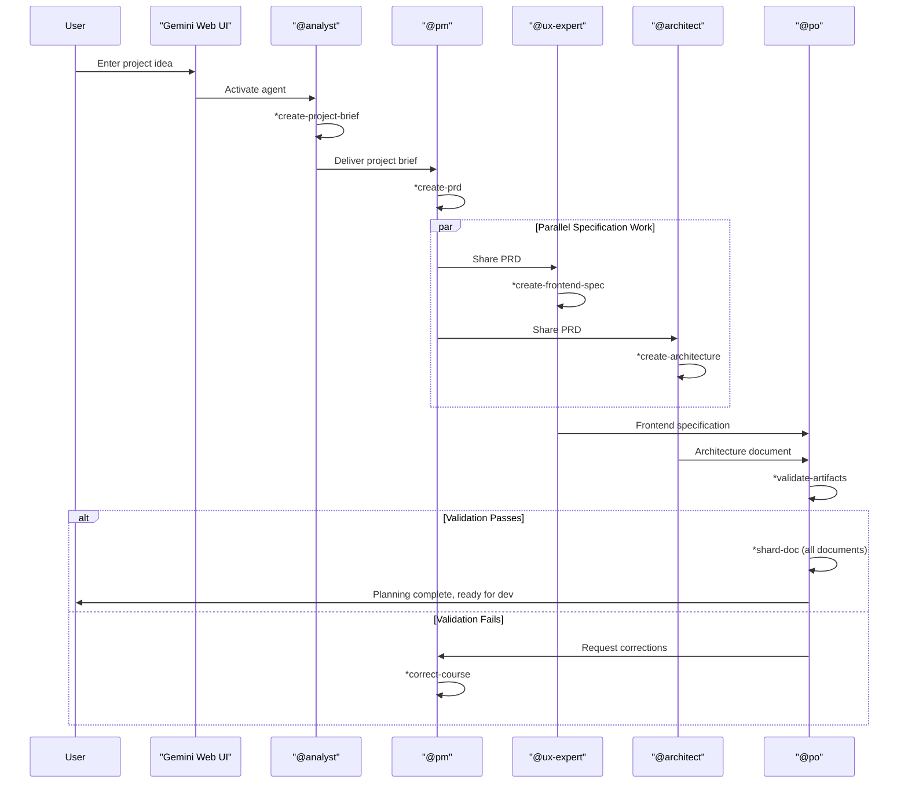
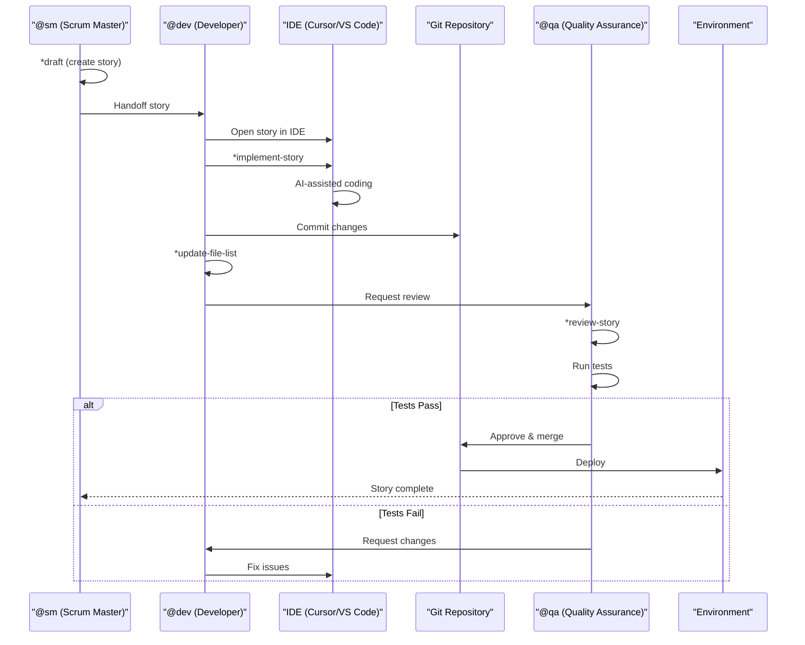
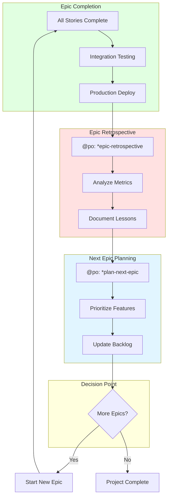
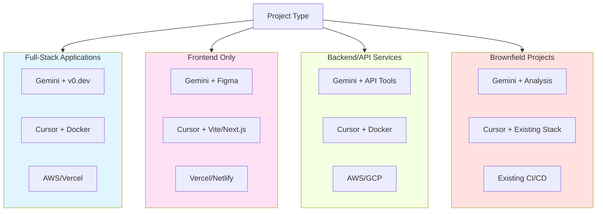

# BMad Method: Tools Cheatsheet by Phase

## Executive Summary

This cheatsheet provides a quick reference for tools and commands used across the three phases of the [BMad Method](#glossary): Planning (web UI-based document generation), Development (IDE-based implementation), and Iteration (retrospectives and planning). Each phase leverages specific AI tools and [agent](#glossary) commands to streamline software development from initial brainstorming through deployment.

---

## Table of Contents

1. [Glossary](#glossary)
2. [Phase 1: Planning](#-phase-1-planning-web-ui)
3. [Phase 2: Development](#-phase-2-development-ide)
4. [Phase 3: Iteration](#-phase-3-iteration-ideweb-ui)
5. [Project Type Tool Stacks](#️-project-type-tool-stacks)
6. [Quick Command Reference](#-quick-command-reference)
7. [Tool Selection Matrix](#️-tool-selection-matrix)
8. [Critical Tool Tips](#-critical-tool-tips)
9. [Mobile/Quick Access](#-mobilequick-access)

---

## Glossary

| Term | Description | Use this when | Like |
|------|-------------|---------------|------|
| **BMad Method** | Structured software development methodology dividing work into Planning, Development, and Iteration phases with AI-assisted agents | You need a systematic approach to building software with AI assistance from concept to deployment | A recipe that tells you exactly which ingredients (tools) to use at each step of cooking (development) |
| **Agent** | AI-powered role-specific assistant (e.g., @analyst, @pm, @dev) that executes specialized commands | You need domain-specific expertise for tasks like creating PRDs, implementing stories, or reviewing code | A specialized consultant you can summon for specific tasks - like calling an architect when you need blueprints |
| **PRD** | Product Requirements Document - comprehensive specification of what to build, why, and for whom | You need to define product scope, features, and requirements before development starts | A detailed blueprint for a house that shows every room, feature, and measurement before construction begins |
| **Epic** | Large body of work that can be broken down into multiple stories, typically representing a major feature or initiative | You're planning a substantial feature that requires multiple development cycles to complete | A chapter in a book that contains multiple related scenes or sections |
| **Story** | Single unit of work that delivers specific value and can be completed in one development cycle | You need to break down an epic into implementable, testable chunks | A single scene in a movie - complete on its own but part of a larger narrative |
| **Gemini** | Google's AI model with 1M+ token context window, ideal for generating large documents | You need to create comprehensive documentation, analyze large codebases, or process extensive requirements | A librarian who can read and remember an entire encyclopedia at once |
| **Cursor** | AI-powered IDE with native code generation and editing capabilities | You're actively writing code and want real-time AI assistance for implementation | A coding partner who sits next to you and helps write every line |
| **v0.dev** | AI tool for generating React/Next.js UI components from text descriptions | You need to rapidly prototype user interfaces without manual coding | A sketch artist who turns your verbal description into a visual design instantly |
| **Lovable** | AI-powered full-stack application generator | You want to generate an entire working application from high-level specifications | A construction crew that builds a complete house from architectural drawings |
| **Shard** | Process of breaking large documents into smaller, context-appropriate pieces | Your document is too large for a single AI context window or needs to be processed in parts | Cutting a large pizza into slices so everyone can handle their portion easily |

---

## BMad Method Workflow



---

## 🎯 **PHASE 1: PLANNING (Web UI)**

### **Primary Tools**
- **[Gemini](#glossary) Web** (1M+ tokens) - Best for large document generation
- **ChatGPT** - Alternative for comprehensive planning
- **Claude** - Good for analytical tasks

### **[Agent](#glossary) Commands**
```bash
@analyst
*brainstorm {topic}              # Structured brainstorming
*create-project-brief           # Project discovery document
*perform-market-research        # Market analysis

@pm
*create-prd                     # Product Requirements Document
*correct-course                 # Adjust PRD if needed

@ux-expert
*create-frontend-spec           # UI/UX specification
*generate-ai-frontend-prompt    # For v0/Lovable generation

@architect
*create-architecture            # Technical architecture
*technical-research             # Deep tech research

@po
*validate-artifacts             # Document validation
*shard-doc {document}          # Create sharded versions
```

### **External Tools**
- **[v0.dev](#glossary)** - AI UI generation (React/Next.js)
- **[Lovable](#glossary)** - Full-stack app generation
- **Figma** - Manual UI design
- **Miro/Mural** - Brainstorming sessions

### AI-Powered UI Generation Flow



### Planning Phase Tool Flow



### Planning Phase Sequence



---

## 🚀 **PHASE 2: DEVELOPMENT (IDE)**

### **Primary Tools**
- **[Cursor](#glossary)** - Native AI integration (recommended)
- **VS Code + GitHub Copilot** - Alternative IDE setup
- **Claude Code** - Anthropic's IDE
- **Windsurf** - Built-in AI capabilities

### **[Agent](#glossary) Commands**
```bash
@sm
*draft                         # Create next story
*story-checklist              # Validate story completeness

@dev
*implement-story              # Code implementation
*update-file-list            # Track changes

@qa
*review-story                # Code review & testing
*create-test-plan           # Comprehensive testing
```

### **Development Tools**
- **Git** - Version control
- **Docker** - Containerization
- **ESLint/Prettier** - Code quality
- **Jest/Cypress** - Testing frameworks
- **Postman/Insomnia** - API testing

### Development Cycle Sequence



---

## 🔄 **PHASE 3: ITERATION (IDE/Web UI)**

### **Primary Tools**
- **IDE** - For code changes and reviews
- **Web UI** - For retrospectives and planning

### **[Agent](#glossary) Commands**
```bash
@po
*epic-retrospective           # Review completed epic
*plan-next-epic              # Plan next iteration
```

### **Project Management Tools**
- **GitHub Issues** - Story tracking
- **Linear** - Project management
- **Notion** - Documentation
- **Slack/Discord** - Team communication

### Iteration Cycle



---

## 🛠️ **PROJECT TYPE TOOL STACKS**

### **Full-Stack Applications**
```
Planning: [Gemini](#glossary) → [v0.dev](#glossary) → Figma
Development: [Cursor](#glossary) → Docker → AWS/Vercel
Testing: Jest → Cypress → Postman
```

### **UI/Frontend Only**
```
Planning: [Gemini](#glossary) → Figma → Component libraries
Development: [Cursor](#glossary) → Vite/Next.js → Vercel/Netlify
Testing: Jest → Storybook → Lighthouse
```

### **Backend/API Services**
```
Planning: [Gemini](#glossary) → API design tools
Development: [Cursor](#glossary) → Docker → AWS/GCP
Testing: Jest → Postman → Load testing tools
```

### **Brownfield Projects**
```
Analysis: [Gemini](#glossary) → Code analysis tools
Development: [Cursor](#glossary) → Git → CI/CD
Testing: Existing test suites → New tests
```

### Tool Stack Comparison



---

## ⚡ **QUICK COMMAND REFERENCE**

### **Start New Project**
```bash
@analyst → *create-project-brief
@pm → *create-prd
@ux-expert → *create-frontend-spec (if UI)
@architect → *create-architecture
@po → *validate-artifacts → *shard-doc
```

### **Development Cycle**
```bash
@sm → *draft
@dev → *implement-story
@qa → *review-story (optional)
```

### **Project Completion**
```bash
@po → *epic-retrospective
```

---

## 🎛️ **TOOL SELECTION MATRIX**

| Phase | Primary Tool | Secondary | When to Use |
|-------|-------------|-----------|-------------|
| **Planning** | [Gemini](#glossary) Web | ChatGPT/Claude | Large documents, brainstorming |
| **UI Design** | [v0.dev](#glossary) | Figma/[Lovable](#glossary) | AI generation vs manual design |
| **Development** | [Cursor](#glossary) | VS Code + Copilot | Native AI vs extension-based |
| **Testing** | Jest | Cypress/Playwright | Unit vs E2E testing |
| **Deployment** | Vercel | AWS/Docker | Simple vs complex infrastructure |

---

## 🚨 **CRITICAL TOOL TIPS**

1. **Web UI for Planning:** Use [Gemini](#glossary)'s 1M+ token context for comprehensive documents
2. **IDE for Development:** [Cursor](#glossary) provides best AI integration for real-time coding
3. **External AI Tools:** [v0.dev](#glossary) for rapid UI prototyping
4. **Version Control:** Always use Git for tracking changes
5. **Testing:** Start with Jest, add E2E testing as needed

---

## 📱 **MOBILE/QUICK ACCESS**

### **Essential Commands**
- `@analyst` → `*create-project-brief`
- `@pm` → `*create-prd`
- `@sm` → `*draft`
- `@dev` → `*implement-story`

### **Emergency Tools**
- **Git** - Always available for version control
- **Docker** - Consistent development environments
- **Postman** - Quick API testing
- **Browser DevTools** - Frontend debugging

This cheatsheet provides quick access to the right tools for each phase of your BMad project.
