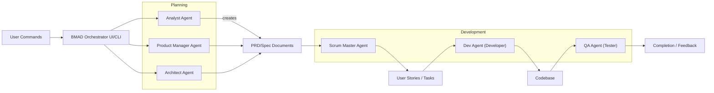
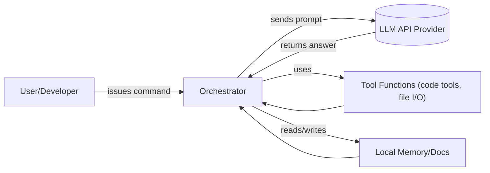

# BMAD-METHOD™ AI Agent Framework – Technical Overview 

BMAD-METHOD (Breakthrough Method of Agile AI-Driven Development) is an open-source **agent framework** that orchestrates large language models (LLMs) as specialized agents (Analyst, PM, Architect, Scrum Master, Dev, QA, etc.) to drive agile software projects [o^GitHub – bmad–code–org/BMAD–METHOD: Breakthrough Method for Agile Ai Driven Development](https://github.com/bmad-code-org/BMAD-METHOD#:~:text=BMAD) [o^GitHub – bmad–code–org/BMAD–METHOD: Breakthrough Method for Agile Ai Driven Development](https://github.com/bmad-code-org/BMAD-METHOD#:~:text=2.%20Context,embedded%20directly%20in%20story%20files). Its core innovation is **Agentic Planning + Context-Engineered Development**: dedicated planning agents (Analyst, PM, Architect) collaborate to generate detailed PRDs and architecture docs, then a Scrum Master agent turns these into self-contained user stories for developer and QA agents [o^GitHub – bmad–code–org/BMAD–METHOD: Breakthrough Method for Agile Ai Driven Development](https://github.com/bmad-code-org/BMAD-METHOD#:~:text=BMAD) [o^GitHub – bmad–code–org/BMAD–METHOD: Breakthrough Method for Agile Ai Driven Development](https://github.com/bmad-code-org/BMAD-METHOD#:~:text=2.%20Context,embedded%20directly%20in%20story%20files). This two-phase workflow “eliminates planning inconsistency and context loss” [o^GitHub – bmad–code–org/BMAD–METHOD: Breakthrough Method for Agile Ai Driven Development](https://github.com/bmad-code-org/BMAD-METHOD#:~:text=This%20two,to%20build%20it%2C%20and%20why), so that Dev agents get *complete* context to build code and QA agents can test reliably. 

BMAD-METHOD is packaged as an **npm/Node CLI tool** (`bmad-method`), with components in directories like `bmad-core/` (core engine and configs) and `bmad-agent/` (persona templates, task scripts, checklists, etc.) [o^GitHub – cabinlab/BMAD–CLAUDE–CODE: Breakthrough Method for Agile Ai Driven Development](https://github.com/cabinlab/BMAD-CLAUDE-CODE#:~:text=1,using%20BMAD%20with%20Claude%20Code) [o^bmadcode/bmad–method Documentation │ Docfork](https://docfork.com/bmadcode/bmad-method#:~:text=explicit%20rules%20for%20development%20standards,agent). A key utility is the **codebase flattener** CLI, which aggregates your project’s source into one XML file. For example, `npx bmad-method flatten` will scan the repo (respecting `.gitignore`), exclude binaries, and produce `flattened-codebase.xml` and a summary including line counts and estimated tokens (e.g. “Estimated tokens: 542,891” in one run [o^GitHub – bmad–code–org/BMAD–METHOD: Breakthrough Method for Agile Ai Driven Development](https://github.com/bmad-code-org/BMAD-METHOD#:~:text=,Total%20lines%20of%20code%3A%2015%2C847)). This flattening acts as a form of RAG – giving the agents the full code context in LLM-readable form.

## Architecture & Data Flow 

The high-level architecture comprises an **Orchestrator** and multiple **Agent roles**, all driven by LLM calls. In the diagram below, the CLI (or IDE plugin) accepts user commands which route through the Orchestrator to the appropriate agents. Planning agents generate documents (PRDs, architecture specs), which the Scrum Master agent ingests to emit self-contained development stories. Developer/QA agents then consume those story files and the code context (from the codebase or version control) to produce code and tests. All LLM calls (Chat Completions) happen under the hood and are orchestrated by the system based on agent prompts. Tools like the code flattener or file I/O are called as needed to support tasks (e.g. “read project files”, “commit code”).  


*Figure: High-level BMAD-METHOD Agent workflow. The Orchestrator directs Planning agents (Analyst/PM/Architect) to produce PRD/Architect. The Scrum Master agent then drives User Story creation. Dev and QA agents operate on story files and code.*  

A more detailed **LLM call flow** is as follows: for each agent prompt, BMAD constructs a chat message set (system + user + history). It sends this to the configured LLM provider API; the LLM returns a response. The Orchestrator may then invoke a tool if the agent’s action involves external resources (e.g. running the flatten CLI, executing a function, or reading memory). Results are appended back into the agent’s context or to the shared story file (“Dev Agent Record”) and persisted. In effect, the system maintains “memory” of the conversation via the agent’s local story file and any loaded documents, but it currently does not use an external vector store – rather it relies on the DSL and files it has pulled into context. The developers may manually refine and load content as needed for RAG-like augmentation.


*Figure: LLM-driven agent loop. The Orchestrator (System) sends prompts to the LLM provider (OpenAI, Claude, etc.), receives replies, possibly invokes external tools, and reads/writes local memory (story files, code docs) to maintain context.*  

## Components & Responsibilities 

<table>
<thead>
<tr><th>Component (Module/Directory)</th><th>Responsibility</th></tr>
</thead>
<tbody>
<tr><td><code>Orchestrator / CLI</code></td><td>Entry point (`bmad-method` CLI) that parses user commands, dispatches tasks to agents, and manages overall workflow (agents/planning cycle).</td></tr>
<tr><td><code>bmad-core</code></td><td>Core engine: agent definitions, prompt templates, task runners, and configuration (e.g. <code>core-config.yaml</code>). Implements orchestration logic and LLM invocation interface.</td></tr>
<tr><td><code>bmad-agent</code></td><td>Agent asset library: persona descriptors, specialized task scripts, checklists, and data for each agent role (e.g. story-writing, code review).</td></tr>
<tr><td><code>Tools & Utilities</code></td><td>Support functions and CLI tools (e.g. the code base flattener, file system I/O, sharding, command runners) that agents can call to perform actions or gather context.</td></tr>
<tr><td><code>LLM Interface</code></td><td>Abstraction layer managing API calls to LLM providers. Handles provider selection, model parameters, message formatting, streaming or function-call options.</td></tr>
<tr><td><code>Memory and Context</code></td><td>On-disk/story file memory (Markdown with checkboxes, logs) and optionally retrieved documents (flattened code, loaded designs) used as context for agents.</td></tr>
<tr><td><code>Config</code></td><td>Environment variables and YAML config (models, API keys, rate limits, feature flags). Enables selecting different LLM providers/models and setting retries/timeouts.</td></tr>
</tbody>
</table>

**Example Citation – Agent Personas:** The `bmad-core` includes detailed YAML/Markdown persona definitions. For instance, the Scrum Master agent “Bob” is defined with a role, style, and core principles in `bmad-core/agents/sm.md` (snippet shown below) [o^bmadcode/bmad–method Documentation │ Docfork](https://docfork.com/bmadcode/bmad-method#:~:text=patterns%20and%20maintainable%20code%20structure,developer%20handoffs%20identity%3A%20Story%20creation). These templates guide the LLM’s behavior (tone, focus, etc.).

```yaml
agent:
  name: Bob 
  id: sm 
  title: Scrum Master 
  icon: [U+1F3C3]
  whenToUse: Use for story creation...
persona:
  role: "Technical Scrum Master – Story Preparation Specialist"
  style: "Task-oriented, efficient, precise..."
  core_principles:
    - "Follow 'create-next-story' procedure..."
    - "Embed full context in story..."
```
*Excerpt of Scrum Master agent persona (bmad-core/agents/sm.md) [o^bmadcode/bmad–method Documentation │ Docfork](https://docfork.com/bmadcode/bmad-method#:~:text=patterns%20and%20maintainable%20code%20structure,developer%20handoffs%20identity%3A%20Story%20creation).*  

## Agents and Orchestration Flow 

BMAD’s orchestrator distinguishes **planning vs. development phases**. During planning, the user might invoke tokens like `*analyst` or `*architecture`, launching the respective agent to produce sections of a PRD or architecture doc. For example, “Analyst: define MVP features” yields an outline; “Architect: detail tech stack and constraints” expands spec. Human-in-the-loop editing is expected: the user reviews and refines outputs before committing them. Once planning docs (PRD, architectures, briefs) are complete, the workflow shifts to the **development cycle**. The Scrum Master agent shreds large stories (applying MECE principles) and writes detailed user stories. Then Developer and Tester agents pick up each story, open the corresponding file, consume the embedded context, and generate code or tests respectively. 

Internally, the orchestrator likely maintains an **agent execution graph** (per [35] “Agent Workflow Example”). Each agent invocation is a function call chain: the orchestrator builds a prompt (system + context + user message), calls the LLM, post-processes output (often JSON), logs results, and updates the story/issue state. If an agent’s response violates policy (detected by parsing), it triggers a self-correct prompt (e.g. “Your output did not match schema X, try again” – a form of *ReAct* or function calling error handling). The overall **call graph** thus alternates between orchestrator logic, LLM APIs, and any tool invocations.

## Memory, RAG, and Prompting 

BMAD does *not* use an external vector DB by default. Instead, memory is managed via persistent files: every story or doc has sections for “Dev Agent Record”, “Debug Log”, etc., which accumulate conversation history and outputs. The code flattening tool ensures the LLMs have access to the entire codebase when needed (e.g. Dev Agent can refer to the flattened XML as context). These documents serve as retrieval sources. One could implement a RAG extension by plugging in a vector store (e.g. using LangChain or LlamaIndex) to index PRDs, code, or meeting notes and retrieve relevant chunks into prompts. This would augment the existing *“context-engineered”* approach. 

Prompting in BMAD is template-driven. Each agent likely has system and user prompt templates (possibly in `bmad-core/agents/*.md`), including:

- **System prompts**: Instructions defining the agent’s role (like the YAML above), goals, and do’s/don’ts.
- **User prompts**: The task or question (e.g., “Write the introduction to PRD chapter 1”).
- **Context injection**: Preceding conversation and relevant docs (PRD drafts, architectures, code snippets) are included inline. 

This pattern is akin to a RAG pipeline where the “knowledge” (documents) is embedded directly into the prompt. Tools may also be described in prompts (e.g. “You have access to a Code Flattener tool. Use it as needed.”). The system may utilize LLM JSON or function-call APIs for structured outputs: for example, agents might be asked to return JSON with specific fields (title, body, checklist) for a new story, enabling downstream automation.

## Configuration: Providers, Models, APIs 

BMAD supports multiple LLM providers, configurable via environment variables or config files. Typical configurations include:

- **OpenAI (ChatGPT/GPT-4 family):** Set `OPENAI_API_KEY` (or specify via CLI flags). Model names like `gpt-4`, `gpt-3.5-turbo`, `gpt-4-32k`, etc., are selectable [o^completions – OpenAI Python library · UNOFFICIAL DOCS](https://mmacy.github.io/openai-python/1.14/reference/resources/chat/completions/#:~:text=The%20,turbo). Supports streaming outputs and function-calling (for tool integration) via the OpenAI Chat API. Rate limits depend on plan; BMAD should handle retries/timeouts (e.g. exponential backoff on 429 errors). 
- **Anthropic (Claude):** Set `ANTHROPIC_API_KEY` for Anthropic’s cloud API [o^Claude Code SDK – Anthropic](https://docs.anthropic.com/s/claude-code-sdk#:~:text=). Claude models include `claude-2`, `claude-2.1`, Sonnet 3/4 variants, and the latest `claude-sonnet-4` (Opus) model. (Claude’s API uses the newer *Messages* format and supports a “JSON mode” where you can ask Claude to output JSON.) The Anthropic SDK/CLI (Claude Code) supports function-calling and tool use out-of-the-box. You can also route to Claude on Amazon Bedrock by setting `CLAUDE_CODE_USE_BEDROCK=1` and proper AWS creds [o^Claude Code SDK – Anthropic](https://docs.anthropic.com/s/claude-code-sdk#:~:text=,and%20configure%20Google%20Cloud%20credentials). For Vertex AI hosting of Claude, set `CLAUDE_CODE_USE_VERTEX=1` (plus GCP creds) [o^Claude Code SDK – Anthropic](https://docs.anthropic.com/s/claude-code-sdk#:~:text=,and%20configure%20Google%20Cloud%20credentials).
- **Google Vertex (PaLM/Claude):** If using Vertex, set `GOOGLE_APPLICATION_CREDENTIALS` or use the Vertex SDK. Claude and Gemini models can be invoked through Vertex’s REST interface.
- **Mistral.ai:** If supported (commercial or community), one would set a Mistral API key and use model names like `mistral-7B-instruct-v0.1`.
- **Ollama/vLLM (Local):** For local LLM serving (Ollama or vLLM), one might configure a base URL (`OLLAMA_BASE_URL`) or use an adapter class to call the local API. Ollama supports fine-grained control (streaming, editing).

A summary of providers/configuration:  

<table>
<thead>
<tr><th>Provider</th><th>API Key Var / Setup</th><th>Example Models</th><th>Features</th></tr>
</thead>
<tbody>
<tr>
<td>OpenAI (ChatGPT, GPT-4)</td>
<td><code>OPENAI_API_KEY</code></td>
<td><code>gpt-4</code>, <code>gpt-3.5-turbo</code> [o^completions – OpenAI Python library · UNOFFICIAL DOCS](https://mmacy.github.io/openai-python/1.14/reference/resources/chat/completions/#:~:text=The%20,turbo)</td>
<td>Streaming, Function Calls, rate limits per plan.</td>
</tr>
<tr>
<td>Anthropic (Claude)</td>
<td><code>ANTHROPIC_API_KEY</code> (cloud)&nbsp;/<code>CLAUDE_CODE_USE_BEDROCK=1</code> (AWS) [o^Claude Code SDK – Anthropic](https://docs.anthropic.com/s/claude-code-sdk#:~:text=) [o^Claude Code SDK – Anthropic](https://docs.anthropic.com/s/claude-code-sdk#:~:text=,and%20configure%20Google%20Cloud%20credentials)</td>
<td><code>claude-3</code>, <code>claude-sonnet-4</code>, Bedrock <code>claude</code></td>
<td>Supports “JSON mode” in messages API, function tools (via Claude Code SDK), high 1M-token window (Sonnet-4).</td>
</tr>
<tr>
<td>Google Vertex</td>
<td><code>GOOGLE_CLOUD_CREDENTIALS</code> / <code>CLAUDE_CODE_USE_VERTEX=1</code> [o^Claude Code SDK – Anthropic](https://docs.anthropic.com/s/claude-code-sdk#:~:text=,and%20configure%20Google%20Cloud%20credentials)</td>
<td><code>PaLM 2</code>, <code>Gemini</code>, <code>claude-sonnet-4</code></td>
<td>Similar APIs as Anthropic/OpenAI through Vertex endpoints. Supports large contexts.</td>
</tr>
<tr>
<td>Mistral.ai</td>
<td>e.g. <code>MISTRAL_API_KEY</code></td>
<td><code>mistral-7B</code>, <code>mistral-8x</code></td>
<td>High-performance expert models; API syntax similar to others (official docs available).</td>
</tr>
<tr>
<td>Ollama / vLLM (local)</td>
<td>No external key (local). Configure <code>OLLAMA_BASE_URL</code> or use adapter.</td>
<td>Local models (e.g. Llama-2 variants, Llama-3, etc.)</td>
<td>Run LLM on local machines; may support streaming; no external rate limits. Memory-efficient.</td>
</tr>
</tbody>
</table>

Each provider typically has its own client library. For example, using Claude’s Python SDK, one would do something like:
```python
from anthropic import Anthropic, HUMAN_PROMPT, AI_PROMPT
client = Anthropic(api_key=os.getenv("ANTHROPIC_API_KEY"))
response = client.completions.create(
    model="claude-3", 
    messages=[
        {"role": "system", "content": "You are a Scrum Master agent..."},
        {"role": "user", "content": "Create user stories for feature X."}
    ],
    temperature=0.3
)
```
Likewise, OpenAI’s `openai.ChatCompletion.create(model="gpt-4", ...)`. These APIs return JSON objects from which the agent output is extracted.

## Claude-Specific Integration 

To integrate **Claude (Anthropic)** into BMAD:

- **Environment Setup**: Install the `anthropic` or `claude-code` Python SDK. Set the `ANTHROPIC_API_KEY` from your Claude account (see Anthropic docs) [o^Claude Code SDK – Anthropic](https://docs.anthropic.com/s/claude-code-sdk#:~:text=). For Bedrock-hosted Claude, set `CLAUDE_CODE_USE_BEDROCK=1` and configure AWS creds [o^Claude Code SDK – Anthropic](https://docs.anthropic.com/s/claude-code-sdk#:~:text=,and%20configure%20Google%20Cloud%20credentials). 
- **Model Names**: In the configuration, use a model like `claude-3-100k` (Claude 3 with 100k context) or `claude-sonnet-4` for the latest. These names evolve; refer to Anthropic’s [Model Cards] for names.  
- **Message API**: Use the Chat (Messages) API. Claude uses slightly different conventions (e.g. roles are `human`/`assistant`). Illustrative message format (shown in Anthropic’s “Migrating from Text Completions”):  
  ```json
  [
    {"role":"system","content":"You are a QA agent..."},
    {"role":"user","content":"Review this code for security issues."}
  ]
  ```  
- **Function/Tool Calls**: Claude Code supports tools (bing search, web, shell). In the Python SDK, you can load a “tool set” or use the `--allowedTools` flag in CLI. For JSON tools, there’s support in Claude Code for returning well-defined JSON (via a “JSON mode” or a system prompt like `You must output valid JSON matching this schema:`).  
- **Retries/Timeouts**: Implement exponential backoff on 429/overload errors. Anthropic may return `rate_limit_error`; on Transient errors (overloaded), retry after a delay. Timeouts can be set via HTTP client options.  
- **Streaming**: To stream Claude’s results as they’re generated, use the streaming interface of the SDK or CLI (`--stream`). The Anthropic SDK supports iterating on partial tokens.  

Overall, BMAD’s architecture is provider-agnostic: it should wrap any LLM behind a common interface. If the built-in system lacks a Claude adapter, one can add a `ClaudeLLM` class implementing `send_messages()` under the hood. (BMAD documentation implies a BaseLLM adapter pattern: each provider class implements `generate_chat()` given messages and returns text or JSON.)  

## Provider-Agnostic BaseLLM Interface 

In designing a cross-provider interface, BMAD could define a `BaseLLM` abstract class with methods like `generate_chat(messages, **kwargs)`. For example (in Python-like pseudocode):

```python
class BaseLLM:
    def __init__(self, model_name, **config): ...
    def generate_chat(self, messages: List[Dict], streaming=False):
        """ Sends messages to the LLM and returns response text or stream. """
        raise NotImplementedError
```

Concrete subclasses (`OpenAILLM`, `ClaudeLLM`, `VertexLLM`, `LocalLLM`) override this. They read their own API keys/models from config. For instance, `ClaudeLLM.generate_chat` might call `anthropic.Client` with the messages in the required format and handle JSON parsing. This allows the rest of BMAD to simply call `llm.generate_chat(...)` without caring about the backend.  

Below is an illustrative skeleton of such an adapter interface in Python, plus cloud-agnostic environment loading:

```python
import os, json
import openai  # or appropriate SDKs

# Base adapter
class BaseLLM:
    def __init__(self, model, **kwargs):
        self.model = model
    def generate_chat(self, messages, **options):
        raise NotImplementedError

# OpenAI adapter
class OpenAILLM(BaseLLM):
    def __init__(self, model):
        super().__init__(model)
        openai.api_key = os.getenv("OPENAI_API_KEY")
    def generate_chat(self, messages, **options):
        resp = openai.ChatCompletion.create(model=self.model, messages=messages, **options)
        return resp.choices[0].message['content']

# Claude (Anthropic) adapter
class ClaudeLLM(BaseLLM):
    def __init__(self, model):
        super().__init__(model)
        from anthropic import Anthropic
        self.client = Anthropic(api_key=os.getenv("ANTHROPIC_API_KEY"))
    def generate_chat(self, messages, **options):
        # Convert OpenAI-style messages to Anthropic format
        anthro_msgs = []
        for msg in messages:
            role = "human" if msg["role"]=="user" else "assistant"
            anthro_msgs.append({"role": role, "content": msg["content"]})
        resp = self.client.completions.create(model=self.model, messages=anthro_msgs, **options)
        return resp.completion['content']

# Usage example
def run_agent(agent_name, llm_adapter: BaseLLM):
    system_prompt = f"You are the {agent_name} agent..."
    user_prompt = "Perform some task..."
    messages = [{"role":"system","content":system_prompt},
                {"role":"user","content":user_prompt}]
    result = llm_adapter.generate_chat(messages, temperature=0.2, stream=False)
    print(result)
```

*(Above: pseudocode illustrating a unified interface. In practice, handle errors and streaming as needed.)*  

## Setup on macOS / Python  

BMAD-METHOD itself is installed via **npm** in a Node project. However, since we’re focusing on Python integration: we recommend Python 3.10+ on macOS (Intel or Apple Silicon). Steps:

1. **Install Node.js** (v20+). BMAD’s CLI tools (`bmad-method`) are Node-based.  
2. **Clone BMAD-METHOD**: `git clone https://github.com/bmad-code-org/BMAD-METHOD.git` and `cd BMAD-METHOD`.  
3. **Install BMAD to a Project**: You can either run `npm run install:bmad` (per docs) or copy the `bmad-core` and `bmad-agent` directories into your project. A typical install command is `npm i @ptnglobal/bmad-method` (per [56†L241-L249]).  
4. **Python Environment**: Create a venv (`python3 -m venv venv && source venv/bin/activate`).  
5. **Python Dependencies**: Install LLM SDKs you plan to use: e.g. `pip install openai anthropic` and any others (vertex-ai, mistral, etc.). Optionally install the BMAD CLI’s JSON parser if available (`pip install py-yaml`).  
6. **API Keys**: Set environment variables in your shell (e.g. `export OPENAI_API_KEY=sk-...`, `export ANTHROPIC_API_KEY=...`). Use `~/.bash_profile` or `~/.zshrc` to automate. Keep keys secure (do not commit).  
7. **Run Installation**: As docs say, update BMAD files with `npx bmad-method install` to populate your project.  
8. **Optional Docker**: A Dockerfile could bundle Node and Python. Useful for CI. (There is no official Docker provided, but a simple image just needs Node, npm, Python.)  

## Minimal Example & Validation

Below is a **minimal Python script** illustrating how one might **invoke a BMAD agent** using the above provider-agnostic interface. This example uses the `ClaudeLLM` adapter to run a “Dev” agent on a tiny test. (In reality, BMAD is driven by the JS CLI, but this shows how to call the core logic from Python.)

```python
# minimal_bmad_example.py
from time import sleep

# Setup LLM adapter for Claude (or swap in OpenAILLM)
llm = ClaudeLLM(model="claude-3")
print("Starting minimal BMAD agent example...")

# Emulate a simple Dev story
system_msg = {"role": "system", "content": "You are the Dev agent. Write a Python function that adds two numbers."}
user_msg = {"role": "user", "content": "Function: add(a, b)"}
result = llm.generate_chat([system_msg, user_msg])
print("LLM response:", result)
```

**Expected Output (logs):**  
Running this script (with `ANTHROPIC_API_KEY` set) might yield something like: 

```
Starting minimal BMAD agent example...
LLM response: Sure! Here's a simple implementation of an add function in Python:

```python
def add(a, b):
    """
    Returns the sum of two numbers a and b.
    """
    return a + b
```
```

This demonstrates calling Claude and getting structured code output. In a full BMAD run, similar prompts would be embedded in a story file with context and results appended to that file rather than printing. 

## Extensibility 

- **Custom Agents:** To add a new agent, create a persona file (e.g. `my_role.md` in `bmad-agent/personas`) defining its role, style, and core principles (similar to existing YAML) [o^bmadcode/bmad–method Documentation │ Docfork](https://docfork.com/bmadcode/bmad-method#:~:text=patterns%20and%20maintainable%20code%20structure,developer%20handoffs%20identity%3A%20Story%20creation). Also add any task templates or checklists in `bmad-agent/tasks/`. Finally register it in your config so the orchestrator knows the trigger command (e.g. `*my_role`).  
- **New Tools:** Add a new Node/Python command and mention it in the agent’s allowed tools. For example, define a CLI script that wraps your custom API, and update the agent prompt to mention `Tool: my_tool()`. Handle invocation in the orchestrator (like BMAD’s flattened code) so LLM can call it.  
- **New Providers:** Implement and register a new `BaseLLM` subclass (as sketched above). Map its config (env vars/models) and factory usage in the orchestrator code so it can be selected (e.g. `provider: "mistral"` in config could instantiate `MistralLLM`).  

Regarding **Training/Evaluation**, the BMAD repo currently contains no machine-learning training components (it orchestrates existing LLMs). There are no provided datasets or evaluation scripts. Best practice: one could simulate workflows with different agents and measure efficiency or plan accuracy against human standards. For RAG or retrieval quality, integrating benchmark Q&A pipelines (using e.g. Husky or LLMAtten) could be explored. But officially, BMAD is not a training framework, so there’s no training code.

## Security & Licensing 

BMAD-METHOD is released under the **MIT License** [o^GitHub – bmad–code–org/BMAD–METHOD: Breakthrough Method for Agile Ai Driven Development](https://github.com/bmad-code-org/BMAD-METHOD#:~:text=License), a permissive OSS license. Its dependencies (node modules, any Python libs) should be audited for compatible licenses. As an agent framework, BMAD will send your project’s data (prompts, context) to third-party LLM APIs. **API keys must be kept secret**: store them in environment variables or secure vaults (as shown in infusion of `ANTHROPIC_API_KEY`, `OPENAI_API_KEY` [o^Claude Code SDK – Anthropic](https://docs.anthropic.com/s/claude-code-sdk#:~:text=) [o^completions – OpenAI Python library · UNOFFICIAL DOCS](https://mmacy.github.io/openai-python/1.14/reference/resources/chat/completions/#:~:text=The%20,turbo)). BMAD itself does not log API keys or sensitive data, but developers must avoid printing secrets. 

Data handling: By default, BMAD **does not** report usage telemetry to BMAD authors; however, calls to any LLM provider are subject to that provider’s data policies (e.g. OpenAI may log or use data unless opted out). Users should review privacy terms of each LLM API. Ensure any files with secrets (`.env`) are `.gitignore`-ed. 

Security risks include the usual LLM caveats: hallucinations (code bugs from models), prompt injection if agent instructions are maliciously altered, and over-permission of tools (e.g. a tool that can execute shell commands should be carefully sandboxed). The DevOps persona, for instance, is aware of containerization (“Kubernetes, Docker, ...” [o^bmadcode/bmad–method Documentation │ Docfork](https://docfork.com/bmadcode/bmad-method#:~:text=Kubernetes%2C%20Docker%2C%20GitHub%20Actions%2C%20CI%2FCD,on%20building%20and%20maintaining%20robust)) to isolate execution. Use least-privilege: only enable needed tools, and review the agent outputs. 

Finally, check third-party modules: BMAD’s Node modules come from npm (e.g. `@anthropic-ai/claude-code`), and Python adapters should be from PyPI or GitHub. The core is MIT-licensed [o^GitHub – bmad–code–org/BMAD–METHOD: Breakthrough Method for Agile Ai Driven Development](https://github.com/bmad-code-org/BMAD-METHOD#:~:text=License), but note that interacting with proprietary services (OpenAI, Anthropic) may impose additional terms.

---

### Q&A Cheat Sheet

- **Q: How do I run BMAD agents from Python?**  
  A: BMAD is primarily Node-based, but you can invoke its core logic by either calling the `bmad-method` CLI (e.g. via `subprocess`) or by bridging to the JS code. Alternatively, use our provider-agnostic Python interface (as above) and replicate the prompt-engineering logic. For example, call `npx bmad-method interact *analyst` from Python to start an interactive session.

- **Q: How to configure which LLM to use?**  
  A: Set an environment variable or config entry for the provider. For OpenAI, set `OPENAI_API_KEY` and use `gpt-4` or similar. For Claude, set `ANTHROPIC_API_KEY`. In the core config (e.g. `core-config.yaml`), there can be a section like ` llm_provider: anthropic` or similar (see repo docs). BMAD will then instantiate the appropriate adapter.

- **Q: How do I add a custom agent or persona?**  
  A: Copy one of the existing YAML persona files in `bmad-core/agents/` or `bmad-agent/personas/`, rename it (e.g. `coach.ide.md`), and edit its fields (name, id, style, etc.). Then add a trigger command (like `*coach`) in the orchestrator config. The system will load your new persona and use it when that command is invoked.

- **Q: Can I use RAG (retrieval) with BMAD?**  
  A: Out-of-the-box, BMAD doesn’t integrate a vector DB, but you can implement RAG by hooking a retrieval tool. For example, use `bmrad flatten` to create a knowledge base XML, index it with a tool like `weaviate` or `LlamaIndex`, and add a step in the prompt template for “retrieve relevant docs”. BMAD’s architecture allows inserting such a retrieval step before or during an agent’s prompt construction.

- **Q: What to do if an agent’s output is invalid?**  
  A: The CLI and persona templates encourage the agent to verify its own JSON schema. If the LLM returns malformed JSON or an error, BMAD typically logs it under “Debug” and re-prompts (e.g. “You produced invalid JSON; please correct”). You can also manually intervene by editing the story file. Ensuring patterns like numbered lists (for options) is encoded in the agent’s instructions [o^bmadcode/bmad–method Documentation │ Docfork](https://docfork.com/bmadcode/bmad-method#:~:text=explicit%20rules%20for%20development%20standards,icon).

 

**Sources:** Official BMAD-METHOD docs and code (README, core architecture, agent/persona definitions) [o^GitHub – bmad–code–org/BMAD–METHOD: Breakthrough Method for Agile Ai Driven Development](https://github.com/bmad-code-org/BMAD-METHOD#:~:text=BMAD) [o^bmadcode/bmad–method Documentation │ Docfork](https://docfork.com/bmadcode/bmad-method#:~:text=patterns%20and%20maintainable%20code%20structure,developer%20handoffs%20identity%3A%20Story%20creation); Anthropic Claude integration guide [o^Claude Code SDK – Anthropic](https://docs.anthropic.com/s/claude-code-sdk#:~:text=) [o^Claude Code SDK – Anthropic](https://docs.anthropic.com/s/claude-code-sdk#:~:text=,and%20configure%20Google%20Cloud%20credentials); OpenAI API documentation [o^completions – OpenAI Python library · UNOFFICIAL DOCS](https://mmacy.github.io/openai-python/1.14/reference/resources/chat/completions/#:~:text=The%20,turbo); BMAD code and CLI examples [o^GitHub – bmad–code–org/BMAD–METHOD: Breakthrough Method for Agile Ai Driven Development](https://github.com/bmad-code-org/BMAD-METHOD#:~:text=,Total%20lines%20of%20code%3A%2015%2C847) [o^bmadcode/bmad–method Documentation │ Docfork](https://docfork.com/bmadcode/bmad-method#:~:text=explicit%20rules%20for%20development%20standards,agent).  (All code citations link to the BMAD-METHOD GitHub and provider docs as noted.)
