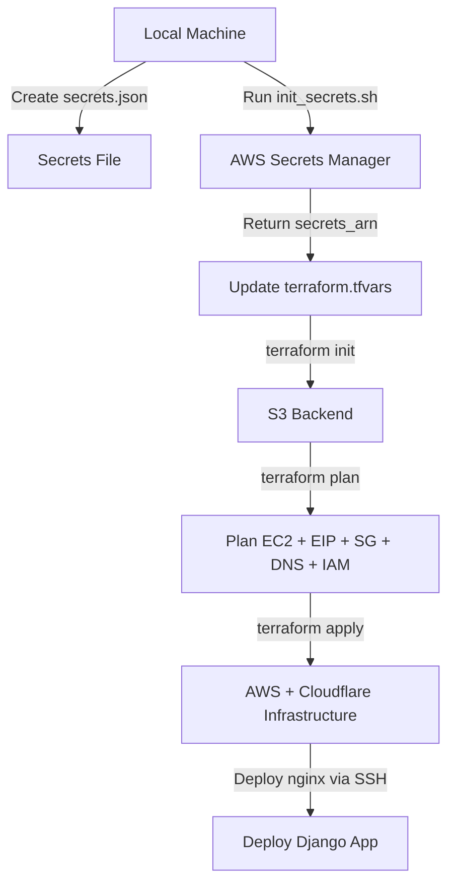
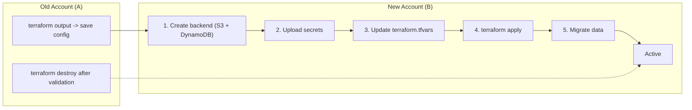

Here’s your comprehensive Terraform architecture plan formatted in **Markdown** with **Mermaid diagrams** for the workflows:

---

# ⏺ Comprehensive Terraform Architecture Plan

## Core Philosophy

### Separation of Concerns

1. **Infrastructure Layer** (AWS + Cloudflare) – bare minimum to run **any app**
2. **Application Layer** (Django/Postgres config) – POC-specific requirements
3. **Secrets Layer** – Centralized credential management

---

## Proposed Directory Structure

```text
terraform/
├── .gitignore                    # Ignore *.tfvars, .terraform/, state files
├── README.md                     # Setup instructions, prerequisites
│
├── environments/
│   ├── production/
│   │   ├── main.tf
│   │   ├── terraform.tfvars
│   │   └── backend.tf
│   └── staging/
│       ├── main.tf
│       ├── terraform.tfvars
│       └── backend.tf
│
├── modules/
│   ├── infrastructure/
│   │   ├── main.tf
│   │   ├── variables.tf
│   │   ├── outputs.tf
│   │   ├── cloudflare.tf
│   │   ├── vpc.tf
│   │   ├── security_groups.tf
│   │   ├── ec2.tf
│   │   ├── elastic_ip.tf
│   │   ├── iam.tf
│   │   └── secrets.tf
│   │
│   └── django_app/
│       ├── main.tf
│       ├── variables.tf
│       ├── outputs.tf
│       ├── rds.tf
│       ├── s3.tf
│       ├── user_data.sh.tpl
│       └── nginx.conf.tpl
│
└── scripts/
    ├── init_secrets.sh
    ├── switch_account.sh
    └── validate_setup.sh
```

---

## Layer 1: Infrastructure Module (Bare Minimum)

**What It Manages**

* AWS EC2: Ubuntu instance, security groups, Elastic IP
* Cloudflare: DNS A record, proxy settings, firewall rules
* IAM: EC2 instance profile with access to Secrets Manager
* Secrets Manager: Stores SSL certs, API tokens, credentials

**Key Terraform Files**

* `modules/infrastructure/variables.tf` – environment, AWS region, instance type, Cloudflare zone, SSH key, secrets ARN
* `modules/infrastructure/secrets.tf` – read SSL certificates from Secrets Manager
* `modules/infrastructure/ec2.tf` – EC2 instance with user_data bootstrap
* `modules/infrastructure/iam.tf` – EC2 role and Secrets Manager access
* `modules/infrastructure/cloudflare.tf` – Cloudflare DNS A record

---

## Layer 2: Django App Module (POC-Specific)

**What It Manages**

* Nginx configuration via SSH
* Docker Compose setup
* Application directories
* Optional: RDS Postgres, S3 for media

**Key Terraform Files**

* `modules/django_app/variables.tf` – EC2 instance info, SSH key, domain, port, optional RDS
* `modules/django_app/main.tf` – remote-exec provisioners for nginx + directories
* `modules/django_app/nginx.conf.tpl` – nginx config template

---

## Layer 3: Environment Configuration

* `environments/production/main.tf` – providers, module calls
* `environments/production/backend.tf` – S3 backend + DynamoDB locking
* `environments/production/terraform.tfvars.example` – example values (gitignored)

---

## Secrets Management Strategy

**Initial Setup**

1. Create AWS Secrets Manager secret with SSL certs and credentials
2. Store Cloudflare API token securely (env var or gitignored tfvars)
3. Create S3 backend bucket + enable versioning & encryption
4. Create DynamoDB table for Terraform state locking

**Helper Script**

```bash
./scripts/init_secrets.sh production ~/secrets/secrets.json
```

---

## Migration to New AWS/Cloudflare Account

**Steps**

1. Export current Terraform outputs
2. Update AWS & Cloudflare credentials
3. Recreate backend infrastructure (S3 + DynamoDB)
4. Initialize secrets in new account
5. Update Terraform variables (zone_id, secrets_arn, ssh_key_name)
6. Apply infrastructure
7. Migrate application data
8. Update DNS (if needed)
9. Destroy old infrastructure

---

## Workflow Diagrams

### Initial Deployment



### Account Migration Workflow



---

## Security Best Practices Applied

1. **No secrets in Git** – `.gitignore` for tfvars, secrets, .terraform
2. **Encrypted state** – S3 AES-256 + DynamoDB locks
3. **IAM least privilege** – EC2 role limited to one secret
4. **Secrets rotation** – Update secret in Secrets Manager + refresh EC2
5. **Cloudflare Origin Certificates** – only valid for traffic via Cloudflare
6. **SSH key management** – private keys gitignored, or use SSM Session Manager
7. **Audit logging** – CloudTrail + Cloudflare audit logs

---

## Requirements Mapping

| Requirement                  | Solution                                                      |
| ---------------------------- | ------------------------------------------------------------- |
| Move everything to Terraform | Infrastructure + app config managed (nginx, directories, SSL) |
| Industry standards           | S3 backend, Secrets Manager, IAM roles, encrypted state       |
| Security-aware credentials   | Secrets Manager + IAM, no hardcoded values, gitignored tfvars |
| Barebone config separation   | infrastructure = universal, django_app = POC-specific         |
| Account migration            | Env variables + tfvars, migration scripts                     |
| Cloudflare account change    | Update token + zone_id in tfvars, reapply                     |

---

## Open Questions

1. RDS vs Docker Postgres – optional module or keep Docker?
2. Static/Media Storage – S3 or local filesystem?
3. CI/CD Integration – Terraform via GitHub Actions/GitLab CI?
4. Multi-Region – Need DR in second AWS region?
5. SSH Alternative – AWS SSM Session Manager?
6. Blue/Green Deployment – Zero-downtime instance replacement?
7. Monitoring – CloudWatch alarms, Datadog, or Terraform-managed monitoring?

---

If you want, I can also create a **full Mermaid diagram showing all layers (Infrastructure → Django App → Secrets → Environment)** in one combined view. This would be a very clean “big picture” of your Terraform setup.

Do you want me to do that next?
