# Comprehensive Terraform Architecture Plan

## Executive Summary

This document outlines a production-ready [Terraform](#glossary) architecture for migrating infrastructure to code, with emphasis on security, modularity, and account portability. The design separates infrastructure concerns into three distinct layers: a universal infrastructure module managing [AWS](#glossary) compute and [Cloudflare](#glossary) DNS, an application-specific Django module for POC requirements, and a centralized secrets management layer using [AWS Secrets Manager](#glossary). This separation enables seamless migration between AWS and Cloudflare accounts by simply updating configuration variables, while maintaining industry-standard security practices including encrypted [state management](#glossary), [IAM](#glossary) least privilege, and zero hardcoded credentials. The architecture is designed to be both environment-agnostic and application-agnostic, providing a robust foundation for any deployment scenario.

---

## Architecture Overview

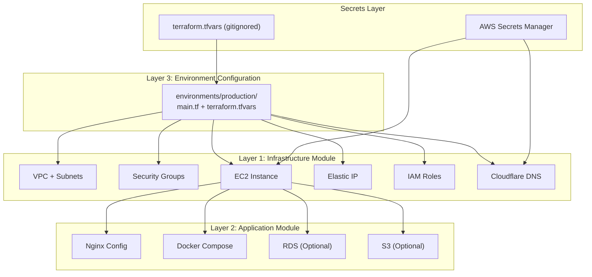

---

## Core Philosophy

### Separation of Concerns

1. **Infrastructure Layer** ([AWS](#glossary) + [Cloudflare](#glossary)) – bare minimum to run **any app**
2. **Application Layer** (Django/Postgres config) – POC-specific requirements
3. **Secrets Layer** – Centralized credential management

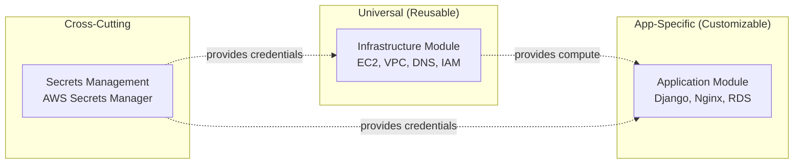

---

## Proposed Directory Structure

```text
terraform/
├── .gitignore                    # Ignore *.tfvars, .terraform/, state files
├── README.md                     # Setup instructions, prerequisites
│
├── environments/
│   ├── production/
│   │   ├── main.tf
│   │   ├── terraform.tfvars
│   │   └── backend.tf
│   └── staging/
│       ├── main.tf
│       ├── terraform.tfvars
│       └── backend.tf
│
├── modules/
│   ├── infrastructure/
│   │   ├── main.tf
│   │   ├── variables.tf
│   │   ├── outputs.tf
│   │   ├── cloudflare.tf
│   │   ├── vpc.tf
│   │   ├── security_groups.tf
│   │   ├── ec2.tf
│   │   ├── elastic_ip.tf
│   │   ├── iam.tf
│   │   └── secrets.tf
│   │
│   └── django_app/
│       ├── main.tf
│       ├── variables.tf
│       ├── outputs.tf
│       ├── rds.tf
│       ├── s3.tf
│       ├── user_data.sh.tpl
│       └── nginx.conf.tpl
│
└── scripts/
    ├── init_secrets.sh
    ├── switch_account.sh
    └── validate_setup.sh
```

---

## Layer 1: Infrastructure Module (Bare Minimum)

### What It Manages

* [AWS EC2](#glossary): Ubuntu instance, [security groups](#glossary), [Elastic IP](#glossary)
* [Cloudflare](#glossary): [DNS](#glossary) A record, proxy settings, firewall rules
* [IAM](#glossary): [EC2 instance profile](#glossary) with access to [Secrets Manager](#glossary)
* [Secrets Manager](#glossary): Stores [SSL certificates](#glossary), API tokens, credentials

### Key Terraform Files

* `modules/infrastructure/variables.tf` – environment, [AWS region](#glossary), instance type, Cloudflare zone, [SSH key](#glossary), secrets [ARN](#glossary)
* `modules/infrastructure/secrets.tf` – read [SSL certificates](#glossary) from [Secrets Manager](#glossary)
* `modules/infrastructure/ec2.tf` – [EC2](#glossary) instance with [user_data](#glossary) bootstrap
* `modules/infrastructure/iam.tf` – [EC2 role](#glossary) and [Secrets Manager](#glossary) access
* `modules/infrastructure/cloudflare.tf` – [Cloudflare](#glossary) [DNS](#glossary) A record

### Infrastructure Component Relationships

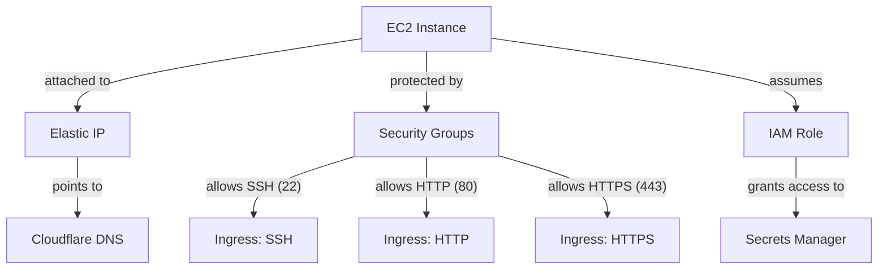

---

## Layer 2: Django App Module (POC-Specific)

### What It Manages

* Nginx configuration via [SSH](#glossary)
* Docker Compose setup
* Application directories
* Optional: [RDS](#glossary) Postgres, [S3](#glossary) for media

### Key Terraform Files

* `modules/django_app/variables.tf` – [EC2](#glossary) instance info, [SSH key](#glossary), domain, port, optional [RDS](#glossary)
* `modules/django_app/main.tf` – [remote-exec provisioners](#glossary) for nginx + directories
* `modules/django_app/nginx.conf.tpl` – nginx config template

### Application Provisioning Flow

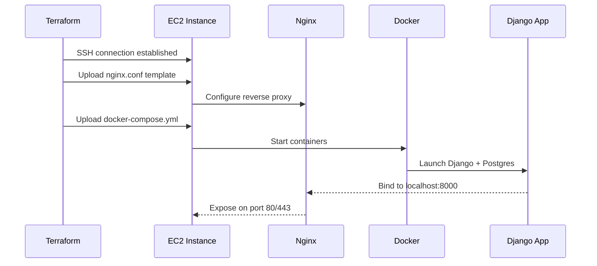

---

## Layer 3: Environment Configuration

* `environments/production/main.tf` – providers, module calls
* `environments/production/backend.tf` – [S3 backend](#glossary) + [DynamoDB](#glossary) locking
* `environments/production/terraform.tfvars.example` – example values (gitignored)

### Module Composition Pattern

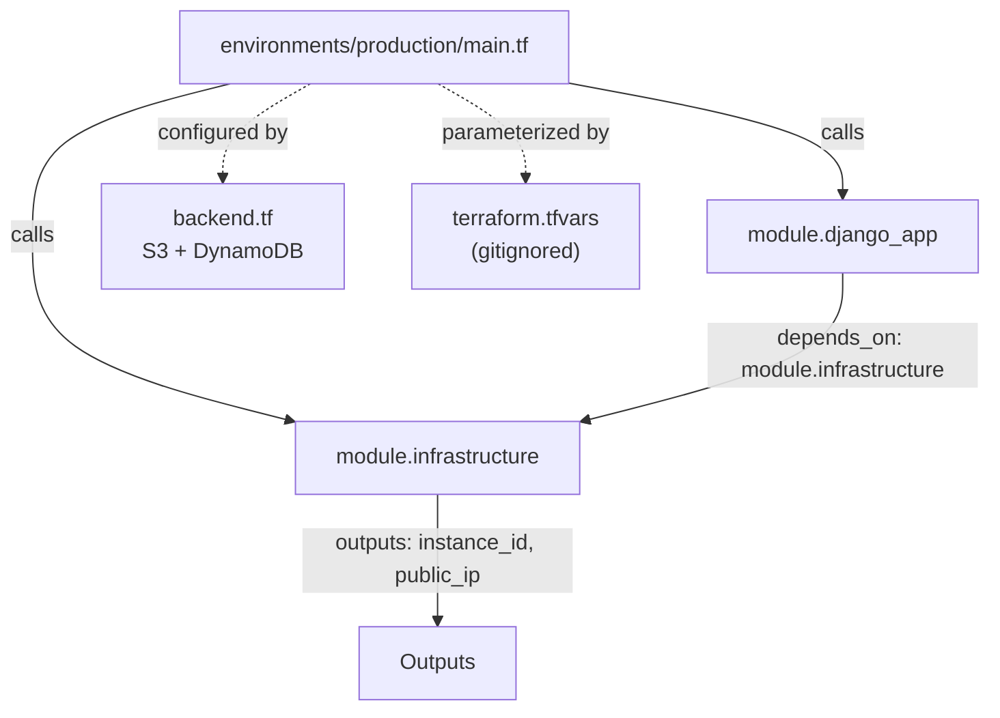

---

## Secrets Management Strategy

### Initial Setup

1. Create [AWS Secrets Manager](#glossary) secret with [SSL certificates](#glossary) and credentials
2. Store [Cloudflare](#glossary) API token securely (env var or gitignored tfvars)
3. Create [S3 backend](#glossary) bucket + enable versioning & encryption
4. Create [DynamoDB](#glossary) table for [Terraform state](#glossary) locking

### Helper Script

```bash
./scripts/init_secrets.sh production ~/secrets/secrets.json
```

### Secrets Flow

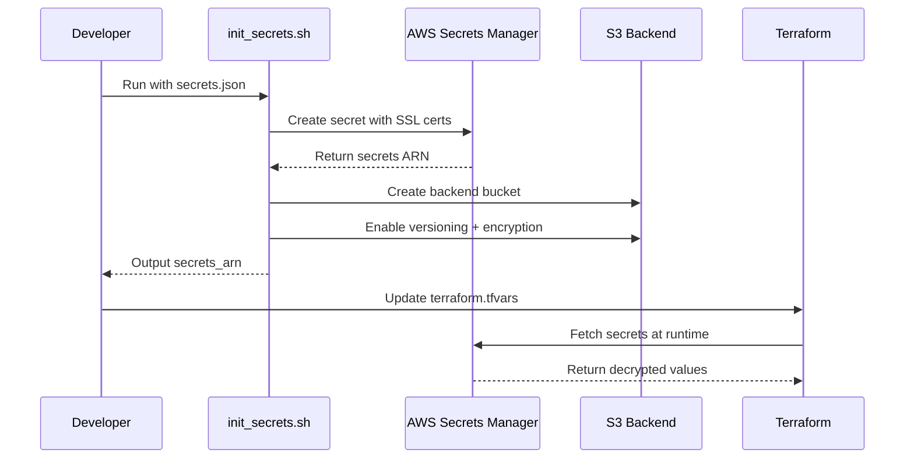

---

## Migration to New AWS/Cloudflare Account

### Steps

1. Export current [Terraform](#glossary) outputs
2. Update [AWS](#glossary) & [Cloudflare](#glossary) credentials
3. Recreate backend infrastructure ([S3](#glossary) + [DynamoDB](#glossary))
4. Initialize secrets in new account
5. Update [Terraform](#glossary) variables (zone_id, secrets_arn, ssh_key_name)
6. Apply infrastructure
7. Migrate application data
8. Update [DNS](#glossary) (if needed)
9. Destroy old infrastructure

### Account Migration Workflow

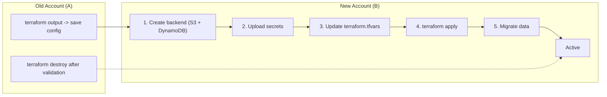

### Migration Safety Checklist

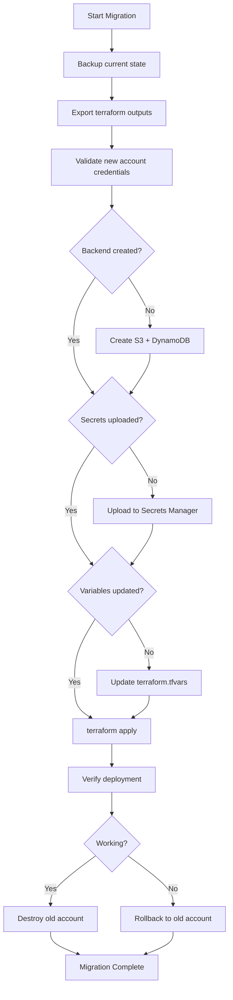

---

## Workflow Diagrams

### Initial Deployment

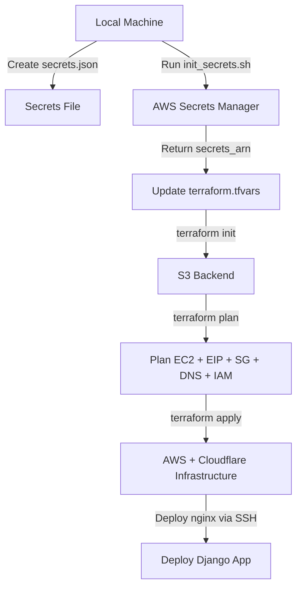

### Complete Deployment Lifecycle

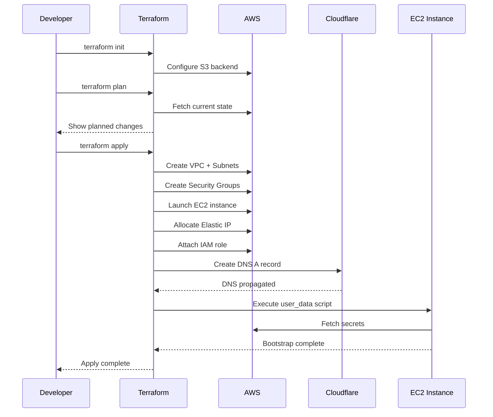

### State Locking Mechanism

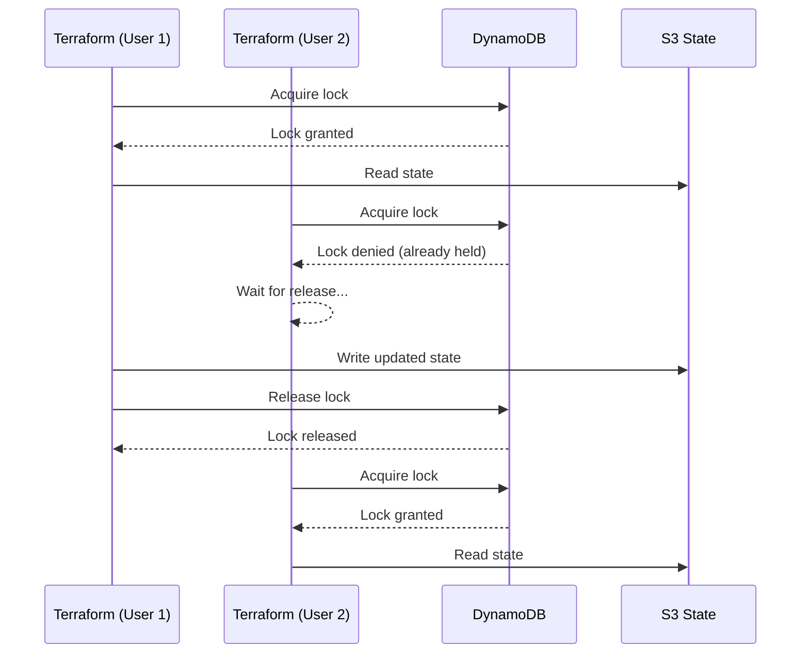

---

## Security Best Practices Applied

1. **No secrets in Git** – `.gitignore` for tfvars, secrets, .terraform
2. **Encrypted state** – [S3](#glossary) AES-256 + [DynamoDB](#glossary) locks
3. **[IAM](#glossary) least privilege** – [EC2 role](#glossary) limited to one secret
4. **Secrets rotation** – Update secret in [Secrets Manager](#glossary) + refresh [EC2](#glossary)
5. **[Cloudflare Origin Certificates](#glossary)** – only valid for traffic via [Cloudflare](#glossary)
6. **[SSH key](#glossary) management** – private keys gitignored, or use [SSM Session Manager](#glossary)
7. **Audit logging** – [CloudTrail](#glossary) + [Cloudflare](#glossary) audit logs

### Security Architecture

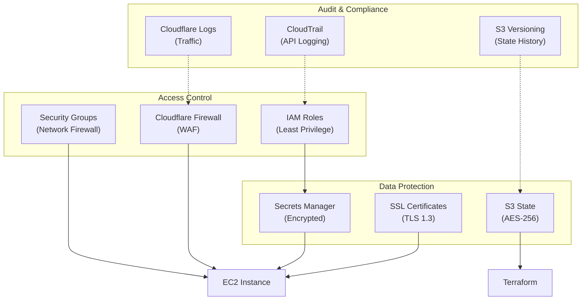

---

## Requirements Mapping

| Requirement                  | Solution                                                      |
| ---------------------------- | ------------------------------------------------------------- |
| Move everything to [Terraform](#glossary) | Infrastructure + app config managed (nginx, directories, [SSL](#glossary)) |
| Industry standards           | [S3 backend](#glossary), [Secrets Manager](#glossary), [IAM roles](#glossary), encrypted state       |
| Security-aware credentials   | [Secrets Manager](#glossary) + [IAM](#glossary), no hardcoded values, gitignored tfvars |
| Barebone config separation   | infrastructure = universal, django_app = POC-specific         |
| Account migration            | Env variables + tfvars, migration scripts                     |
| [Cloudflare](#glossary) account change    | Update token + zone_id in tfvars, reapply                     |

### Requirement Traceability

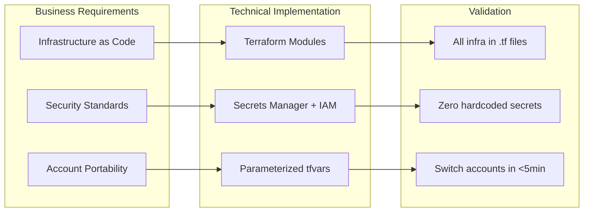

---

## Open Questions

1. [RDS](#glossary) vs Docker Postgres – optional module or keep Docker?
2. Static/Media Storage – [S3](#glossary) or local filesystem?
3. CI/CD Integration – [Terraform](#glossary) via GitHub Actions/GitLab CI?
4. Multi-Region – Need DR in second [AWS region](#glossary)?
5. [SSH](#glossary) Alternative – [AWS SSM Session Manager](#glossary)?
6. Blue/Green Deployment – Zero-downtime instance replacement?
7. Monitoring – [CloudWatch](#glossary) alarms, Datadog, or [Terraform](#glossary)-managed monitoring?

### Decision Tree for RDS vs Docker Postgres

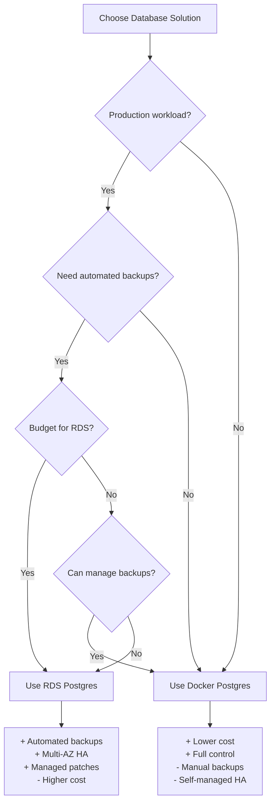

---

## Advanced Scenarios

### Multi-Environment Management

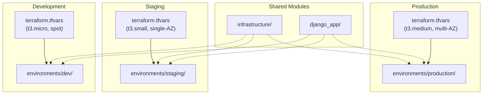

---

## Glossary

**ARN (Amazon Resource Name)**
- **Description**: A unique identifier for [AWS](#glossary) resources, formatted as `arn:aws:service:region:account-id:resource`. Used throughout [AWS](#glossary) to reference and grant access to specific resources like [Secrets Manager](#glossary) secrets, [S3](#glossary) buckets, and [IAM](#glossary) roles.
- **Use this when**: You need to reference an AWS resource in [IAM](#glossary) policies, [Terraform](#glossary) configurations, or AWS CLI commands. Every AWS resource has an ARN that uniquely identifies it.
- **Like**: A postal address for AWS resources - it tells you exactly where something lives (which service, which region, which account) and what it is.

**AWS (Amazon Web Services)**
- **Description**: Amazon's cloud computing platform providing on-demand infrastructure services including compute ([EC2](#glossary)), storage ([S3](#glossary)), databases ([RDS](#glossary)), and networking ([VPC](#glossary)). The infrastructure foundation for this entire architecture.
- **Use this when**: You need scalable, pay-as-you-go cloud infrastructure instead of managing physical servers. AWS provides global data centers with 99.99% uptime SLAs.
- **Like**: Renting fully-furnished office space with utilities included instead of building and maintaining your own building - you get all the infrastructure without the overhead.

**AWS Secrets Manager**
- **Description**: A managed service for storing, rotating, and retrieving sensitive information like database passwords, API keys, and [SSL certificates](#glossary). Integrates with [IAM](#glossary) for access control and encrypts secrets at rest using [KMS](#glossary).
- **Use this when**: You need to store credentials, API tokens, or certificates that applications must access at runtime. Never hardcode secrets in application code or [Terraform](#glossary) files.
- **Like**: A bank safety deposit box for your digital credentials - heavily secured, access-controlled, with audit logs tracking who accessed what and when.

**Cloudflare**
- **Description**: A content delivery network (CDN) and [DNS](#glossary) provider that sits between users and your origin server, providing DDoS protection, [SSL/TLS](#glossary) termination, caching, and performance optimization. Manages DNS records and routes traffic globally.
- **Use this when**: You want to protect your origin server from attacks, accelerate content delivery worldwide, and manage [DNS](#glossary) records with instant propagation. Essential for production web applications.
- **Like**: A security guard and valet service for your website - filters out bad traffic, speeds up legitimate visitors, and directs everyone to the right place.

**Cloudflare Origin Certificates**
- **Description**: Free [SSL/TLS](#glossary) certificates issued by Cloudflare specifically for encrypting traffic between Cloudflare's edge and your origin server. Only trusted by Cloudflare, not browsers, so must be used with Cloudflare's proxy enabled.
- **Use this when**: You want end-to-end encryption from browser to origin server through Cloudflare without paying for commercial certificates. Automatically renewed by Cloudflare.
- **Like**: A special key card that only works between two secure checkpoints - it proves your server's identity to Cloudflare, but the public doesn't need to trust it directly.

**CloudTrail**
- **Description**: [AWS](#glossary) service that logs all API calls made in your account, providing a complete audit trail of who did what, when, and from where. Logs are stored in [S3](#glossary) and can trigger alerts for suspicious activity.
- **Use this when**: You need compliance auditing, security monitoring, or troubleshooting to understand what changes were made to your infrastructure. Required for most security certifications.
- **Like**: A security camera system that records every action in your AWS account - you can replay exactly who unlocked which door and what they did inside.

**CloudWatch**
- **Description**: [AWS](#glossary) monitoring and observability service that collects logs, metrics, and events from AWS resources. Creates alarms for threshold breaches and visualizes performance through dashboards.
- **Use this when**: You need to monitor [EC2](#glossary) CPU usage, track application errors, set up alerts for downtime, or create operational dashboards. Essential for production monitoring.
- **Like**: A dashboard in your car showing speed, fuel level, and warning lights - it continuously monitors your infrastructure health and alerts you when something needs attention.

**DNS (Domain Name System)**
- **Description**: The internet's phone book that translates human-readable domain names (like example.com) into IP addresses that computers use to connect. [Cloudflare](#glossary) manages DNS records to route traffic to your [EC2](#glossary) instance's [Elastic IP](#glossary).
- **Use this when**: You need to point a domain name to your server's IP address. A records map domains to IPv4 addresses, AAAA records to IPv6, CNAME records create aliases.
- **Like**: A phone directory that looks up "John's Pizza" and returns the phone number - users type a memorable name, DNS returns the actual network address.

**DynamoDB**
- **Description**: [AWS](#glossary) fully-managed NoSQL database service. In this architecture, used exclusively for [Terraform state](#glossary) locking to prevent concurrent modifications. Provides consistent single-digit millisecond latency at any scale.
- **Use this when**: [Terraform](#glossary) needs to coordinate locks across multiple team members or CI/CD pipelines to prevent simultaneous state modifications that could corrupt infrastructure.
- **Like**: A turnstile at a subway entrance - only one person can go through at a time, ensuring that only one Terraform operation modifies infrastructure at any moment.

**EC2 (Elastic Compute Cloud)**
- **Description**: [AWS](#glossary) virtual server service providing resizable compute capacity. You choose instance type (CPU/RAM), operating system, storage, and networking. The foundation compute layer where applications run.
- **Use this when**: You need a virtual server to run applications, databases, or services. Choose instance types based on workload - t3.micro for dev, t3.medium for staging, c5.large for CPU-intensive production.
- **Like**: Renting an apartment with configurable size - you pick how many rooms (CPU), square footage (RAM), and location (AWS region) you need, and can resize later.

**EC2 Instance Profile**
- **Description**: An [IAM](#glossary) role attached to an [EC2](#glossary) instance that grants permissions without requiring long-term credentials. Applications running on the instance automatically receive temporary credentials to access [AWS](#glossary) services.
- **Use this when**: Your [EC2](#glossary) instance needs to access [AWS](#glossary) services like [S3](#glossary), [Secrets Manager](#glossary), or [RDS](#glossary). Much more secure than storing AWS keys on the instance.
- **Like**: An employee badge that automatically grants access to certain rooms - the instance proves who it is and gets temporary keys to access only what it needs.

**Elastic IP**
- **Description**: A static, public IPv4 address allocated to your [AWS](#glossary) account that can be attached to [EC2](#glossary) instances. Unlike regular public IPs that change when you stop/start instances, Elastic IPs remain constant.
- **Use this when**: You need a permanent IP address for [DNS](#glossary) records that won't change even if you replace the [EC2](#glossary) instance. Essential for production servers behind domain names.
- **Like**: Owning a phone number that you can transfer between devices - the number stays the same even if you upgrade your phone, just like the IP stays the same when you replace the server.

**IAM (Identity and Access Management)**
- **Description**: [AWS](#glossary) service for managing permissions and access control. Defines who (users, roles, services) can do what (actions) on which resources. Based on principle of least privilege - grant only necessary permissions.
- **Use this when**: You need to control access to AWS resources. Create roles for [EC2](#glossary) instances, policies for [S3](#glossary) bucket access, or users for team members. Central to [AWS](#glossary) security.
- **Like**: A building security system with different access badges - interns can't enter the server room, executives can access all floors, and each person only gets keys to what they need.

**KMS (Key Management Service)**
- **Description**: [AWS](#glossary) service for creating and managing encryption keys. Used by [Secrets Manager](#glossary), [S3](#glossary), and [RDS](#glossary) to encrypt data at rest. Keys never leave KMS hardware modules.
- **Use this when**: You need to encrypt sensitive data in [AWS](#glossary) services. KMS integrates automatically with most AWS services for encryption at rest with minimal configuration.
- **Like**: A master locksmith who creates unique keys for all your locks but never gives away the key-making machine itself - data is encrypted/decrypted without exposing the master keys.

**RDS (Relational Database Service)**
- **Description**: [AWS](#glossary) managed database service supporting PostgreSQL, MySQL, Oracle, and SQL Server. Automates backups, patching, scaling, and high availability with Multi-AZ deployments.
- **Use this when**: You need a production-grade relational database without managing the underlying infrastructure. RDS handles routine maintenance, backups, and failover automatically.
- **Like**: Hiring a full-time DBA who handles all database maintenance, backups, and emergencies - you just write queries and the service handles everything else.

**Remote-exec Provisioners**
- **Description**: [Terraform](#glossary) provisioners that connect to a remote machine via [SSH](#glossary) or WinRM and execute commands. Used for configuring software after infrastructure is created, like installing Nginx or uploading configuration files.
- **Use this when**: You need to perform one-time setup tasks on an [EC2](#glossary) instance that can't be handled by [user_data](#glossary) alone, such as uploading template files or running complex configuration scripts.
- **Like**: A moving company that not only delivers furniture (infrastructure) but also assembles it and arranges it in your room (application configuration).

**S3 (Simple Storage Service)**
- **Description**: [AWS](#glossary) object storage service for storing and retrieving unlimited amounts of data. In this architecture, used for storing [Terraform state](#glossary) files with versioning and encryption. Also commonly used for media files, backups, and static websites.
- **Use this when**: You need to store files, images, backups, or [Terraform state](#glossary). S3 provides 99.999999999% (11 nines) durability and supports versioning to recover from accidental deletions.
- **Like**: An infinite, fireproof filing cabinet that automatically makes copies of everything and keeps every version - you can always retrieve old versions and never run out of space.

**S3 Backend**
- **Description**: [Terraform](#glossary) backend configuration that stores [state files](#glossary) in [S3](#glossary) instead of locally. Enables team collaboration, prevents conflicts with [DynamoDB](#glossary) locking, and provides disaster recovery through versioning.
- **Use this when**: Multiple team members or CI/CD pipelines need to run [Terraform](#glossary). The backend centralizes state and prevents simultaneous modifications that could corrupt infrastructure.
- **Like**: Switching from keeping your house blueprints in a desk drawer to storing them in a bank vault with a checkout system - everyone can access them, but only one person at a time can make changes.

**Security Groups**
- **Description**: [AWS](#glossary) virtual firewall controlling inbound and outbound traffic to [EC2](#glossary) instances. Stateful rules allow traffic on specific ports/protocols from specific sources. Default deny all unless explicitly allowed.
- **Use this when**: You need to restrict network access to your [EC2](#glossary) instances. Create rules like "allow SSH from my IP", "allow HTTPS from anywhere", or "allow PostgreSQL only from app servers".
- **Like**: A bouncer at a club with a checklist - only people on the list (allowed IPs/ports) get in, and the bouncer remembers who they let in so they can leave freely (stateful).

**SSH (Secure Shell)**
- **Description**: Encrypted network protocol for secure remote access to Linux/Unix servers. Uses public-key cryptography to authenticate without passwords. The [SSH key](#glossary) pair consists of a private key (kept secret) and public key (stored on server).
- **Use this when**: You need to remotely access an [EC2](#glossary) instance to run commands, deploy applications, or troubleshoot issues. Always use key-based authentication, never passwords.
- **Like**: A special lock that needs two matching pieces - you keep one key (private) in your pocket, the server has the matching lock (public key), and they only work together.

**SSH Key**
- **Description**: Cryptographic key pair used for [SSH](#glossary) authentication. The private key stays on your local machine (never share it), while the public key is placed on the [EC2](#glossary) instance. AWS manages the public key portion.
- **Use this when**: You're launching an [EC2](#glossary) instance and need remote access. Specify the key pair name in [Terraform](#glossary), and AWS installs the public key on the instance automatically.
- **Like**: A key fob for your car - you keep the fob (private key) and the car recognizes it (public key), proving you're the owner without needing to insert a physical key.

**SSL/TLS Certificates (SSL)**
- **Description**: Digital certificates that encrypt data in transit between browsers and servers using HTTPS. Validates server identity and establishes encrypted connections. [Cloudflare Origin Certificates](#glossary) encrypt traffic between Cloudflare and your origin.
- **Use this when**: You're running a production website and need HTTPS. [Cloudflare](#glossary) provides free Universal SSL certificates for browser-to-Cloudflare, and Origin Certificates for Cloudflare-to-origin encryption.
- **Like**: A tamper-evident envelope with a wax seal - it proves who sent it (authentication) and shows if anyone opened it in transit (integrity), while keeping the contents private (encryption).

**SSM Session Manager**
- **Description**: [AWS](#glossary) Systems Manager feature that provides secure shell access to [EC2](#glossary) instances through the AWS console or CLI without requiring [SSH](#glossary) keys or open inbound ports. Sessions are logged for auditing.
- **Use this when**: You want to access [EC2](#glossary) instances without managing [SSH keys](#glossary) or exposing port 22 to the internet. Provides better security and compliance than traditional SSH.
- **Like**: A secure video call system where the company controls who can connect - you don't need to give out phone numbers (open SSH ports) or share keys, and all conversations are recorded.

**State Management (Terraform State)**
- **Description**: [Terraform](#glossary) tracks infrastructure in a state file mapping resources to real-world objects. The state file records what exists, enabling [Terraform](#glossary) to calculate what changes are needed. Must be stored securely and locked during modifications.
- **Use this when**: You're using [Terraform](#glossary) to manage infrastructure. The state file is critical - losing it means [Terraform](#glossary) forgets what it created. Always use [S3 backend](#glossary) with versioning and [DynamoDB](#glossary) locking in production.
- **Like**: A store's inventory system that tracks what's on the shelves - without it, you don't know what you have, what you need to order, or what's changed since yesterday.

**Terraform**
- **Description**: Open-source infrastructure as code tool by HashiCorp. Declare desired infrastructure state in HCL (HashiCorp Configuration Language), and [Terraform](#glossary) automatically creates, updates, or destroys resources to match. Supports [AWS](#glossary), [Cloudflare](#glossary), and 3000+ providers.
- **Use this when**: You need repeatable, version-controlled infrastructure deployments. [Terraform](#glossary) makes infrastructure auditable, testable, and portable across cloud providers with declarative configuration files.
- **Like**: A smart contractor who reads your blueprints (Terraform files), figures out what needs to be built or changed, and does exactly that work - no more, no less.

**User Data**
- **Description**: Scripts that run automatically when an [EC2](#glossary) instance launches for the first time. Written in bash or cloud-init format. Commonly used for installing software, configuring services, or fetching secrets from [Secrets Manager](#glossary).
- **Use this when**: You need to automate initial server setup like installing Docker, configuring firewall rules, or downloading application code. Runs as root during the first boot sequence.
- **Like**: A recipe card that comes with furniture - when you first unbox it (launch the instance), follow these step-by-step instructions to assemble (configure) it correctly.

**VPC (Virtual Private Cloud)**
- **Description**: Logically isolated section of the [AWS](#glossary) network where you launch resources. Includes subnets (public/private), route tables, internet gateways, and NAT gateways. Provides network-level isolation and control.
- **Use this when**: You need to control network topology, IP addressing, and routing for your [AWS](#glossary) resources. Production architectures typically use multiple subnets across availability zones for high availability.
- **Like**: Your own private neighborhood within a city - you control the street layout, who can enter through the gates, and how residents connect to the outside world.

**AWS Region**
- **Description**: Geographical location containing multiple isolated data centers (availability zones). Each region is completely independent with its own infrastructure. Common regions include us-east-1 (Virginia), eu-west-1 (Ireland), ap-southeast-1 (Singapore).
- **Use this when**: You need to choose where your [EC2](#glossary) instances, [S3](#glossary) buckets, and [RDS](#glossary) databases physically reside. Consider latency to users, data residency laws, and disaster recovery requirements.
- **Like**: Choosing which city to open a retail store - you pick based on where your customers are, local regulations, and whether you want backup stores in other cities.

**EC2 Role**
- **Description**: An [IAM](#glossary) role specifically designed to be assumed by [EC2](#glossary) instances via [instance profiles](#glossary). Grants temporary credentials to applications running on the instance without storing long-term AWS keys.
- **Use this when**: Your application on [EC2](#glossary) needs to access [AWS](#glossary) services. Attach the role to the [instance profile](#glossary), and applications automatically receive rotating credentials.
- **Like**: A staff badge that security guards recognize - the person (EC2 instance) wears it and automatically gets access to authorized areas (AWS services) without carrying individual room keys.

**Secrets Manager (AWS Secrets Manager)**
- **Description**: See [AWS Secrets Manager](#glossary) above. Mentioned separately as it's commonly referenced by this shorthand name.
- **Use this when**: See [AWS Secrets Manager](#glossary) above.
- **Like**: See [AWS Secrets Manager](#glossary) above.

