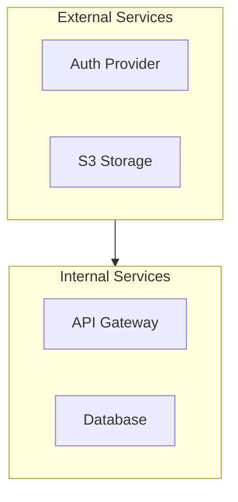

# Learning Resources Repository - Claude Instructions

## Repository Purpose

This is a curated collection of technical documentation covering data engineering, system design, infrastructure, and software architecture. All documents follow strict quality standards for professional technical documentation.

---

## Documentation Standards

### Required Components for Every Document

Every technical document in this repository MUST include:

#### 1. Executive Summary
- **Location**: Immediately after the main title
- **Length**: Scaled to document size
  - Brief docs (< 500 lines): 2-3 sentences
  - Medium docs (500-1000 lines): 1 paragraph (4-6 sentences)
  - Comprehensive docs (> 1000 lines): 2-3 paragraphs
- **Content**: High-level overview of the document's scope, key findings, and value proposition
- **Format**: Plain paragraph(s) with key terms linked to glossary

#### 2. Mermaid Diagrams
- **Minimum**: 5-15 diagrams per document depending on complexity
- **Types Required**:
  - Architecture flowcharts (using `flowchart TB` for top-bottom, `LR` for left-right)
  - Sequence diagrams for workflows and interactions
  - Component diagrams for system architecture
  - State diagrams where applicable
  - Comparison diagrams for technology evaluations
- **Critical Syntax Rules**:
  ```mermaid
  flowchart TB
      A["Node with (special) characters: must use quotes"]
      B["Another node - with / special : characters"]
      C[SimpleNode]

      A -->|"Edge label (with special chars)"| B
      B --> C
  ```
  - **ALWAYS wrap node labels containing special characters in double quotes**: `() / : , -`
  - Use subgraphs for logical grouping
  - Add environment boundaries (dev/staging/prod) where relevant
  - Use consistent color themes
- **Placement**: Strategic locations throughout the document to support understanding

#### 3. Comprehensive Glossary
- **Location**: End of document (before references/sources)
- **Format**: Markdown definition list (NOT table format)
  ```markdown
  ### Term Name
  - **Description**: Clear, concise technical definition with context
  - **Use this when**: Real-world practical scenario or decision criteria
  - **Like**: Useful analogy or simile for understanding
  ```
- **Coverage**: ALL technical terms, acronyms, tools, concepts, and technologies mentioned
- **Organization**: Alphabetically organized (A-Z sections for large glossaries)
- **Anchor**: Section must have `{#glossary}` or `## Glossary` heading for linking

#### 4. Glossary Term Linking
- **Rule**: Link EVERY occurrence of glossary terms to `#glossary`
- **Format**: `[term](#glossary)` or `[Term](#glossary)`
- **Scope**: Throughout entire document including:
  - Executive summary
  - Section headings
  - Body paragraphs
  - Lists and bullet points
  - Diagram descriptions
  - Code comments where appropriate
- **Example**:
  ```markdown
  The [Apache Iceberg](#glossary) table format provides [ACID](#glossary)
  transactions on [S3](#glossary) object storage through a hierarchical
  [metadata](#glossary) layer.
  ```

---

## README Maintenance Standards

### Developer Profile Section

**Location**: Top of README after repository description

**Content Requirements**:
- Based on actual document contents in the repository
- Describes a senior engineer profile reflecting the expertise demonstrated
- Includes:
  - **Core Competencies** (5-7 key areas with specific technologies)
  - **Engineering Philosophy** (design principles and values)
  - **Technical Depth** (breadth and mastery demonstrated)
  - **Target Role** (appropriate seniority level)

**How to Generate/Update**:

Use grep to extract all executive summaries from documents:
```bash
# Extract executive summaries from all documents
for file in *.md; do
  echo "=== $file ==="
  sed -n '/## Executive Summary/,/^##[^#]/p' "$file" | head -n -1
done
```

**Analysis Steps**:
1. Read all extracted executive summaries
2. Identify technical domains covered (e.g., data engineering, cloud infrastructure, auth systems)
3. Extract specific technologies mentioned (e.g., Apache Kafka, Terraform, OAuth2)
4. Note architectural patterns and design principles emphasized
5. Assess technical depth based on complexity and breadth of topics
6. Update the Developer Profile to reflect the consolidated expertise

**Update When**:
- Adding documents in new technical domains
- Significant expansion of existing domain coverage
- After major content updates to existing documents

### Document Index Entry Format

**Template for Each Document**:
```markdown
#### [FileName.md](./FileName.md)
**Document Title: Descriptive Subtitle**
*X diagrams | Y glossary terms*

Comprehensive paragraph summarizing the document's scope, key topics covered,
unique value proposition, and target audience. Should be 3-5 sentences that
give readers enough context to decide if they need to read the full document.

**Key Topics:** comma, separated, list, of, 8-12, main, concepts, and, technologies, covered
**[View Document](./FileName.md)** | [Glossary](#glossary-anchor) | [Architecture Diagrams](#diagram-section)

---
```

**Required Elements**:
1. Document link (relative path)
2. Bold title with descriptive subtitle
3. Italic metadata line (diagram count, glossary term count)
4. 3-5 sentence summary paragraph
5. Key Topics line with specific terms
6. Navigation links: View Document, Glossary, key diagram sections

### Repository Summary Section

**Location**: After document index, before update log

**Required Statistics**:
- Total documents count
- Total Mermaid diagrams count (sum across all docs)
- Total glossary terms count (sum across all docs)
- Total glossary links count (sum across all docs)
- Total lines of content (approximate)

**Category Breakdowns**:
- Group documents by category (Data Engineering, System Design, Tools, etc.)
- List diagram count per category
- List glossary term count per category
- List key topics covered per category

**Quality Standards Checklist**:
- Executive Summary
- Valid Mermaid Diagrams
- Comprehensive Glossary
- Complete Cross-Referencing
- Professional Structure

### Update Log

**Format**:
```markdown
| Date | Action | Documents |
|------|--------|-----------|
| YYYY-MM-DD | Description of work | Affected documents or "All documents" |
```

**Update When**: Any significant change to repository structure or content

---

## Adding New Documents

### Checklist for New Document Addition

1. **Create Document**:
   - Use PascalCase naming (e.g., `NewTopicName.md`)
   - Add executive summary
   - Include 5-15 Mermaid diagrams
   - Create comprehensive glossary
   - Link all term occurrences to glossary

2. **Update README**:
   - Add document entry in appropriate category section
   - Update progress tracker counts
   - Update repository summary statistics
   - Add entry to update log
   - Update developer profile if new domain expertise demonstrated

3. **Validate Quality**:
   - All Mermaid diagrams render correctly in GitHub
   - All glossary links work (click to glossary section)
   - Executive summary accurately represents content
   - Key topics list is complete
   - Navigation links are valid

---

## File Naming Conventions

- **Documents**: PascalCase with descriptive names
  - Good: `DataPipelineSystemDesign.md`
  - Bad: `data-pipeline-design.md`, `pipeline_design.md`
- **Special Cases**: Acronyms stay uppercase
  - Good: `BMADMethod.md`, `SupabaseB2CSystemDesign.md`
  - Bad: `BmadMethod.md`, `SupabaseB2cSystemDesign.md`

---

## Mermaid Diagram Guidelines (Critical)

### Node Label Quoting Rules

**ALWAYS quote labels with special characters**:
```mermaid
flowchart TB
    Good["Service Mesh (Envoy)"]
    AlsoGood["API Gateway: /api/v1"]
    StillGood["Database - PostgreSQL"]

    Bad[Service Mesh (Envoy)]  ❌ Will break!
    Wrong[API Gateway: /api/v1]  ❌ Will break!
```

**Special characters requiring quotes**: `( ) / : , -`

### Preferred Diagram Types

1. **Architecture**: `flowchart TB` with subgraphs
2. **Workflows**: `sequenceDiagram` with participants
3. **State Changes**: `stateDiagram-v2`
4. **Data Models**: `erDiagram` (when appropriate)
5. **Comparisons**: Side-by-side flowcharts

### Subgraph Usage



---

## Glossary Best Practices

### Term Selection Criteria

Include terms for:
- ✅ Technologies and tools (Apache Kafka, Terraform, Snowflake)
- ✅ Concepts and patterns (Event Sourcing, CQRS, Service Mesh)
- ✅ Acronyms (ACID, MVCC, RLS, JWT, SSO)
- ✅ Architecture components (Control Plane, Data Plane)
- ✅ Protocols and standards (OAuth2, OIDC, mTLS)
- ✅ Specific implementations (CeleryExecutor, KubernetesExecutor)

### Writing Good Definitions

**Description**:
- Start with what it IS
- Explain how it works (briefly)
- Mention key characteristics
- Include version info if relevant

**Use this when**:
- Specific decision criteria
- Problem it solves
- Use case scenarios
- When to choose over alternatives

**Like**:
- Relatable everyday analogy
- Comparison to simpler concept
- Metaphor for understanding
- "It's like X but for Y" patterns

### Example Entry

```markdown
### Apache Kafka
- **Description**: Distributed event streaming platform that provides durable,
  ordered logs (topics) partitioned for horizontal scalability. Supports
  millions of messages per second with millisecond latency. Messages are
  retained based on time or size policies, enabling replay and multiple
  consumer groups reading the same data independently.
- **Use this when**: You need high-throughput event streaming (>100K msgs/sec),
  multiple independent consumers reading the same events, event replay for
  reprocessing or debugging, or building event-sourced systems where audit
  history is critical. Choose over message queues when durability and replay
  matter more than simplicity.
- **Like**: A company-wide append-only ledger where every transaction is
  recorded permanently, and different departments can independently read and
  process the same transactions at their own pace without affecting others.
```

---

## Quality Validation Checklist

Before marking a document as complete, verify:

### Document Quality
- [ ] Executive summary present and appropriate length
- [ ] Minimum diagram count met (5-15 based on complexity)
- [ ] All Mermaid diagrams render without errors
- [ ] All diagram labels with special chars are quoted
- [ ] Glossary present with 20+ terms minimum
- [ ] Glossary uses definition list format (not tables)
- [ ] All term occurrences linked to glossary
- [ ] Navigation links work correctly

### README Quality
- [ ] Document entry added in correct category
- [ ] Entry includes all required elements
- [ ] Summary paragraph is 3-5 sentences
- [ ] Key topics list is comprehensive
- [ ] Progress tracker updated accurately
- [ ] Repository statistics updated
- [ ] Update log entry added
- [ ] Developer profile reflects new expertise (if applicable)

### GitHub Rendering
- [ ] Document displays correctly in GitHub preview
- [ ] All Mermaid diagrams render in GitHub
- [ ] All internal links work in GitHub
- [ ] README displays correctly in GitHub
- [ ] TOC links work (if present)

---

## Common Pitfalls to Avoid

### Mermaid Diagram Errors
❌ **Don't**: Use parentheses without quotes
```mermaid
A[Service (Production)]  // BREAKS!
```

✅ **Do**: Always quote special characters
```mermaid
A["Service (Production)"]  // Works!
```

### Glossary Mistakes
❌ **Don't**: Use table format
```markdown
| Term | Definition |
|------|------------|
```

✅ **Do**: Use definition list format
```markdown
### Term
- **Description**: ...
- **Use this when**: ...
- **Like**: ...
```

### Linking Errors
❌ **Don't**: Link to non-existent anchors
```markdown
[See glossary](#glossary-section)  // Wrong anchor!
```

✅ **Do**: Link to actual heading anchor
```markdown
[See glossary](#glossary)  // Correct!
```

### README Mistakes
❌ **Don't**: Add vague summaries
```markdown
"This document covers data pipelines."
```

✅ **Do**: Provide specific, informative summaries
```markdown
"Deep dive into data pipeline orchestration comparing Airflow, Prefect,
Dagster, and Temporal. Covers architecture patterns, failure modes, state
management, idempotency, backfill strategies, and multi-tenancy."
```

---

## Example Workflow: Adding a New Document

### Step 1: Create Document Structure
```markdown
# Document Title

## Executive Summary
[2-3 paragraphs for comprehensive docs]

## Table of Contents
[Optional but recommended for long docs]

## Section 1: Introduction
[Content with Mermaid diagrams]

## Section 2: Architecture
[Content with more diagrams]

[... more sections ...]

## Glossary

### Term 1
- **Description**: ...
- **Use this when**: ...
- **Like**: ...

[... more terms ...]

## References
[Sources, links, citations]
```

### Step 2: Add Diagrams
- Place diagrams strategically throughout
- Use appropriate diagram types
- Quote all special characters
- Add descriptive captions

### Step 3: Create Glossary
- Extract all technical terms
- Write comprehensive definitions
- Alphabetize for easy lookup
- Use consistent format

### Step 4: Link Terms
- Search for each glossary term
- Add `[term](#glossary)` links
- Link ALL occurrences

### Step 5: Update README
- Add document entry with full summary
- Update progress tracker
- Update statistics
- Add update log entry

### Step 6: Validate
- Preview in GitHub
- Check all diagrams render
- Test all links
- Verify formatting

---

## Maintenance Commands

### Counting Diagrams
```bash
grep -c '```mermaid' DocumentName.md
```

### Counting Glossary Terms
```bash
grep -c '^### ' DocumentName.md | tail -n +2  # After glossary section
```

### Finding Unlinked Terms
```bash
# Manual review recommended - search for term occurrences without []()
```

### Validating Mermaid Syntax
- Use GitHub preview
- Use Mermaid Live Editor: https://mermaid.live
- Check for unquoted special characters

---

## Contact and Updates

When making changes to documentation standards:
1. Update this CLAUDE.md file first
2. Apply changes to existing documents if needed
3. Update README to reflect new standards
4. Document changes in update log

**Last Updated**: 2026-01-01
**Current Standards Version**: 1.0
**Total Documents**: 15 (100% compliant)
