# Centralized Authentication Infrastructure Guide
## For Startup Ecosystems: From Fragmented Auth to Unified SSO

> **Purpose**: A learning resource and implementation guide for small startups needing to centralize authentication. Covers delegated login, auth flows, API keys, MFA, and cross-app session management (no re-login required) across an ecosystem of small apps. Implementation patterns include sidecar, reverse proxy, or hybrid approaches to enable SSO compliance.

---

# Table of Contents

1. [Architecture Overview](#1-architecture-overview)
2. [Technology Selection](#2-technology-selection)
3. [Sidecar Pattern Deep Dive](#3-sidecar-pattern-deep-dive)
4. [Reverse Proxy Pattern Deep Dive](#4-reverse-proxy-pattern-deep-dive)
5. [SSO Implementation](#5-sso-implementation)
6. [Credentials System](#6-credentials-system)
7. [Migration Playbook](#7-migration-playbook)
8. [Configuration Examples](#8-configuration-examples)
9. [Operational Runbook](#9-operational-runbook)

---

# 1. Architecture Overview

> **Context Box**
> 
> | Aspect | Details |
> |--------|---------|
> | **Assumptions** | Kubernetes cluster running, Postgres available, team has basic container experience |
> | **Scenario** | 5 apps today, growing to 10; mix of SPAs, SSR apps, mobile, and internal tools |
> | **What's Provided** | Managed K8s, managed Postgres, DNS control over primary domain |
> | **What We Build** | Identity layer, session management, auth gateway, integration patterns |

## 1.1 High-Level Architecture

```mermaid
flowchart TB
    subgraph Clients ["Clients (Gray)"]
        style Clients fill:#f5f5f5,stroke:#999
        Browser["🌐 Browser"]
        Mobile["📱 Mobile App"]
        CLI["💻 CLI / Scripts"]
        Partner["🔗 Partner Systems"]
    end

    subgraph Gateway ["Auth Gateway Layer (Purple)"]
        style Gateway fill:#e2d5f1,stroke:#9370db
        Traefik["Traefik Ingress<br/>+ ForwardAuth"]
        RateLimit["Rate Limiter"]
    end

    subgraph Identity ["Identity Layer (Green)"]
        style Identity fill:#d4edda,stroke:#28a745
        Kratos["Ory Kratos<br/>Identity & Auth"]
        Oathkeeper["Ory Oathkeeper<br/>Access Proxy"]
        Hydra["Ory Hydra<br/>OAuth2/OIDC<br/>(Cross-domain SSO)"]
    end

    subgraph Storage ["Data Stores"]
        Postgres[("Postgres<br/>Identities, Sessions")]
        Redis[("Redis/Upstash<br/>Session Cache")]
    end

    subgraph Apps ["Your Applications (Blue)"]
        style Apps fill:#cce5ff,stroke:#007bff
        WebApp["Web App<br/>(SPA)"]
        AdminApp["Admin Portal<br/>(SSR)"]
        API["Public API"]
        InternalAPI["Internal Services"]
    end

    subgraph External ["External Providers (Orange)"]
        style External fill:#fff3cd,stroke:#ffc107
        Google["Google OAuth"]
        GitHub["GitHub OAuth"]
        SMTP["Email Provider"]
    end

    Browser --> Traefik
    Mobile --> Traefik
    CLI --> Traefik
    Partner --> Traefik
    
    Traefik --> RateLimit
    RateLimit --> Oathkeeper
    
    Oathkeeper --> Kratos
    Oathkeeper --> WebApp
    Oathkeeper --> AdminApp
    Oathkeeper --> API
    Oathkeeper --> InternalAPI
    
    Kratos --> Hydra
    Kratos --> Postgres
    Kratos --> Redis
    Kratos --> Google
    Kratos --> GitHub
    Kratos --> SMTP
    
    Hydra --> Postgres
```



## 1.2 Component Responsibilities Matrix

| Component | Primary Role | Handles | Does NOT Handle |
|-----------|--------------|---------|-----------------|
| **Ory Kratos** | Identity Provider | User registration, login, MFA, password reset, social login, session management | Authorization decisions, token validation at edge |
| **Ory Oathkeeper** | Access Proxy | Request authentication, token validation, header injection, route protection | User management, login flows |
| **Ory Hydra** | OAuth2/OIDC Server | Cross-domain SSO, third-party OAuth clients, token issuance | Direct user authentication (delegates to Kratos) |
| **Traefik** | Ingress Controller | SSL termination, routing, rate limiting, ForwardAuth integration | Authentication logic |
| **Redis** | Session Cache | Fast session lookups, rate limit counters | Persistent session storage (Postgres is source of truth) |
| **Postgres** | Persistent Store | Identity data, sessions, credentials, audit logs | High-frequency reads (use Redis cache) |

## 1.3 Decision Framework: Sidecar vs Proxy vs SDK

```mermaid
flowchart TD
    Start["New App Needs Auth"] --> Q1{"App modifiable?"}
    
    Q1 -->|"No (legacy/vendor)"| Proxy["Use Reverse Proxy<br/>Pattern"]
    Q1 -->|"Yes"| Q2{"Needs fine-grained<br/>authorization?"}
    
    Q2 -->|"Yes (per-resource)"| SDK["Use SDK/Library<br/>in App"]
    Q2 -->|"No (route-level)"| Q3{"Multiple apps on<br/>same domain?"}
    
    Q3 -->|"Yes"| Proxy
    Q3 -->|"No / Single app"| Q4{"Team prefers<br/>infrastructure vs code?"}
    
    Q4 -->|"Infrastructure"| Sidecar["Use Sidecar<br/>Pattern"]
    Q4 -->|"Code"| SDK
    
    Proxy --> Note1["✓ Centralized config<br/>✓ One place to debug<br/>⚠ Single point of failure"]
    Sidecar --> Note2["✓ App isolation<br/>✓ Independent scaling<br/>⚠ More resource overhead"]
    SDK --> Note3["✓ Most flexible<br/>✓ Complex authz logic<br/>⚠ Requires code changes"]

    style Proxy fill:#e2d5f1,stroke:#9370db
    style Sidecar fill:#e2d5f1,stroke:#9370db
    style SDK fill:#cce5ff,stroke:#007bff
```



**Quick Reference:**

| Pattern | Best For | Avoid When |
|---------|----------|------------|
| **Reverse Proxy** | Multiple apps, legacy apps, consistent policy | Apps need different auth logic per endpoint |
| **Sidecar** | Kubernetes, service mesh, app isolation | Resource-constrained environments |
| **SDK/Library** | Complex authorization, feature flags, gradual rollout | Team lacks auth expertise |

## 1.4 Core Data Flows

### Login Flow (Simplified)


### Logout Flow (All Devices)


---

# 2. Technology Selection

> **Context Box**
> 
> | Aspect | Details |
> |--------|---------|
> | **Assumptions** | Budget-conscious, prefer OSS, need escape hatch from vendor lock-in |
> | **Scenario** | Evaluating IdP, gateway, session store, and sidecar components |
> | **Constraints** | Must support 1K-100K users, handle 10M requests/month at peak |

## 2.1 Identity Provider Comparison

| Criteria | Supabase Auth | Ory Kratos | Keycloak | Auth0 |
|----------|---------------|------------|----------|-------|
| **Cost (100K users)** | $25/mo | $0 (self-host) | $0 (self-host) | $1,500+/mo |
| **Self-host Option** | ❌ No | ✅ Yes | ✅ Yes | ❌ No |
| **Social Login** | ✅ Easy | ✅ Config-based | ✅ Admin UI | ✅ Easy |
| **MFA/TOTP** | ✅ Built-in | ✅ Built-in | ✅ Built-in | ✅ Built-in |
| **Passwordless** | ✅ Magic link | ✅ Configurable | ⚠️ Plugin | ✅ Built-in |
| **Session Management** | ⚠️ Basic | ✅ Advanced | ✅ Advanced | ✅ Advanced |
| **Custom Flows** | ⚠️ Limited | ✅ Full control | ✅ Full control | ⚠️ Actions |
| **K8s Native** | ❌ SaaS only | ✅ Helm charts | ✅ Operator | ❌ SaaS only |
| **Learning Curve** | Low | Medium | High | Low |
| **Vendor Lock-in** | Medium | None | None | High |

## 2.2 API Gateway Comparison

| Criteria | Traefik | Kong | Envoy | NGINX |
|----------|---------|------|-------|-------|
| **Auth Plugin Ecosystem** | ✅ ForwardAuth | ✅ Rich plugins | ✅ Ext authz | ⚠️ Basic |
| **K8s Integration** | ✅ Native CRDs | ✅ Ingress Controller | ✅ Service mesh | ⚠️ Ingress only |
| **Config Complexity** | Low | Medium | High | Low |
| **Dynamic Config** | ✅ Hot reload | ✅ Admin API | ✅ xDS | ⚠️ Reload required |
| **Resource Usage** | Low | Medium | Medium | Low |
| **OSS Features** | ✅ Complete | ⚠️ Enterprise features | ✅ Complete | ✅ Complete |

## 2.3 Recommended Stack

```mermaid
flowchart LR
    subgraph Stack["Recommended Stack"]
        direction TB
        
        subgraph IdP["Identity Provider"]
            Kratos["Ory Kratos<br/>───────────<br/>• OSS, self-hostable<br/>• Cloud-native<br/>• No per-user pricing<br/>• Exportable data"]
        end
        
        subgraph Proxy["Access Proxy"]
            Oathkeeper["Ory Oathkeeper<br/>───────────<br/>• Purpose-built for Kratos<br/>• Route protection<br/>• Header injection<br/>• Sidecar or centralized"]
        end
        
        subgraph OAuth["OAuth2 Server"]
            Hydra["Ory Hydra<br/>───────────<br/>• Cross-domain SSO<br/>• Third-party OAuth<br/>• Skip if same domain"]
        end
        
        subgraph Ingress["Ingress"]
            Traefik["Traefik<br/>───────────<br/>• K8s native<br/>• ForwardAuth middleware<br/>• Let's Encrypt HTTPS"]
        end
        
        subgraph Session["Session Store"]
            Store["Postgres + Redis<br/>───────────<br/>• Postgres: durability<br/>• Redis: fast validation<br/>• Upstash: serverless"]
        end
    end
    
    Kratos --> Oathkeeper
    Oathkeeper --> Hydra
    Traefik --> Oathkeeper
    Kratos --> Store
    
    style IdP fill:#d4edda,stroke:#28a745
    style Proxy fill:#e2d5f1,stroke:#9370db
    style OAuth fill:#cce5ff,stroke:#007bff
    style Ingress fill:#fff3cd,stroke:#ffc107
    style Session fill:#f5f5f5,stroke:#999
```



## 2.4 Cost Projection

| Component | Free Tier | At 10K Users | At 100K Users |
|-----------|-----------|--------------|---------------|
| Ory Kratos (self-host) | $0 | ~$50/mo (compute) | ~$150/mo |
| Traefik | $0 | $0 | $0 |
| Postgres (Neon) | 0.5 GB free | ~$20/mo | ~$70/mo |
| Redis (Upstash) | 10K cmd/day | ~$10/mo | ~$50/mo |
| **Total** | **$0** | **~$80/mo** | **~$270/mo** |

*Compare: Auth0 at 100K users = $1,500-3,000/mo*

## 2.5 Links to Official Documentation

| Component | Documentation | Helm Chart |
|-----------|---------------|------------|
| Ory Kratos | [ory.sh/docs/kratos](https://www.ory.sh/docs/kratos) | [k8s.ory.sh/helm](https://k8s.ory.sh/helm/) |
| Ory Oathkeeper | [ory.sh/docs/oathkeeper](https://www.ory.sh/docs/oathkeeper) | Included above |
| Ory Hydra | [ory.sh/docs/hydra](https://www.ory.sh/docs/hydra) | Included above |
| Traefik | [doc.traefik.io](https://doc.traefik.io/traefik/) | [helm.traefik.io](https://helm.traefik.io/traefik) |

---

# 3. Sidecar Pattern Deep Dive

> **Context Box**
> 
> | Aspect | Details |
> |--------|---------|
> | **Assumptions** | Running on Kubernetes, each app is a Deployment |
> | **Scenario** | App cannot/should not handle auth internally; offload to sidecar |
> | **What's Provided** | Oathkeeper container image, Kratos running in cluster |
> | **What We Build** | Pod configuration, access rules, header mapping |

## 3.1 Pod Architecture


**Key Points:**
- Ingress routes to sidecar port (4455), NOT app port
- App only accessible via localhost within pod
- Sidecar validates session BEFORE forwarding
- App receives pre-validated requests with user context headers

## 3.2 Request Flow: Unauthenticated User


## 3.3 Request Flow: Authenticated User


## 3.4 Request Flow: Expired Session


## 3.5 Headers Passed to Application

| Header | Source | Example | Usage |
|--------|--------|---------|-------|
| `X-User-ID` | session.identity.id | `a1b2c3d4-...` | Primary user identifier |
| `X-User-Email` | session.identity.traits.email | `user@example.com` | Display, notifications |
| `X-User-Roles` | session.identity.metadata.roles | `user,admin` | Authorization decisions |
| `X-User-Verified` | session.identity.verifiable_addresses | `true` | Email verification status |
| `X-Session-ID` | session.id | `sess_xyz123` | Logging, audit |
| `X-Auth-Time` | session.authenticated_at | `2024-01-15T10:30:00Z` | Step-up auth decisions |

> ⚠️ **Security Warning**: Your app must TRUST these headers unconditionally because they come from the sidecar. Ensure the app is NOT directly accessible (only via sidecar port).

## 3.6 Access Rules Configuration

```yaml
# oathkeeper-rules.yaml (conceptual)
access_rules:
  # Public endpoints - no auth required
  - match:
      url: "<https://app.company.com/health>"
      methods: ["GET"]
    authenticators: [{ handler: noop }]
    authorizer: { handler: allow }
    mutators: [{ handler: noop }]

  # Protected endpoints - session required
  - match:
      url: "<https://app.company.com/dashboard>**"
      methods: ["GET", "POST"]
    authenticators:
      - handler: cookie_session
        config:
          check_session_url: "http://kratos:4433/sessions/whoami"
          preserve_path: true
    authorizer: { handler: allow }
    mutators:
      - handler: header
        config:
          headers:
            X-User-ID: "{{ print .Subject }}"
            X-User-Email: "{{ print .Extra.identity.traits.email }}"

  # API endpoints - bearer token or session
  - match:
      url: "<https://api.company.com/>**"
      methods: ["GET", "POST", "PUT", "DELETE"]
    authenticators:
      - handler: bearer_token
        config:
          check_session_url: "http://kratos:4433/sessions/whoami"
      - handler: cookie_session
        config:
          check_session_url: "http://kratos:4433/sessions/whoami"
    authorizer: { handler: allow }
    mutators:
      - handler: header
```

## 3.7 Health Checks and Failure Modes

```mermaid
flowchart TB
    subgraph HealthChecks ["Health Check Strategy"]
        direction LR
        
        Liveness["Liveness Probe<br/>/health/alive<br/>Sidecar process running?"]
        Readiness["Readiness Probe<br/>/health/ready<br/>Can reach Kratos?"]
    end
    
    subgraph FailureModes ["Failure Modes"]
        direction TB
        
        F1["Kratos Unreachable"]
        F1A["→ Sidecar returns 503"]
        F1B["→ Readiness fails, pod removed from service"]
        
        F2["Redis Unavailable"]
        F2A["→ Falls back to direct Kratos calls"]
        F2B["→ Higher latency, but functional"]
        
        F3["Sidecar Crashes"]
        F3A["→ Liveness fails, pod restarted"]
        F3B["→ Brief downtime for this pod only"]
    end
    
    Liveness --> F3
    Readiness --> F1
    Readiness --> F2
```



## 3.8 Resource Requirements

| Scenario | Sidecar CPU | Sidecar Memory | Notes |
|----------|-------------|----------------|-------|
| Low traffic (<100 rps) | 50m | 64Mi | Minimal footprint |
| Medium traffic (100-1K rps) | 100m | 128Mi | Standard config |
| High traffic (1K+ rps) | 250m | 256Mi | Consider caching |

**Pod Total Overhead:**
- Each pod adds ~50-250m CPU, ~64-256Mi memory for auth
- For 10 pods = 0.5-2.5 CPU cores, 640Mi-2.5Gi memory cluster-wide
- Trade-off: this vs. auth code in every app

---

# 4. Reverse Proxy Pattern Deep Dive

> **Context Box**
> 
> | Aspect | Details |
> |--------|---------|
> | **Assumptions** | Multiple apps behind single ingress, shared auth policy |
> | **Scenario** | Central gateway validates all requests before routing to backends |
> | **What's Provided** | Traefik with ForwardAuth, Oathkeeper as auth service |
> | **What We Build** | Gateway configuration, routing rules, backend integration |

## 4.1 Network Topology

```mermaid
flowchart TB
    subgraph Internet ["Internet"]
        Browser["🌐 Browsers"]
        Mobile["📱 Mobile Apps"]
        APIClients["🔗 API Clients"]
    end
    
    subgraph Edge ["Edge Layer"]
        LB["Cloud Load Balancer<br/>SSL Termination"]
    end
    
    subgraph Gateway ["Gateway Layer (Purple)"]
        style Gateway fill:#e2d5f1,stroke:#9370db
        
        Traefik["Traefik Ingress<br/>:443"]
        
        subgraph AuthService ["Auth Decision Service"]
            Oathkeeper["Oathkeeper<br/>:4456"]
        end
    end
    
    subgraph Cluster ["Application Cluster (Blue)"]
        style Cluster fill:#cce5ff,stroke:#007bff
        
        WebApp["Web App<br/>app.company.com"]
        AdminApp["Admin Portal<br/>admin.company.com"]
        API["Public API<br/>api.company.com"]
        Internal["Internal Service<br/>internal only"]
    end
    
    subgraph Identity ["Identity Layer (Green)"]
        style Identity fill:#d4edda,stroke:#28a745
        Kratos["Ory Kratos"]
    end
    
    Browser --> LB
    Mobile --> LB
    APIClients --> LB
    
    LB --> Traefik
    
    Traefik -->|"ForwardAuth"| Oathkeeper
    Oathkeeper -->|"Validate"| Kratos
    
    Traefik -->|"app.company.com/*"| WebApp
    Traefik -->|"admin.company.com/*"| AdminApp
    Traefik -->|"api.company.com/*"| API
    Traefik -->|"internal routes"| Internal
```



## 4.2 Request Flow: Browser to App A


## 4.3 Request Flow: Same Session, Different App


## 4.4 Request Flow: API Client with Bearer Token


## 4.5 Gateway Configuration Concepts

```yaml
# Traefik IngressRoute (conceptual)
---
apiVersion: traefik.io/v1alpha1
kind: IngressRoute
metadata:
  name: web-app
spec:
  entryPoints: [websecure]
  routes:
    # Public routes - no auth
    - match: "Host(`app.company.com`) && PathPrefix(`/health`)"
      kind: Rule
      services:
        - name: web-app
          port: 3000
          
    # Auth routes - handled by Kratos directly
    - match: "Host(`app.company.com`) && PathPrefix(`/auth`)"
      kind: Rule
      services:
        - name: kratos-public
          port: 4433
          
    # Protected routes - ForwardAuth enabled
    - match: "Host(`app.company.com`)"
      kind: Rule
      middlewares:
        - name: auth-middleware
      services:
        - name: web-app
          port: 3000

---
apiVersion: traefik.io/v1alpha1
kind: Middleware
metadata:
  name: auth-middleware
spec:
  forwardAuth:
    address: "http://oathkeeper:4456/decisions"
    trustForwardHeader: true
    authResponseHeaders:
      - X-User-ID
      - X-User-Email
      - X-User-Roles
      - X-Session-ID
```

## 4.6 Session Validation Strategy

| Strategy | When to Use | Trade-offs |
|----------|-------------|------------|
| **Every Request** | High security, admin panels | Higher latency, more IdP load |
| **Cached (60s TTL)** | Standard apps | Good balance; 60s window if session revoked |
| **Cached (5min TTL)** | Low-risk, high-traffic | Lower latency; longer revocation window |
| **JWT with Short Expiry** | Stateless APIs | No revocation until expiry; simpler |

**Recommendation:** Use 60-second Redis cache for session validation. Provides good UX while limiting revocation delay.

## 4.7 Rate Limiting Integration


**Key Rate Limits:**

| Endpoint Pattern | Limit | Window | Key |
|-----------------|-------|--------|-----|
| `/auth/login` | 10 | 1 min | IP |
| `/auth/register` | 5 | 1 min | IP |
| `/auth/recovery` | 5 | 1 min | IP |
| `/api/*` (authenticated) | 1000 | 1 min | User ID |
| `/api/*` (anonymous) | 100 | 1 min | IP |

## 4.8 SSL/TLS Configuration

```yaml
# Traefik TLS configuration (conceptual)
tls:
  options:
    default:
      minVersion: VersionTLS12
      cipherSuites:
        - TLS_ECDHE_RSA_WITH_AES_256_GCM_SHA384
        - TLS_ECDHE_RSA_WITH_AES_128_GCM_SHA256
      sniStrict: true
      
  certificates:
    # Let's Encrypt automatic
    certResolver: letsencrypt
    
  stores:
    default:
      defaultCertificate:
        certFile: /certs/default.crt
        keyFile: /certs/default.key
```

**Certificate Strategy:**
- Use Let's Encrypt for automatic renewal
- Wildcard cert for `*.company.com` simplifies SSO
- Separate certs for acquired domains

---

# 5. SSO Implementation

> **Context Box**
> 
> | Aspect | Details |
> |--------|---------|
> | **Assumptions** | Same user identity across all apps |
> | **Scenario A** | Apps on same parent domain (*.company.com) |
> | **Scenario B** | Apps on different domains (company.com ↔ partner-tool.co) |
> | **What We Build** | Cookie configuration, redirect flows, session sharing |

## 5.1 Scenario A: Same Parent Domain SSO

### Architecture


### Cookie Configuration

```yaml
# Kratos session cookie configuration
session:
  cookie:
    domain: ".company.com"        # Note the leading dot
    path: "/"
    same_site: "Lax"              # Allows top-level navigations
    secure: true                  # HTTPS only
    http_only: true               # No JS access
    name: "company_session"
    
  lifespan: "24h"                 # Session duration
  refresh_lifespan: "720h"        # Refresh token duration (30 days)
```

### Same-Domain SSO Flow

```mermaid
sequenceDiagram
    autonumber
    participant B as Browser
    participant App as app.company.com
    participant Admin as admin.company.com
    participant Auth as auth.company.com
    participant K as Kratos
    
    Note over B,K: User is not logged in
    
    B->>App: GET app.company.com/dashboard
    App->>App: No session cookie
    App-->>B: 302 → auth.company.com/login?return_to=app.../dashboard
    
    B->>Auth: GET /login
    Auth-->>B: Login form
    B->>Auth: POST /login {email, password}
    Auth->>K: Authenticate
    K-->>Auth: Success
    Auth-->>B: Set-Cookie: company_session=xyz; Domain=.company.com<br/>302 → app.company.com/dashboard
    
    B->>App: GET /dashboard<br/>Cookie: company_session=xyz
    App-->>B: Dashboard (logged in!)
    
    Note over B,K: Later, user visits Admin
    
    B->>Admin: GET admin.company.com/users<br/>Cookie: company_session=xyz (automatic!)
    Admin-->>B: Users page (already logged in!)
```

### Logout Across Subdomains

```mermaid
sequenceDiagram
    autonumber
    participant B as Browser
    participant Admin as admin.company.com
    participant K as Kratos
    participant App as app.company.com (different tab)
    
    B->>Admin: POST /auth/logout
    Admin->>K: Logout session xyz
    K->>K: Delete session from DB
    K-->>Admin: Logout complete
    Admin-->>B: Set-Cookie: company_session=; Max-Age=0; Domain=.company.com<br/>302 → /login
    
    Note over B: Cookie deleted for all *.company.com
    
    B->>App: GET /dashboard (different tab, refresh)
    App->>App: No valid session cookie
    App-->>B: 302 → /login
    
    Note over B,App: User is logged out everywhere!
```

## 5.2 Scenario B: Cross-Domain SSO (OIDC)

### Architecture


### Cross-Domain SSO Flow


### Cross-Domain Logout

```mermaid
sequenceDiagram
    autonumber
    participant B as Browser
    participant P as partner-tool.co
    participant H as auth.company.com
    participant K as Kratos
    
    Note over B,K: User clicks logout on partner site
    
    B->>P: POST /logout
    P->>P: Clear partner_session cookie
    
    alt Backchannel logout (recommended)
        P->>H: POST /oauth2/sessions/logout<br/>{id_token_hint, post_logout_redirect_uri}
        H->>K: Invalidate session
        K->>K: Delete session (affects all apps)
        H-->>P: 302 → partner-tool.co/logged-out
    else Frontchannel logout
        P-->>B: 302 → auth.company.com/oauth2/sessions/logout?...
        B->>H: GET /sessions/logout
        H->>K: Invalidate session
        H-->>B: Logged out page
    end
    
    Note over B,K: User now logged out of ALL apps<br/>(company.com and partner-tool.co)
```

## 5.3 SSO Configuration Summary

| Aspect | Same Domain | Cross Domain |
|--------|-------------|--------------|
| **Protocol** | Shared cookie | OIDC/OAuth2 |
| **Components** | Kratos only | Kratos + Hydra |
| **Login redirect** | Simple URL | OAuth authorize endpoint |
| **Session storage** | Single cookie | Cookie per domain |
| **Logout complexity** | Clear one cookie | Backchannel or frontchannel |
| **Setup time** | 1 hour | 4 hours |
| **When to use** | All apps on *.company.com | Acquired apps, partner integrations |

---

# 6. Credentials System

> **Context Box**
> 
> | Aspect | Details |
> |--------|---------|
> | **Assumptions** | Need PATs for developer CLI, API keys for integrations |
> | **Scenario** | Users create tokens in UI, use them in scripts/integrations |
> | **What's Provided** | Kratos for identity, Postgres for storage |
> | **What We Build** | Token generation, validation, scoping |

## 6.1 Credentials Architecture

```mermaid
flowchart TB
    subgraph Credentials ["Credential Types"]
        direction LR
        
        PAT["Personal Access Tokens<br/>─────────────<br/>• Tied to user<br/>• User-created<br/>• For CLI, scripts<br/>• Inherits user permissions"]
        
        APIKey["API Keys<br/>─────────────<br/>• Tied to org/project<br/>• Admin-created<br/>• For integrations<br/>• Explicit scopes"]
        
        ServiceToken["Service Tokens<br/>─────────────<br/>• Tied to service<br/>• Infra-created<br/>• For service-to-service<br/>• Mutual TLS preferred"]
    end
    
    subgraph Storage ["Storage (Postgres)"]
        CredTable["credentials table<br/>─────────────<br/>id, type, user_id,<br/>hashed_token, scopes,<br/>expires_at, last_used_at"]
    end
    
    PAT --> CredTable
    APIKey --> CredTable
    ServiceToken --> CredTable
    
    style PAT fill:#cce5ff,stroke:#007bff
    style APIKey fill:#fff3cd,stroke:#ffc107
    style ServiceToken fill:#e2d5f1,stroke:#9370db
```

## 6.2 Token Format

```
Format: {prefix}_{base64_random}

Examples:
  PAT:           pat_dG9rZW4xMjM0NTY3ODkwYWJjZGVm
  API Key:       key_YXBpa2V5MTIzNDU2Nzg5MGFiY2RlZg
  Service Token: svc_c2VydmljZXRva2VuMTIzNDU2Nzg5

Prefix benefits:
  - Easy to identify token type in logs
  - Can route to different validation paths
  - Users know which secret they're looking at
```

## 6.3 Scoping Model

```yaml
# Scope definition (conceptual)
scopes:
  # Resource-based scopes
  - read:users           # Read user data
  - write:users          # Create/update users
  - delete:users         # Delete users
  
  - read:resources       # Read app resources
  - write:resources      # Create/update resources
  
  # Action-based scopes  
  - admin:billing        # Manage billing
  - admin:team           # Manage team members
  
  # Wildcard scopes
  - read:*               # Read anything
  - admin:*              # Full admin access
  
# Example token with scopes
token:
  id: "tok_123"
  user_id: "usr_456"
  scopes: ["read:users", "read:resources", "write:resources"]
  # This token CAN: read users, read/write resources
  # This token CANNOT: delete users, admin actions
```

## 6.4 Credential Validation Flow

```mermaid
sequenceDiagram
    autonumber
    participant C as API Client
    participant G as Gateway
    participant O as Oathkeeper
    participant CS as Credential Service
    participant DB as Postgres
    participant App as Backend App
    
    C->>G: GET /api/v1/resources<br/>Authorization: Bearer pat_abc123
    
    G->>O: ForwardAuth
    O->>O: Detect Bearer token (prefix: pat_)
    
    O->>CS: POST /validate<br/>{token: "pat_abc123", required_scope: "read:resources"}
    
    CS->>CS: Hash token: SHA256(pat_abc123)
    CS->>DB: SELECT * FROM credentials<br/>WHERE hash = 'xyz...' AND type = 'pat'
    
    alt Token found and valid
        DB-->>CS: {user_id: 456, scopes: [...], expires_at: ...}
        CS->>CS: Check not expired
        CS->>CS: Check scope includes read:resources
        CS->>DB: UPDATE credentials SET last_used_at = NOW()
        CS-->>O: {valid: true, user_id: 456, scopes: [...]}
        O-->>G: 200 OK + X-User-ID: 456 + X-Token-Scopes: read:resources
        G->>App: Forward request + headers
        App-->>C: 200 OK + data
    else Token not found
        DB-->>CS: null
        CS-->>O: {valid: false, error: "invalid_token"}
        O-->>G: 401 Unauthorized
        G-->>C: 401 Unauthorized
    else Token expired
        CS-->>O: {valid: false, error: "token_expired"}
        O-->>G: 401 Unauthorized
        G-->>C: 401 Unauthorized
    else Insufficient scope
        CS-->>O: {valid: false, error: "insufficient_scope"}
        O-->>G: 403 Forbidden
        G-->>C: 403 Forbidden
    end
```

## 6.5 Token Management UI

```
┌─────────────────────────────────────────────────────────────────┐
│ Settings > Personal Access Tokens                               │
├─────────────────────────────────────────────────────────────────┤
│                                                                 │
│ ┌─────────────────────────────────────────────────────────────┐ │
│ │ + Create New Token                                          │ │
│ └─────────────────────────────────────────────────────────────┘ │
│                                                                 │
│ Active Tokens                                                   │
│ ───────────────────────────────────────────────────────────── │
│                                                                 │
│ 📌 CLI Development                                              │
│    Created: Jan 10, 2024 • Last used: 2 hours ago              │
│    Scopes: read:resources, write:resources                     │
│    Expires: Never                                               │
│    [Regenerate] [Revoke]                                        │
│                                                                 │
│ 📌 CI/CD Pipeline                                               │
│    Created: Dec 1, 2023 • Last used: 15 minutes ago            │
│    Scopes: read:resources, read:users                          │
│    Expires: Mar 1, 2024 (47 days)                              │
│    [Regenerate] [Revoke]                                        │
│                                                                 │
│ ───────────────────────────────────────────────────────────── │
│                                                                 │
│ Revoked Tokens (last 30 days)                                   │
│ ───────────────────────────────────────────────────────────── │
│                                                                 │
│ ⊘ Old Token                                                     │
│    Revoked: Jan 5, 2024 • Reason: Manual revocation            │
│                                                                 │
└─────────────────────────────────────────────────────────────────┘
```

## 6.6 Headers Injected After Credential Validation

| Auth Method | Headers Injected | Notes |
|-------------|-----------------|-------|
| Session (cookie) | `X-User-ID`, `X-User-Email`, `X-User-Roles`, `X-Session-ID` | Full user context |
| PAT | `X-User-ID`, `X-Token-ID`, `X-Token-Scopes` | User context + token info |
| API Key | `X-Org-ID`, `X-Key-ID`, `X-Key-Scopes` | Org context, no user |
| Service Token | `X-Service-Name`, `X-Service-Scopes` | Service identity |

---

# 7. Migration Playbook

> **Context Box**
> 
> | Aspect | Details |
> |--------|---------|
> | **Assumptions** | Existing apps with their own auth, can't do big-bang migration |
> | **Scenario** | Gradual migration over 4-8 weeks |
> | **Risks** | User disruption, data loss, security gaps during transition |
> | **Goal** | Zero-downtime migration with rollback capability |

## 7.1 Migration Phases Overview

```mermaid
flowchart LR
    P1["Phase 1<br/>Infrastructure<br/>───────<br/>Week 1-2"]
    P2["Phase 2<br/>Pilot App<br/>───────<br/>Week 2-3"]
    P3["Phase 3<br/>SSO Setup<br/>───────<br/>Week 3-4"]
    P4["Phase 4<br/>Rollout<br/>───────<br/>Week 4-6"]
    P5["Phase 5<br/>Cleanup<br/>───────<br/>Week 6-8"]
    
    P1 --> P2 --> P3 --> P4 --> P5
    
    style P1 fill:#fff3cd
    style P2 fill:#cce5ff
    style P3 fill:#d4edda
    style P4 fill:#cce5ff
    style P5 fill:#f5f5f5
```

## 7.2 Phase 1: Deploy Infrastructure

**Timeline:** Week 1-2

**Prerequisites Checklist:**
- [ ] Kubernetes cluster accessible
- [ ] Postgres database provisioned
- [ ] Redis/Upstash account created
- [ ] DNS control for auth subdomain
- [ ] SSL certificates (or Let's Encrypt configured)

**Actions:**
```
1. Deploy Ory Kratos
   └── Helm install with Postgres connection
   └── Configure session settings
   └── Set up SMTP for emails
   
2. Deploy Ory Oathkeeper
   └── Helm install
   └── Configure connection to Kratos
   └── Set up basic access rules (allow all initially)
   
3. Deploy Traefik (if not already present)
   └── Configure ForwardAuth middleware
   └── Set up routes to Oathkeeper
   
4. Deploy Auth UI
   └── Use Kratos self-service UI or custom
   └── Configure at auth.company.com
   
5. Validate
   └── Register test user via UI
   └── Login/logout works
   └── Session persists across refresh
```

**Rollback Plan:**
- All components are new; simply delete deployments
- No impact on existing apps (not connected yet)

**Success Criteria:**
- [ ] Can register new user at auth.company.com
- [ ] Can login and see session info
- [ ] Can logout and session is invalidated
- [ ] Health endpoints return 200

## 7.3 Phase 2: Migrate First App (Pilot)

**Timeline:** Week 2-3

**Select Pilot App:**
- Lowest traffic
- Least critical (internal tool ideal)
- Simple auth (no complex permissions)
- Team owns both app and infra

**Prerequisites Checklist:**
- [ ] Phase 1 complete
- [ ] Pilot app identified
- [ ] App team briefed and available
- [ ] Staging environment ready

**Actions:**
```
1. User Migration
   └── Export users from pilot app DB
   └── Transform to Kratos import format
   └── Import via Kratos admin API
   └── Send password reset emails (or keep hashes if compatible)
   
2. Configure Oathkeeper Rules
   └── Add pilot app routes to access rules
   └── Define public vs protected paths
   └── Test with curl/Postman
   
3. Update App Code
   └── Remove internal auth logic
   └── Read user from X-User-ID header
   └── Remove login/logout endpoints (redirect to auth.company.com)
   
4. Update Ingress
   └── Route pilot app through Oathkeeper
   └── Keep old path active (feature flag)
   
5. Test Thoroughly
   └── Login flow works
   └── Existing features work with header-based auth
   └── Logout clears session
   
6. Gradual Rollout
   └── 10% traffic → 50% → 100%
   └── Monitor error rates
```

**Rollback Plan:**
- Feature flag to bypass Oathkeeper
- Route directly to app, re-enable internal auth
- Timeline: < 5 minutes

**Success Criteria:**
- [ ] All pilot app users can login via new system
- [ ] No increase in error rates
- [ ] Session management works (logout = logged out)
- [ ] Team comfortable with new flow

## 7.4 Phase 3: Enable SSO

**Timeline:** Week 3-4

**Prerequisites Checklist:**
- [ ] Phase 2 complete (pilot app migrated)
- [ ] Second app identified for SSO testing
- [ ] Cookie domain strategy confirmed

**Actions:**
```
1. Configure Shared Cookies
   └── Update Kratos cookie domain to .company.com
   └── Restart Kratos pods
   
2. Migrate Second App
   └── Follow Phase 2 process for second app
   
3. Test SSO
   └── Login to app A
   └── Navigate to app B
   └── Verify no re-login required
   
4. Test Logout Propagation
   └── Logout from app A
   └── Verify logged out of app B too
   
5. (If cross-domain needed) Deploy Hydra
   └── Configure OIDC client for external app
   └── Test redirect flow
```

**Rollback Plan:**
- Revert cookie domain to specific subdomain
- Each app falls back to independent sessions

**Success Criteria:**
- [ ] SSO works: login once, access all apps
- [ ] Logout works: logout once, logged out everywhere
- [ ] No session leakage between apps

## 7.5 Phase 4: Migrate Remaining Apps

**Timeline:** Week 4-6

**For Each App:**

```
Week N:
├── Monday: User migration + Oathkeeper rules
├── Tuesday: Code changes + staging test
├── Wednesday: Production deploy (10%)
├── Thursday: Ramp to 50%
├── Friday: Ramp to 100% (if stable)
└── Following Monday: Confirm stable, next app
```

**Parallel Work:**
- Set up PAT/API Key system
- Build credential management UI
- Document runbooks

**Rollback Plan:**
- Per-app feature flags
- Each app can independently fall back

**Success Criteria:**
- [ ] All apps migrated
- [ ] SSO working across all apps
- [ ] No auth-related incidents

## 7.6 Phase 5: Deprecate Old Auth

**Timeline:** Week 6-8

**Actions:**
```
1. Audit
   └── Verify no traffic to old auth endpoints
   └── Check for hardcoded tokens/passwords
   
2. Remove Old Code
   └── Delete auth modules from each app
   └── Remove old user tables (after backup)
   └── Remove old session stores
   
3. Security Cleanup
   └── Rotate any shared secrets
   └── Update documentation
   └── Archive old credentials
   
4. Documentation
   └── Update onboarding docs
   └── Create troubleshooting guide
   └── Record architecture decision
```

**Rollback Plan:**
- Keep backups for 90 days
- Old code in git history

**Success Criteria:**
- [ ] Old auth code removed
- [ ] Old infrastructure decommissioned
- [ ] Documentation updated
- [ ] Team trained on new system

---

# 8. Configuration Examples

> **Context Box**
> 
> | Aspect | Details |
> |--------|---------|
> | **Note** | These are conceptual examples, not production-ready configs |
> | **Purpose** | Illustrate patterns; refer to official docs for full syntax |

## 8.1 Oathkeeper Access Rules

```yaml
# oathkeeper-rules.yaml
# Defines which routes require auth and how to handle them

- id: "public-health"
  match:
    url: "<**>/health"
    methods: ["GET"]
  authenticators:
    - handler: noop        # No authentication required
  authorizer:
    handler: allow
  mutators:
    - handler: noop

- id: "auth-routes"
  match:
    url: "<https://<**>/auth/**>"
    methods: ["GET", "POST"]
  authenticators:
    - handler: noop        # Kratos handles these
  authorizer:
    handler: allow
  mutators:
    - handler: noop

- id: "protected-web"
  match:
    url: "<https://app.company.com/**>"
    methods: ["GET", "POST", "PUT", "DELETE"]
  authenticators:
    - handler: cookie_session
      config:
        check_session_url: "http://kratos:4433/sessions/whoami"
        preserve_path: true
        extra_from: "@this"
  authorizer:
    handler: allow
  mutators:
    - handler: header
      config:
        headers:
          X-User-ID: '{{ print .Subject }}'
          X-User-Email: '{{ print .Extra.identity.traits.email }}'
          X-User-Verified: '{{ print .Extra.identity.verifiable_addresses[0].verified }}'
  errors:
    - handler: redirect
      config:
        to: "https://auth.company.com/login?return_to={{ .URL }}"

- id: "protected-api"
  match:
    url: "<https://api.company.com/**>"
    methods: ["GET", "POST", "PUT", "DELETE"]
  authenticators:
    - handler: bearer_token
      config:
        check_session_url: "http://kratos:4433/sessions/whoami"
    - handler: cookie_session
      config:
        check_session_url: "http://kratos:4433/sessions/whoami"
  authorizer:
    handler: allow
  mutators:
    - handler: header
  errors:
    - handler: json
      config:
        verbose: true
```

## 8.2 Kubernetes Sidecar Deployment

```yaml
# web-app-deployment.yaml
apiVersion: apps/v1
kind: Deployment
metadata:
  name: web-app
spec:
  replicas: 3
  template:
    spec:
      containers:
        # Main application container
        - name: app
          image: company/web-app:latest
          ports:
            - containerPort: 3000
          env:
            - name: TRUST_PROXY_HEADERS
              value: "true"
          resources:
            requests:
              memory: "256Mi"
              cpu: "200m"
        
        # Oathkeeper sidecar
        - name: oathkeeper
          image: oryd/oathkeeper:v0.40
          args: ["serve", "--config", "/config/oathkeeper.yaml"]
          ports:
            - containerPort: 4455  # Proxy port (ingress points here)
            - containerPort: 4456  # API port
          volumeMounts:
            - name: config
              mountPath: /config
          resources:
            requests:
              memory: "64Mi"
              cpu: "50m"
            limits:
              memory: "128Mi"
              cpu: "100m"
          livenessProbe:
            httpGet:
              path: /health/alive
              port: 4456
          readinessProbe:
            httpGet:
              path: /health/ready
              port: 4456
      
      volumes:
        - name: config
          configMap:
            name: oathkeeper-config
```

## 8.3 Session Cookie Settings

```yaml
# kratos-config.yaml (session section)
session:
  cookie:
    domain: ".company.com"
    name: "company_session"
    path: "/"
    same_site: Lax
    secure: true
    http_only: true
    persistent: true    # Survives browser restart
    
  lifespan: 24h         # Active session duration
  
  # Whoami endpoint caching
  whoami:
    required_aal: aal1  # Can require MFA (aal2) for sensitive apps
```

## 8.4 MFA Enforcement Rules

```yaml
# kratos-config.yaml (selfservice section)
selfservice:
  flows:
    settings:
      required_aal: highest_available
      
  methods:
    totp:
      enabled: true
      config:
        issuer: "Company Name"
        
    lookup_secret:
      enabled: true      # Backup codes
      
# Force MFA for specific apps (Oathkeeper rule)
- id: "admin-mfa-required"
  match:
    url: "<https://admin.company.com/**>"
  authenticators:
    - handler: cookie_session
      config:
        check_session_url: "http://kratos:4433/sessions/whoami"
        only:
          - aal2         # Require MFA completed
  errors:
    - handler: redirect
      config:
        to: "https://auth.company.com/settings?return_to={{ .URL }}"
```

## 8.5 CORS Configuration

```yaml
# For API endpoints that need browser access
cors:
  enabled: true
  allowed_origins:
    - "https://app.company.com"
    - "https://admin.company.com"
  allowed_methods:
    - GET
    - POST
    - PUT
    - DELETE
    - OPTIONS
  allowed_headers:
    - Authorization
    - Content-Type
    - X-Requested-With
  exposed_headers:
    - X-Request-Id
  allow_credentials: true    # Important for cookies
  max_age: 3600
```

---

# 9. Operational Runbook

> **Context Box**
> 
> | Aspect | Details |
> |--------|---------|
> | **Audience** | On-call engineers, DevOps |
> | **Purpose** | Quick reference for monitoring, debugging, incidents |

## 9.1 Key Metrics to Monitor

| Metric | Source | Alert Threshold | Meaning |
|--------|--------|-----------------|---------|
| `kratos_session_validation_latency_p99` | Kratos | > 500ms | Session checks slow |
| `oathkeeper_request_duration_p99` | Oathkeeper | > 200ms | Auth gateway slow |
| `auth_failures_per_minute` | Gateway | > 100 | Possible attack or outage |
| `session_creation_rate` | Kratos | +50% sudden | Traffic spike or bot |
| `kratos_health_status` | Kratos | != healthy | IdP down |
| `redis_connection_errors` | Redis | > 0 | Cache unavailable |
| `postgres_connection_pool_exhausted` | Postgres | > 0 | DB connection issues |

## 9.2 Alerting Rules

```yaml
# Prometheus alerting rules (conceptual)
groups:
  - name: auth-alerts
    rules:
      - alert: AuthServiceDown
        expr: up{job="kratos"} == 0
        for: 1m
        labels:
          severity: critical
        annotations:
          summary: "Kratos identity service is down"
          runbook: "Check Kratos pods, Postgres connectivity"
          
      - alert: HighAuthFailureRate
        expr: rate(auth_failures_total[5m]) > 10
        for: 2m
        labels:
          severity: warning
        annotations:
          summary: "High authentication failure rate"
          runbook: "Check for credential stuffing, rate limit status"
          
      - alert: SessionValidationSlow
        expr: histogram_quantile(0.99, rate(session_validation_duration_bucket[5m])) > 0.5
        for: 5m
        labels:
          severity: warning
        annotations:
          summary: "Session validation latency > 500ms"
          runbook: "Check Redis, Kratos DB queries"
```

## 9.3 Debugging Auth Failures

```mermaid
flowchart TD
    Start["User reports 'can't log in'"] --> Q1{"Is Kratos healthy?"}
    
    Q1 -->|"kubectl get pods -l app=kratos<br/>kubectl logs -l app=kratos --tail=100"| Q2{"Is session being created?"}
    
    Q2 -->|"Check Kratos logs<br/>SELECT * FROM sessions WHERE identity_id='...'"| Q3{"Is cookie being set?"}
    
    Q3 -->|"Browser DevTools > Application > Cookies<br/>Verify domain, secure, sameSite"| Q4{"Is Oathkeeper validating?"}
    
    Q4 -->|"kubectl logs -l app=oathkeeper --tail=100<br/>Look for 'access denied' or 'session not found'"| Q5{"Are headers passed to app?"}
    
    Q5 -->|"App logs: look for X-User-ID<br/>Log all headers temporarily"| Q6{"Is session expired?"}
    
    Q6 -->|"Kratos admin API:<br/>GET /admin/identities/{id}/sessions"| Resolution["Identify root cause"]
```

## 9.4 Incident Response Procedures

### Scenario: Session Store (Redis) Down

```
IMPACT: New logins work but existing sessions may be slow to validate
        (falls back to direct Kratos/Postgres calls)

STEPS:
1. Verify Redis is actually down
   └─→ redis-cli ping
   
2. Check Oathkeeper logs for connection errors
   └─→ kubectl logs -l app=oathkeeper | grep -i redis
   
3. If Redis recoverable:
   └─→ Restart Redis pod/service
   └─→ Monitor recovery
   
4. If Redis not recoverable:
   └─→ Oathkeeper should fall back to direct Kratos calls
   └─→ Monitor Kratos load (may need to scale up)
   └─→ Provision new Redis instance
   
5. Post-incident:
   └─→ Verify session cache warming
   └─→ Check no stale sessions in old cache
```

### Scenario: Kratos (IdP) Unavailable

```
IMPACT: CRITICAL - No new logins, session validation fails

STEPS:
1. Immediately check Kratos pods
   └─→ kubectl get pods -l app=kratos
   └─→ kubectl describe pod <kratos-pod>
   
2. Check Postgres connectivity
   └─→ Kratos depends on Postgres
   └─→ kubectl exec -it <kratos-pod> -- pg_isready
   
3. Check recent changes
   └─→ Helm release history
   └─→ Config changes
   
4. Restart Kratos pods
   └─→ kubectl rollout restart deployment/kratos
   
5. If not recovering:
   └─→ Roll back to previous version
   └─→ kubectl rollout undo deployment/kratos
   
6. Communicate:
   └─→ Status page update
   └─→ "Authentication temporarily unavailable"
```

## 9.5 Scaling Guidelines

| Trigger | Action |
|---------|--------|
| Kratos CPU > 70% sustained | Add replicas: `kubectl scale deployment/kratos --replicas=N` |
| Oathkeeper CPU > 70% sustained | Add replicas (or increase sidecar resources) |
| Session validation p99 > 500ms | Add Redis read replicas or increase cache TTL |
| Postgres connections > 80% | Increase connection pool or add read replicas |
| Auth failures spike | Enable rate limiting, check for attack patterns |

## 9.6 Common Issues Quick Reference

| Symptom | Likely Cause | Fix |
|---------|--------------|-----|
| "Session not found" after login | Cookie domain mismatch | Check cookie domain setting |
| SSO doesn't work across subdomains | Cookie domain doesn't have leading dot | Set `domain: ".company.com"` |
| Login works, but API returns 401 | Bearer token not being passed | Check CORS, Authorization header |
| Logout doesn't work on all apps | Using frontchannel, one app missed | Implement backchannel logout |
| MFA prompt on every request | Session AAL not being persisted | Check session cookie settings |
| "CSRF token invalid" | Cookie not being sent | Check sameSite, secure flags |

---

# 10. Anti-Patterns to Avoid

> ⚠️ **Security warnings for common mistakes**

## 10.1 Critical Anti-Patterns

| Anti-Pattern | Why It's Dangerous | What To Do Instead |
|--------------|-------------------|-------------------|
| **Sessions only in cookies (no server store)** | Cannot revoke sessions; logout doesn't work | Use server-side sessions with database |
| **Long-lived JWTs (> 15 min) without refresh** | Tokens valid even after logout/password change | Short-lived JWTs + refresh tokens |
| **Shared secrets across all services** | One compromise = entire system compromised | Per-service secrets, rotate regularly |
| **Skipping auth for "internal" services** | Lateral movement after any breach | Zero-trust: authenticate service-to-service |
| **Cookies without Secure/HttpOnly/SameSite** | XSS can steal sessions, CSRF attacks | Always set all three flags |
| **No rate limiting on auth endpoints** | Credential stuffing, brute force | Strict rate limits: 10 req/min per IP |
| **Logging tokens/passwords** | Credentials in logs = breach waiting to happen | Redact sensitive fields in logs |

## 10.2 Code Review Checklist

```
Before deploying auth changes, verify:

□ No secrets in code/configs (use env vars or secret manager)
□ Session cookies have: Secure=true, HttpOnly=true, SameSite=Lax/Strict
□ Auth endpoints have rate limiting
□ Logout invalidates server-side session
□ Password reset tokens are single-use and expire quickly
□ MFA cannot be bypassed
□ Headers from proxy are trusted ONLY if app not directly accessible
□ Error messages don't leak information (no "user not found" vs "wrong password")
□ Tokens in logs are redacted
□ CORS configuration is restrictive (not *)
```

---

# 11. Quick Reference Card

## Decision Matrix: Which Pattern?

```mermaid
flowchart TD
    subgraph AuthPattern ["Which Auth Pattern?"]
        P1{"New app needs auth"} --> P2{"Multiple apps?"}
        P2 -->|"Yes, central policy"| RP["Reverse Proxy"]
        P2 -->|"Single app, isolation"| SC["Sidecar"]
        P1 --> P3{"Complex permissions?"}
        P3 -->|"Per-resource"| SDK["SDK in App"]
        P1 --> P4{"Legacy app?"}
        P4 -->|"Can't modify"| RP
    end
    
    subgraph DomainPattern ["Same or Cross Domain?"]
        D1{"Domain setup"} --> D2{"All *.company.com?"}
        D2 -->|"Yes"| Cookie["Cookie SSO<br/>(simple)"]
        D2 -->|"Different domains"| OIDC["OIDC/Hydra<br/>(complex)"]
    end
    
    subgraph TokenPattern ["Which Token Type?"]
        T1{"Use case"} --> CLI["CLI/scripts"] --> PAT["PAT"]
        T1 --> Integration["Third-party"] --> APIKey["API Key"]
        T1 --> S2S["Service-to-service"] --> SvcToken["Service Token/mTLS"]
        T1 --> Browser["Browser session"] --> SessionCookie["Session Cookie"]
    end
```

## Estimated Effort

| Task | Effort | Prerequisites |
|------|--------|---------------|
| Deploy Ory stack from scratch | 1-2 days | K8s, Postgres, Redis |
| Migrate first app | 2-3 days | Ory stack running |
| Add SSO between two same-domain apps | 1-2 hours | Apps already on Ory |
| Add cross-domain SSO (OIDC) | 4-8 hours | Hydra deployed |
| Set up PAT system | 1 day | Credential service |
| Build token management UI | 2-3 days | Credential service |

---

# Document Metadata

| Attribute | Value |
|-----------|-------|
| **Version** | 1.0 |
| **Last Updated** | January 2026 |
| **Author** | Platform Engineering |
| **Review Cycle** | Quarterly |
| **Applies To** | All teams integrating authentication |

**Related Documents:**
- [Ory Kratos Documentation](https://www.ory.sh/docs/kratos)
- [Ory Oathkeeper Documentation](https://www.ory.sh/docs/oathkeeper)
- [Traefik ForwardAuth](https://doc.traefik.io/traefik/middlewares/http/forwardauth/)

---

*This guide provides the foundation for centralizing authentication. Adapt configurations to your specific security requirements and compliance needs. When in doubt, consult with security specialists for production deployments.*