# Centralized Authentication Infrastructure Guide
## For Startup Ecosystems: From Fragmented Auth to Unified SSO

## Executive Summary

This comprehensive guide provides startups and small engineering teams with a complete blueprint for transitioning from fragmented, per-application [authentication](#glossary) systems to a unified, centralized [authentication](#glossary) infrastructure. As organizations grow from a handful of applications to a full ecosystem of services, managing [authentication](#glossary) independently across each application becomes a security liability, increases development overhead, and creates poor user experiences with repeated login prompts. This document addresses these challenges by presenting a production-ready architecture based on open-source standards and battle-tested components.

The guide covers the complete spectrum of [authentication](#glossary) infrastructure concerns: architectural patterns ([sidecar](#glossary), [reverse proxy](#glossary), and SDK-based approaches), technology selection criteria, implementation patterns for same-domain and cross-domain [single sign-on](#glossary) ([SSO](#glossary)), credential management systems ([personal access tokens](#glossary), [API keys](#glossary), [service tokens](#glossary)), and operational runbooks. You'll learn how to implement [session](#glossary) management that works seamlessly across multiple applications, configure [multi-factor authentication](#glossary) ([MFA](#glossary)) enforcement, design [token](#glossary)-based [authentication](#glossary) for [APIs](#glossary) and [CLI](#glossary) tools, and migrate existing applications with zero downtime. The recommended technology stack centers on [Ory Kratos](#glossary) for identity management, [Ory Oathkeeper](#glossary) for access control, and [Traefik](#glossary) as the [ingress](#glossary) gateway, providing a cost-effective, [vendor-lock-in](#glossary)-free solution that scales from 1,000 to 100,000+ users.

Whether you're a startup with 5 applications today planning for growth, a platform team standardizing [authentication](#glossary) across acquired properties, or an engineering leader evaluating [authentication](#glossary) strategies, this guide provides the technical depth, decision frameworks, and practical examples needed to build a robust [authentication](#glossary) infrastructure. The document includes detailed sequence diagrams, configuration examples, migration playbooks with rollback procedures, and operational guidance for monitoring and troubleshooting production systems. By following this guide, teams can implement enterprise-grade [authentication](#glossary) infrastructure in 4-8 weeks while maintaining the flexibility and cost efficiency essential for growing companies.

> **Purpose**: A learning resource and implementation guide for small startups needing to centralize [authentication](#glossary). Covers [delegated authentication](#glossary), auth flows, [API keys](#glossary), [MFA](#glossary), and cross-app [session](#glossary) management (no re-login required) across an ecosystem of small apps. Implementation patterns include [sidecar](#glossary), [reverse proxy](#glossary), or hybrid approaches to enable [SSO](#glossary) compliance.

---

# Table of Contents

1. [Architecture Overview](#1-architecture-overview)
2. [Technology Selection](#2-technology-selection)
3. [Sidecar Pattern Deep Dive](#3-sidecar-pattern-deep-dive)
4. [Reverse Proxy Pattern Deep Dive](#4-reverse-proxy-pattern-deep-dive)
5. [SSO Implementation](#5-sso-implementation)
6. [Credentials System](#6-credentials-system)
7. [Migration Playbook](#7-migration-playbook)
8. [Configuration Examples](#8-configuration-examples)
9. [Operational Runbook](#9-operational-runbook)

---

# 1. Architecture Overview

> **Context Box**
> 
> | Aspect | Details |
> |--------|---------|
> | **Assumptions** | [Kubernetes](#glossary) cluster running, [Postgres](#glossary) available, team has basic container experience |
> | **Scenario** | 5 apps today, growing to 10; mix of [SPAs](#glossary), SSR apps, mobile, and internal tools |
> | **What's Provided** | Managed K8s, managed [Postgres](#glossary), [DNS](#glossary) control over primary domain |
> | **What We Build** | Identity layer, [session](#glossary) management, auth gateway, integration patterns |

## 1.1 High-Level Architecture

```mermaid
flowchart TB
    subgraph Clients ["Clients (Gray)"]
        style Clients fill:#f5f5f5,stroke:#999
        Browser["🌐 Browser"]
        Mobile["📱 Mobile App"]
        CLI["💻 CLI / Scripts"]
        Partner["🔗 Partner Systems"]
    end

    subgraph Gateway ["Auth Gateway Layer (Purple)"]
        style Gateway fill:#e2d5f1,stroke:#9370db
        Traefik["Traefik Ingress<br/>+ ForwardAuth"]
        RateLimit["Rate Limiter"]
    end

    subgraph Identity ["Identity Layer (Green)"]
        style Identity fill:#d4edda,stroke:#28a745
        Kratos["Ory Kratos<br/>Identity & Auth"]
        Oathkeeper["Ory Oathkeeper<br/>Access Proxy"]
        Hydra["Ory Hydra<br/>OAuth2/OIDC<br/>(Cross-domain SSO)"]
    end

    subgraph Storage ["Data Stores"]
        Postgres[("Postgres<br/>Identities, Sessions")]
        Redis[("Redis/Upstash<br/>Session Cache")]
    end

    subgraph Apps ["Your Applications (Blue)"]
        style Apps fill:#cce5ff,stroke:#007bff
        WebApp["Web App<br/>(SPA)"]
        AdminApp["Admin Portal<br/>(SSR)"]
        API["Public API"]
        InternalAPI["Internal Services"]
    end

    subgraph External ["External Providers (Orange)"]
        style External fill:#fff3cd,stroke:#ffc107
        Google["Google OAuth"]
        GitHub["GitHub OAuth"]
        SMTP["Email Provider"]
    end

    Browser --> Traefik
    Mobile --> Traefik
    CLI --> Traefik
    Partner --> Traefik
    
    Traefik --> RateLimit
    RateLimit --> Oathkeeper
    
    Oathkeeper --> Kratos
    Oathkeeper --> WebApp
    Oathkeeper --> AdminApp
    Oathkeeper --> API
    Oathkeeper --> InternalAPI
    
    Kratos --> Hydra
    Kratos --> Postgres
    Kratos --> Redis
    Kratos --> Google
    Kratos --> GitHub
    Kratos --> SMTP
    
    Hydra --> Postgres
```



## 1.2 Component Responsibilities Matrix

| Component | Primary Role | Handles | Does NOT Handle |
|-----------|--------------|---------|-----------------|
| **[Ory Kratos](#glossary)** | [Identity Provider](#glossary) | User registration, login, [MFA](#glossary), password reset, [social login](#glossary), [session](#glossary) management | [Authorization](#glossary) decisions, [token](#glossary) validation at edge |
| **[Ory Oathkeeper](#glossary)** | [Access Proxy](#glossary) | Request [authentication](#glossary), [token](#glossary) validation, [header injection](#glossary), route protection | User management, login flows |
| **[Ory Hydra](#glossary)** | [OAuth2](#glossary)/[OIDC](#glossary) Server | Cross-domain [SSO](#glossary), third-party [OAuth](#glossary) clients, [token](#glossary) issuance | Direct user [authentication](#glossary) (delegates to [Kratos](#glossary)) |
| **[Traefik](#glossary)** | [Ingress Controller](#glossary) | [SSL](#glossary) termination, routing, [rate limiting](#glossary), [ForwardAuth](#glossary) integration | [Authentication](#glossary) logic |
| **[Redis](#glossary)** | [Session](#glossary) Cache | Fast [session](#glossary) lookups, [rate limit](#glossary) counters | Persistent [session](#glossary) storage ([Postgres](#glossary) is source of truth) |
| **[Postgres](#glossary)** | Persistent Store | Identity data, [sessions](#glossary), credentials, audit logs | High-frequency reads (use [Redis](#glossary) cache) |

## 1.3 Decision Framework: Sidecar vs Proxy vs SDK

```mermaid
flowchart TD
    Start["New App Needs Auth"] --> Q1{"App modifiable?"}
    
    Q1 -->|"No (legacy/vendor)"| Proxy["Use Reverse Proxy<br/>Pattern"]
    Q1 -->|"Yes"| Q2{"Needs fine-grained<br/>authorization?"}
    
    Q2 -->|"Yes (per-resource)"| SDK["Use SDK/Library<br/>in App"]
    Q2 -->|"No (route-level)"| Q3{"Multiple apps on<br/>same domain?"}
    
    Q3 -->|"Yes"| Proxy
    Q3 -->|"No / Single app"| Q4{"Team prefers<br/>infrastructure vs code?"}
    
    Q4 -->|"Infrastructure"| Sidecar["Use Sidecar<br/>Pattern"]
    Q4 -->|"Code"| SDK
    
    Proxy --> Note1["✓ Centralized config<br/>✓ One place to debug<br/>⚠ Single point of failure"]
    Sidecar --> Note2["✓ App isolation<br/>✓ Independent scaling<br/>⚠ More resource overhead"]
    SDK --> Note3["✓ Most flexible<br/>✓ Complex authz logic<br/>⚠ Requires code changes"]

    style Proxy fill:#e2d5f1,stroke:#9370db
    style Sidecar fill:#e2d5f1,stroke:#9370db
    style SDK fill:#cce5ff,stroke:#007bff
```



**Quick Reference:**

| Pattern | Best For | Avoid When |
|---------|----------|------------|
| **[Reverse Proxy](#glossary)** | Multiple apps, legacy apps, consistent policy | Apps need different auth logic per endpoint |
| **[Sidecar](#glossary)** | [Kubernetes](#glossary), service mesh, app isolation | Resource-constrained environments |
| **SDK/Library** | Complex [authorization](#glossary), feature flags, gradual rollout | Team lacks auth expertise |

## 1.4 Core Data Flows

```mermaid
graph TB
    subgraph Flows ["Core Authentication Flows"]
        direction LR

        Login["Login Flow<br/>────────<br/>User credentials → Session"]
        Logout["Logout Flow<br/>────────<br/>Invalidate session<br/>across all apps"]
        Refresh["Session Refresh<br/>────────<br/>Extend session<br/>without re-login"]
        StepUp["Step-up Auth<br/>────────<br/>Require MFA for<br/>sensitive operations"]
        Token["Token Auth<br/>────────<br/>PAT/API Key<br/>validation"]
    end

    subgraph Actors ["Actors"]
        Browser["Browser"]
        API["API Client"]
        Mobile["Mobile App"]
    end

    Browser --> Login
    Browser --> Logout
    Browser --> Refresh
    Browser --> StepUp

    API --> Token
    Mobile --> Login
    Mobile --> Token

    style Login fill:#d4edda,stroke:#28a745
    style Logout fill:#f8d7da,stroke:#dc3545
    style Refresh fill:#cce5ff,stroke:#007bff
    style StepUp fill:#fff3cd,stroke:#ffc107
    style Token fill:#e2d5f1,stroke:#9370db
```



### Login Flow (Simplified)


### Logout Flow (All Devices)


---

# 2. Technology Selection

> **Context Box**
> 
> | Aspect | Details |
> |--------|---------|
> | **Assumptions** | Budget-conscious, prefer OSS, need escape hatch from vendor lock-in |
> | **Scenario** | Evaluating IdP, gateway, session store, and sidecar components |
> | **Constraints** | Must support 1K-100K users, handle 10M requests/month at peak |

## 2.1 Identity Provider Comparison

```mermaid
flowchart LR
    subgraph Evaluation ["Identity Provider Selection Criteria"]
        direction TB

        Cost["Cost Model<br/>────────<br/>Per-user vs<br/>Flat rate"]
        Control["Control<br/>────────<br/>Self-host vs<br/>SaaS"]
        Features["Feature Set<br/>────────<br/>MFA, Social,<br/>Passwordless"]
        Lock["Vendor Lock-in<br/>────────<br/>Data export,<br/>Open standards"]
        Scale["Scalability<br/>────────<br/>1K to 100K+<br/>users"]
    end

    subgraph Options ["Evaluated Options"]
        direction LR

        Supabase["Supabase Auth<br/>💰 Low cost<br/>🔒 Some lock-in<br/>⚡ Easy setup"]
        Kratos["Ory Kratos<br/>💰 Zero license<br/>🔓 No lock-in<br/>⚙️ Self-managed"]
        Keycloak["Keycloak<br/>💰 Zero license<br/>🔓 No lock-in<br/>🎛️ Heavy setup"]
        Auth0["Auth0<br/>💰 High cost<br/>🔒 High lock-in<br/>⚡ Easy setup"]
    end

    Evaluation --> Options

    style Kratos fill:#d4edda,stroke:#28a745,stroke-width:3px
    style Supabase fill:#fff3cd,stroke:#ffc107
    style Keycloak fill:#cce5ff,stroke:#007bff
    style Auth0 fill:#f8d7da,stroke:#dc3545
```



| Criteria | [Supabase Auth](#glossary) | [Ory Kratos](#glossary) | [Keycloak](#glossary) | Auth0 |
|----------|---------------|------------|----------|-------|
| **Cost (100K users)** | $25/mo | $0 (self-host) | $0 (self-host) | $1,500+/mo |
| **Self-host Option** | ❌ No | ✅ Yes | ✅ Yes | ❌ No |
| **[Social Login](#glossary)** | ✅ Easy | ✅ Config-based | ✅ Admin UI | ✅ Easy |
| **[MFA](#glossary)/[TOTP](#glossary)** | ✅ Built-in | ✅ Built-in | ✅ Built-in | ✅ Built-in |
| **Passwordless** | ✅ Magic link | ✅ Configurable | ⚠️ Plugin | ✅ Built-in |
| **[Session](#glossary) Management** | ⚠️ Basic | ✅ Advanced | ✅ Advanced | ✅ Advanced |
| **Custom Flows** | ⚠️ Limited | ✅ Full control | ✅ Full control | ⚠️ Actions |
| **K8s Native** | ❌ SaaS only | ✅ [Helm](#glossary) charts | ✅ Operator | ❌ SaaS only |
| **Learning Curve** | Low | Medium | High | Low |
| **[Vendor Lock-in](#glossary)** | Medium | None | None | High |

## 2.2 API Gateway Comparison

| Criteria | [Traefik](#glossary) | Kong | Envoy | [NGINX](#glossary) |
|----------|---------|------|-------|-------|
| **Auth Plugin Ecosystem** | ✅ [ForwardAuth](#glossary) | ✅ Rich plugins | ✅ Ext authz | ⚠️ Basic |
| **[K8s](#glossary) Integration** | ✅ Native CRDs | ✅ [Ingress Controller](#glossary) | ✅ Service mesh | ⚠️ Ingress only |
| **Config Complexity** | Low | Medium | High | Low |
| **Dynamic Config** | ✅ Hot reload | ✅ Admin API | ✅ xDS | ⚠️ Reload required |
| **Resource Usage** | Low | Medium | Medium | Low |
| **OSS Features** | ✅ Complete | ⚠️ Enterprise features | ✅ Complete | ✅ Complete |

## 2.3 Recommended Stack

```mermaid
flowchart LR
    subgraph Stack["Recommended Stack"]
        direction TB
        
        subgraph IdP["Identity Provider"]
            Kratos["Ory Kratos<br/>───────────<br/>• OSS, self-hostable<br/>• Cloud-native<br/>• No per-user pricing<br/>• Exportable data"]
        end
        
        subgraph Proxy["Access Proxy"]
            Oathkeeper["Ory Oathkeeper<br/>───────────<br/>• Purpose-built for Kratos<br/>• Route protection<br/>• Header injection<br/>• Sidecar or centralized"]
        end
        
        subgraph OAuth["OAuth2 Server"]
            Hydra["Ory Hydra<br/>───────────<br/>• Cross-domain SSO<br/>• Third-party OAuth<br/>• Skip if same domain"]
        end
        
        subgraph Ingress["Ingress"]
            Traefik["Traefik<br/>───────────<br/>• K8s native<br/>• ForwardAuth middleware<br/>• Let's Encrypt HTTPS"]
        end
        
        subgraph Session["Session Store"]
            Store["Postgres + Redis<br/>───────────<br/>• Postgres: durability<br/>• Redis: fast validation<br/>• Upstash: serverless"]
        end
    end
    
    Kratos --> Oathkeeper
    Oathkeeper --> Hydra
    Traefik --> Oathkeeper
    Kratos --> Store
    
    style IdP fill:#d4edda,stroke:#28a745
    style Proxy fill:#e2d5f1,stroke:#9370db
    style OAuth fill:#cce5ff,stroke:#007bff
    style Ingress fill:#fff3cd,stroke:#ffc107
    style Session fill:#f5f5f5,stroke:#999
```



## 2.4 Cost Projection

| Component | Free Tier | At 10K Users | At 100K Users |
|-----------|-----------|--------------|---------------|
| [Ory Kratos](#glossary) (self-host) | $0 | ~$50/mo (compute) | ~$150/mo |
| [Traefik](#glossary) | $0 | $0 | $0 |
| [Postgres](#glossary) ([Neon](#glossary)) | 0.5 GB free | ~$20/mo | ~$70/mo |
| [Redis](#glossary) ([Upstash](#glossary)) | 10K cmd/day | ~$10/mo | ~$50/mo |
| **Total** | **$0** | **~$80/mo** | **~$270/mo** |

*Compare: Auth0 at 100K users = $1,500-3,000/mo*

## 2.5 Links to Official Documentation

| Component | Documentation | Helm Chart |
|-----------|---------------|------------|
| Ory Kratos | [ory.sh/docs/kratos](https://www.ory.sh/docs/kratos) | [k8s.ory.sh/helm](https://k8s.ory.sh/helm/) |
| Ory Oathkeeper | [ory.sh/docs/oathkeeper](https://www.ory.sh/docs/oathkeeper) | Included above |
| Ory Hydra | [ory.sh/docs/hydra](https://www.ory.sh/docs/hydra) | Included above |
| Traefik | [doc.traefik.io](https://doc.traefik.io/traefik/) | [helm.traefik.io](https://helm.traefik.io/traefik) |

---

# 3. Sidecar Pattern Deep Dive

> **Context Box**
> 
> | Aspect | Details |
> |--------|---------|
> | **Assumptions** | Running on Kubernetes, each app is a Deployment |
> | **Scenario** | App cannot/should not handle auth internally; offload to sidecar |
> | **What's Provided** | Oathkeeper container image, Kratos running in cluster |
> | **What We Build** | Pod configuration, access rules, header mapping |

## 3.1 Pod Architecture


**Key Points:**
- Ingress routes to sidecar port (4455), NOT app port
- App only accessible via localhost within pod
- Sidecar validates session BEFORE forwarding
- App receives pre-validated requests with user context headers

## 3.2 Request Flow: Unauthenticated User


## 3.3 Request Flow: Authenticated User


## 3.4 Request Flow: Expired Session


## 3.5 Headers Passed to Application

| Header | Source | Example | Usage |
|--------|--------|---------|-------|
| `X-User-ID` | [session](#glossary).identity.id | `a1b2c3d4-...` | Primary user identifier |
| `X-User-Email` | [session](#glossary).identity.traits.email | `user@example.com` | Display, notifications |
| `X-User-Roles` | [session](#glossary).identity.metadata.roles | `user,admin` | [Authorization](#glossary) decisions |
| `X-User-Verified` | [session](#glossary).identity.verifiable_addresses | `true` | Email verification status |
| `X-Session-ID` | [session](#glossary).id | `sess_xyz123` | Logging, audit |
| `X-Auth-Time` | [session](#glossary).authenticated_at | `2024-01-15T10:30:00Z` | [Step-up auth](#glossary) decisions |

> ⚠️ **Security Warning**: Your app must TRUST these headers unconditionally because they come from the sidecar. Ensure the app is NOT directly accessible (only via sidecar port).

## 3.6 Access Rules Configuration

```yaml
# oathkeeper-rules.yaml (conceptual)
access_rules:
  # Public endpoints - no auth required
  - match:
      url: "<https://app.company.com/health>"
      methods: ["GET"]
    authenticators: [{ handler: noop }]
    authorizer: { handler: allow }
    mutators: [{ handler: noop }]

  # Protected endpoints - session required
  - match:
      url: "<https://app.company.com/dashboard>**"
      methods: ["GET", "POST"]
    authenticators:
      - handler: cookie_session
        config:
          check_session_url: "http://kratos:4433/sessions/whoami"
          preserve_path: true
    authorizer: { handler: allow }
    mutators:
      - handler: header
        config:
          headers:
            X-User-ID: "{{ print .Subject }}"
            X-User-Email: "{{ print .Extra.identity.traits.email }}"

  # API endpoints - bearer token or session
  - match:
      url: "<https://api.company.com/>**"
      methods: ["GET", "POST", "PUT", "DELETE"]
    authenticators:
      - handler: bearer_token
        config:
          check_session_url: "http://kratos:4433/sessions/whoami"
      - handler: cookie_session
        config:
          check_session_url: "http://kratos:4433/sessions/whoami"
    authorizer: { handler: allow }
    mutators:
      - handler: header
```

## 3.7 Health Checks and Failure Modes

```mermaid
flowchart TB
    subgraph HealthChecks ["Health Check Strategy"]
        direction LR
        
        Liveness["Liveness Probe<br/>/health/alive<br/>Sidecar process running?"]
        Readiness["Readiness Probe<br/>/health/ready<br/>Can reach Kratos?"]
    end
    
    subgraph FailureModes ["Failure Modes"]
        direction TB
        
        F1["Kratos Unreachable"]
        F1A["→ Sidecar returns 503"]
        F1B["→ Readiness fails, pod removed from service"]
        
        F2["Redis Unavailable"]
        F2A["→ Falls back to direct Kratos calls"]
        F2B["→ Higher latency, but functional"]
        
        F3["Sidecar Crashes"]
        F3A["→ Liveness fails, pod restarted"]
        F3B["→ Brief downtime for this pod only"]
    end
    
    Liveness --> F3
    Readiness --> F1
    Readiness --> F2
```



## 3.8 Resource Requirements

| Scenario | Sidecar CPU | Sidecar Memory | Notes |
|----------|-------------|----------------|-------|
| Low traffic (<100 rps) | 50m | 64Mi | Minimal footprint |
| Medium traffic (100-1K rps) | 100m | 128Mi | Standard config |
| High traffic (1K+ rps) | 250m | 256Mi | Consider caching |

**Pod Total Overhead:**
- Each pod adds ~50-250m CPU, ~64-256Mi memory for auth
- For 10 pods = 0.5-2.5 CPU cores, 640Mi-2.5Gi memory cluster-wide
- Trade-off: this vs. auth code in every app

---

# 4. Reverse Proxy Pattern Deep Dive

> **Context Box**
> 
> | Aspect | Details |
> |--------|---------|
> | **Assumptions** | Multiple apps behind single ingress, shared auth policy |
> | **Scenario** | Central gateway validates all requests before routing to backends |
> | **What's Provided** | Traefik with ForwardAuth, Oathkeeper as auth service |
> | **What We Build** | Gateway configuration, routing rules, backend integration |

## 4.1 Network Topology

```mermaid
flowchart TB
    subgraph Internet ["Internet"]
        Browser["🌐 Browsers"]
        Mobile["📱 Mobile Apps"]
        APIClients["🔗 API Clients"]
    end
    
    subgraph Edge ["Edge Layer"]
        LB["Cloud Load Balancer<br/>SSL Termination"]
    end
    
    subgraph Gateway ["Gateway Layer (Purple)"]
        style Gateway fill:#e2d5f1,stroke:#9370db
        
        Traefik["Traefik Ingress<br/>:443"]
        
        subgraph AuthService ["Auth Decision Service"]
            Oathkeeper["Oathkeeper<br/>:4456"]
        end
    end
    
    subgraph Cluster ["Application Cluster (Blue)"]
        style Cluster fill:#cce5ff,stroke:#007bff
        
        WebApp["Web App<br/>app.company.com"]
        AdminApp["Admin Portal<br/>admin.company.com"]
        API["Public API<br/>api.company.com"]
        Internal["Internal Service<br/>internal only"]
    end
    
    subgraph Identity ["Identity Layer (Green)"]
        style Identity fill:#d4edda,stroke:#28a745
        Kratos["Ory Kratos"]
    end
    
    Browser --> LB
    Mobile --> LB
    APIClients --> LB
    
    LB --> Traefik
    
    Traefik -->|"ForwardAuth"| Oathkeeper
    Oathkeeper -->|"Validate"| Kratos
    
    Traefik -->|"app.company.com/*"| WebApp
    Traefik -->|"admin.company.com/*"| AdminApp
    Traefik -->|"api.company.com/*"| API
    Traefik -->|"internal routes"| Internal
```



## 4.2 Request Flow: Browser to App A


## 4.3 Request Flow: Same Session, Different App


## 4.4 Request Flow: API Client with Bearer Token


## 4.5 Gateway Configuration Concepts

```yaml
# Traefik IngressRoute (conceptual)
---
apiVersion: traefik.io/v1alpha1
kind: IngressRoute
metadata:
  name: web-app
spec:
  entryPoints: [websecure]
  routes:
    # Public routes - no auth
    - match: "Host(`app.company.com`) && PathPrefix(`/health`)"
      kind: Rule
      services:
        - name: web-app
          port: 3000
          
    # Auth routes - handled by Kratos directly
    - match: "Host(`app.company.com`) && PathPrefix(`/auth`)"
      kind: Rule
      services:
        - name: kratos-public
          port: 4433
          
    # Protected routes - ForwardAuth enabled
    - match: "Host(`app.company.com`)"
      kind: Rule
      middlewares:
        - name: auth-middleware
      services:
        - name: web-app
          port: 3000

---
apiVersion: traefik.io/v1alpha1
kind: Middleware
metadata:
  name: auth-middleware
spec:
  forwardAuth:
    address: "http://oathkeeper:4456/decisions"
    trustForwardHeader: true
    authResponseHeaders:
      - X-User-ID
      - X-User-Email
      - X-User-Roles
      - X-Session-ID
```

## 4.6 Session Validation Strategy

| Strategy | When to Use | Trade-offs |
|----------|-------------|------------|
| **Every Request** | High security, admin panels | Higher latency, more IdP load |
| **Cached (60s TTL)** | Standard apps | Good balance; 60s window if session revoked |
| **Cached (5min TTL)** | Low-risk, high-traffic | Lower latency; longer revocation window |
| **JWT with Short Expiry** | Stateless APIs | No revocation until expiry; simpler |

**Recommendation:** Use 60-second Redis cache for session validation. Provides good UX while limiting revocation delay.

## 4.7 Rate Limiting Integration


**Key Rate Limits:**

| Endpoint Pattern | Limit | Window | Key |
|-----------------|-------|--------|-----|
| `/auth/login` | 10 | 1 min | IP |
| `/auth/register` | 5 | 1 min | IP |
| `/auth/recovery` | 5 | 1 min | IP |
| `/api/*` (authenticated) | 1000 | 1 min | User ID |
| `/api/*` (anonymous) | 100 | 1 min | IP |

## 4.8 SSL/TLS Configuration

```yaml
# Traefik TLS configuration (conceptual)
tls:
  options:
    default:
      minVersion: VersionTLS12
      cipherSuites:
        - TLS_ECDHE_RSA_WITH_AES_256_GCM_SHA384
        - TLS_ECDHE_RSA_WITH_AES_128_GCM_SHA256
      sniStrict: true
      
  certificates:
    # Let's Encrypt automatic
    certResolver: letsencrypt
    
  stores:
    default:
      defaultCertificate:
        certFile: /certs/default.crt
        keyFile: /certs/default.key
```

**Certificate Strategy:**
- Use Let's Encrypt for automatic renewal
- Wildcard cert for `*.company.com` simplifies SSO
- Separate certs for acquired domains

---

# 5. SSO Implementation

> **Context Box**
> 
> | Aspect | Details |
> |--------|---------|
> | **Assumptions** | Same user identity across all apps |
> | **Scenario A** | Apps on same parent domain (*.company.com) |
> | **Scenario B** | Apps on different domains (company.com ↔ partner-tool.co) |
> | **What We Build** | Cookie configuration, redirect flows, session sharing |

## 5.1 Scenario A: Same Parent Domain SSO

### Architecture


### Cookie Configuration

```yaml
# Kratos session cookie configuration
session:
  cookie:
    domain: ".company.com"        # Note the leading dot
    path: "/"
    same_site: "Lax"              # Allows top-level navigations
    secure: true                  # HTTPS only
    http_only: true               # No JS access
    name: "company_session"
    
  lifespan: "24h"                 # Session duration
  refresh_lifespan: "720h"        # Refresh token duration (30 days)
```

### Same-Domain SSO Flow

```mermaid
sequenceDiagram
    autonumber
    participant B as Browser
    participant App as app.company.com
    participant Admin as admin.company.com
    participant Auth as auth.company.com
    participant K as Kratos
    
    Note over B,K: User is not logged in
    
    B->>App: GET app.company.com/dashboard
    App->>App: No session cookie
    App-->>B: 302 → auth.company.com/login?return_to=app.../dashboard
    
    B->>Auth: GET /login
    Auth-->>B: Login form
    B->>Auth: POST /login {email, password}
    Auth->>K: Authenticate
    K-->>Auth: Success
    Auth-->>B: Set-Cookie: company_session=xyz; Domain=.company.com<br/>302 → app.company.com/dashboard
    
    B->>App: GET /dashboard<br/>Cookie: company_session=xyz
    App-->>B: Dashboard (logged in!)
    
    Note over B,K: Later, user visits Admin
    
    B->>Admin: GET admin.company.com/users<br/>Cookie: company_session=xyz (automatic!)
    Admin-->>B: Users page (already logged in!)
```

### Logout Across Subdomains

```mermaid
sequenceDiagram
    autonumber
    participant B as Browser
    participant Admin as admin.company.com
    participant K as Kratos
    participant App as app.company.com (different tab)
    
    B->>Admin: POST /auth/logout
    Admin->>K: Logout session xyz
    K->>K: Delete session from DB
    K-->>Admin: Logout complete
    Admin-->>B: Set-Cookie: company_session=; Max-Age=0; Domain=.company.com<br/>302 → /login
    
    Note over B: Cookie deleted for all *.company.com
    
    B->>App: GET /dashboard (different tab, refresh)
    App->>App: No valid session cookie
    App-->>B: 302 → /login
    
    Note over B,App: User is logged out everywhere!
```

## 5.2 Scenario B: Cross-Domain SSO (OIDC)

### Architecture

```mermaid
flowchart TB
    subgraph Primary ["Primary Domain"]
        direction TB
        Auth["auth.company.com<br/>(Ory Hydra + Kratos)"]
        App1["app.company.com"]
    end
    
    subgraph Partner ["Partner Domain"]
        direction TB
        PartnerApp["partner-tool.co"]
        PartnerSession["Local Session<br/>partner_session cookie"]
    end
    
    User["User"] --> App1
    User --> PartnerApp
    
    App1 -.->|"Same domain<br/>cookie SSO"| Auth
    PartnerApp -.->|"OIDC redirect<br/>flow"| Auth
    
    style Auth fill:#d4edda,stroke:#28a745
```

### Cross-Domain SSO Flow

```mermaid
sequenceDiagram
    autonumber
    participant B as Browser
    participant P as partner-tool.co
    participant H as auth.company.com<br/>(Hydra)
    participant K as Kratos
    
    Note over B,K: User already logged into company.com<br/>Has company_session cookie
    
    B->>P: GET partner-tool.co/dashboard
    P->>P: No partner_session cookie
    P-->>B: 302 → auth.company.com/oauth2/auth?<br/>client_id=partner&redirect_uri=partner-tool.co/callback&<br/>response_type=code&state=random123
    
    B->>H: GET /oauth2/auth?...
    H->>H: Check company_session cookie
    Note over H: Session exists! User already logged in
    
    alt Session valid, consent given
        H-->>B: 302 → partner-tool.co/callback?code=authcode&state=random123
    else Session valid, consent needed
        H-->>B: Consent screen
        B->>H: POST /consent (approve)
        H-->>B: 302 → partner-tool.co/callback?code=authcode&state=random123
    else No session
        H-->>B: 302 → /login?login_challenge=xyz
        Note over B,K: Full login flow
    end
    
    B->>P: GET /callback?code=authcode&state=random123
    P->>P: Verify state matches
    P->>H: POST /oauth2/token {code, client_secret}
    H-->>P: {access_token, id_token, refresh_token}
    P->>P: Validate id_token, extract user info
    P->>P: Create local session
    P-->>B: Set-Cookie: partner_session=abc<br/>302 → /dashboard
    
    B->>P: GET /dashboard<br/>Cookie: partner_session=abc
    P-->>B: Dashboard (logged in!)
```

### Cross-Domain Logout

```mermaid
sequenceDiagram
    autonumber
    participant B as Browser
    participant P as partner-tool.co
    participant H as auth.company.com
    participant K as Kratos
    
    Note over B,K: User clicks logout on partner site
    
    B->>P: POST /logout
    P->>P: Clear partner_session cookie
    
    alt Backchannel logout (recommended)
        P->>H: POST /oauth2/sessions/logout<br/>{id_token_hint, post_logout_redirect_uri}
        H->>K: Invalidate session
        K->>K: Delete session (affects all apps)
        H-->>P: 302 → partner-tool.co/logged-out
    else Frontchannel logout
        P-->>B: 302 → auth.company.com/oauth2/sessions/logout?...
        B->>H: GET /sessions/logout
        H->>K: Invalidate session
        H-->>B: Logged out page
    end
    
    Note over B,K: User now logged out of ALL apps<br/>(company.com and partner-tool.co)
```

## 5.3 SSO Configuration Summary

```mermaid
flowchart TB
    subgraph SameDomain ["Same Domain SSO (*.company.com)"]
        direction TB
        SD1["Shared Cookie<br/>Domain: .company.com"]
        SD2["Single Session Store"]
        SD3["Automatic SSO<br/>No redirects"]
        SD4["Simple Configuration"]

        SD1 --> SD2 --> SD3 --> SD4
    end

    subgraph CrossDomain ["Cross-Domain SSO (different domains)"]
        direction TB
        CD1["OAuth2 / OIDC"]
        CD2["Separate Sessions"]
        CD3["Redirect-based Flow"]
        CD4["Complex Configuration"]

        CD1 --> CD2 --> CD3 --> CD4
    end

    Decision{"Apps on same<br/>parent domain?"}
    Decision -->|"Yes (app.company.com,<br/>admin.company.com)"| SameDomain
    Decision -->|"No (company.com,<br/>partner-tool.co)"| CrossDomain

    SameDomain --> Simple["✓ 1 hour setup<br/>✓ Zero redirects<br/>✓ Single logout"]
    CrossDomain --> Complex["⚠ 4 hour setup<br/>⚠ OAuth flow<br/>⚠ Backchannel logout"]

    style SameDomain fill:#d4edda,stroke:#28a745
    style CrossDomain fill:#fff3cd,stroke:#ffc107
    style Simple fill:#d4edda,stroke:#28a745
    style Complex fill:#fff3cd,stroke:#ffc107
```

| Aspect | Same Domain | Cross Domain |
|--------|-------------|--------------|
| **Protocol** | Shared [cookie](#glossary) | [OIDC](#glossary)/[OAuth2](#glossary) |
| **Components** | [Kratos](#glossary) only | [Kratos](#glossary) + [Hydra](#glossary) |
| **Login redirect** | Simple URL | [OAuth](#glossary) authorize endpoint |
| **[Session](#glossary) storage** | Single [cookie](#glossary) | [Cookie](#glossary) per domain |
| **Logout complexity** | Clear one [cookie](#glossary) | [Backchannel](#glossary) or [frontchannel](#glossary) |
| **Setup time** | 1 hour | 4 hours |
| **When to use** | All apps on *.company.com | Acquired apps, partner integrations |

---

# 6. Credentials System

> **Context Box**
> 
> | Aspect | Details |
> |--------|---------|
> | **Assumptions** | Need PATs for developer CLI, API keys for integrations |
> | **Scenario** | Users create tokens in UI, use them in scripts/integrations |
> | **What's Provided** | Kratos for identity, Postgres for storage |
> | **What We Build** | Token generation, validation, scoping |

## 6.1 Credentials Architecture

```mermaid
flowchart TB
    subgraph Credentials ["Credential Types"]
        direction LR
        
        PAT["Personal Access Tokens<br/>─────────────<br/>• Tied to user<br/>• User-created<br/>• For CLI, scripts<br/>• Inherits user permissions"]
        
        APIKey["API Keys<br/>─────────────<br/>• Tied to org/project<br/>• Admin-created<br/>• For integrations<br/>• Explicit scopes"]
        
        ServiceToken["Service Tokens<br/>─────────────<br/>• Tied to service<br/>• Infra-created<br/>• For service-to-service<br/>• Mutual TLS preferred"]
    end
    
    subgraph Storage ["Storage (Postgres)"]
        CredTable["credentials table<br/>─────────────<br/>id, type, user_id,<br/>hashed_token, scopes,<br/>expires_at, last_used_at"]
    end
    
    PAT --> CredTable
    APIKey --> CredTable
    ServiceToken --> CredTable
    
    style PAT fill:#cce5ff,stroke:#007bff
    style APIKey fill:#fff3cd,stroke:#ffc107
    style ServiceToken fill:#e2d5f1,stroke:#9370db
```

## 6.2 Token Format

```mermaid
flowchart LR
    subgraph TokenLifecycle ["Token Lifecycle Management"]
        direction TB

        Create["Token Creation<br/>────────<br/>1. Generate random<br/>2. Hash & store<br/>3. Return plaintext once"]
        Use["Token Usage<br/>────────<br/>1. Extract from header<br/>2. Hash received token<br/>3. Lookup in DB<br/>4. Validate scopes"]
        Rotate["Token Rotation<br/>────────<br/>1. Mark old as revoked<br/>2. Generate new<br/>3. Update integrations"]
        Revoke["Token Revocation<br/>────────<br/>1. Mark as revoked<br/>2. Add to blocklist<br/>3. Immediate effect"]

        Create --> Use
        Use --> Rotate
        Use --> Revoke
    end

    subgraph Storage ["Storage Strategy"]
        direction TB
        S1["Store: Hash only"]
        S2["Validate: Hash & compare"]
        S3["Never log: Plaintext"]
        S1 --> S2 --> S3
    end

    TokenLifecycle --> Storage

    style Create fill:#d4edda,stroke:#28a745
    style Use fill:#cce5ff,stroke:#007bff
    style Rotate fill:#fff3cd,stroke:#ffc107
    style Revoke fill:#f8d7da,stroke:#dc3545
```

```
Format: {prefix}_{base64_random}

Examples:
  PAT:           pat_dG9rZW4xMjM0NTY3ODkwYWJjZGVm
  API Key:       key_YXBpa2V5MTIzNDU2Nzg5MGFiY2RlZg
  Service Token: svc_c2VydmljZXRva2VuMTIzNDU2Nzg5

Prefix benefits:
  - Easy to identify token type in logs
  - Can route to different validation paths
  - Users know which secret they're looking at
```

## 6.3 Scoping Model

```mermaid
flowchart TB
    subgraph ScopeHierarchy ["Scope Hierarchy & Enforcement"]
        direction LR

        subgraph Resource ["Resource Scopes"]
            R1["read:users"]
            R2["write:users"]
            R3["delete:users"]
            R1 --> R2 --> R3
        end

        subgraph Admin ["Admin Scopes"]
            A1["admin:billing"]
            A2["admin:team"]
            A3["admin:*<br/>(all admin)"]
            A1 --> A3
            A2 --> A3
        end

        subgraph Wildcard ["Wildcard Scopes"]
            W1["read:*<br/>(read all)"]
            W2["*:*<br/>(full access)"]
            W1 --> W2
        end
    end

    subgraph Validation ["Scope Validation Flow"]
        direction TB
        V1["1. Extract required scope<br/>from endpoint"]
        V2["2. Get token scopes<br/>from credentials"]
        V3["3. Check match<br/>(exact or wildcard)"]
        V4{"Match?"}
        V4 -->|"Yes"| Allow["✓ Allow Request"]
        V4 -->|"No"| Deny["✗ 403 Forbidden"]

        V1 --> V2 --> V3 --> V4
    end

    ScopeHierarchy -.->|"Used by"| Validation

    style Allow fill:#d4edda,stroke:#28a745
    style Deny fill:#f8d7da,stroke:#dc3545
    style W2 fill:#f8d7da,stroke:#dc3545
```

```yaml
# Scope definition (conceptual)
scopes:
  # Resource-based scopes
  - read:users           # Read user data
  - write:users          # Create/update users
  - delete:users         # Delete users
  
  - read:resources       # Read app resources
  - write:resources      # Create/update resources
  
  # Action-based scopes  
  - admin:billing        # Manage billing
  - admin:team           # Manage team members
  
  # Wildcard scopes
  - read:*               # Read anything
  - admin:*              # Full admin access
  
# Example token with scopes
token:
  id: "tok_123"
  user_id: "usr_456"
  scopes: ["read:users", "read:resources", "write:resources"]
  # This token CAN: read users, read/write resources
  # This token CANNOT: delete users, admin actions
```

## 6.4 Credential Validation Flow

```mermaid
sequenceDiagram
    autonumber
    participant C as API Client
    participant G as Gateway
    participant O as Oathkeeper
    participant CS as Credential Service
    participant DB as Postgres
    participant App as Backend App
    
    C->>G: GET /api/v1/resources<br/>Authorization: Bearer pat_abc123
    
    G->>O: ForwardAuth
    O->>O: Detect Bearer token (prefix: pat_)
    
    O->>CS: POST /validate<br/>{token: "pat_abc123", required_scope: "read:resources"}
    
    CS->>CS: Hash token: SHA256(pat_abc123)
    CS->>DB: SELECT * FROM credentials<br/>WHERE hash = 'xyz...' AND type = 'pat'
    
    alt Token found and valid
        DB-->>CS: {user_id: 456, scopes: [...], expires_at: ...}
        CS->>CS: Check not expired
        CS->>CS: Check scope includes read:resources
        CS->>DB: UPDATE credentials SET last_used_at = NOW()
        CS-->>O: {valid: true, user_id: 456, scopes: [...]}
        O-->>G: 200 OK + X-User-ID: 456 + X-Token-Scopes: read:resources
        G->>App: Forward request + headers
        App-->>C: 200 OK + data
    else Token not found
        DB-->>CS: null
        CS-->>O: {valid: false, error: "invalid_token"}
        O-->>G: 401 Unauthorized
        G-->>C: 401 Unauthorized
    else Token expired
        CS-->>O: {valid: false, error: "token_expired"}
        O-->>G: 401 Unauthorized
        G-->>C: 401 Unauthorized
    else Insufficient scope
        CS-->>O: {valid: false, error: "insufficient_scope"}
        O-->>G: 403 Forbidden
        G-->>C: 403 Forbidden
    end
```

## 6.5 Token Management UI

```
┌─────────────────────────────────────────────────────────────────┐
│ Settings > Personal Access Tokens                               │
├─────────────────────────────────────────────────────────────────┤
│                                                                 │
│ ┌─────────────────────────────────────────────────────────────┐ │
│ │ + Create New Token                                          │ │
│ └─────────────────────────────────────────────────────────────┘ │
│                                                                 │
│ Active Tokens                                                   │
│ ───────────────────────────────────────────────────────────── │
│                                                                 │
│ 📌 CLI Development                                              │
│    Created: Jan 10, 2024 • Last used: 2 hours ago              │
│    Scopes: read:resources, write:resources                     │
│    Expires: Never                                               │
│    [Regenerate] [Revoke]                                        │
│                                                                 │
│ 📌 CI/CD Pipeline                                               │
│    Created: Dec 1, 2023 • Last used: 15 minutes ago            │
│    Scopes: read:resources, read:users                          │
│    Expires: Mar 1, 2024 (47 days)                              │
│    [Regenerate] [Revoke]                                        │
│                                                                 │
│ ───────────────────────────────────────────────────────────── │
│                                                                 │
│ Revoked Tokens (last 30 days)                                   │
│ ───────────────────────────────────────────────────────────── │
│                                                                 │
│ ⊘ Old Token                                                     │
│    Revoked: Jan 5, 2024 • Reason: Manual revocation            │
│                                                                 │
└─────────────────────────────────────────────────────────────────┘
```

## 6.6 Headers Injected After Credential Validation

| Auth Method | Headers Injected | Notes |
|-------------|-----------------|-------|
| [Session](#glossary) ([cookie](#glossary)) | `X-User-ID`, `X-User-Email`, `X-User-Roles`, `X-Session-ID` | Full user context |
| [PAT](#glossary) | `X-User-ID`, `X-Token-ID`, `X-Token-Scopes` | User context + [token](#glossary) info |
| [API Key](#glossary) | `X-Org-ID`, `X-Key-ID`, `X-Key-Scopes` | Org context, no user |
| [Service Token](#glossary) | `X-Service-Name`, `X-Service-Scopes` | Service identity |

---

# 7. Migration Playbook

> **Context Box**
> 
> | Aspect | Details |
> |--------|---------|
> | **Assumptions** | Existing apps with their own auth, can't do big-bang migration |
> | **Scenario** | Gradual migration over 4-8 weeks |
> | **Risks** | User disruption, data loss, security gaps during transition |
> | **Goal** | Zero-downtime migration with rollback capability |

## 7.1 Migration Phases Overview

```mermaid
flowchart LR
    P1["Phase 1<br/>Infrastructure<br/>───────<br/>Week 1-2"]
    P2["Phase 2<br/>Pilot App<br/>───────<br/>Week 2-3"]
    P3["Phase 3<br/>SSO Setup<br/>───────<br/>Week 3-4"]
    P4["Phase 4<br/>Rollout<br/>───────<br/>Week 4-6"]
    P5["Phase 5<br/>Cleanup<br/>───────<br/>Week 6-8"]

    P1 --> P2 --> P3 --> P4 --> P5

    style P1 fill:#fff3cd
    style P2 fill:#cce5ff
    style P3 fill:#d4edda
    style P4 fill:#cce5ff
    style P5 fill:#f5f5f5
```

```mermaid
gantt
    title Migration Timeline & Risk Profile
    dateFormat  YYYY-MM-DD
    section Phase 1: Infrastructure
    Deploy Kratos           :a1, 2024-01-01, 7d
    Deploy Oathkeeper       :a2, after a1, 3d
    Deploy Traefik          :a3, after a1, 3d
    Testing & Validation    :a4, after a2, 3d
    section Phase 2: Pilot App
    User Migration          :b1, after a4, 2d
    Code Changes            :b2, after b1, 3d
    Staged Rollout          :b3, after b2, 5d
    section Phase 3: SSO
    Configure Shared Cookie :c1, after b3, 1d
    Migrate Second App      :c2, after c1, 3d
    Test SSO Flows          :c3, after c2, 2d
    section Phase 4: Rollout
    App 3-5 Migration       :d1, after c3, 14d
    PAT System              :d2, after c3, 7d
    section Phase 5: Cleanup
    Remove Old Code         :e1, after d1, 7d
    Documentation           :e2, after e1, 7d
```

## 7.2 Phase 1: Deploy Infrastructure

**Timeline:** Week 1-2

**Prerequisites Checklist:**
- [ ] Kubernetes cluster accessible
- [ ] Postgres database provisioned
- [ ] Redis/Upstash account created
- [ ] DNS control for auth subdomain
- [ ] SSL certificates (or Let's Encrypt configured)

**Actions:**
```
1. Deploy Ory Kratos
   └── Helm install with Postgres connection
   └── Configure session settings
   └── Set up SMTP for emails
   
2. Deploy Ory Oathkeeper
   └── Helm install
   └── Configure connection to Kratos
   └── Set up basic access rules (allow all initially)
   
3. Deploy Traefik (if not already present)
   └── Configure ForwardAuth middleware
   └── Set up routes to Oathkeeper
   
4. Deploy Auth UI
   └── Use Kratos self-service UI or custom
   └── Configure at auth.company.com
   
5. Validate
   └── Register test user via UI
   └── Login/logout works
   └── Session persists across refresh
```

**Rollback Plan:**
- All components are new; simply delete deployments
- No impact on existing apps (not connected yet)

**Success Criteria:**
- [ ] Can register new user at auth.company.com
- [ ] Can login and see session info
- [ ] Can logout and session is invalidated
- [ ] Health endpoints return 200

## 7.3 Phase 2: Migrate First App (Pilot)

**Timeline:** Week 2-3

**Select Pilot App:**
- Lowest traffic
- Least critical (internal tool ideal)
- Simple auth (no complex permissions)
- Team owns both app and infra

**Prerequisites Checklist:**
- [ ] Phase 1 complete
- [ ] Pilot app identified
- [ ] App team briefed and available
- [ ] Staging environment ready

**Actions:**
```
1. User Migration
   └── Export users from pilot app DB
   └── Transform to Kratos import format
   └── Import via Kratos admin API
   └── Send password reset emails (or keep hashes if compatible)
   
2. Configure Oathkeeper Rules
   └── Add pilot app routes to access rules
   └── Define public vs protected paths
   └── Test with curl/Postman
   
3. Update App Code
   └── Remove internal auth logic
   └── Read user from X-User-ID header
   └── Remove login/logout endpoints (redirect to auth.company.com)
   
4. Update Ingress
   └── Route pilot app through Oathkeeper
   └── Keep old path active (feature flag)
   
5. Test Thoroughly
   └── Login flow works
   └── Existing features work with header-based auth
   └── Logout clears session
   
6. Gradual Rollout
   └── 10% traffic → 50% → 100%
   └── Monitor error rates
```

**Rollback Plan:**
- Feature flag to bypass Oathkeeper
- Route directly to app, re-enable internal auth
- Timeline: < 5 minutes

**Success Criteria:**
- [ ] All pilot app users can login via new system
- [ ] No increase in error rates
- [ ] Session management works (logout = logged out)
- [ ] Team comfortable with new flow

## 7.4 Phase 3: Enable SSO

**Timeline:** Week 3-4

**Prerequisites Checklist:**
- [ ] Phase 2 complete (pilot app migrated)
- [ ] Second app identified for SSO testing
- [ ] Cookie domain strategy confirmed

**Actions:**
```
1. Configure Shared Cookies
   └── Update Kratos cookie domain to .company.com
   └── Restart Kratos pods
   
2. Migrate Second App
   └── Follow Phase 2 process for second app
   
3. Test SSO
   └── Login to app A
   └── Navigate to app B
   └── Verify no re-login required
   
4. Test Logout Propagation
   └── Logout from app A
   └── Verify logged out of app B too
   
5. (If cross-domain needed) Deploy Hydra
   └── Configure OIDC client for external app
   └── Test redirect flow
```

**Rollback Plan:**
- Revert cookie domain to specific subdomain
- Each app falls back to independent sessions

**Success Criteria:**
- [ ] SSO works: login once, access all apps
- [ ] Logout works: logout once, logged out everywhere
- [ ] No session leakage between apps

## 7.5 Phase 4: Migrate Remaining Apps

**Timeline:** Week 4-6

**For Each App:**

```
Week N:
├── Monday: User migration + Oathkeeper rules
├── Tuesday: Code changes + staging test
├── Wednesday: Production deploy (10%)
├── Thursday: Ramp to 50%
├── Friday: Ramp to 100% (if stable)
└── Following Monday: Confirm stable, next app
```

**Parallel Work:**
- Set up PAT/API Key system
- Build credential management UI
- Document runbooks

**Rollback Plan:**
- Per-app feature flags
- Each app can independently fall back

**Success Criteria:**
- [ ] All apps migrated
- [ ] SSO working across all apps
- [ ] No auth-related incidents

## 7.6 Phase 5: Deprecate Old Auth

**Timeline:** Week 6-8

**Actions:**
```
1. Audit
   └── Verify no traffic to old auth endpoints
   └── Check for hardcoded tokens/passwords
   
2. Remove Old Code
   └── Delete auth modules from each app
   └── Remove old user tables (after backup)
   └── Remove old session stores
   
3. Security Cleanup
   └── Rotate any shared secrets
   └── Update documentation
   └── Archive old credentials
   
4. Documentation
   └── Update onboarding docs
   └── Create troubleshooting guide
   └── Record architecture decision
```

**Rollback Plan:**
- Keep backups for 90 days
- Old code in git history

**Success Criteria:**
- [ ] Old auth code removed
- [ ] Old infrastructure decommissioned
- [ ] Documentation updated
- [ ] Team trained on new system

---

# 8. Configuration Examples

> **Context Box**
> 
> | Aspect | Details |
> |--------|---------|
> | **Note** | These are conceptual examples, not production-ready configs |
> | **Purpose** | Illustrate patterns; refer to official docs for full syntax |

## 8.1 Oathkeeper Access Rules

```yaml
# oathkeeper-rules.yaml
# Defines which routes require auth and how to handle them

- id: "public-health"
  match:
    url: "<**>/health"
    methods: ["GET"]
  authenticators:
    - handler: noop        # No authentication required
  authorizer:
    handler: allow
  mutators:
    - handler: noop

- id: "auth-routes"
  match:
    url: "<https://<**>/auth/**>"
    methods: ["GET", "POST"]
  authenticators:
    - handler: noop        # Kratos handles these
  authorizer:
    handler: allow
  mutators:
    - handler: noop

- id: "protected-web"
  match:
    url: "<https://app.company.com/**>"
    methods: ["GET", "POST", "PUT", "DELETE"]
  authenticators:
    - handler: cookie_session
      config:
        check_session_url: "http://kratos:4433/sessions/whoami"
        preserve_path: true
        extra_from: "@this"
  authorizer:
    handler: allow
  mutators:
    - handler: header
      config:
        headers:
          X-User-ID: '{{ print .Subject }}'
          X-User-Email: '{{ print .Extra.identity.traits.email }}'
          X-User-Verified: '{{ print .Extra.identity.verifiable_addresses[0].verified }}'
  errors:
    - handler: redirect
      config:
        to: "https://auth.company.com/login?return_to={{ .URL }}"

- id: "protected-api"
  match:
    url: "<https://api.company.com/**>"
    methods: ["GET", "POST", "PUT", "DELETE"]
  authenticators:
    - handler: bearer_token
      config:
        check_session_url: "http://kratos:4433/sessions/whoami"
    - handler: cookie_session
      config:
        check_session_url: "http://kratos:4433/sessions/whoami"
  authorizer:
    handler: allow
  mutators:
    - handler: header
  errors:
    - handler: json
      config:
        verbose: true
```

## 8.2 Kubernetes Sidecar Deployment

```yaml
# web-app-deployment.yaml
apiVersion: apps/v1
kind: Deployment
metadata:
  name: web-app
spec:
  replicas: 3
  template:
    spec:
      containers:
        # Main application container
        - name: app
          image: company/web-app:latest
          ports:
            - containerPort: 3000
          env:
            - name: TRUST_PROXY_HEADERS
              value: "true"
          resources:
            requests:
              memory: "256Mi"
              cpu: "200m"
        
        # Oathkeeper sidecar
        - name: oathkeeper
          image: oryd/oathkeeper:v0.40
          args: ["serve", "--config", "/config/oathkeeper.yaml"]
          ports:
            - containerPort: 4455  # Proxy port (ingress points here)
            - containerPort: 4456  # API port
          volumeMounts:
            - name: config
              mountPath: /config
          resources:
            requests:
              memory: "64Mi"
              cpu: "50m"
            limits:
              memory: "128Mi"
              cpu: "100m"
          livenessProbe:
            httpGet:
              path: /health/alive
              port: 4456
          readinessProbe:
            httpGet:
              path: /health/ready
              port: 4456
      
      volumes:
        - name: config
          configMap:
            name: oathkeeper-config
```

## 8.3 Session Cookie Settings

```yaml
# kratos-config.yaml (session section)
session:
  cookie:
    domain: ".company.com"
    name: "company_session"
    path: "/"
    same_site: Lax
    secure: true
    http_only: true
    persistent: true    # Survives browser restart
    
  lifespan: 24h         # Active session duration
  
  # Whoami endpoint caching
  whoami:
    required_aal: aal1  # Can require MFA (aal2) for sensitive apps
```

## 8.4 MFA Enforcement Rules

```yaml
# kratos-config.yaml (selfservice section)
selfservice:
  flows:
    settings:
      required_aal: highest_available
      
  methods:
    totp:
      enabled: true
      config:
        issuer: "Company Name"
        
    lookup_secret:
      enabled: true      # Backup codes
      
# Force MFA for specific apps (Oathkeeper rule)
- id: "admin-mfa-required"
  match:
    url: "<https://admin.company.com/**>"
  authenticators:
    - handler: cookie_session
      config:
        check_session_url: "http://kratos:4433/sessions/whoami"
        only:
          - aal2         # Require MFA completed
  errors:
    - handler: redirect
      config:
        to: "https://auth.company.com/settings?return_to={{ .URL }}"
```

## 8.5 CORS Configuration

```yaml
# For API endpoints that need browser access
cors:
  enabled: true
  allowed_origins:
    - "https://app.company.com"
    - "https://admin.company.com"
  allowed_methods:
    - GET
    - POST
    - PUT
    - DELETE
    - OPTIONS
  allowed_headers:
    - Authorization
    - Content-Type
    - X-Requested-With
  exposed_headers:
    - X-Request-Id
  allow_credentials: true    # Important for cookies
  max_age: 3600
```

---

# 9. Operational Runbook

> **Context Box**
> 
> | Aspect | Details |
> |--------|---------|
> | **Audience** | On-call engineers, DevOps |
> | **Purpose** | Quick reference for monitoring, debugging, incidents |

## 9.1 Key Metrics to Monitor

```mermaid
flowchart TB
    subgraph Observability ["Authentication Observability Stack"]
        direction TB

        subgraph Metrics ["Metrics (Prometheus)"]
            M1["Latency<br/>p50, p99, p999"]
            M2["Error Rates<br/>4xx, 5xx"]
            M3["Throughput<br/>req/sec"]
        end

        subgraph Logs ["Logs (Structured)"]
            L1["Auth Events<br/>login, logout"]
            L2["Failures<br/>invalid tokens"]
            L3["Security<br/>brute force"]
        end

        subgraph Traces ["Traces (OpenTelemetry)"]
            T1["Request Flow<br/>end-to-end"]
            T2["Bottlenecks<br/>slow queries"]
        end

        subgraph Alerts ["Alerts"]
            A1["Critical<br/>Service down"]
            A2["Warning<br/>High latency"]
            A3["Info<br/>Anomaly detected"]
        end
    end

    Metrics --> Alerts
    Logs --> Alerts
    Traces --> Alerts

    Alerts --> OnCall["On-call<br/>Engineer"]

    style Metrics fill:#cce5ff,stroke:#007bff
    style Logs fill:#fff3cd,stroke:#ffc107
    style Traces fill:#e2d5f1,stroke:#9370db
    style Alerts fill:#f8d7da,stroke:#dc3545
    style OnCall fill:#d4edda,stroke:#28a745
```

| Metric | Source | Alert Threshold | Meaning |
|--------|--------|-----------------|---------|
| `kratos_session_validation_latency_p99` | Kratos | > 500ms | Session checks slow |
| `oathkeeper_request_duration_p99` | Oathkeeper | > 200ms | Auth gateway slow |
| `auth_failures_per_minute` | Gateway | > 100 | Possible attack or outage |
| `session_creation_rate` | Kratos | +50% sudden | Traffic spike or bot |
| `kratos_health_status` | Kratos | != healthy | IdP down |
| `redis_connection_errors` | Redis | > 0 | Cache unavailable |
| `postgres_connection_pool_exhausted` | Postgres | > 0 | DB connection issues |

## 9.2 Alerting Rules

```yaml
# Prometheus alerting rules (conceptual)
groups:
  - name: auth-alerts
    rules:
      - alert: AuthServiceDown
        expr: up{job="kratos"} == 0
        for: 1m
        labels:
          severity: critical
        annotations:
          summary: "Kratos identity service is down"
          runbook: "Check Kratos pods, Postgres connectivity"
          
      - alert: HighAuthFailureRate
        expr: rate(auth_failures_total[5m]) > 10
        for: 2m
        labels:
          severity: warning
        annotations:
          summary: "High authentication failure rate"
          runbook: "Check for credential stuffing, rate limit status"
          
      - alert: SessionValidationSlow
        expr: histogram_quantile(0.99, rate(session_validation_duration_bucket[5m])) > 0.5
        for: 5m
        labels:
          severity: warning
        annotations:
          summary: "Session validation latency > 500ms"
          runbook: "Check Redis, Kratos DB queries"
```

## 9.3 Debugging Auth Failures

```mermaid
flowchart TD
    Start["User reports 'can't log in'"] --> Q1{"Is Kratos healthy?"}
    
    Q1 -->|"kubectl get pods -l app=kratos<br/>kubectl logs -l app=kratos --tail=100"| Q2{"Is session being created?"}
    
    Q2 -->|"Check Kratos logs<br/>SELECT * FROM sessions WHERE identity_id='...'"| Q3{"Is cookie being set?"}
    
    Q3 -->|"Browser DevTools > Application > Cookies<br/>Verify domain, secure, sameSite"| Q4{"Is Oathkeeper validating?"}
    
    Q4 -->|"kubectl logs -l app=oathkeeper --tail=100<br/>Look for 'access denied' or 'session not found'"| Q5{"Are headers passed to app?"}
    
    Q5 -->|"App logs: look for X-User-ID<br/>Log all headers temporarily"| Q6{"Is session expired?"}
    
    Q6 -->|"Kratos admin API:<br/>GET /admin/identities/{id}/sessions"| Resolution["Identify root cause"]
```

## 9.4 Incident Response Procedures

### Scenario: Session Store (Redis) Down

```
IMPACT: New logins work but existing sessions may be slow to validate
        (falls back to direct Kratos/Postgres calls)

STEPS:
1. Verify Redis is actually down
   └─→ redis-cli ping
   
2. Check Oathkeeper logs for connection errors
   └─→ kubectl logs -l app=oathkeeper | grep -i redis
   
3. If Redis recoverable:
   └─→ Restart Redis pod/service
   └─→ Monitor recovery
   
4. If Redis not recoverable:
   └─→ Oathkeeper should fall back to direct Kratos calls
   └─→ Monitor Kratos load (may need to scale up)
   └─→ Provision new Redis instance
   
5. Post-incident:
   └─→ Verify session cache warming
   └─→ Check no stale sessions in old cache
```

### Scenario: Kratos (IdP) Unavailable

```
IMPACT: CRITICAL - No new logins, session validation fails

STEPS:
1. Immediately check Kratos pods
   └─→ kubectl get pods -l app=kratos
   └─→ kubectl describe pod <kratos-pod>
   
2. Check Postgres connectivity
   └─→ Kratos depends on Postgres
   └─→ kubectl exec -it <kratos-pod> -- pg_isready
   
3. Check recent changes
   └─→ Helm release history
   └─→ Config changes
   
4. Restart Kratos pods
   └─→ kubectl rollout restart deployment/kratos
   
5. If not recovering:
   └─→ Roll back to previous version
   └─→ kubectl rollout undo deployment/kratos
   
6. Communicate:
   └─→ Status page update
   └─→ "Authentication temporarily unavailable"
```

## 9.5 Scaling Guidelines

| Trigger | Action |
|---------|--------|
| [Kratos](#glossary) CPU > 70% sustained | Add replicas: `kubectl scale deployment/kratos --replicas=N` |
| [Oathkeeper](#glossary) CPU > 70% sustained | Add replicas (or increase [sidecar](#glossary) resources) |
| [Session](#glossary) validation p99 > 500ms | Add [Redis](#glossary) read replicas or increase cache TTL |
| [Postgres](#glossary) connections > 80% | Increase connection pool or add read replicas |
| Auth failures spike | Enable [rate limiting](#glossary), check for attack patterns |

## 9.6 Common Issues Quick Reference

| Symptom | Likely Cause | Fix |
|---------|--------------|-----|
| "[Session](#glossary) not found" after login | [Cookie](#glossary) domain mismatch | Check [cookie](#glossary) domain setting |
| [SSO](#glossary) doesn't work across subdomains | [Cookie](#glossary) domain doesn't have leading dot | Set `domain: ".company.com"` |
| Login works, but API returns 401 | [Bearer token](#glossary) not being passed | Check [CORS](#glossary), [Authorization](#glossary) header |
| Logout doesn't work on all apps | Using [frontchannel](#glossary), one app missed | Implement [backchannel logout](#glossary) |
| [MFA](#glossary) prompt on every request | [Session](#glossary) [AAL](#glossary) not being persisted | Check [session](#glossary) [cookie](#glossary) settings |
| "[CSRF](#glossary) token invalid" | [Cookie](#glossary) not being sent | Check [sameSite](#glossary), [secure](#glossary) flags |

---

# 10. Anti-Patterns to Avoid

> ⚠️ **Security warnings for common mistakes**

## 10.1 Critical Anti-Patterns

```mermaid
flowchart TB
    subgraph Security ["Security Layers"]
        direction TB

        L1["Network Layer<br/>────────<br/>TLS 1.2+<br/>HTTPS only"]
        L2["Gateway Layer<br/>────────<br/>Rate limiting<br/>IP filtering"]
        L3["Authentication Layer<br/>────────<br/>Session validation<br/>Token verification"]
        L4["Authorization Layer<br/>────────<br/>Scope checking<br/>RBAC enforcement"]
        L5["Application Layer<br/>────────<br/>Input validation<br/>Business logic"]
        L6["Audit Layer<br/>────────<br/>Logging<br/>Monitoring"]

        L1 --> L2 --> L3 --> L4 --> L5 --> L6
    end

    subgraph AntiPatterns ["Common Anti-Patterns"]
        direction LR

        AP1["❌ Skip layers"]
        AP2["❌ Long-lived tokens"]
        AP3["❌ No session revocation"]
        AP4["❌ Missing rate limits"]
        AP5["❌ Weak cookie flags"]
    end

    Security -.->|"Avoid"| AntiPatterns

    style L3 fill:#d4edda,stroke:#28a745,stroke-width:3px
    style L4 fill:#d4edda,stroke:#28a745,stroke-width:3px
    style AntiPatterns fill:#f8d7da,stroke:#dc3545
```

| Anti-Pattern | Why It's Dangerous | What To Do Instead |
|--------------|-------------------|-------------------|
| **[Sessions](#glossary) only in [cookies](#glossary) (no server store)** | Cannot revoke [sessions](#glossary); logout doesn't work | Use server-side [sessions](#glossary) with database |
| **Long-lived [JWTs](#glossary) (> 15 min) without refresh** | [Tokens](#glossary) valid even after logout/password change | Short-lived [JWTs](#glossary) + [refresh tokens](#glossary) |
| **Shared secrets across all services** | One compromise = entire system compromised | Per-service secrets, rotate regularly |
| **Skipping auth for "internal" services** | Lateral movement after any breach | [Zero-trust](#glossary): authenticate service-to-service |
| **[Cookies](#glossary) without [Secure](#glossary)/HttpOnly/[SameSite](#glossary)** | [XSS](#glossary) can steal [sessions](#glossary), [CSRF](#glossary) attacks | Always set all three flags |
| **No [rate limiting](#glossary) on auth endpoints** | [Credential stuffing](#glossary), brute force | Strict [rate limits](#glossary): 10 req/min per IP |
| **Logging [tokens](#glossary)/passwords** | Credentials in logs = breach waiting to happen | Redact sensitive fields in logs |

## 10.2 Code Review Checklist

```
Before deploying auth changes, verify:

□ No secrets in code/configs (use env vars or secret manager)
□ Session cookies have: Secure=true, HttpOnly=true, SameSite=Lax/Strict
□ Auth endpoints have rate limiting
□ Logout invalidates server-side session
□ Password reset tokens are single-use and expire quickly
□ MFA cannot be bypassed
□ Headers from proxy are trusted ONLY if app not directly accessible
□ Error messages don't leak information (no "user not found" vs "wrong password")
□ Tokens in logs are redacted
□ CORS configuration is restrictive (not *)
```

---

# 11. Quick Reference Card

## Decision Matrix: Which Pattern?

```mermaid
flowchart TD
    subgraph AuthPattern ["Which Auth Pattern?"]
        P1{"New app needs auth"} --> P2{"Multiple apps?"}
        P2 -->|"Yes, central policy"| RP["Reverse Proxy"]
        P2 -->|"Single app, isolation"| SC["Sidecar"]
        P1 --> P3{"Complex permissions?"}
        P3 -->|"Per-resource"| SDK["SDK in App"]
        P1 --> P4{"Legacy app?"}
        P4 -->|"Can't modify"| RP
    end
    
    subgraph DomainPattern ["Same or Cross Domain?"]
        D1{"Domain setup"} --> D2{"All *.company.com?"}
        D2 -->|"Yes"| Cookie["Cookie SSO<br/>(simple)"]
        D2 -->|"Different domains"| OIDC["OIDC/Hydra<br/>(complex)"]
    end
    
    subgraph TokenPattern ["Which Token Type?"]
        T1{"Use case"} --> CLI["CLI/scripts"] --> PAT["PAT"]
        T1 --> Integration["Third-party"] --> APIKey["API Key"]
        T1 --> S2S["Service-to-service"] --> SvcToken["Service Token/mTLS"]
        T1 --> Browser["Browser session"] --> SessionCookie["Session Cookie"]
    end
```

## Estimated Effort

| Task | Effort | Prerequisites |
|------|--------|---------------|
| Deploy Ory stack from scratch | 1-2 days | K8s, Postgres, Redis |
| Migrate first app | 2-3 days | Ory stack running |
| Add SSO between two same-domain apps | 1-2 hours | Apps already on Ory |
| Add cross-domain SSO (OIDC) | 4-8 hours | Hydra deployed |
| Set up PAT system | 1 day | Credential service |
| Build token management UI | 2-3 days | Credential service |

---

# Glossary

## A

### AAL (Authenticator Assurance Level)
- **Description**: A measure of the strength of authentication, defined in NIST 800-63B. AAL1 is single-factor, AAL2 requires multi-factor authentication (MFA).
- **Use this when**: You need to enforce step-up authentication for sensitive operations requiring MFA.
- **Like**: Security clearance levels - higher AAL means more verified identity assurance.

### Access Proxy
- **Description**: A component (like Ory Oathkeeper) that sits between clients and applications, validating authentication and authorization before forwarding requests.
- **Use this when**: You want to enforce authentication without modifying application code.
- **Like**: A security checkpoint at a building entrance that verifies credentials before allowing entry.

### Access Rules
- **Description**: Configuration that defines which routes require authentication, what type of credentials are accepted, and what headers to inject.
- **Use this when**: Configuring Oathkeeper to protect application endpoints.
- **Like**: A bouncer's list specifying who can enter which rooms and what ID they need to show.

### Access Token
- **Description**: A credential (typically JWT) that proves authorization to access specific resources, issued after successful authentication.
- **Use this when**: APIs need to verify that a request is authorized for specific operations.
- **Like**: A temporary badge that shows what rooms you can access in a building.

### API Gateway
- **Description**: A server that acts as an entry point for API requests, handling routing, authentication, rate limiting, and other cross-cutting concerns.
- **Use this when**: You need centralized management of API traffic and security policies.
- **Like**: A central switchboard that routes calls and enforces calling rules.

### API Key
- **Description**: A credential tied to an organization or project (not a specific user) used for third-party integrations, with explicit scopes defining allowed operations.
- **Use this when**: External systems need to integrate with your APIs without user context.
- **Like**: A hotel master keycard that works for specific rooms, not tied to a guest.

### Authentication
- **Description**: The process of verifying who a user or system claims to be, typically through credentials like passwords, tokens, or biometrics.
- **Use this when**: You need to verify identity before granting access to resources.
- **Like**: Checking someone's driver's license to confirm they are who they claim to be.

### Authorization
- **Description**: The process of determining what an authenticated user or system is allowed to do, typically based on roles, scopes, or permissions.
- **Use this when**: You need to control what actions authenticated users can perform.
- **Like**: Checking if someone with a valid ID is on the guest list for the VIP area.

### Authorization Server
- **Description**: In OAuth2/OIDC, the server responsible for authenticating users and issuing tokens (like Ory Hydra).
- **Use this when**: You need to implement OAuth2/OIDC flows for third-party applications.
- **Like**: A ticket booth that verifies identity and issues admission tickets.

## B

### Backchannel Logout
- **Description**: A server-to-server logout notification mechanism where the identity provider directly notifies applications when a user logs out.
- **Use this when**: You need reliable logout across multiple applications without depending on browser redirects.
- **Like**: A hotel calling all restaurant/spa reservations to cancel them when you check out, rather than you visiting each location.

### Bearer Token
- **Description**: A type of access token that grants access to whoever possesses it, passed in the Authorization header as "Bearer <token>".
- **Use this when**: APIs need to accept token-based authentication from clients.
- **Like**: A concert ticket that anyone holding it can use to enter.

## C

### CLI (Command Line Interface)
- **Description**: Text-based interface for interacting with software, often requiring authentication via tokens (PATs) rather than interactive login.
- **Use this when**: Developers need to authenticate scripts or command-line tools.
- **Like**: Using a physical key instead of typing a password on a keypad.

### Client ID
- **Description**: A public identifier for an OAuth2/OIDC client application, used to identify which application is requesting authorization.
- **Use this when**: Registering applications with an OAuth2 authorization server.
- **Like**: A store's business registration number that identifies it when accepting credit cards.

### Client Secret
- **Description**: A confidential credential used by OAuth2/OIDC clients to authenticate with the authorization server, must be kept secure.
- **Use this when**: Server-side applications need to exchange authorization codes for tokens.
- **Like**: The private key that goes with a store's business registration to actually process transactions.

### Cookie
- **Description**: A small piece of data stored by the browser and sent with every request to a domain, commonly used to maintain session state.
- **Use this when**: You need to maintain user session state across page loads in web applications.
- **Like**: A wristband at an amusement park that identifies you as a paying customer.

### CORS (Cross-Origin Resource Sharing)
- **Description**: A browser security mechanism that controls which domains can make requests to your API from JavaScript.
- **Use this when**: Your frontend (app.example.com) needs to call APIs on a different domain (api.example.com).
- **Like**: Rules about which neighboring buildings can access your building's shared facilities.

### Credential Stuffing
- **Description**: An attack where stolen username/password pairs from one breach are tried on other services, exploiting password reuse.
- **Use this when**: Describing why rate limiting and breach detection are critical for auth endpoints.
- **Like**: Trying every key from a found keychain on your front door.

### CSRF (Cross-Site Request Forgery)
- **Description**: An attack where a malicious site tricks a user's browser into making unwanted requests to a site where they're authenticated.
- **Use this when**: Configuring cookie SameSite attributes to prevent unauthorized requests.
- **Like**: Someone forging your signature on a check while you're logged into your bank.

## D

### Delegated Authentication
- **Description**: The pattern where applications delegate identity verification to a centralized identity provider rather than handling it themselves.
- **Use this when**: You want to avoid duplicating authentication logic across multiple applications.
- **Like**: Hotels accepting ID verification from a central check-in desk rather than each restaurant verifying ID independently.

### DNS (Domain Name System)
- **Description**: The system that translates human-readable domain names (like auth.company.com) to IP addresses.
- **Use this when**: Setting up subdomains for authentication services and configuring SSL certificates.
- **Like**: A phone book that converts names to phone numbers.

## E

### Egress
- **Description**: Outbound network traffic from your infrastructure, relevant for understanding what external services your auth system depends on.
- **Use this when**: Planning network policies and understanding dependencies on external SMTP, OAuth providers, etc.
- **Like**: The roads leading out of a gated community.

## F

### ForwardAuth
- **Description**: A Traefik middleware that forwards authentication decisions to an external service before allowing requests to reach the application.
- **Use this when**: Using Traefik as your ingress controller with centralized authentication.
- **Like**: A receptionist who calls security to verify visitors before allowing them to the elevators.

### Frontchannel Logout
- **Description**: A browser-based logout mechanism where the user's browser visits each application to trigger logout via redirects.
- **Use this when**: You have simple SSO requirements without backchannel capabilities.
- **Like**: Visiting each store in a mall to cancel your loyalty membership yourself.

## H

### Hash
- **Description**: A one-way cryptographic function that converts data (like passwords or tokens) into a fixed-size string, used for secure storage.
- **Use this when**: Storing passwords or tokens in databases - never store plaintext.
- **Like**: A shredder that destroys a document in a way you can verify pieces came from it, but can't reconstruct it.

### Header Injection
- **Description**: The process where the authentication proxy adds HTTP headers (like X-User-ID) to requests forwarded to applications.
- **Use this when**: Applications need user context without handling authentication themselves.
- **Like**: An assistant adding sticky notes with relevant information to documents before forwarding them.

### Helm
- **Description**: A package manager for Kubernetes that simplifies deploying and managing applications via reusable charts.
- **Use this when**: Deploying Ory Kratos, Oathkeeper, or Traefik to Kubernetes clusters.
- **Like**: A pre-packaged furniture kit with instructions, rather than buying individual pieces.

### HTTPS
- **Description**: HTTP over TLS/SSL, encrypting communication between client and server to prevent eavesdropping and tampering.
- **Use this when**: Always, for any authentication-related communication. Required for Secure cookies.
- **Like**: Sending letters in locked boxes rather than open envelopes.

### Hydra (Ory Hydra)
- **Description**: An open-source OAuth 2.0 and OpenID Connect provider for implementing cross-domain SSO and third-party authorization.
- **Use this when**: You need OAuth2/OIDC flows for different domains or third-party integrations.
- **Like**: A central passport office that different countries recognize.

## I

### Identity Provider (IdP)
- **Description**: A service that manages user identities and authentication, like Ory Kratos, Auth0, or Keycloak.
- **Use this when**: You need a system of record for user credentials and identity information.
- **Like**: The DMV that issues and verifies driver's licenses.

### Ingress Controller
- **Description**: A Kubernetes component that manages external access to services, handling routing, SSL termination, and load balancing.
- **Use this when**: Exposing services running in Kubernetes to the internet.
- **Like**: The main entrance security desk that directs visitors to the right office.

## J

### JWT (JSON Web Token)
- **Description**: A compact, URL-safe token format containing claims about a user, signed to prevent tampering, commonly used for stateless authentication.
- **Use this when**: You need self-contained tokens that can be validated without database lookups.
- **Like**: A digitally signed certificate that anyone can verify without calling the issuer.

## K

### Keycloak
- **Description**: An open-source identity and access management solution with built-in admin UI, supporting SSO, social login, and MFA.
- **Use this when**: You need a feature-rich IdP with a UI and are willing to manage complex configuration.
- **Like**: An all-in-one security system with cameras, alarms, and a control panel.

### Kratos (Ory Kratos)
- **Description**: A cloud-native identity and user management system focused on security, handling registration, login, MFA, and session management.
- **Use this when**: You need a lightweight, API-first IdP without vendor lock-in.
- **Like**: A modular security system where you pick and configure each component.

### Kubernetes (K8s)
- **Description**: An open-source container orchestration platform for automating deployment, scaling, and management of containerized applications.
- **Use this when**: You need to run authentication infrastructure with high availability and scalability.
- **Like**: An automated factory floor that manages worker assignments and production scaling.

## L

### Let's Encrypt
- **Description**: A free, automated certificate authority providing SSL/TLS certificates for HTTPS.
- **Use this when**: You need SSL certificates and want automated renewal.
- **Like**: A government office that issues free ID cards automatically when yours expires.

### Lifespan
- **Description**: The duration a session or token remains valid before expiring, balancing security (shorter is safer) with user experience.
- **Use this when**: Configuring how long users stay logged in.
- **Like**: How long a day pass to a theme park remains valid.

### Login Challenge
- **Description**: In OAuth2/OIDC flows, a unique identifier for an authentication request that must be completed.
- **Use this when**: Implementing custom login UI for Hydra flows.
- **Like**: A ticket number for a service request that tracks your place in line.

## M

### MFA (Multi-Factor Authentication)
- **Description**: Authentication requiring two or more verification factors (something you know, have, or are), like password + TOTP code.
- **Use this when**: You need stronger security than passwords alone, especially for admin access or sensitive operations.
- **Like**: Needing both a key card and a fingerprint to enter a secure facility.

### Middleware
- **Description**: Software that sits between the client and application, processing requests (like authentication, logging, rate limiting) before they reach the app.
- **Use this when**: You want to add functionality to requests without changing application code.
- **Like**: A mail room that stamps and sorts mail before delivering it to recipients.

### Mutual TLS (mTLS)
- **Description**: A security protocol where both client and server verify each other's certificates, used for service-to-service authentication.
- **Use this when**: Internal services need to authenticate to each other without tokens.
- **Like**: Two diplomats showing credentials to each other before negotiating.

## N

### Neon
- **Description**: A serverless Postgres database service offering a generous free tier, useful for development and small-scale authentication systems.
- **Use this when**: You need Postgres without managing infrastructure.
- **Like**: Using a cloud storage service rather than buying your own hard drives.

### NGINX
- **Description**: A popular open-source web server and reverse proxy, sometimes used as an alternative to Traefik for ingress.
- **Use this when**: You need a battle-tested reverse proxy and are comfortable with configuration files.
- **Like**: A traditional receptionist desk versus an automated kiosk.

## O

### Oathkeeper (Ory Oathkeeper)
- **Description**: An identity and access proxy that validates authentication and authorization before forwarding requests to applications.
- **Use this when**: You want to protect applications without modifying their code (sidecar or gateway pattern).
- **Like**: A security guard who checks IDs before letting people through a door.

### OAuth2
- **Description**: An authorization framework that enables applications to obtain limited access to user accounts via access tokens rather than passwords.
- **Use this when**: You need third-party applications to access user data, or cross-domain SSO.
- **Like**: Giving a valet a special car key that only starts the engine, not the trunk.

### OIDC (OpenID Connect)
- **Description**: An identity layer built on OAuth2 that provides user authentication and identity information via standardized ID tokens.
- **Use this when**: You need both authentication and user profile information in SSO flows.
- **Like**: OAuth2 that also includes a photo ID with the access badge.

### OpenTelemetry
- **Description**: An observability framework for collecting traces, metrics, and logs from distributed systems.
- **Use this when**: You need end-to-end visibility into authentication request flows.
- **Like**: Security camera footage that follows a person through every room in a building.

## P

### PAT (Personal Access Token)
- **Description**: A credential tied to a specific user, created by them for CLI tools or scripts, inheriting the user's permissions.
- **Use this when**: Users need to authenticate scripts, CLI tools, or personal integrations.
- **Like**: A duplicate house key you make for your own use in different situations.

### PKCE (Proof Key for Code Exchange)
- **Description**: An OAuth2 extension that protects authorization code flows from interception attacks, especially important for mobile and SPA apps.
- **Use this when**: Implementing OAuth2 for public clients that can't securely store secrets.
- **Like**: Requiring a matching pair of torn ticket halves to redeem a prize.

### Postgres (PostgreSQL)
- **Description**: A powerful open-source relational database used as the persistent data store for Kratos identities, sessions, and credentials.
- **Use this when**: You need reliable, ACID-compliant storage for authentication data.
- **Like**: A secure filing cabinet with locks and transaction logs.

### Prometheus
- **Description**: An open-source monitoring system that collects and stores metrics as time series data, commonly used to monitor authentication systems.
- **Use this when**: You need to track authentication latency, error rates, and throughput.
- **Like**: A performance dashboard showing real-time system health metrics.

## R

### Rate Limiting
- **Description**: A technique to control how many requests a client can make in a time window, preventing abuse and ensuring fair resource usage.
- **Use this when**: Protecting authentication endpoints from brute force attacks or credential stuffing.
- **Like**: A limit on how many times you can attempt to enter a PIN at an ATM.

### RBAC (Role-Based Access Control)
- **Description**: An authorization approach where permissions are assigned to roles, and roles are assigned to users.
- **Use this when**: You have defined user roles (admin, user, viewer) with different permission sets.
- **Like**: Job titles that come with specific access permissions in a company.

### Redis
- **Description**: An in-memory data store used for caching session data, rate limit counters, and other fast-access needs.
- **Use this when**: You need sub-millisecond session validation without hitting Postgres every time.
- **Like**: Keeping frequently used documents on your desk rather than walking to the file room.

### Refresh Token
- **Description**: A long-lived credential used to obtain new access tokens without re-authentication, enabling extended sessions.
- **Use this when**: You want to keep users logged in without requiring constant password re-entry.
- **Like**: A membership card that lets you renew your day pass without going through the main entrance again.

### Reverse Proxy
- **Description**: A server that sits in front of applications, forwarding client requests to appropriate backends after processing.
- **Use this when**: You want centralized authentication, SSL termination, and routing for multiple applications.
- **Like**: A hotel concierge who directs guests to the right service after verifying they're hotel guests.

## S

### SameSite
- **Description**: A cookie attribute controlling when cookies are sent with cross-site requests, protecting against CSRF attacks.
- **Use this when**: Setting session cookies (use "Lax" or "Strict" for security).
- **Like**: Rules about whether your building access card works when you're being escorted by someone from a different building.

### Scope
- **Description**: A permission or access level granted to a token, defining what operations it can perform (like "read:users" or "write:resources").
- **Use this when**: Implementing fine-grained authorization for API tokens.
- **Like**: Specific permissions written on a work order saying what a contractor can access.

### Secure Flag
- **Description**: A cookie attribute that ensures cookies are only sent over HTTPS connections, preventing interception over insecure networks.
- **Use this when**: Setting any authentication-related cookies (always use this in production).
- **Like**: Only discussing secrets in soundproof rooms, never in public.

### Service Token
- **Description**: A credential tied to a service (not a user) for service-to-service authentication, preferably implemented with mTLS.
- **Use this when**: Internal microservices need to authenticate to each other.
- **Like**: A badge that identifies a delivery truck as belonging to your company.

### Session
- **Description**: A period of authenticated interaction between a user and system, tracked via session ID stored in a cookie or token.
- **Use this when**: You need to maintain user authentication state across multiple requests.
- **Like**: A guest pass that proves you checked in and can stay in the building.

### Session Store
- **Description**: The persistent storage (typically database + cache) where active session data is kept for validation.
- **Use this when**: You need server-side session management with revocation capabilities.
- **Like**: A ledger of all active guest passes and when they expire.

### Sidecar Pattern
- **Description**: A deployment pattern where a helper container (like Oathkeeper) runs alongside an application container in the same pod, handling cross-cutting concerns.
- **Use this when**: You want per-application authentication isolation in Kubernetes.
- **Like**: Each hotel room having its own safe, rather than one shared vault.

### SMTP (Simple Mail Transfer Protocol)
- **Description**: The protocol for sending email, used by authentication systems for verification emails, password resets, and notifications.
- **Use this when**: Your IdP needs to send transactional emails to users.
- **Like**: The postal system for digital messages.

### Social Login
- **Description**: Authentication using existing accounts from providers like Google, GitHub, or Facebook instead of creating new credentials.
- **Use this when**: You want to reduce friction in user registration and leverage established identity providers.
- **Like**: Using your driver's license instead of getting a special ID card for each building you visit.

### SPA (Single Page Application)
- **Description**: A web application that loads once and dynamically updates content, requiring special consideration for authentication (PKCE recommended).
- **Use this when**: Building modern frontend applications with frameworks like React or Vue.
- **Like**: A tablet kiosk that shows different forms without reloading the entire interface.

### SSO (Single Sign-On)
- **Description**: Authentication scheme allowing users to log in once and access multiple applications without re-authenticating.
- **Use this when**: Users need to access multiple related applications in your ecosystem.
- **Like**: A hotel keycard that works for your room, gym, pool, and business center.

### SSL/TLS
- **Description**: Cryptographic protocols that secure network communications, enabling HTTPS.
- **Use this when**: Any network communication involving sensitive data (i.e., always for authentication).
- **Like**: Sending letters in tamper-evident envelopes with wax seals.

### Step-up Authentication
- **Description**: Requiring additional authentication (like MFA) for sensitive operations even if the user is already logged in.
- **Use this when**: Certain actions (like changing password, billing) need extra verification.
- **Like**: Needing to show ID again at the pharmacy counter even though you're already in the store.

### Supabase Auth
- **Description**: A managed authentication service integrated with Supabase, offering easy setup but with some vendor lock-in.
- **Use this when**: You're already using Supabase and want rapid setup with lower initial complexity.
- **Like**: Using a hotel's all-inclusive package versus booking each service separately.

## T

### Token
- **Description**: A credential (string) representing authentication or authorization, ranging from opaque identifiers to self-contained JWTs.
- **Use this when**: You need stateless authentication or API access credentials.
- **Like**: A ticket that proves you paid and can access a service.

### TOTP (Time-based One-Time Password)
- **Description**: A form of MFA using time-synchronized codes generated by apps like Google Authenticator or Authy.
- **Use this when**: Implementing MFA without SMS (more secure, works offline).
- **Like**: A security code that changes every 30 seconds on a key fob.

### Traefik
- **Description**: A modern HTTP reverse proxy and load balancer with native Kubernetes support and dynamic configuration.
- **Use this when**: You need a cloud-native ingress controller with ForwardAuth middleware.
- **Like**: An intelligent building entrance that automatically updates its visitor policies.

## U

### Upstash
- **Description**: A serverless Redis service with generous free tier, useful for session caching without managing infrastructure.
- **Use this when**: You need Redis for session caching but don't want to manage infrastructure.
- **Like**: Using cloud storage instead of maintaining your own file server.

## V

### Vendor Lock-in
- **Description**: Dependence on a specific vendor's proprietary technology, making it difficult and costly to switch to alternatives.
- **Use this when**: Evaluating IdP options and considering long-term portability of data and code.
- **Like**: Building your house with proprietary tools that only one company can service.

## W

### Wildcard Certificate
- **Description**: An SSL certificate valid for a domain and all its subdomains (e.g., *.company.com covers app.company.com, api.company.com).
- **Use this when**: You have multiple subdomains and want simplified SSL management.
- **Like**: A master key that works for all doors in a building.

## X

### X-Forwarded-* Headers
- **Description**: HTTP headers (like X-Forwarded-For, X-Forwarded-Proto) that preserve original request information when passing through proxies.
- **Use this when**: Applications behind proxies need to know the original client IP, protocol, or host.
- **Like**: A forwarded letter that includes a note about where it originally came from.

### XSS (Cross-Site Scripting)
- **Description**: A security vulnerability where malicious scripts are injected into trusted websites, potentially stealing session cookies.
- **Use this when**: Understanding why HttpOnly cookie flag is critical.
- **Like**: Someone planting a hidden camera in a secure facility.

## Z

### Zero Trust
- **Description**: A security model that assumes no implicit trust and requires verification for every access request, even from inside the network.
- **Use this when**: Designing service-to-service authentication in distributed systems.
- **Like**: Requiring ID checks at every door in a building, not just the main entrance.

---

# Document Metadata

| Attribute | Value |
|-----------|-------|
| **Version** | 1.0 |
| **Last Updated** | January 2026 |
| **Author** | Platform Engineering |
| **Review Cycle** | Quarterly |
| **Applies To** | All teams integrating authentication |

**Related Documents:**
- [Ory Kratos Documentation](https://www.ory.sh/docs/kratos)
- [Ory Oathkeeper Documentation](https://www.ory.sh/docs/oathkeeper)
- [Traefik ForwardAuth](https://doc.traefik.io/traefik/middlewares/http/forwardauth/)

---

*This guide provides the foundation for centralizing authentication. Adapt configurations to your specific security requirements and compliance needs. When in doubt, consult with security specialists for production deployments.*