# Claude Code Ecosystem Analysis

## Executive Summary

This document provides a comprehensive critical analysis of the Claude Code CLI ecosystem, examining nine core components that power AI-assisted development workflows. The analysis covers [Agent Skills](#1-agent-skills), [Workflows](#2-workflows), [Tooling](#3-tooling), [Status Lines](#4-status-lines), [Hooks](#5-hooks), [Slash Commands](#6-slash-commands), [CLAUDE.md Files](#7-claudemd-files), [Alternative Clients](#8-alternative-clients), and [Documentation](#9-documentation).

Each component is systematically evaluated against enterprise-grade big-tech practices, revealing fundamental architectural differences between Claude Code's prompt-engineering-centric approach and the explicit systems, [state machines](#glossary), typed APIs, and [observability](#glossary) frameworks common in production environments at scale. The document includes detailed sequence diagrams, flowcharts, and architecture visualizations to illustrate system behaviors, complemented by a comprehensive [glossary](#glossary) of key technical concepts.

Key findings highlight the tension between Claude Code's flexible, prompt-based paradigm and traditional software engineering practices including [DAG](#glossary)-based orchestration, [event buses](#glossary), [RAG](#glossary)-powered context retrieval, and [telemetry](#glossary)-driven monitoring. This analysis is essential reading for engineers architecting AI-powered development tools or evaluating trade-offs between generative AI systems and conventional software patterns.

---

Assumption: **Claude Code CLI (official), local execution, remote Claude GenAI server**.

---

## Architecture Overview

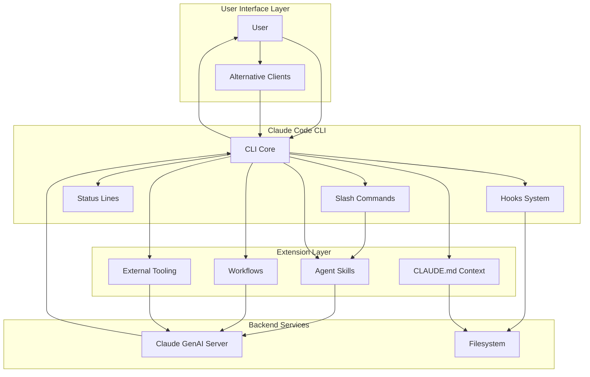

---

## 1) Agent Skills

**What it is**
Reusable prompt+rules bundles that teach Claude how to perform a specific task type consistently. [Agent Skills](#glossary) act as standardized instruction templates that modify Claude's behavior for recurring tasks.

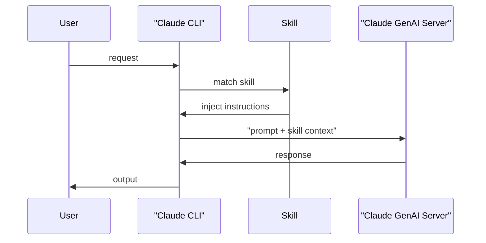

### Skill Composition Pattern

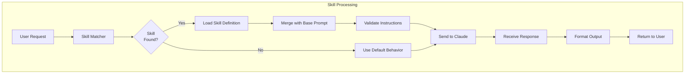

**Criticism**

* Prompt-based, not executable logic
* Hard to version-test deterministically
* Hidden coupling to model behavior
* [Token-heavy](#glossary) when multiple skills are composed
* No strong contracts or type safety

**Better / Big-tech practice**

* Explicit task services (Google internal tools)
* Typed agents with contracts ([LangGraph](#glossary), [Temporal](#glossary))
* Deterministic pipelines + LLM only for reasoning
* [RPC](#glossary)-based agent systems with versioned schemas

---

## 2) Workflows

**What it is**
Predefined multi-step processes chaining [skills](#glossary) into a larger task. [Workflows](#glossary) define sequential operations where each step depends on previous outputs.

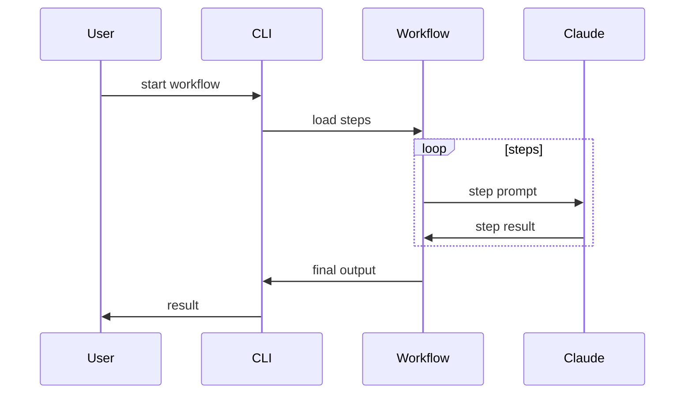

### Workflow Execution Pattern

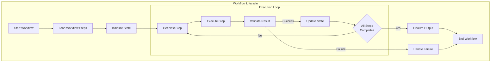

### Workflow vs DAG Comparison

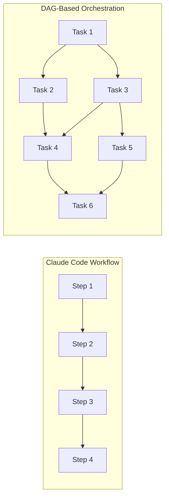

**Criticism**

* Linear, fragile to step failure
* Hard to branch or recover state
* Not [observable](#glossary) or resumable
* No parallel execution support
* Manual [state machine](#glossary) management
* Difficult to test individual steps in isolation

**Better / Big-tech practice**

* [DAG](#glossary)-based orchestration (Airflow, [Temporal](#glossary))
* [State machines](#glossary) (AWS Step Functions)
* [Event-driven](#glossary) pipelines
* Checkpointing and retry mechanisms
* Declarative workflow definitions with strong typing

---

## 3) Tooling

**What it is**
External CLIs/scripts that wrap or manage Claude Code usage. [Tooling](#glossary) acts as an integration layer between Claude Code and existing development workflows.

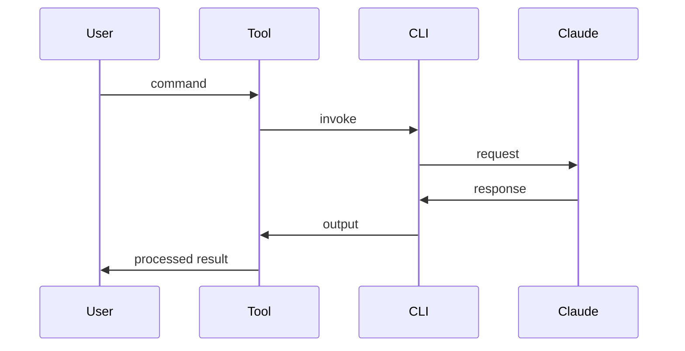

### Tool Integration Architecture

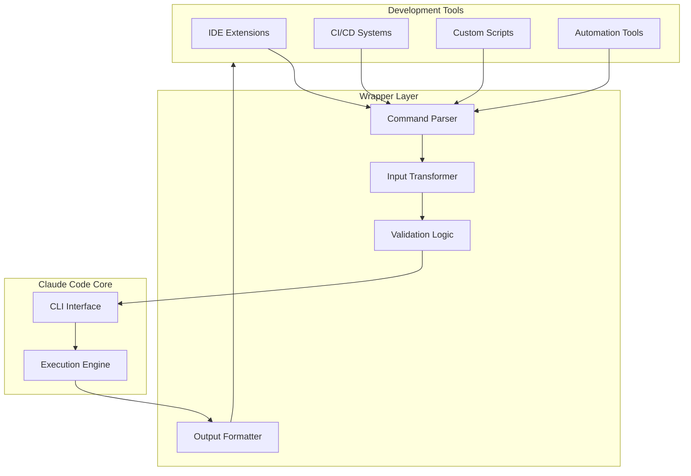

**Criticism**

* [Glue code](#glossary) sprawl
* No shared standard
* Often shell-script fragile
* Version compatibility issues
* Difficult to maintain consistency
* No type safety or contracts
* Limited error handling

**Better / Big-tech practice**

* Internal SDKs with versioned APIs
* Unified dev platforms (Google Piper, Meta internal CLIs)
* Typed APIs + [observability](#glossary) baked in
* Standardized plugin architectures
* Centralized tool management
* [Telemetry](#glossary) and usage tracking

---

## 4) Status Lines

**What it is**
Inline terminal indicators showing runtime state. [Status Lines](#glossary) provide real-time feedback about execution progress directly in the terminal.

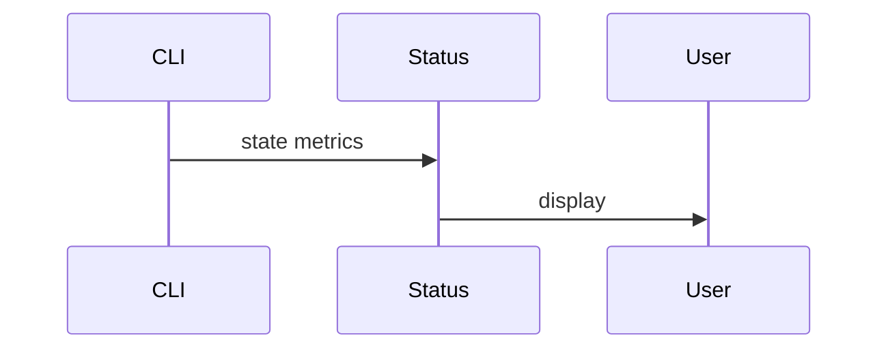

### Status Lines vs Enterprise Observability

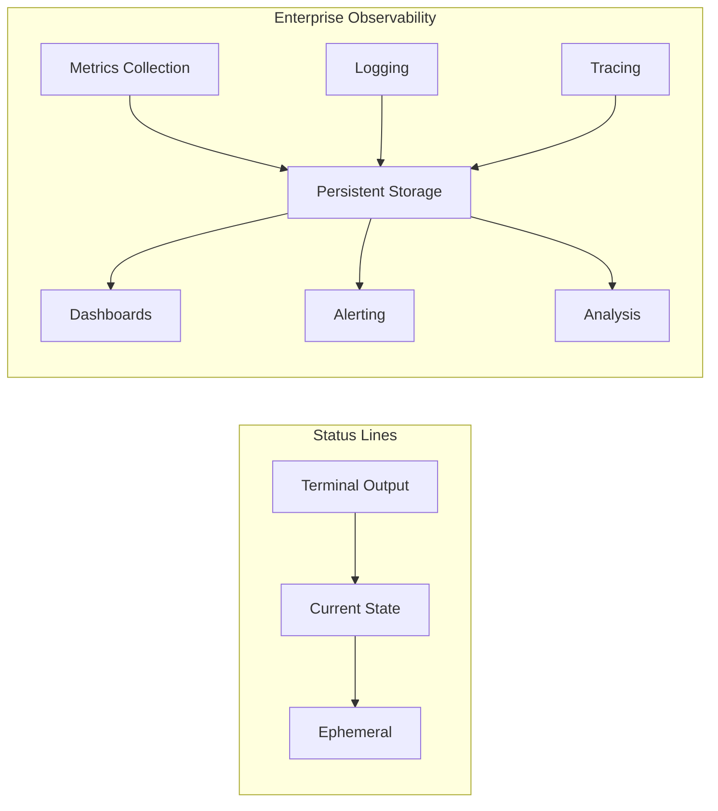

### Telemetry Flow

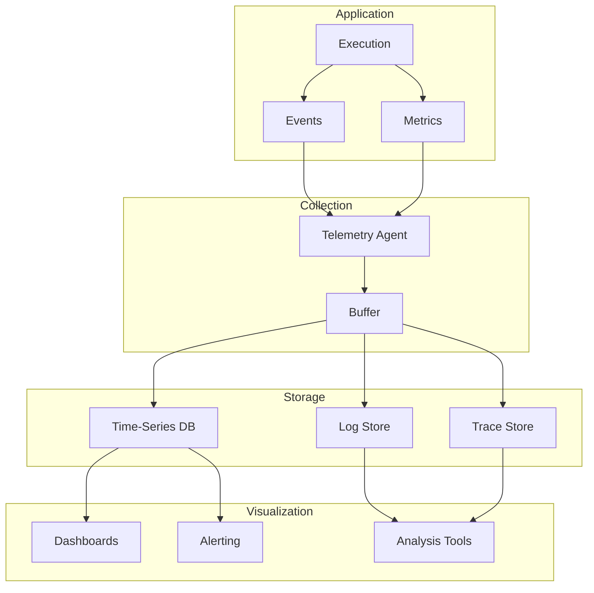

**Criticism**

* Superficial visibility
* No historical or aggregate insight
* Ephemeral, lost after execution
* Cannot correlate across runs
* No alerting or anomaly detection
* Limited to single process view
* No distributed tracing capabilities

**Better / Big-tech practice**

* Centralized [telemetry](#glossary) (Prometheus, [OpenTelemetry](#glossary))
* Dashboards (Grafana, internal tooling)
* Structured logging with correlation IDs
* Distributed tracing for multi-service calls
* Real-time anomaly detection
* SLA/SLO monitoring and alerting

---

## 5) Hooks

**What it is**
Scripts triggered at lifecycle points (pre/post execution). [Hooks](#glossary) enable custom logic injection at specific execution phases without modifying core code.

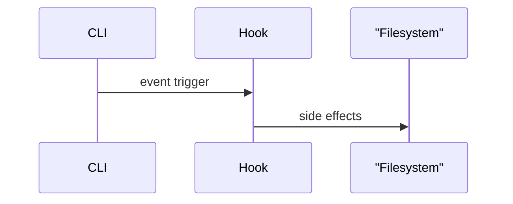

### Hook Execution Flow

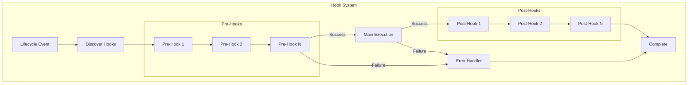

**Criticism**

* Implicit behavior
* Order-dependent bugs
* Hard to debug
* No dependency management
* Silent failures possible
* Difficult to test in isolation
* No clear ownership model

**Better / Big-tech practice**

* Explicit pipelines with declarative configuration
* CI stages with contracts and validation
* [Event buses](#glossary) with pub/sub patterns
* Middleware with clear ordering semantics
* Observable hook execution with [telemetry](#glossary)
* Typed hook interfaces with schema validation

---

## 6) Slash Commands

**What it is**
Explicit user-triggered command shortcuts. [Slash Commands](#glossary) provide quick access to predefined prompts and operations through a familiar chat-like interface.

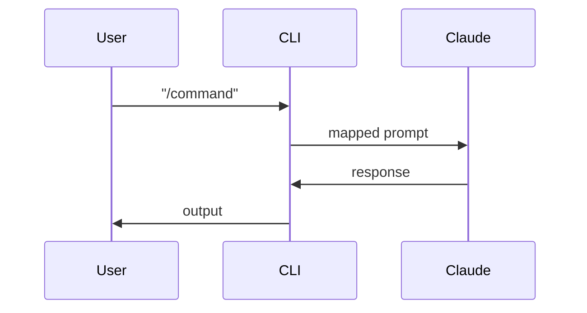

### Command Processing Pipeline

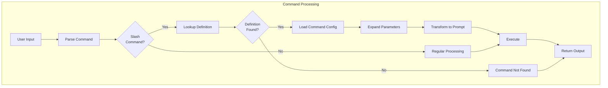

**Criticism**

* UX sugar only
* No composability
* Hidden logic
* Difficult to discover available commands
* No parameter validation
* Limited to string-based inputs
* No structured output formats

**Better / Big-tech practice**

* Structured APIs with OpenAPI/gRPC specs
* CLI subcommands with flags and validation
* [RPC](#glossary)-style invocations with type safety
* Discoverable command hierarchies
* Auto-generated help documentation
* Tab completion and validation

---

## 7) CLAUDE.md Files

**What it is**
Persistent project-level context auto-loaded into every session. [CLAUDE.md](#glossary) files provide automatic project-specific context without requiring manual input on each invocation.

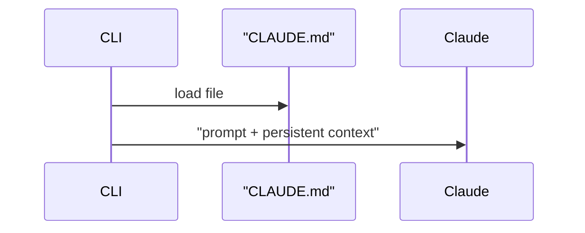

### Context Loading Strategy

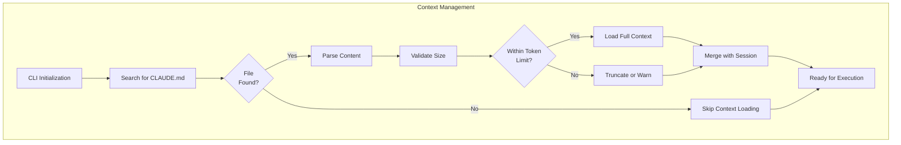

### Static Context vs Dynamic RAG

```mermaid
flowchart TB
    subgraph SC["Static Context (CLAUDE.md)"]
        SCFile["CLAUDE.md File"]
        SCLoad["Load All Content"]
        SCMerge["Merge with Every Request"]
        SCHeavy["Token-Heavy"]

        SCFile --> SCLoad --> SCMerge --> SCHeavy
    end

    subgraph DR["Dynamic RAG"]
        DRQuery["User Query"]
        DREmbed["Generate Embeddings"]
        DRSearch["Vector Search"]
        DRRetrieve["Retrieve Relevant Chunks"]
        DRMerge["Merge Only Relevant Context"]
        DREfficient["Token-Efficient"]

        DRQuery --> DREmbed --> DRSearch --> DRRetrieve --> DRMerge --> DREfficient
    end
```

**Criticism**

* [Token-heavy](#glossary), loaded on every request
* Global mutable state
* No scope control
* Difficult to version and track changes
* No selective loading based on relevance
* Can become stale or outdated
* No way to reference external resources dynamically

**Better / Big-tech practice**

* Versioned specs with schema validation
* Context retrieved dynamically ([RAG](#glossary))
* Policy engines with fine-grained access control
* Semantic search for relevant context
* Hierarchical context with inheritance
* Context caching and invalidation strategies

---

## 8) Alternative Clients

**What it is**
Non-official frontends for Claude Code. [Alternative Clients](#glossary) provide different user experiences and interfaces for interacting with Claude Code functionality.

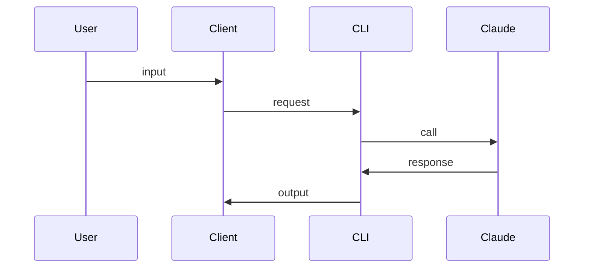

### Client Ecosystem Architecture

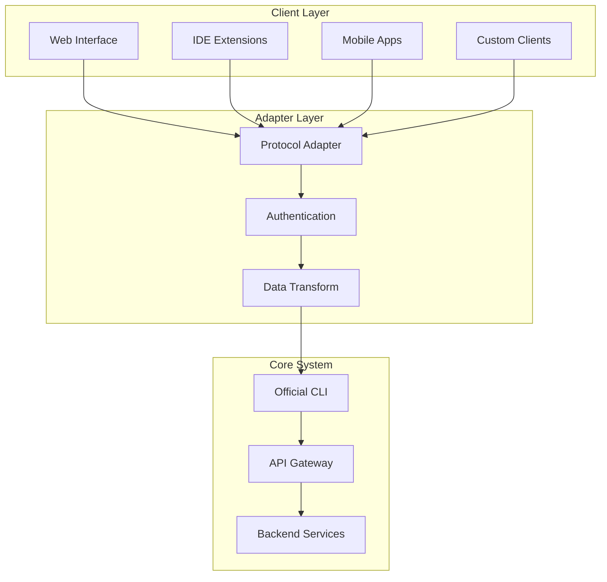

**Criticism**

* Fragmentation of user experience
* Inconsistent behavior across clients
* Maintenance risk and version drift
* No guaranteed API stability
* Difficult to support multiple clients
* Security concerns with unofficial implementations
* Limited feature parity

**Better / Big-tech practice**

* Single internal platform with unified UX
* Opinionated tooling with clear standards
* Strict interface contracts with versioning
* Official SDKs for extensibility
* Centralized authentication and authorization
* Documented public APIs with SLAs
* Plugin architectures over alternative clients

---

## 9) Documentation

**What it is**
Human-readable guidance; no runtime role. [Documentation](#glossary) provides instructions and reference material for using the system but doesn't participate in execution.

```mermaid
sequenceDiagram
    participant Human
    participant Docs
    participant System

    Human->>Docs: read
    Human->>System: "configure/use"
```

### Documentation Lifecycle

```mermaid
flowchart TB
    subgraph TRAD["Traditional Documentation"]
        Write["Write Docs"]
        Publish["Publish"]
        Drift["Docs Drift"]
        Outdated["Outdated Info"]

        Write --> Publish --> Drift --> Outdated
    end

    subgraph MODERN["Modern Docs-as-Code"]
        Code["Source Code"]
        Extract["Extract Specs"]
        Generate["Generate Docs"]
        Test["Test Examples"]
        Deploy["Deploy Docs"]
        Validate["Validation"]

        Code --> Extract
        Extract --> Generate
        Generate --> Test
        Test -->|Pass| Deploy
        Test -->|Fail| Validate
        Validate --> Code
    end
```

**Criticism**

* Drifts from reality over time
* Not enforced or validated
* Manual updates required
* No guarantees of accuracy
* Examples can become stale
* Hard to keep synchronized with code
* No automated testing of examples

**Better / Big-tech practice**

* Docs-as-code with version control
* Specs driving generation (OpenAPI, GraphQL schemas)
* Code = source of truth
* Executable documentation with runnable examples
* Automated doc testing in CI/CD
* Living documentation that updates with code
* API contracts enforced by types and schemas

---

## High-level Reality Check

Claude Code ecosystem = **prompt engineering + [glue code](#glossary)**.

Big tech trend = **explicit systems, [state machines](#glossary), typed APIs, [observability](#glossary), minimal magic**.

### Paradigm Comparison

```mermaid
flowchart TB
    subgraph CC["Claude Code Paradigm"]
        CCPrompt["Prompt Engineering"]
        CCFlexible["Flexible Behavior"]
        CCImplicit["Implicit State"]
        CCNatural["Natural Language Interface"]

        CCPrompt --> CCFlexible --> CCImplicit --> CCNatural
    end

    subgraph BT["Big Tech Paradigm"]
        BTTypes["Typed Systems"]
        BTExplicit["Explicit State"]
        BTObserve["Observable Execution"]
        BTContract["API Contracts"]

        BTTypes --> BTExplicit --> BTObserve --> BTContract
    end
```

The fundamental tension exists between:
- **Flexibility vs Determinism**: Prompts adapt but are unpredictable; typed systems are rigid but reliable
- **Natural Language vs Formal Interfaces**: Chat-like interaction vs structured APIs
- **Implicit vs Explicit**: Magic behaviors vs declared contracts
- **Token-based vs Computation-based**: Context windows vs algorithms

---

## Glossary

**Agent Skills** {#agent-skills}
- **Description**: Reusable prompt and rules bundles that teach Claude how to perform specific task types consistently. Skills encapsulate domain knowledge and behavioral patterns into injectable instruction sets.
- **Use this when**: You need to standardize Claude's behavior for recurring tasks like code reviews, documentation generation, or testing
- **Like**: Custom GPT instructions, system prompts, or configuration profiles

**Alternative Clients** {#alternative-clients}
- **Description**: Non-official frontends or interfaces for Claude Code that provide different user experiences while connecting to the same underlying CLI
- **Use this when**: You want different UX for Claude Code interaction, such as web interfaces, IDE integrations, or mobile apps
- **Like**: Third-party integrations, custom UIs, or alternative terminal clients

**CLAUDE.md** {#claude-md}
- **Description**: Persistent project-level context files that are automatically loaded into every Claude session, providing project-specific context without manual input
- **Use this when**: You need to provide project-specific context, conventions, or instructions automatically on every invocation
- **Like**: .env files, configuration files, or project README files

**DAG (Directed Acyclic Graph)** {#dag}
- **Description**: A graph data structure for modeling workflows where tasks have dependencies but no cycles, enabling parallel execution of independent tasks
- **Use this when**: You need to represent complex dependencies without cycles and want to optimize execution through parallelization
- **Like**: Airflow DAGs, Makefile targets, or task dependency graphs

**Documentation** {#documentation}
- **Description**: Human-readable guidance and reference material that describes how to use a system but has no runtime execution role
- **Use this when**: You need to communicate system behavior, APIs, or usage patterns to developers and users
- **Like**: README files, API documentation, or user guides

**Event Bus** {#event-bus}
- **Description**: A messaging mechanism that enables decoupled, asynchronous communication through publish-subscribe patterns
- **Use this when**: You need decoupled, asynchronous communication between components without direct dependencies
- **Like**: Kafka, AWS EventBridge, or message queues

**Glue Code** {#glue-code}
- **Description**: Code that connects different systems or components without implementing core business logic, often acting as an adapter or integration layer
- **Use this when**: You're integrating disparate tools or systems that don't natively communicate
- **Like**: Integration scripts, adapters, or wrapper functions

**Hooks** {#hooks}
- **Description**: Scripts or functions triggered at specific lifecycle points (pre/post execution) that enable custom logic injection without modifying core code
- **Use this when**: You need to inject custom logic before or after Claude operations, such as logging, validation, or notifications
- **Like**: Git hooks, middleware, or lifecycle callbacks

**LangGraph** {#langgraph}
- **Description**: A framework for building stateful multi-actor applications with LLMs, providing structured agent workflows with explicit state management
- **Use this when**: You need structured LLM agent workflows with complex state management and multi-step reasoning
- **Like**: Agent frameworks, task graphs, or workflow orchestration for AI agents

**Observability** {#observability}
- **Description**: The ability to understand internal system state through external outputs like metrics, logs, and traces, enabling debugging and monitoring
- **Use this when**: You need to debug or monitor production systems, understand performance, or track system behavior
- **Like**: APM tools, distributed tracing systems (Datadog, New Relic), or monitoring dashboards

**OpenTelemetry** {#opentelemetry}
- **Description**: Vendor-neutral, open-source observability framework for collecting and exporting telemetry data (metrics, logs, traces)
- **Use this when**: You need standardized telemetry collection that works across multiple vendors and platforms
- **Like**: Standardized tracing and metrics libraries that work with any backend

**RAG (Retrieval-Augmented Generation)** {#rag}
- **Description**: A pattern for dynamically fetching relevant context from a knowledge base before generating responses, reducing token usage while maintaining accuracy
- **Use this when**: You need to provide relevant information without loading everything into context, especially for large knowledge bases
- **Like**: Vector search, semantic retrieval, or database queries that fetch only relevant documents

**RPC (Remote Procedure Call)** {#rpc}
- **Description**: A protocol for invoking functions or procedures on remote systems as if they were local, enabling structured inter-service communication
- **Use this when**: You need structured inter-service communication with type safety and versioning
- **Like**: gRPC, JSON-RPC, or function calls over the network

**Slash Commands** {#slash-commands}
- **Description**: Explicit user-triggered command shortcuts that map to predefined prompts or operations, typically prefixed with a forward slash
- **Use this when**: You want quick access to predefined prompts or common operations in a chat-like interface
- **Like**: Slack slash commands, Discord commands, or CLI aliases

**State Machine** {#state-machine}
- **Description**: A computational model with defined states and explicit transitions between them, providing predictable and auditable execution flows
- **Use this when**: You need predictable, auditable workflow execution with clear state transitions and error handling
- **Like**: Finite State Machines (FSM), AWS Step Functions, or workflow state diagrams

**Status Lines** {#status-lines}
- **Description**: Inline terminal indicators that show real-time runtime state, metrics, and progress information during execution
- **Use this when**: You need real-time visibility into execution progress directly in the terminal
- **Like**: Progress bars, spinners, or status indicators in CLI tools

**Telemetry** {#telemetry}
- **Description**: The automated collection and transmission of measurements and data about system performance, usage, and health
- **Use this when**: You need to track system health and usage patterns over time for analysis and optimization
- **Like**: Application metrics, logging systems, or performance monitoring data

**Temporal** {#temporal}
- **Description**: A durable execution platform for building reliable, long-running workflows with automatic retry, versioning, and state persistence
- **Use this when**: You need reliable, long-running workflows with durability, retries, and complex orchestration
- **Like**: Workflow orchestration platforms, saga patterns, or distributed task queues

**Token-heavy** {#token-heavy}
- **Description**: A characteristic of LLM interactions that use excessive API tokens, typically due to large context or repeated context loading
- **Use this when**: Describing scenarios where context is large and repeatedly loaded, causing high costs or slow performance
- **Like**: Loading entire codebases into context, or including large documentation on every request

**Tooling** {#tooling}
- **Description**: External CLIs, scripts, or utilities that wrap or manage Claude Code usage, providing integration with existing development workflows
- **Use this when**: You need to integrate Claude Code into existing dev tools, CI/CD pipelines, or automation systems
- **Like**: Wrapper scripts, CLI extensions, or build tool integrations

**Workflows** {#workflows}
- **Description**: Predefined multi-step processes that chain skills or operations into larger, coordinated tasks with sequential execution
- **Use this when**: You need to execute a sequence of dependent operations that build on each other's outputs
- **Like**: CI/CD pipelines, AWS Step Functions, or orchestration workflows
