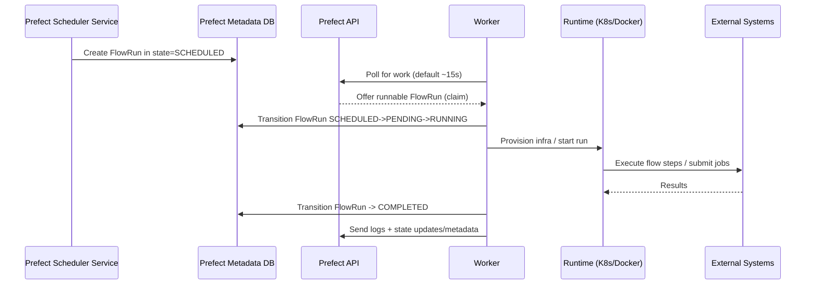
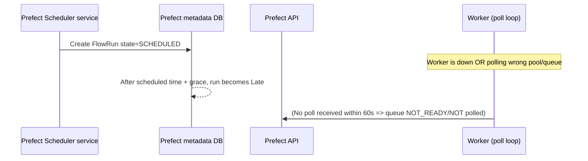
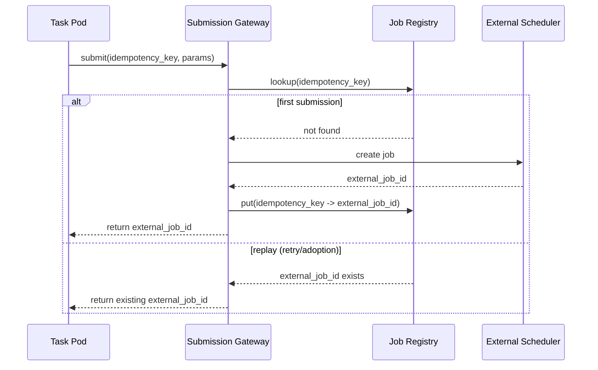
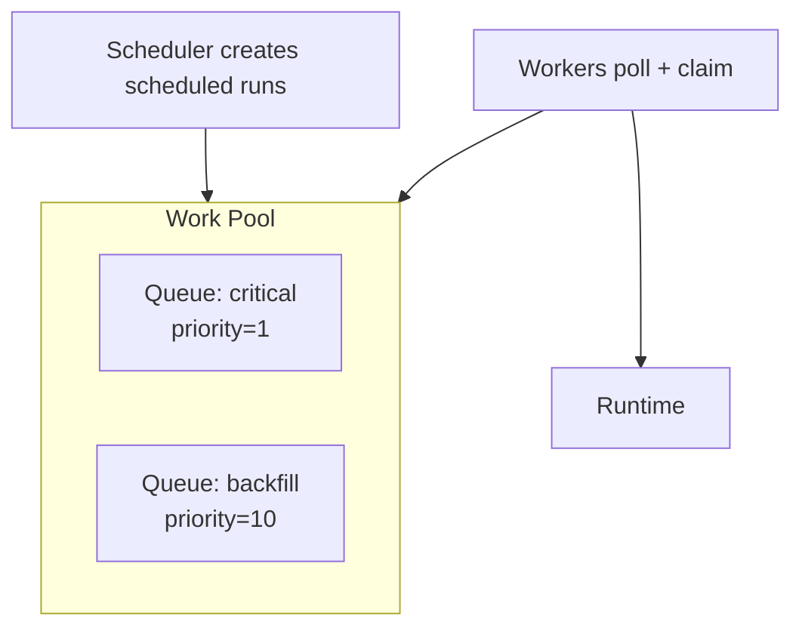
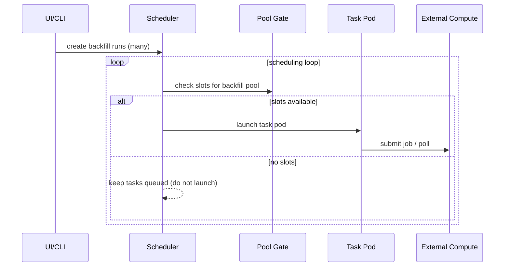

# Orchestration as a Distributed System: Airflow vs Prefect (boundaries, contracts, sequences, tradeoffs)
*(Industry-general learning paper with Pinterest/Spinner callouts clearly labeled.)*

---

## 0) Framing: what you’re actually designing
A workflow orchestrator is best understood as two planes:

- **Control plane (orchestration plane):** decides *what should run next*, tracks *state*, enforces *policies* (retries, concurrency, priorities), exposes UI/API.
- **Data plane (execution plane):** actually *runs code* (pods/containers/VM processes) and interacts with *external compute* and *data systems*.

Most “Airflow vs Prefect” confusion comes from mixing these: e.g., “the scheduler runs tasks” (it doesn’t), “the broker guarantees delivery” (it doesn’t guarantee *exactly-once*), or “no broker means no queue semantics” (also false).

---

## 1) Contracts (protocol-level, but not brittle)
When I say **contract**, I mean: *what components exchange over which channel, what the message means, and what each side promises*.

### 1.1 Canonical contracts you should look for in any orchestrator
1. **State contract (source of truth):**
   - Where does “Queued/Running/Succeeded/Failed” live?
   - Who is allowed to transition states?
2. **Work distribution contract (handoff mechanism):**
   - **Push** (scheduler pushes work to workers via broker/queue) vs **Pull** (workers poll/claim work from API).
3. **Liveness contract (heartbeats / leases):**
   - How does the system detect “a worker died mid-run”?
   - What happens next (adopt, reschedule, mark crashed)?
4. **Retry contract (who schedules retries):**
   - Is retry decided in the control plane (recommended), or implicitly by the message system, or both?
5. **Concurrency / backpressure contract:**
   - Where are limits enforced (DB scheduling logic, queue limits, worker-side slots)?
6. **Code & runtime contract:**
   - How does the execution plane obtain code and dependencies (shared DAG folder, baked image, git pull)?
7. **Observability contract:**
   - Where do logs go, how are they referenced, what is persisted as metadata?

---

## 2) Airflow system design (two major architectures)

### 2.1 Airflow “required components” (modern upstream)
Airflow’s minimal architecture includes **scheduler**, **DAG processor**, **webserver**, **DAG files**, and a **metadata database**. ([airflow.apache.org](https://airflow.apache.org/docs/apache-airflow/3.0.4/core-concepts/overview.html?utm_source=openai))  
Key point: in modern Airflow, DAG parsing/serialization is explicitly treated as a component (DAG processor), and the metadata DB is the state backbone. ([airflow.apache.org](https://airflow.apache.org/docs/apache-airflow/3.0.4/core-concepts/overview.html?utm_source=openai))

---

## 3) Airflow with CeleryExecutor (broker-centric push model)

### 3.1 What this architecture optimizes for
- **Decoupling** scheduling from execution using a brokered queue.
- **Burst absorption**: queue depth buffers spikes.
- **Long-lived workers** can be warm (fast startup).

Airflow requires a Celery backend/broker (e.g., RabbitMQ/Redis) for CeleryExecutor. ([airflow.apache.org](https://airflow.apache.org/docs/apache-airflow/2.8.1/core-concepts/executor/celery.html?utm_source=openai))

### 3.2 Component diagram (Airflow + Celery)
```mermaid
flowchart LR
  %% --- Control Plane ---
  subgraph CP[Control Plane (Airflow)]
    DP[DAG Processor\n(parses DAGs, serializes to DB)]
    S[Scheduler + Executor\n(select runnable tasks)]
    UI[Webserver/UI\n(trigger, inspect, admin)]
    MDB[(Metadata DB\nstate source of truth)]
  end

  %% --- Message Plane ---
  subgraph MP[Message Plane]
    MQ[(Broker\nRabbitMQ/Redis)]
  end

  %% --- Data Plane ---
  subgraph DP2[Data Plane (Execution)]
    CW[Celery Worker(s)\n(long-lived processes)]
    EXT[External Systems\n(Spark/Hive/Snowflake/etc.)]
  end

  DP -->|Serialize DAGs (JSON) ->| MDB
  UI <-->|Read/write run+task metadata| MDB
  S <-->|Read/write TaskInstance state| MDB

  S -->|Publish "execute task" message| MQ
  CW -->|Consume message (work item)| MQ

  CW -->|Execute task logic / submit external job| EXT
  CW -->|Report state + log pointers| MDB
```

### 3.3 Sequence diagram: happy path (Airflow + Celery)
```mermaid
sequenceDiagram
  participant DP as DAG Processor
  participant DB as Metadata DB
  participant SCH as Scheduler
  participant MQ as Broker
  participant WK as Celery Worker
  participant EXT as External Compute

  DP->>DB: Persist serialized DAGs / scheduling metadata
  SCH->>DB: Find runnable TaskInstances (TI)
  SCH->>DB: Set TI=QUEUED
  SCH->>MQ: Enqueue "execute TI" message
  WK->>MQ: Dequeue message (work item)
  WK->>DB: Set TI=RUNNING (or emit running event)
  WK->>EXT: Submit/monitor external job
  EXT-->>WK: Job result (success)
  WK->>DB: Set TI=SUCCESS + store log refs
  SCH->>DB: Observe TI terminal state; schedule downstream
```

### 3.4 Why the broker decision shapes behavior
A broker adds a **durable handoff point** between “decided” and “executing”.

- With acknowledgements, brokers typically give **at-least-once delivery** (duplicates are possible). RabbitMQ explicitly notes acknowledgements imply at-least-once; without acks, you can get at-most-once (loss). ([rabbitmq.com](https://www.rabbitmq.com/docs/reliability?utm_source=openai))
- Celery’s “late ack” improves “don’t lose work if worker dies,” but explicitly allows **duplicate execution** if the worker crashes mid-task. ([docs.celeryq.dev](https://docs.celeryq.dev/en/v5.2.7/userguide/configuration.html?utm_source=openai))

**Design consequence:** you must treat tasks as **idempotent** or implement deduplication at the business layer.

---

### 3.5 “What it is NOT” (Celery/broker misconceptions + anti-patterns)

**Misconception 1: “The broker guarantees exactly-once.”**  
- No: acknowledgements give **at-least-once** semantics; duplicates can happen. ([rabbitmq.com](https://www.rabbitmq.com/docs/reliability?utm_source=openai))  
**Bad practice:** writing tasks that create side effects without idempotency keys (e.g., double-inserting partitions, double-triggering exports).

**Misconception 2: “Retry is ‘handled by Celery’ so Airflow retries don’t matter.”**  
- In a well-designed Airflow system, *logical retries* are governed by the **orchestrator state machine** (Airflow task retries), not by broker redelivery quirks.

**Misconception 3: “Celery is just a scheduler.”**  
- Celery is a **distributed task queue system**; it is not your workflow DAG scheduler.

**Anti-pattern: treating the broker as a data bus**  
- Don’t pass large payloads through broker messages. Use references (e.g., object store keys, DB row ids).

**Anti-pattern: inconsistent runtime environments across workers**  
- Airflow’s Celery model expects homogeneous config and dependencies across workers. ([airflow.apache.org](https://airflow.apache.org/docs/apache-airflow/2.8.1/core-concepts/executor/celery.html?utm_source=openai))

---

## 4) Airflow with KubernetesExecutor (API-centric, no broker required)

### 4.1 What this architecture optimizes for
- **Runtime isolation** (one pod per task).
- Fewer mandatory components than Celery (no broker, no persistent worker fleet).
- Operationally attractive for clusters with dormancy (Airflow docs explicitly call out no external brokers/persistent workers). ([airflow.apache.org](https://airflow.apache.org/docs/apache-airflow/2.2.0/executor/kubernetes.html?utm_source=openai))

### 4.2 Component diagram (Airflow + KubernetesExecutor)
```mermaid
flowchart LR
  subgraph CP[Control Plane (Airflow)]
    DP[DAG Processor]
    S[Scheduler + KubernetesExecutor\n(creates pods)]
    UI[Webserver/UI]
    MDB[(Metadata DB)]
  end

  subgraph K8S[Kubernetes Cluster (Data Plane)]
    API[K8s API Server]
    POD[Worker Pod per Task\n(short-lived)]
  end

  EXT[External Systems\n(Spark/Hive/Snowflake/etc.)]
  LOG[(Remote Logs Store\n(e.g., S3/Blob/Logging))]

  DP -->|Serialize DAGs| MDB
  UI <-->|Read/write metadata| MDB
  S <-->|State transitions| MDB

  S -->|Create/patch Pod spec| API
  API -->|Schedule pod| POD
  POD -->|Run task / submit external job| EXT
  POD -->|Write logs| LOG
  POD -->|Report terminal state (via Airflow mechanisms)| MDB
```

### 4.3 Sequence diagram: happy path (Airflow + K8s)
```mermaid
sequenceDiagram
  participant SCH as Scheduler
  participant DB as Metadata DB
  participant K8S as K8s API
  participant POD as Worker Pod
  participant EXT as External Compute
  participant LOG as Remote Logs

  SCH->>DB: Identify runnable TI; set TI=QUEUED
  SCH->>K8S: Create Pod for TI
  K8S-->>POD: Pod scheduled + starts
  POD->>LOG: Stream/write logs
  POD->>EXT: Submit/monitor external job
  EXT-->>POD: Job result (success)
  POD->>DB: Mark TI=SUCCESS (+ metadata)
  SCH->>DB: Observe terminal; schedule downstream
```

### 4.4 Scheduler failover & “adoption” contract (why it gets tricky)
Airflow executors implement a concept of **adopting** running tasks when a scheduler dies:
- Executors expose `try_adopt_task_instances(...)` to adopt abandoned running tasks; tasks not adopted can be cleared and become eligible for re-scheduling. ([airflow.apache.org](https://airflow.apache.org/docs/apache-airflow/2.5.3/_api/airflow/executors/kubernetes_executor/index.html?utm_source=openai))
- In KubernetesExecutor internals, adoption may involve patching pods so the current watcher can monitor them (label selectors). ([airflow.apache.org](https://airflow.apache.org/docs/apache-airflow/2.5.3/_api/airflow/executors/kubernetes_executor/index.html?utm_source=openai))

This is the core “contract surface” that Pinterest-like custom K8s execution layers often collide with: if your pods/jobsets don’t map cleanly to the identifiers/labels Airflow expects, adoption semantics can degrade into duplicates or stuck tasks.

### 4.5 “What it is NOT” (K8s executor misconceptions + anti-patterns)
**Misconception 1: “No broker ⇒ no duplicates.”**  
- Duplicates can still happen via scheduler failover, observation gaps, or adoption not working perfectly.

**Misconception 2: “Kubernetes guarantees exactly-once execution.”**  
- K8s schedules pods; it doesn’t enforce your *workflow* semantics. Exactly-once is an application-level guarantee.

**Anti-pattern: using pods as the heavy compute engine**  
- If each task pod runs hours of compute locally, you push cost and reliability problems into the orchestration plane. Prefer “pods submit heavy jobs elsewhere” when you already have stable compute platforms (Spark/Hadoop/etc.).  
  *(This is exactly the Pinterest Spinner pattern—see §8.)*

---

## 5) Prefect system design (pull model, API-managed work queues)

### 5.1 The core architectural difference from Airflow (conceptually)
- **Airflow (typical):** scheduler decides + *pushes* work into an execution backend.
- **Prefect (typical):** control plane creates runs; **workers poll** and *pull/claim* work.

Prefect Cloud’s hybrid model emphasizes: “workers poll our API—no inbound connections,” and only metadata/logs/state are stored in the control plane. ([prefect.io](https://www.prefect.io/prefect/cloud?utm_source=openai))

---

## 6) Prefect Cloud (hybrid) component diagram
```mermaid
flowchart LR
  subgraph PC[Prefect Cloud (Control Plane)]
    API[Prefect API + UI]
    SCH[Scheduler Service\n(creates flow runs)]
    ORCH[Orchestration Engine\n(validates transitions, policies)]
    DB[(Metadata Store)]
  end

  subgraph CUST[Your Infra (Data Plane)]
    WK[Prefect Worker(s)\n(poll + execute)]
    RT[Runtime\n(K8s/Docker/ECS/etc.)]
    EXT[External Systems\n(DBs, Spark, Snowflake, etc.)]
    LOG[Logs location\n(worker -> control plane or object store)]
  end

  SCH -->|Create future FlowRuns (Scheduled)| DB
  WK <-->|Poll/claim work (HTTPS)| API
  WK -->|Provision infra / start run| RT
  RT -->|Execute flow code| EXT
  WK -->|Send state + logs metadata| API
```

---

## 7) Prefect Server (self-hosted) component diagram
Same contracts as Cloud, but you own the control plane services and DB.

```mermaid
flowchart LR
  subgraph PS[Prefect Server (Customer-managed Control Plane)]
    API[API + UI]
    SCH[Scheduler Service]
    ORCH[Orchestration Engine]
    DB[(Postgres / Metadata DB)]
  end

  subgraph INF[Customer Data Plane]
    WK[Worker(s)]
    RT[Runtime\n(K8s/Docker/etc.)]
    EXT[External Systems]
  end

  SCH --> DB
  WK <-->|Poll/claim (HTTPS)| API
  WK --> RT
  RT --> EXT
  WK -->|State/log updates| API
```

---

## 7.1 Prefect sequencing: scheduling is separate from execution (important contract)
Prefect’s Scheduler service **creates flow runs** and places them in Scheduled states; it “does not affect execution.” ([docs.prefect.io](https://docs.prefect.io/3.0/automate/add-schedules?utm_source=openai))  
Workers are the component that transitions runs into Pending/Running by picking them up. ([docs.prefect.io](https://docs.prefect.io/latest/concepts/states?utm_source=openai))

### Sequence diagram: happy path (Prefect)


### 7.2 Work queue / polling contracts (what replaces the broker)
Prefect work queues/pools are “queue-like,” but the mechanism is:
- **Workers poll** for work (default every 15s). ([docs.prefect.io](https://docs.prefect.io/v3/deploy/infrastructure-concepts/workers?utm_source=openai))  
- A work queue is considered **READY** when it has been polled in the last 60 seconds. ([docs.prefect.io](https://docs.prefect.io/latest/concepts/work-pools?utm_source=openai))  
- Concurrency limits exist at pool and queue levels. ([docs.prefect.io](https://docs.prefect.io/latest/concepts/work-pools?utm_source=openai))

### 7.3 Retry contract (server-side orchestration rules)
Prefect’s orchestration layer can reject failed transitions and schedule retries when retries remain (rules like `RetryFailedFlows` / `RetryFailedTasks`). ([docs.prefect.io](https://docs.prefect.io/v3/api-ref/python/prefect-server-orchestration-core_policy?utm_source=openai))  
This is conceptually: “retry is a control-plane policy that results in a new Scheduled/AwaitingRetry run,” not “the worker just loops forever.”

---

## 7.4 “What it is NOT” (Prefect misconceptions + anti-patterns)

**Misconception 1: “No broker ⇒ no queue semantics.”**  
- Prefect still has queue semantics (work queues/pools), but implemented via **API-mediated polling/claiming** rather than AMQP/Redis broker messages. ([docs.prefect.io](https://docs.prefect.io/latest/concepts/work-pools?utm_source=openai))

**Misconception 2: “Prefect Scheduler runs my code.”**  
- Scheduler creates run records; execution happens on workers. ([docs.prefect.io](https://docs.prefect.io/3.0/automate/add-schedules?utm_source=openai))

**Anti-pattern: slow polling + tight schedules**
- If polling/worker availability mismatches schedules, runs go “Late” (Prefect explicitly describes Late as usually meaning no healthy workers / wrong pool / concurrency limited). ([docs.prefect.io](https://docs.prefect.io/latest/concepts/states?utm_source=openai))

**Anti-pattern: “retries will fix it” without idempotency**
- Retries imply potential re-execution. You still need idempotency keys / dedupe if side effects exist.

---

## 8) Pinterest-specific grounded callouts (Spinner = Airflow + K8s execution pattern)
*(Everything in this section is “Pinterest way,” based on the environment you described; where it deviates from generic advice, I label it.)*

### 8.1 Pinterest’s core architectural choice: pods orchestrate, external systems compute
You described Spinner tasks as **short-to-medium orchestration steps** that submit heavy work to **Monarch/Hadoop/Spark/Hive/Pinalytics/Snowflake**, rather than doing heavy compute in the pod.

**Why this is rational (industry pattern):**
- Keeps the **orchestrator data plane cheap and elastic** (pods are small/short).
- Moves heavy retry/capacity concerns into platforms built for it (Spark/Hadoop).
- Improves multi-tenancy safety: fewer “runaway” pods consuming cluster.

**Industry pattern mapping:** “Control-plane/data-plane separation” + “Command pattern” (pods issue commands to compute services) + “Bulkhead isolation” (dedicated compute systems per workload class).

### 8.2 Pinterest’s HA direction: multiple schedulers + task adoption complexity
You mentioned partitioned schedulers for HA and “task adoption” complexity with custom K8s/jobset APIs. That maps directly to Airflow’s executor adoption contract (`try_adopt_task_instances`) and K8s adoption behavior (patching pods for watcher label selectors). ([airflow.apache.org](https://airflow.apache.org/docs/apache-airflow/2.5.3/_api/airflow/executors/kubernetes_executor/index.html?utm_source=openai))

**Pinterest-way deviation:** custom jobset/pod identity and adoption logic  
- **Rationale:** improve availability, allow scheduler failover to continue observing in-flight work.
- **Risk:** if adoption identifiers drift from what the scheduler/executor expects, you get duplicates or stuck “running” tasks.

### 8.3 Pinterest observability: S3-backed logs + UI
**Rationale:** object storage is cost-effective and decouples log retention from the control plane DB.  
**Tradeoff:** large bucket listing/versioning can become an operational tax (you called out lifecycle policies).

### 8.4 Pinterest security: multiple isolated environments (Spinner/PII/SOX)
This is a textbook “multi-tenant isolation by environment” pattern (strong boundaries; duplicated control plane) rather than “single cluster with perfect RBAC.”

---

## 9) Tradeoffs summary (design-oriented)

### 9.1 Push (broker) vs Pull (poll/claim)
| Dimension | Airflow + Celery (push via broker) | Airflow + K8s executor (push via K8s API) | Prefect (pull via API polling) |
|---|---|---|---|
| Work handoff | Broker message | K8s pod creation | Worker claims run from API |
| Buffering spikes | Queue depth | K8s pending pods + scheduler backlog | Queue backlog in control plane + worker availability |
| Failure mode | broker/ack semantics, redelivery | scheduler observation/adoption gaps | polling gaps, lease/heartbeat gaps |
| Infra complexity | + broker ops | + k8s ops | fewer primitives, more API semantics |
| Best fit | high-throughput short tasks; warm workers | isolation; container-first; “scale-to-zero-ish” | hybrid execution; “no inbound”; simpler worker story |

### 9.2 Concurrency/backpressure patterns
- **Airflow:** Pools limit parallelism for arbitrary sets of tasks. ([airflow.apache.org](https://airflow.apache.org/docs/apache-airflow/2.2.1/concepts/pools.html?utm_source=openai))  
- **Prefect:** Work pools/queues have priorities and concurrency limits; READY/NOT_READY is tied to polling. ([docs.prefect.io](https://docs.prefect.io/latest/concepts/work-pools?utm_source=openai))

### 9.3 Sensors and waiting (a major hidden cost)
- Airflow’s deferrable operators + triggerer exist because normal sensors consume worker slots; deferral frees worker capacity and shifts “waiting” to an async triggerer. ([airflow.apache.org](https://airflow.apache.org/docs/apache-airflow/2.2.5/concepts/deferring.html?utm_source=openai))  
This is a direct example of **module architecture responding to a resource-waste failure mode**.

---

## 10) Practical “design rules” (industry-general, matches Pinterest goals)
1. **Assume at-least-once execution everywhere**  
   - Broker acks imply at-least-once. ([rabbitmq.com](https://www.rabbitmq.com/docs/reliability?utm_source=openai))  
   - Late-ack designs explicitly allow duplicates. ([docs.celeryq.dev](https://docs.celeryq.dev/en/stable/_modules/celery/app/task.html?utm_source=openai))  
   - Scheduler failover/adoption gaps can duplicate pods/tasks. ([airflow.apache.org](https://airflow.apache.org/docs/apache-airflow/2.5.3/_api/airflow/executors/kubernetes_executor/index.html?utm_source=openai))
2. **Make side effects idempotent by contract**
   - Use deterministic run identifiers in external job submission (e.g., job name includes workflow run id).
3. **Keep orchestration tasks small; push heavy compute to platforms built for it**
   - This is the Pinterest pattern and is broadly a best practice at scale.
4. **Treat “adoption” and “leases” as first-class**
   - If you want HA schedulers/workers, you must invest in clean run identity + adoption/claim semantics.
5. **Backpressure belongs in the control plane**
   - Airflow pools or Prefect queue/pool concurrency limits should be your primary mechanism, not “let the cluster suffer.”

---

## 11) Where to go next (so this becomes a “study resource”)
If you want, I can extend this paper with:
1) A dedicated section comparing **retry semantics and where retries “live”** (Airflow state machine vs Celery message redelivery vs Prefect orchestration rules).  
2) A “failure mode catalog” (network partition, scheduler crash, worker crash, external job stuck) with **expected state transitions** in each system.  
3) A Pinterest-grounded diagram of **Spinner’s job submission boundary** (Airflow task pod → Monarch/Spark/Hive/Snowflake) and the idempotency contracts you’d ideally enforce.

Tell me which of the three you want first, and whether you prefer the next iteration to be **more diagram-heavy** or **more narrative with checklists**.

## Part II — Retries, failure modes, and a Pinterest/Spinner-grounded boundary model

### 1) “Where retries live” (control loop ownership)
The cleanest system-design question is: **which component is the “retry controller”** (the thing that decides *if/when* to attempt again), vs which component is merely **a transport that can redeliver** work.

#### Airflow (generic, upstream)
**Source of truth:** the **metadata database** stores workflow/task state and is used by Airflow components to coordinate. ([airflow.apache.org](https://airflow.apache.org/docs/apache-airflow/3.0.4/core-concepts/overview.html?utm_source=openai))  
**Scheduler role:** the scheduler handles triggering workflows and **submitting tasks to the executor**; the executor is configured as part of the scheduler process. ([airflow.apache.org](https://airflow.apache.org/docs/apache-airflow/3.0.4/core-concepts/overview.html?utm_source=openai))

So conceptually, in Airflow:
- **Retries are an orchestrator policy**, expressed in metadata + scheduler decisions.
- The executor/worker is *not* supposed to be the system-wide retry brain; it is supposed to execute and report outcomes.

#### Airflow + CeleryExecutor (brokered push)
Airflow’s CeleryExecutor requires a **Celery backend/broker** (RabbitMQ/Redis, etc.). ([airflow.apache.org](https://airflow.apache.org/docs/apache-airflow/2.8.1/core-concepts/executor/celery.html?utm_source=openai))  
That broker introduces a second “retry-like” phenomenon: **broker redelivery** when a message isn’t acknowledged.

Key reliability contract (RabbitMQ):
- With acknowledgements, you get **at-least-once delivery**; without acknowledgements you get at-most-once (possible loss). ([rabbitmq.com](https://www.rabbitmq.com/docs/reliability?utm_source=openai))
- Unacked deliveries are **automatically requeued when the consumer fails/loses connection**, so consumers must handle redelivery/idempotency. ([rabbitmq.com](https://www.rabbitmq.com/docs/confirms?utm_source=openai))

Key Celery contract:
- `acks_late` means “ack after execution,” and Celery explicitly notes this can execute the task twice if the worker crashes mid-execution. ([docs.celeryq.dev](https://docs.celeryq.dev/en/stable/_modules/celery/app/task.html?utm_source=openai))

**Design takeaway:** In Airflow+Celery you effectively have:
- **Orchestrator retry** (policy-driven, counted, delayed/backoff, visible), plus
- **Transport redelivery** (failure-driven, can be immediate, can create duplicates, not “business semantic retry”).

A lot of operational pain comes from accidentally letting *transport redelivery* act like your *retry policy*.

#### Airflow + KubernetesExecutor (API-centric push)
KubernetesExecutor “requests a worker pod from the Kubernetes API,” then the pod runs the task, reports result, and terminates; notably **no external brokers or persistent workers** are required. ([airflow.apache.org](https://airflow.apache.org/docs/apache-airflow/2.2.0/executor/kubernetes.html?utm_source=openai))

The retry controller still conceptually lives in the scheduler/metadata DB (same as above), but the “delivery mechanism” is now:
- **Create pod** (K8s API) instead of “enqueue message” (broker).

This changes the “duplicate execution” story: duplicates are more likely to come from **scheduler failover/adoption gaps** or “did we observe the pod completion” issues than from message redelivery.

---

#### Prefect (Cloud or Server): retries are enforced by orchestration rules
Prefect’s scheduler service **only creates flow runs and places them in `Scheduled`**; it “does not affect execution.” ([docs.prefect.io](https://docs.prefect.io/3.0/automate/add-schedules?utm_source=openai))  
Execution is performed by workers that poll and submit work; workers poll every **15 seconds by default**. ([docs.prefect.io](https://docs.prefect.io/v3/deploy/infrastructure-concepts/workers?utm_source=openai))

Prefect also makes the “retry controller” very explicit at the orchestration-policy layer:
- `RetryFailedFlows` rejects failed transitions and schedules a retry if retries remain. ([docs.prefect.io](https://docs.prefect.io/v3/api-ref/python/prefect-server-orchestration-core_policy?utm_source=openai))  
- `RetryFailedTasks` does the same for tasks. ([docs.prefect.io](https://docs.prefect.io/v3/api-ref/python/prefect-server-orchestration-core_policy?utm_source=openai))

**Design takeaway:** Prefect is architected so that “retry is an orchestrator contract” first, and “delivery” (poll/claim) is a separate mechanism.

---

### 2) Failure mode catalog (expected behaviors + what to design for)
Below are the **most load-bearing failure modes** for data orchestration systems, with the relevant contracts.

#### 2.1 Worker crashes mid-execution
**Airflow + Celery:**
- If you use acknowledgements, broker reliability gives at-least-once semantics. ([rabbitmq.com](https://www.rabbitmq.com/docs/reliability?utm_source=openai))
- Unacked messages are requeued on consumer failure, causing redelivery. ([rabbitmq.com](https://www.rabbitmq.com/docs/confirms?utm_source=openai))
- With Celery `acks_late`, duplicates are an explicit possibility if the worker dies mid-task. ([docs.celeryq.dev](https://docs.celeryq.dev/en/stable/_modules/celery/app/task.html?utm_source=openai))

**Prefect:**
- A run can end up `Crashed` for infrastructure reasons. ([docs.prefect.io](https://docs.prefect.io/latest/concepts/states?utm_source=openai))
- If retries remain, the system can move to an “await retry” style scheduled state (`AwaitingRetry` is a first-class state). ([docs.prefect.io](https://docs.prefect.io/latest/concepts/states?utm_source=openai))

**What you design for (both):**
- Idempotency keys at the boundary to external systems (job submission IDs, partition versioning, dedupe tables).
- “Side effects must be replay-safe” is the real contract, not “the orchestrator will never duplicate.”

---

#### 2.2 Scheduler dies / control-plane failover
**Airflow + KubernetesExecutor: adoption contract matters**
Airflow’s Kubernetes executor has an explicit adoption API:
- `try_adopt_task_instances` attempts to adopt tasks abandoned by a dead scheduler; anything not adopted may be cleared and become eligible for rescheduling. ([airflow.apache.org](https://airflow.apache.org/docs/apache-airflow/2.5.3/_api/airflow/executors/kubernetes_executor/index.html?utm_source=openai))
- Adoption can involve **patching pods** so the current watcher can monitor them via label selectors. ([airflow.apache.org](https://airflow.apache.org/docs/apache-airflow/2.5.3/_api/airflow/executors/kubernetes_executor/index.html?utm_source=openai))

**Interpretation (system-design level):**
- Airflow is implementing a “**reconciliation loop**” pattern: on recovery, reconcile DB belief (“running”) with cluster reality (“pod exists/doesn’t”), adopt what you can, reschedule the rest.

**What you design for:**
- Stable run identity across failover (labels/annotations that are canonical).
- A clear contract for “who is allowed to write the terminal state” (old scheduler vs new scheduler vs pod callback paths).

---

#### 2.3 “No workers available” / queue not being serviced
**Prefect makes this visible as protocol-level queue health**
- Workers poll every 15 seconds by default. ([docs.prefect.io](https://docs.prefect.io/v3/deploy/infrastructure-concepts/workers?utm_source=openai))
- A work queue is `READY` only if polled in the last **60 seconds**; otherwise it is `NOT_READY`. ([docs.prefect.io](https://docs.prefect.io/latest/concepts/work-pools?utm_source=openai))
- Prefect defines `Late` as: scheduled start time has passed but it has not transitioned to pending within **15 seconds by default**. ([docs.prefect.io](https://docs.prefect.io/latest/concepts/states?utm_source=openai))

**Airflow equivalent (conceptually):**
- This shows up as “queued tasks not draining,” often due to pools/concurrency limits or executor capacity.

---

#### 2.4 Backpressure / dependency protection
**Airflow: Pools are the canonical “don’t overwhelm downstream” mechanism**
Pools limit execution parallelism across arbitrary task sets. ([airflow.apache.org](https://airflow.apache.org/docs/apache-airflow/2.2.1/concepts/pools.html?utm_source=openai))

**Prefect: Work pools/queues provide priority + concurrency**
Work pools/queues support priority ordering and concurrency limits. ([docs.prefect.io](https://docs.prefect.io/latest/concepts/work-pools?utm_source=openai))

**Design pattern:** Queue-based load leveling + explicit concurrency gates (and you should treat them as part of the API contract between orchestration and dependencies).

---

### 3) Sequence diagrams for the two highest-value “debuggable” paths

#### 3.1 Airflow + KubernetesExecutor: scheduler failover and adoption
```mermaid
sequenceDiagram
  participant DB as Metadata DB (source of truth)
  participant S1 as Scheduler A (old)
  participant S2 as Scheduler B (new)
  participant K8S as Kubernetes API
  participant POD as Task Pod

  S1->>DB: Mark TI=RUNNING; record queued_by_job_id
  S1->>K8S: Create Pod with labels/annotations
  POD-->>K8S: Running...

  note over S1: Scheduler A crashes

  S2->>DB: Find TaskInstances that look RUNNING/owned by dead scheduler
  S2->>K8S: List Pods matching old scheduler's label selector
  S2->>K8S: Patch Pods so new watcher can observe them (adoption)
  S2->>DB: For unadopted TIs, clear / make eligible for reschedule
```
The “patch pods for watcher label selectors” and “try_adopt_task_instances” are explicitly part of the upstream KubernetesExecutor design. ([airflow.apache.org](https://airflow.apache.org/docs/apache-airflow/2.5.3/_api/airflow/executors/kubernetes_executor/index.html?utm_source=openai))

---

#### 3.2 Prefect: scheduled run becomes Late because no worker is servicing the queue

This is grounded in Prefect’s documented polling and queue readiness behavior (15s polling default, 60s READY window, Late definition). ([docs.prefect.io](https://docs.prefect.io/v3/deploy/infrastructure-concepts/workers?utm_source=openai))

---

### 4) Pinterest/Spinner-specific boundary model (clearly labeled)

#### 4.1 Pinterest way (from your environment): “pods orchestrate, platforms compute”
This is a strong, scalable separation: Spinner pods are mostly **submission + sensing + bookkeeping**, while heavy compute happens on Monarch/Hadoop/Spark/Hive/Pinalytics/Snowflake.

Component diagram (Pinterest-grounded, but conceptually general):
```mermaid
flowchart LR
  subgraph CP[Spinner Control Plane (Pinterest way)]
    SCH[Airflow Scheduler(s)\n+ Pinterest K8s Executor]
    UI[Spinner UI/Webserver]
    MDB[(Airflow Metadata DB / Metastore)]
    WS[(workflow_stats DB)]
  end

  subgraph DP[Spinner Data Plane (pods)]
    POD[Per-task K8s Pod/Jobset\nsmall resources]
  end

  subgraph EXT[External Compute/Data Platforms]
    SPARK[Monarch/Hadoop/Spark/Hive]
    PINA[Pinalytics]
    SNOW[Snowflake]
  end

  LOG[(S3 Remote Logs Buckets)]
  SEC[Security Boundaries\nSpinner vs PIISpinner vs SOXPIISpinner\nSPIFFE/IAM/FGAC]

  UI <-->|metadata read/write| MDB
  SCH <-->|state transitions| MDB
  SCH -->|create pod/jobset via K8s API| POD
  POD -->|submit jobs + poll status| SPARK
  POD -->|submit/report| PINA
  POD -->|load/unload/merge| SNOW
  POD -->|stream/write logs| LOG
  SCH --> WS
  SEC --- CP
  SEC --- DP
```

**If you compare this to “industry best practice”:**
- This is generally aligned with best practice at scale (keep orchestration lightweight).
- The “Pinterest-specific” part is the deep integration with internal compute platforms + multi-environment isolation strategy (Spinner/PII/SOX).

#### 4.2 Spinner sequence: “submit Spark job, monitor, then commit task state”
```mermaid
sequenceDiagram
  participant SCH as Spinner Scheduler
  participant DB as Airflow Metadata DB
  participant K8S as K8s API
  participant POD as Task Pod
  participant SP as Spark/Hadoop platform
  participant LOG as S3 Logs

  SCH->>DB: Decide task runnable; mark QUEUED
  SCH->>K8S: Create per-task pod/jobset
  POD->>LOG: Start streaming logs
  POD->>SP: Submit job (with run identifiers)
  POD->>SP: Poll job status / fetch diagnostics
  SP-->>POD: Job succeeded/failed
  POD->>DB: Report terminal state + pointers (job id, logs)
  SCH->>DB: Schedule downstream or retry based on policy
```

**Critical contract to make this safe:** job submission must be replay-safe (idempotent), because retries / adoption gaps / infrastructure restarts can re-run submission steps (Airflow’s world is at-least-once in practice).

---

### 5) “What it is NOT” (targeted misconceptions) — addendum

#### 5.1 “Broker == correctness” (not true)
RabbitMQ acks give **at-least-once**, not exactly-once. ([rabbitmq.com](https://www.rabbitmq.com/docs/reliability?utm_source=openai))  
So: broker + acks improves durability, but pushes **idempotency responsibility** onto consumers.

#### 5.2 “No broker == no duplicates” (not true)
Airflow’s KubernetesExecutor can reschedule tasks that weren’t adopted after scheduler death, and adoption itself depends on reconciling DB state with pod reality. ([airflow.apache.org](https://airflow.apache.org/docs/apache-airflow/2.5.3/_api/airflow/executors/kubernetes_executor/index.html?utm_source=openai))

#### 5.3 “Sensors are cheap” (not necessarily)
In Airflow, classic sensors/operators occupy worker slots even while idle; deferrable operators explicitly exist to fix this by handing waiting to triggers/triggerer. ([airflow.apache.org](https://airflow.apache.org/docs/apache-airflow/stable/authoring-and-scheduling/deferring.html?utm_source=openai))  
**Pinterest-style implication:** if many workflows do “submit + wait,” deferrable patterns can be disproportionately valuable.

---

## Next: tell me what you want “Part III” to emphasize
Choose one (I’ll continue in that direction, with more Mermaid diagrams and a checklist-style “design review rubric”):
1) **Idempotency contracts** for external job submission (Spark/Hive/Snowflake) with concrete patterns (job keys, partition write strategies, dedupe tables).  
2) **Backfill design** (how to prevent scheduler/K8s overload; mapping Airflow pools vs Prefect queue priorities; “critical backfill lane” pattern).  
3) **Multi-tenancy and isolation** (Pinterest environments + RBAC vs industry patterns; noisy neighbor control; tier/SLO enforcement).

## Part III — Contracts at the *real* boundary: idempotency, backfills, multi-tenancy (Airflow/Spinner vs Prefect)

This part is intentionally “system design first”: we treat Spark/Hive/Snowflake (or any external platform) as **separate distributed systems** with their own schedulers, retries, and failure modes. Your orchestrator is coordinating them, not replacing them.

---

# III.A — External compute boundary contract (the “job submission protocol”)

### Core idea
In Pinterest/Spinner (and many mature data platforms), the task pod is mostly a **control-plane shim**:
- submit a job
- wait/poll
- collect metadata
- commit “task succeeded/failed” in orchestrator state

That means the *most important* contract isn’t “Airflow retries,” it’s: **“submission is replay-safe.”**

### A.1 Contract: “submit job” must be idempotent
Define an **Idempotency Key** that is stable across retries, scheduler failover, and adoption:
- `idempotency_key = (workflow_id, dag_run_id/logical_date, task_id, try_number?)`
- usually you want it stable across *retries*, so **do not include try_number** unless you explicitly want a *new* external job per retry.

Also define the **Job Handle** you persist:
- `external_job_id`
- optional: `external_job_url`, `cluster`, `submitted_at`, `parameters hash`

### A.2 Reference component diagram (industry-general; matches Spinner pattern)
```mermaid
flowchart LR
  subgraph ORCH[Orchestrator Plane]
    MDB[(Orchestrator Metadata DB)]
  end

  subgraph POD[Task Pod (Orchestration Step)]
    OP[Operator Logic\n(submit/poll)]
  end

  subgraph EXT[External Compute Plane]
    GW[Submission Gateway / API]
    REG[(Job Registry\n(idempotency store))]
    SCH[Compute Scheduler\n(Spark/Hadoop/etc.)]
    RUN[Job Runtime]
  end

  OP -->|1) Submit request\n(idempotency_key, params)| GW
  GW -->|2) Read/Write\nkey->job_id mapping| REG
  GW -->|3) Schedule job| SCH
  SCH --> RUN
  OP <-->|4) Poll status\n(job_id)| GW
  OP -->|5) Persist handle + status| MDB
```

**Arrow explanations (what/how/why):**
- **(1) Submit request:** typically HTTP/RPC; payload is “intent to run” + idempotency key.
- **(2) Registry:** durable store; prevents duplicate job creation when the orchestrator retries.
- **(4) Poll:** avoids holding worker slots with tight loops; use deferrable triggers where possible in Airflow to free worker capacity while waiting. ([airflow.apache.org](https://airflow.apache.org/docs/apache-airflow/stable/authoring-and-scheduling/deferring.html?utm_source=openai))
- **(5) Persist handle:** lets a retried/adopted task “reattach” to the same external job.

### A.3 Sequence: retry-safe submission


### A.4 “What it is NOT” (common misconceptions / anti-patterns)
- **Not:** “Retries are safe because Airflow/Prefect counts them.”  
  **Reality:** retries mean **re-execution attempts**; safety is your idempotency boundary.
- **Not:** “Polling is free.”  
  In Airflow, standard sensors/operators occupy worker slots; deferrable operators exist specifically to offload waiting to triggerers and free worker capacity. ([airflow.apache.org](https://airflow.apache.org/docs/apache-airflow/stable/authoring-and-scheduling/deferring.html?utm_source=openai))
- **Anti-pattern:** “Generate a random job name on each retry.”  
  This guarantees duplicate external jobs during transient failures.
- **Anti-pattern:** “Treat ‘submitted’ as ‘succeeded’.”  
  Submission success is not business success; persist job_id and verify completion.

---

# III.B — Backfill design (load shaping, not just “more runs”)

Backfills are where orchestrator design gets stress-tested: you’re creating *lots of scheduled work* that competes with production SLO work.

### B.1 Contract: backfills must be *throttled* via explicit gates
**Airflow gate (canonical): Pools**
Airflow pools exist to prevent overwhelming downstream systems by limiting parallelism on arbitrary sets of tasks via “worker slots.” ([airflow.apache.org](https://airflow.apache.org/docs/apache-airflow/stable/administration-and-deployment/pools.html?utm_source=openai))

**Prefect gate (canonical): Work queues + priority + concurrency**
Prefect work pools/queues have priorities and concurrency limits; scheduling favors higher priority queues “waterfall style.” ([docs.prefect.io](https://docs.prefect.io/latest/concepts/work-pools?utm_source=openai))

### B.2 Pattern: “two lanes” (prod lane + backfill lane)
#### Airflow/Spinner laneing (conceptual)
```mermaid
flowchart TB
  U[User triggers backfill\n(range dates)] --> ORCH[Orchestrator creates many runs]

  ORCH --> S[Scheduler]

  subgraph GATES[Concurrency Gates]
    P1[Prod Pool\n(high slots)]
    P2[Backfill Pool\n(low slots)]
  end

  S -->|Assign tasks to pools| GATES
  GATES --> K8S[K8s pods / workers]
  K8S --> EXT[External platforms\nSpark/Hive/Snowflake]
```

**Mechanism-level clarity:** the scheduler keeps creating runnable tasks, but *pool slots* cap how many can become “actually executing” at once. ([airflow.apache.org](https://airflow.apache.org/docs/apache-airflow/stable/administration-and-deployment/pools.html?utm_source=openai))

#### Prefect laneing (conceptual)


Prefect explicitly documents priority ordering across queues and “waterfall” submission. ([docs.prefect.io](https://docs.prefect.io/latest/concepts/work-pools?utm_source=openai))  
Also note: queues are `READY` only if polled recently (health is tied to polling). ([docs.prefect.io](https://docs.prefect.io/v3/api-ref/settings-ref?utm_source=openai))

### B.3 Sequence: safe backfill submission (Airflow pools + deferrables)


### B.4 “What it is NOT” (backfill misconceptions / anti-patterns)
- **Not:** “Backfill is just production runs in the past.”  
  It’s a *capacity event*; you must design laneing and caps.
- **Anti-pattern:** “Unlimited backfill parallelism; rely on external platforms to cope.”  
  External schedulers will queue, but you’ll still overload: orchestrator DB, API rate limits, k8s pods, log systems.
- **Anti-pattern (Pinterest-specific risk):** launching too many short orchestration pods can stress k8s control plane/logging even if Spark/Hadoop can queue fine. This is why laneing at the *orchestrator* layer is essential.

---

# III.C — Multi-tenancy & isolation (Pinterest-grounded, industry-general patterns)

### C.1 Two common multi-tenancy models
1) **Shared control plane** (many teams share one orchestrator)
   - Pros: centralized ops, standardized UX, economies of scale
   - Cons: noisy neighbors, RBAC complexity, blast radius

2) **Isolated environments by domain** (PII/SOX/etc.)
   - Pros: clear blast radius and compliance boundaries
   - Cons: duplicated infra + duplicated ops

Pinterest is using a hybrid: shared Spinner per tier/cluster, plus isolated PII/SOX environments. (You described Spinner / PIISpinner / SOXPIISpinner.)

### C.2 Architecture diagram: shared orchestrator + isolated compliance planes
```mermaid
flowchart LR
  subgraph SHARED[Shared Orchestration Plane (non-PII)]
    S1[Spinner Control Plane\n(scheduler/web/DB)]
    K1[K8s worker clusters]
  end

  subgraph PII[PII Orchestration Plane]
    S2[PIISpinner Control Plane\n(scheduler/web/DB)]
    K2[PII K8s worker clusters]
  end

  subgraph SOX[SOX Orchestration Plane]
    S3[SOXPIISpinner Control Plane\n(scheduler/web/DB)]
    K3[SOX K8s worker clusters]
  end

  TEAMS[Many teams\nshared repo + RBAC] --> S1
  TEAMS --> S2
  TEAMS --> S3
```

### C.3 HA scheduler note (why “multi-scheduler” is a design choice)
Airflow supports running more than one scheduler for performance/resiliency, and its HA approach is designed to leverage the metadata DB (avoiding consensus systems) to reduce operational surface area. ([airflow.apache.org](https://airflow.apache.org/docs/apache-airflow/stable/administration-and-deployment/scheduler.html?utm_source=openai))  
This is directly relevant to your “adoption on failure” concerns: once you run multiple schedulers, *identity + adoption + reconciliation* become first-class contracts.

### C.4 “What it is NOT” (multi-tenancy misconceptions / anti-patterns)
- **Not:** “RBAC is enough isolation for regulated data.”  
  Many companies still choose **separate environments** for PII/SOX because isolation is easier to reason about than perfect RBAC everywhere.
- **Anti-pattern:** “One global pool/limit for everything.”  
  You need *per-dependency* and *per-tier* gates (critical pipelines shouldn’t compete fairly with opportunistic backfills).

---

## If you want Part IV, pick one focus
1) A **design review checklist** you can use to evaluate any orchestrator architecture (Airflow/Prefect/other).  
2) A **failure-mode playbook** specifically for Pinterest Spinner2 (Airflow 2.8) migration risks: adoption, triggerers/deferrables, pools, log lifecycle, scheduler HA. ([airflow.apache.org](https://airflow.apache.org/docs/apache-airflow/stable/authoring-and-scheduling/deferring.html?utm_source=openai))

## Part IV — (1) Orchestrator architecture design review checklist + (2) Spinner2 (Airflow 2.8) migration failure-mode playbook

---

# IV.1 Design review checklist (use this to evaluate Airflow, Prefect, or “Spinner-like” systems)

Think of this as an **interface/contract review** across control plane, work distribution, and external dependencies. The goal is to make implicit assumptions explicit.

## A) Boundaries & ownership (control plane vs data plane)
**Checklist**
- **Control plane components identified:** scheduler(s), UI/API, DAG/flow parsing/registry, metadata/state DB. (In Airflow, the metadata DB and scheduler/DAG processor are core to architecture.) 
- **Data plane components identified:** workers/pods/runners + how they get code and secrets.
- **Clear “source of truth” for state:** where does `Queued/Running/Succeeded/Failed` live and who can transition it?
  - Airflow uses its **metadata database** as a central coordination point for state. 
- **Separation of orchestration vs computation:** confirm whether task runtime is mostly “submit/poll” vs “heavy compute in the task process.”

**Red flags**
- “The worker decides retries” (should usually be control plane policy).
- “Success means job submitted” (submission is not completion).

---

## B) Work distribution contract (push vs pull, and where duplicates can arise)
**Checklist**
- Identify work handoff mechanism:
  - **Broker message** (Celery/RabbitMQ/Redis) vs
  - **Kubernetes API pod creation** (KubernetesExecutor) vs
  - **Worker poll/claim** (Prefect workers poll the API; default polling is ~15 seconds). 
- Write down your delivery semantics assumption: **at-least-once** is the safe default.
  - RabbitMQ ack-based reliability is **at-least-once** (duplicates possible). 
  - Celery late-ack explicitly allows duplicate execution on worker crash. 
- Define the idempotency contract for every “side-effect task” (external job submission, partition writes, exports).

**Red flags**
- No idempotency keys at external job submission boundary.
- “We never see duplicates” used as a design assumption.

---

## C) Liveness, adoption, and “who owns a running task”
**Checklist**
- Define liveness:
  - heartbeats/leases (prefect-like)
  - scheduler adoption/reconciliation (airflow k8s executor-like)
- If you run multiple schedulers: how do you **adopt** in-flight work?
  - Airflow’s Kubernetes executor exposes `try_adopt_task_instances` and may patch pods to make them observable by the new scheduler/watcher. 
- Define the “stuck running” policy:
  - When do you mark a run as failed/crashed vs keep waiting?

**Red flags**
- Multiple schedulers without a tested adoption story.
- No operational way to reconcile “DB says running” vs “pod/job is gone.”

---

## D) Backpressure & dependency protection
**Checklist**
- Declare concurrency gates at three layers:
  1) **Orchestrator gate** (Airflow Pools / Prefect concurrency)
  2) **Cluster gate** (k8s quotas / namespace limits)
  3) **External platform gate** (Spark/Hadoop queue limits, Snowflake warehouses, etc.)
- Airflow: ensure Pools are used intentionally to limit parallelism. 
- Waiting tasks: if you have many “submit then wait,” use deferrable patterns where available to avoid burning worker slots while idle. 

**Red flags**
- “Backfill just creates runs; the cluster will handle it.”
- Sensors waiting in tight loops consuming worker capacity.

---

## E) Observability & auditability (debuggability is a first-class contract)
**Checklist**
- Every task/run must produce:
  - stable run identifiers
  - external job handle (job_id / query_id / URL)
  - log pointer (S3/object store key, or logging system link)
- Define what must be queryable from the UI/API:
  - current state + reason
  - retries remaining
  - who/what claimed the run
- Ensure “late/not-ready” semantics are interpretable:
  - Prefect: `Late` and queue `READY`/`NOT_READY` are explicitly defined in terms of scheduling and worker polling. 

---

# IV.2 Spinner2 (Airflow 2.8) migration failure-mode playbook (Pinterest-specific, grounded in your environment)

This section assumes your described architecture:
- task pods are lightweight and mostly submit heavy jobs to Spark/Hadoop/Hive/Pinalytics/Snowflake
- multiple schedulers for HA / adoption
- strong environment isolation (Spinner vs PII/SOX)
- S3-backed logs + workflow_stats metrics

I’ll call out where something is a **Pinterest way** vs an industry norm.

---

## 1) Adoption & scheduler HA: the “double-run” and “stuck-running” risks
### What changes / why it matters
Running multiple schedulers raises the importance of the adoption contract: the new scheduler must reconcile and possibly adopt orphaned work. Airflow’s Kubernetes executor has explicit adoption mechanisms (`try_adopt_task_instances`) and may patch pods so watchers can observe them. 

### Failure modes to expect
- **Duplicate external jobs** if:
  - scheduler failover causes task to be rescheduled while the first pod/job is still running
  - adoption fails due to custom jobset identity/labels not matching what the watcher expects
- **Stuck “running” tasks** if:
  - pod/job finished but callback/state update wasn’t observed, and adoption doesn’t reconcile properly

### Mitigations (contract-level)
- **Canonical run identity:** every external submission must include a deterministic idempotency key (dag_run + task_id) so resubmission reattaches.
- **Adoption invariants:** define and test invariants like:
  - “A running TaskInstance must map to exactly one observable k8s object”
  - “Any scheduler can discover and adopt that object via stable labels”
- **Reconciliation job:** periodic auditor that compares DB “running” vs k8s jobset/pod reality and surfaces anomalies.

---

## 2) Waiting (sensors, polling) and the Triggerer/deferrables opportunity
### Why this matters in Spinner-like workloads
Your tasks are often “submit and wait.” Classic waiting consumes execution capacity.

Airflow’s deferrable operators exist to shift waiting off workers and into the triggerer model, freeing worker slots. 

### Failure modes
- Worker/pod churn or resource pressure due to many concurrent waiting tasks.
- Backfills amplify this: thousands of “waiters” becomes a control-plane scaling problem.

### Mitigations
- Prioritize deferrable versions for high-cardinality waits (availability checks, job completion sensors).
- Establish a rule: “Any wait > N minutes must be deferrable unless there’s a hard reason.”

---

## 3) Pools / tiering / SLO enforcement (protect prod from backfills)
Airflow Pools are the standard mechanism to limit parallelism by “pool slots.” 

### Spinner2 migration risk
If pool semantics or defaults change (or if teams are inconsistent), backfills can overwhelm:
- k8s API / pod scheduling
- S3 logging throughput/listing
- external platforms (Spark/Hadoop queues, Snowflake warehouses)

### Mitigations (Pinterest-way rationale)
- Keep/strengthen the “two-lane” model:
  - **Prod lane**: guaranteed slots
  - **Backfill lane**: capped slots + explicit approvals for large ranges
- Encode lane policy in platform defaults (not per-DAG tribal knowledge).

---

## 4) Logging + artifact lifecycle (S3 operational tax)
### Common migration failure mode
Even if compute is fine, the migration can slow down due to:
- log volume growth
- bucket listing costs / UI timeouts
- versioned artifacts and large repos

### Mitigations
- Lifecycle policies (you already noted this need).
- Partition logs by environment/tier/team and enforce retention by criticality.
- Make “log pointer” a first-class metadata object so the UI doesn’t need expensive listings.

---

## 5) “What is NOT” (Spinner2 edition)
- **Not:** “KubernetesExecutor means no duplicates.”  
  Adoption and rescheduling can still cause duplicates; the adoption mechanism explicitly exists because failures happen. 
- **Not:** “Backfills are a user concern.”  
  At Pinterest scale, backfills are a *platform stability concern* (cluster, DB, logs, external schedulers).
- **Not:** “Waiting tasks are cheap.”  
  Airflow added deferrables/triggerer specifically to address the resource waste of waiting in workers. 

---

## 6) A migration “go/no-go” rubric (practical)
You can treat these as required proofs before scaling adoption:

1. **Adoption proof:** kill scheduler A mid-run; scheduler B must adopt and not double-run >X% of tasks.
2. **Idempotency proof:** induce retries on external submission; verify only one external job is created per logical run.
3. **Backfill proof:** run a realistic backfill; ensure prod SLOs unaffected due to pools/tier gates.
4. **Waiting proof:** verify deferrable patterns reduce pod pressure under high concurrency.
5. **Observability proof:** for any failed run, UI shows external job_id + logs pointer + failure reason within seconds/minutes.

---

If you want, I can turn Part IV into a **printable 2–3 page “Architecture Review Template”** (fill-in-the-blanks) plus a **migration test plan** with concrete experiments (scheduler crash, network partition, k8s API throttling, S3 log unavailability) and the expected state transitions.

