# Data Catalogs and Table Formats: A Comprehensive Guide

## Executive Summary

This document provides a comprehensive technical guide to modern data lakehouse architectures, focusing on the critical distinction between **file formats**, **table formats**, and **data catalogs**. With data lakes evolving from simple object storage to sophisticated ACID-compliant systems, understanding these layers is essential for building scalable, interoperable data platforms.

**Key Topics Covered:**
- **Foundational Concepts**: File formats (Parquet, ORC, Avro), table formats (Apache Iceberg, Delta Lake, Hudi), and their relationship to catalogs
- **Data Catalogs**: Deep dive into AWS Glue Data Catalog, Databricks Unity Catalog, and Apache Polaris, including detailed feature comparisons
- **Apache Iceberg Architecture**: Metadata layers, snapshot isolation, ACID transactions, and time travel capabilities
- **Real-World Implementations**: Case studies from Netflix, Apple, LinkedIn, Airbnb, and Adobe demonstrating production-scale deployments
- **Hands-On Examples**: Practical AWS implementation using Glue, Athena, and EMR with code samples
- **Multi-Engine Interoperability**: How different query engines (Spark, Athena, Trino, Snowflake) work with catalogs and table formats

**Why This Matters:**
Modern enterprises face data trapped in proprietary systems, with teams struggling to share datasets across different tools. Table formats like Iceberg solve this by providing open, engine-neutral ACID semantics on cloud storage. Catalogs like Polaris enable centralized governance without vendor lock-in. Understanding these technologies is crucial for architects designing next-generation data platforms that balance performance, governance, and openness.

**Target Audience:**
Data engineers, architects, and platform teams building or migrating to lakehouse architectures on AWS, Azure, or GCP. The guide assumes familiarity with data lakes, SQL, and cloud storage, but provides comprehensive explanations of table format internals.

---

# Glossary & Key Concepts

**[File formats](#glossary) (Parquet / ORC / Avro):** These are the underlying physical encodings for data files. [Parquet](#glossary) and [ORC](#glossary) are *[columnar](#glossary)* formats (storing data by column), providing efficient compression and query performance on analytic workloads. [Avro](#glossary) is a row-based format often used for streaming or semi‐structured data. None of these formats provide table or transaction semantics by themselves – they are just ways to serialize data in [S3](#glossary) (or [HDFS](#glossary)). For example, an [Iceberg](#glossary) table might store its rows in [Parquet](#glossary) files on [S3](#glossary) [o^A Short Introduction to Apache Iceberg │ by Christine Mathiesen │ Expedia Group Technology │ Medium](https://medium.com/expedia-group-tech/a-short-introduction-to-apache-iceberg-d34f628b6799?sortBy=REVERSE_CHRON#:~:text=3,like%20Parquet%2C%20ORC%2C%20Avro%20etc) [o^How Iceberg Powers Data and AI Applications at Apple, Netflix, LinkedIn, and Other Leading Companies │ Qlik Blog](https://www.qlik.com/blog/how-iceberg-powers-data-and-ai-applications-at-apple-netflix-linkedin-and#:~:text=Apache%20Iceberg%E2%80%AFis%20an%20open%20table,interoperability%20across%20multiple%20query%20engines).

**[Table formats](#glossary) (Apache Iceberg / Delta Lake / Hudi):** A *[table format](#glossary)* sits above raw [file formats](#glossary) and implements table/transaction semantics. It defines how data files are organized into tables, and it tracks [metadata](#glossary) ([manifests](#glossary), [snapshots](#glossary), [schemas](#glossary), [partitions](#glossary), etc.) to provide [ACID transactions](#glossary), [schema evolution](#glossary), [partitioning](#glossary), and [time travel](#glossary). [Iceberg](#glossary), [Delta Lake](#glossary), and [Hudi](#glossary) (among others) are popular open [table formats](#glossary). All support [ACID-like operations](#glossary): for example, [Apache Iceberg](#glossary) "provides [ACID transactions](#glossary) for data consistency, [schema evolution](#glossary), [partitioning](#glossary), and [time travel](#glossary)" [o^How Iceberg Powers Data and AI Applications at Apple, Netflix, LinkedIn, and Other Leading Companies │ Qlik Blog](https://www.qlik.com/blog/how-iceberg-powers-data-and-ai-applications-at-apple-netflix-linkedin-and#:~:text=Apache%20Iceberg%E2%80%AFis%20an%20open%20table,interoperability%20across%20multiple%20query%20engines). Internally, an [Iceberg](#glossary) table consists of [metadata](#glossary) JSON ("metadata.json"), [manifest lists](#glossary), [manifest files](#glossary) (each listing data files), and the data files ([Parquet](#glossary)/[ORC](#glossary)/[Avro](#glossary)) [o^A Short Introduction to Apache Iceberg │ by Christine Mathiesen │ Expedia Group Technology │ Medium](https://medium.com/expedia-group-tech/a-short-introduction-to-apache-iceberg-d34f628b6799?sortBy=REVERSE_CHRON#:~:text=1,like%20Parquet%2C%20ORC%2C%20Avro%20etc). By managing file lists in [metadata](#glossary) rather than directory listings, [Iceberg](#glossary) avoids expensive [S3](#glossary) list operations and ensures [atomic commits](#glossary) [o^A Short Introduction to Apache Iceberg │ by Christine Mathiesen │ Expedia Group Technology │ Medium](https://medium.com/expedia-group-tech/a-short-introduction-to-apache-iceberg-d34f628b6799?sortBy=REVERSE_CHRON#:~:text=consideration%20was%20solving%20various%20data,locations%20to%20all%20the%20individual) [o^A Short Introduction to Apache Iceberg │ by Christine Mathiesen │ Expedia Group Technology │ Medium](https://medium.com/expedia-group-tech/a-short-introduction-to-apache-iceberg-d34f628b6799?sortBy=REVERSE_CHRON#:~:text=1,like%20Parquet%2C%20ORC%2C%20Avro%20etc).

```mermaid
---
config:
  theme: dark
---
graph TB
    subgraph "Data Stack Layers"
        QE["Query Engines<br/>(Spark, Athena, Trino)"]
        CAT["Catalogs<br/>(Glue, Unity, Polaris)"]
        TF["Table Formats<br/>(Iceberg, Delta, Hudi)"]
        FF["File Formats<br/>(Parquet, ORC, Avro)"]
        STORE["Storage<br/>(S3, HDFS, ADLS)"]
    end

    QE -->|"Query Resolution"| CAT
    CAT -->|"Metadata Pointer"| TF
    TF -->|"Manifest/Snapshot"| FF
    FF -->|"Physical Files"| STORE

    style QE fill:#2C5F2D,stroke:#97BE5A
    style CAT fill:#1B4332,stroke:#52B788
    style TF fill:#2C3E50,stroke:#3498DB
    style FF fill:#6A1B9A,stroke:#BA68C8
    style STORE fill:#BF360C,stroke:#FF5722
``` 

**[Metadata layers](#glossary) and [ACID transactions](#glossary):** In [Iceberg](#glossary), each **[snapshot](#glossary)** represents a point-in-time table state, defined by a *[manifest list](#glossary)* (which points to [manifest files](#glossary)) and associated [schema](#glossary)/[partition](#glossary) spec. When a write occurs (e.g. INSERT/UPDATE/DELETE), a new [snapshot](#glossary) is created with new [manifest(s)](#glossary), and the old [snapshot](#glossary) remains in history for [time-travel](#glossary). Because each commit atomically updates the pointer to the latest [metadata](#glossary) file, readers always see a consistent view (no "dirty reads"), and writers never block readers [o^A Short Introduction to Apache Iceberg │ by Christine Mathiesen │ Expedia Group Technology │ Medium](https://medium.com/expedia-group-tech/a-short-introduction-to-apache-iceberg-d34f628b6799?sortBy=REVERSE_CHRON#:~:text=Using%20the%20snapshot%20pattern%20means,specifying%20the%20snapshot%20to%20use). This design provides [serializable isolation](#glossary): writers build data files and [manifests](#glossary), then atomically swap in new [metadata](#glossary), guaranteeing isolated reads/writes and enabling rollback. [Delta Lake](#glossary) and [Hudi](#glossary) use similar principles (Delta-style transaction log or Hudi's timeline), but [Iceberg's](#glossary) design ([manifests](#glossary) + [snapshots](#glossary)) is cloud-native and engine-neutral [o^A Short Introduction to Apache Iceberg │ by Christine Mathiesen │ Expedia Group Technology │ Medium](https://medium.com/expedia-group-tech/a-short-introduction-to-apache-iceberg-d34f628b6799?sortBy=REVERSE_CHRON#:~:text=Using%20the%20snapshot%20pattern%20means,specifying%20the%20snapshot%20to%20use) [o^How Iceberg Powers Data and AI Applications at Apple, Netflix, LinkedIn, and Other Leading Companies │ Qlik Blog](https://www.qlik.com/blog/how-iceberg-powers-data-and-ai-applications-at-apple-netflix-linkedin-and#:~:text=Apache%20Iceberg%E2%80%AFis%20an%20open%20table,interoperability%20across%20multiple%20query%20engines).

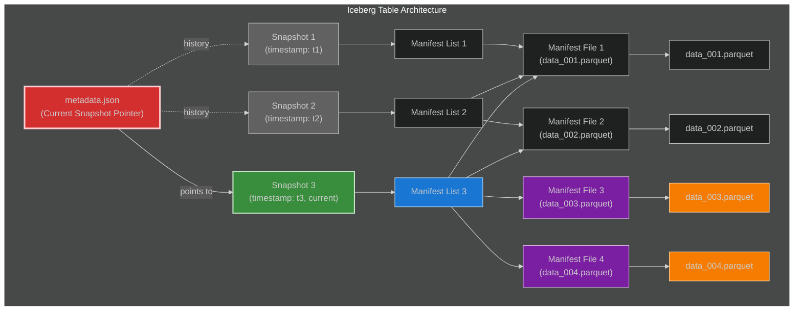

**Catalogs/Metastores (Hive Metastore, AWS Glue, Unity Catalog, Polaris/Tabular):** A *catalog* is a central registry of table definitions. It maps table names/namespaces to table metadata (locations, schemas, partitions), specifically the pointer to the Iceberg `metadata.json`. For example, an Iceberg catalog tracks “the current metadata pointer for one or more tables” [o^Overview │ Apache Polaris](https://polaris.apache.org/docs/overview/#:~:text=manage%20and%20organize%20tables,must%20support%20the%20following%20tasks). Traditional Hive used a Thrift Metastore (often backed by MySQL) to store tables, but modern architectures use specialized catalogs. AWS Glue Data Catalog is a managed Hive-compatible metastore on AWS. Databricks Unity Catalog is Databricks’ unified governance catalog (originally Delta-focused, now extending to Iceberg). Apache Polaris (donated by Snowflake) is an **open implementation of the Iceberg REST catalog**. Others include Project Nessie (versioned catalog) and JDBC-based catalogs.

Catalogs interact with table formats by storing the **pointer to the latest metadata file** for each table. For example, if an Iceberg table `db.table` is created, the catalog will have an entry that points to that table’s S3 location and current `metadata.json` file. When a query engine (Athena, Spark, Trino, etc.) resolves a table reference, it consults the configured catalog, obtains the metadata location, reads the Iceberg metadata tree (snapshots/manifests), then reads the data files on S3. Because multiple engines can share one catalog, catalogs enable **multi-engine interoperability**. 

In summary: file formats = how individual data files (Parquet/ORC/Avro) are encoded; table formats = how data files are grouped with metadata into ACID tables (Iceberg, Delta, Hudi); catalog/metastore = where the table-level metadata (namespaces, pointers to Iceberg metadata) is stored. File formats contain no table or transactional information; table formats manage that in metadata layers (manifest lists, snapshots); catalogs store *tables of tables* so that query engines know where to find each table’s metadata and data.

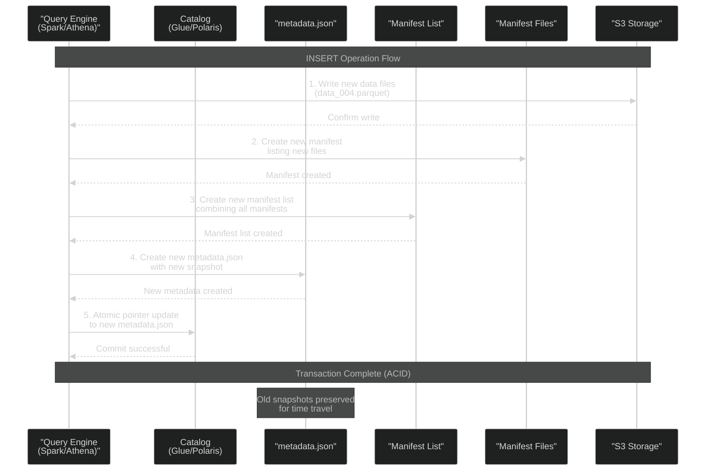

## Iceberg Catalogs: Concept & Implementations

In Apache Iceberg, a **catalog** is simply the service that maps table identifiers to the current metadata file for that table. The Iceberg *table spec* defines catalogs as the “first architectural layer” responsible for: (1) storing the current metadata pointer for tables, and (2) performing atomic pointer updates [o^Overview │ Apache Polaris](https://polaris.apache.org/docs/overview/#:~:text=manage%20and%20organize%20tables,must%20support%20the%20following%20tasks). In practice, common Iceberg catalog implementations include:

- **Hive Metastore catalog:** Uses the traditional Hive Metastore (HMS) to store Iceberg table locations. The Iceberg snapshot pointer is stored in a Hive table like any Hive metastore table (as a location or metadata pointer). Popular for on-prem or Hadoop-based deployments.
- **AWS Glue Catalog (Glue Data Catalog):** Glue provides a Hive-compatible catalog as a serverless AWS service. Glue can store Iceberg tables (as of late 2022); it is the default metastore for Athena, EMR, Redshift Spectrum, etc. Glue supports Iceberg’s metadata (including arrow/parquet metadata in manifests) [o^Introducing AWS Glue crawler and create table support for Apache Iceberg format │ AWS Big Data Blog](https://aws.amazon.com/blogs/big-data/introducing-aws-glue-crawler-and-create-table-support-for-apache-iceberg-format/#:~:text=AWS%20Glue%20crawlers%20now%20support,grained%20permissions). Many AWS engines (Athena, EMR, Redshift Spectrum) can use Glue as the Iceberg catalog.
- **JDBC/Relational catalog:** Use a relational database (like a SQL DB) to store the Iceberg metadata pointer. All engines can talk to the DB to resolve table state. (Iceberg’s JDBC catalog implementation is less common in production.)
- **REST catalog (Polaris/Tabular):** A newer approach where a RESTful service (e.g. Apache *Polaris*) maintains the table pointers. Polaris is “a catalog implementation for Apache Iceberg™ built on the Iceberg REST protocol” [o^Overview │ Apache Polaris](https://polaris.apache.org/docs/overview/#:~:text=Apache%20Polaris%20,source%20Apache%20Iceberg%E2%84%A2%20REST%20protocol). It provides a centralized, secure way to share Iceberg tables across engines; it issues IAM credentials to clients and enforces RBAC on tables. Polaris (which Snowflake released as vendor-neutral) can be self-hosted or run as a Snowflake-managed service [o^Snowflake – Snowflake Unveils Polaris Catalog and Emphasizes Commitment to Interoperability with AWS, Google Cloud, Microsoft Azure, Salesforce, and More](https://investors.snowflake.com/news/news-details/2024/Snowflake-Unveils-Polaris-Catalog-and-Emphasizes-Commitment-to-Interoperability-with-AWS-Google-Cloud-Microsoft-Azure-Salesforce-and-More/default.aspx?utm_cta=website-blog#:~:text=will%20be%20open%20sourced%20in,Microsoft%20Azure%2C%20Salesforce%2C%20and%20more) [o^Snowflake unveils Polaris, a vendor–neutral open catalog implementation for Apache Iceberg](https://venturebeat.com/data-infrastructure/snowflake-unveils-polaris-a-vendor-neutral-open-catalog-implementation-of-apache-iceberg//#:~:text=To%20address%20this%20concern%2C%20and,Python%2C%20%2010%20and%20others). Tabular (now Apache Polaris) also offers Polaris as a managed open-source catalog.
- **Unity Catalog (Databricks):** Though primarily Delta-focused, Unity Catalog in Databricks is introducing Iceberg functionality via the Iceberg REST Catalog API. Unity Catalog will allow Iceberg-managed tables to be read/written by external engines under a unified governance model [o^Databricks Eliminates Table Format Lock–in and Adds Capabilities for Business Users with Unity Catalog Advancements – Databricks](https://www.databricks.com/company/newsroom/press-releases/databricks-eliminates-table-format-lock-and-adds-capabilities#:~:text=with%20powerful%20new%20capabilities,discovery%20is%20enhanced%20for%20business) [o^Databricks Eliminates Table Format Lock–in and Adds Capabilities for Business Users with Unity Catalog Advancements – Databricks](https://www.databricks.com/company/newsroom/press-releases/databricks-eliminates-table-format-lock-and-adds-capabilities#:~:text=Unity%20Catalog%20Now%20Eliminates%20the,a%20single%20approach%20to%20governance).

**How engines use a catalog:** When you configure Iceberg in Spark, Trino, etc., you specify which catalog to use (e.g. Hive, Glue, Polaris). For example, Trino’s Iceberg connector can be configured with `catalog=glue` or `catalog=hive_metastore` (or even `catalog=snowflake` or `catalog=rest` for Polaris) [o^Iceberg connector — Trino 462 Documentation](https://trino.io/docs/current/connector/iceberg.html?highlight=catalog#:~:text=,or%20a%20%2011). Spark can use SparkSession with `"spark.sql.catalog.mycatalog"` pointing to an Iceberg catalog implementation (e.g. Glue, Hive, or REST). When a query references `mycatalog.db.table`, the engine asks the catalog, gets the S3 path to the Iceberg table’s metadata, then loads that metadata.json snapshot to plan the query. Changing a table (e.g. INSERT) means creating a new metadata file and atomically swapping the pointer in the catalog.

Thus, an Iceberg **catalog** is not the same as a table format – it’s the registry of tables. In Iceberg’s spec, the catalog *owns* the metadata pointer for each table [o^Overview │ Apache Polaris](https://polaris.apache.org/docs/overview/#:~:text=manage%20and%20organize%20tables,must%20support%20the%20following%20tasks). Different implementations (Glue, Hive, Polaris REST, JDBC) all fulfill this role.

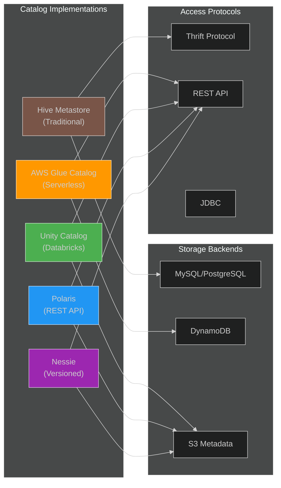

## Catalog Comparison: AWS Glue Data Catalog vs Unity Catalog vs Polaris

| Feature / Catalog            | AWS Glue Data Catalog [o^Introducing AWS Glue crawler and create table support for Apache Iceberg format │ AWS Big Data Blog](https://aws.amazon.com/blogs/big-data/introducing-aws-glue-crawler-and-create-table-support-for-apache-iceberg-format/#:~:text=AWS%20Glue%20crawlers%20now%20support,grained%20permissions) [o^Build an Apache Iceberg data lake using Amazon Athena, Amazon EMR, and AWS Glue │ AWS Big Data Blog](https://aws.amazon.com/blogs/big-data/build-an-apache-iceberg-data-lake-using-amazon-athena-amazon-emr-and-aws-glue/#:~:text=open,0)   | Databricks Unity Catalog [o^Databricks Eliminates Table Format Lock–in and Adds Capabilities for Business Users with Unity Catalog Advancements – Databricks](https://www.databricks.com/company/newsroom/press-releases/databricks-eliminates-table-format-lock-and-adds-capabilities#:~:text=with%20powerful%20new%20capabilities,discovery%20is%20enhanced%20for%20business) [o^Solved: Does Unity Catalog support Iceberg? – Databricks Community – 119080](https://community.databricks.com/t5/get-started-discussions/does-unity-catalog-support-iceberg/td-p/119080#:~:text=,required%20libraries%20and%20Spark%20configurations)       | Polaris (Tabular) [o^Snowflake – Snowflake Unveils Polaris Catalog and Emphasizes Commitment to Interoperability with AWS, Google Cloud, Microsoft Azure, Salesforce, and More](https://investors.snowflake.com/news/news-details/2024/Snowflake-Unveils-Polaris-Catalog-and-Emphasizes-Commitment-to-Interoperability-with-AWS-Google-Cloud-Microsoft-Azure-Salesforce-and-More/default.aspx?utm_cta=website-blog#:~:text=Catalog%20cts.businesswire.com%20%2C%20a%20vendor,Microsoft%20Azure%2C%20Salesforce%2C%20and%20more) [o^Snowflake unveils Polaris, a vendor–neutral open catalog implementation for Apache Iceberg](https://venturebeat.com/data-infrastructure/snowflake-unveils-polaris-a-vendor-neutral-open-catalog-implementation-of-apache-iceberg//#:~:text=To%20address%20this%20concern%2C%20and,Python%2C%20%2010%20and%20others)                         |
|------------------------------|------------------------------------------|----------------------------------------------|-------------------------------------------|
| **Ownership/Provider**       | AWS (managed service)                    | Databricks (managed multi-cloud)             | Open source (Snowflake/Apache) – self‐ or Snowflake-managed  |
| **Primary Supported Formats**| Hive tables; **Iceberg tables (Parquet)**; Hudi, Lake Formation etc [o^Introducing AWS Glue crawler and create table support for Apache Iceberg format │ AWS Big Data Blog](https://aws.amazon.com/blogs/big-data/introducing-aws-glue-crawler-and-create-table-support-for-apache-iceberg-format/#:~:text=AWS%20Glue%20crawlers%20now%20support,grained%20permissions). (Glue can catalog any file-based table; Athena queries only Parquet Iceberg.) | Primarily Delta Lake (Databricks tables); **Iceberg (via REST API)** (preview as of 2025) [o^Databricks Eliminates Table Format Lock–in and Adds Capabilities for Business Users with Unity Catalog Advancements – Databricks](https://www.databricks.com/company/newsroom/press-releases/databricks-eliminates-table-format-lock-and-adds-capabilities#:~:text=with%20powerful%20new%20capabilities,discovery%20is%20enhanced%20for%20business).   | Iceberg **only** (open metadata via Iceberg REST API). Supports Parquet/ORC/Avro by virtue of Iceberg. |
| **Engines/Interoperability** | AWS ecosystem: Athena, Redshift Spectrum, EMR/Spark, Glue ETL, etc. Any engine that uses Hive/Glue catalog can access it. No native outside support (but e.g. Presto/Trino can use Hive/Hive Metastore compat). | Databricks Spark (primary), plus external engines via Iceberg REST API once GA [o^Databricks Eliminates Table Format Lock–in and Adds Capabilities for Business Users with Unity Catalog Advancements – Databricks](https://www.databricks.com/company/newsroom/press-releases/databricks-eliminates-table-format-lock-and-adds-capabilities#:~:text=The%20preview%20adds%20three%20new,discovered%20and%20governed%20alongside%20native) (e.g. Trino, Snowflake, EMR can read Unity’s Iceberg tables after setup). Unity Catalog bridges Delta and Iceberg ecosystems [o^Databricks Eliminates Table Format Lock–in and Adds Capabilities for Business Users with Unity Catalog Advancements – Databricks](https://www.databricks.com/company/newsroom/press-releases/databricks-eliminates-table-format-lock-and-adds-capabilities#:~:text=Unity%20Catalog%20Now%20Eliminates%20the,a%20single%20approach%20to%20governance). | Vendor-neutral: Spark, Flink, Trino, Flink, Presto etc all support connecting to an Iceberg REST catalog. Polaris is explicitly built for cross-engine use (e.g. AWS, Snowflake, Dremio, Confluent have joined the initiative [o^Snowflake – Snowflake Unveils Polaris Catalog and Emphasizes Commitment to Interoperability with AWS, Google Cloud, Microsoft Azure, Salesforce, and More](https://investors.snowflake.com/news/news-details/2024/Snowflake-Unveils-Polaris-Catalog-and-Emphasizes-Commitment-to-Interoperability-with-AWS-Google-Cloud-Microsoft-Azure-Salesforce-and-More/default.aspx?utm_cta=website-blog#:~:text=will%20be%20open%20sourced%20in,Microsoft%20Azure%2C%20Salesforce%2C%20and%20more)). |
| **Metadata & Governance**    | Basic (Hive-compatible metadata). Can integrate with AWS Lake Formation for fine-grained ACLs [o^Introducing AWS Glue crawler and create table support for Apache Iceberg format │ AWS Big Data Blog](https://aws.amazon.com/blogs/big-data/introducing-aws-glue-crawler-and-create-table-support-for-apache-iceberg-format/#:~:text=AWS%20Glue%20crawlers%20now%20support,grained%20permissions). No built-in column/row-level security (aside from Lake Formation). Global Glue Data Catalog is multi-tenant across AWS account/region. | Rich governance: row/column/table-level security, audit logs, lineage. Unity Catalog provides centralized RBAC and data discovery (collaboration) in Databricks workspace [o^Databricks Eliminates Table Format Lock–in and Adds Capabilities for Business Users with Unity Catalog Advancements – Databricks](https://www.databricks.com/company/newsroom/press-releases/databricks-eliminates-table-format-lock-and-adds-capabilities#:~:text=Unity%20Catalog%20Now%20Eliminates%20the,a%20single%20approach%20to%20governance). Unified view for all tables (Delta and now Iceberg). Vendor-controlled; strong integration with Databricks security. | Polaris provides centralized multi-cluster catalog with built-in RBAC. It can enforce the same privileges across engines (credential vending, service principals) [o^Overview │ Apache Polaris](https://polaris.apache.org/docs/overview/#:~:text=tables,only%20read%20from%20these%20tables) [o^Snowflake unveils Polaris, a vendor–neutral open catalog implementation for Apache Iceberg](https://venturebeat.com/data-infrastructure/snowflake-unveils-polaris-a-vendor-neutral-open-catalog-implementation-of-apache-iceberg//#:~:text=To%20address%20this%20concern%2C%20and,Python%2C%20%2010%20and%20others). Open source, so no vendor lock-in; enterprises feel “free to mix engines” [o^Snowflake unveils Polaris, a vendor–neutral open catalog implementation for Apache Iceberg](https://venturebeat.com/data-infrastructure/snowflake-unveils-polaris-a-vendor-neutral-open-catalog-implementation-of-apache-iceberg//#:~:text=Preventing%20the%20new%20%E2%80%98lock,with%20Polaris). |
| **Lock-in / Openness**       | Proprietary to AWS (tied to Glue service). Query engines outside AWS need Hive metastore compatibility. Pull-based (AWS only).  | Proprietary to Databricks (ITable but open API). Initially Delta-centric; Iceberg support in preview to break format silos [o^Databricks Eliminates Table Format Lock–in and Adds Capabilities for Business Users with Unity Catalog Advancements – Databricks](https://www.databricks.com/company/newsroom/press-releases/databricks-eliminates-table-format-lock-and-adds-capabilities#:~:text=Unity%20Catalog%20Now%20Eliminates%20the,a%20single%20approach%20to%20governance). Only Databricks can run UC itself.   | Open standard and source (Apache). Can be self-hosted anywhere (containers). Not tied to Snowflake – Snowflake merely provides hosting option [o^Snowflake – Snowflake Unveils Polaris Catalog and Emphasizes Commitment to Interoperability with AWS, Google Cloud, Microsoft Azure, Salesforce, and More](https://investors.snowflake.com/news/news-details/2024/Snowflake-Unveils-Polaris-Catalog-and-Emphasizes-Commitment-to-Interoperability-with-AWS-Google-Cloud-Microsoft-Azure-Salesforce-and-More/default.aspx?utm_cta=website-blog#:~:text=Organizations%20can%20get%20started%20running,in). Designed to avoid “catalog lock-in” [o^Snowflake unveils Polaris, a vendor–neutral open catalog implementation for Apache Iceberg](https://venturebeat.com/data-infrastructure/snowflake-unveils-polaris-a-vendor-neutral-open-catalog-implementation-of-apache-iceberg//#:~:text=After%20the%20initial%20rise%20of,Apache%20Iceberg%20and%20Apache%20Hudi). |
| **Multi-cloud / Regions**    | Regional AWS service. Data catalogs are per-region/account. Integrates across AWS zones. | Multi-cloud (UC runs on AWS/Azure/GCP Databricks). Discovery claims cross-cloud, but a Unity Catalog is typically bound to one Databricks account. | Multi-cloud/region by design: Polaris runs in any cloud/region (self-host), or Snowflake’s Data Cloud (multiple clouds) [o^Snowflake – Snowflake Unveils Polaris Catalog and Emphasizes Commitment to Interoperability with AWS, Google Cloud, Microsoft Azure, Salesforce, and More](https://investors.snowflake.com/news/news-details/2024/Snowflake-Unveils-Polaris-Catalog-and-Emphasizes-Commitment-to-Interoperability-with-AWS-Google-Cloud-Microsoft-Azure-Salesforce-and-More/default.aspx?utm_cta=website-blog#:~:text=Catalog%20cts.businesswire.com%20%2C%20a%20vendor,Microsoft%20Azure%2C%20Salesforce%2C%20and%20more). Engines must support Iceberg REST. |
| **Limitations**              | Limited to AWS tooling. Historically only Hive/Hudi; Iceberg added recently (2021–2022) [o^Introducing AWS Glue crawler and create table support for Apache Iceberg format │ AWS Big Data Blog](https://aws.amazon.com/blogs/big-data/introducing-aws-glue-crawler-and-create-table-support-for-apache-iceberg-format/#:~:text=AWS%20Glue%20crawlers%20now%20support,grained%20permissions) [o^Build an Apache Iceberg data lake using Amazon Athena, Amazon EMR, and AWS Glue │ AWS Big Data Blog](https://aws.amazon.com/blogs/big-data/build-an-apache-iceberg-data-lake-using-amazon-athena-amazon-emr-and-aws-glue/#:~:text=open,0). No built-in schema versioning beyond what table formats offer. Technology depends on AWS Glue updates. | Until recently, no native Iceberg support (only Delta). As of 2025, UC Iceberg is in Preview [o^Databricks Eliminates Table Format Lock–in and Adds Capabilities for Business Users with Unity Catalog Advancements – Databricks](https://www.databricks.com/company/newsroom/press-releases/databricks-eliminates-table-format-lock-and-adds-capabilities#:~:text=Unity%20Catalog%20Now%20Eliminates%20the,a%20single%20approach%20to%20governance) and initially read-only for external clients [o^Solved: Does Unity Catalog support Iceberg? – Databricks Community – 119080](https://community.databricks.com/t5/get-started-discussions/does-unity-catalog-support-iceberg/td-p/119080#:~:text=,required%20libraries%20and%20Spark%20configurations) [o^Solved: Does Unity Catalog support Iceberg? – Databricks Community – 119080](https://community.databricks.com/t5/get-started-discussions/does-unity-catalog-support-iceberg/td-p/119080#:~:text=As%20of%20now%2C%20Databricks%20does,to%20query%20S3%20Tables%20directly). Unity Catalog cannot query S3 tables without Spark yet [o^Solved: Does Unity Catalog support Iceberg? – Databricks Community – 119080](https://community.databricks.com/t5/get-started-discussions/does-unity-catalog-support-iceberg/td-p/119080#:~:text=,required%20libraries%20and%20Spark%20configurations). Locked into Databricks runtime (Databricks runtime 15.4+ LTS or 16.x for Iceberg). | Still maturing (incubating). Must configure service principals and IAM for storage. RBAC model not part of iceberg spec (Polaris has its own). Does not yet have the scale of Glue/Databricks offerings (but backed by Snowflake and Verizon). As of 2024, in early adoption. |  

This table highlights the trade-offs: **[AWS Glue](#glossary)** is a general-purpose, multi-engine [catalog](#glossary) (with [Lake Formation](#glossary) security), best for AWS-centric workloads. **[Unity Catalog](#glossary)** offers advanced governance but is Databricks-centric and until mid-2025 only Delta-native ([Iceberg](#glossary) support now in preview) [o^Databricks Eliminates Table Format Lock–in and Adds Capabilities for Business Users with Unity Catalog Advancements – Databricks](https://www.databricks.com/company/newsroom/press-releases/databricks-eliminates-table-format-lock-and-adds-capabilities#:~:text=Unity%20Catalog%20Now%20Eliminates%20the,a%20single%20approach%20to%20governance) [o^Solved: Does Unity Catalog support Iceberg? – Databricks Community – 119080](https://community.databricks.com/t5/get-started-discussions/does-unity-catalog-support-iceberg/td-p/119080#:~:text=,required%20libraries%20and%20Spark%20configurations). **[Polaris](#glossary) (Tabular)** is an open [Iceberg](#glossary)-native [catalog](#glossary) promising cross-platform interoperability and no vendor lock-in [o^Snowflake – Snowflake Unveils Polaris Catalog and Emphasizes Commitment to Interoperability with AWS, Google Cloud, Microsoft Azure, Salesforce, and More](https://investors.snowflake.com/news/news-details/2024/Snowflake-Unveils-Polaris-Catalog-and-Emphasizes-Commitment-to-Interoperability-with-AWS-Google-Cloud-Microsoft-Azure-Salesforce-and-More/default.aspx?utm_cta=website-blog#:~:text=Catalog%20cts.businesswire.com%20%2C%20a%20vendor,Microsoft%20Azure%2C%20Salesforce%2C%20and%20more) [o^Snowflake unveils Polaris, a vendor–neutral open catalog implementation for Apache Iceberg](https://venturebeat.com/data-infrastructure/snowflake-unveils-polaris-a-vendor-neutral-open-catalog-implementation-of-apache-iceberg//#:~:text=To%20address%20this%20concern%2C%20and,Python%2C%20%2010%20and%20others), but it's very new.

```mermaid
---
config:
  theme: dark
---
graph TB
    subgraph "Table Format Comparison"
        subgraph ICEBERG["Apache Iceberg"]
            I_META["Metadata Layer:<br/>metadata.json +<br/>manifest lists +<br/>manifest files"]
            I_SNAP["Snapshot Isolation:<br/>MVCC pattern"]
            I_ENG["Engine Support:<br/>Spark, Flink, Trino,<br/>Athena, Snowflake"]
            I_ORIG["Origin: Netflix 2017"]
        end

        subgraph DELTA["Delta Lake"]
            D_META["Metadata Layer:<br/>_delta_log/<br/>transaction log (JSON)"]
            D_SNAP["Snapshot Isolation:<br/>Log-based ACID"]
            D_ENG["Engine Support:<br/>Databricks Spark,<br/>Delta Standalone,<br/>Trino (limited)"]
            D_ORIG["Origin: Databricks 2019"]
        end

        subgraph HUDI["Apache Hudi"]
            H_META["Metadata Layer:<br/>Timeline +<br/>commit files"]
            H_SNAP["Snapshot Isolation:<br/>COW/MOR modes"]
            H_ENG["Engine Support:<br/>Spark, Flink,<br/>Hive, Presto"]
            H_ORIG["Origin: Uber 2016"]
        end
    end

    subgraph FEATURES["Key Differentiators"]
        F1["Iceberg: Most engine-neutral,<br/>hidden partitioning"]
        F2["Delta: Best Databricks integration,<br/>streaming + batch unified"]
        F3["Hudi: Best for CDC/upserts,<br/>incremental processing"]
    end

    ICEBERG -.-> F1
    DELTA -.-> F2
    HUDI -.-> F3

    style ICEBERG fill:#1565C0,stroke:#64B5F6
    style DELTA fill:#2E7D32,stroke:#81C784
    style HUDI fill:#F57C00,stroke:#FFB74D
    style FEATURES fill:#37474F,stroke:#90A4AE
```

## Real-World Case Studies

1. **Netflix:** Netflix invented Iceberg to solve their cloud data warehouse issues. In production, Netflix’s orchestration engine *Maestro* now writes data as Iceberg tables on S3 and registers them in a catalog﹘allowing *incremental processing* at scale. A Netflix tech post describes how combining Maestro and Iceberg enables “incremental change capture in a scalable, lightweight way” without copying data [o^How Iceberg Powers Data and AI Applications at Apple, Netflix, LinkedIn, and Other Leading Companies │ Qlik Blog](https://www.qlik.com/blog/how-iceberg-powers-data-and-ai-applications-at-apple-netflix-linkedin-and#:~:text=To%20provide%20a%20solution%20for,bloating%20of%20compute%20resource%20costs). In practice, Netflix’s pipeline writes Avro/Parquet data to S3 in Iceberg format, updates Iceberg manifests, and their catalog (custom) points to the latest metadata. This let them support thousands of users (data scientists, analysts) with low-latency updates. Key lesson: Iceberg’s atomic commits and time-travel model allowed Netflix to implement reliable incremental ETL for critical data feeds [o^How Iceberg Powers Data and AI Applications at Apple, Netflix, LinkedIn, and Other Leading Companies │ Qlik Blog](https://www.qlik.com/blog/how-iceberg-powers-data-and-ai-applications-at-apple-netflix-linkedin-and#:~:text=To%20provide%20a%20solution%20for,bloating%20of%20compute%20resource%20costs).

2. **Apple:** Apple uses Iceberg extensively—as a core part of their lakehouse across hundreds of teams [o^How Apple Uses Apache Iceberg to Power Its Lakehouse at Scale │ by Dani Palma │ Apr, 2025 │ Medium](https://medium.com/%40danthelion/how-apple-uses-apache-iceberg-to-power-its-lakehouse-at-scale-f19b27a64c62#:~:text=Apache%20Iceberg%20has%20rapidly%20become,key%20contributor%20to%20Iceberg%E2%80%99s%20evolution) [o^How Iceberg Powers Data and AI Applications at Apple, Netflix, LinkedIn, and Other Leading Companies │ Qlik Blog](https://www.qlik.com/blog/how-iceberg-powers-data-and-ai-applications-at-apple-netflix-linkedin-and#:~:text=Apple%20has%20implemented%20Apache%20Iceberg,ETL%20workloads%20at%20unprecedented%20scale). Their scale (petabytes of data) and regulatory needs (GDPR demands fine-grained deletes) drove Apple’s contributors to solve performance bottlenecks in Iceberg. Apple engineers implemented distributed maintenance, Copy-on-Write and Merge-on-Read write modes, and metadata pushdowns [o^How Apple Uses Apache Iceberg to Power Its Lakehouse at Scale │ by Dani Palma │ Apr, 2025 │ Medium](https://medium.com/%40danthelion/how-apple-uses-apache-iceberg-to-power-its-lakehouse-at-scale-f19b27a64c62#:~:text=Apple%20isn%E2%80%99t%20just%20adopting%20Iceberg%3B,of%20their%20major%20contributions%20include) [o^How Iceberg Powers Data and AI Applications at Apple, Netflix, LinkedIn, and Other Leading Companies │ Qlik Blog](https://www.qlik.com/blog/how-iceberg-powers-data-and-ai-applications-at-apple-netflix-linkedin-and#:~:text=The%20main%20challenge%20Apple%20faced,sparse%20updates%20across%20massive%20datasets). For example, Apple reports that update operations which once took “something like two hours” now run in minutes, and some queries sped from an hour to seconds via enhanced metadata-only scans [o^How Iceberg Powers Data and AI Applications at Apple, Netflix, LinkedIn, and Other Leading Companies │ Qlik Blog](https://www.qlik.com/blog/how-iceberg-powers-data-and-ai-applications-at-apple-netflix-linkedin-and#:~:text=Following%20this%20implementation%2C%20maintenance%20operations,eliminate%20data%20file%20scanning%20entirely). Apple also built “zero-copy” migration tools (registering existing Parquet data into Iceberg without rewrite), crucial for large data stores. This showcases how a large enterprise can adopt Iceberg without reprocessing exabytes of data.

3. **LinkedIn:** LinkedIn uses Apache Iceberg in its Kafka-to-HDFS pipelines. Their LinkedIn engineering blog describes using **Apache Gobblin FastIngest** with an Iceberg sink: Kafka messages are written into ORC files on HDFS under an Iceberg table [o^How Iceberg Powers Data and AI Applications at Apple, Netflix, LinkedIn, and Other Leading Companies │ Qlik Blog](https://www.qlik.com/blog/how-iceberg-powers-data-and-ai-applications-at-apple-netflix-linkedin-and#:~:text=Professional%20social%20media%20platform%20LinkedIn,data%20lake%20for%20subsequent%20processing). By capturing data in Iceberg tables, LinkedIn gains snapshot isolation: multiple downstream jobs can read the same snapshot of data regardless of concurrent writes, supporting continuous ingestion without conflicts [o^How Iceberg Powers Data and AI Applications at Apple, Netflix, LinkedIn, and Other Leading Companies │ Qlik Blog](https://www.qlik.com/blog/how-iceberg-powers-data-and-ai-applications-at-apple-netflix-linkedin-and#:~:text=ingest%20Kafka%20topics%20into%20their,45%20to%20just%20five%20minutes). They run Gobblin-on-YARN with Apache Helix, writing to Iceberg tables so that incremental consumers can simply read new snapshots.

4. **Airbnb:** Airbnb migrated from HDFS to S3 and replaced Hive tables with Iceberg to eliminate Hive’s inefficiencies on object storage. They reported a **50% reduction in compute and 40% faster jobs** after switching to Iceberg [o^How Iceberg Powers Data and AI Applications at Apple, Netflix, LinkedIn, and Other Leading Companies │ Qlik Blog](https://www.qlik.com/blog/how-iceberg-powers-data-and-ai-applications-at-apple-netflix-linkedin-and#:~:text=All%20in%20all%2C%20Airbnb%20experienced,source%20technologies). The engineering team highlighted that because Iceberg “stores partition information in table metadata (not Hive metastore),” it avoided the Hive bottleneck of listing many partitions [o^How Iceberg Powers Data and AI Applications at Apple, Netflix, LinkedIn, and Other Leading Companies │ Qlik Blog](https://www.qlik.com/blog/how-iceberg-powers-data-and-ai-applications-at-apple-netflix-linkedin-and#:~:text=This%20motivated%20the%20Airbnb%20team,many%20of%20the%20company%E2%80%99s%20challenges). Time-travel features eased migrations and backfills without downtime.

5. **Adobe (AEP):** Adobe integrated Iceberg into its Experience Platform (AEP) around 2020 [o^How Iceberg Powers Data and AI Applications at Apple, Netflix, LinkedIn, and Other Leading Companies │ Qlik Blog](https://www.qlik.com/blog/how-iceberg-powers-data-and-ai-applications-at-apple-netflix-linkedin-and#:~:text=Adobe%20was%20one%20of%20the,data%20reliability%20and%20scalability%20challenges). Processing ~32 billion events/day, Adobe needed more reliable and scalable analytics for Spark. Iceberg gave them cross-tool consistency and eliminated slow directory listings (“O(n) lookups”) [o^How Iceberg Powers Data and AI Applications at Apple, Netflix, LinkedIn, and Other Leading Companies │ Qlik Blog](https://www.qlik.com/blog/how-iceberg-powers-data-and-ai-applications-at-apple-netflix-linkedin-and#:~:text=According%20to%20Adobe%2C%20managing%20analytical,a%20challenge%E2%80%9D%20for%20reasons%20including). The lightweight metadata design meant they could add Iceberg without huge operational overhead, efficiently scaling their Spark workloads across petabyte tables.

6. **Other adopters:** Many fintech and tech firms (e.g., Goldman Sachs, Snowflake customers) publicly champion Iceberg’s openness. For instance, Goldman Sachs open-sourced its “Legend” data platform to enable Iceberg and later heralded Polaris as “an exciting next step” for interoperability [o^Snowflake – Snowflake Unveils Polaris Catalog and Emphasizes Commitment to Interoperability with AWS, Google Cloud, Microsoft Azure, Salesforce, and More](https://investors.snowflake.com/news/news-details/2024/Snowflake-Unveils-Polaris-Catalog-and-Emphasizes-Commitment-to-Interoperability-with-AWS-Google-Cloud-Microsoft-Azure-Salesforce-and-More/default.aspx?utm_cta=website-blog#:~:text=%E2%80%9CWe%20are%20actively%20involved%20in,%E2%80%9D). Netflix, LinkedIn, Apple, Airbnb, Adobe, Expedia, and others all cite Iceberg’s ACID + multi-engine benefits in blogs and talks [o^A Short Introduction to Apache Iceberg │ by Christine Mathiesen │ Expedia Group Technology │ Medium](https://medium.com/expedia-group-tech/a-short-introduction-to-apache-iceberg-d34f628b6799?sortBy=REVERSE_CHRON#:~:text=The%20project%20was%20originally%20developed,19th%20of%20May%202020%20%F0%9F%8E%89) [o^How Iceberg Powers Data and AI Applications at Apple, Netflix, LinkedIn, and Other Leading Companies │ Qlik Blog](https://www.qlik.com/blog/how-iceberg-powers-data-and-ai-applications-at-apple-netflix-linkedin-and#:~:text=megabytes%20to%20many%20petabytes,ETL%20workloads%20at%20unprecedented%20scale). The common pattern: data on S3 (or cloud storage), Iceberg managing metadata, a catalog (Glue/Databricks/Polaris) pointing to that metadata, and engines (Spark, Athena, Trino, etc.) querying it.

These cases reveal practical lessons: migrating existing data requires either rewriting or using *zero-copy techniques* (as Apple did), governance needs may drive [catalog](#glossary) choice, and performance tuning ([partitioning](#glossary), [compaction](#glossary)) is essential at scale. Interoperability (multiple engines accessing the same tables) is a recurring goal, motivating open [catalogs](#glossary) like [Polaris](#glossary).

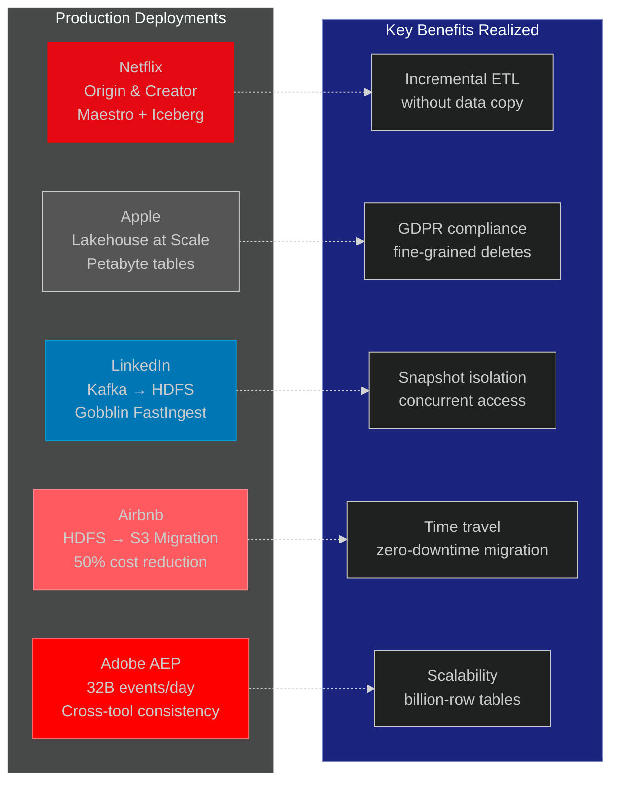

## Insert/Query Flow & Time Travel in Iceberg

When you run an `INSERT` (or other write DML) on an Iceberg table, the following happens conceptually:

1. **Data is written to new file(s):** As in a data lake, the engine (Spark, Flink, etc.) writes out new Parquet (or ORC/Avro) files with the inserted rows. These files go into the table’s storage location on S3.

2. **New manifest is created:** Iceberg generates a **manifest file** listing the new data file(s) (and their row counts, partition stats, etc.). The manifest tracks which snapshot added those files.

3. **Snapshot update:** A **new snapshot** is built. This includes a new **manifest list** file (concatenating all manifests for the snapshot) and records e.g. “snapshot-id=10005, pointing to new manifest. It may *replace* or *append-to* the existing manifests depending on table version (Iceberg v2 uses manifest lists) [o^A Short Introduction to Apache Iceberg │ by Christine Mathiesen │ Expedia Group Technology │ Medium](https://medium.com/expedia-group-tech/a-short-introduction-to-apache-iceberg-d34f628b6799?sortBy=REVERSE_CHRON#:~:text=1,like%20Parquet%2C%20ORC%2C%20Avro%20etc).

4. **Atomic metadata swap:** Iceberg writes a new `metadata.json` file capturing the updated state (including the new manifest list and possibly updated schema/partition spec). Then it atomically **swaps** the table's metadata pointer to this new `metadata.json`. If using a catalog like Glue or Polaris, the catalog entry for the table is updated transactionally to reference the new metadata path.

5. **Commit:** Once the metadata pointer is updated, the insert is committed. Any readers list the table, the catalog returns the new metadata.json, and queries see the new data files. If multiple writers race, the catalog’s atomic update ensures serializability (the last writer wins or conflicts are handled).

6. **Time travel / rollback:** Because each write preserves the old metadata.json (and snapshots), Iceberg tables support time travel. You can query a historical snapshot by using e.g. `FOR SYSTEM_TIME AS OF timestamp` (Athena) or selecting a `snapshot_id` (Spark), and Iceberg will read the older metadata state. Internally, it walks back the snapshot lineage to find the manifest list at that point. A **rollback** procedure simply sets back the catalog pointer to a previous snapshot (and can optionally clean up newer metadata files). For example, Athena allows queries like:
   ```
   SELECT * FROM product_db.products 
   FOR TIMESTAMP AS OF (current_timestamp - interval '20' minute)
   ```  
   which returns the table data as of 20 minutes ago [o^Build an Apache Iceberg data lake using Amazon Athena, Amazon EMR, and AWS Glue │ AWS Big Data Blog](https://aws.amazon.com/blogs/big-data/build-an-apache-iceberg-data-lake-using-amazon-athena-amazon-emr-and-aws-glue/#:~:text=creates%20a%20new%20version,the%20first%20version%20was%20committed). Under the hood, Iceberg reads the snapshot that was current 20 minutes ago and returns the rows from that older set of data files.

In short, an [Iceberg](#glossary) insert is not an in-place file update but a series of writes to new files and [metadata](#glossary), ending with a pointer switch. This is why [Iceberg](#glossary) provides [MVCC](#glossary)-like [ACID](#glossary) without locks. [Time travel](#glossary) simply chooses an earlier [metadata](#glossary) JSON file (or [snapshot](#glossary) ID) and reads the [manifest](#glossary) listings from that historical state [o^A Short Introduction to Apache Iceberg │ by Christine Mathiesen │ Expedia Group Technology │ Medium](https://medium.com/expedia-group-tech/a-short-introduction-to-apache-iceberg-d34f628b6799?sortBy=REVERSE_CHRON#:~:text=Using%20the%20snapshot%20pattern%20means,specifying%20the%20snapshot%20to%20use) [o^Build an Apache Iceberg data lake using Amazon Athena, Amazon EMR, and AWS Glue │ AWS Big Data Blog](https://aws.amazon.com/blogs/big-data/build-an-apache-iceberg-data-lake-using-amazon-athena-amazon-emr-and-aws-glue/#:~:text=creates%20a%20new%20version,the%20first%20version%20was%20committed).

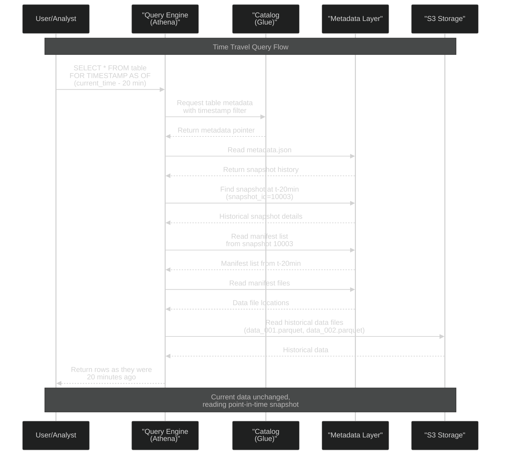

## Hands-On Example: Iceberg on AWS with Glue & Athena

Below is a simplified walkthrough (conceptual) of using AWS to create and query an Iceberg table on S3. It combines AWS Glue as catalog, Amazon Athena (for SQL) and optional Spark (on EMR):

**1. Setup AWS Glue Data Catalog:** Create a Glue database (e.g. `demo_db`). Ensure your AWS user/role has Glue and S3 access (see the [AWS blog] for roles/policies [o^Build an Apache Iceberg data lake using Amazon Athena, Amazon EMR, and AWS Glue │ AWS Big Data Blog](https://aws.amazon.com/blogs/big-data/build-an-apache-iceberg-data-lake-using-amazon-athena-amazon-emr-and-aws-glue/#:~:text=6,the%C2%A0AWSGlueConsoleFullAccess%C2%A0policy%20to%20your%20runtime%20role)).

**2. Create Iceberg table:** You can use either Spark or Athena. Using Spark (AWS EMR):  

```scala
// In Spark (e.g. AWS EMR, Glue ETL, or Databricks with Glue catalog):
spark.sql("CREATE DATABASE IF NOT EXISTS demo_db");
val df = spark.read.parquet("s3://my-bucket/data.parquet") // sample data
df.writeTo("demo_db.sample_table")             // create Iceberg table
  .using("iceberg")
  .tableProperty("format-version", "2")        // use Iceberg v2 for updates
  .createOrReplace();
```

This Spark code (Iceberg 1.x) creates an *Iceberg-managed table* `sample_table` in database `demo_db` using Glue as the catalog (we configured `spark.sql.catalog` to use Glue) [o^Build an Apache Iceberg data lake using Amazon Athena, Amazon EMR, and AWS Glue │ AWS Big Data Blog](https://aws.amazon.com/blogs/big-data/build-an-apache-iceberg-data-lake-using-amazon-athena-amazon-emr-and-aws-glue/#:~:text=,product_db) [o^Build an Apache Iceberg data lake using Amazon Athena, Amazon EMR, and AWS Glue │ AWS Big Data Blog](https://aws.amazon.com/blogs/big-data/build-an-apache-iceberg-data-lake-using-amazon-athena-amazon-emr-and-aws-glue/#:~:text=,this%20in%20a%20later%20step). The table data and metadata are stored under `s3://<your-bucket>/demo_db.db/sample_table/…`. After this step, the table shows up in AWS Glue Catalog (via Athena or the Glue console).

Alternatively, using Athena’s DDL (ensure Glue is your default metastore):  
```sql
CREATE TABLE demo_db.sample_table (
  id BIGINT, name string, value DOUBLE
)
PARTITIONED BY (year, month)
LOCATION 's3://<your-bucket>/demo_db.db/sample_table/'
TBLPROPERTIES ('table_type'='ICEBERG');
```
This creates an empty v2 Iceberg table in Glue [o^Create Iceberg tables – Amazon Athena](https://docs.aws.amazon.com/athena/latest/ug/querying-iceberg-creating-tables.html#:~:text=%60CREATE%20TABLE%20,%60property_name%60%3D%60property_value%60%5D). You could then use `CTAS` or Spark to load data.

**3. Ingest data:** With Spark (EMR) you can insert rows:  
```sql
INSERT INTO demo_db.sample_table VALUES 
  (1, 'foo', 3.14, 2023, 9), 
  (2, 'bar', 2.71, 2023, 9);
```
(This writes new Parquet files, manifests, and commits metadata.) In Athena, you could similarly use `INSERT` once the table exists, since Athena supports Iceberg writes.

**4. Query with Athena:** In the Athena console, run:
```sql
SELECT * 
FROM demo_db.sample_table
WHERE id = 1;
```
If configured, Athena uses Glue as the Iceberg catalog and reads the Iceberg metadata. You’ll get the inserted rows. Athena’s query engine version must support Iceberg (as of Nov 2022 Athena has Iceberg support [o^Build an Apache Iceberg data lake using Amazon Athena, Amazon EMR, and AWS Glue │ AWS Big Data Blog](https://aws.amazon.com/blogs/big-data/build-an-apache-iceberg-data-lake-using-amazon-athena-amazon-emr-and-aws-glue/#:~:text=Iceberg%20on%20AWS%20Glue,0)).

**5. Time travel:** Suppose 10 minutes later you updated or deleted some rows. You can still query the old data via `FOR TIMESTAMP AS OF`:
```sql
SELECT * 
FROM demo_db.sample_table
FOR TIMESTAMP AS OF (current_timestamp - interval '10' minute);
```
This returns the table contents from 10 minutes ago, using the historical snapshot [o^Build an Apache Iceberg data lake using Amazon Athena, Amazon EMR, and AWS Glue │ AWS Big Data Blog](https://aws.amazon.com/blogs/big-data/build-an-apache-iceberg-data-lake-using-amazon-athena-amazon-emr-and-aws-glue/#:~:text=creates%20a%20new%20version,the%20first%20version%20was%20committed). The Athena blog shows exactly this syntax [o^Build an Apache Iceberg data lake using Amazon Athena, Amazon EMR, and AWS Glue │ AWS Big Data Blog](https://aws.amazon.com/blogs/big-data/build-an-apache-iceberg-data-lake-using-amazon-athena-amazon-emr-and-aws-glue/#:~:text=creates%20a%20new%20version,the%20first%20version%20was%20committed).

**6. Schema evolution (optional):** To add a column, Athena supports Iceberg’s DDL:
```sql
ALTER TABLE demo_db.sample_table ADD COLUMNS (new_col int);
```
So now the table has a new column (null for old rows). Delta Hudi support similar. The Glue Catalog and the Iceberg metadata are updated to include the new column (Athena docs confirm `ALTER TABLE ADD COLUMNS` is allowed for Iceberg [o^ALTER TABLE ADD COLUMNS – Amazon Athena](https://docs.aws.amazon.com/athena/latest/ug/querying-iceberg-alter-table-add-columns.html#:~:text=Synopsis)).

**IAM & Versions:** In AWS, make sure:
- The Athena/Glue user has permissions on the S3 bucket and Glue DB.
- If using EMR/Spark, the EMR role needs `AWSGlueConsoleFullAccess` (per AWS guide [o^Build an Apache Iceberg data lake using Amazon Athena, Amazon EMR, and AWS Glue │ AWS Big Data Blog](https://aws.amazon.com/blogs/big-data/build-an-apache-iceberg-data-lake-using-amazon-athena-amazon-emr-and-aws-glue/#:~:text=6,the%C2%A0AWSGlueConsoleFullAccess%C2%A0policy%20to%20your%20runtime%20role)).
- Athena engine version must be up-to-date (choose Iceberg-compatible engine version).
- EMR 6.5+ (Spark 3.2+) or AWS Glue 4.0+ supports Iceberg.
- For Databricks Spark, use runtime 15.4 LTS+ and the AWS Iceberg connector.

This *hands-on example* is based on AWS official tutorials [o^Build an Apache Iceberg data lake using Amazon Athena, Amazon EMR, and AWS Glue │ AWS Big Data Blog](https://aws.amazon.com/blogs/big-data/build-an-apache-iceberg-data-lake-using-amazon-athena-amazon-emr-and-aws-glue/#:~:text=Apache%20Iceberg%20is%20an%20open,you%20to%20do%20the%20following) [o^Build an Apache Iceberg data lake using Amazon Athena, Amazon EMR, and AWS Glue │ AWS Big Data Blog](https://aws.amazon.com/blogs/big-data/build-an-apache-iceberg-data-lake-using-amazon-athena-amazon-emr-and-aws-glue/#:~:text=creates%20a%20new%20version,the%20first%20version%20was%20committed). Data flows from [S3](#glossary) through the [Iceberg](#glossary) format ([manifest](#glossary)/[snapshots](#glossary)) with the [Glue](#glossary) [catalog](#glossary) directing [Athena](#glossary)/[Spark](#glossary) to it. The exercise shows cross-engine interoperability: [Athena](#glossary) reads data produced by [Spark](#glossary), [time travel](#glossary) queries work across engines, and [schema](#glossary) changes propagate through the [catalog](#glossary).

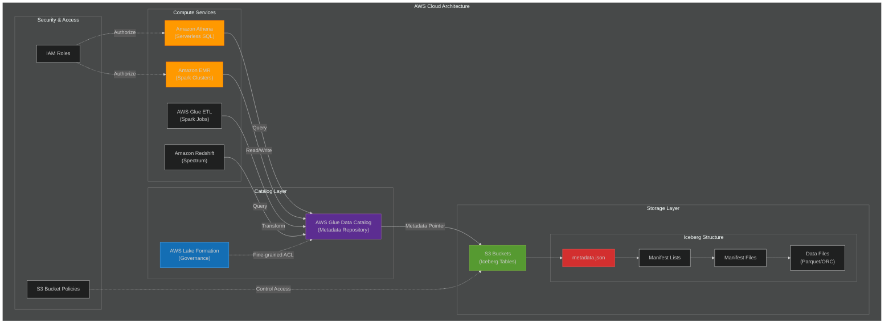

## Further Resources

- **Apache Iceberg Documentation:** The official site and docs (iceberg.apache.org) have quickstarts, table spec, etc.  
- **AWS Athena + Iceberg:** [Athena Create/Iceberg docs](https://docs.aws.amazon.com/athena/latest/ug/querying-iceberg-creating-tables.html) [o^Create Iceberg tables – Amazon Athena](https://docs.aws.amazon.com/athena/latest/ug/querying-iceberg-creating-tables.html#:~:text=%60CREATE%20TABLE%20,%60property_name%60%3D%60property_value%60%5D) and [Athena Guide](https://docs.aws.amazon.com/athena/latest/ug/querying-iceberg.html). The AWS Big Data blog ["Build an Apache Iceberg data lake..."] [o^Build an Apache Iceberg data lake using Amazon Athena, Amazon EMR, and AWS Glue │ AWS Big Data Blog](https://aws.amazon.com/blogs/big-data/build-an-apache-iceberg-data-lake-using-amazon-athena-amazon-emr-and-aws-glue/#:~:text=Apache%20Iceberg%20is%20an%20open,you%20to%20do%20the%20following) [o^Build an Apache Iceberg data lake using Amazon Athena, Amazon EMR, and AWS Glue │ AWS Big Data Blog](https://aws.amazon.com/blogs/big-data/build-an-apache-iceberg-data-lake-using-amazon-athena-amazon-emr-and-aws-glue/#:~:text=creates%20a%20new%20version,the%20first%20version%20was%20committed) shows EMR+Glue+Athena examples (SQL and Spark).  
- **AWS Glue Catalog for Iceberg:** AWS blog [“Glue Crawler, Create Table support for Iceberg”] [o^Introducing AWS Glue crawler and create table support for Apache Iceberg format │ AWS Big Data Blog](https://aws.amazon.com/blogs/big-data/introducing-aws-glue-crawler-and-create-table-support-for-apache-iceberg-format/#:~:text=AWS%20Glue%20crawlers%20now%20support,grained%20permissions) explains Glue integration. Also [Glue documentation](https://docs.aws.amazon.com/glue/latest/dg/minimize-to-data-catalog.html) on Iceberg (populating schemas). Free versions of Hive Metastore (e.g. on Galaxy or EMR) behave similarly.  
- **Databricks Unity Catalog:** [Unity Catalog docs on Databricks](https://docs.databricks.com/data-governance/unity-catalog/index.html) describe its governance model. See Databricks blog on Iceberg [“Unity Catalog Advancements” June 2025】 [o^Databricks Eliminates Table Format Lock–in and Adds Capabilities for Business Users with Unity Catalog Advancements – Databricks](https://www.databricks.com/company/newsroom/press-releases/databricks-eliminates-table-format-lock-and-adds-capabilities#:~:text=Unity%20Catalog%20Now%20Eliminates%20the,a%20single%20approach%20to%20governance). Also [Databricks support tickets/docs](https://docs.databricks.com/_media/databricks-datasets/unity/iceberg-rest-catalog-api.html) detail using the Iceberg REST API with Unity.  
- **Polaris/Tabular:** Official [Apache Polaris docs](https://polaris.apache.org/docs/overview) [o^Overview │ Apache Polaris](https://polaris.apache.org/docs/overview/#:~:text=Apache%20Polaris%20,source%20Apache%20Iceberg%E2%84%A2%20REST%20protocol) and the Snowflake/BusinessWire announcement [o^Snowflake – Snowflake Unveils Polaris Catalog and Emphasizes Commitment to Interoperability with AWS, Google Cloud, Microsoft Azure, Salesforce, and More](https://investors.snowflake.com/news/news-details/2024/Snowflake-Unveils-Polaris-Catalog-and-Emphasizes-Commitment-to-Interoperability-with-AWS-Google-Cloud-Microsoft-Azure-Salesforce-and-More/default.aspx?utm_cta=website-blog#:~:text=Catalog%20cts.businesswire.com%20%2C%20a%20vendor,Microsoft%20Azure%2C%20Salesforce%2C%20and%20more) introduce Polaris. It describes catalog model and usage with Snowflake. The [VentureBeat article](https://venturebeat.com/2024/06/03/snowflake-unveils-polaris) [o^Snowflake unveils Polaris, a vendor–neutral open catalog implementation for Apache Iceberg](https://venturebeat.com/data-infrastructure/snowflake-unveils-polaris-a-vendor-neutral-open-catalog-implementation-of-apache-iceberg//#:~:text=To%20address%20this%20concern%2C%20and,Python%2C%20%2010%20and%20others) gives background.  
- **Trino/Presto with Iceberg:** See [Trino’s Iceberg connector docs](https://trino.io/docs/current/connector/iceberg.html) [o^Iceberg connector — Trino 462 Documentation](https://trino.io/docs/current/connector/iceberg.html?highlight=catalog#:~:text=,or%20a%20%2011). Presto (now Trino) can use Hive, Glue, or REST catalogs. Starburst’s release notes (Galaxy) show Snowflake/Iceberg catalog support [o^What’s New in Starburst Galaxy – May 2024 │ Starburst](https://www.starburst.io/blog/whats-new-in-starburst-galaxy-may-2024/#:~:text=We%20have%20a%20suite%20of,this%20month%2C%20let%E2%80%99s%20dive%20in) for Starburst’s Presto service.  
- **Snowflake Iceberg Support:** Snowflake supports external Iceberg tables on S3/GCS/ADLS. See [Snowflake docs on Iceberg tables](https://docs.snowflake.com/user-guide/tables-iceberg) [o^Apache Iceberg™ tables │ Snowflake Documentation](https://docs.snowflake.com/user-guide/tables-iceberg#:~:text=Snowflake%20supports%20Iceberg%20tables%20that,the%20Apache%20Parquet%E2%84%A2%20file%20format) and [Snowflake blog on Iceberg support](https://www.snowflake.com/blog/snowflake-native-iceberg) for details on configuring external volumes and catalogs.  
- **Redshift + Iceberg:** AWS Redshift docs cover Redshift’s ability to query Iceberg on S3 [“Using Apache Iceberg tables with Redshift”] (2023 preview). Snowflake’s Polaris and AWS have collaborated to ensure Redshift can use Glue Iceberg catalogs. See AWS Big Data blog [“Query Iceberg tables using Redshift”] for setup.  
- **Spark & Iceberg:** The Apache Spark documentation notes Iceberg support, and the Iceberg repo lists compatibility (e.g. Iceberg 1.9 supports Spark 3.5) [o^Releases – Apache Iceberg™](https://iceberg.apache.org/releases/?utm_campaign=french-predictions-2024&utm_cta=website-snowpark-resources-spark-to-snowpark-for-de-page%3Fwtime&utm_medium=Website&utm_source=Snowflake&wtime=#:~:text=Releases%20,1.9.0). Use Iceberg’s Spark extensions (`spark.sql.extensions`) for DDL procedures.  
- **General Tutorials:** Look for conference talks and blogs: Netflix tech blog (Iceberg origin), [Expedia Group Tech blog (Christine Mathiesen)](https://medium.com/expedia-group-tech/a-short-introduction-to-apache-iceberg-d34f628b6799) [o^A Short Introduction to Apache Iceberg │ by Christine Mathiesen │ Expedia Group Technology │ Medium](https://medium.com/expedia-group-tech/a-short-introduction-to-apache-iceberg-d34f628b6799?sortBy=REVERSE_CHRON#:~:text=The%20project%20was%20originally%20developed,19th%20of%20May%202020%20%F0%9F%8E%89), Dremio webinars on Iceberg (Netflix), and AWS re:Post guides. The **Arctic and Nessie projects** are related catalogs (Nessie adds Git-style branching).

These resources (official docs and engineering posts) provide in-depth guidance. They also document current support levels: for example, Athena announced Iceberg SQL support in Nov 2022 [o^Build an Apache Iceberg data lake using Amazon Athena, Amazon EMR, and AWS Glue │ AWS Big Data Blog](https://aws.amazon.com/blogs/big-data/build-an-apache-iceberg-data-lake-using-amazon-athena-amazon-emr-and-aws-glue/#:~:text=Iceberg%20on%20AWS%20Glue,0), Redshift preview in 2023, and Databricks Iceberg support as preview in 2025 [o^Databricks Eliminates Table Format Lock–in and Adds Capabilities for Business Users with Unity Catalog Advancements – Databricks](https://www.databricks.com/company/newsroom/press-releases/databricks-eliminates-table-format-lock-and-adds-capabilities#:~:text=with%20powerful%20new%20capabilities,discovery%20is%20enhanced%20for%20business). Always check version compatibility (Spark 3.2+/Iceberg 1.1+, Athena engine versions, etc.) for ACID features. 

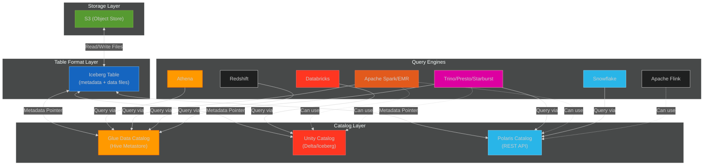

This diagram shows how data files ([Parquet](#glossary) on [S3](#glossary)) are organized by the [Iceberg](#glossary) [table format](#glossary) and tracked by a [catalog](#glossary). Query engines ([Athena](#glossary), [Spark](#glossary), [Trino](#glossary), [Redshift](#glossary), [Databricks](#glossary), [Snowflake](#glossary)) consult a [catalog](#glossary) ([Glue](#glossary), [Unity](#glossary), [Polaris](#glossary)) to find tables, then read the data via the [Iceberg](#glossary) [metadata](#glossary).

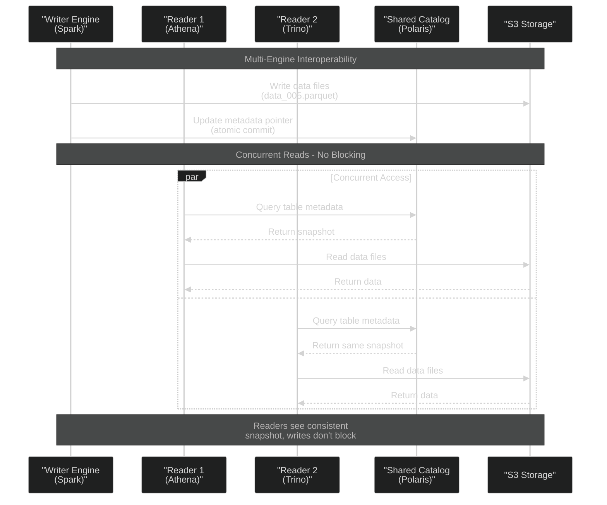

**References:** Official Apache Iceberg docs, AWS and Databricks docs, and engineering blogs (Netflix, Apple, LinkedIn, AWS, Snowflake) have informed this guide [o^A Short Introduction to Apache Iceberg │ by Christine Mathiesen │ Expedia Group Technology │ Medium](https://medium.com/expedia-group-tech/a-short-introduction-to-apache-iceberg-d34f628b6799?sortBy=REVERSE_CHRON#:~:text=The%20project%20was%20originally%20developed,19th%20of%20May%202020%20%F0%9F%8E%89) [o^Introducing AWS Glue crawler and create table support for Apache Iceberg format │ AWS Big Data Blog](https://aws.amazon.com/blogs/big-data/introducing-aws-glue-crawler-and-create-table-support-for-apache-iceberg-format/#:~:text=AWS%20Glue%20crawlers%20now%20support,grained%20permissions) [o^Databricks Eliminates Table Format Lock–in and Adds Capabilities for Business Users with Unity Catalog Advancements – Databricks](https://www.databricks.com/company/newsroom/press-releases/databricks-eliminates-table-format-lock-and-adds-capabilities#:~:text=Unity%20Catalog%20Now%20Eliminates%20the,a%20single%20approach%20to%20governance) [o^Snowflake – Snowflake Unveils Polaris Catalog and Emphasizes Commitment to Interoperability with AWS, Google Cloud, Microsoft Azure, Salesforce, and More](https://investors.snowflake.com/news/news-details/2024/Snowflake-Unveils-Polaris-Catalog-and-Emphasizes-Commitment-to-Interoperability-with-AWS-Google-Cloud-Microsoft-Azure-Salesforce-and-More/default.aspx?utm_cta=website-blog#:~:text=Catalog%20cts.businesswire.com%20%2C%20a%20vendor,Microsoft%20Azure%2C%20Salesforce%2C%20and%20more) [o^How Iceberg Powers Data and AI Applications at Apple, Netflix, LinkedIn, and Other Leading Companies │ Qlik Blog](https://www.qlik.com/blog/how-iceberg-powers-data-and-ai-applications-at-apple-netflix-linkedin-and#:~:text=Apache%20Iceberg%E2%80%AFis%20an%20open%20table,interoperability%20across%20multiple%20query%20engines) [o^Build an Apache Iceberg data lake using Amazon Athena, Amazon EMR, and AWS Glue │ AWS Big Data Blog](https://aws.amazon.com/blogs/big-data/build-an-apache-iceberg-data-lake-using-amazon-athena-amazon-emr-and-aws-glue/#:~:text=creates%20a%20new%20version,the%20first%20version%20was%20committed). These cover the latest (2025) capabilities and usage of Iceberg and catalogs in lakehouse architectures.

---

## Glossary

### A

**ACID Transactions**: Atomicity, Consistency, Isolation, Durability - properties that guarantee database transactions are processed reliably. In data lakes, table formats like Iceberg provide ACID semantics through metadata-based snapshot isolation and atomic pointer updates.

**Apache Iceberg**: An open table format for huge analytic datasets, created by Netflix in 2017. Provides ACID transactions, schema evolution, time travel, and hidden partitioning through a metadata layer consisting of metadata.json files, manifest lists, and manifest files.

**Apache Spark**: A unified analytics engine for large-scale data processing. Supports multiple table formats including Iceberg, Delta Lake, and Hudi. Can read/write from various catalogs (Glue, Unity, Polaris).

**Athena**: Amazon Athena, a serverless interactive query service that allows analyzing data in S3 using SQL. Supports Iceberg tables via AWS Glue Data Catalog.

**Atomic Commits**: Operations that either complete entirely or not at all, with no partial states visible. In Iceberg, achieved through atomic metadata pointer updates in the catalog.

**Avro**: A row-oriented data serialization format developed by Apache. Commonly used for streaming data and provides built-in schema evolution capabilities.

### C

**Catalog**: A centralized metadata repository that maps table names to their metadata locations. Stores the pointer to the current metadata.json file for Iceberg tables. Examples include AWS Glue, Unity Catalog, and Polaris.

**CDC (Change Data Capture)**: The process of identifying and capturing changes made to data in a database. Apache Hudi specializes in CDC workloads with incremental processing.

**Columnar Format**: A file format that stores data by column rather than by row. Parquet and ORC are columnar formats optimized for analytical queries, providing efficient compression and column-level access.

**Compaction**: The process of merging small data files into larger ones to improve query performance and reduce metadata overhead. Critical for table formats at scale.

**Copy-on-Write (COW)**: A write mode where updates create new file versions rather than modifying existing files. One of two write modes in Apache Hudi.

### D

**Databricks**: A unified analytics platform built on Apache Spark. Creator of Delta Lake and Unity Catalog. Now supports Iceberg tables through Unity Catalog's REST API.

**Delta Lake**: An open-source table format created by Databricks that provides ACID transactions on top of data lakes. Uses a transaction log (_delta_log) for metadata management.

### E

**EMR (Elastic MapReduce)**: Amazon EMR, a managed cluster platform for running big data frameworks like Apache Spark and Hadoop on AWS.

**Engine-Neutral**: A design philosophy where table formats and catalogs work with multiple query engines without vendor lock-in. Iceberg is designed to be engine-neutral.

### F

**File Format**: The physical encoding of data files. Examples include Parquet (columnar), ORC (columnar), and Avro (row-based). File formats are distinct from table formats.

**Flink**: Apache Flink, a stream processing framework that supports both batch and real-time data processing. Can work with Iceberg tables.

### G

**Glue (AWS Glue Data Catalog)**: Amazon's managed metadata repository service that provides a Hive-compatible metastore. Supports Iceberg, Hudi, and traditional Hive tables.

**GDPR**: General Data Protection Regulation - EU data privacy law requiring fine-grained data deletion capabilities, driving adoption of table formats that support row-level deletes.

### H

**HDFS (Hadoop Distributed File System)**: A distributed file system designed to run on commodity hardware. Often used in on-premises big data deployments.

**Hidden Partitioning**: Iceberg's approach where partition logic is abstracted from users. Queries don't need to include partition filters explicitly, and partition schemes can evolve without rewriting data.

**Hive Metastore**: The traditional metadata service for Apache Hive, typically backed by a relational database (MySQL/PostgreSQL). Uses Thrift protocol and remains widely used for backward compatibility.

**Hudi (Apache Hudi)**: "Hadoop Upserts Deletes and Incrementals" - a table format created by Uber optimized for CDC workloads and incremental data processing. Supports Copy-on-Write and Merge-on-Read modes.

### I

**IAM (Identity and Access Management)**: AWS service for managing access to cloud resources. Required for securing access to S3 buckets, Glue catalogs, and compute services.

**Iceberg**: See "Apache Iceberg"

**Incremental Processing**: Processing only new or changed data rather than reprocessing entire datasets. Supported by all major table formats through snapshot-based tracking.

### L

**Lake Formation (AWS Lake Formation)**: AWS service for building, securing, and managing data lakes. Provides fine-grained access control on top of AWS Glue Data Catalog.

**Lakehouse**: An architecture that combines the scalability and low cost of data lakes with the ACID transactions and schema enforcement of data warehouses. Enabled by table formats like Iceberg, Delta, and Hudi.

### M

**Manifest File**: In Iceberg, a metadata file that lists data files along with statistics (row counts, column min/max values, null counts). Used for query planning and pruning.

**Manifest List**: In Iceberg, a metadata file that points to multiple manifest files. Each snapshot references a manifest list, which provides the complete set of data files for that snapshot.

**Merge-on-Read (MOR)**: A write mode where updates are written as delta logs and merged with base files during read time. One of two write modes in Apache Hudi, optimizing for write performance.

**Metadata**: Data about data. In table formats, includes schema definitions, partition specifications, snapshot history, and file locations. Stored separately from actual data files.

**Metastore**: See "Catalog" - a service that stores table definitions and metadata. Hive Metastore is the traditional implementation.

**MVCC (Multi-Version Concurrency Control)**: A concurrency control method where multiple versions of data coexist, allowing readers to access consistent snapshots while writers create new versions. Iceberg uses MVCC-like patterns.

### O

**ORC (Optimized Row Columnar)**: A columnar storage file format optimized for Hadoop workloads. Provides efficient compression and encoding schemes similar to Parquet.

### P

**Parquet**: Apache Parquet, a columnar storage file format widely used in big data ecosystems. Provides efficient compression and encoding schemes, making it ideal for analytical workloads.

**Partition**: A way to organize data into subdirectories based on column values (e.g., by date or region). Improves query performance by allowing pruning of irrelevant data.

**Partitioning**: The strategy of dividing data into partitions. Table formats support both physical partitioning (directory-based) and logical partitioning (metadata-based).

**Polaris (Apache Polaris)**: An open-source catalog for Apache Iceberg, donated by Snowflake. Implements the Iceberg REST catalog specification and enables vendor-neutral, multi-engine table access.

**Presto**: See "Trino" - Presto was renamed to Trino after a fork in 2020.

### R

**RBAC (Role-Based Access Control)**: A security approach where permissions are assigned to roles rather than individual users. Supported by catalogs like Polaris and Unity Catalog.

**Redshift**: Amazon Redshift, a cloud data warehouse service. Redshift Spectrum can query Iceberg tables on S3 via the Glue catalog.

**REST API**: Representational State Transfer API - a standard web protocol. Polaris uses the Iceberg REST catalog API for interoperability.

**Rollback**: The ability to revert a table to a previous snapshot. Supported by table formats through snapshot history.

### S

**S3 (Amazon S3)**: Simple Storage Service, AWS's object storage service. Commonly used as the storage layer for data lakes and Iceberg tables.

**Schema**: The structure definition of a table including column names, data types, and constraints. Table formats support schema evolution without rewriting data.

**Schema Evolution**: The ability to change a table's schema (add/remove/rename columns) without rewriting existing data. Supported by Iceberg, Delta, and Hudi.

**Serializable Isolation**: The highest isolation level in transaction processing, ensuring transactions appear to execute serially. Iceberg provides serializable isolation through optimistic concurrency control.

**Snapshot**: A point-in-time state of a table. In Iceberg, each write operation creates a new snapshot containing references to all current data files. Snapshots enable time travel and MVCC.

**Snowflake**: A cloud data warehouse platform. Supports querying external Iceberg tables and donated the Polaris catalog to the Apache Foundation.

**Spark**: See "Apache Spark"

### T

**Table Format**: A specification that defines how data files are organized into tables with transaction semantics. Sits above file formats (Parquet/ORC/Avro) and below catalogs. Examples: Iceberg, Delta Lake, Hudi.

**Thrift**: Apache Thrift, an RPC framework used by Hive Metastore for communication. Less common in modern cloud-native catalogs.

**Time Travel**: The ability to query historical versions of a table by specifying a timestamp or snapshot ID. Enabled by retaining snapshot history in table formats.

**Transaction Log**: A sequential record of all changes to a table. Delta Lake uses a transaction log stored in the _delta_log directory.

**Trino**: A distributed SQL query engine (formerly Presto). Supports querying Iceberg tables via multiple catalog implementations (Glue, Hive, REST).

### U

**Unity Catalog**: Databricks' unified governance solution for data and AI assets. Provides centralized metadata, access control, and lineage tracking. Originally Delta-focused, now supporting Iceberg via REST API.

**Upsert**: An operation that updates a record if it exists, or inserts it if it doesn't. Apache Hudi specializes in efficient upsert operations.

### V

**Vendor Lock-in**: Dependence on a specific vendor's technology, making it difficult or costly to switch. Open table formats and catalogs (Iceberg, Polaris) aim to reduce vendor lock-in.

### Z

**Zero-Copy Migration**: A technique to migrate existing Parquet/ORC data to Iceberg by registering files in Iceberg metadata without physically copying or rewriting data. Used by Apple for large-scale migrations.

---

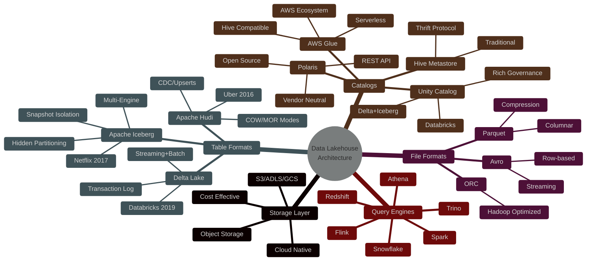