# Orchestration as a Distributed System: Airflow vs Prefect (boundaries, contracts, sequences, tradeoffs)
*(Industry-general learning paper with Pinterest/Spinner callouts clearly labeled.)*

## Executive Summary

This comprehensive document provides a deep-dive analysis of workflow [orchestration](#glossary) systems, focusing on Apache [Airflow](#glossary) and [Prefect](#glossary) as representative implementations of different architectural patterns. Rather than treating orchestrators as monolithic tools, this paper dissects them as distributed systems with explicit contracts between components, examining the critical boundaries between control planes and data planes, push versus pull work distribution models, and the real-world implications of architectural choices on reliability, scalability, and operational complexity.

The document is structured around a systems-design lens, emphasizing contracts (what components exchange, over which channels, with what guarantees), sequences (how work flows through the system during normal and failure scenarios), and tradeoffs (the engineering decisions that optimize for specific operational characteristics). We examine [Airflow](#glossary)'s two primary execution models—[CeleryExecutor](#glossary) (broker-centric push) and [KubernetesExecutor](#glossary) (API-centric, no broker)—alongside [Prefect](#glossary)'s pull-based worker polling architecture. Throughout, we ground abstract concepts in practical realities: at-least-once delivery semantics, [idempotency](#glossary) requirements, [scheduler](#glossary) failover and task adoption, and backpressure mechanisms.

Industry-standard patterns are illustrated with Pinterest's Spinner platform as a real-world case study, demonstrating how orchestration systems integrate with external compute platforms ([Spark](#glossary), [Hadoop](#glossary), [Hive](#glossary), Snowflake) while maintaining lightweight orchestration pods. The paper concludes with actionable design review checklists and migration playbooks, making it valuable both as a learning resource for understanding distributed orchestration architectures and as a practical guide for evaluating, implementing, or migrating production orchestration systems. Key themes include the inevitability of at-least-once execution in distributed systems, the necessity of [idempotent](#glossary) external job submission, the architectural patterns for high availability through [scheduler](#glossary) [adoption](#glossary), and the sophisticated backpressure mechanisms required to protect production [SLOs](#glossary) during backfill operations.

---

## 0) Framing: what you're actually designing
A workflow [orchestrator](#glossary) is best understood as two planes:

- **[Control plane](#glossary) (orchestration plane):** decides *what should run next*, tracks *state*, enforces *policies* ([retries](#glossary), [concurrency](#glossary), priorities), exposes UI/API.
- **[Data plane](#glossary) (execution plane):** actually *runs code* ([pods](#glossary)/containers/VM processes) and interacts with *external compute* and *data systems*.

Most "[Airflow](#glossary) vs [Prefect](#glossary)" confusion comes from mixing these: e.g., "the [scheduler](#glossary) runs tasks" (it doesn't), "the [broker](#glossary) guarantees delivery" (it doesn't guarantee *exactly-once*), or "no broker means no queue semantics" (also false).

---

## 1) Contracts (protocol-level, but not brittle)
When I say **contract**, I mean: *what components exchange over which channel, what the message means, and what each side promises*.

### 1.0 Core Contract Architecture Overview
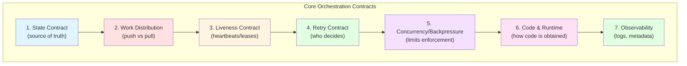

### 1.1 Canonical contracts you should look for in any [orchestrator](#glossary)
1. **[State contract](#glossary) (source of truth):**
   - Where does "[Queued](#glossary)/[Running](#glossary)/[Succeeded](#glossary)/[Failed](#glossary)" live?
   - Who is allowed to transition states?
2. **[Work distribution contract](#glossary) (handoff mechanism):**
   - **[Push model](#glossary)** ([scheduler](#glossary) pushes work to [workers](#glossary) via [broker](#glossary)/queue) vs **[Pull model](#glossary)** ([workers](#glossary) poll/claim work from API).
3. **[Liveness contract](#glossary) ([heartbeats](#glossary) / [leases](#glossary)):**
   - How does the system detect "a [worker](#glossary) died mid-run"?
   - What happens next ([adopt](#glossary), reschedule, mark [crashed](#glossary))?
4. **[Retry](#glossary) contract (who schedules retries):**
   - Is [retry](#glossary) decided in the [control plane](#glossary) (recommended), or implicitly by the message system, or both?
5. **[Concurrency](#glossary) / [backpressure](#glossary) contract:**
   - Where are limits enforced (DB scheduling logic, queue limits, worker-side slots)?
6. **Code & runtime contract:**
   - How does the execution plane obtain code and dependencies (shared [DAG](#glossary) folder, baked image, git pull)?
7. **[Observability](#glossary) contract:**
   - Where do logs go, how are they referenced, what is persisted as [metadata](#glossary)?

---

## 2) [Airflow](#glossary) system design (two major architectures)

### 2.1 [Airflow](#glossary) "required components" (modern upstream)
[Airflow](#glossary)'s minimal architecture includes **[scheduler](#glossary)**, **[DAG processor](#glossary)**, **[webserver](#glossary)**, **[DAG](#glossary) files**, and a **[metadata database](#glossary)**. ([airflow.apache.org](https://airflow.apache.org/docs/apache-airflow/3.0.4/core-concepts/overview.html?utm_source=openai))
Key point: in modern [Airflow](#glossary), [DAG](#glossary) parsing/serialization is explicitly treated as a component ([DAG processor](#glossary)), and the [metadata](#glossary) DB is the state backbone. ([airflow.apache.org](https://airflow.apache.org/docs/apache-airflow/3.0.4/core-concepts/overview.html?utm_source=openai))

---

## 3) [Airflow](#glossary) with [CeleryExecutor](#glossary) (broker-centric [push model](#glossary))

### 3.1 What this architecture optimizes for
- **Decoupling** scheduling from execution using a brokered queue.
- **Burst absorption**: queue depth buffers spikes.
- **Long-lived [workers](#glossary)** can be warm (fast startup).

[Airflow](#glossary) requires a [Celery](#glossary) backend/[broker](#glossary) (e.g., RabbitMQ/Redis) for [CeleryExecutor](#glossary). ([airflow.apache.org](https://airflow.apache.org/docs/apache-airflow/2.8.1/core-concepts/executor/celery.html?utm_source=openai))

### 3.2 Component diagram (Airflow + Celery)
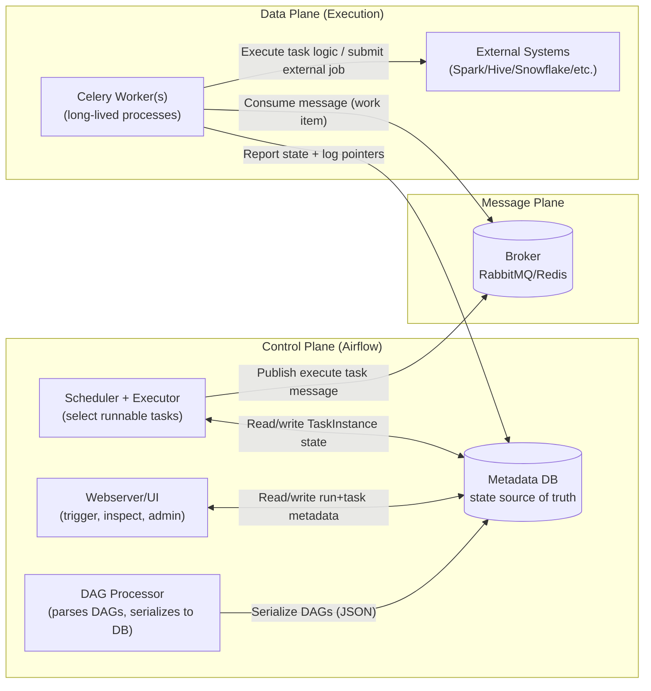

### 3.2.1 State Transition Diagram (Airflow Task Instance Lifecycle)
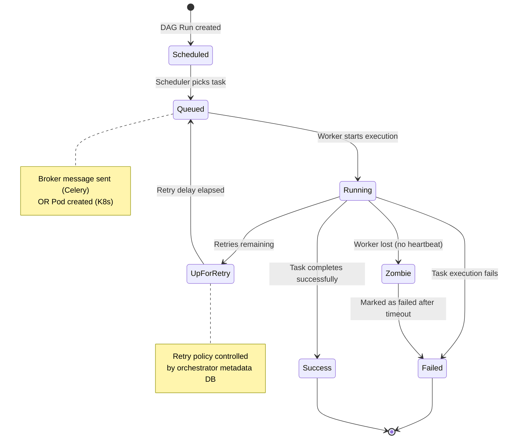

### 3.3 Sequence diagram: happy path (Airflow + Celery)
```mermaid
sequenceDiagram
  participant DP as "DAG Processor"
  participant DB as "Metadata DB"
  participant SCH as "Scheduler"
  participant MQ as "Broker"
  participant WK as "Celery Worker"
  participant EXT as "External Compute"

  DP->>DB: Persist serialized DAGs / scheduling metadata
  SCH->>DB: Find runnable TaskInstances (TI)
  SCH->>DB: Set TI=QUEUED
  SCH->>MQ: Enqueue "execute TI" message
  WK->>MQ: Dequeue message (work item)
  WK->>DB: Set TI=RUNNING (or emit running event)
  WK->>EXT: Submit/monitor external job
  EXT-->>WK: Job result (success)
  WK->>DB: Set TI=SUCCESS + store log refs
  SCH->>DB: Observe TI terminal state; schedule downstream
```

### 3.4 Why the [broker](#glossary) decision shapes behavior
A [broker](#glossary) adds a **durable handoff point** between "decided" and "executing".

- With [acknowledgements](#glossary), [brokers](#glossary) typically give **[at-least-once delivery](#glossary)** ([duplicates](#glossary) are possible). RabbitMQ explicitly notes [acknowledgements](#glossary) imply [at-least-once](#glossary); without acks, you can get at-most-once (loss). ([rabbitmq.com](https://www.rabbitmq.com/docs/reliability?utm_source=openai))
- [Celery](#glossary)'s "late ack" improves "don't lose work if [worker](#glossary) dies," but explicitly allows **duplicate execution** if the [worker](#glossary) crashes mid-task. ([docs.celeryq.dev](https://docs.celeryq.dev/en/v5.2.7/userguide/configuration.html?utm_source=openai))

**Design consequence:** you must treat tasks as **[idempotent](#glossary)** or implement deduplication at the business layer.

---

### 3.5 “What it is NOT” (Celery/broker misconceptions + anti-patterns)

**Misconception 1: “The broker guarantees exactly-once.”**  
- No: acknowledgements give **at-least-once** semantics; duplicates can happen. ([rabbitmq.com](https://www.rabbitmq.com/docs/reliability?utm_source=openai))  
**Bad practice:** writing tasks that create side effects without idempotency keys (e.g., double-inserting partitions, double-triggering exports).

**Misconception 2: “Retry is ‘handled by Celery’ so Airflow retries don’t matter.”**  
- In a well-designed Airflow system, *logical retries* are governed by the **orchestrator state machine** (Airflow task retries), not by broker redelivery quirks.

**Misconception 3: “Celery is just a scheduler.”**  
- Celery is a **distributed task queue system**; it is not your workflow DAG scheduler.

**Anti-pattern: treating the broker as a data bus**  
- Don’t pass large payloads through broker messages. Use references (e.g., object store keys, DB row ids).

**Anti-pattern: inconsistent runtime environments across workers**  
- Airflow’s Celery model expects homogeneous config and dependencies across workers. ([airflow.apache.org](https://airflow.apache.org/docs/apache-airflow/2.8.1/core-concepts/executor/celery.html?utm_source=openai))

---

## 4) [Airflow](#glossary) with [KubernetesExecutor](#glossary) (API-centric, no [broker](#glossary) required)

### 4.1 What this architecture optimizes for
- **Runtime isolation** (one [pod](#glossary) per task).
- Fewer mandatory components than [Celery](#glossary) (no [broker](#glossary), no persistent [worker](#glossary) fleet).
- Operationally attractive for clusters with dormancy ([Airflow](#glossary) docs explicitly call out no external [brokers](#glossary)/persistent [workers](#glossary)). ([airflow.apache.org](https://airflow.apache.org/docs/apache-airflow/2.2.0/executor/kubernetes.html?utm_source=openai))

### 4.2 Component diagram (Airflow + KubernetesExecutor)
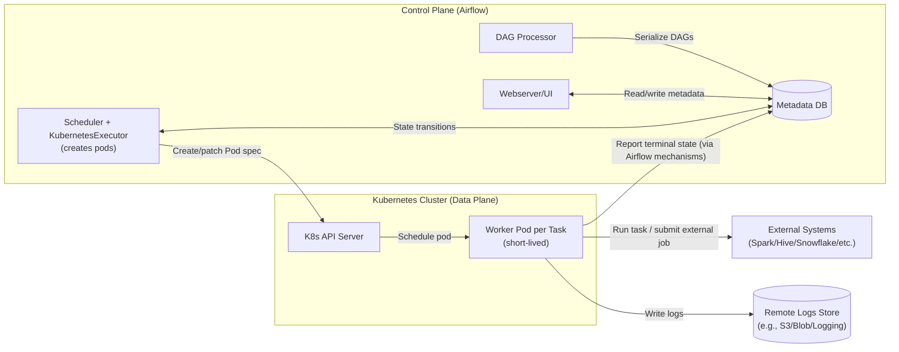

### 4.3 Sequence diagram: happy path (Airflow + K8s)
```mermaid
sequenceDiagram
  participant SCH as "Scheduler"
  participant DB as "Metadata DB"
  participant K8S as "K8s API"
  participant POD as "Worker Pod"
  participant EXT as "External Compute"
  participant LOG as "Remote Logs"

  SCH->>DB: Identify runnable TI; set TI=QUEUED
  SCH->>K8S: Create Pod for TI
  K8S-->>POD: Pod scheduled + starts
  POD->>LOG: Stream/write logs
  POD->>EXT: Submit/monitor external job
  EXT-->>POD: Job result (success)
  POD->>DB: Mark TI=SUCCESS (+ metadata)
  SCH->>DB: Observe terminal; schedule downstream
```

### 4.4 [Scheduler](#glossary) failover & "[adoption](#glossary)" contract (why it gets tricky)
[Airflow](#glossary) [executors](#glossary) implement a concept of **[adopting](#glossary)** running tasks when a [scheduler](#glossary) dies:
- [Executors](#glossary) expose `try_adopt_task_instances(...)` to [adopt](#glossary) abandoned running tasks; tasks not [adopted](#glossary) can be cleared and become eligible for re-scheduling. ([airflow.apache.org](https://airflow.apache.org/docs/apache-airflow/2.5.3/_api/airflow/executors/kubernetes_executor/index.html?utm_source=openai))
- In [KubernetesExecutor](#glossary) internals, [adoption](#glossary) may involve patching [pods](#glossary) so the current watcher can monitor them (label selectors). ([airflow.apache.org](https://airflow.apache.org/docs/apache-airflow/2.5.3/_api/airflow/executors/kubernetes_executor/index.html?utm_source=openai))

This is the core "contract surface" that Pinterest-like custom [Kubernetes](#glossary) execution layers often collide with: if your [pods](#glossary)/jobsets don't map cleanly to the identifiers/labels [Airflow](#glossary) expects, [adoption](#glossary) semantics can degrade into [duplicates](#glossary) or stuck tasks.

### 4.5 “What it is NOT” (K8s executor misconceptions + anti-patterns)
**Misconception 1: “No broker ⇒ no duplicates.”**  
- Duplicates can still happen via scheduler failover, observation gaps, or adoption not working perfectly.

**Misconception 2: “Kubernetes guarantees exactly-once execution.”**  
- K8s schedules pods; it doesn’t enforce your *workflow* semantics. Exactly-once is an application-level guarantee.

**Anti-pattern: using pods as the heavy compute engine**  
- If each task pod runs hours of compute locally, you push cost and reliability problems into the orchestration plane. Prefer “pods submit heavy jobs elsewhere” when you already have stable compute platforms (Spark/Hadoop/etc.).  
  *(This is exactly the Pinterest Spinner pattern—see §8.)*

---

## 5) [Prefect](#glossary) system design ([pull model](#glossary), API-managed [work queues](#glossary))

### 5.1 The core architectural difference from [Airflow](#glossary) (conceptually)
- **[Airflow](#glossary) (typical):** [scheduler](#glossary) decides + *pushes* work into an execution backend.
- **[Prefect](#glossary) (typical):** [control plane](#glossary) creates runs; **[workers](#glossary) poll** and *[pull](#glossary)/claim* work.

[Prefect](#glossary) Cloud's hybrid model emphasizes: "[workers](#glossary) poll our API—no inbound connections," and only [metadata](#glossary)/logs/state are stored in the [control plane](#glossary). ([prefect.io](https://www.prefect.io/prefect/cloud?utm_source=openai))

---

## 6) Prefect Cloud (hybrid) component diagram
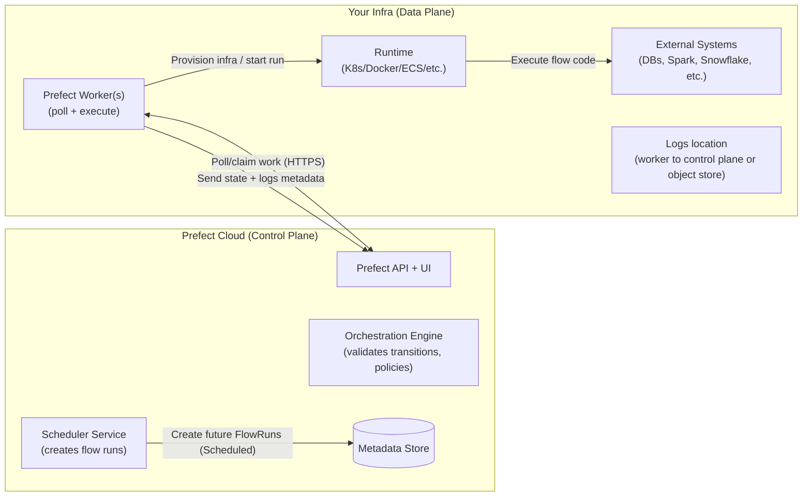

---

## 7) Prefect Server (self-hosted) component diagram
Same contracts as Cloud, but you own the control plane services and DB.

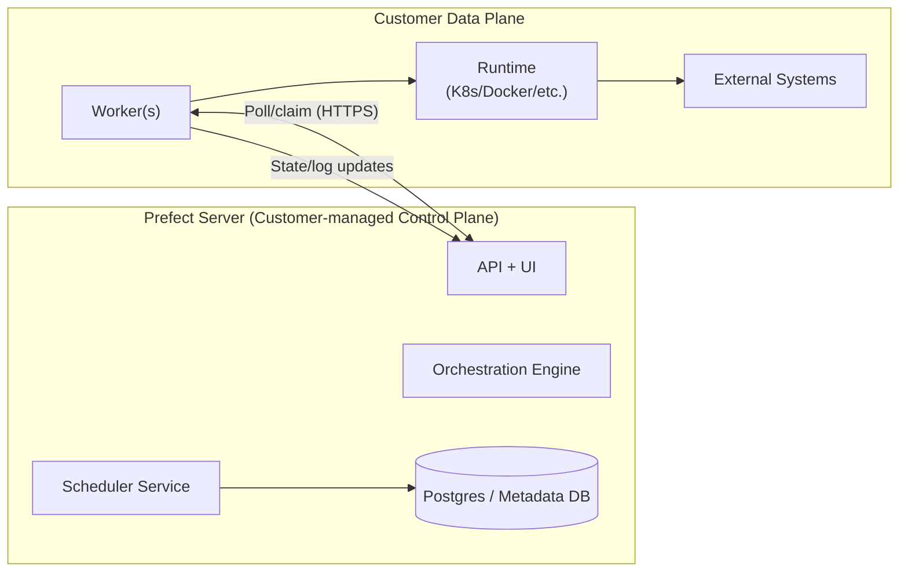

---

## 7.1 Prefect sequencing: scheduling is separate from execution (important contract)
Prefect’s Scheduler service **creates flow runs** and places them in Scheduled states; it “does not affect execution.” ([docs.prefect.io](https://docs.prefect.io/3.0/automate/add-schedules?utm_source=openai))  
Workers are the component that transitions runs into Pending/Running by picking them up. ([docs.prefect.io](https://docs.prefect.io/latest/concepts/states?utm_source=openai))

### Sequence diagram: happy path (Prefect)
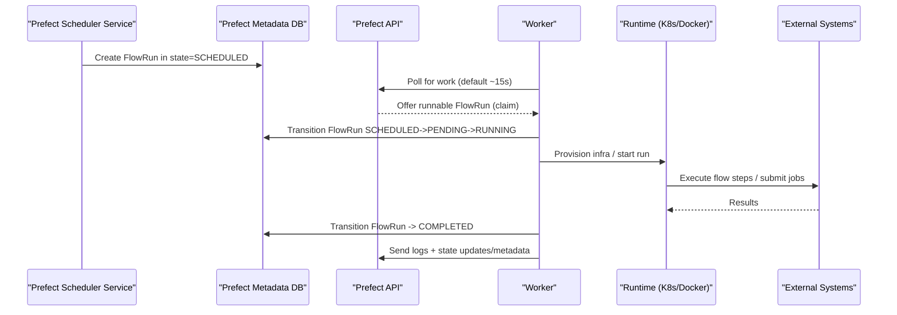

### 7.1.1 Prefect State Transition Diagram
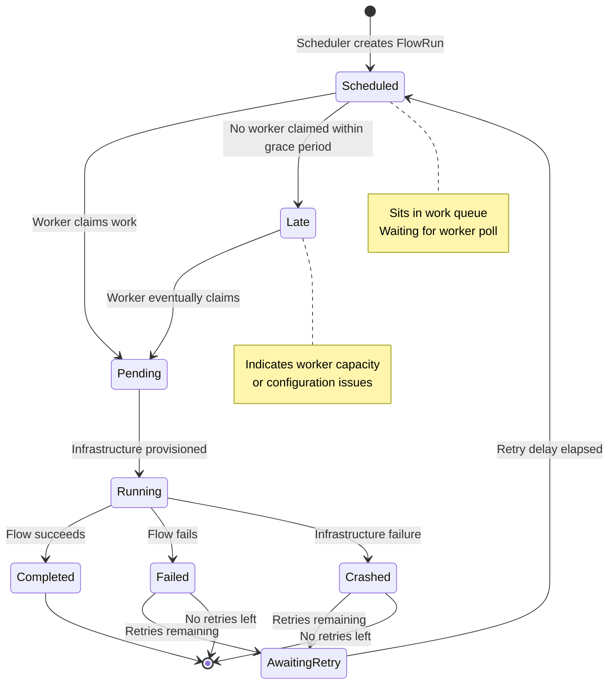

### 7.2 Work queue / polling contracts (what replaces the broker)
Prefect work queues/pools are “queue-like,” but the mechanism is:
- **Workers poll** for work (default every 15s). ([docs.prefect.io](https://docs.prefect.io/v3/deploy/infrastructure-concepts/workers?utm_source=openai))  
- A work queue is considered **READY** when it has been polled in the last 60 seconds. ([docs.prefect.io](https://docs.prefect.io/latest/concepts/work-pools?utm_source=openai))  
- Concurrency limits exist at pool and queue levels. ([docs.prefect.io](https://docs.prefect.io/latest/concepts/work-pools?utm_source=openai))

### 7.3 Retry contract (server-side orchestration rules)
Prefect’s orchestration layer can reject failed transitions and schedule retries when retries remain (rules like `RetryFailedFlows` / `RetryFailedTasks`). ([docs.prefect.io](https://docs.prefect.io/v3/api-ref/python/prefect-server-orchestration-core_policy?utm_source=openai))  
This is conceptually: “retry is a control-plane policy that results in a new Scheduled/AwaitingRetry run,” not “the worker just loops forever.”

---

## 7.4 “What it is NOT” (Prefect misconceptions + anti-patterns)

**Misconception 1: “No broker ⇒ no queue semantics.”**  
- Prefect still has queue semantics (work queues/pools), but implemented via **API-mediated polling/claiming** rather than AMQP/Redis broker messages. ([docs.prefect.io](https://docs.prefect.io/latest/concepts/work-pools?utm_source=openai))

**Misconception 2: “Prefect Scheduler runs my code.”**  
- Scheduler creates run records; execution happens on workers. ([docs.prefect.io](https://docs.prefect.io/3.0/automate/add-schedules?utm_source=openai))

**Anti-pattern: slow polling + tight schedules**
- If polling/worker availability mismatches schedules, runs go “Late” (Prefect explicitly describes Late as usually meaning no healthy workers / wrong pool / concurrency limited). ([docs.prefect.io](https://docs.prefect.io/latest/concepts/states?utm_source=openai))

**Anti-pattern: “retries will fix it” without idempotency**
- Retries imply potential re-execution. You still need idempotency keys / dedupe if side effects exist.

---

## 8) Pinterest-specific grounded callouts (Spinner = Airflow + K8s execution pattern)
*(Everything in this section is “Pinterest way,” based on the environment you described; where it deviates from generic advice, I label it.)*

### 8.1 Pinterest’s core architectural choice: pods orchestrate, external systems compute
You described Spinner tasks as **short-to-medium orchestration steps** that submit heavy work to **Monarch/Hadoop/Spark/Hive/Pinalytics/Snowflake**, rather than doing heavy compute in the pod.

**Why this is rational (industry pattern):**
- Keeps the **orchestrator data plane cheap and elastic** (pods are small/short).
- Moves heavy retry/capacity concerns into platforms built for it (Spark/Hadoop).
- Improves multi-tenancy safety: fewer “runaway” pods consuming cluster.

**Industry pattern mapping:** “Control-plane/data-plane separation” + “Command pattern” (pods issue commands to compute services) + “Bulkhead isolation” (dedicated compute systems per workload class).

### 8.2 Pinterest’s HA direction: multiple schedulers + task adoption complexity
You mentioned partitioned schedulers for HA and “task adoption” complexity with custom K8s/jobset APIs. That maps directly to Airflow’s executor adoption contract (`try_adopt_task_instances`) and K8s adoption behavior (patching pods for watcher label selectors). ([airflow.apache.org](https://airflow.apache.org/docs/apache-airflow/2.5.3/_api/airflow/executors/kubernetes_executor/index.html?utm_source=openai))

**Pinterest-way deviation:** custom jobset/pod identity and adoption logic  
- **Rationale:** improve availability, allow scheduler failover to continue observing in-flight work.
- **Risk:** if adoption identifiers drift from what the scheduler/executor expects, you get duplicates or stuck “running” tasks.

### 8.3 Pinterest observability: S3-backed logs + UI
**Rationale:** object storage is cost-effective and decouples log retention from the control plane DB.  
**Tradeoff:** large bucket listing/versioning can become an operational tax (you called out lifecycle policies).

### 8.4 Pinterest security: multiple isolated environments (Spinner/PII/SOX)
This is a textbook “multi-tenant isolation by environment” pattern (strong boundaries; duplicated control plane) rather than “single cluster with perfect RBAC.”

---

## 9) Tradeoffs summary (design-oriented)

### 9.0 Architecture Pattern Comparison Map
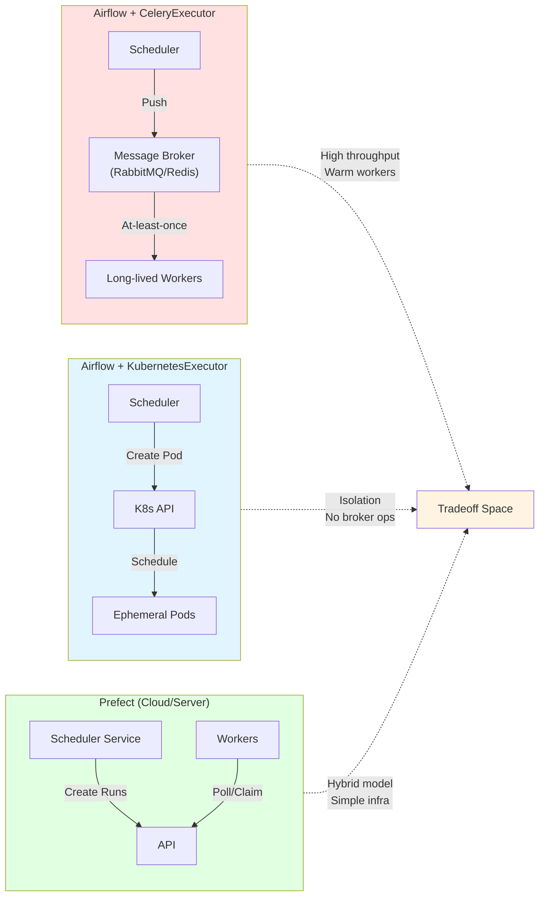

### 9.1 Push (broker) vs Pull (poll/claim)
| Dimension | Airflow + Celery (push via broker) | Airflow + K8s executor (push via K8s API) | Prefect (pull via API polling) |
|---|---|---|---|
| Work handoff | Broker message | K8s pod creation | Worker claims run from API |
| Buffering spikes | Queue depth | K8s pending pods + scheduler backlog | Queue backlog in control plane + worker availability |
| Failure mode | broker/ack semantics, redelivery | scheduler observation/adoption gaps | polling gaps, lease/heartbeat gaps |
| Infra complexity | + broker ops | + k8s ops | fewer primitives, more API semantics |
| Best fit | high-throughput short tasks; warm workers | isolation; container-first; “scale-to-zero-ish” | hybrid execution; “no inbound”; simpler worker story |

### 9.2 [Concurrency](#glossary)/[backpressure](#glossary) patterns
- **[Airflow](#glossary):** [Pools](#glossary) limit parallelism for arbitrary sets of tasks. ([airflow.apache.org](https://airflow.apache.org/docs/apache-airflow/2.2.1/concepts/pools.html?utm_source=openai))
- **[Prefect](#glossary):** [Work pools](#glossary)/[queues](#glossary) have priorities and [concurrency limits](#glossary); READY/NOT_READY is tied to polling. ([docs.prefect.io](https://docs.prefect.io/latest/concepts/work-pools?utm_source=openai))

### 9.2.1 [Concurrency](#glossary) Control Patterns Comparison
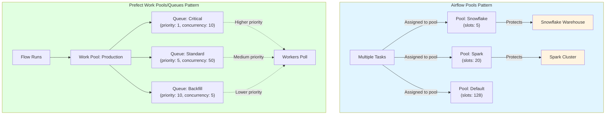

### 9.3 [Sensors](#glossary) and waiting (a major hidden cost)
- [Airflow](#glossary)'s [deferrable operators](#glossary) + [triggerer](#glossary) exist because normal [sensors](#glossary) consume [worker](#glossary) slots; deferral frees [worker](#glossary) capacity and shifts "waiting" to an async [triggerer](#glossary). ([airflow.apache.org](https://airflow.apache.org/docs/apache-airflow/2.2.5/concepts/deferring.html?utm_source=openai))
This is a direct example of **module architecture responding to a resource-waste failure mode**.

---

## 10) Practical "design rules" (industry-general, matches [Spinner](#glossary) goals)

### 10.0 Design Principles Mind Map
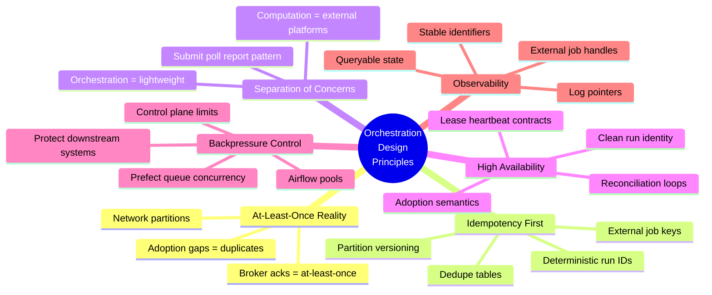
1. **Assume [at-least-once](#glossary) execution everywhere**
   - [Broker](#glossary) acks imply [at-least-once](#glossary). ([rabbitmq.com](https://www.rabbitmq.com/docs/reliability?utm_source=openai))
   - Late-ack designs explicitly allow [duplicates](#glossary). ([docs.celeryq.dev](https://docs.celeryq.dev/en/stable/_modules/celery/app/task.html?utm_source=openai))
   - [Scheduler](#glossary) failover/[adoption](#glossary) gaps can duplicate [pods](#glossary)/tasks. ([airflow.apache.org](https://airflow.apache.org/docs/apache-airflow/2.5.3/_api/airflow/executors/kubernetes_executor/index.html?utm_source=openai))
2. **Make side effects [idempotent](#glossary) by contract**
   - Use deterministic run identifiers in [external job](#glossary) submission (e.g., job name includes workflow run id).
3. **Keep [orchestration](#glossary) tasks small; push heavy compute to platforms built for it**
   - This is the Pinterest pattern and is broadly a best practice at scale.
4. **Treat "[adoption](#glossary)" and "[leases](#glossary)" as first-class**
   - If you want [HA](#glossary) [schedulers](#glossary)/[workers](#glossary), you must invest in clean run identity + [adoption](#glossary)/claim semantics.
5. **[Backpressure](#glossary) belongs in the [control plane](#glossary)**
   - [Airflow](#glossary) [pools](#glossary) or [Prefect](#glossary) queue/[pool](#glossary) [concurrency](#glossary) limits should be your primary mechanism, not "let the cluster suffer."

---

## 11) Where to go next (so this becomes a “study resource”)
If you want, I can extend this paper with:
1) A dedicated section comparing **retry semantics and where retries “live”** (Airflow state machine vs Celery message redelivery vs Prefect orchestration rules).  
2) A “failure mode catalog” (network partition, scheduler crash, worker crash, external job stuck) with **expected state transitions** in each system.  
3) A Pinterest-grounded diagram of **Spinner’s job submission boundary** (Airflow task pod → Monarch/Spark/Hive/Snowflake) and the idempotency contracts you’d ideally enforce.

Tell me which of the three you want first, and whether you prefer the next iteration to be **more diagram-heavy** or **more narrative with checklists**.

## Part II — Retries, failure modes, and a Pinterest/Spinner-grounded boundary model

### 1) “Where retries live” (control loop ownership)
The cleanest system-design question is: **which component is the “retry controller”** (the thing that decides *if/when* to attempt again), vs which component is merely **a transport that can redeliver** work.

#### Airflow (generic, upstream)
**Source of truth:** the **metadata database** stores workflow/task state and is used by Airflow components to coordinate. ([airflow.apache.org](https://airflow.apache.org/docs/apache-airflow/3.0.4/core-concepts/overview.html?utm_source=openai))  
**Scheduler role:** the scheduler handles triggering workflows and **submitting tasks to the executor**; the executor is configured as part of the scheduler process. ([airflow.apache.org](https://airflow.apache.org/docs/apache-airflow/3.0.4/core-concepts/overview.html?utm_source=openai))

So conceptually, in Airflow:
- **Retries are an orchestrator policy**, expressed in metadata + scheduler decisions.
- The executor/worker is *not* supposed to be the system-wide retry brain; it is supposed to execute and report outcomes.

#### Airflow + CeleryExecutor (brokered push)
Airflow’s CeleryExecutor requires a **Celery backend/broker** (RabbitMQ/Redis, etc.). ([airflow.apache.org](https://airflow.apache.org/docs/apache-airflow/2.8.1/core-concepts/executor/celery.html?utm_source=openai))  
That broker introduces a second “retry-like” phenomenon: **broker redelivery** when a message isn’t acknowledged.

Key reliability contract (RabbitMQ):
- With acknowledgements, you get **at-least-once delivery**; without acknowledgements you get at-most-once (possible loss). ([rabbitmq.com](https://www.rabbitmq.com/docs/reliability?utm_source=openai))
- Unacked deliveries are **automatically requeued when the consumer fails/loses connection**, so consumers must handle redelivery/idempotency. ([rabbitmq.com](https://www.rabbitmq.com/docs/confirms?utm_source=openai))

Key Celery contract:
- `acks_late` means “ack after execution,” and Celery explicitly notes this can execute the task twice if the worker crashes mid-execution. ([docs.celeryq.dev](https://docs.celeryq.dev/en/stable/_modules/celery/app/task.html?utm_source=openai))

**Design takeaway:** In Airflow+Celery you effectively have:
- **Orchestrator retry** (policy-driven, counted, delayed/backoff, visible), plus
- **Transport redelivery** (failure-driven, can be immediate, can create duplicates, not “business semantic retry”).

A lot of operational pain comes from accidentally letting *transport redelivery* act like your *retry policy*.

#### Airflow + KubernetesExecutor (API-centric push)
KubernetesExecutor “requests a worker pod from the Kubernetes API,” then the pod runs the task, reports result, and terminates; notably **no external brokers or persistent workers** are required. ([airflow.apache.org](https://airflow.apache.org/docs/apache-airflow/2.2.0/executor/kubernetes.html?utm_source=openai))

The retry controller still conceptually lives in the scheduler/metadata DB (same as above), but the “delivery mechanism” is now:
- **Create pod** (K8s API) instead of “enqueue message” (broker).

This changes the “duplicate execution” story: duplicates are more likely to come from **scheduler failover/adoption gaps** or “did we observe the pod completion” issues than from message redelivery.

---

#### Prefect (Cloud or Server): retries are enforced by orchestration rules
Prefect’s scheduler service **only creates flow runs and places them in `Scheduled`**; it “does not affect execution.” ([docs.prefect.io](https://docs.prefect.io/3.0/automate/add-schedules?utm_source=openai))  
Execution is performed by workers that poll and submit work; workers poll every **15 seconds by default**. ([docs.prefect.io](https://docs.prefect.io/v3/deploy/infrastructure-concepts/workers?utm_source=openai))

Prefect also makes the “retry controller” very explicit at the orchestration-policy layer:
- `RetryFailedFlows` rejects failed transitions and schedules a retry if retries remain. ([docs.prefect.io](https://docs.prefect.io/v3/api-ref/python/prefect-server-orchestration-core_policy?utm_source=openai))  
- `RetryFailedTasks` does the same for tasks. ([docs.prefect.io](https://docs.prefect.io/v3/api-ref/python/prefect-server-orchestration-core_policy?utm_source=openai))

**Design takeaway:** Prefect is architected so that “retry is an orchestrator contract” first, and “delivery” (poll/claim) is a separate mechanism.

---

### 2) Failure mode catalog (expected behaviors + what to design for)
Below are the **most load-bearing failure modes** for data orchestration systems, with the relevant contracts.

### 2.0 Failure Modes Decision Tree
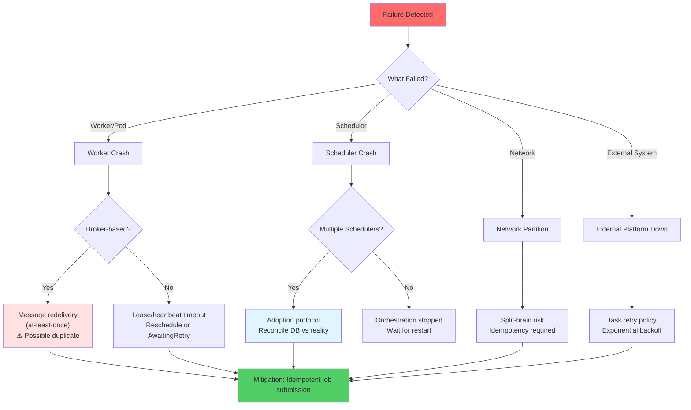

#### 2.1 Worker crashes mid-execution
**Airflow + Celery:**
- If you use acknowledgements, broker reliability gives at-least-once semantics. ([rabbitmq.com](https://www.rabbitmq.com/docs/reliability?utm_source=openai))
- Unacked messages are requeued on consumer failure, causing redelivery. ([rabbitmq.com](https://www.rabbitmq.com/docs/confirms?utm_source=openai))
- With Celery `acks_late`, duplicates are an explicit possibility if the worker dies mid-task. ([docs.celeryq.dev](https://docs.celeryq.dev/en/stable/_modules/celery/app/task.html?utm_source=openai))

**Prefect:**
- A run can end up `Crashed` for infrastructure reasons. ([docs.prefect.io](https://docs.prefect.io/latest/concepts/states?utm_source=openai))
- If retries remain, the system can move to an “await retry” style scheduled state (`AwaitingRetry` is a first-class state). ([docs.prefect.io](https://docs.prefect.io/latest/concepts/states?utm_source=openai))

**What you design for (both):**
- Idempotency keys at the boundary to external systems (job submission IDs, partition versioning, dedupe tables).
- “Side effects must be replay-safe” is the real contract, not “the orchestrator will never duplicate.”

---

#### 2.2 Scheduler dies / control-plane failover
**Airflow + KubernetesExecutor: adoption contract matters**
Airflow’s Kubernetes executor has an explicit adoption API:
- `try_adopt_task_instances` attempts to adopt tasks abandoned by a dead scheduler; anything not adopted may be cleared and become eligible for rescheduling. ([airflow.apache.org](https://airflow.apache.org/docs/apache-airflow/2.5.3/_api/airflow/executors/kubernetes_executor/index.html?utm_source=openai))
- Adoption can involve **patching pods** so the current watcher can monitor them via label selectors. ([airflow.apache.org](https://airflow.apache.org/docs/apache-airflow/2.5.3/_api/airflow/executors/kubernetes_executor/index.html?utm_source=openai))

**Interpretation (system-design level):**
- Airflow is implementing a “**reconciliation loop**” pattern: on recovery, reconcile DB belief (“running”) with cluster reality (“pod exists/doesn’t”), adopt what you can, reschedule the rest.

**What you design for:**
- Stable run identity across failover (labels/annotations that are canonical).
- A clear contract for “who is allowed to write the terminal state” (old scheduler vs new scheduler vs pod callback paths).

---

#### 2.3 “No workers available” / queue not being serviced
**Prefect makes this visible as protocol-level queue health**
- Workers poll every 15 seconds by default. ([docs.prefect.io](https://docs.prefect.io/v3/deploy/infrastructure-concepts/workers?utm_source=openai))
- A work queue is `READY` only if polled in the last **60 seconds**; otherwise it is `NOT_READY`. ([docs.prefect.io](https://docs.prefect.io/latest/concepts/work-pools?utm_source=openai))
- Prefect defines `Late` as: scheduled start time has passed but it has not transitioned to pending within **15 seconds by default**. ([docs.prefect.io](https://docs.prefect.io/latest/concepts/states?utm_source=openai))

**Airflow equivalent (conceptually):**
- This shows up as “queued tasks not draining,” often due to pools/concurrency limits or executor capacity.

---

#### 2.4 Backpressure / dependency protection
**Airflow: Pools are the canonical “don’t overwhelm downstream” mechanism**
Pools limit execution parallelism across arbitrary task sets. ([airflow.apache.org](https://airflow.apache.org/docs/apache-airflow/2.2.1/concepts/pools.html?utm_source=openai))

**Prefect: Work pools/queues provide priority + concurrency**
Work pools/queues support priority ordering and concurrency limits. ([docs.prefect.io](https://docs.prefect.io/latest/concepts/work-pools?utm_source=openai))

**Design pattern:** Queue-based load leveling + explicit concurrency gates (and you should treat them as part of the API contract between orchestration and dependencies).

---

### 3) Sequence diagrams for the two highest-value “debuggable” paths

#### 3.1 Airflow + KubernetesExecutor: scheduler failover and adoption
```mermaid
sequenceDiagram
  participant DB as "Metadata DB (source of truth)"
  participant S1 as "Scheduler A (old)"
  participant S2 as "Scheduler B (new)"
  participant K8S as "Kubernetes API"
  participant POD as "Task Pod"

  S1->>DB: Mark TI=RUNNING; record queued_by_job_id
  S1->>K8S: Create Pod with labels/annotations
  POD-->>K8S: Running...

  note over S1: Scheduler A crashes

  S2->>DB: Find TaskInstances that look RUNNING/owned by dead scheduler
  S2->>K8S: List Pods matching old scheduler's label selector
  S2->>K8S: Patch Pods so new watcher can observe them (adoption)
  S2->>DB: For unadopted TIs, clear / make eligible for reschedule
```
The “patch pods for watcher label selectors” and “try_adopt_task_instances” are explicitly part of the upstream KubernetesExecutor design. ([airflow.apache.org](https://airflow.apache.org/docs/apache-airflow/2.5.3/_api/airflow/executors/kubernetes_executor/index.html?utm_source=openai))

---

#### 3.2 Prefect: scheduled run becomes Late because no worker is servicing the queue
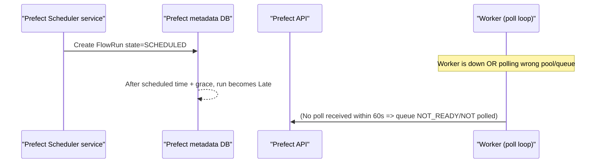
This is grounded in Prefect’s documented polling and queue readiness behavior (15s polling default, 60s READY window, Late definition). ([docs.prefect.io](https://docs.prefect.io/v3/deploy/infrastructure-concepts/workers?utm_source=openai))

---

### 4) Pinterest/Spinner-specific boundary model (clearly labeled)

#### 4.1 Pinterest way (from your environment): “pods orchestrate, platforms compute”
This is a strong, scalable separation: Spinner pods are mostly **submission + sensing + bookkeeping**, while heavy compute happens on Monarch/Hadoop/Spark/Hive/Pinalytics/Snowflake.

Component diagram (Pinterest-grounded, but conceptually general):
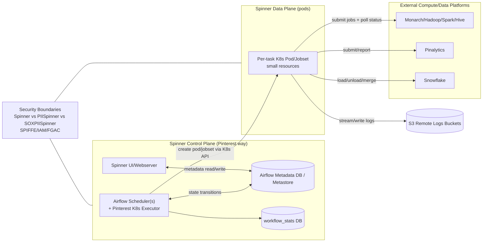

**If you compare this to “industry best practice”:**
- This is generally aligned with best practice at scale (keep orchestration lightweight).
- The “Pinterest-specific” part is the deep integration with internal compute platforms + multi-environment isolation strategy (Spinner/PII/SOX).

#### 4.2 Spinner sequence: "submit Spark job, monitor, then commit task state"
```mermaid
sequenceDiagram
  participant SCH as "Spinner Scheduler"
  participant DB as "Airflow Metadata DB"
  participant K8S as "K8s API"
  participant POD as "Task Pod"
  participant SP as "Spark/Hadoop platform"
  participant LOG as "S3 Logs"

  SCH->>DB: Decide task runnable; mark QUEUED
  SCH->>K8S: Create per-task pod/jobset
  POD->>LOG: Start streaming logs
  POD->>SP: Submit job (with run identifiers)
  POD->>SP: Poll job status / fetch diagnostics
  SP-->>POD: Job succeeded/failed
  POD->>DB: Report terminal state + pointers (job id, logs)
  SCH->>DB: Schedule downstream or retry based on policy
```

**Critical contract to make this safe:** job submission must be replay-safe (idempotent), because retries / adoption gaps / infrastructure restarts can re-run submission steps (Airflow’s world is at-least-once in practice).

---

### 5) “What it is NOT” (targeted misconceptions) — addendum

#### 5.1 “Broker == correctness” (not true)
RabbitMQ acks give **at-least-once**, not exactly-once. ([rabbitmq.com](https://www.rabbitmq.com/docs/reliability?utm_source=openai))  
So: broker + acks improves durability, but pushes **idempotency responsibility** onto consumers.

#### 5.2 “No broker == no duplicates” (not true)
Airflow’s KubernetesExecutor can reschedule tasks that weren’t adopted after scheduler death, and adoption itself depends on reconciling DB state with pod reality. ([airflow.apache.org](https://airflow.apache.org/docs/apache-airflow/2.5.3/_api/airflow/executors/kubernetes_executor/index.html?utm_source=openai))

#### 5.3 “Sensors are cheap” (not necessarily)
In Airflow, classic sensors/operators occupy worker slots even while idle; deferrable operators explicitly exist to fix this by handing waiting to triggers/triggerer. ([airflow.apache.org](https://airflow.apache.org/docs/apache-airflow/stable/authoring-and-scheduling/deferring.html?utm_source=openai))  
**Pinterest-style implication:** if many workflows do “submit + wait,” deferrable patterns can be disproportionately valuable.

---

## Next: tell me what you want “Part III” to emphasize
Choose one (I’ll continue in that direction, with more Mermaid diagrams and a checklist-style “design review rubric”):
1) **Idempotency contracts** for external job submission (Spark/Hive/Snowflake) with concrete patterns (job keys, partition write strategies, dedupe tables).  
2) **Backfill design** (how to prevent scheduler/K8s overload; mapping Airflow pools vs Prefect queue priorities; “critical backfill lane” pattern).  
3) **Multi-tenancy and isolation** (Pinterest environments + RBAC vs industry patterns; noisy neighbor control; tier/SLO enforcement).

## Part III — Contracts at the *real* boundary: idempotency, backfills, multi-tenancy (Airflow/Spinner vs Prefect)

This part is intentionally “system design first”: we treat Spark/Hive/Snowflake (or any external platform) as **separate distributed systems** with their own schedulers, retries, and failure modes. Your orchestrator is coordinating them, not replacing them.

---

# III.A — External compute boundary contract (the "job submission protocol")

### Core idea
In Pinterest/Spinner (and many mature data platforms), the task pod is mostly a **control-plane shim**:
- submit a job
- wait/poll
- collect metadata
- commit "task succeeded/failed" in orchestrator state

That means the *most important* contract isn't "Airflow retries," it's: **"submission is replay-safe."**

### A.0 Idempotency Pattern State Machine
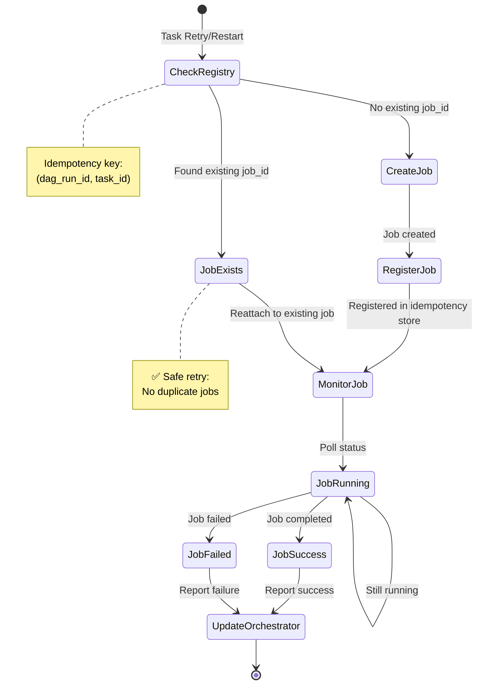

### A.1 Contract: “submit job” must be idempotent
Define an **Idempotency Key** that is stable across retries, scheduler failover, and adoption:
- `idempotency_key = (workflow_id, dag_run_id/logical_date, task_id, try_number?)`
- usually you want it stable across *retries*, so **do not include try_number** unless you explicitly want a *new* external job per retry.

Also define the **Job Handle** you persist:
- `external_job_id`
- optional: `external_job_url`, `cluster`, `submitted_at`, `parameters hash`

### A.2 Reference component diagram (industry-general; matches Spinner pattern)
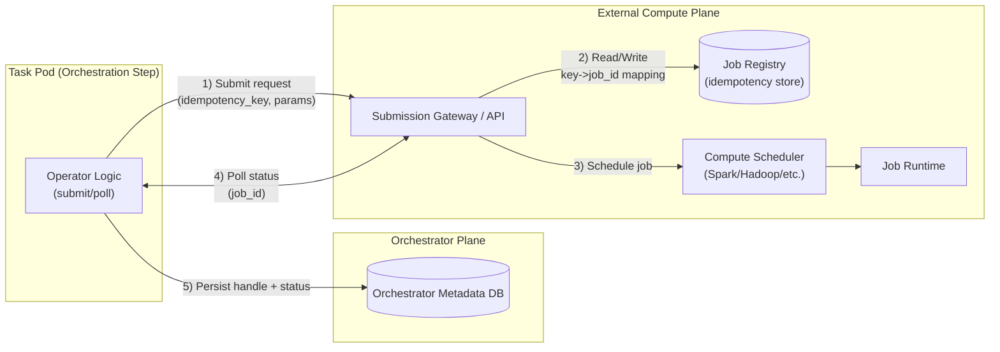

**Arrow explanations (what/how/why):**
- **(1) Submit request:** typically HTTP/RPC; payload is “intent to run” + idempotency key.
- **(2) Registry:** durable store; prevents duplicate job creation when the orchestrator retries.
- **(4) Poll:** avoids holding worker slots with tight loops; use deferrable triggers where possible in Airflow to free worker capacity while waiting. ([airflow.apache.org](https://airflow.apache.org/docs/apache-airflow/stable/authoring-and-scheduling/deferring.html?utm_source=openai))
- **(5) Persist handle:** lets a retried/adopted task “reattach” to the same external job.

### A.3 Sequence: retry-safe submission
```mermaid
sequenceDiagram
  participant POD as "Task Pod"
  participant GW as "Submission Gateway"
  participant REG as "Job Registry"
  participant SCH as "External Scheduler"

  POD->>GW: submit(idempotency_key, params)
  GW->>REG: lookup(idempotency_key)
  alt first submission
    REG-->>GW: not found
    GW->>SCH: create job
    SCH-->>GW: external_job_id
    GW->>REG: put(idempotency_key -> external_job_id)
    GW-->>POD: return external_job_id
  else replay (retry/adoption)
    REG-->>GW: external_job_id exists
    GW-->>POD: return existing external_job_id
  end
```

### A.4 “What it is NOT” (common misconceptions / anti-patterns)
- **Not:** “Retries are safe because Airflow/Prefect counts them.”  
  **Reality:** retries mean **re-execution attempts**; safety is your idempotency boundary.
- **Not:** “Polling is free.”  
  In Airflow, standard sensors/operators occupy worker slots; deferrable operators exist specifically to offload waiting to triggerers and free worker capacity. ([airflow.apache.org](https://airflow.apache.org/docs/apache-airflow/stable/authoring-and-scheduling/deferring.html?utm_source=openai))
- **Anti-pattern:** “Generate a random job name on each retry.”  
  This guarantees duplicate external jobs during transient failures.
- **Anti-pattern:** “Treat ‘submitted’ as ‘succeeded’.”  
  Submission success is not business success; persist job_id and verify completion.

---

# III.B — [Backfill](#glossary) design (load shaping, not just "more runs")

[Backfills](#glossary) are where [orchestrator](#glossary) design gets stress-tested: you're creating *lots of scheduled work* that competes with production [SLO](#glossary) work.

### B.1 Contract: [backfills](#glossary) must be *throttled* via explicit gates
**[Airflow](#glossary) gate (canonical): [Pools](#glossary)**
[Airflow](#glossary) [pools](#glossary) exist to prevent overwhelming downstream systems by limiting parallelism on arbitrary sets of tasks via "[worker](#glossary) slots." ([airflow.apache.org](https://airflow.apache.org/docs/apache-airflow/stable/administration-and-deployment/pools.html?utm_source=openai))

**[Prefect](#glossary) gate (canonical): [Work queues](#glossary) + priority + [concurrency](#glossary)**
[Prefect](#glossary) [work pools](#glossary)/[queues](#glossary) have priorities and [concurrency limits](#glossary); scheduling favors higher priority queues "waterfall style." ([docs.prefect.io](https://docs.prefect.io/latest/concepts/work-pools?utm_source=openai))

### B.2 Pattern: “two lanes” (prod lane + backfill lane)
#### Airflow/Spinner laneing (conceptual)
```mermaid
flowchart TB
  U["User triggers backfill<br/>(range dates)"] --> ORCH["Orchestrator creates many runs"]

  ORCH --> S["Scheduler"]

  subgraph GATES["Concurrency Gates"]
    P1["Prod Pool<br/>(high slots)"]
    P2["Backfill Pool<br/>(low slots)"]
  end

  S -->|"Assign tasks to pools"| GATES
  GATES --> K8S["K8s pods / workers"]
  K8S --> EXT["External platforms<br/>Spark/Hive/Snowflake"]
```

**Mechanism-level clarity:** the scheduler keeps creating runnable tasks, but *pool slots* cap how many can become “actually executing” at once. ([airflow.apache.org](https://airflow.apache.org/docs/apache-airflow/stable/administration-and-deployment/pools.html?utm_source=openai))

#### Prefect laneing (conceptual)
```mermaid
flowchart TB
  SCH["Scheduler creates scheduled runs"] --> Q

  subgraph Q["Work Pool"]
    QC["Queue: critical<br/>priority=1"]
    QB["Queue: backfill<br/>priority=10"]
  end

  W["Workers poll + claim"] --> Q
  W --> RT["Runtime"]
```

Prefect explicitly documents priority ordering across queues and “waterfall” submission. ([docs.prefect.io](https://docs.prefect.io/latest/concepts/work-pools?utm_source=openai))  
Also note: queues are `READY` only if polled recently (health is tied to polling). ([docs.prefect.io](https://docs.prefect.io/v3/api-ref/settings-ref?utm_source=openai))

### B.3 Sequence: safe backfill submission (Airflow pools + deferrables)
```mermaid
sequenceDiagram
  participant UI as "UI/CLI"
  participant SCH as "Scheduler"
  participant POOL as "Pool Gate"
  participant POD as "Task Pod"
  participant EXT as "External Compute"

  UI->>SCH: create backfill runs (many)
  loop scheduling loop
    SCH->>POOL: check slots for backfill pool
    alt slots available
      SCH->>POD: launch task pod
      POD->>EXT: submit job / poll
    else no slots
      SCH-->>SCH: keep tasks queued (do not launch)
    end
  end
```

### B.4 “What it is NOT” (backfill misconceptions / anti-patterns)
- **Not:** “Backfill is just production runs in the past.”  
  It’s a *capacity event*; you must design laneing and caps.
- **Anti-pattern:** “Unlimited backfill parallelism; rely on external platforms to cope.”  
  External schedulers will queue, but you’ll still overload: orchestrator DB, API rate limits, k8s pods, log systems.
- **Anti-pattern (Pinterest-specific risk):** launching too many short orchestration pods can stress k8s control plane/logging even if Spark/Hadoop can queue fine. This is why laneing at the *orchestrator* layer is essential.

---

# III.C — [Multi-tenancy](#glossary) & isolation (Pinterest-grounded, industry-general patterns)

### C.1 Two common [multi-tenancy](#glossary) models
1) **Shared [control plane](#glossary)** (many teams share one [orchestrator](#glossary))
   - Pros: centralized ops, standardized UX, economies of scale
   - Cons: noisy neighbors, [RBAC](#glossary) complexity, blast radius

2) **Isolated environments by domain** (PII/SOX/etc.)
   - Pros: clear blast radius and compliance boundaries
   - Cons: duplicated infra + duplicated ops

Pinterest is using a hybrid: shared [Spinner](#glossary) per tier/cluster, plus isolated PII/SOX environments. (You described [Spinner](#glossary) / PIISpinner / SOXPIISpinner.)

### C.2 Architecture diagram: shared orchestrator + isolated compliance planes
```mermaid
flowchart LR
  subgraph SHARED["Shared Orchestration Plane (non-PII)"]
    S1["Spinner Control Plane<br/>(scheduler/web/DB)"]
    K1["K8s worker clusters"]
  end

  subgraph PII["PII Orchestration Plane"]
    S2["PIISpinner Control Plane<br/>(scheduler/web/DB)"]
    K2["PII K8s worker clusters"]
  end

  subgraph SOX["SOX Orchestration Plane"]
    S3["SOXPIISpinner Control Plane<br/>(scheduler/web/DB)"]
    K3["SOX K8s worker clusters"]
  end

  TEAMS["Many teams<br/>shared repo + RBAC"] --> S1
  TEAMS --> S2
  TEAMS --> S3
```

### C.3 [HA](#glossary) [scheduler](#glossary) note (why "multi-[scheduler](#glossary)" is a design choice)
[Airflow](#glossary) supports running more than one [scheduler](#glossary) for performance/resiliency, and its [HA](#glossary) approach is designed to leverage the [metadata](#glossary) DB (avoiding consensus systems) to reduce operational surface area. ([airflow.apache.org](https://airflow.apache.org/docs/apache-airflow/stable/administration-and-deployment/scheduler.html?utm_source=openai))
This is directly relevant to your "[adoption](#glossary) on failure" concerns: once you run multiple [schedulers](#glossary), *identity + [adoption](#glossary) + [reconciliation](#glossary)* become first-class contracts.

### C.4 "What it is NOT" ([multi-tenancy](#glossary) misconceptions / anti-patterns)
- **Not:** "[RBAC](#glossary) is enough isolation for regulated data."
  Many companies still choose **separate environments** for PII/SOX because isolation is easier to reason about than perfect [RBAC](#glossary) everywhere.
- **Anti-pattern:** "One global [pool](#glossary)/limit for everything."
  You need *per-dependency* and *per-tier* gates (critical pipelines shouldn't compete fairly with opportunistic [backfills](#glossary)).

---

## If you want Part IV, pick one focus
1) A **design review checklist** you can use to evaluate any orchestrator architecture (Airflow/Prefect/other).  
2) A **failure-mode playbook** specifically for Pinterest Spinner2 (Airflow 2.8) migration risks: adoption, triggerers/deferrables, pools, log lifecycle, scheduler HA. ([airflow.apache.org](https://airflow.apache.org/docs/apache-airflow/stable/authoring-and-scheduling/deferring.html?utm_source=openai))

## Part IV — (1) Orchestrator architecture design review checklist + (2) Spinner2 (Airflow 2.8) migration failure-mode playbook

---

# IV.1 Design review checklist (use this to evaluate Airflow, Prefect, or “Spinner-like” systems)

Think of this as an **interface/contract review** across control plane, work distribution, and external dependencies. The goal is to make implicit assumptions explicit.

## A) Boundaries & ownership (control plane vs data plane)
**Checklist**
- **Control plane components identified:** scheduler(s), UI/API, DAG/flow parsing/registry, metadata/state DB. (In Airflow, the metadata DB and scheduler/DAG processor are core to architecture.) 
- **Data plane components identified:** workers/pods/runners + how they get code and secrets.
- **Clear “source of truth” for state:** where does `Queued/Running/Succeeded/Failed` live and who can transition it?
  - Airflow uses its **metadata database** as a central coordination point for state. 
- **Separation of orchestration vs computation:** confirm whether task runtime is mostly “submit/poll” vs “heavy compute in the task process.”

**Red flags**
- “The worker decides retries” (should usually be control plane policy).
- “Success means job submitted” (submission is not completion).

---

## A.1) Design Review Process Flow
```mermaid
flowchart TB
  START["Start Architecture Review"]

  START --> BOUNDARIES["A) Review Boundaries & Ownership"]
  BOUNDARIES --> WORK["B) Review Work Distribution"]
  WORK --> LIVE["C) Review Liveness & Adoption"]
  LIVE --> BACK["D) Review Backpressure"]
  BACK --> OBS["E) Review Observability"]

  BOUNDARIES --> B_CHECK{"Control/Data planes<br/>clearly separated?"}
  B_CHECK -->|"No"| B_FLAG["🚩 Flag: Mixed concerns"]
  B_CHECK -->|"Yes"| WORK

  WORK --> W_CHECK{"At-least-once<br/>acknowledged?"}
  W_CHECK -->|"No"| W_FLAG["🚩 Flag: Unrealistic assumptions"]
  W_CHECK -->|"Yes"| W_CHECK2{"Idempotency<br/>implemented?"}
  W_CHECK2 -->|"No"| W_FLAG2["🚩 Flag: Duplicate risk"]
  W_CHECK2 -->|"Yes"| LIVE

  LIVE --> L_CHECK{"Multiple schedulers<br/>planned?"}
  L_CHECK -->|"Yes"| L_CHECK2{"Adoption tested?"}
  L_CHECK2 -->|"No"| L_FLAG["🚩 Flag: HA not validated"]
  L_CHECK2 -->|"Yes"| BACK
  L_CHECK -->|"No"| BACK

  BACK --> BK_CHECK{"Concurrency gates<br/>at all layers?"}
  BK_CHECK -->|"No"| BK_FLAG["🚩 Flag: Overload risk"]
  BK_CHECK -->|"Yes"| OBS

  OBS --> O_CHECK{"External job handles<br/>persisted?"}
  O_CHECK -->|"No"| O_FLAG["🚩 Flag: Debuggability gap"]
  O_CHECK -->|"Yes"| DONE["✅ Review Complete"]

  style START fill:#e1f5ff
  style DONE fill:#51cf66
  style B_FLAG fill:#ff6b6b
  style W_FLAG fill:#ff6b6b
  style W_FLAG2 fill:#ff6b6b
  style L_FLAG fill:#ff6b6b
  style BK_FLAG fill:#ff6b6b
  style O_FLAG fill:#ff6b6b
```

## B) Work distribution contract (push vs pull, and where duplicates can arise)
**Checklist**
- Identify work handoff mechanism:
  - **Broker message** (Celery/RabbitMQ/Redis) vs
  - **Kubernetes API pod creation** (KubernetesExecutor) vs
  - **Worker poll/claim** (Prefect workers poll the API; default polling is ~15 seconds). 
- Write down your delivery semantics assumption: **at-least-once** is the safe default.
  - RabbitMQ ack-based reliability is **at-least-once** (duplicates possible). 
  - Celery late-ack explicitly allows duplicate execution on worker crash. 
- Define the idempotency contract for every “side-effect task” (external job submission, partition writes, exports).

**Red flags**
- No idempotency keys at external job submission boundary.
- “We never see duplicates” used as a design assumption.

---

## C) Liveness, adoption, and “who owns a running task”
**Checklist**
- Define liveness:
  - heartbeats/leases (prefect-like)
  - scheduler adoption/reconciliation (airflow k8s executor-like)
- If you run multiple schedulers: how do you **adopt** in-flight work?
  - Airflow’s Kubernetes executor exposes `try_adopt_task_instances` and may patch pods to make them observable by the new scheduler/watcher. 
- Define the “stuck running” policy:
  - When do you mark a run as failed/crashed vs keep waiting?

**Red flags**
- Multiple schedulers without a tested adoption story.
- No operational way to reconcile “DB says running” vs “pod/job is gone.”

---

## D) Backpressure & dependency protection
**Checklist**
- Declare concurrency gates at three layers:
  1) **Orchestrator gate** (Airflow Pools / Prefect concurrency)
  2) **Cluster gate** (k8s quotas / namespace limits)
  3) **External platform gate** (Spark/Hadoop queue limits, Snowflake warehouses, etc.)
- Airflow: ensure Pools are used intentionally to limit parallelism. 
- Waiting tasks: if you have many “submit then wait,” use deferrable patterns where available to avoid burning worker slots while idle. 

**Red flags**
- “Backfill just creates runs; the cluster will handle it.”
- Sensors waiting in tight loops consuming worker capacity.

---

## E) Observability & auditability (debuggability is a first-class contract)
**Checklist**
- Every task/run must produce:
  - stable run identifiers
  - external job handle (job_id / query_id / URL)
  - log pointer (S3/object store key, or logging system link)
- Define what must be queryable from the UI/API:
  - current state + reason
  - retries remaining
  - who/what claimed the run
- Ensure “late/not-ready” semantics are interpretable:
  - Prefect: `Late` and queue `READY`/`NOT_READY` are explicitly defined in terms of scheduling and worker polling. 

---

# IV.2 Spinner2 (Airflow 2.8) migration failure-mode playbook (Pinterest-specific, grounded in your environment)

This section assumes your described architecture:
- task pods are lightweight and mostly submit heavy jobs to Spark/Hadoop/Hive/Pinalytics/Snowflake
- multiple schedulers for HA / adoption
- strong environment isolation (Spinner vs PII/SOX)
- S3-backed logs + workflow_stats metrics

I’ll call out where something is a **Pinterest way** vs an industry norm.

---

## 1) Adoption & scheduler HA: the “double-run” and “stuck-running” risks
### What changes / why it matters
Running multiple schedulers raises the importance of the adoption contract: the new scheduler must reconcile and possibly adopt orphaned work. Airflow’s Kubernetes executor has explicit adoption mechanisms (`try_adopt_task_instances`) and may patch pods so watchers can observe them. 

### Failure modes to expect
- **Duplicate external jobs** if:
  - scheduler failover causes task to be rescheduled while the first pod/job is still running
  - adoption fails due to custom jobset identity/labels not matching what the watcher expects
- **Stuck “running” tasks** if:
  - pod/job finished but callback/state update wasn’t observed, and adoption doesn’t reconcile properly

### Mitigations (contract-level)
- **Canonical run identity:** every external submission must include a deterministic idempotency key (dag_run + task_id) so resubmission reattaches.
- **Adoption invariants:** define and test invariants like:
  - “A running TaskInstance must map to exactly one observable k8s object”
  - “Any scheduler can discover and adopt that object via stable labels”
- **Reconciliation job:** periodic auditor that compares DB “running” vs k8s jobset/pod reality and surfaces anomalies.

---

## 2) Waiting (sensors, polling) and the Triggerer/deferrables opportunity
### Why this matters in Spinner-like workloads
Your tasks are often “submit and wait.” Classic waiting consumes execution capacity.

Airflow’s deferrable operators exist to shift waiting off workers and into the triggerer model, freeing worker slots. 

### Failure modes
- Worker/pod churn or resource pressure due to many concurrent waiting tasks.
- Backfills amplify this: thousands of “waiters” becomes a control-plane scaling problem.

### Mitigations
- Prioritize deferrable versions for high-cardinality waits (availability checks, job completion sensors).
- Establish a rule: “Any wait > N minutes must be deferrable unless there’s a hard reason.”

---

## 3) Pools / tiering / SLO enforcement (protect prod from backfills)
Airflow Pools are the standard mechanism to limit parallelism by “pool slots.” 

### Spinner2 migration risk
If pool semantics or defaults change (or if teams are inconsistent), backfills can overwhelm:
- k8s API / pod scheduling
- S3 logging throughput/listing
- external platforms (Spark/Hadoop queues, Snowflake warehouses)

### Mitigations (Pinterest-way rationale)
- Keep/strengthen the “two-lane” model:
  - **Prod lane**: guaranteed slots
  - **Backfill lane**: capped slots + explicit approvals for large ranges
- Encode lane policy in platform defaults (not per-DAG tribal knowledge).

---

## 4) Logging + artifact lifecycle (S3 operational tax)
### Common migration failure mode
Even if compute is fine, the migration can slow down due to:
- log volume growth
- bucket listing costs / UI timeouts
- versioned artifacts and large repos

### Mitigations
- Lifecycle policies (you already noted this need).
- Partition logs by environment/tier/team and enforce retention by criticality.
- Make “log pointer” a first-class metadata object so the UI doesn’t need expensive listings.

---

## 5) “What is NOT” (Spinner2 edition)
- **Not:** “KubernetesExecutor means no duplicates.”  
  Adoption and rescheduling can still cause duplicates; the adoption mechanism explicitly exists because failures happen. 
- **Not:** “Backfills are a user concern.”  
  At Pinterest scale, backfills are a *platform stability concern* (cluster, DB, logs, external schedulers).
- **Not:** “Waiting tasks are cheap.”  
  Airflow added deferrables/triggerer specifically to address the resource waste of waiting in workers. 

---

## 6) A migration “go/no-go” rubric (practical)
You can treat these as required proofs before scaling adoption:

1. **Adoption proof:** kill scheduler A mid-run; scheduler B must adopt and not double-run >X% of tasks.
2. **Idempotency proof:** induce retries on external submission; verify only one external job is created per logical run.
3. **Backfill proof:** run a realistic backfill; ensure prod SLOs unaffected due to pools/tier gates.
4. **Waiting proof:** verify deferrable patterns reduce pod pressure under high concurrency.
5. **Observability proof:** for any failed run, UI shows external job_id + logs pointer + failure reason within seconds/minutes.

---

If you want, I can turn Part IV into a **printable 2–3 page "Architecture Review Template"** (fill-in-the-blanks) plus a **migration test plan** with concrete experiments (scheduler crash, network partition, k8s API throttling, S3 log unavailability) and the expected state transitions.

---

## Glossary

### A

**Acknowledgement (Ack)**: A message sent by a consumer to a broker confirming receipt and successful processing of a message. In systems like RabbitMQ with Celery, acknowledgements provide at-least-once delivery semantics, meaning messages may be redelivered if not acknowledged, potentially leading to duplicate processing.

**Adoption**: The process by which a new or replacement [scheduler](#glossary) takes ownership of in-flight tasks or flow runs that were previously managed by a failed scheduler. In Airflow's KubernetesExecutor, adoption involves reconciling database state with actual Kubernetes pod state and potentially patching pods so the new scheduler's watcher can observe them.

**Airflow**: Apache Airflow is an open-source platform for authoring, scheduling, and monitoring workflows as directed acyclic graphs (DAGs). It provides both control plane components (scheduler, webserver, metadata database) and multiple execution models (CeleryExecutor, KubernetesExecutor, LocalExecutor).

**At-Least-Once Delivery**: A message delivery guarantee where the system ensures that each message is delivered one or more times, but duplicates may occur. This is the standard guarantee provided by most broker systems (RabbitMQ, Kafka) when using acknowledgements, requiring consumers to implement idempotent processing.

**AwaitingRetry**: A Prefect state indicating that a flow run or task has failed but has remaining retry attempts and is waiting for the retry delay to elapse before transitioning back to Scheduled.

### B

**Backfill**: The process of running historical workflow instances for past dates or time periods, typically to populate data that was missing or needs reprocessing. Backfills are capacity events that require careful management through concurrency controls to avoid overwhelming orchestration and compute infrastructure.

**Backpressure**: Mechanisms to prevent overwhelming downstream systems by controlling the rate at which work is submitted or executed. In orchestration systems, backpressure is implemented through pools (Airflow) or work queue concurrency limits (Prefect).

**Broker**: A message-oriented middleware system (such as RabbitMQ or Redis) that facilitates asynchronous communication between producers and consumers. In Airflow's CeleryExecutor, the broker receives task execution messages from the scheduler and delivers them to Celery workers.

### C

**Celery**: A distributed task queue system that processes asynchronous job queues based on message passing. Used in Airflow's CeleryExecutor to distribute task execution across multiple worker processes.

**CeleryExecutor**: An Airflow executor that uses Celery and a message broker (RabbitMQ or Redis) to distribute task execution across long-lived worker processes, implementing a push-based work distribution model.

**Concurrency Limit**: A configured maximum number of simultaneous executions allowed for a pool, queue, or other resource grouping. Used to protect downstream systems from being overwhelmed and to enforce resource allocation policies.

**Control Plane**: The orchestration layer responsible for deciding what work should run next, tracking state, enforcing policies (retries, concurrency, priorities), and exposing UI/API. Separate from the data plane which actually executes work.

**Crashed**: A Prefect state indicating that a flow run failed due to infrastructure issues (such as pod termination, worker failure, or network problems) rather than application logic errors.

### D

**DAG (Directed Acyclic Graph)**: A workflow definition in Airflow consisting of tasks and their dependencies, structured such that there are no circular dependencies. DAGs define the logical structure and scheduling parameters of workflows.

**DAG Processor**: An Airflow component responsible for parsing DAG definition files, serializing them, and storing metadata in the database. In modern Airflow, DAG parsing is explicitly separated from scheduling.

**Data Plane**: The execution layer that actually runs code (pods, containers, VM processes) and interacts with external compute and data systems. Receives work from the control plane and reports execution results.

**Deferrable Operator**: An Airflow operator that can suspend execution and free worker resources while waiting for external conditions (such as job completion or data availability), with the wait handled by the triggerer component. Prevents worker slot exhaustion from long-running waits.

**Duplicates**: Multiple executions of the same logical task or workflow run, typically arising from at-least-once delivery semantics, scheduler failover, adoption failures, or network partitions. Mitigated through idempotency contracts.

### E

**Executor**: The Airflow component responsible for determining how and where task execution occurs. Different executors (LocalExecutor, CeleryExecutor, KubernetesExecutor) implement different work distribution patterns and infrastructure integration strategies.

**External Job**: A compute job (Spark, Hive, Hadoop, Snowflake query) submitted to a platform outside the orchestrator. Orchestration tasks typically submit, monitor, and collect results from external jobs rather than performing heavy computation locally.

### F

**Failed**: A terminal state indicating that a task or flow run has completed unsuccessfully with no remaining retry attempts.

**Flow Run**: In Prefect, an instance of a flow (workflow) execution with a specific set of parameters and scheduled start time. Analogous to a DAG run in Airflow.

### H

**Hadoop**: An open-source framework for distributed storage and processing of large datasets across clusters of computers. Often integrated with orchestration platforms for big data workloads.

**Heartbeat**: A periodic signal sent from a worker or pod to the control plane indicating that it is still alive and processing work. Used to detect worker failures and implement liveness contracts.

**High Availability (HA)**: A system design approach that ensures continuous operation through redundancy and failover mechanisms, such as running multiple schedulers with adoption protocols.

**Hive**: A data warehouse infrastructure built on top of Hadoop that provides SQL-like query capabilities over large distributed datasets. Commonly orchestrated through workflow systems.

### I

**Idempotency**: The property that performing an operation multiple times has the same effect as performing it once. Critical for distributed orchestration systems where at-least-once delivery may cause duplicate executions. Typically implemented through idempotency keys and external job registries.

**Idempotency Key**: A unique, stable identifier (typically composed of workflow run ID, task ID, and sometimes attempt number) used to detect and prevent duplicate job submissions when tasks are retried or reexecuted.

### J

**Job Handle**: A reference to an external job (job_id, query_id, application_id) returned when submitting work to external compute platforms. Persisted in orchestrator metadata to enable reattachment during retries or adoption.

**Job Registry**: A durable storage system that maps idempotency keys to external job handles, preventing duplicate job creation when orchestration tasks are retried.

### K

**Kubernetes (K8s)**: An open-source container orchestration platform. Used in KubernetesExecutor to run each Airflow task in an isolated pod, and often used as the runtime for Prefect workers.

**KubernetesExecutor**: An Airflow executor that creates a separate Kubernetes pod for each task instance, providing runtime isolation and eliminating the need for persistent worker processes or message brokers.

### L

**Late**: A Prefect state indicating that a scheduled flow run has not transitioned to Pending within the expected grace period, typically caused by no workers being available to claim the work, workers polling the wrong pool/queue, or concurrency limits being reached.

**Lease**: A time-bounded claim on a resource or work item, typically used in pull-based systems. If a worker fails to renew its lease (via heartbeat), the control plane can reclaim the work and reassign it.

**Liveness Contract**: The agreement defining how the system detects that a worker or pod has failed mid-execution, typically through heartbeats, leases, or observation of runtime state.

### M

**Metadata Database**: The persistent storage (PostgreSQL, MySQL) used by orchestrators as the source of truth for workflow definitions, run state, task history, and operational metadata.

**Monarch**: Pinterest's internal data processing platform, referenced in the document as an example of external compute infrastructure that Spinner orchestrates.

**Multi-tenancy**: An architectural pattern where multiple teams or users share the same orchestration infrastructure, requiring isolation mechanisms (RBAC, separate environments, resource quotas) to prevent interference.

### O

**Observability**: The ability to understand system behavior through external outputs (logs, metrics, traces). In orchestration, includes stable run identifiers, external job handles, log pointers, and queryable state.

**Operator**: In Airflow, a class that defines a unit of work (task). Operators encapsulate the logic for interacting with external systems, running scripts, or performing transformations.

**Orchestration**: The automated coordination and management of multiple systems, services, or workflows to achieve a desired outcome, typically involving scheduling, dependency management, error handling, and monitoring.

**Orchestrator**: A system that manages workflow execution, enforcing dependencies, handling failures, managing retries, and providing observability. Examples include Airflow and Prefect.

### P

**Pending**: A Prefect state indicating that a flow run has been claimed by a worker and infrastructure is being provisioned, transitioning between Scheduled and Running states.

**Pinalytics**: Pinterest's internal analytics platform, referenced as an example of external compute infrastructure.

**Pod**: A Kubernetes resource representing one or more containers running together on a cluster node. In KubernetesExecutor, each task runs in its own pod.

**Pool**: In Airflow, a mechanism to limit the number of concurrently executing tasks that access a shared resource (like a database connection pool or external API). Tasks are assigned to pools, and execution is gated by available pool slots.

**Prefect**: A modern workflow orchestration platform that uses a pull-based architecture where workers poll for work from a central API, supporting both cloud-hosted and self-hosted deployments.

**Pull Model**: A work distribution pattern where workers actively poll or claim work from a central coordinator, as opposed to having work pushed to them. Used by Prefect.

**Push Model**: A work distribution pattern where a central scheduler actively sends work to workers via a broker (CeleryExecutor) or creates execution resources (KubernetesExecutor).

### Q

**Queued**: A state indicating that a task or flow run has been selected for execution and is waiting for worker capacity or infrastructure provisioning. In Airflow with CeleryExecutor, this typically means a message has been sent to the broker.

### R

**RBAC (Role-Based Access Control)**: A security model that restricts system access based on user roles and permissions, used in multi-tenant orchestration environments to control who can view, edit, or trigger workflows.

**Reconciliation**: The process of comparing expected state (in the metadata database) with actual state (in the runtime environment like Kubernetes) and taking corrective action. Critical for scheduler adoption and handling observation gaps.

**Retry**: The automatic re-execution of a failed task or workflow based on configured retry policies (max attempts, delay, exponential backoff). In well-designed systems, retries are controlled by the orchestrator's control plane, not by transport-layer redelivery.

**Running**: A state indicating that a task or flow run is currently being executed by a worker or pod.

### S

**Scheduled**: A state indicating that a workflow run has been created and is waiting for its scheduled execution time or for dependencies to be satisfied.

**Scheduler**: The core component of an orchestrator that determines which tasks or workflows should run next based on schedules, dependencies, and resource availability. In Airflow, the scheduler also manages executors; in Prefect, it only creates scheduled flow runs.

**Sensor**: An Airflow operator that waits for a condition to be true (file arrival, external job completion, time delay) before allowing downstream tasks to run. Traditional sensors occupy worker slots while waiting; deferrable sensors use the triggerer to free worker capacity.

**SLO (Service Level Objective)**: A target level of service quality (such as completion time, success rate, or latency) used to prioritize and protect critical workflows from interference by less critical work like backfills.

**Spark**: Apache Spark is a distributed computing framework for big data processing. Commonly used as external compute integrated with orchestration systems.

**Spinner**: Pinterest's internal workflow orchestration platform built on Airflow, referenced throughout as a real-world case study. Variants include PIISpinner and SOXPIISpinner for compliance-isolated environments.

**State Contract**: The agreement defining where authoritative state (Queued, Running, Succeeded, Failed) is stored and which components are allowed to transition state. Typically the metadata database is the source of truth.

**Success/Succeeded**: A terminal state indicating that a task or flow run has completed successfully.

### T

**Task Instance (TI)**: In Airflow, a specific execution of a task for a particular DAG run. Each task instance has its own state, start time, end time, and logs.

**Triggerer**: An Airflow component introduced to handle deferrable operators, allowing sensors and long-running waits to suspend and free worker resources while the triggerer asynchronously monitors for completion conditions.

### U

**UpForRetry**: An Airflow state indicating that a task instance has failed but has remaining retry attempts configured and will be rescheduled after a retry delay.

### W

**Webserver**: The Airflow component that provides the web UI for viewing workflows, monitoring execution, triggering runs, and managing configuration. Reads from and writes to the metadata database.

**Work Distribution Contract**: The agreement defining how work is handed from the control plane to the data plane—push via broker, push via API (pod creation), or pull via polling.

**Work Pool**: In Prefect, a grouping of infrastructure configuration and work queues that workers poll from. Work pools can contain multiple queues with different priorities and concurrency limits.

**Work Queue**: In Prefect, a logical queue within a work pool that holds scheduled flow runs waiting to be claimed by workers. Queues have priority ordering and concurrency limits.

**Worker**: A long-running process that executes tasks or flows. In Airflow with CeleryExecutor, workers consume messages from the broker. In Prefect, workers poll the API to claim work. In KubernetesExecutor, "workers" are ephemeral pods.

### Z

**Zombie**: An Airflow state indicating that a task instance appears to be running in the database but its worker or pod is no longer sending heartbeats, suggesting the execution has failed without properly updating state.

