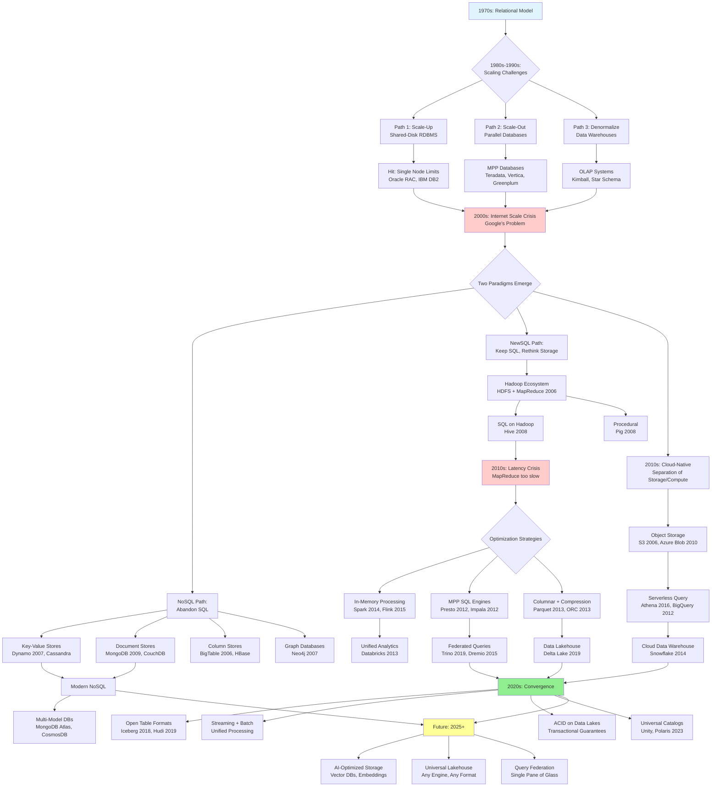
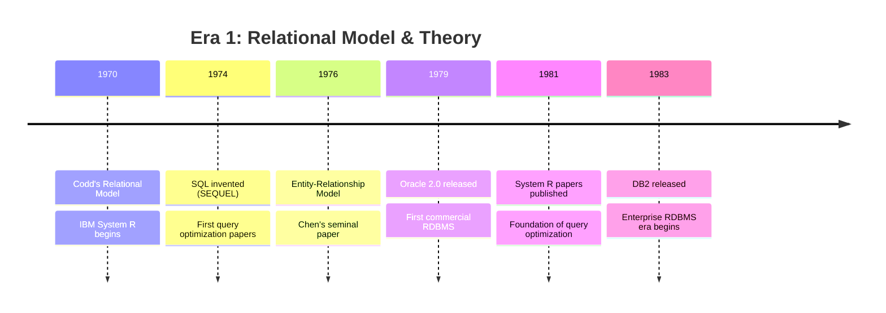
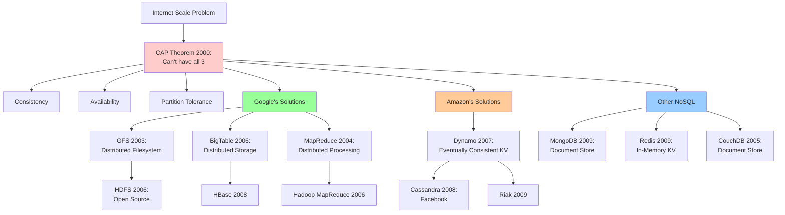
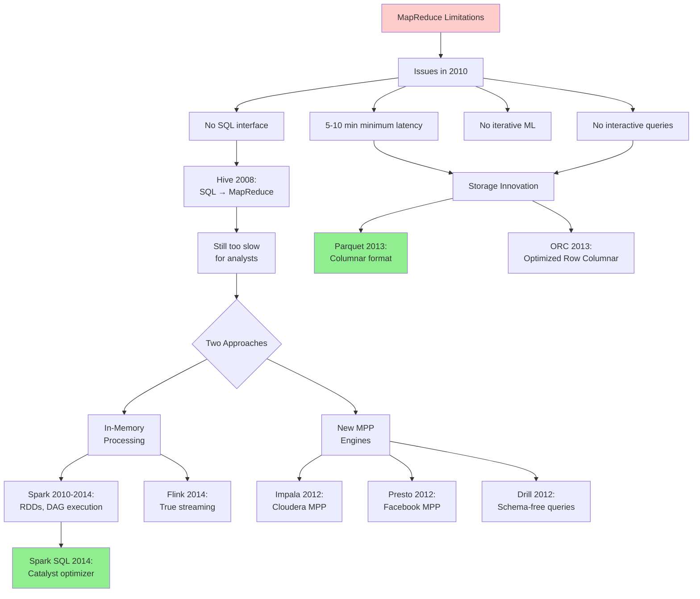
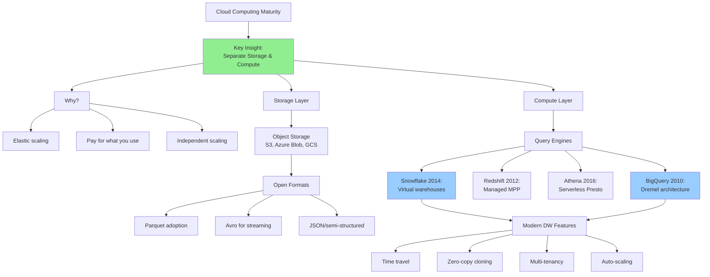
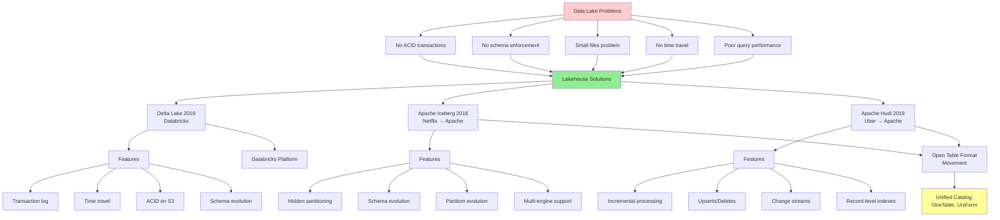
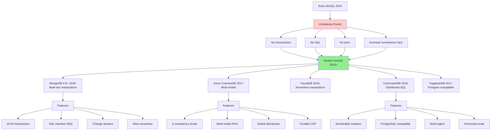
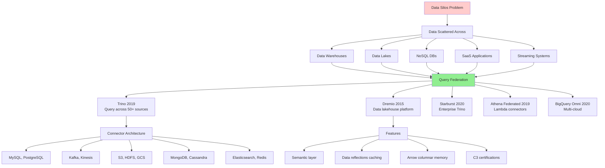
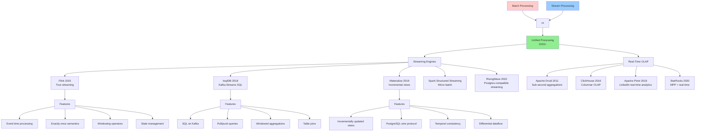
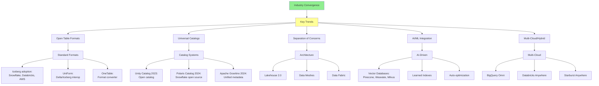

# Distributed Query Systems: Complete Evolution Mind Map & Research Compendium

## Mind Map: From RDBMS to Modern Distributed Systems

## Detailed Evolution Timeline with Research Links

### Era 1: Foundations (1970-1985)

**Key Papers:**

1. **A Relational Model of Data for Large Shared Data Banks**
   - Author: E.F. Codd (1970)
   - Link: https://www.seas.upenn.edu/~zives/03f/cis550/codd.pdf
   - **Impact**: Founded relational database theory
   - **Key Concepts**: Normal forms, relational algebra

2. **SEQUEL: A Structured English Query Language**
   - Authors: Chamberlin & Boyce (IBM, 1974)
   - Link: https://researcher.watson.ibm.com/researcher/files/us-dchamber/sequel-1974.pdf
   - **Impact**: Created SQL language
   - **Legacy**: Still dominant 50 years later

3. **System R: Relational Approach to Database Management**
   - Authors: Astrahan et al. (IBM, 1976)
   - Link: https://dl.acm.org/doi/10.1145/320455.320457
   - **Impact**: First implementation of SQL
   - **Innovation**: Query optimizer, cost-based optimization

4. **Access Path Selection in a Relational Database Management System**
   - Authors: Selinger et al. (IBM, 1979)
   - Link: https://www2.cs.duke.edu/courses/compsci516/cps216/spring03/papers/selinger-etal-1979.pdf
   - **Impact**: Foundation of query optimization
   - **Algorithm**: Dynamic programming for join ordering

5. **The Entity-Relationship Model: Toward a Unified View of Data**
   - Author: Peter Chen (1976)
   - Link: https://dl.acm.org/doi/10.1145/320434.320440
   - **Impact**: Visual database design methodology

---

### Era 2: Parallel & Distributed Databases (1985-2000)

**Key Papers:**

6. **The Gamma Database Machine Project**
   - Authors: DeWitt et al. (Wisconsin, 1990)
   - Link: https://ieeexplore.ieee.org/document/48854
   - **Impact**: Proved shared-nothing parallelism works
   - **Techniques**: Hash partitioning, parallel joins

7. **Parallel Database Systems: The Future of High Performance Database Systems**
   - Authors: DeWitt & Gray (1992)
   - Link: https://dl.acm.org/doi/10.1145/129888.129894
   - **Impact**: Classified parallel DB architectures
   - **Categories**: Shared-memory, shared-disk, shared-nothing

8. **The Volcano Optimizer Generator: Extensibility and Efficient Search**
   - Author: Graefe (1993)
   - Link: https://paperhub.s3.amazonaws.com/dace52a42c07f7f8348b08dc2b186061.pdf
   - **Impact**: Modern optimizer architecture
   - **Used in**: SQL Server, many modern systems

9. **Mariposa: A Wide-Area Distributed Database System**
   - Authors: Stonebraker et al. (Berkeley, 1996)
   - Link: https://dl.acm.org/doi/10.1007/BF00117276
   - **Impact**: First federated query system
   - **Concept**: Distributed query optimization

10. **C-Store: A Column-oriented DBMS**
    - Authors: Stonebraker et al. (MIT, 2005)
    - Link: http://vldb.org/conf/2005/P553.pdf
    - **Impact**: Founded modern columnar storage
    - **Commercial**: Became Vertica

---

### Era 3: Internet Scale & NoSQL (2000-2010)

**Foundational Papers:**

11. **The Google File System (GFS)**
    - Authors: Ghemawat, Gobioff, Leung (Google, 2003)
    - Link: https://research.google/pubs/pub51/
    - **Impact**: Enabled distributed storage at scale
    - **Innovation**: Designed for failures, large files

12. **MapReduce: Simplified Data Processing on Large Clusters**
    - Authors: Dean & Ghemawat (Google, 2004)
    - Link: https://research.google/pubs/pub62/
    - **Impact**: Made distributed processing accessible
    - **Limitation**: High latency, no iterative processing

13. **Bigtable: A Distributed Storage System for Structured Data**
    - Authors: Chang et al. (Google, 2006)
    - Link: https://research.google/pubs/pub27898/
    - **Impact**: Wide-column distributed database
    - **Used in**: Gmail, Google Maps, YouTube

14. **Dynamo: Amazon's Highly Available Key-value Store**
    - Authors: DeCandia et al. (Amazon, 2007)
    - Link: https://www.allthingsdistributed.com/files/amazon-dynamo-sosp2007.pdf
    - **Impact**: Founded eventual consistency model
    - **Techniques**: Consistent hashing, vector clocks, gossip protocol

15. **CAP Theorem: Towards Robust Distributed Systems**
    - Author: Eric Brewer (Berkeley, 2000)
    - Link: https://people.eecs.berkeley.edu/~brewer/cs262b-2004/PODC-keynote.pdf
    - **Formalized**: Gilbert & Lynch (2002) - https://dl.acm.org/doi/10.1145/564585.564601
    - **Impact**: Changed how we think about distributed systems

16. **PNUTS: Yahoo!'s Hosted Data Serving Platform**
    - Authors: Cooper et al. (Yahoo, 2008)
    - Link: https://dl.acm.org/doi/10.14778/1454159.1454167
    - **Impact**: Timeline consistency model
    - **Innovation**: Global replication with consistency guarantees

17. **Cassandra: A Decentralized Structured Storage System**
    - Authors: Lakshman & Malik (Facebook, 2010)
    - Link: https://dl.acm.org/doi/10.1145/1773912.1773922
    - **Impact**: Combined Dynamo + BigTable
    - **Used by**: Apple, Netflix, Instagram

---

### Era 4: SQL-on-Hadoop & MPP Renaissance (2010-2015)

**Key Papers:**

18. **Resilient Distributed Datasets: A Fault-Tolerant Abstraction for In-Memory Cluster Computing**
    - Authors: Zaharia et al. (Berkeley, 2012)
    - Link: https://www.usenix.org/system/files/conference/nsdi12/nsdi12-final138.pdf
    - **Impact**: 10-100x speedup over MapReduce
    - **Innovation**: Lineage-based fault tolerance

19. **Spark SQL: Relational Data Processing in Spark**
    - Authors: Armbrust et al. (Berkeley, 2015)
    - Link: https://people.csail.mit.edu/matei/papers/2015/sigmod_spark_sql.pdf
    - **Impact**: Unified batch/streaming SQL
    - **Innovation**: Catalyst optimizer, Tungsten execution

20. **Apache Flink: Stream and Batch Processing in a Single Engine**
    - Authors: Carbone et al. (2015)
    - Link: https://asterios.katsifodimos.com/assets/publications/flink-deb.pdf
    - **Impact**: True streaming-first architecture
    - **Innovation**: Event time processing, exactly-once semantics

21. **Presto: SQL on Everything**
    - Authors: Sethi et al. (Facebook, 2019)
    - Link: https://trino.io/Presto_SQL_on_Everything.pdf
    - **Impact**: Federated query across sources
    - **Innovation**: Connector architecture, pipelined execution

22. **Impala: A Modern, Open-Source SQL Engine for Hadoop**
    - Authors: Kornacker et al. (Cloudera, 2015)
    - Link: http://cidrdb.org/cidr2015/Papers/CIDR15_Paper28.pdf
    - **Impact**: Demonstrated MPP on Hadoop
    - **Performance**: 5-90x faster than Hive

23. **Major Technical Advancements in Apache Hive**
    - Authors: Huai et al. (2014)
    - Link: https://dl.acm.org/doi/10.1145/2588555.2595630
    - **Impact**: Evolution from MapReduce to Tez
    - **Improvements**: Vectorization, cost-based optimization

24. **The Dataflow Model: A Practical Approach to Balancing Correctness, Latency, and Cost**
    - Authors: Akidau et al. (Google, 2015)
    - Link: https://research.google/pubs/pub43864/
    - **Impact**: Unified batch/streaming model
    - **Commercial**: Became Google Cloud Dataflow

---

### Era 5: Cloud-Native Data Warehouses (2012-2020)

**Key Papers:**

25. **The Snowflake Elastic Data Warehouse**
    - Authors: Dageville et al. (Snowflake, 2016)
    - Link: https://dl.acm.org/doi/10.1145/2882903.2903741
    - **Impact**: Defined modern cloud DW architecture
    - **Innovation**: Multi-cluster shared data, time travel

26. **Dremel: Interactive Analysis of Web-Scale Datasets**
    - Authors: Melnik et al. (Google, 2010)
    - Link: https://research.google/pubs/pub36632/
    - **Impact**: Columnar storage for nested data
    - **Commercial**: Became BigQuery
    - **Innovation**: Record shredding, columnar format

27. **F1: A Distributed SQL Database That Scales**
    - Authors: Shute et al. (Google, 2013)
    - Link: https://research.google/pubs/pub41344/
    - **Impact**: Global-scale relational DB
    - **Innovation**: External consistency, Spanner integration

28. **Amazon Redshift and the Case for Simpler Data Warehouses**
    - Authors: Gupta et al. (Amazon, 2015)
    - Link: https://dl.acm.org/doi/10.1145/2723372.2742795
    - **Impact**: Made MPP accessible via managed service
    - **Based on**: PostgreSQL + ParAccel technology

29. **AnalyticDB: Real-time OLAP Database System at Alibaba Cloud**
    - Authors: Zhan et al. (Alibaba, 2019)
    - Link: https://dl.acm.org/doi/10.14778/3352063.3352141
    - **Impact**: Hybrid row-column storage
    - **Scale**: Processes 100PB+ daily

---

### Era 6: Data Lakes & Lakehouse Architecture (2015-2020)

**Key Papers:**

30. **Delta Lake: High-Performance ACID Table Storage over Cloud Object Stores**
    - Authors: Armbrust et al. (Databricks, 2020)
    - Link: https://databricks.com/wp-content/uploads/2020/08/p975-armbrust.pdf
    - **Impact**: ACID guarantees on data lakes
    - **Innovation**: Transaction log in Parquet

31. **Apache Iceberg: The Definitive Guide**
    - Authors: Netflix Engineering (2018)
    - Link: https://iceberg.apache.org/docs/latest/
    - Blog: https://netflixtechblog.com/iceberg-tables-powering-data-infrastructure-at-netflix-7c57f0f9c9a9
    - **Impact**: Open table format with broad adoption
    - **Innovation**: Hidden partitioning, metadata management

32. **Apache Hudi: The Streaming Data Lake Platform**
    - Authors: Uber Engineering (2019)
    - Link: https://hudi.apache.org/docs/overview
    - Paper: https://arxiv.org/abs/2104.12226
    - **Impact**: Incremental processing on data lakes
    - **Innovation**: Copy-on-write, merge-on-read

33. **Lakehouse: A New Generation of Open Platforms that Unify Data Warehousing and Advanced Analytics**
    - Authors: Armbrust et al. (Berkeley/Databricks, 2021)
    - Link: http://cidrdb.org/cidr2021/papers/cidr2021_paper17.pdf
    - **Impact**: Defined lakehouse architecture
    - **Thesis**: Can have warehouse performance on lake storage

34. **Nessie: Transactional Catalog for Data Lakes**
    - Authors: Project Nessie (Dremio, 2020)
    - Link: https://projectnessie.org/
    - Paper: https://www.dremio.com/resources/guides/apache-iceberg-an-architectural-look-under-the-covers/
    - **Impact**: Git-like versioning for data lakes
    - **Innovation**: Multi-table transactions

---

### Era 7: Modern NoSQL Evolution (2015-2025)

**Key Papers:**

35. **Spanner: Google's Globally-Distributed Database**
    - Authors: Corbett et al. (Google, 2012)
    - Link: https://research.google/pubs/pub39966/
    - **Impact**: Showed distributed ACID is possible
    - **Innovation**: TrueTime API, external consistency

36. **Calvin: Fast Distributed Transactions for Partitioned Database Systems**
    - Authors: Thomson et al. (Yale, 2012)
    - Link: http://cs.yale.edu/homes/thomson/publications/calvin-sigmod12.pdf
    - **Impact**: Deterministic concurrency control
    - **Used in**: FaunaDB architecture

37. **CockroachDB: The Resilient Geo-Distributed SQL Database**
    - Authors: Taft et al. (Cockroach Labs, 2020)
    - Link: https://dl.acm.org/doi/10.1145/3318464.3386134
    - **Impact**: Open-source distributed SQL
    - **Based on**: Spanner design, PostgreSQL compatibility

38. **MongoDB: The Definitive Guide to NoSQL Database**
    - Official Docs: https://www.mongodb.com/docs/manual/core/transactions/
    - Architecture: https://www.mongodb.com/docs/manual/core/distributed-queries/
    - **Evolution**: Document store → Distributed database
    - **Key Addition**: Multi-document ACID (2018)

39. **Amazon DynamoDB: A Scalable, Predictably Performant NoSQL Database**
    - Authors: Elhemali et al. (Amazon, 2022)
    - Link: https://www.usenix.org/conference/atc22/presentation/elhemali
    - **Impact**: Evolution of original Dynamo
    - **Innovation**: Adaptive capacity, global tables

40. **Azure Cosmos DB: Technical Overview**
    - Microsoft Docs: https://learn.microsoft.com/en-us/azure/cosmos-db/
    - Research: https://arxiv.org/abs/2105.02619
    - **Impact**: Multi-model, globally distributed
    - **Innovation**: Tunable consistency with SLAs

---

### Era 8: Query Federation & Virtualization (2015-2025)

**Key Papers & Resources:**

41. **Trino: The Definitive Guide (O'Reilly)**
    - Authors: Reis et al. (2021)
    - Link: https://trino.io/trino-the-definitive-guide.html
    - Free: https://www.starburst.io/info/oreilly-trino-guide/
    - **Coverage**: Architecture, connectors, optimization

42. **Presto: SQL on Everything (Original Paper)**
    - Authors: Sethi et al. (Facebook/Meta, 2019)
    - Link: https://trino.io/Presto_SQL_on_Everything.pdf
    - **Impact**: Federated query pattern
    - **Performance**: Interactive queries on petabytes

43. **Apache Drill: Interactive Analysis of Large-Scale Datasets**
    - Docs: https://drill.apache.org/docs/
    - Paper: https://dl.acm.org/doi/10.14778/2824032.2824100
    - **Innovation**: Schema-free SQL, late binding

44. **Dremio Architecture**
    - Whitepaper: https://www.dremio.com/platform/
    - Apache Arrow: https://arrow.apache.org/
    - **Innovation**: Reflections (automated aggregations)
    - **Based on**: Apache Arrow columnar format

45. **The Case for Learned Index Structures**
    - Authors: Kraska et al. (MIT, 2018)
    - Link: https://arxiv.org/abs/1712.01208
    - **Impact**: ML for query optimization
    - **Future**: AI-driven query engines

---

### Era 9: Streaming & Real-Time Analytics (2015-2025)

**Key Papers:**

46. **The Dataflow Model (Extended)**
    - Authors: Akidau et al. (Google, 2015)
    - Link: https://research.google/pubs/pub43864/
    - Book: "Streaming Systems" (O'Reilly 2018)
    - **Impact**: Where/When/How framework for streaming

47. **Flink: Stream Processing for the Masses**
    - Apache Flink Docs: https://flink.apache.org/
    - Paper: https://arxiv.org/abs/1506.05088
    - **Impact**: Event-driven streaming architecture
    - **Innovation**: Savepoints, async snapshots

48. **Naiad: A Timely Dataflow System**
    - Authors: Murray et al. (Microsoft Research, 2013)
    - Link: https://dl.acm.org/doi/10.1145/2517349.2522738
    - **Impact**: Foundation of differential dataflow
    - **Used in**: Materialize architecture

49. **Differential Dataflow**
    - Author: Frank McSherry (2013)
    - Link: https://github.com/TimelyDataflow/differential-dataflow
    - Blog: https://github.com/frankmcsherry/blog
    - **Impact**: Incremental computation framework

50. **Apache Druid: Real-time Analytics Database**
    - Authors: Yang et al. (2014)
    - Link: https://druid.apache.org/docs/latest/design/
    - Paper: http://static.druid.io/docs/druid.pdf
    - **Impact**: Fast aggregations on streaming data

51. **ClickHouse: Lightning Fast Analytics**
    - Docs: https://clickhouse.com/docs
    - Benchmarks: https://benchmark.clickhouse.com/
    - **Impact**: Columnar DBMS for analytics
    - **Performance**: Billions of rows/second

52. **Apache Pinot: Realtime Distributed OLAP**
    - Docs: https://docs.pinot.apache.org/
    - LinkedIn: https://engineering.linkedin.com/blog/2019/11/apache-pinot--a-realtime-distributed-olap-datastore
    - **Impact**: User-facing analytics at scale

---

### Era 10: Convergence & Future (2020-2025)

**Latest Papers & Resources:**

53. **Unity Catalog: Unified Governance for Data and AI**
    - Databricks (2023)
    - Link: https://www.databricks.com/product/unity-catalog
    - Open Source: https://github.com/unitycatalog/unitycatalog
    - **Impact**: Open catalog standard

54. **Polaris: The Interoperable, Open Source Catalog for Apache Iceberg**
    - Snowflake (2024)
    - Link: https://www.snowflake.com/blog/introducing-polaris-catalog/
    - GitHub: https://github.com/polaris-catalog/polaris
    - **Impact**: Vendor-neutral Iceberg catalog

55. **Apache XTable (Formerly OneTable): Omni-directional Interoperability**
    - Apache Incubator (2023)
    - Link: https://xtable.apache.org/
    - Blog: https://onetable.dev/blog/
    - **Impact**: Cross-format compatibility

56. **Vector Databases: A New Paradigm**
    - Pinecone Research (2023)
    - Link: https://www.pinecone.io/learn/vector-database/
    - Benchmark: https://github.com/erikbern/ann-benchmarks
    - **Use Case**: Embeddings, semantic search

57. **Data Mesh Principles**
    - Author: Zhamak Dehghani (Thoughtworks, 2019)
    - Link: https://martinfowler.com/articles/data-mesh-principles.html
    - Book: "Data Mesh" (O'Reilly 2022)
    - **Impact**: Decentralized data architecture

58. **The Data Lakehouse: Data Warehousing and More**
    - Authors: Armbrust et al. (2021)
    - Link: http://cidrdb.org/cidr2021/papers/cidr2021_paper17.pdf
    - Update 2024: https://www.databricks.com/blog/future-data-lakehouse
    - **Future**: Open, multi-format, AI-optimized

---

## Official Documentation & Resources

### Distributed Systems Fundamentals

59. **Designing Data-Intensive Applications (Book)**
    - Author: Martin Kleppmann (O'Reilly 2017)
    - Link: https://dataintensive.net/
    - **Coverage**: Distributed systems, replication, partitioning

60. **Database Internals (Book)**
    - Author: Alex Petrov (O'Reilly 2019)
    - Link: https://www.databass.dev/
    - **Coverage**: Storage engines, distributed consensus

### Technology-Specific Documentation

**MongoDB:**
61. MongoDB Architecture Guide
    - https://www.mongodb.com/docs/manual/core/distributed-queries/
    - Sharding: https://www.mongodb.com/docs/manual/sharding/

**Databricks:**
62. Databricks Documentation
    - Delta Lake: https://docs.databricks.com/delta/
    - Lakehouse Architecture: https://www.databricks.com/product/data-lakehouse

**Snowflake:**
63. Snowflake Architecture
    - Whitepaper: https://www.snowflake.com/wp-content/uploads/2023/04/Snowflake_SIGMOD.pdf
    - Docs: https://docs.snowflake.com/en/user-guide/intro-key-concepts

**Apache Spark:**
64. Spark Documentation
    - SQL Guide: https://spark.apache.org/docs/latest/sql-programming-guide.html
    - Structured Streaming: https://spark.apache.org/docs/latest/structured-streaming-programming-guide.html

**Apache Flink:**
65. Flink Documentation
    - Concepts: https://nightlies.apache.org/flink/flink-docs-master/docs/concepts/overview/
    - Table API: https://nightlies.apache.org/flink/flink-docs-master/docs/dev/table/overview/

**Trino:**
66. Trino Documentation
    - Docs: https://trino.io/docs/current/
    - Connectors: https://trino.io/docs/current/connector.html

**ClickHouse:**
67. ClickHouse Documentation
    - Architecture: https://clickhouse.com/docs/en/development/architecture
    - Query Processing: https://clickhouse.com/docs/en/operations/query-processing

---

## Academic Conferences & Journals

68. **VLDB (Very Large Data Bases)**
    - Link: https://vldb.org/
    - Proceedings: https://www.vldb.org/pvldb/

69. **ACM SIGMOD**
    - Link: https://sigmod.org/
    - Digital Library: https://dl.acm.org/conference/sigmod

70. **CIDR (Conference on Innovative Data Systems Research)**
    - Link: http://cidrdb.org/
    - **Note**: Biennial, systems-focused

71. **USENIX ATC (Annual Technical Conference)**
    - Link: https://www.usenix.org/conferences/byname/131
    - Storage & Systems track

72. **IEEE ICDE (International Conference on Data Engineering)**
    - Link: https://www.ieee-icde.org/

---

## Comparative Studies & Benchmarks

73. **TPC Benchmarks**
    - TPC-H (Analytics): http://www.tpc.org/tpch/
    - TPC-DS (Decision Support): http://www.tpc.org/tpcds/

74. **Star Schema Benchmark**
    - Link: https://www.cs.umb.edu/~poneil/StarSchemaB.PDF
    - Used for: Testing OLAP performance

75. **YCSB (Yahoo! Cloud Serving Benchmark)**
    - Link: https://github.com/brianfrankcooper/YCSB
    - Paper: https://research.cs.wisc.edu/wind/Publications/ycsb-v2.pdf

76. **Performance Comparison Papers**
    - "Benchmarking Cloud Serving Systems with YCSB" (2010)
    - "An Evaluation of Distributed Concurrency Control" (2017)
    - Link: https://dl.acm.org/doi/10.14778/3055540.3055548

---

## Industry Blogs & Engineering Insights

77. **Netflix Tech Blog**
    - Link: https://netflixtechblog.com/tagged/big-data
    - Iceberg, data infrastructure posts

78. **Uber Engineering**
    - Link: https://eng.uber.com/category/articles/
    - Hudi, real-time analytics

79. **AWS Big Data Blog**
    - Link: https://aws.amazon.com/blogs/big-data/

80. **Databricks Blog**
    - Link: https://www.databricks.com/blog/category/engineering

81. **Snowflake Blog**
    - Link: https://www.snowflake.com/blog/category/engineering/

---

## Summary: Key Evolution Patterns

### Pattern 1: Convergence of Batch & Streaming
- Early separation (MapReduce vs Storm)
- Unified in Spark, Flink
- Future: True streaming-first with batch as special case

### Pattern 2: Storage/Compute Separation
- Traditional: Coupled (Oracle, MySQL)
- Modern: Separated (Snowflake, BigQuery)
- Enables: Elastic scaling, multi-engine access

### Pattern 3: Open Formats Over Proprietary
- Old: Vendor lock-in (Teradata, Oracle)
- New: Parquet, ORC, Avro
- Latest: Delta, Iceberg, Hudi on open formats

### Pattern 4: Federated Query
- Problem: Data silos everywhere
- Solution: Query across sources (Trino, Dremio)
- Future: Universal semantic layer

### Pattern 5: ACID Everywhere
- NoSQL: Gave up ACID (2007-2015)
- NewSQL: Brought it back (Spanner 2012)
- Lakehouse: ACID on object storage (2019+)

### Pattern 6: AI-Driven Optimization
- Current: Rule-based optimizers
- Emerging: Learned indexes, auto-tuning
- Future: Self-optimizing data systems
