# Distributed Query Systems: Complete Evolution Mind Map & Research Compendium

## Executive Summary

This comprehensive document traces the 50-year evolution of distributed query systems from the foundational relational model (1970s) through the [NoSQL](#glossary) revolution and modern [lakehouse](#glossary) architectures (2020s). The journey reveals five major paradigm shifts: the scale-up crisis of the 1990s that birthed [MPP](#glossary) databases; the internet-scale challenges of the 2000s that led to [CAP theorem](#glossary) and [eventual consistency](#glossary); the [MapReduce](#glossary) latency problems that spawned in-memory engines like [Apache Spark](#glossary); the cloud-native revolution bringing [separation of storage and compute](#glossary); and the current convergence toward open table formats ([Apache Iceberg](#glossary), [Delta Lake](#glossary)) with [ACID](#glossary) guarantees on object storage.

Each era is documented with seminal research papers, architectural diagrams, and key innovations. From E.F. Codd's relational model and IBM System R's query optimization algorithms, through Google's GFS/[BigTable](#glossary)/MapReduce trilogy and Amazon's Dynamo, to modern systems like [Snowflake](#glossary), [Databricks](#glossary), and [Trino](#glossary), the document demonstrates how each generation solved specific scalability, consistency, or performance challenges while introducing new trade-offs. Critical patterns emerge: the tension between consistency and availability, the repeated cycle of specialization followed by unification (batch vs. streaming, [OLAP](#glossary) vs. [OLTP](#glossary)), and the industry's convergence on open formats and federated architectures.

The future points toward AI-optimized storage systems, universal [lakehouse](#glossary) platforms supporting any query engine on any format, true [query federation](#glossary) providing single-pane-of-glass access to heterogeneous data sources, and learned index structures replacing traditional rule-based optimizers. This document serves as both historical reference and practical guide, with 80+ research papers linked, complete architectural comparisons, and detailed technology timelines enabling practitioners to understand why modern systems are designed as they are and where the industry is heading.

## Mind Map: From [RDBMS](#glossary) to Modern Distributed Systems


## Detailed Evolution Timeline with Research Links

### Era 1: Foundations (1970-1985)


**Key Papers:**

1. **A Relational Model of Data for Large Shared Data Banks**
   - Author: E.F. Codd (1970)
   - Link: https://www.seas.upenn.edu/~zives/03f/cis550/codd.pdf
   - **Impact**: Founded relational database theory
   - **Key Concepts**: Normal forms, relational algebra

2. **SEQUEL: A Structured English Query Language**
   - Authors: Chamberlin & Boyce (IBM, 1974)
   - Link: https://researcher.watson.ibm.com/researcher/files/us-dchamber/sequel-1974.pdf
   - **Impact**: Created SQL language
   - **Legacy**: Still dominant 50 years later

3. **System R: Relational Approach to Database Management**
   - Authors: Astrahan et al. (IBM, 1976)
   - Link: https://dl.acm.org/doi/10.1145/320455.320457
   - **Impact**: First implementation of SQL
   - **Innovation**: [Query optimizer](#glossary), [cost-based optimization](#glossary)

4. **Access Path Selection in a Relational Database Management System**
   - Authors: Selinger et al. (IBM, 1979)
   - Link: https://www2.cs.duke.edu/courses/compsci516/cps216/spring03/papers/selinger-etal-1979.pdf
   - **Impact**: Foundation of [query optimization](#glossary)
   - **Algorithm**: Dynamic programming for join ordering

5. **The Entity-Relationship Model: Toward a Unified View of Data**
   - Author: Peter Chen (1976)
   - Link: https://dl.acm.org/doi/10.1145/320434.320440
   - **Impact**: Visual database design methodology

#### Query Optimization Architecture: System R Legacy


---

### Era 2: Parallel & Distributed Databases (1985-2000)


**Key Papers:**

6. **The Gamma Database Machine Project**
   - Authors: DeWitt et al. (Wisconsin, 1990)
   - Link: https://ieeexplore.ieee.org/document/48854
   - **Impact**: Proved [shared-nothing](#glossary) parallelism works
   - **Techniques**: Hash [partitioning](#glossary), parallel joins

7. **Parallel Database Systems: The Future of High Performance Database Systems**
   - Authors: DeWitt & Gray (1992)
   - Link: https://dl.acm.org/doi/10.1145/129888.129894
   - **Impact**: Classified parallel DB architectures
   - **Categories**: Shared-memory, shared-disk, [shared-nothing](#glossary)

8. **The Volcano Optimizer Generator: Extensibility and Efficient Search**
   - Author: Graefe (1993)
   - Link: https://paperhub.s3.amazonaws.com/dace52a42c07f7f8348b08dc2b186061.pdf
   - **Impact**: Modern optimizer architecture
   - **Used in**: SQL Server, many modern systems

9. **Mariposa: A Wide-Area Distributed Database System**
   - Authors: Stonebraker et al. (Berkeley, 1996)
   - Link: https://dl.acm.org/doi/10.1007/BF00117276
   - **Impact**: First [federated query](#glossary) system
   - **Concept**: Distributed [query optimization](#glossary)

10. **C-Store: A Column-oriented DBMS**
    - Authors: Stonebraker et al. (MIT, 2005)
    - Link: http://vldb.org/conf/2005/P553.pdf
    - **Impact**: Founded modern [columnar storage](#glossary)
    - **Commercial**: Became Vertica

#### Parallel Database Architectures Comparison

```mermaid
graph TB
    subgraph "Shared Memory"
        SM_CPU1["CPU 1"] --> SM_MEM["Shared Memory"]
        SM_CPU2["CPU 2"] --> SM_MEM
        SM_CPU3["CPU 3"] --> SM_MEM
        SM_MEM --> SM_DISK["Shared Disk"]

        SM_PROS["✓ Simple programming<br/>✓ Fast communication"]
        SM_CONS["✗ Limited scalability<br/>✗ Memory bottleneck"]
    end

    subgraph "Shared Disk"
        SD_CPU1["CPU 1<br/>+ Memory"] --> SD_DISK["Shared Disk Array"]
        SD_CPU2["CPU 2<br/>+ Memory"] --> SD_DISK
        SD_CPU3["CPU 3<br/>+ Memory"] --> SD_DISK

        SD_PROS["✓ Elastic compute<br/>✓ High availability"]
        SD_CONS["✗ Disk contention<br/>✗ Cache coherence"]
    end

    subgraph "Shared Nothing - MPP"
        SN_NODE1["Node 1<br/>CPU + Mem + Disk"]
        SN_NODE2["Node 2<br/>CPU + Mem + Disk"]
        SN_NODE3["Node 3<br/>CPU + Mem + Disk"]

        SN_NODE1 <--> SN_NETWORK["Interconnect<br/>Network"]
        SN_NODE2 <--> SN_NETWORK
        SN_NODE3 <--> SN_NETWORK

        SN_PROS["✓ Linear scalability<br/>✓ No shared resources<br/>✓ Best performance"]
        SN_CONS["✗ Data redistribution<br/>✗ Complex queries"]
    end

    style SM_MEM fill:#ffcc99
    style SD_DISK fill:#99ccff
    style SN_NETWORK fill:#90EE90
```



---

### Era 3: Internet Scale & NoSQL (2000-2010)


**Foundational Papers:**

11. **The Google File System (GFS)**
    - Authors: Ghemawat, Gobioff, Leung (Google, 2003)
    - Link: https://research.google/pubs/pub51/
    - **Impact**: Enabled distributed storage at scale
    - **Innovation**: Designed for failures, large files

12. **MapReduce: Simplified Data Processing on Large Clusters**
    - Authors: Dean & Ghemawat (Google, 2004)
    - Link: https://research.google/pubs/pub62/
    - **Impact**: Made distributed processing accessible
    - **Limitation**: High latency, no iterative processing

13. **Bigtable: A Distributed Storage System for Structured Data**
    - Authors: Chang et al. (Google, 2006)
    - Link: https://research.google/pubs/pub27898/
    - **Impact**: Wide-column distributed database
    - **Used in**: Gmail, Google Maps, YouTube

14. **Dynamo: Amazon's Highly Available Key-value Store**
    - Authors: DeCandia et al. (Amazon, 2007)
    - Link: https://www.allthingsdistributed.com/files/amazon-dynamo-sosp2007.pdf
    - **Impact**: Founded [eventual consistency](#glossary) model
    - **Techniques**: Consistent hashing, vector clocks, gossip protocol

15. **CAP Theorem: Towards Robust Distributed Systems**
    - Author: Eric Brewer (Berkeley, 2000)
    - Link: https://people.eecs.berkeley.edu/~brewer/cs262b-2004/PODC-keynote.pdf
    - **Formalized**: Gilbert & Lynch (2002) - https://dl.acm.org/doi/10.1145/564585.564601
    - **Impact**: Changed how we think about distributed systems

16. **PNUTS: Yahoo!'s Hosted Data Serving Platform**
    - Authors: Cooper et al. (Yahoo, 2008)
    - Link: https://dl.acm.org/doi/10.14778/1454159.1454167
    - **Impact**: Timeline [consistency models](#glossary)
    - **Innovation**: Global [replication](#glossary) with consistency guarantees

17. **Cassandra: A Decentralized Structured Storage System**
    - Authors: Lakshman & Malik (Facebook, 2010)
    - Link: https://dl.acm.org/doi/10.1145/1773912.1773922
    - **Impact**: Combined Dynamo + [BigTable](#glossary)
    - **Used by**: Apple, Netflix, Instagram

#### CAP Theorem Trade-offs in Modern Systems


#### Consistency Models Spectrum

```mermaid
graph LR
    STRONG["Strong Consistency<br/>Linearizability<br/>🔒 Spanner, CockroachDB"] --> SEQ["Sequential<br/>Consistency<br/>📊 ZooKeeper"]
    SEQ --> CAUSAL["Causal<br/>Consistency<br/>⏱️ MongoDB"]
    CAUSAL --> EVENTUAL["Eventual<br/>Consistency<br/>🌐 DynamoDB, Cassandra"]
    EVENTUAL --> WEAK["Weak<br/>Consistency<br/>⚡ DNS, Caches"]

    STRONG --> COST["Higher Latency<br/>Lower Availability<br/>Stronger Guarantees"]
    WEAK --> PERF["Lower Latency<br/>Higher Availability<br/>Weaker Guarantees"]

    style STRONG fill:#ff9999
    style EVENTUAL fill:#99ccff
    style WEAK fill:#90EE90
```



---

### Era 4: SQL-on-Hadoop & MPP Renaissance (2010-2015)


**Key Papers:**

18. **Resilient Distributed Datasets: A Fault-Tolerant Abstraction for In-Memory Cluster Computing**
    - Authors: Zaharia et al. (Berkeley, 2012)
    - Link: https://www.usenix.org/system/files/conference/nsdi12/nsdi12-final138.pdf
    - **Impact**: 10-100x speedup over [MapReduce](#glossary)
    - **Innovation**: Lineage-based fault tolerance

19. **Spark SQL: Relational Data Processing in Spark**
    - Authors: Armbrust et al. (Berkeley, 2015)
    - Link: https://people.csail.mit.edu/matei/papers/2015/sigmod_spark_sql.pdf
    - **Impact**: Unified batch/[streaming](#glossary) SQL
    - **Innovation**: Catalyst optimizer, Tungsten execution

20. **Apache Flink: Stream and Batch Processing in a Single Engine**
    - Authors: Carbone et al. (2015)
    - Link: https://asterios.katsifodimos.com/assets/publications/flink-deb.pdf
    - **Impact**: True streaming-first architecture
    - **Innovation**: Event time processing, [exactly-once semantics](#glossary)

21. **Presto: SQL on Everything**
    - Authors: Sethi et al. (Facebook, 2019)
    - Link: https://trino.io/Presto_SQL_on_Everything.pdf
    - **Impact**: [Federated query](#glossary) across sources
    - **Innovation**: Connector architecture, pipelined execution

22. **Impala: A Modern, Open-Source SQL Engine for Hadoop**
    - Authors: Kornacker et al. (Cloudera, 2015)
    - Link: http://cidrdb.org/cidr2015/Papers/CIDR15_Paper28.pdf
    - **Impact**: Demonstrated [MPP](#glossary) on Hadoop
    - **Performance**: 5-90x faster than [Hive](#glossary)

23. **Major Technical Advancements in Apache Hive**
    - Authors: Huai et al. (2014)
    - Link: https://dl.acm.org/doi/10.1145/2588555.2595630
    - **Impact**: Evolution from [MapReduce](#glossary) to Tez
    - **Improvements**: [Vectorization](#glossary), [cost-based optimization](#glossary)

24. **The Dataflow Model: A Practical Approach to Balancing Correctness, Latency, and Cost**
    - Authors: Akidau et al. (Google, 2015)
    - Link: https://research.google/pubs/pub43864/
    - **Impact**: Unified batch/[streaming](#glossary) model
    - **Commercial**: Became Google Cloud Dataflow

#### MapReduce vs Spark: Architectural Evolution

```mermaid
graph TB
    subgraph "MapReduce Architecture (2004-2014)"
        MR_INPUT["Input Data<br/>HDFS"] --> MR_MAP["Map Phase"]
        MR_MAP --> MR_DISK1["Write to Disk<br/>❌ Slow"]
        MR_DISK1 --> MR_SHUFFLE["Shuffle & Sort"]
        MR_SHUFFLE --> MR_DISK2["Write to Disk<br/>❌ Slow"]
        MR_DISK2 --> MR_REDUCE["Reduce Phase"]
        MR_REDUCE --> MR_OUTPUT["Output<br/>HDFS"]

        MR_LIMIT["Limitations:<br/>• 5-10 min minimum latency<br/>• Disk I/O bottleneck<br/>• No iterative support<br/>• Single map-reduce pattern"]
    end

    subgraph "Spark Architecture (2014+)"
        SP_INPUT["Input Data<br/>HDFS/S3/Any"] --> SP_RDD["RDD Operations<br/>In-Memory"]
        SP_RDD --> SP_DAG["DAG Scheduler<br/>Optimize pipeline"]
        SP_DAG --> SP_TASKS["Task Execution<br/>Memory-first"]
        SP_TASKS --> SP_CACHE["Cache in RAM<br/>✓ 100x faster"]
        SP_CACHE --> SP_OUTPUT["Output"]

        SP_BENEFIT["Benefits:<br/>• Sub-second latency<br/>• In-memory processing<br/>• Iterative ML support<br/>• Flexible DAG execution"]
    end

    style MR_DISK1 fill:#ffcccc
    style MR_DISK2 fill:#ffcccc
    style SP_CACHE fill:#90EE90
```



#### Columnar Storage: Row vs Column Formats

```mermaid
graph TB
    subgraph "Row-Oriented Storage (OLTP)"
        ROW_QUERY["Query: SELECT name WHERE age > 30"]
        ROW_LAYOUT["Disk Layout:<br/>Row1: id=1, name=Alice, age=25, city=NYC<br/>Row2: id=2, name=Bob, age=35, city=LA<br/>Row3: id=3, name=Carol, age=40, city=SF"]
        ROW_READ["Must read ALL columns<br/>❌ Inefficient for analytics"]

        ROW_QUERY --> ROW_LAYOUT --> ROW_READ
    end

    subgraph "Column-Oriented Storage (OLAP)"
        COL_QUERY["Query: SELECT name WHERE age > 30"]
        COL_LAYOUT["Disk Layout:<br/>id: 1, 2, 3<br/>name: Alice, Bob, Carol<br/>age: 25, 35, 40<br/>city: NYC, LA, SF"]
        COL_READ["Read only age + name columns<br/>✓ 10-100x faster<br/>✓ Better compression<br/>✓ Vectorized processing"]

        COL_QUERY --> COL_LAYOUT --> COL_READ
    end

    style ROW_READ fill:#ffcccc
    style COL_READ fill:#90EE90
```



---

### Era 5: Cloud-Native Data Warehouses (2012-2020)


**Key Papers:**

25. **The Snowflake Elastic Data Warehouse**
    - Authors: Dageville et al. (Snowflake, 2016)
    - Link: https://dl.acm.org/doi/10.1145/2882903.2903741
    - **Impact**: Defined modern cloud DW architecture
    - **Innovation**: Multi-cluster shared data, [time travel](#glossary)

26. **Dremel: Interactive Analysis of Web-Scale Datasets**
    - Authors: Melnik et al. (Google, 2010)
    - Link: https://research.google/pubs/pub36632/
    - **Impact**: [Columnar storage](#glossary) for nested data
    - **Commercial**: Became [BigQuery](#glossary)
    - **Innovation**: Record shredding, columnar format

27. **F1: A Distributed SQL Database That Scales**
    - Authors: Shute et al. (Google, 2013)
    - Link: https://research.google/pubs/pub41344/
    - **Impact**: Global-scale relational DB
    - **Innovation**: External consistency, Spanner integration

28. **Amazon Redshift and the Case for Simpler Data Warehouses**
    - Authors: Gupta et al. (Amazon, 2015)
    - Link: https://dl.acm.org/doi/10.1145/2723372.2742795
    - **Impact**: Made MPP accessible via managed service
    - **Based on**: PostgreSQL + ParAccel technology

29. **AnalyticDB: Real-time OLAP Database System at Alibaba Cloud**
    - Authors: Zhan et al. (Alibaba, 2019)
    - Link: https://dl.acm.org/doi/10.14778/3352063.3352141
    - **Impact**: Hybrid row-column storage
    - **Scale**: Processes 100PB+ daily

#### Cloud-Native Architecture: Storage/Compute Separation


#### Snowflake Multi-Cluster Architecture


---

### Era 6: Data Lakes & Lakehouse Architecture (2015-2020)


**Key Papers:**

30. **Delta Lake: High-Performance ACID Table Storage over Cloud Object Stores**
    - Authors: Armbrust et al. (Databricks, 2020)
    - Link: https://databricks.com/wp-content/uploads/2020/08/p975-armbrust.pdf
    - **Impact**: [ACID](#glossary) guarantees on data lakes
    - **Innovation**: Transaction log in Parquet

31. **Apache Iceberg: The Definitive Guide**
    - Authors: Netflix Engineering (2018)
    - Link: https://iceberg.apache.org/docs/latest/
    - Blog: https://netflixtechblog.com/iceberg-tables-powering-data-infrastructure-at-netflix-7c57f0f9c9a9
    - **Impact**: Open table format with broad adoption
    - **Innovation**: [Hidden partitioning](#glossary), metadata management

32. **Apache Hudi: The Streaming Data Lake Platform**
    - Authors: Uber Engineering (2019)
    - Link: https://hudi.apache.org/docs/overview
    - Paper: https://arxiv.org/abs/2104.12226
    - **Impact**: Incremental processing on data lakes
    - **Innovation**: Copy-on-write, merge-on-read

33. **Lakehouse: A New Generation of Open Platforms that Unify Data Warehousing and Advanced Analytics**
    - Authors: Armbrust et al. (Berkeley/Databricks, 2021)
    - Link: http://cidrdb.org/cidr2021/papers/cidr2021_paper17.pdf
    - **Impact**: Defined [lakehouse](#glossary) architecture
    - **Thesis**: Can have warehouse performance on lake storage

34. **Nessie: Transactional Catalog for Data Lakes**
    - Authors: Project Nessie (Dremio, 2020)
    - Link: https://projectnessie.org/
    - Paper: https://www.dremio.com/resources/guides/apache-iceberg-an-architectural-look-under-the-covers/
    - **Impact**: Git-like versioning for data lakes
    - **Innovation**: Multi-table [distributed transactions](#glossary)

#### Lakehouse Architecture: Best of Both Worlds

```mermaid
graph TB
    subgraph "Traditional: Data Lake (2010-2020)"
        LAKE_STORE["Object Storage<br/>S3/ADLS/GCS"]
        LAKE_FILES["Raw Files<br/>Parquet/ORC/JSON"]
        LAKE_ISSUES["Issues:<br/>❌ No ACID<br/>❌ No schema enforcement<br/>❌ Small files problem<br/>❌ Slow queries<br/>❌ No time travel"]

        LAKE_STORE --> LAKE_FILES --> LAKE_ISSUES
    end

    subgraph "Traditional: Data Warehouse (1990-2020)"
        DW_PROP["Proprietary Storage<br/>Vendor lock-in"]
        DW_FEATURES["Features:<br/>✓ ACID transactions<br/>✓ Schema enforcement<br/>✓ Fast queries"]
        DW_ISSUES["Issues:<br/>❌ Expensive<br/>❌ Limited formats<br/>❌ ETL overhead"]

        DW_PROP --> DW_FEATURES --> DW_ISSUES
    end

    subgraph "Lakehouse (2020+)"
        LH_STORAGE["Object Storage<br/>Low-cost, scalable"]

        subgraph "Table Format Layer"
            LH_DELTA["Delta Lake<br/>Transaction log"]
            LH_ICEBERG["Apache Iceberg<br/>Metadata layer"]
            LH_HUDI["Apache Hudi<br/>Incremental processing"]
        end

        subgraph "Features"
            LH_ACID["✓ ACID transactions"]
            LH_SCHEMA["✓ Schema enforcement & evolution"]
            LH_TIME["✓ Time travel"]
            LH_PERF["✓ Query optimization"]
            LH_MULTI["✓ Multi-engine support"]
        end

        subgraph "Compute Engines"
            LH_SPARK["Spark"]
            LH_PRESTO["Trino/Presto"]
            LH_FLINK["Flink"]
            LH_HIVE["Hive"]
        end

        LH_STORAGE --> LH_DELTA
        LH_STORAGE --> LH_ICEBERG
        LH_STORAGE --> LH_HUDI

        LH_DELTA --> LH_ACID
        LH_ICEBERG --> LH_SCHEMA
        LH_HUDI --> LH_TIME

        LH_ACID --> LH_SPARK
        LH_SCHEMA --> LH_PRESTO
        LH_TIME --> LH_FLINK
        LH_PERF --> LH_HIVE
    end

    style LAKE_ISSUES fill:#ffcccc
    style DW_ISSUES fill:#ffcccc
    style LH_ACID fill:#90EE90
    style LH_SCHEMA fill:#90EE90
    style LH_TIME fill:#90EE90
```



#### Open Table Format Comparison

```mermaid
graph TB
    subgraph "Delta Lake (Databricks 2019)"
        DELTA_LOG["Transaction Log<br/>JSON files"]
        DELTA_FEAT["Features:<br/>• ACID via log<br/>• Time travel<br/>• Schema evolution<br/>• Z-ordering<br/>• Vacuum operations"]
        DELTA_ENGINE["Best with:<br/>Spark, Databricks"]

        DELTA_LOG --> DELTA_FEAT --> DELTA_ENGINE
    end

    subgraph "Apache Iceberg (Netflix 2018)"
        ICE_META["Metadata Layer<br/>Avro files"]
        ICE_FEAT["Features:<br/>• Hidden partitioning<br/>• Partition evolution<br/>• Schema evolution<br/>• Time travel<br/>• Multi-engine"]
        ICE_ENGINE["Works with:<br/>Spark, Trino, Flink<br/>Snowflake, BigQuery"]

        ICE_META --> ICE_FEAT --> ICE_ENGINE
    end

    subgraph "Apache Hudi (Uber 2019)"
        HUDI_INDEX["Record-level Index"]
        HUDI_FEAT["Features:<br/>• Incremental processing<br/>• Upserts/Deletes<br/>• Change streams<br/>• Copy-on-write<br/>• Merge-on-read"]
        HUDI_ENGINE["Best with:<br/>Spark, Flink<br/>Streaming workloads"]

        HUDI_INDEX --> HUDI_FEAT --> HUDI_ENGINE
    end

    DELTA_ENGINE --> CONVERGE["Convergence:<br/>XTable/OneTable<br/>UniForm<br/>Cross-format support"]
    ICE_ENGINE --> CONVERGE
    HUDI_ENGINE --> CONVERGE

    style DELTA_LOG fill:#99ccff
    style ICE_META fill:#90EE90
    style HUDI_INDEX fill:#ffcc99
    style CONVERGE fill:#ffff99
```



---

### Era 7: Modern NoSQL Evolution (2015-2025)


**Key Papers:**

35. **Spanner: Google's Globally-Distributed Database**
    - Authors: Corbett et al. (Google, 2012)
    - Link: https://research.google/pubs/pub39966/
    - **Impact**: Showed [distributed ACID](#glossary) is possible
    - **Innovation**: TrueTime API, external consistency

36. **Calvin: Fast Distributed Transactions for Partitioned Database Systems**
    - Authors: Thomson et al. (Yale, 2012)
    - Link: http://cs.yale.edu/homes/thomson/publications/calvin-sigmod12.pdf
    - **Impact**: Deterministic concurrency control
    - **Used in**: FaunaDB architecture

37. **CockroachDB: The Resilient Geo-Distributed SQL Database**
    - Authors: Taft et al. (Cockroach Labs, 2020)
    - Link: https://dl.acm.org/doi/10.1145/3318464.3386134
    - **Impact**: Open-source distributed SQL
    - **Based on**: Spanner design, PostgreSQL compatibility

38. **MongoDB: The Definitive Guide to NoSQL Database**
    - Official Docs: https://www.mongodb.com/docs/manual/core/transactions/
    - Architecture: https://www.mongodb.com/docs/manual/core/distributed-queries/
    - **Evolution**: Document store → Distributed database
    - **Key Addition**: Multi-document [ACID](#glossary) (2018)

39. **Amazon DynamoDB: A Scalable, Predictably Performant NoSQL Database**
    - Authors: Elhemali et al. (Amazon, 2022)
    - Link: https://www.usenix.org/conference/atc22/presentation/elhemali
    - **Impact**: Evolution of original Dynamo
    - **Innovation**: Adaptive capacity, global tables

40. **Azure Cosmos DB: Technical Overview**
    - Microsoft Docs: https://learn.microsoft.com/en-us/azure/cosmos-db/
    - Research: https://arxiv.org/abs/2105.02619
    - **Impact**: Multi-model, globally distributed
    - **Innovation**: Tunable consistency with SLAs

---

### Era 8: Query Federation & Virtualization (2015-2025)


**Key Papers & Resources:**

41. **Trino: The Definitive Guide (O'Reilly)**
    - Authors: Reis et al. (2021)
    - Link: https://trino.io/trino-the-definitive-guide.html
    - Free: https://www.starburst.io/info/oreilly-trino-guide/
    - **Coverage**: Architecture, connectors, optimization

42. **Presto: SQL on Everything (Original Paper)**
    - Authors: Sethi et al. (Facebook/Meta, 2019)
    - Link: https://trino.io/Presto_SQL_on_Everything.pdf
    - **Impact**: Federated query pattern
    - **Performance**: Interactive queries on petabytes

43. **Apache Drill: Interactive Analysis of Large-Scale Datasets**
    - Docs: https://drill.apache.org/docs/
    - Paper: https://dl.acm.org/doi/10.14778/2824032.2824100
    - **Innovation**: Schema-free SQL, late binding

44. **Dremio Architecture**
    - Whitepaper: https://www.dremio.com/platform/
    - Apache Arrow: https://arrow.apache.org/
    - **Innovation**: Reflections (automated aggregations)
    - **Based on**: Apache Arrow columnar format

45. **The Case for Learned Index Structures**
    - Authors: Kraska et al. (MIT, 2018)
    - Link: https://arxiv.org/abs/1712.01208
    - **Impact**: ML for query optimization
    - **Future**: AI-driven query engines

---

### Era 9: Streaming & Real-Time Analytics (2015-2025)


**Key Papers:**

46. **The Dataflow Model (Extended)**
    - Authors: Akidau et al. (Google, 2015)
    - Link: https://research.google/pubs/pub43864/
    - Book: "Streaming Systems" (O'Reilly 2018)
    - **Impact**: Where/When/How framework for [streaming](#glossary)

47. **Flink: Stream Processing for the Masses**
    - Apache Flink Docs: https://flink.apache.org/
    - Paper: https://arxiv.org/abs/1506.05088
    - **Impact**: Event-driven [streaming](#glossary) architecture
    - **Innovation**: Savepoints, async snapshots

48. **Naiad: A Timely Dataflow System**
    - Authors: Murray et al. (Microsoft Research, 2013)
    - Link: https://dl.acm.org/doi/10.1145/2517349.2522738
    - **Impact**: Foundation of differential dataflow
    - **Used in**: Materialize architecture

49. **Differential Dataflow**
    - Author: Frank McSherry (2013)
    - Link: https://github.com/TimelyDataflow/differential-dataflow
    - Blog: https://github.com/frankmcsherry/blog
    - **Impact**: Incremental computation framework

50. **Apache Druid: Real-time Analytics Database**
    - Authors: Yang et al. (2014)
    - Link: https://druid.apache.org/docs/latest/design/
    - Paper: http://static.druid.io/docs/druid.pdf
    - **Impact**: Fast aggregations on streaming data

51. **ClickHouse: Lightning Fast Analytics**
    - Docs: https://clickhouse.com/docs
    - Benchmarks: https://benchmark.clickhouse.com/
    - **Impact**: Columnar DBMS for analytics
    - **Performance**: Billions of rows/second

52. **Apache Pinot: Realtime Distributed OLAP**
    - Docs: https://docs.pinot.apache.org/
    - LinkedIn: https://engineering.linkedin.com/blog/2019/11/apache-pinot--a-realtime-distributed-olap-datastore
    - **Impact**: User-facing analytics at scale

#### Streaming vs Batch Processing Evolution

```mermaid
graph TB
    subgraph "Lambda Architecture (2010s - Complex)"
        LAMBDA_SOURCE["Data Source"]

        LAMBDA_BATCH["Batch Layer<br/>Hadoop/Spark<br/>Complete, accurate"]
        LAMBDA_SPEED["Speed Layer<br/>Storm/Flink<br/>Low latency, approximate"]

        LAMBDA_BATCH_VIEW["Batch Views<br/>Hours old"]
        LAMBDA_SPEED_VIEW["Real-time Views<br/>Seconds old"]

        LAMBDA_MERGE["Serving Layer<br/>Merge views"]

        LAMBDA_SOURCE --> LAMBDA_BATCH --> LAMBDA_BATCH_VIEW
        LAMBDA_SOURCE --> LAMBDA_SPEED --> LAMBDA_SPEED_VIEW
        LAMBDA_BATCH_VIEW --> LAMBDA_MERGE
        LAMBDA_SPEED_VIEW --> LAMBDA_MERGE

        LAMBDA_ISSUE["Issues:<br/>❌ Maintain 2 codebases<br/>❌ Inconsistencies<br/>❌ Operational complexity"]
    end

    subgraph "Kappa Architecture (2014+) - Unified"
        KAPPA_SOURCE["Data Source<br/>Kafka/Kinesis"]

        KAPPA_STREAM["Stream Processing<br/>Flink/Spark Streaming<br/>Event time semantics"]

        KAPPA_STATE["State Store<br/>RocksDB/In-memory"]

        KAPPA_REPROCESS["Reprocessing:<br/>Replay from offset"]

        KAPPA_OUTPUT["Output<br/>Real-time + Historical"]

        KAPPA_SOURCE --> KAPPA_STREAM
        KAPPA_STREAM <--> KAPPA_STATE
        KAPPA_STREAM --> KAPPA_OUTPUT
        KAPPA_SOURCE -.->|"Replay"| KAPPA_REPROCESS

        KAPPA_BENEFIT["Benefits:<br/>✓ Single codebase<br/>✓ True streaming<br/>✓ Simplified architecture"]
    end

    style LAMBDA_ISSUE fill:#ffcccc
    style KAPPA_BENEFIT fill:#90EE90
```

#### Real-Time OLAP Architecture Patterns

```mermaid
graph TB
    subgraph "Ingestion Layer"
        INGEST_KAFKA["Kafka/Kinesis<br/>Event streams"]
        INGEST_BATCH["Batch files<br/>S3/HDFS"]
    end

    subgraph "Processing"
        PROC_STREAM["Stream Processor<br/>Flink/Spark"]
        PROC_ENRICH["Enrichment<br/>Joins, Aggregations"]
    end

    subgraph "Storage Layer"
        subgraph "Hot Storage (Recent)"
            HOT_MEM["In-Memory<br/>Last hour"]
            HOT_SSD["SSD<br/>Last day"]
        end

        subgraph "Warm Storage"
            WARM_DISK["Disk<br/>Last month"]
        end

        subgraph "Cold Storage"
            COLD_S3["Object Storage<br/>Historical"]
        end
    end

    subgraph "Query Engines"
        QUERY_DRUID["Druid<br/>OLAP queries<br/>Sub-second"]
        QUERY_PINOT["Pinot<br/>User-facing<br/>P99 < 100ms"]
        QUERY_CLICK["ClickHouse<br/>Analytics<br/>Billion rows/sec"]
    end

    INGEST_KAFKA --> PROC_STREAM
    INGEST_BATCH --> PROC_STREAM
    PROC_STREAM --> PROC_ENRICH

    PROC_ENRICH --> HOT_MEM
    HOT_MEM -->|"Age out"| HOT_SSD
    HOT_SSD -->|"Age out"| WARM_DISK
    WARM_DISK -->|"Archive"| COLD_S3

    HOT_MEM --> QUERY_DRUID
    HOT_SSD --> QUERY_PINOT
    WARM_DISK --> QUERY_CLICK

    style HOT_MEM fill:#ff9999
    style HOT_SSD fill:#ffcc99
    style WARM_DISK fill:#ffff99
    style COLD_S3 fill:#99ccff
```

---

### Era 10: Convergence & Future (2020-2025)

```mermaid
graph TB
    CONVERGENCE[Industry Convergence] --> TRENDS["Key Trends"]

    TRENDS --> T1["Open Table Formats"]
    TRENDS --> T2["Universal Catalogs"]
    TRENDS --> T3["Separation of Concerns"]
    TRENDS --> T4["AI/ML Integration"]
    TRENDS --> T5["Multi-Cloud/Hybrid"]

    T1 --> FORMATS["Standard Formats"]
    FORMATS --> ICEBERG3["Iceberg adoption:<br/>Snowflake, Databricks, AWS"]
    FORMATS --> UNIFORM["UniForm:<br/>Delta/Iceberg interop"]
    FORMATS --> ONETABLE["OneTable:<br/>Format converter"]

    T2 --> CATALOGS["Catalog Systems"]
    CATALOGS --> UNITY["Unity Catalog 2023:<br/>Open catalog"]
    CATALOGS --> POLARIS["Polaris Catalog 2024:<br/>Snowflake open source"]
    CATALOGS --> GRAVITINO["Apache Gravitino 2024:<br/>Unified metadata"]

    T3 --> SEPARATION["Architecture"]
    SEPARATION --> LAKEHOUSE2["Lakehouse 2.0"]
    SEPARATION --> MESHES["Data Meshes"]
    SEPARATION --> FABRIC["Data Fabric"]

    T4 --> AI_TREND["AI-Driven"]
    AI_TREND --> VECTOR["Vector Databases:<br/>Pinecone, Weaviate, Milvus"]
    AI_TREND --> LEARNED["Learned Indexes"]
    AI_TREND --> AUTO_OPT["Auto-optimization"]

    T5 --> MULTI["Multi-Cloud"]
    MULTI --> BIGQUERY_OMNI2["BigQuery Omni"]
    MULTI --> DATABRICKS_ANYWHERE["Databricks Anywhere"]
    MULTI --> STARBURST_ANYWHERE["Starburst Anywhere"]

    style CONVERGENCE fill:#90EE90
    style TRENDS fill:#ffff99
```

**Latest Papers & Resources:**

53. **Unity Catalog: Unified Governance for Data and AI**
    - Databricks (2023)
    - Link: https://www.databricks.com/product/unity-catalog
    - Open Source: https://github.com/unitycatalog/unitycatalog
    - **Impact**: Open catalog standard

54. **Polaris: The Interoperable, Open Source Catalog for Apache Iceberg**
    - Snowflake (2024)
    - Link: https://www.snowflake.com/blog/introducing-polaris-catalog/
    - GitHub: https://github.com/polaris-catalog/polaris
    - **Impact**: Vendor-neutral Iceberg catalog

55. **Apache XTable (Formerly OneTable): Omni-directional Interoperability**
    - Apache Incubator (2023)
    - Link: https://xtable.apache.org/
    - Blog: https://onetable.dev/blog/
    - **Impact**: Cross-format compatibility

56. **Vector Databases: A New Paradigm**
    - Pinecone Research (2023)
    - Link: https://www.pinecone.io/learn/vector-database/
    - Benchmark: https://github.com/erikbern/ann-benchmarks
    - **Use Case**: Embeddings, semantic search

57. **Data Mesh Principles**
    - Author: Zhamak Dehghani (Thoughtworks, 2019)
    - Link: https://martinfowler.com/articles/data-mesh-principles.html
    - Book: "Data Mesh" (O'Reilly 2022)
    - **Impact**: Decentralized data architecture

58. **The Data Lakehouse: Data Warehousing and More**
    - Authors: Armbrust et al. (2021)
    - Link: http://cidrdb.org/cidr2021/papers/cidr2021_paper17.pdf
    - Update 2024: https://www.databricks.com/blog/future-data-lakehouse
    - **Future**: Open, multi-format, AI-optimized

---

## Official Documentation & Resources

### Distributed Systems Fundamentals

59. **Designing Data-Intensive Applications (Book)**
    - Author: Martin Kleppmann (O'Reilly 2017)
    - Link: https://dataintensive.net/
    - **Coverage**: Distributed systems, replication, partitioning

60. **Database Internals (Book)**
    - Author: Alex Petrov (O'Reilly 2019)
    - Link: https://www.databass.dev/
    - **Coverage**: Storage engines, distributed consensus

### Technology-Specific Documentation

**MongoDB:**
61. MongoDB Architecture Guide
    - https://www.mongodb.com/docs/manual/core/distributed-queries/
    - Sharding: https://www.mongodb.com/docs/manual/sharding/

**Databricks:**
62. Databricks Documentation
    - Delta Lake: https://docs.databricks.com/delta/
    - Lakehouse Architecture: https://www.databricks.com/product/data-lakehouse

**Snowflake:**
63. Snowflake Architecture
    - Whitepaper: https://www.snowflake.com/wp-content/uploads/2023/04/Snowflake_SIGMOD.pdf
    - Docs: https://docs.snowflake.com/en/user-guide/intro-key-concepts

**Apache Spark:**
64. Spark Documentation
    - SQL Guide: https://spark.apache.org/docs/latest/sql-programming-guide.html
    - Structured Streaming: https://spark.apache.org/docs/latest/structured-streaming-programming-guide.html

**Apache Flink:**
65. Flink Documentation
    - Concepts: https://nightlies.apache.org/flink/flink-docs-master/docs/concepts/overview/
    - Table API: https://nightlies.apache.org/flink/flink-docs-master/docs/dev/table/overview/

**Trino:**
66. Trino Documentation
    - Docs: https://trino.io/docs/current/
    - Connectors: https://trino.io/docs/current/connector.html

**ClickHouse:**
67. ClickHouse Documentation
    - Architecture: https://clickhouse.com/docs/en/development/architecture
    - Query Processing: https://clickhouse.com/docs/en/operations/query-processing

---

## Academic Conferences & Journals

68. **VLDB (Very Large Data Bases)**
    - Link: https://vldb.org/
    - Proceedings: https://www.vldb.org/pvldb/

69. **ACM SIGMOD**
    - Link: https://sigmod.org/
    - Digital Library: https://dl.acm.org/conference/sigmod

70. **CIDR (Conference on Innovative Data Systems Research)**
    - Link: http://cidrdb.org/
    - **Note**: Biennial, systems-focused

71. **USENIX ATC (Annual Technical Conference)**
    - Link: https://www.usenix.org/conferences/byname/131
    - Storage & Systems track

72. **IEEE ICDE (International Conference on Data Engineering)**
    - Link: https://www.ieee-icde.org/

---

## Comparative Studies & Benchmarks

73. **TPC Benchmarks**
    - TPC-H (Analytics): http://www.tpc.org/tpch/
    - TPC-DS (Decision Support): http://www.tpc.org/tpcds/

74. **Star Schema Benchmark**
    - Link: https://www.cs.umb.edu/~poneil/StarSchemaB.PDF
    - Used for: Testing OLAP performance

75. **YCSB (Yahoo! Cloud Serving Benchmark)**
    - Link: https://github.com/brianfrankcooper/YCSB
    - Paper: https://research.cs.wisc.edu/wind/Publications/ycsb-v2.pdf

76. **Performance Comparison Papers**
    - "Benchmarking Cloud Serving Systems with YCSB" (2010)
    - "An Evaluation of Distributed Concurrency Control" (2017)
    - Link: https://dl.acm.org/doi/10.14778/3055540.3055548

---

## Industry Blogs & Engineering Insights

77. **Netflix Tech Blog**
    - Link: https://netflixtechblog.com/tagged/big-data
    - Iceberg, data infrastructure posts

78. **Uber Engineering**
    - Link: https://eng.uber.com/category/articles/
    - Hudi, real-time analytics

79. **AWS Big Data Blog**
    - Link: https://aws.amazon.com/blogs/big-data/

80. **Databricks Blog**
    - Link: https://www.databricks.com/blog/category/engineering

81. **Snowflake Blog**
    - Link: https://www.snowflake.com/blog/category/engineering/

---

## Summary: Key Evolution Patterns

### Pattern 1: Convergence of Batch & Streaming
- Early separation ([MapReduce](#glossary) vs Storm)
- Unified in [Spark](#glossary), [Flink](#glossary)
- Future: True [streaming](#glossary)-first with batch as special case

### Pattern 2: Storage/Compute Separation
- Traditional: Coupled (Oracle, MySQL)
- Modern: [Separated](#glossary) ([Snowflake](#glossary), [BigQuery](#glossary))
- Enables: Elastic scaling, multi-engine access

### Pattern 3: Open Formats Over Proprietary
- Old: Vendor lock-in (Teradata, Oracle)
- New: Parquet, ORC, Avro
- Latest: [Delta Lake](#glossary), [Iceberg](#glossary), [Hudi](#glossary) on open formats

### Pattern 4: Federated Query
- Problem: Data silos everywhere
- Solution: [Query across sources](#glossary) ([Trino](#glossary), [Dremio](#glossary))
- Future: Universal semantic layer

### Pattern 5: ACID Everywhere
- [NoSQL](#glossary): Gave up [ACID](#glossary) (2007-2015)
- NewSQL: Brought it back (Spanner 2012)
- [Lakehouse](#glossary): [ACID on object storage](#glossary) (2019+)

### Pattern 6: AI-Driven Optimization
- Current: Rule-based optimizers
- Emerging: [Learned indexes](#glossary), auto-tuning
- Future: Self-optimizing data systems

---

## Glossary

### Core Database Concepts

**ACID**
Atomicity, Consistency, Isolation, Durability. Properties that guarantee database transactions are processed reliably. Atomicity ensures all-or-nothing execution, Consistency maintains data integrity constraints, Isolation prevents concurrent transaction interference, and Durability persists committed changes. Critical for financial systems and transactional workloads.

**RDBMS**
Relational Database Management System. Database based on the relational model proposed by E.F. Codd in 1970. Organizes data into tables (relations) with rows and columns, uses SQL for queries, and enforces ACID properties. Examples: PostgreSQL, MySQL, Oracle, SQL Server.

**NoSQL**
"Not Only SQL" databases that emerged in the 2000s to handle internet-scale data. Sacrifice some ACID properties for scalability and flexibility. Major types: key-value stores (DynamoDB, Redis), document stores (MongoDB), column-family (Cassandra), and graph databases (Neo4j). Typically provide eventual consistency rather than strong consistency.

**OLTP**
Online Transaction Processing. Systems optimized for high-volume, low-latency transactional queries (INSERT, UPDATE, DELETE). Characteristics: row-oriented storage, ACID compliance, normalized schema, millisecond response times. Used for operational systems like e-commerce, banking. Examples: PostgreSQL, MySQL, Oracle.

**OLAP**
Online Analytical Processing. Systems optimized for complex analytical queries scanning large datasets. Characteristics: columnar storage, denormalized schemas (star/snowflake), aggregations, batch processing. Used for business intelligence and reporting. Examples: Snowflake, BigQuery, ClickHouse, Redshift.

### Distributed Systems Concepts

**CAP Theorem**
Proven theorem by Eric Brewer stating distributed systems can guarantee at most 2 of 3 properties: Consistency (all nodes see same data), Availability (every request gets response), Partition Tolerance (system works despite network failures). In practice, partition tolerance is mandatory, forcing choice between CP (HBase, MongoDB) and AP (Cassandra, DynamoDB) systems.

**Eventual Consistency**
Weak consistency model where updates propagate asynchronously to all replicas, guaranteeing all replicas will eventually converge to the same value if no new updates occur. Enables high availability and partition tolerance (AP systems). Used by: DynamoDB, Cassandra, DNS. Trade-off: temporary inconsistencies, requires conflict resolution.

**Consistency Models**
Spectrum of guarantees about the order and visibility of operations in distributed systems:
- **Strong/Linearizability**: Operations appear atomic, total global order (Spanner, CockroachDB)
- **Sequential**: All processes see same operation order (ZooKeeper)
- **Causal**: Causally related operations seen in same order by all (MongoDB)
- **Eventual**: All replicas converge eventually (Cassandra, DynamoDB)
- **Weak**: No ordering guarantees (caches, DNS)

**Sharding**
Horizontal partitioning of data across multiple databases/servers. Each shard contains a subset of data based on a shard key (e.g., user_id ranges, hash-based). Enables linear scalability but introduces complexity: cross-shard queries, rebalancing, distributed transactions. Used by: MongoDB, Cassandra, MySQL (application-level).

**Replication**
Maintaining copies of data across multiple servers for fault tolerance and read scalability. Types:
- **Master-Slave**: Single write node, multiple read replicas (MySQL, PostgreSQL)
- **Multi-Master**: Multiple write nodes (Cassandra, DynamoDB)
- **Synchronous**: Block until all replicas confirm (strong consistency, higher latency)
- **Asynchronous**: Don't wait for replica confirmation (eventual consistency, lower latency)

**Partitioning**
Dividing data into smaller chunks distributed across nodes. Types:
- **Hash Partitioning**: Apply hash function to partition key (uniform distribution, no range queries)
- **Range Partitioning**: Assign continuous ranges to partitions (range queries efficient, risk of hotspots)
- **Hidden Partitioning**: Logical separation from physical layout (Iceberg innovation)

### Query Processing & Optimization

**Query Optimizer**
Component that transforms SQL query into efficient execution plan. Process:
1. Parse SQL into abstract syntax tree
2. Rewrite (predicate pushdown, subquery flattening)
3. Generate alternative plans (join orders, access methods)
4. Estimate cost using statistics (cardinality, selectivity)
5. Select lowest-cost plan using dynamic programming

Founded by IBM System R (Selinger et al. 1979), basis for all modern optimizers.

**Predicate Pushdown**
Query optimization technique that pushes filter conditions (WHERE clauses) as close to data source as possible. Reduces data transferred and processed. Example: `SELECT * FROM orders WHERE country='US'` - filter applied while reading from storage rather than after reading all data. Critical for columnar formats and federated queries.

**Columnar Storage**
Storage format that organizes data by columns rather than rows. Benefits for analytics:
- Read only required columns (10-100x less I/O)
- Better compression (similar values grouped)
- Vectorized processing (SIMD operations)
- Efficient for aggregations

Examples: Parquet, ORC, C-Store/Vertica. Trade-off: slower for row-level operations, better for analytical scans.

**Vectorized Execution**
Query execution technique processing batches of rows (vectors) together using CPU SIMD instructions. Modern CPUs can apply single operation to 4-16 values simultaneously. Contrasts with Volcano iterator model (one row at a time). Used by: ClickHouse, DuckDB, modern Spark. Performance improvement: 5-10x for analytical queries.

**Cost-Based Optimization (CBO)**
Optimizer that estimates execution cost of alternative query plans using statistics (table sizes, column cardinalities, value distributions). Selects plan with lowest estimated cost. Requires: table statistics, histograms, dynamic programming for join ordering. Alternative: rule-based optimization (older systems). Used by all modern query engines.

### Parallel & Distributed Query Architectures

**MPP**
Massively Parallel Processing. Shared-nothing architecture where each node has dedicated CPU, memory, and disk. Coordinator distributes query to workers, each processes local data partition, results aggregated. Characteristics: linear scalability, no shared resources, complex data redistribution. Examples: Teradata, Vertica, Greenplum, Redshift. Contrasts with shared-disk (Snowflake) and shared-memory architectures.

**Shared-Nothing Architecture**
Each node in cluster has dedicated resources (CPU, memory, disk), communicates via network. Benefits: linear scalability, no resource contention, fault isolation. Challenges: data locality, network bandwidth, skew handling. Foundational paper: Stonebraker (1990). Used by: MPP databases, Hadoop, Cassandra, modern distributed systems.

**Query Federation**
Ability to query data across heterogeneous sources (databases, data lakes, APIs) using single query interface. Optimizer generates distributed plan pushing computation to sources when possible. Examples: Trino (50+ connectors), Dremio, Athena Federated Query. Challenges: varying performance characteristics, data movement costs, limited pushdown capabilities.

**Data Locality**
Principle of processing data where it resides to minimize network transfer. Critical for MapReduce/Hadoop where compute scheduled on nodes storing data blocks. Less relevant with storage/compute separation (cloud-native architectures) where network optimized for high-throughput remote reads from object storage (S3, GCS).

### Big Data Processing Frameworks

**MapReduce**
Programming model and processing framework introduced by Google (2004) for batch processing at scale. Two phases:
- **Map**: Transform input into intermediate key-value pairs
- **Reduce**: Aggregate values for each key

Characteristics: fault-tolerant, scalable, but high latency (disk writes between stages). Open source: Hadoop MapReduce. Largely superseded by Spark, Flink for most workloads due to 5-10 minute minimum latency.

**Apache Spark**
Unified analytics engine for large-scale data processing (2014). Key innovations:
- **RDD** (Resilient Distributed Dataset): Immutable distributed collection, fault-tolerant via lineage
- **In-memory computation**: Cache intermediate results in RAM (100x faster than MapReduce)
- **DAG execution**: Optimize multi-stage jobs
- **Unified API**: Batch, streaming (Structured Streaming), ML (MLlib), graph (GraphX)

Used by: Databricks, AWS EMR. Supports SQL (Spark SQL), Python (PySpark), Scala, Java.

**Apache Flink**
Stream-first processing framework (2015) for stateful computations. Features:
- **True streaming**: Process events one-at-a-time (vs. Spark micro-batches)
- **Event time**: Process based on event timestamp, not arrival time
- **Exactly-once semantics**: Guarantee each record processed exactly once
- **State management**: Distributed snapshots, savepoints for fault tolerance

Used for: Real-time analytics, event-driven applications, streaming ETL. Integrates with: Kafka, Kinesis, Iceberg.

**Apache Hive**
Data warehouse infrastructure on Hadoop (2008). Provides SQL interface (HiveQL) over MapReduce/Tez/Spark. Features:
- Metastore: Central catalog for table schemas, partitions
- Schema-on-read: Apply schema during query time
- Supports: Parquet, ORC, Avro formats

Evolution: Started with MapReduce (slow), added Tez execution engine, now supports LLAP (low-latency) and Iceberg integration. Used for: Batch ETL, data warehousing on Hadoop.

### Cloud-Native Data Architectures

**Lakehouse**
Architecture combining benefits of data lakes (low-cost object storage, open formats) with data warehouses (ACID transactions, schema enforcement, query performance). Enabled by table formats (Delta Lake, Iceberg, Hudi) that add metadata layer over Parquet/ORC files. Key features: ACID, time travel, schema evolution, multi-engine support. Coined by Databricks (2020).

**Separation of Storage and Compute**
Cloud-native architecture pattern decoupling storage layer (S3, Azure Blob, GCS) from compute layer (query engines). Benefits:
- **Independent scaling**: Scale compute for complex queries without increasing storage cost
- **Elasticity**: Auto-suspend/resume compute resources
- **Multi-engine**: Different engines (Spark, Trino, Flink) access same data
- **Cost efficiency**: Pay for compute only when querying

Used by: Snowflake, BigQuery, Databricks, Athena. Contrasts with traditional coupled architectures (Teradata, Oracle).

**Snowflake**
Cloud-native data warehouse (2014) pioneering storage/compute separation. Architecture:
- **Storage Layer**: Proprietary format on S3/Azure/GCS, micro-partitions (16MB compressed columnar)
- **Compute Layer**: Virtual warehouses (isolated compute clusters), auto-suspend/resume
- **Services Layer**: Metadata, optimization, transaction management

Features: Time travel, zero-copy cloning, data sharing, multi-cloud. Differentiators: True separation (vs. Redshift's coupled architecture), automatic optimization.

**Databricks**
Unified analytics platform built on Spark (2013). Key innovations:
- **Delta Lake**: Open table format with ACID on data lakes (transaction log in JSON)
- **Unity Catalog**: Open catalog for unified governance
- **Photon**: Native vectorized engine (faster than Spark)
- **Lakehouse paradigm**: Warehouse performance on lake storage

Products: SQL Analytics, ML Runtime, Delta Live Tables. Competitors: Snowflake, BigQuery.

**BigQuery**
Google's serverless cloud data warehouse based on Dremel (2010). Architecture:
- **Columnar storage**: Capacitor format optimized for nested data
- **Separation**: Compute (Dremel) separate from storage (Colossus distributed file system)
- **Serverless**: No cluster management, automatic scaling

Features: Nested/repeated fields, streaming inserts, BigQuery ML, federated queries. Performance: Sub-second queries on petabytes. Pricing: Pay per query (on-demand) or flat-rate slots.

### Open Table Formats

**Apache Iceberg**
Open table format for huge analytic tables (Netflix 2018, Apache project). Features:
- **Hidden partitioning**: Separate logical (user queries) from physical (storage) partitioning
- **Partition evolution**: Change partitioning without rewriting data
- **Schema evolution**: Add/drop/rename columns safely
- **Time travel**: Query historical snapshots
- **Multi-engine**: Spark, Trino, Flink, Snowflake, BigQuery

Architecture: Metadata tree (snapshots → manifests → data files). Format: Avro/JSON metadata, Parquet/ORC data.

**Delta Lake**
Open table format with ACID transactions on data lakes (Databricks 2019). Features:
- **Transaction log**: JSON log recording all changes, provides ACID via optimistic concurrency
- **Time travel**: Query/rollback to historical versions
- **Schema evolution**: Automatic enforcement and evolution
- **Upserts/Deletes**: MERGE operations
- **Z-Ordering**: Multi-dimensional clustering

Best integration: Spark, Databricks. Growing support: Trino, Flink, Presto. Recent: UniForm (read as Iceberg/Hudi).

**Apache Hudi**
Open table format optimized for incremental processing (Uber 2019). Features:
- **Upserts/Deletes**: First-class support for change data capture (CDC)
- **Incremental queries**: Read only changed data since last read
- **Copy-on-Write (CoW)**: Update files on write (read-optimized)
- **Merge-on-Read (MoR)**: Write deltas, merge on read (write-optimized)
- **Record-level indexes**: Bloom filters, column stats for fast lookups

Best for: Streaming ingestion, CDC pipelines, update-heavy workloads. Used with: Spark, Flink, Presto.

### Query Engines

**Trino**
Distributed SQL query engine for federated analytics (Facebook 2012 as Presto, forked 2019 as Trino). Features:
- **50+ connectors**: Query Hive, Iceberg, Delta, PostgreSQL, MongoDB, Kafka, etc. in single query
- **MPP architecture**: Coordinator distributes query to workers
- **Pipelined execution**: Stream results without materializing intermediates
- **Memory-only**: No disk spills (queries fail if exceed memory)

Use cases: Data lake analytics, federated queries, ad-hoc exploration. Competitors: Spark SQL, Dremio, Athena (uses Presto/Trino).

**Dremio**
Data lakehouse platform with query acceleration (2015). Features:
- **Reflections**: Automatic materialized views (aggregations, projections)
- **Apache Arrow**: Columnar in-memory format for fast processing
- **Semantic layer**: Business definitions, metrics
- **C3 certified**: Security certifications for enterprises

Architecture: Query optimizer with pushdown, reflection matching, columnar execution. Competitors: Trino, Databricks, Snowflake.

**ClickHouse**
Columnar OLAP database for real-time analytics (Yandex 2016, open source). Features:
- **Vectorized execution**: Process columns in batches using SIMD
- **Sparse indexes**: Efficient filtering without full scans
- **Compression**: 10:1 typical compression ratios
- **Real-time ingestion**: MergeTree engine merges data in background

Performance: Billions of rows/second on single server. Use cases: Real-time dashboards, log analytics, APM. Deployment: Self-hosted or ClickHouse Cloud.

### Streaming & Real-Time

**Apache Kafka**
Distributed event streaming platform (LinkedIn 2011, Apache project). Core concepts:
- **Topics**: Logical event streams (partitioned, replicated)
- **Producers**: Write events to topics
- **Consumers**: Read events (pull model, consumer groups)
- **Retention**: Time or size-based (can be infinite)

Use cases: Event sourcing, stream processing, real-time pipelines. Ecosystem: Kafka Streams, ksqlDB, Kafka Connect. Alternatives: Pulsar, Kinesis, EventHubs.

**Stream Processing**
Processing unbounded data streams in real-time. Contrasts with batch processing. Challenges:
- **Windowing**: Grouping events (tumbling, sliding, session windows)
- **Event time vs. processing time**: Handle out-of-order events
- **State management**: Maintain aggregates across events
- **Fault tolerance**: Exactly-once processing guarantees

Frameworks: Flink (true streaming), Spark Structured Streaming (micro-batches), Kafka Streams (library).

**Lambda Architecture**
Pattern combining batch and speed layers for real-time analytics (Nathan Marz 2011):
- **Batch layer**: Complete, accurate views (Hadoop/Spark), hours latency
- **Speed layer**: Approximate real-time views (Storm/Flink), seconds latency
- **Serving layer**: Merge batch and real-time views

Problem: Maintain two codebases, handle inconsistencies. Alternative: Kappa Architecture (stream-only).

**Kappa Architecture**
Simplified alternative to Lambda using only stream processing (Jay Kreps 2014). Single codebase processes both real-time and historical data by replaying event stream. Requirements:
- Replayable event log (Kafka with infinite retention)
- Stream processor handling both modes (Flink, Spark Streaming)

Benefits: Single codebase, simpler operations. Trade-off: May be slower for large historical reprocessing.

**Real-Time OLAP**
Analytical databases optimized for sub-second queries on streaming data. Characteristics:
- **Hot storage**: Recent data in memory/SSD
- **Pre-aggregation**: Roll-ups computed on ingestion
- **Indexing**: Inverted indexes, sorted indexes for fast filtering
- **Tiered storage**: Recent (hot) vs. historical (cold)

Systems: Apache Druid, Apache Pinot (user-facing, P99 < 100ms), ClickHouse, StarRocks. Use cases: Real-time dashboards, user-facing analytics, monitoring.

### Metadata & Catalogs

**Metastore**
Central repository storing metadata about tables, schemas, partitions, locations. Originally Hive Metastore (HMS), now industry standard. Stores:
- Table schemas (column names, types)
- Partition definitions
- Storage locations (HDFS paths, S3 buckets)
- Statistics for optimization

Used by: Hive, Spark, Trino, Flink. Modern alternatives: AWS Glue Catalog, Unity Catalog, Polaris.

**Unity Catalog**
Open, unified catalog for data and AI assets (Databricks 2023, open-sourced). Features:
- **Multi-cloud**: Works across AWS, Azure, GCP
- **Fine-grained ACLs**: Row/column-level security
- **Data lineage**: Track data flow across systems
- **AI governance**: Models, features, notebooks

Architecture: Three-level namespace (catalog.schema.table). Open sourced to enable industry standard beyond HMS.

**Polaris Catalog**
Open-source REST catalog for Apache Iceberg (Snowflake 2024). Features:
- **Vendor-neutral**: Any engine can use (Spark, Trino, Flink)
- **Multi-table transactions**: ACID across tables
- **Access control**: Built-in authorization
- **Scalable**: Handle millions of tables

Alternative to HMS for Iceberg. Compatible with Iceberg REST catalog specification.

### Performance Optimization Techniques

**Partitioning Strategies**
Dividing tables into smaller physical chunks for query optimization:
- **Hive-style partitioning**: Directories per partition value (year=2024/month=01/)
- **Hidden partitioning**: Iceberg abstracts physical layout from logical queries
- **Dynamic partitioning**: Spark/Hive auto-create partitions during writes
- **Partition pruning**: Skip reading irrelevant partitions based on WHERE clause

Best practices: Partition by commonly filtered columns (date, region), avoid over-partitioning (< 1GB per partition).

**Bucketing**
Pre-shuffle data into fixed number of buckets based on hash of columns. Benefits:
- Skip shuffle for joins on bucketed columns
- Efficient sampling
- Better file sizes

Used by: Hive, Spark. Similar to: Clustering (BigQuery), Z-Ordering (Delta Lake).

**Compression**
Reduce storage and I/O by encoding data efficiently. Columnar formats use:
- **Dictionary encoding**: Replace repeated values with integers
- **Run-length encoding (RLE)**: Store value + count for repeated sequences
- **Delta encoding**: Store differences between consecutive values
- **Bit-packing**: Use minimal bits for small integer ranges

Formats: Snappy (fast), ZSTD (balanced), GZIP (high compression). Trade-off: Compression time/CPU vs. I/O reduction.

**Caching**
Store frequently accessed data in fast storage (memory/SSD) for subsequent queries:
- **Result caching**: Store complete query results (Snowflake, BigQuery)
- **Data caching**: Cache hot data partitions (Spark, Alluxio)
- **Metadata caching**: Cache table stats, partition info

Trade-off: Memory cost vs. query speedup. Effectiveness depends on query patterns.

**Compaction**
Merge small files into larger files for better query performance. Problems with small files:
- High metadata overhead
- Inefficient parallelism
- Poor compression ratios

Strategies: Delta Lake vacuum, Hudi compaction, Iceberg data optimization. Target: 128MB-1GB per file for optimal balance.

### Advanced Concepts

**Time Travel**
Query historical versions of data without maintaining separate copies. Implementations:
- **Snapshot-based**: Iceberg/Delta maintain metadata snapshots pointing to data files
- **Retention policies**: Keep snapshots for N days/versions
- **Query syntax**: `SELECT * FROM table TIMESTAMP AS OF '2024-01-01'`

Use cases: Audit compliance, reproduce ML training, recover from errors. Related: Zero-copy cloning (Snowflake).

**Schema Evolution**
Safely modify table schemas without rewriting data. Operations:
- **Add column**: Null for existing rows
- **Drop column**: Remove from metadata only
- **Rename column**: Update metadata mapping
- **Type changes**: Limited (widening: int → long)

Supported by: Iceberg, Delta, Hudi, Snowflake. Important for: Long-lived datasets, agile development.

**ACID on Object Storage**
Achieving ACID transactions on eventually-consistent object stores (S3):
- **Delta Lake**: Transaction log in JSON files, optimistic concurrency
- **Iceberg**: Atomic metadata pointer updates
- **Hudi**: Timeline-based consistency

Challenges: S3 eventual consistency (now strongly consistent), atomic operations, concurrent writers. Solutions: Conditional updates, coordination services.

**Exactly-Once Semantics**
Guarantee each event processed exactly once despite failures. Challenges:
- Producer failures (retries → duplicates)
- Processing failures (partial state)
- Consumer failures (replay → re-processing)

Solutions: Idempotent producers (Kafka), distributed snapshots (Flink), transactional writes. Critical for: Financial systems, billing.

**Distributed Transactions**
ACID transactions spanning multiple nodes/tables. Protocols:
- **Two-Phase Commit (2PC)**: Prepare then commit, blocking, single point of failure
- **Paxos/Raft**: Consensus algorithms for distributed agreement
- **Spanner TrueTime**: GPS+atomic clocks for global ordering
- **Calvin**: Deterministic ordering eliminates coordination

Used by: Spanner, CockroachDB, FaunaDB. Trade-off: Consistency vs. latency/availability (CAP theorem).

**Vector Database**
Database optimized for storing and querying high-dimensional vectors (embeddings). Features:
- **Approximate nearest neighbor (ANN)**: HNSW, IVF algorithms
- **Distance metrics**: Cosine similarity, Euclidean, dot product
- **Metadata filtering**: Combine vector search with attribute filters

Systems: Pinecone, Weaviate, Milvus, Qdrant, pgvector (PostgreSQL extension). Use cases: Semantic search, RAG for LLMs, recommendation engines.

**Learned Indexes**
Use machine learning models instead of traditional indexes (B-trees, hash indexes). Key insight: Indexes are functions mapping keys to positions. Benefits: Smaller memory footprint, potentially faster lookups. Challenges: Model retraining on updates, edge case handling. Research: MIT (Kraska et al. 2018). Future direction, not production-ready.
