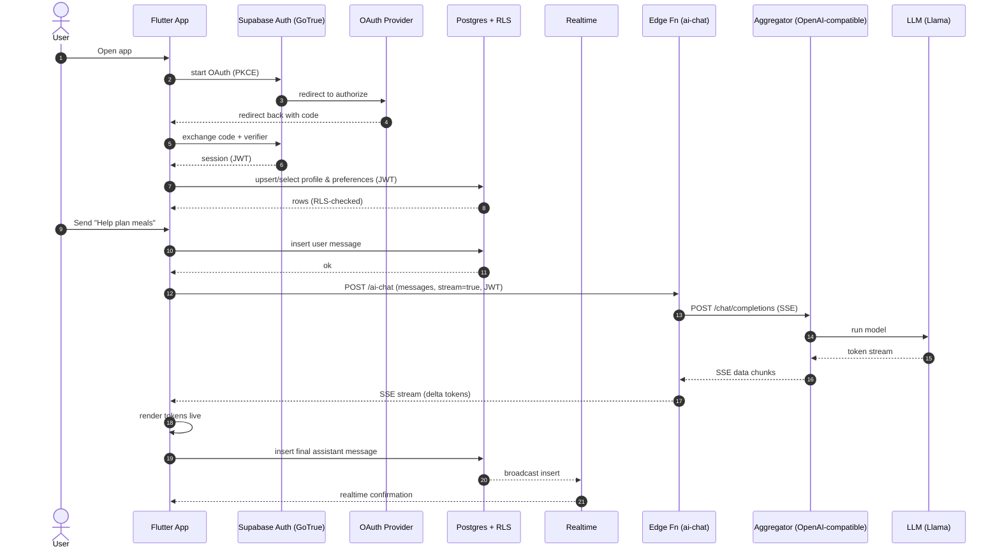
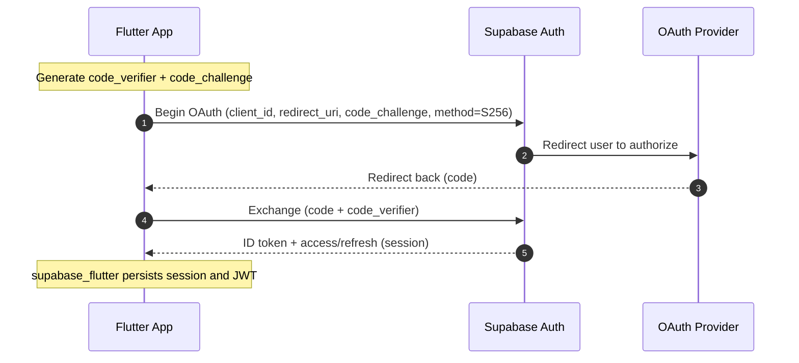
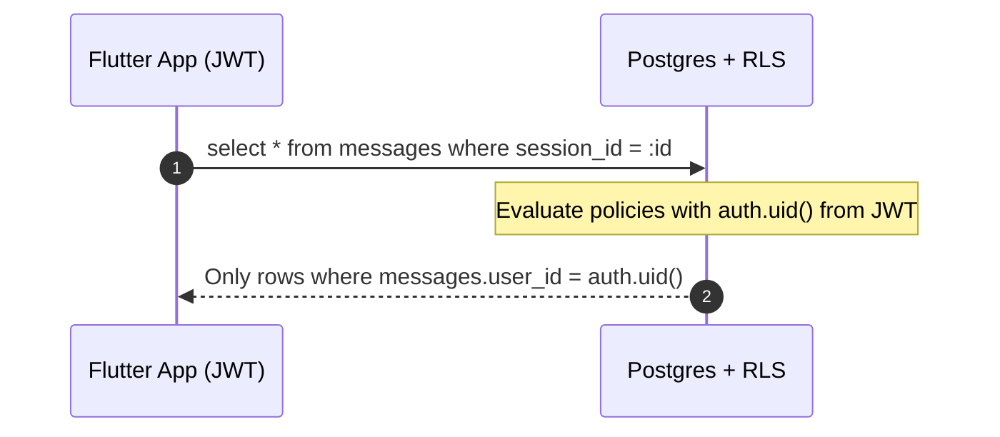
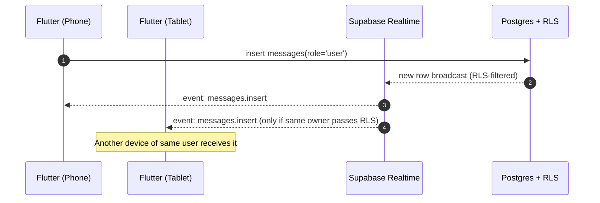
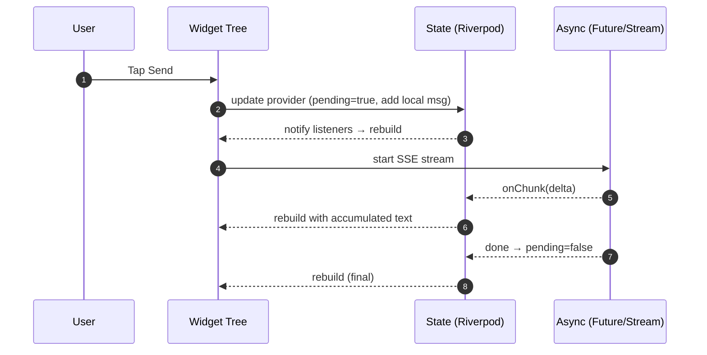
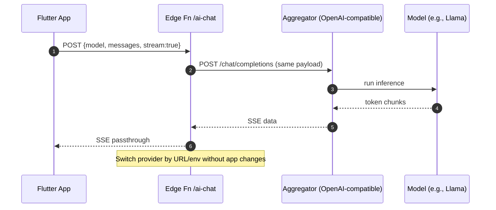

Flutter + Supabase + GenAI (Aggregator) — Fun, Goal-Driven Learning Guide

Scope map (how everything clicks together)
What you’ll be able to do after this section
- Visualize all moving parts and their roles.
- Explain the request flow for login and chat streaming.
- Point to where security (RLS) actually enforces access.

Components
- Flutter app (UI, state, async, navigation)
- Supabase Auth (GoTrue) with OAuth/OIDC + PKCE
- PostgreSQL with RLS policies (secure-by-default)
- Supabase Realtime (new rows/changes pushed to clients)
- Supabase Edge Function (TypeScript) as a Backend-for-Frontend proxy
- GenAI Aggregator (OpenAI-compatible API; e.g., OpenRouter/Together) and LLM (Llama)
- Storage and logs (avatars, event telemetry)

End-to-end chat (happy path)


Section 1 — Auth that “just works”: OAuth/OIDC + PKCE with Supabase
What you’ll learn
- Difference between OAuth and OIDC (identity on top of OAuth).
- How PKCE keeps mobile flows secure.
- How supabase_flutter completes the dance and stores the session.
- iOS/Android deep-link setup for callbacks.

Core idea
- Use supabase_flutter > signInWithOAuth(provider) which:
  - Opens system browser (ASWebAuthenticationSession/Custom Tabs).
  - Does PKCE automatically.
  - Receives redirect to your app scheme.
  - Exchanges code → session; stores tokens; emits auth state.

OAuth + PKCE (zoom-in)


Provider support notes
- Works: Google, Apple, GitHub, Twitter/X, Facebook.
- Instagram: Basic Display is not OIDC → not a real login provider out of the box.
- iOS rule: If you offer Google/etc., also offer Sign in with Apple.

Deep-dive links
- Supabase Auth (OAuth, PKCE): https://supabase.com/docs/guides/auth
- Apple Sign-In rules: https://developer.apple.com/app-store/review/guidelines/#sign-in-with-apple
- OIDC basics: https://openid.net/developers/specs/

Platform config snippets

iOS Info.plist (URL scheme + entitlement)
```xml
<!-- URL scheme: match your app scheme -->
<key>CFBundleURLTypes</key>
<array>
  <dict>
    <key>CFBundleURLSchemes</key>
    <array>
      <string>io.supabase.flutter</string>
    </array>
  </dict>
</array>
<!-- Add Sign in with Apple capability if you offer other sign-ins -->
```

Android AndroidManifest.xml (deep link)
```xml
<activity android:name="your.package.MainActivity"
  android:exported="true"
  android:launchMode="singleTask">
  <intent-filter android:autoVerify="true">
    <action android:name="android.intent.action.VIEW" />
    <category android:name="android.intent.category.DEFAULT" />
    <category android:name="android.intent.category.BROWSABLE" />
    <data android:scheme="io.supabase.flutter" android:host="login-callback" />
  </intent-filter>
</activity>
```

Section 2 — Database + RLS: “Lock it down, then forget about it”
What you’ll learn
- Model user-owned data (profiles, preferences, sessions, messages).
- Enable and write minimal RLS policies so auth.uid() gates everything.
- Why clients never send user_id (Postgres derives it from JWT).

Schema (copy/paste in SQL Editor)
```sql
create extension if not exists pgcrypto;

create table public.profiles (
  id uuid primary key references auth.users(id) on delete cascade,
  full_name text,
  avatar_url text,
  created_at timestamptz default now()
);

create table public.preferences (
  user_id uuid primary key references auth.users(id) on delete cascade,
  cuisines text[] default '{}',
  allergies text[] default '{}',
  diet text check (diet in ('omnivore','vegetarian','vegan','keto','paleo','mediterranean')) default 'omnivore',
  goals text[] default '{}',
  updated_at timestamptz default now()
);

create table public.chat_sessions (
  id uuid primary key default gen_random_uuid(),
  user_id uuid not null references auth.users(id) on delete cascade,
  title text,
  created_at timestamptz default now()
);

create table public.messages (
  id bigserial primary key,
  session_id uuid not null references public.chat_sessions(id) on delete cascade,
  user_id uuid not null references auth.users(id) on delete cascade,
  role text not null check (role in ('user','assistant','system')),
  content text not null,
  tokens_est int default 0,
  created_at timestamptz default now()
);

create table public.ai_events (
  id bigserial primary key,
  session_id uuid references public.chat_sessions(id) on delete cascade,
  user_id uuid not null references auth.users(id) on delete cascade,
  provider text,
  model text,
  prompt_tokens int,
  completion_tokens int,
  latency_ms int,
  cost_usd numeric(10,4),
  created_at timestamptz default now()
);
```

RLS policies (turn on and keep tight)
```sql
alter table profiles enable row level security;
alter table preferences enable row level security;
alter table chat_sessions enable row level security;
alter table messages enable row level security;
alter table ai_events enable row level security;

create policy "profile self read" on profiles for select using (id = auth.uid());
create policy "profile self write" on profiles for all using (id = auth.uid()) with check (id = auth.uid());

create policy "prefs self read" on preferences for select using (user_id = auth.uid());
create policy "prefs self write" on preferences for all using (user_id = auth.uid()) with check (user_id = auth.uid());

create policy "sessions self read" on chat_sessions for select using (user_id = auth.uid());
create policy "sessions self write" on chat_sessions for all using (user_id = auth.uid()) with check (user_id = auth.uid());

create policy "messages self read" on messages for select using (user_id = auth.uid());
create policy "messages self write" on messages for insert with check (user_id = auth.uid());
create policy "messages self delete" on messages for delete using (user_id = auth.uid());

create policy "ai events self" on ai_events for all using (user_id = auth.uid()) with check (user_id = auth.uid());
```

RLS in action


Deep-dive links
- RLS overview: https://supabase.com/docs/guides/auth/row-level-security
- Policies cookbook: https://supabase.com/docs/learn/auth-deep-dive/auth-row-level-security

Section 3 — Realtime: “Your UI updates itself”
What you’ll learn
- Turn on table-level realtime.
- Subscribe to your own rows safely (RLS-aware).
- Drive chat UI with inserts.

Enable realtime (Dashboard → Realtime)
- Enable for schema public or for messages only.

Realtime flow


Flutter subscription (minimal)
```dart
final userId = Supabase.instance.client.auth.currentUser!.id;
final channel = Supabase.instance.client
  .channel('public:messages:user')
  .onPostgresChanges(
    event: PostgresChangeEvent.insert,
    schema: 'public',
    table: 'messages',
    filter: PostgresChangeFilter.eq('user_id', userId),
    callback: (payload) {
      // append message to UI
    },
  )
  .subscribe();
```

Docs
- Realtime: https://supabase.com/docs/guides/realtime

Section 4 — Flutter fundamentals: Widgets, state, navigation, async
What you’ll learn
- Build UI with widgets and layouts.
- Manage local state (setState) and app state (Riverpod).
- Navigate with go_router.
- Handle Futures and Streams cleanly.

Quick mental model


Starter Flutter glue
```dart
import 'package:flutter/material.dart';
import 'package:go_router/go_router.dart';
import 'package:supabase_flutter/supabase_flutter.dart';

const supabaseUrl = 'https://YOUR-PROJECT.supabase.co';
const supabaseKey = 'ANON-PUBLIC-KEY';

void main() async {
  WidgetsFlutterBinding.ensureInitialized();
  await Supabase.initialize(
    url: supabaseUrl,
    anonKey: supabaseKey,
    authCallbackUrlHostname: 'login-callback',
  );
  runApp(const App());
}

class App extends StatelessWidget {
  const App({super.key});
  @override
  Widget build(BuildContext context) {
    final loggedIn = Supabase.instance.client.auth.currentSession != null;
    final router = GoRouter(
      initialLocation: loggedIn ? '/home' : '/signin',
      routes: [
        GoRoute(path: '/signin', builder: (_, __) => const SignInScreen()),
        GoRoute(path: '/home', builder: (_, __) => const HomeScreen()),
        GoRoute(path: '/chat', builder: (_, __) => const ChatScreen()),
      ],
      redirect: (ctx, state) {
        final session = Supabase.instance.client.auth.currentSession;
        final authed = session != null;
        final loggingIn = state.subloc == '/signin';
        if (!authed && !loggingIn) return '/signin';
        if (authed && loggingIn) return '/home';
        return null;
      },
    );
    return MaterialApp.router(routerConfig: router);
  }
}

class SignInScreen extends StatelessWidget {
  const SignInScreen({super.key});
  @override
  Widget build(BuildContext context) {
    return Scaffold(
      body: Center(
        child: Column(mainAxisSize: MainAxisSize.min, children: [
          ElevatedButton(
            onPressed: () => Supabase.instance.client.auth.signInWithPassword(
              email: 'demo@example.com',
              password: 'password',
            ),
            child: const Text('Email + Password'),
          ),
          ElevatedButton(
            onPressed: () => Supabase.instance.client.auth.signInWithOAuth(
              Provider.google,
              redirectTo: 'io.supabase.flutter://login-callback',
            ),
            child: const Text('Continue with Google'),
          ),
          ElevatedButton(
            onPressed: () => Supabase.instance.client.auth.signInWithOAuth(
              Provider.apple,
              redirectTo: 'io.supabase.flutter://login-callback',
            ),
            child: const Text('Continue with Apple'),
          ),
        ]),
      ),
    );
  }
}

class HomeScreen extends StatelessWidget {
  const HomeScreen({super.key});
  @override
  Widget build(BuildContext context) {
    return Scaffold(
      appBar: AppBar(title: const Text('Food Coach')),
      body: Center(
        child: ElevatedButton(
          onPressed: () => context.go('/chat'),
          child: const Text('Open Chat'),
        ),
      ),
    );
  }
}

class ChatScreen extends StatefulWidget {
  const ChatScreen({super.key});
  @override
  State<ChatScreen> createState() => _ChatScreenState();
}

class _ChatScreenState extends State<ChatScreen> {
  final ctrl = TextEditingController();
  final msgs = <String>[];
  bool pending = false;

  @override
  Widget build(BuildContext context) {
    return Scaffold(
      appBar: AppBar(title: const Text('Chat')),
      body: Column(children: [
        Expanded(
          child: ListView.builder(
            padding: const EdgeInsets.all(12),
            itemCount: msgs.length,
            itemBuilder: (_, i) => Align(
              alignment: i.isEven ? Alignment.centerRight : Alignment.centerLeft,
              child: Container(
                padding: const EdgeInsets.all(10),
                margin: const EdgeInsets.symmetric(vertical: 6),
                decoration: BoxDecoration(
                  color: i.isEven ? Colors.blue[50] : Colors.grey[200],
                  borderRadius: BorderRadius.circular(10),
                ),
                child: Text(msgs[i]),
              ),
            ),
          ),
        ),
        if (pending) const LinearProgressIndicator(),
        Row(children: [
          Expanded(child: TextField(controller: ctrl)),
          IconButton(
            icon: const Icon(Icons.send),
            onPressed: pending ? null : _send,
          ),
        ]),
      ]),
    );
  }

  Future<void> _send() async {
    final text = ctrl.text.trim();
    if (text.isEmpty) return;
    setState(() {
      msgs.add(text); // user
      pending = true;
    });
    ctrl.clear();

    // Insert user message
    final userId = Supabase.instance.client.auth.currentUser!.id;
    final sessionId = await _ensureSession();
    await Supabase.instance.client.from('messages').insert({
      'session_id': sessionId,
      'user_id': userId,
      'role': 'user',
      'content': text,
    });

    // Stream assistant via Edge Function
    var assistant = '';
    await for (final delta in streamChat([
      {'role': 'system', 'content': 'You are a food coach.'},
      {'role': 'user', 'content': text},
    ])) {
      assistant += delta;
      if (assistant.length % 40 == 0) {
        setState(() {
          if (msgs.length.isOdd) {
            msgs.add(assistant);
          } else {
            msgs[msgs.length - 1] = assistant;
          }
        });
      }
    }
    setState(() {
      if (msgs.length.isOdd) msgs.add(assistant);
      else msgs[msgs.length - 1] = assistant;
      pending = false;
    });

    // Persist assistant message
    await Supabase.instance.client.from('messages').insert({
      'session_id': sessionId,
      'user_id': userId,
      'role': 'assistant',
      'content': assistant,
    });
  }

  Future<String> _ensureSession() async {
    // Create a chat session on first send; you could cache this in state.
    final userId = Supabase.instance.client.auth.currentUser!.id;
    final s = await Supabase.instance.client
        .from('chat_sessions')
        .insert({'user_id': userId, 'title': 'My Plan'})
        .select('id')
        .single();
    return s['id'] as String;
  }
}
```

Section 5 — GenAI with minimal code: Edge Function + OpenAI-compatible API
What you’ll learn
- Keep one API contract (OpenAI chat/completions).
- Stream tokens with SSE for low-latency UX.
- Swap providers/models without changing the app.

One contract to rule them all


Edge Function (TypeScript, pass-through SSE)
File: supabase/functions/ai-chat/index.ts
```ts
// deno-lint-ignore-file no-explicit-any
import 'jsr:@supabase/functions-js/edge-runtime.d.ts';

Deno.serve(async (req) => {
  if (req.method === 'OPTIONS') {
    return new Response(null, {
      headers: {
        'Access-Control-Allow-Origin': '*',
        'Access-Control-Allow-Headers': '*',
        'Access-Control-Allow-Methods': 'POST, OPTIONS',
      },
    });
  }

  const jwt = req.headers.get('Authorization')?.replace('Bearer ', '');
  if (!jwt) return new Response('Unauthorized', { status: 401 });

  const apiKey = Deno.env.get('AGGREGATOR_API_KEY');
  const baseUrl = Deno.env.get('AGGREGATOR_BASE') ?? 'https://openrouter.ai';
  if (!apiKey) return new Response('Missing upstream API key', { status: 500 });

  let payload: any;
  try { payload = await req.json(); } catch { return new Response('Bad JSON', { status: 400 }); }
  const body = { stream: true, ...payload };

  const upstream = await fetch(`${baseUrl}/api/v1/chat/completions`, {
    method: 'POST',
    headers: {
      'Authorization': `Bearer ${apiKey}`,
      'Content-Type': 'application/json',
      'HTTP-Referer': 'your.app',
      'X-Title': 'FoodCoach',
    },
    body: JSON.stringify(body),
  });

  if (!upstream.ok || !upstream.body) {
    const text = await upstream.text();
    return new Response(text, { status: upstream.status });
  }

  const headers = new Headers(upstream.headers);
  headers.set('Content-Type', 'text/event-stream');
  headers.set('Cache-Control', 'no-cache');
  headers.set('Connection', 'keep-alive');
  headers.set('Access-Control-Allow-Origin', '*');

  return new Response(upstream.body, { status: 200, headers });
});
```

Deploy
- supabase functions deploy ai-chat
- supabase secrets set AGGREGATOR_API_KEY=... AGGREGATOR_BASE=https://openrouter.ai

Flutter: streaming SSE utility
```dart
import 'dart:convert';
import 'package:eventsource/eventsource.dart';
import 'package:supabase_flutter/supabase_flutter.dart';

Stream<String> streamChat(List<Map<String, String>> messages, {String model = 'meta-llama/Meta-Llama-3.1-8B-Instruct'}) async* {
  final jwt = Supabase.instance.client.auth.currentSession!.accessToken;
  final url = '${Supabase.instance.client.functionsUrl}/ai-chat';
  final es = await EventSource.connect(
    url,
    method: 'POST',
    headers: {'Authorization': 'Bearer $jwt', 'Content-Type': 'application/json'},
    body: utf8.encode(jsonEncode({'model': model, 'messages': messages, 'stream': true})),
  );
  await for (final e in es.events) {
    if (e.data == '[DONE]') break;
    final json = jsonDecode(e.data);
    final delta = json['choices']?[0]?['delta']?['content'];
    if (delta is String && delta.isNotEmpty) yield delta;
  }
}
```

Deep-dive links
- OpenAI-compatible streaming: https://platform.openai.com/docs/api-reference/streaming
- OpenRouter docs: https://openrouter.ai/docs
- Supabase Edge Functions: https://supabase.com/docs/guides/functions

Section 6 — Putting data to work: preferences → better prompts
What you’ll learn
- Use stored preferences (diet, allergies, goals) to condition the system prompt.
- Keep prompts deterministic and short.

Prompt pattern
```mermaid
sequenceDiagram
  autonumber
  participant F as Flutter
  participant DB as Postgres (prefs)
  participant EF as Edge Fn
  F->>DB: select preferences for current user
  DB-->>F: diet=vegan; allergies=[peanut]
  F->>EF: messages = [system: "You are a food coach...(diet=vegan, avoid=peanut)", user: "..."]
  EF-->>F: SSE stream → personalized plan
```

System prompt template (example)
- “You are a food coach. Always respect allergies: {allergies}. Tailor to {diet} diet. Provide shopping list and prep steps. Use metric units.”

Section 7 — iOS + Android specifics: smooth launch
What you’ll learn
- Configure redirect URIs and review-time requirements.
- Build and run on device; handle entitlements and signing.

iOS
- Xcode 15+, iOS 13+ baseline.
- Add URL scheme: io.supabase.flutter; authCallbackUrlHostname: login-callback.
- Sign in with Apple capability if you offer other providers.
- Test real device for OAuth flows (simulator sometimes blocks provider apps).

Android
- Android Studio; minSdk 23+ recommended by Flutter.
- AndroidManifest intent-filter for deep link (shown earlier).
- Release signing configs; set appId consistent with URL scheme.

Section 8 — Your “less code” patterns cheat-sheet
What you’ll learn
- Recognize patterns that reduce code and vendor lock-in.

Patterns
- OpenAI-compatible contract: one request shape for all providers.
- Edge Function proxy: swap providers via env only.
- SSE-only UI streaming: single Stream<String> glue.
- RLS-first: never send user_id; let DB enforce access.
- Append-only logs: messages and ai_events; cascade deletes.
- Realtime for “self”: subscribe with user_id filter (RLS will still protect).

Section 9 — Week-by-week roadmap (5–7 hrs/week, ~9 weeks)
What you’ll learn
- How to pace your learning and ship iteratively.

- Week 1: Flutter fundamentals (widgets/layout/build/setState); build static screens.
- Week 2: Async + state (Futures/Streams, Riverpod/Provider); basic navigation with go_router.
- Week 3: Supabase project, run SQL schema, enable RLS + Realtime; Storage for avatars.
- Week 4: Auth end-to-end (Email/Password, Google, Apple); deep links; session guards.
- Week 5: Messages CRUD + Realtime; optimistic UI; multi-session titles.
- Week 6: Edge Function ai-chat + SSE; error handling; timeouts.
- Week 7: Personalization from preferences; prompt templates; simple meal-plan saver.
- Week 8: iOS/Android polish (icons/splash, entitlements, signing); telemetry and crash reporting.
- Week 9: Hardening (RLS audits, pagination, input validation, basic rate limits).

Section 10 — Resources (official and practical)
What you’ll learn
- Where to go deeper without getting lost.

- Flutter docs: https://docs.flutter.dev
- Flutter codelabs: https://codelabs.developers.google.com/?product=flutter
- Dart language tour: https://dart.dev/guides/language/language-tour
- Supabase Flutter quickstart: https://supabase.com/docs/guides/getting-started/tutorials/with-flutter
- Supabase Auth providers: https://supabase.com/docs/guides/auth/social-login/auth-google
- Supabase Realtime: https://supabase.com/docs/guides/realtime
- Supabase Functions: https://supabase.com/docs/guides/functions
- OpenRouter docs: https://openrouter.ai/docs
- OAuth + OIDC: https://oauth.net/2/ and https://openid.net/specs/openid-connect-core-1_0.html

Final quiz — Check your understanding
Instructions
- Answer concisely. Mix of multiple-choice and short answer.
- Answer key at the end.

1) Which protocol adds identity on top of OAuth?  
  a) PKCE  b) OIDC  c) SAML  d) JWT

2) In mobile OAuth with PKCE, which two values are paired?  
  a) access_token and refresh_token  
  b) code and code_verifier  
  c) id_token and nonce  
  d) client_id and client_secret

3) Where does RLS run?  
  a) Flutter  b) Edge Function  c) Postgres  d) Realtime server

4) True/False: Clients should include user_id in writes to user-owned tables.

5) Which flow produces the best streaming UX with least code?  
  a) REST without streaming  b) WebSocket custom protocol  
  c) SSE via OpenAI-compatible API  d) Polling every second

6) If you add Google Sign-In on iOS, which additional option is required by App Store policy?  
  a) Facebook  b) Twitter  c) Sign in with Apple  d) GitHub

7) Which is NOT an OIDC provider out-of-the-box?  
  a) Apple  b) Google  c) Instagram (Basic Display)  d) GitHub

8) What does authCallbackUrlHostname configure in supabase_flutter?  
  a) JWT claim name  b) URL path for your DB  
  c) Deep link host in your redirect URI  d) SSE channel name

9) Name the minimal pieces to stream chat into Flutter (short answer).

10) With RLS, how does Postgres know the current user?  
  a) From a session variable in Flutter  
  b) From JWT attached to the DB request  
  c) From a cookie set by Edge Functions  
  d) It guesses based on IP

11) Where do you swap model providers without changing the app?  
  a) Flutter build.gradle  b) Edge Function env vars  
  c) Realtime config  d) Postgres GUCs

12) What’s the benefit of using an OpenAI-compatible API surface? (short answer)

13) Which statement is true about Realtime + RLS?  
  a) Realtime bypasses RLS  
  b) Realtime respects RLS filters per subscription  
  c) RLS only applies to inserts  
  d) RLS only applies on weekdays

14) What’s the default place to store Supabase sessions on mobile?  
  a) SharedPreferences only  
  b) Secure storage via supabase_flutter  
  c) Plain text file  
  d) Nowhere

15) Order the chat flow steps:  
  (i) Insert user message → (ii) Call Edge Fn (SSE) → (iii) Render tokens → (iv) Insert assistant message

16) Short answer: Why avoid sending user_id from the client on inserts?

17) Which navigation solution is used in the sample?  
  a) Navigator 1.0  b) go_router  c) Beamer  d) AutoRoute

18) How do you ensure deep links work on Android for OAuth callbacks?  
  a) Add intent-filter with scheme + host  b) Add INTERNET permission only  
  c) Use Firebase Dynamic Links  d) None required

19) What’s a safe way to support multiple providers and keep code minimal?  
  a) Hardcode endpoints in Flutter  
  b) Use an Edge Function proxy with OpenAI-compatible contract  
  c) Call providers directly from Flutter with their SDKs  
  d) Build your own gateway in Flutter

20) Bonus: Name two personalization fields you’d persist for a food coach and how they influence the prompt.

Answer key
1) b  
2) b  
3) c  
4) False (let RLS derive from JWT; you can include it, but design so DB ignores mismatches)  
5) c  
6) c  
7) c  
8) c  
9) Flutter EventSource/SSE client + Edge Function passthrough + OpenAI-compatible provider  
10) b  
11) b  
12) One request shape enables easy provider/model switching and less custom code  
13) b  
14) b  
15) i → ii → iii → iv  
16) Prevent tampering; server (RLS) derives identity from JWT to enforce ownership  
17) b  
18) a  
19) b  
20) Examples: allergies (exclude ingredients), diet (choose allowed recipes), goals (calorie/weight targets)