Flutter + Supabase + GenAI (Aggregator) — Fun, Goal-Driven Learning Guide

## Executive Summary

This comprehensive guide provides a practical, goal-driven approach to building modern mobile applications using [Flutter](#glossary), [Supabase](#glossary), and [GenAI](#glossary) services. The document walks through the complete architecture of a production-ready food coach application, demonstrating how to integrate [OAuth](#glossary)/[OIDC](#glossary) authentication with [PKCE](#glossary), implement secure database access with [Row-Level Security (RLS)](#glossary), enable real-time updates, and stream AI-generated responses with minimal code complexity.

The guide emphasizes "less code" patterns that reduce vendor lock-in and maximize maintainability. By using [OpenAI-compatible APIs](#glossary), [Edge Functions](#glossary) as Backend-for-Frontend proxies, and [Postgres](#glossary)-enforced security through [RLS](#glossary), developers can build sophisticated features without writing extensive boilerplate. The architecture leverages [Flutter's](#glossary) widget system, [Dart's](#glossary) async/await model, and [Supabase's](#glossary) real-time capabilities to create responsive user experiences across iOS and Android platforms.

Structured as a 9-week learning roadmap with 5-7 hours per week, this guide includes complete code samples, [Mermaid](#glossary) diagrams for visual understanding, platform-specific configuration details, and a final quiz to validate comprehension. Whether you're building a food coach, chat application, or any user-centric mobile app requiring authentication, real-time data, and AI integration, this guide provides the patterns and practices to ship production-ready features efficiently.

Scope map (how everything clicks together)
What you'll be able to do after this section
- Visualize all moving parts and their roles.
- Explain the request flow for login and chat streaming.
- Point to where security ([RLS](#glossary)) actually enforces access.

Components
- [Flutter](#glossary) app (UI, state, async, navigation)
- [Supabase](#glossary) Auth ([GoTrue](#glossary)) with [OAuth](#glossary)/[OIDC](#glossary) + [PKCE](#glossary)
- [PostgreSQL](#glossary) with [RLS](#glossary) policies (secure-by-default)
- [Supabase](#glossary) [Realtime](#glossary) (new rows/changes pushed to clients)
- [Supabase](#glossary) [Edge Function](#glossary) ([TypeScript](#glossary)) as a [Backend-for-Frontend](#glossary) proxy
- [GenAI](#glossary) [Aggregator](#glossary) ([OpenAI-compatible API](#glossary); e.g., OpenRouter/Together) and [LLM](#glossary) (Llama)
- Storage and logs (avatars, event telemetry)

System architecture overview
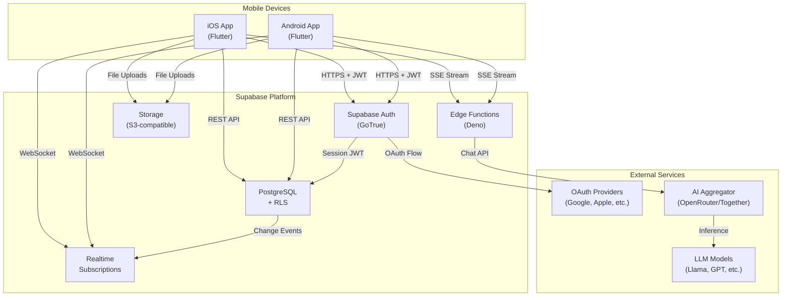

End-to-end chat (happy path)
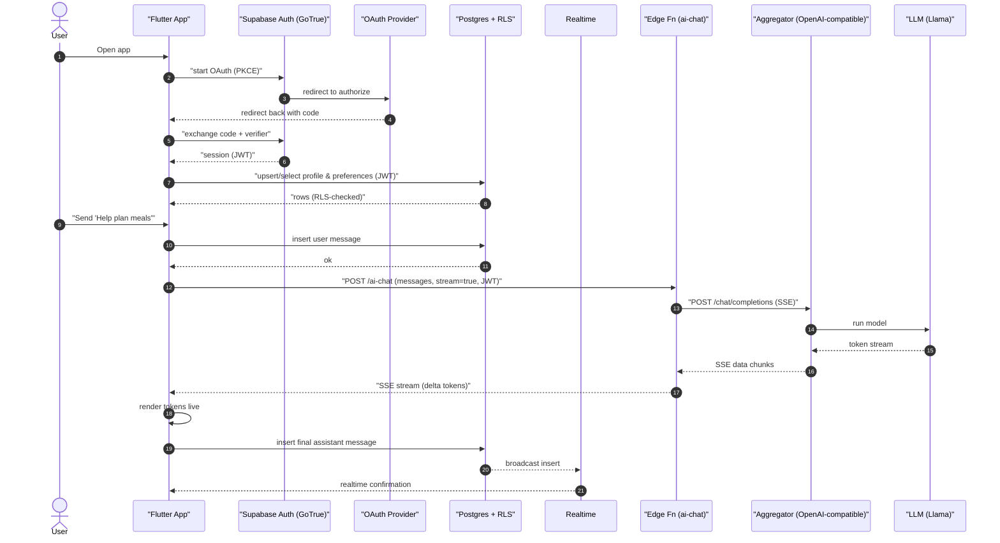

Section 1 — Auth that "just works": [OAuth](#glossary)/[OIDC](#glossary) + [PKCE](#glossary) with [Supabase](#glossary)
What you'll learn
- Difference between [OAuth](#glossary) and [OIDC](#glossary) (identity on top of [OAuth](#glossary)).
- How [PKCE](#glossary) keeps mobile flows secure.
- How supabase_flutter completes the dance and stores the session.
- iOS/Android [deep-link](#glossary) setup for callbacks.

Core idea
- Use supabase_flutter > signInWithOAuth(provider) which:
  - Opens system browser ([ASWebAuthenticationSession](#glossary)/[Custom Tabs](#glossary)).
  - Does [PKCE](#glossary) automatically.
  - Receives redirect to your app scheme.
  - Exchanges code → session; stores tokens; emits auth state.

OAuth + PKCE (zoom-in)
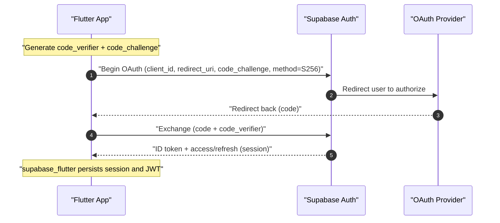

Provider support notes
- Works: Google, Apple, GitHub, Twitter/X, Facebook.
- Instagram: Basic Display is not [OIDC](#glossary) → not a real login provider out of the box.
- iOS rule: If you offer Google/etc., also offer Sign in with Apple.

OAuth provider comparison
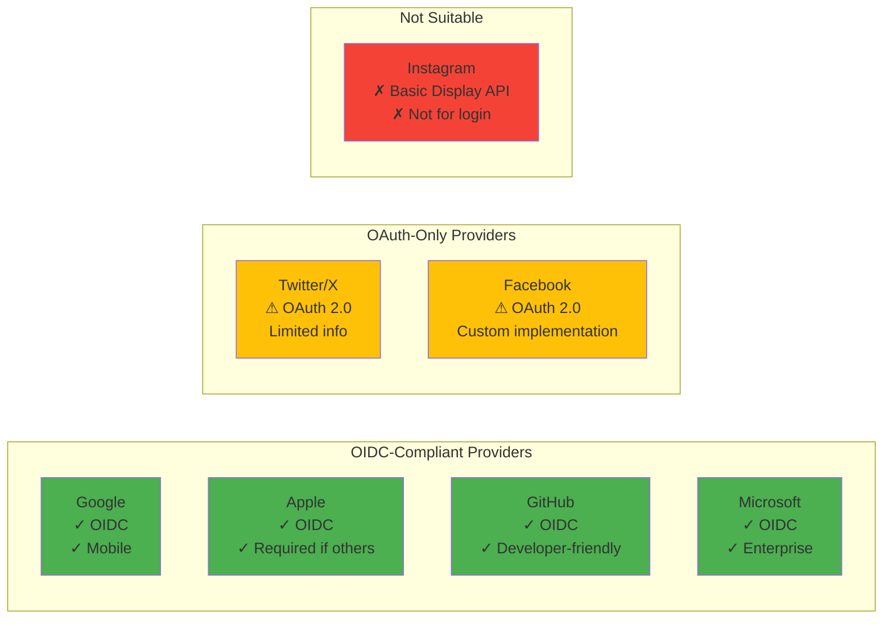

Deep-dive links
- [Supabase](#glossary) Auth ([OAuth](#glossary), [PKCE](#glossary)): https://supabase.com/docs/guides/auth
- Apple Sign-In rules: https://developer.apple.com/app-store/review/guidelines/#sign-in-with-apple
- [OIDC](#glossary) basics: https://openid.net/developers/specs/

Platform config snippets

iOS Info.plist ([URL scheme](#glossary) + entitlement)
```xml
<!-- URL scheme: match your app scheme -->
<key>CFBundleURLTypes</key>
<array>
  <dict>
    <key>CFBundleURLSchemes</key>
    <array>
      <string>io.supabase.flutter</string>
    </array>
  </dict>
</array>
<!-- Add Sign in with Apple capability if you offer other sign-ins -->
```

Android AndroidManifest.xml ([deep link](#glossary))
```xml
<activity android:name="your.package.MainActivity"
  android:exported="true"
  android:launchMode="singleTask">
  <intent-filter android:autoVerify="true">
    <action android:name="android.intent.action.VIEW" />
    <category android:name="android.intent.category.DEFAULT" />
    <category android:name="android.intent.category.BROWSABLE" />
    <data android:scheme="io.supabase.flutter" android:host="login-callback" />
  </intent-filter>
</activity>
```

Section 2 — Database + [RLS](#glossary): "Lock it down, then forget about it"
What you'll learn
- Model user-owned data (profiles, preferences, sessions, messages).
- Enable and write minimal [RLS](#glossary) policies so [auth.uid()](#glossary) gates everything.
- Why clients never send user_id ([Postgres](#glossary) derives it from [JWT](#glossary)).

Database schema relationships
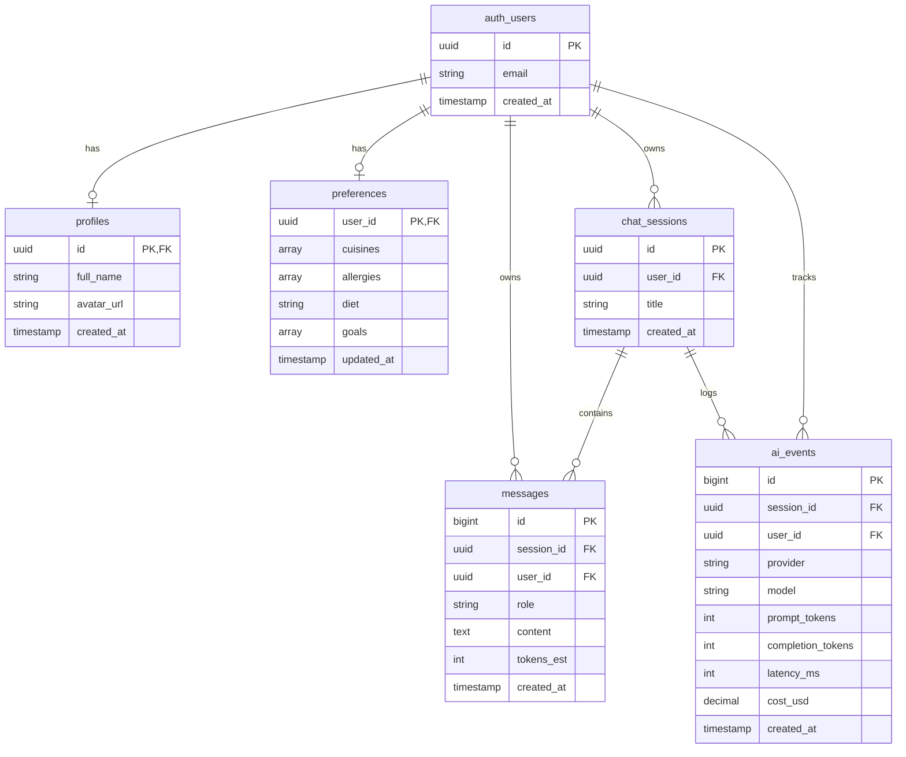

Schema (copy/paste in SQL Editor)
```sql
create extension if not exists pgcrypto;

create table public.profiles (
  id uuid primary key references auth.users(id) on delete cascade,
  full_name text,
  avatar_url text,
  created_at timestamptz default now()
);

create table public.preferences (
  user_id uuid primary key references auth.users(id) on delete cascade,
  cuisines text[] default '{}',
  allergies text[] default '{}',
  diet text check (diet in ('omnivore','vegetarian','vegan','keto','paleo','mediterranean')) default 'omnivore',
  goals text[] default '{}',
  updated_at timestamptz default now()
);

create table public.chat_sessions (
  id uuid primary key default gen_random_uuid(),
  user_id uuid not null references auth.users(id) on delete cascade,
  title text,
  created_at timestamptz default now()
);

create table public.messages (
  id bigserial primary key,
  session_id uuid not null references public.chat_sessions(id) on delete cascade,
  user_id uuid not null references auth.users(id) on delete cascade,
  role text not null check (role in ('user','assistant','system')),
  content text not null,
  tokens_est int default 0,
  created_at timestamptz default now()
);

create table public.ai_events (
  id bigserial primary key,
  session_id uuid references public.chat_sessions(id) on delete cascade,
  user_id uuid not null references auth.users(id) on delete cascade,
  provider text,
  model text,
  prompt_tokens int,
  completion_tokens int,
  latency_ms int,
  cost_usd numeric(10,4),
  created_at timestamptz default now()
);
```

RLS policies (turn on and keep tight)
```sql
alter table profiles enable row level security;
alter table preferences enable row level security;
alter table chat_sessions enable row level security;
alter table messages enable row level security;
alter table ai_events enable row level security;

create policy "profile self read" on profiles for select using (id = auth.uid());
create policy "profile self write" on profiles for all using (id = auth.uid()) with check (id = auth.uid());

create policy "prefs self read" on preferences for select using (user_id = auth.uid());
create policy "prefs self write" on preferences for all using (user_id = auth.uid()) with check (user_id = auth.uid());

create policy "sessions self read" on chat_sessions for select using (user_id = auth.uid());
create policy "sessions self write" on chat_sessions for all using (user_id = auth.uid()) with check (user_id = auth.uid());

create policy "messages self read" on messages for select using (user_id = auth.uid());
create policy "messages self write" on messages for insert with check (user_id = auth.uid());
create policy "messages self delete" on messages for delete using (user_id = auth.uid());

create policy "ai events self" on ai_events for all using (user_id = auth.uid()) with check (user_id = auth.uid());
```

RLS in action
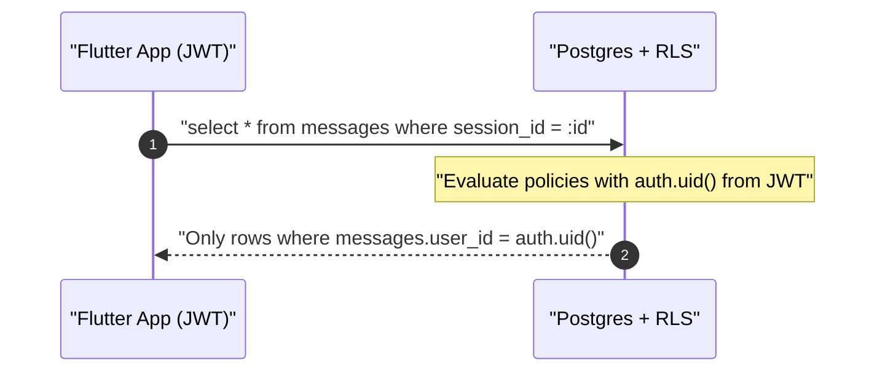

Deep-dive links
- [RLS](#glossary) overview: https://supabase.com/docs/guides/auth/row-level-security
- Policies cookbook: https://supabase.com/docs/learn/auth-deep-dive/auth-row-level-security

Section 3 — [Realtime](#glossary): "Your UI updates itself"
What you'll learn
- Turn on table-level [realtime](#glossary).
- Subscribe to your own rows safely ([RLS](#glossary)-aware).
- Drive chat UI with inserts.

Enable realtime (Dashboard → Realtime)
- Enable for schema public or for messages only.

Realtime flow
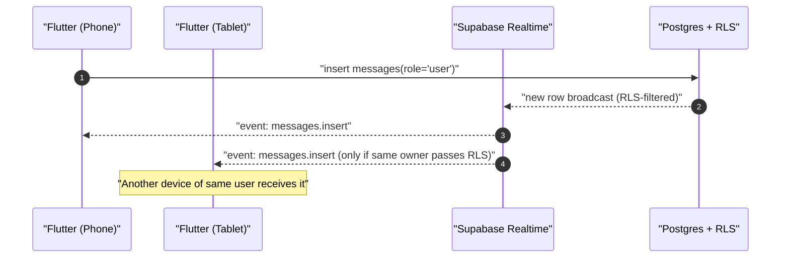

Flutter subscription (minimal)
```dart
final userId = Supabase.instance.client.auth.currentUser!.id;
final channel = Supabase.instance.client
  .channel('public:messages:user')
  .onPostgresChanges(
    event: PostgresChangeEvent.insert,
    schema: 'public',
    table: 'messages',
    filter: PostgresChangeFilter.eq('user_id', userId),
    callback: (payload) {
      // append message to UI
    },
  )
  .subscribe();
```

Docs
- [Realtime](#glossary): https://supabase.com/docs/guides/realtime

Section 4 — [Flutter](#glossary) fundamentals: [Widgets](#glossary), state, navigation, async
What you'll learn
- Build UI with [widgets](#glossary) and layouts.
- Manage local state ([setState](#glossary)) and app state ([Riverpod](#glossary)).
- Navigate with [go_router](#glossary).
- Handle [Futures](#glossary) and [Streams](#glossary) cleanly.

Quick mental model
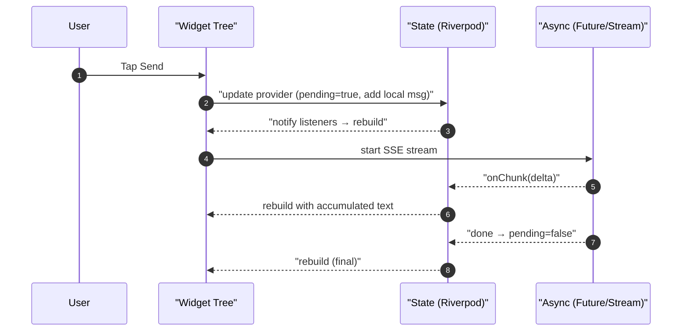

Flutter app state management flow
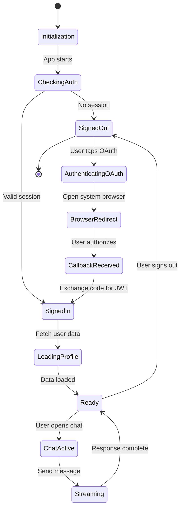

Flutter widget tree navigation
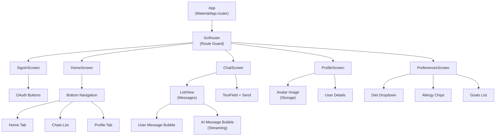

Starter [Flutter](#glossary) glue
```dart
import 'package:flutter/material.dart';
import 'package:go_router/go_router.dart';
import 'package:supabase_flutter/supabase_flutter.dart';

const supabaseUrl = 'https://YOUR-PROJECT.supabase.co';
const supabaseKey = 'ANON-PUBLIC-KEY';

void main() async {
  WidgetsFlutterBinding.ensureInitialized();
  await Supabase.initialize(
    url: supabaseUrl,
    anonKey: supabaseKey,
    authCallbackUrlHostname: 'login-callback',
  );
  runApp(const App());
}

class App extends StatelessWidget {
  const App({super.key});
  @override
  Widget build(BuildContext context) {
    final loggedIn = Supabase.instance.client.auth.currentSession != null;
    final router = GoRouter(
      initialLocation: loggedIn ? '/home' : '/signin',
      routes: [
        GoRoute(path: '/signin', builder: (_, __) => const SignInScreen()),
        GoRoute(path: '/home', builder: (_, __) => const HomeScreen()),
        GoRoute(path: '/chat', builder: (_, __) => const ChatScreen()),
      ],
      redirect: (ctx, state) {
        final session = Supabase.instance.client.auth.currentSession;
        final authed = session != null;
        final loggingIn = state.subloc == '/signin';
        if (!authed && !loggingIn) return '/signin';
        if (authed && loggingIn) return '/home';
        return null;
      },
    );
    return MaterialApp.router(routerConfig: router);
  }
}

class SignInScreen extends StatelessWidget {
  const SignInScreen({super.key});
  @override
  Widget build(BuildContext context) {
    return Scaffold(
      body: Center(
        child: Column(mainAxisSize: MainAxisSize.min, children: [
          ElevatedButton(
            onPressed: () => Supabase.instance.client.auth.signInWithPassword(
              email: 'demo@example.com',
              password: 'password',
            ),
            child: const Text('Email + Password'),
          ),
          ElevatedButton(
            onPressed: () => Supabase.instance.client.auth.signInWithOAuth(
              Provider.google,
              redirectTo: 'io.supabase.flutter://login-callback',
            ),
            child: const Text('Continue with Google'),
          ),
          ElevatedButton(
            onPressed: () => Supabase.instance.client.auth.signInWithOAuth(
              Provider.apple,
              redirectTo: 'io.supabase.flutter://login-callback',
            ),
            child: const Text('Continue with Apple'),
          ),
        ]),
      ),
    );
  }
}

class HomeScreen extends StatelessWidget {
  const HomeScreen({super.key});
  @override
  Widget build(BuildContext context) {
    return Scaffold(
      appBar: AppBar(title: const Text('Food Coach')),
      body: Center(
        child: ElevatedButton(
          onPressed: () => context.go('/chat'),
          child: const Text('Open Chat'),
        ),
      ),
    );
  }
}

class ChatScreen extends StatefulWidget {
  const ChatScreen({super.key});
  @override
  State<ChatScreen> createState() => _ChatScreenState();
}

class _ChatScreenState extends State<ChatScreen> {
  final ctrl = TextEditingController();
  final msgs = <String>[];
  bool pending = false;

  @override
  Widget build(BuildContext context) {
    return Scaffold(
      appBar: AppBar(title: const Text('Chat')),
      body: Column(children: [
        Expanded(
          child: ListView.builder(
            padding: const EdgeInsets.all(12),
            itemCount: msgs.length,
            itemBuilder: (_, i) => Align(
              alignment: i.isEven ? Alignment.centerRight : Alignment.centerLeft,
              child: Container(
                padding: const EdgeInsets.all(10),
                margin: const EdgeInsets.symmetric(vertical: 6),
                decoration: BoxDecoration(
                  color: i.isEven ? Colors.blue[50] : Colors.grey[200],
                  borderRadius: BorderRadius.circular(10),
                ),
                child: Text(msgs[i]),
              ),
            ),
          ),
        ),
        if (pending) const LinearProgressIndicator(),
        Row(children: [
          Expanded(child: TextField(controller: ctrl)),
          IconButton(
            icon: const Icon(Icons.send),
            onPressed: pending ? null : _send,
          ),
        ]),
      ]),
    );
  }

  Future<void> _send() async {
    final text = ctrl.text.trim();
    if (text.isEmpty) return;
    setState(() {
      msgs.add(text); // user
      pending = true;
    });
    ctrl.clear();

    // Insert user message
    final userId = Supabase.instance.client.auth.currentUser!.id;
    final sessionId = await _ensureSession();
    await Supabase.instance.client.from('messages').insert({
      'session_id': sessionId,
      'user_id': userId,
      'role': 'user',
      'content': text,
    });

    // Stream assistant via Edge Function
    var assistant = '';
    await for (final delta in streamChat([
      {'role': 'system', 'content': 'You are a food coach.'},
      {'role': 'user', 'content': text},
    ])) {
      assistant += delta;
      if (assistant.length % 40 == 0) {
        setState(() {
          if (msgs.length.isOdd) {
            msgs.add(assistant);
          } else {
            msgs[msgs.length - 1] = assistant;
          }
        });
      }
    }
    setState(() {
      if (msgs.length.isOdd) msgs.add(assistant);
      else msgs[msgs.length - 1] = assistant;
      pending = false;
    });

    // Persist assistant message
    await Supabase.instance.client.from('messages').insert({
      'session_id': sessionId,
      'user_id': userId,
      'role': 'assistant',
      'content': assistant,
    });
  }

  Future<String> _ensureSession() async {
    // Create a chat session on first send; you could cache this in state.
    final userId = Supabase.instance.client.auth.currentUser!.id;
    final s = await Supabase.instance.client
        .from('chat_sessions')
        .insert({'user_id': userId, 'title': 'My Plan'})
        .select('id')
        .single();
    return s['id'] as String;
  }
}
```

Section 5 — [GenAI](#glossary) with minimal code: [Edge Function](#glossary) + [OpenAI-compatible API](#glossary)
What you'll learn
- Keep one API contract ([OpenAI](#glossary) chat/completions).
- Stream tokens with [SSE](#glossary) for low-latency UX.
- Swap providers/models without changing the app.

One contract to rule them all
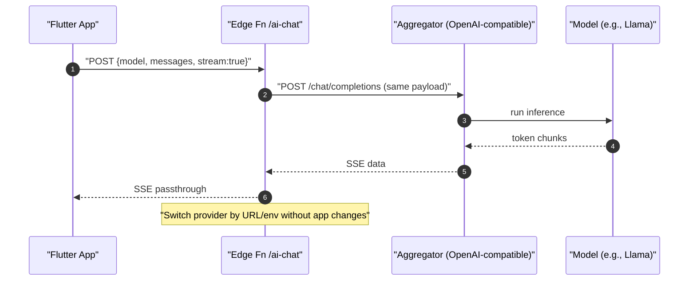

[Edge Function](#glossary) ([TypeScript](#glossary), pass-through [SSE](#glossary))
File: supabase/functions/ai-chat/index.ts
```ts
// deno-lint-ignore-file no-explicit-any
import 'jsr:@supabase/functions-js/edge-runtime.d.ts';

Deno.serve(async (req) => {
  if (req.method === 'OPTIONS') {
    return new Response(null, {
      headers: {
        'Access-Control-Allow-Origin': '*',
        'Access-Control-Allow-Headers': '*',
        'Access-Control-Allow-Methods': 'POST, OPTIONS',
      },
    });
  }

  const jwt = req.headers.get('Authorization')?.replace('Bearer ', '');
  if (!jwt) return new Response('Unauthorized', { status: 401 });

  const apiKey = Deno.env.get('AGGREGATOR_API_KEY');
  const baseUrl = Deno.env.get('AGGREGATOR_BASE') ?? 'https://openrouter.ai';
  if (!apiKey) return new Response('Missing upstream API key', { status: 500 });

  let payload: any;
  try { payload = await req.json(); } catch { return new Response('Bad JSON', { status: 400 }); }
  const body = { stream: true, ...payload };

  const upstream = await fetch(`${baseUrl}/api/v1/chat/completions`, {
    method: 'POST',
    headers: {
      'Authorization': `Bearer ${apiKey}`,
      'Content-Type': 'application/json',
      'HTTP-Referer': 'your.app',
      'X-Title': 'FoodCoach',
    },
    body: JSON.stringify(body),
  });

  if (!upstream.ok || !upstream.body) {
    const text = await upstream.text();
    return new Response(text, { status: upstream.status });
  }

  const headers = new Headers(upstream.headers);
  headers.set('Content-Type', 'text/event-stream');
  headers.set('Cache-Control', 'no-cache');
  headers.set('Connection', 'keep-alive');
  headers.set('Access-Control-Allow-Origin', '*');

  return new Response(upstream.body, { status: 200, headers });
});
```

Deploy
- supabase functions deploy ai-chat
- supabase secrets set AGGREGATOR_API_KEY=... AGGREGATOR_BASE=https://openrouter.ai

[Flutter](#glossary): streaming [SSE](#glossary) utility
```dart
import 'dart:convert';
import 'package:eventsource/eventsource.dart';
import 'package:supabase_flutter/supabase_flutter.dart';

Stream<String> streamChat(List<Map<String, String>> messages, {String model = 'meta-llama/Meta-Llama-3.1-8B-Instruct'}) async* {
  final jwt = Supabase.instance.client.auth.currentSession!.accessToken;
  final url = '${Supabase.instance.client.functionsUrl}/ai-chat';
  final es = await EventSource.connect(
    url,
    method: 'POST',
    headers: {'Authorization': 'Bearer $jwt', 'Content-Type': 'application/json'},
    body: utf8.encode(jsonEncode({'model': model, 'messages': messages, 'stream': true})),
  );
  await for (final e in es.events) {
    if (e.data == '[DONE]') break;
    final json = jsonDecode(e.data);
    final delta = json['choices']?[0]?['delta']?['content'];
    if (delta is String && delta.isNotEmpty) yield delta;
  }
}
```

SSE streaming data flow
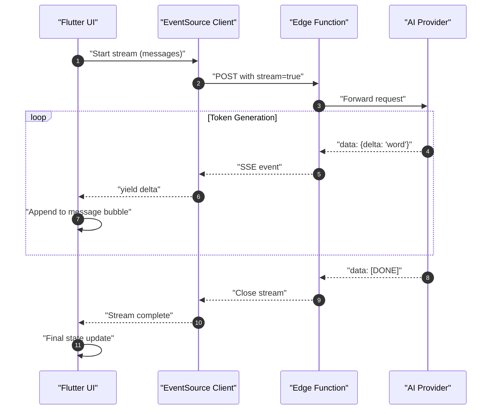

AI provider switching flexibility
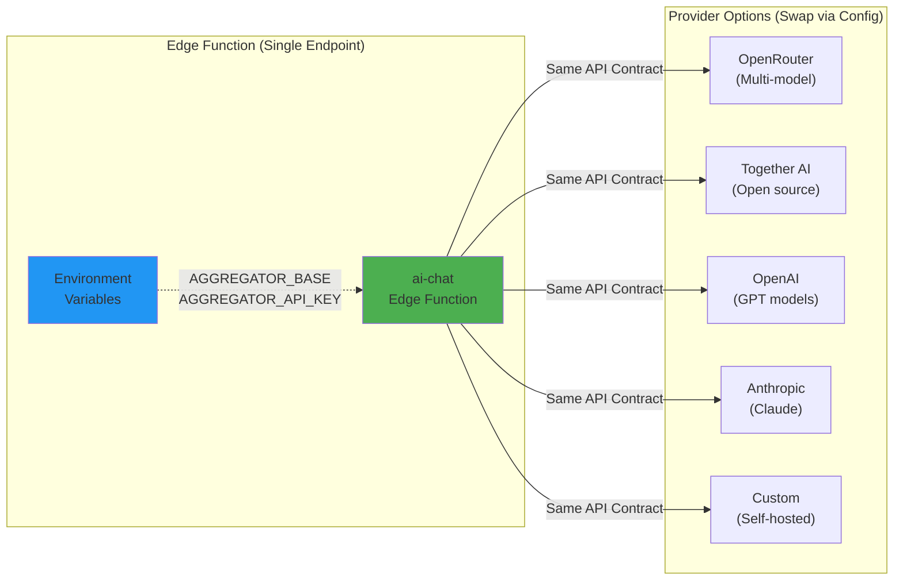

Deep-dive links
- [OpenAI](#glossary)-compatible streaming: https://platform.openai.com/docs/api-reference/streaming
- OpenRouter docs: https://openrouter.ai/docs
- [Supabase](#glossary) [Edge Functions](#glossary): https://supabase.com/docs/guides/functions

Section 6 — Putting data to work: preferences → better prompts
What you’ll learn
- Use stored preferences (diet, allergies, goals) to condition the system prompt.
- Keep prompts deterministic and short.

Prompt pattern
```mermaid
sequenceDiagram
  autonumber
  participant F as Flutter
  participant DB as "Postgres (prefs)"
  participant EF as "Edge Fn"
  F->>DB: "select preferences for current user"
  DB-->>F: "diet=vegan; allergies=[peanut]"
  F->>EF: "messages = [system: 'You are a food coach...(diet=vegan, avoid=peanut)', user: '...']"
  EF-->>F: "SSE stream → personalized plan"
```

System prompt template (example)
- "You are a food coach. Always respect allergies: {allergies}. Tailor to {diet} diet. Provide shopping list and prep steps. Use metric units."

Personalization workflow
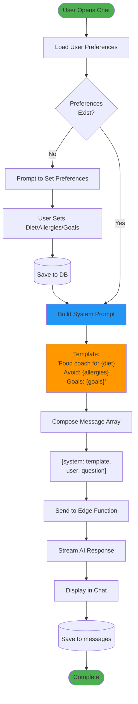

Section 7 — iOS + Android specifics: smooth launch
What you'll learn
- Configure redirect URIs and review-time requirements.
- Build and run on device; handle entitlements and signing.

iOS
- Xcode 15+, iOS 13+ baseline.
- Add [URL scheme](#glossary): io.supabase.flutter; authCallbackUrlHostname: login-callback.
- Sign in with Apple capability if you offer other providers.
- Test real device for [OAuth](#glossary) flows (simulator sometimes blocks provider apps).

Android
- Android Studio; [minSdk](#glossary) 23+ recommended by [Flutter](#glossary).
- AndroidManifest [intent-filter](#glossary) for [deep link](#glossary) (shown earlier).
- Release signing configs; set appId consistent with [URL scheme](#glossary).

Mobile platform configuration overview
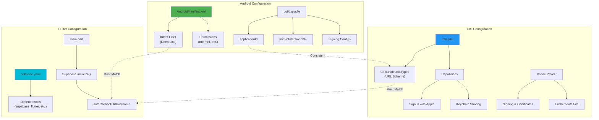

Section 8 — Your “less code” patterns cheat-sheet
What you’ll learn
- Recognize patterns that reduce code and vendor lock-in.

Patterns
- [OpenAI-compatible](#glossary) contract: one request shape for all providers.
- [Edge Function](#glossary) proxy: swap providers via env only.
- [SSE](#glossary)-only UI streaming: single [Stream](#glossary)<String> glue.
- [RLS](#glossary)-first: never send user_id; let DB enforce access.
- Append-only logs: messages and ai_events; [cascade deletes](#glossary).
- [Realtime](#glossary) for "self": subscribe with user_id filter ([RLS](#glossary) will still protect).

Security layers and enforcement points
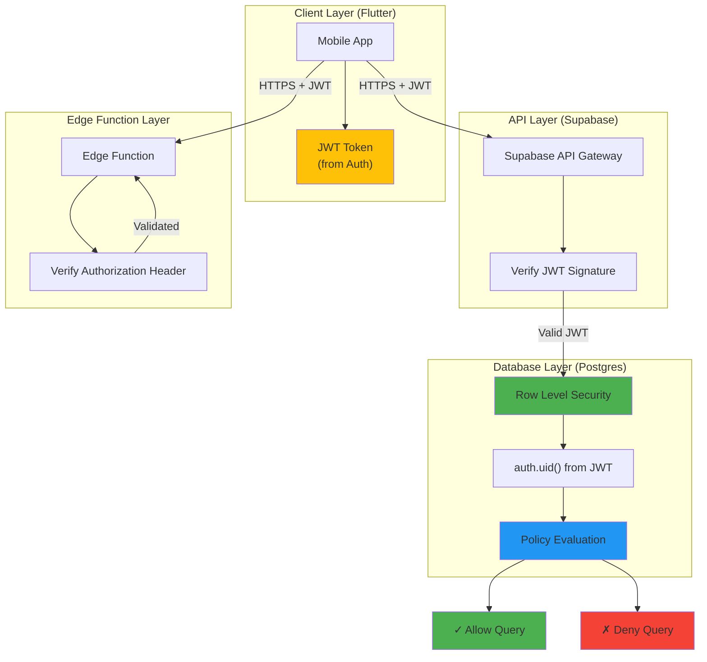

Section 9 — Week-by-week roadmap (5–7 hrs/week, ~9 weeks)
What you'll learn
- How to pace your learning and ship iteratively.

- Week 1: [Flutter](#glossary) fundamentals ([widgets](#glossary)/layout/build/[setState](#glossary)); build static screens.
- Week 2: [Async](#glossary) + state ([Futures](#glossary)/[Streams](#glossary), [Riverpod](#glossary)/[Provider](#glossary)); basic navigation with [go_router](#glossary).
- Week 3: [Supabase](#glossary) project, run SQL schema, enable [RLS](#glossary) + [Realtime](#glossary); Storage for avatars.
- Week 4: Auth end-to-end (Email/Password, Google, Apple); [deep links](#glossary); session guards.
- Week 5: Messages CRUD + [Realtime](#glossary); optimistic UI; multi-session titles.
- Week 6: [Edge Function](#glossary) ai-chat + [SSE](#glossary); error handling; timeouts.
- Week 7: Personalization from preferences; prompt templates; simple meal-plan saver.
- Week 8: iOS/Android polish (icons/splash, entitlements, signing); telemetry and crash reporting.
- Week 9: Hardening ([RLS](#glossary) audits, pagination, input validation, basic rate limits).

Section 10 — Resources (official and practical)
What you’ll learn
- Where to go deeper without getting lost.

- [Flutter](#glossary) docs: https://docs.flutter.dev
- [Flutter](#glossary) codelabs: https://codelabs.developers.google.com/?product=flutter
- [Dart](#glossary) language tour: https://dart.dev/guides/language/language-tour
- [Supabase](#glossary) [Flutter](#glossary) quickstart: https://supabase.com/docs/guides/getting-started/tutorials/with-flutter
- [Supabase](#glossary) Auth providers: https://supabase.com/docs/guides/auth/social-login/auth-google
- [Supabase](#glossary) [Realtime](#glossary): https://supabase.com/docs/guides/realtime
- [Supabase](#glossary) Functions: https://supabase.com/docs/guides/functions
- OpenRouter docs: https://openrouter.ai/docs
- [OAuth](#glossary) + [OIDC](#glossary): https://oauth.net/2/ and https://openid.net/specs/openid-connect-core-1_0.html

Final quiz — Check your understanding
Instructions
- Answer concisely. Mix of multiple-choice and short answer.
- Answer key at the end.

1) Which protocol adds identity on top of [OAuth](#glossary)?
  a) [PKCE](#glossary)  b) [OIDC](#glossary)  c) SAML  d) [JWT](#glossary)

2) In mobile [OAuth](#glossary) with [PKCE](#glossary), which two values are paired?
  a) access_token and refresh_token
  b) code and code_verifier
  c) id_token and nonce
  d) client_id and client_secret

3) Where does [RLS](#glossary) run?
  a) [Flutter](#glossary)  b) [Edge Function](#glossary)  c) [Postgres](#glossary)  d) [Realtime](#glossary) server

4) True/False: Clients should include user_id in writes to user-owned tables.

5) Which flow produces the best streaming UX with least code?
  a) [REST API](#glossary) without streaming  b) [WebSocket](#glossary) custom protocol
  c) [SSE](#glossary) via [OpenAI-compatible API](#glossary)  d) Polling every second

6) If you add Google Sign-In on iOS, which additional option is required by App Store policy?
  a) Facebook  b) Twitter  c) Sign in with Apple  d) GitHub

7) Which is NOT an [OIDC](#glossary) provider out-of-the-box?
  a) Apple  b) Google  c) Instagram (Basic Display)  d) GitHub

8) What does authCallbackUrlHostname configure in supabase_flutter?
  a) [JWT](#glossary) claim name  b) URL path for your DB
  c) [Deep link](#glossary) host in your redirect URI  d) [SSE](#glossary) channel name

9) Name the minimal pieces to stream chat into [Flutter](#glossary) (short answer).

10) With [RLS](#glossary), how does [Postgres](#glossary) know the current user?
  a) From a session variable in [Flutter](#glossary)
  b) From [JWT](#glossary) attached to the DB request
  c) From a cookie set by [Edge Functions](#glossary)
  d) It guesses based on IP

11) Where do you swap model providers without changing the app?
  a) [Flutter](#glossary) build.gradle  b) [Edge Function](#glossary) env vars
  c) [Realtime](#glossary) config  d) [Postgres](#glossary) GUCs

12) What's the benefit of using an [OpenAI-compatible API](#glossary) surface? (short answer)

13) Which statement is true about [Realtime](#glossary) + [RLS](#glossary)?
  a) [Realtime](#glossary) bypasses [RLS](#glossary)
  b) [Realtime](#glossary) respects [RLS](#glossary) filters per subscription
  c) [RLS](#glossary) only applies to inserts
  d) [RLS](#glossary) only applies on weekdays

14) What's the default place to store [Supabase](#glossary) sessions on mobile?
  a) SharedPreferences only
  b) Secure storage via supabase_flutter
  c) Plain text file
  d) Nowhere

15) Order the chat flow steps:
  (i) Insert user message → (ii) Call [Edge Fn](#glossary) ([SSE](#glossary)) → (iii) Render tokens → (iv) Insert assistant message

16) Short answer: Why avoid sending user_id from the client on inserts?

17) Which navigation solution is used in the sample?
  a) Navigator 1.0  b) [go_router](#glossary)  c) Beamer  d) AutoRoute

18) How do you ensure [deep links](#glossary) work on Android for [OAuth](#glossary) callbacks?
  a) Add [intent-filter](#glossary) with scheme + host  b) Add INTERNET permission only
  c) Use Firebase Dynamic Links  d) None required

19) What's a safe way to support multiple providers and keep code minimal?
  a) Hardcode endpoints in [Flutter](#glossary)
  b) Use an [Edge Function](#glossary) proxy with [OpenAI-compatible](#glossary) contract
  c) Call providers directly from [Flutter](#glossary) with their SDKs
  d) Build your own gateway in [Flutter](#glossary)

20) Bonus: Name two personalization fields you'd persist for a food coach and how they influence the prompt.

## Glossary

### A

**Aggregator**: A service that provides a unified API interface to multiple AI model providers, allowing switching between providers without code changes. Examples include OpenRouter and Together AI.

**Anon Key**: The public, anonymous API key for Supabase that allows unauthenticated requests. Combined with RLS policies, it safely enables client-side database access.

**ASWebAuthenticationSession**: iOS API for performing OAuth authentication flows in a secure browser session, automatically handling cookie isolation and callback redirects.

**Async/Await**: Dart language features for writing asynchronous code that looks synchronous, making it easier to work with Futures and handle asynchronous operations.

**auth.uid()**: PostgreSQL function provided by Supabase that extracts the authenticated user's ID from the JWT token in the current request context.

### B

**Backend-for-Frontend (BFF)**: An architectural pattern where a dedicated backend service acts as a proxy between the frontend and other services, handling concerns like authentication, aggregation, and protocol translation.

### C

**Cascade Delete**: Database constraint that automatically deletes dependent rows when a parent row is deleted (e.g., deleting a user also deletes their messages).

**Custom Tabs**: Android's API for displaying web content in a customizable browser tab within an app, used for OAuth flows.

### D

**Dart**: The programming language used by Flutter, featuring strong typing, null safety, and excellent async/await support.

**Deep Link**: A URL scheme that opens a specific screen or performs an action within a mobile app, used for OAuth callbacks.

**Deno**: A modern JavaScript/TypeScript runtime that powers Supabase Edge Functions, providing secure execution with built-in TypeScript support.

### E

**Edge Functions**: Serverless functions that run close to users on Supabase's global edge network, written in TypeScript and executed by Deno.

**EventSource**: Web API for receiving server-sent events (SSE) over HTTP, enabling real-time streaming of data from server to client.

### F

**Flutter**: Google's open-source UI framework for building natively compiled applications for mobile, web, and desktop from a single codebase using Dart.

**Future**: Dart's representation of a value or error that will be available at some point in the future, used for asynchronous operations.

### G

**GenAI**: Generative Artificial Intelligence - AI systems capable of generating new content (text, images, code) based on training data and prompts.

**go_router**: A declarative routing package for Flutter that provides type-safe navigation, deep linking support, and route guards.

**GoTrue**: Supabase's authentication service, handling user signup, login, JWT generation, and OAuth provider integration.

### H

**HTTPS**: Hypertext Transfer Protocol Secure - encrypted HTTP protocol used for secure communication between client and server.

### I

**Intent Filter**: Android manifest declaration that specifies which URLs or actions an app can handle, enabling deep linking.

### J

**JWT (JSON Web Token)**: A compact, URL-safe token format for securely transmitting information between parties. Supabase uses JWTs for authentication, encoding user identity and permissions.

### L

**LLM (Large Language Model)**: AI models trained on vast amounts of text data, capable of understanding and generating human-like text (e.g., GPT, Llama, Claude).

### M

**Mermaid**: A markdown-based diagramming and charting tool that renders text definitions into diagrams, widely used in documentation.

**minSdk**: Android's minimum SDK version required to run an app, defining the oldest Android version supported.

### O

**OAuth (Open Authorization)**: An open standard protocol for delegated authorization, allowing apps to access user resources without exposing credentials.

**OIDC (OpenID Connect)**: Identity layer built on top of OAuth 2.0, providing standardized user authentication and profile information.

**OpenAI-compatible API**: API interface that follows OpenAI's chat completions specification, allowing interchangeable use of different AI providers.

### P

**PKCE (Proof Key for Code Exchange)**: OAuth extension that secures the authorization code flow for mobile and public clients by using dynamically generated code verifiers.

**Postgres/PostgreSQL**: Open-source relational database system, used by Supabase with extensions for RLS, real-time, and auth integration.

**Provider (Flutter)**: State management solution in Flutter for dependency injection and reactive state updates across the widget tree.

### R

**Realtime**: Supabase feature that broadcasts database changes (inserts, updates, deletes) to subscribed clients via WebSocket connections.

**REST API**: Representational State Transfer - architectural style for APIs using HTTP methods (GET, POST, PUT, DELETE) for CRUD operations.

**Riverpod**: Modern Flutter state management library, successor to Provider, offering compile-time safety and better testing support.

**RLS (Row Level Security)**: PostgreSQL feature that enforces row-level access control policies, ensuring users can only access data they own or have permission to see.

### S

**setState**: Flutter method to notify the framework that internal state has changed, triggering a widget rebuild.

**SSE (Server-Sent Events)**: HTTP-based protocol for servers to push real-time updates to clients over a single long-lived connection, ideal for streaming AI responses.

**Stream**: Dart's asynchronous data sequence that emits multiple values over time, used for handling continuous data flows like SSE.

**Supabase**: Open-source Firebase alternative providing authentication, database (PostgreSQL), real-time subscriptions, storage, and edge functions.

### T

**TypeScript**: Typed superset of JavaScript that compiles to plain JavaScript, used for writing Supabase Edge Functions.

### U

**URL Scheme**: Custom protocol identifier (e.g., `myapp://`) that allows apps to be opened via URLs, essential for OAuth callback handling.

### W

**WebSocket**: Protocol providing full-duplex communication channels over a single TCP connection, used by Supabase Realtime for push notifications.

**Widget**: Fundamental building block in Flutter representing a UI element. Everything in Flutter is a widget, from buttons to entire screens.

**Widget Tree**: Hierarchical structure of widgets in Flutter, representing the complete UI with parent-child relationships defining layout and composition.

Answer key
1) b
2) b
3) c
4) False (let [RLS](#glossary) derive from [JWT](#glossary); you can include it, but design so DB ignores mismatches)
5) c
6) c
7) c
8) c
9) [Flutter](#glossary) [EventSource](#glossary)/[SSE](#glossary) client + [Edge Function](#glossary) passthrough + [OpenAI-compatible](#glossary) provider
10) b
11) b
12) One request shape enables easy provider/model switching and less custom code
13) b
14) b
15) i → ii → iii → iv
16) Prevent tampering; server ([RLS](#glossary)) derives identity from [JWT](#glossary) to enforce ownership
17) b
18) a
19) b
20) Examples: allergies (exclude ingredients), diet (choose allowed recipes), goals (calorie/weight targets)