# Understanding Partition Discovery in Distributed Query Engines: Architectural Evolution and Design Decisions

## Table of Contents
1. [Historical Context: Why Multiple Query Engines Exist](#historical-context)
2. [Fundamental Architectural Concepts](#fundamental-architectural-concepts)
3. [The Metastore Problem: Central vs Distributed Metadata](#the-metastore-problem)
4. [Query Engine Evolution: MapReduce → Spark → Presto/Trino](#query-engine-evolution)
5. [Partition Discovery Mechanisms: Design Tradeoffs](#partition-discovery-mechanisms)
6. [Modern Solutions: Databricks, AWS Glue, Unity Catalog](#modern-solutions)
7. [Conceptual Diagrams](#conceptual-diagrams)
8. [Why Different Technologies Made Different Choices](#why-different-technologies-made-different-choices)
9. [Academic Papers & Research](#academic-papers--research)

---

## Historical Context

### The Big Data Problem (2000s)

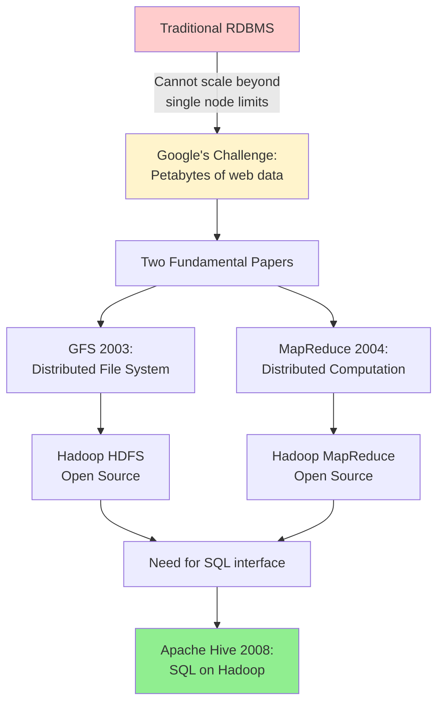

**Why Hive Was Created:**
- Data analysts knew SQL, not Java MapReduce
- Need to query petabytes of log data in HDFS
- Solution: Translate SQL → MapReduce jobs
- Hive Metastore created to manage table schemas/partitions

**The Original Tradeoff:**
- **Gain**: SQL interface, schema management
- **Cost**: Very high latency (minutes to hours)
- **Why acceptable**: Batch analytics workflows, overnight jobs

---

## Fundamental Architectural Concepts

### Shared-Nothing vs Shared-Disk Architecture

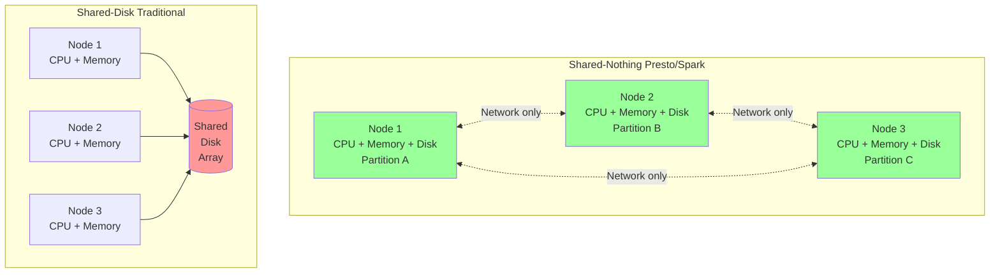

### Key Research: SQL-on-Hadoop Full Circle

**Paper**: Floratou et al. (2014) - *"SQL-on-Hadoop: Full Circle Back to Shared-Nothing Database Architectures"*

**Core Finding**: Shared-nothing parallel databases (like Impala) outperform Hive by 5-20x because:
1. **No MapReduce overhead**: Direct query execution
2. **In-memory pipelining**: No intermediate disk writes
3. **Columnar storage**: Read only needed columns
4. **MPP architecture**: True parallelism without batch job scheduling

**Tradeoff**: 
- **Shared-Nothing**: Scale-out easily, but data must be partitioned correctly
- **Shared-Disk**: Simpler data management, but shared storage becomes bottleneck

---

## The Metastore Problem

### Why Metadata Management is Crucial

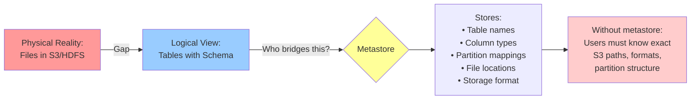

### The Hive Metastore Design Decision

**Original Problem (2008):**
- HDFS has no schema concept (just files)
- Need to track: "table `users` = files at `/warehouse/users/*` with schema (id, name, country)"
- Partitioned table: track each partition separately

**Design Choice: Relational Database Backend**
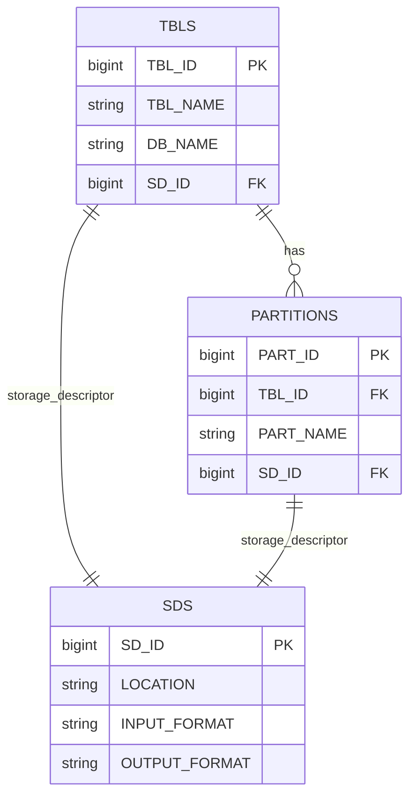

**Why MySQL/PostgreSQL Backend:**
- ACID transactions for metadata updates
- Concurrent access from multiple query engines
- Standard SQL queries to fetch metadata
- Battle-tested reliability

**The Partition Problem:**
- Table with 10,000 partitions = 10,000 rows in PARTITIONS table
- Query: "SELECT * WHERE dt='2025-10-14'" requires:
  1. Query metastore for partition metadata
  2. Get S3 location for that partition
  3. Read only files in that partition (partition pruning)

---

## Query Engine Evolution

### Why Each Engine Was Created

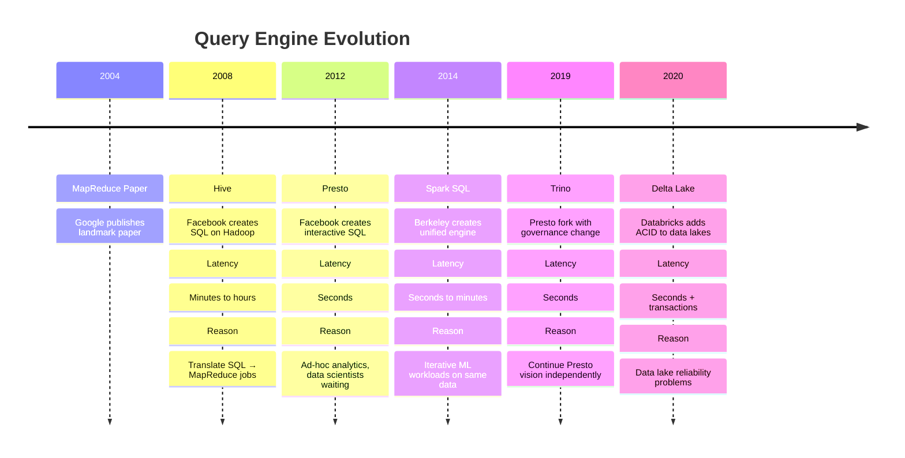

### MapReduce Limitations (Why Spark/Presto Exist)

**Research**: "Apache Spark: A unified engine for big data processing" (Zaharia et al.)

**MapReduce Fundamental Problem:**
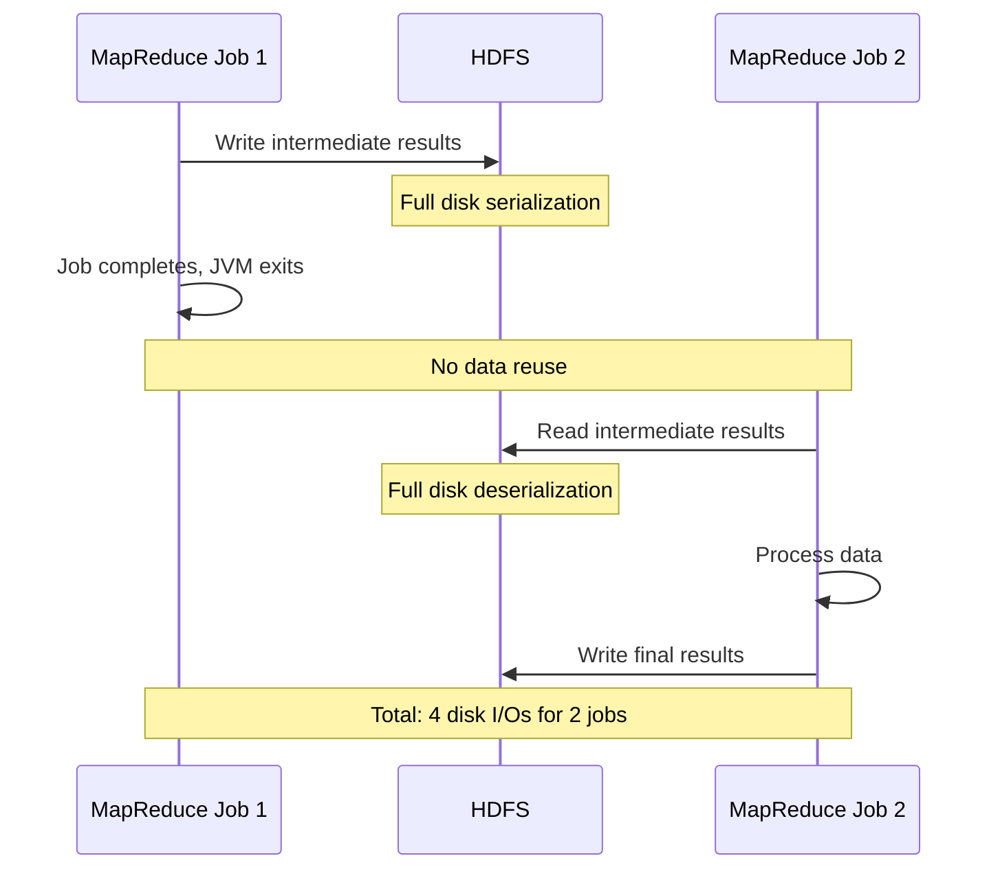

**Why This Fails for:**

1. **Iterative ML Algorithms:**
   - 100 iterations = 200 disk I/Os
   - Each iteration: read full dataset from disk
   - Example: Logistic regression on 100GB data

2. **Interactive Queries:**
   - User waits 30s for MapReduce job to start
   - Then waits for computation
   - Total: 2-3 minutes minimum

3. **Multi-stage Queries:**
   - JOIN requires shuffle (disk write/read)
   - GROUP BY requires shuffle (disk write/read)
   - Each shuffle: minutes of overhead

### Spark's Solution: In-Memory Computation

**Key Innovation: Resilient Distributed Datasets (RDDs)**

```mermaid
graph TB
    subgraph "MapReduce"
        MR1[Read HDFS] --> MR2[Map]
        MR2 --> MR3[Write to Disk]
        MR3 --> MR4[Read from Disk]
        MR4 --> MR5[Reduce]
        MR5 --> MR6[Write to Disk]
    end
    
    subgraph "Spark"
        SP1[Read HDFS] --> SP2[Transformation 1<br/>In Memory]
        SP2 --> SP3[Transformation 2<br/>In Memory]
        SP3 --> SP4[Transformation 3<br/>In Memory]
        SP4 --> SP5[Action: Write Result]
    end
    
    style MR3 fill:#ffcccc
    style MR4 fill:#ffcccc
    style MR6 fill:#ffcccc
    style SP2 fill:#90EE90
    style SP3 fill:#90EE90
    style SP4 fill:#90EE90
```

**Tradeoff:**
- **Gain**: 10-100x faster for iterative workloads
- **Cost**: Higher memory requirements, more complex fault tolerance

### Presto's Solution: MPP SQL Engine

**Research**: "Presto: SQL on Everything" (Sethi et al., 2019)

**Key Design Decision: No Fault Tolerance During Query**

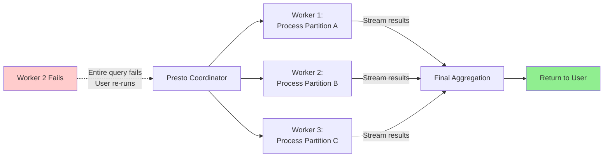

**Why This Design:**
- **Goal**: Sub-second latency for interactive queries
- **Assumption**: Queries are short (seconds), failure probability low
- **Tradeoff**: Re-run failed query vs. complex checkpointing

**Contrast with Spark:**
- Spark: Checkpoint progress, recover from failures (good for long jobs)
- Presto: Fail fast, re-run query (good for short queries)

---

## Partition Discovery Mechanisms

### Why Partition Discovery Matters

**Problem Statement:**
```
S3 Bucket Reality:
s3://bucket/sales/
├── dt=2025-01-01/
│   ├── part-0001.parquet (100MB)
│   └── part-0002.parquet (100MB)
├── dt=2025-01-02/
│   ├── part-0001.parquet (100MB)
│   └── part-0002.parquet (100MB)
└── ... (365 partitions)

Query: SELECT sum(revenue) FROM sales WHERE dt='2025-01-01'

Without partition discovery:
- Scan all 73GB (365 × 200MB)
- Runtime: 5 minutes

With partition discovery:
- Scan only 200MB (1 partition)
- Runtime: 2 seconds
```

### Three Approaches to Partition Discovery

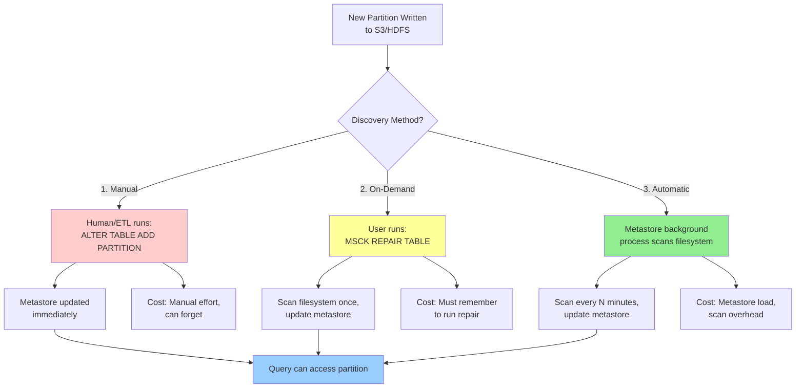

### Research: Metadata Management at Scale

**Paper**: "SingularFS: A Billion-Scale Distributed File System Using a Single Metadata Server" (Guo et al., 2023)

**Key Finding**: Even with billions of files, a single optimized metadata server can handle:
- 1M+ metadata ops/second
- Sub-millisecond latency

**Implications for Partition Discovery:**
- Metastore is rarely the bottleneck (filesystem scan is)
- Scanning S3 for partitions is expensive: LIST operations
- S3 LIST: ~5,000 keys/request, costs money

**Design Tradeoff:**
```
Automatic Discovery Frequency:
- Every 1 minute: Low latency, high cost (LIST calls)
- Every 10 minutes: Medium latency, medium cost
- Manual/On-demand: No background cost, human overhead
```

### Spark's Direct Read Partition Discovery

**Different Philosophy: Bypass Metastore**

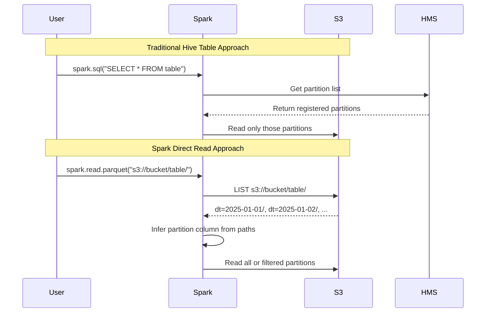

**Why This Exists:**
- **Use Case**: Data science exploration, no predefined schema
- **Advantage**: No metastore dependency, discover partitions automatically
- **Disadvantage**: Slower (must LIST S3), no partition metadata caching

**Configuration:**
```python
# Infer partition column types
spark.conf.set("spark.sql.sources.partitionColumnTypeInference.enabled", "true")

# For nested partitions
df = spark.read.option("basePath", "s3://bucket/table/").parquet("s3://bucket/table/country=US/")
# Without basePath: "country" not recognized as partition
# With basePath: "country" correctly inferred
```

---

## Modern Solutions

### AWS Glue Catalog vs Hive Metastore

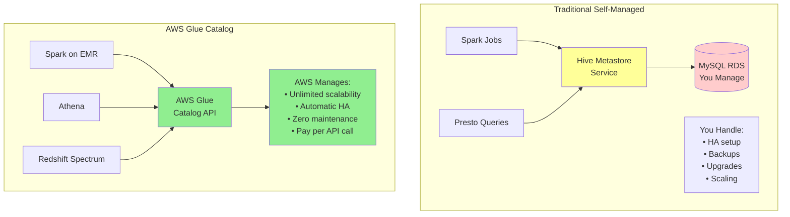

**Research**: AWS Lake Formation integration (2023)

**Key Innovation**: Glue can now manage external Hive Metastore resources
- Import existing HMS tables into Glue
- Unified catalog across HMS + Glue
- Gradual migration path

**Tradeoff Analysis:**

| Aspect | Self-Managed HMS | AWS Glue Catalog |
|--------|------------------|------------------|
| **Cost** | EC2 + RDS monthly | Per-request pricing ($1/million) |
| **Ops Burden** | High (HA, backups, scaling) | Zero |
| **Vendor Lock-in** | None | AWS-specific |
| **Multi-Region** | Complex setup | Built-in |
| **Partition Auto-Discovery** | Manual config | Built-in Glue Crawlers |
| **Fine-grained Permissions** | External system needed | Lake Formation integration |

### Databricks Delta Lake

**Research**: "Delta Lake: High-Performance ACID Table Storage over Cloud Object Stores" (Armbrust et al., 2020 VLDB)

**Core Problem Delta Solves:**
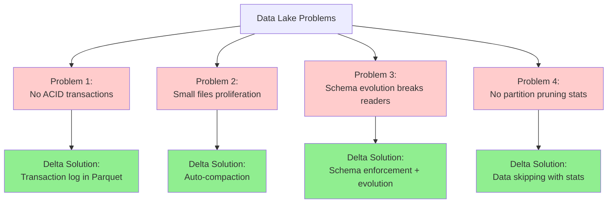

**Partition Discovery in Delta Lake:**
```
Traditional Hive:
s3://bucket/table/
├── dt=2025-01-01/
│   └── data.parquet
└── _SUCCESS (empty marker file)

Delta Lake:
s3://bucket/table/
├── _delta_log/
│   ├── 00000000000000000000.json (transaction 0)
│   ├── 00000000000000000001.json (transaction 1)
│   └── 00000000000000000002.json (transaction 2)
└── dt=2025-01-01/
    └── part-00000-xxxxx.snappy.parquet

Transaction log entry:
{
  "add": {
    "path": "dt=2025-01-01/part-00000.parquet",
    "partitionValues": {"dt": "2025-01-01"},
    "size": 1234567,
    "stats": "{\"numRecords\":1000,\"minValues\":{...},\"maxValues\":{...}}"
  }
}
```

**Why This Matters for Partition Discovery:**
1. **No MSCK REPAIR needed**: Transaction log is source of truth
2. **Atomic partition adds**: ACID guarantees
3. **Data skipping**: Statistics enable pruning within partitions
4. **Time travel**: Query historical partitions

**Tradeoff:**
- **Gain**: Reliability, performance, ACID
- **Cost**: Delta Lake format (not standard Parquet), vendor lock-in

---

## Conceptual Diagrams

### Complete Partition Discovery Flow

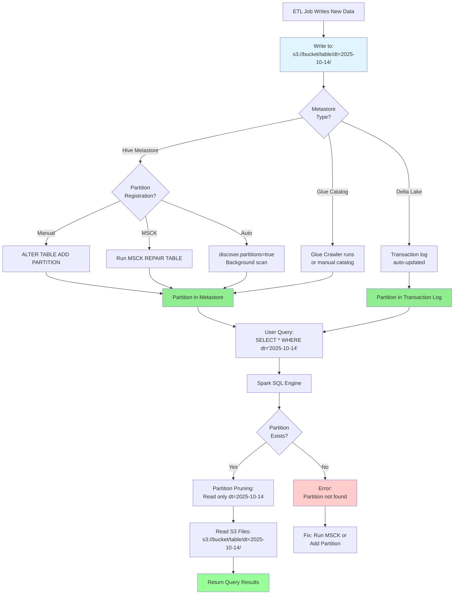

### Query Engine Architecture Comparison

```mermaid
graph TB
    subgraph "Hive on MapReduce (2008)"
        H1[SQL Query] --> H2[Parse to AST]
        H2 --> H3[Optimize Plan]
        H3 --> H4[Generate MapReduce Jobs]
        H4 --> H5[Submit to YARN]
        H5 --> H6[Map Tasks Read HDFS]
        H6 --> H7[Shuffle to Disk]
        H7 --> H8[Reduce Tasks]
        H8 --> H9[Write Results]
        
        H_TIME[Total: 2-10 minutes]
    end
    
    subgraph "Spark SQL (2014)"
        S1[SQL Query] --> S2[Parse to Logical Plan]
        S2 --> S3[Catalyst Optimizer]
        S3 --> S4[Physical Plan]
        S4 --> S5[Tungsten Code Gen]
        S5 --> S6[Execute in Memory]
        S6 --> S7[Pipeline Stages]
        S7 --> S8[Return Results]
        
        S_TIME[Total: 5-60 seconds]
    end
    
    subgraph "Presto/Trino (2012)"
        P1[SQL Query] --> P2[Parse + Plan]
        P2 --> P3[Distributed Plan]
        P3 --> P4[Workers Stream Data]
        P4 --> P5[Pipelined Execution]
        P5 --> P6[Return Results]
        
        P_TIME[Total: 1-10 seconds]
    end
    
    style H7 fill:#ffcccc
    style H9 fill:#ffcccc
    style S6 fill:#90EE90
    style P4 fill:#90EE90
```

### Partition Pruning at Query Time

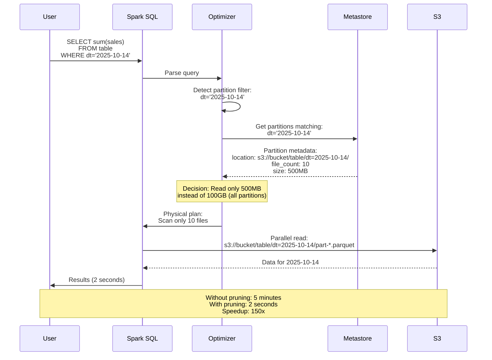

---

## Why Different Technologies Made Different Choices

### Decision Matrix

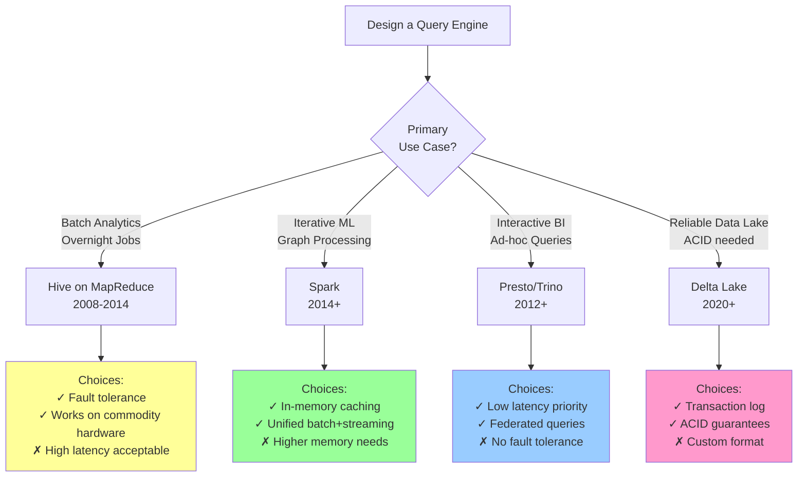

### The Metastore Centralization Debate

**Research**: "Progressive Optimization in a Shared-Nothing Parallel Database" (Han et al., 2007)

**Two Philosophies:**

**Centralized Metadata (Hive Metastore, Glue Catalog):**
```
Pros:
✓ Single source of truth
✓ ACID updates to metadata
✓ Multi-engine compatibility (Spark, Presto, Hive all use same metastore)
✓ Access control in one place

Cons:
✗ Single point of failure (mitigated with HA)
✗ Potential bottleneck (mitigated with caching)
✗ Network hop for every query
```

**Distributed Metadata (Embedded in Data - Delta Lake):**
```
Pros:
✓ No external dependency
✓ Metadata versioned with data
✓ Scalability (each table has own log)
✓ Atomic updates (filesystem atomicity)

Cons:
✗ Harder to query across tables
✗ Custom format (vendor lock-in)
✗ Discovery harder (must scan transaction logs)
```

**The Industry Trend:**
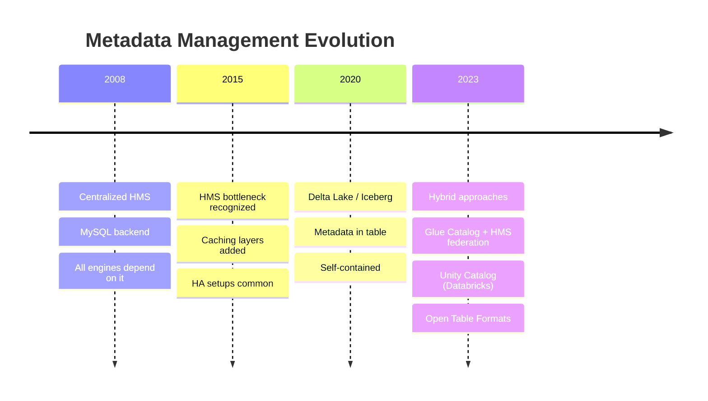

### Partition Discovery: When to Use What

| Scenario | Recommended Approach | Why |
|----------|---------------------|-----|
| **Daily ETL pipeline** | Manual `ADD PARTITION` in ETL script | Deterministic, no surprises |
| **Ad-hoc data drops** | `MSCK REPAIR TABLE` on-demand | Flexibility, run when needed |
| **Streaming ingestion** | Hive auto-discovery (`discover.partitions=true`) | Continuous new partitions |
| **AWS-native stack** | Glue Crawler scheduled | Managed service, auto-discovery |
| **ACID requirements** | Delta Lake (auto in transaction log) | Reliability, no MSCK needed |
| **Data science exploration** | Spark direct read with inference | No schema upfront |
| **Multi-cloud** | Iceberg/Hudi with catalog service | Portability |

---

## Academic Papers & Research

### Foundational Papers

**1. MapReduce: Simplified Data Processing on Large Clusters**
- Authors: Dean & Ghemawat (Google, 2004)
- Link: https://research.google/pubs/pub62/
- **Key Contribution**: Defined batch processing paradigm that influenced all subsequent systems
- **Limitation**: Identified in follow-up research as unsuitable for interactive/iterative workloads

**2. Resilient Distributed Datasets: A Fault-Tolerant Abstraction for In-Memory Cluster Computing**
- Authors: Zaharia et al. (Berkeley, 2012)
- Link: https://www.usenix.org/conference/nsdi12/technical-sessions/presentation/zaharia
- **Key Contribution**: RDD abstraction enabling in-memory computation
- **Impact**: Foundation for Spark, 10-100x speedup over MapReduce

**3. SQL-on-Hadoop: Full Circle Back to Shared-Nothing Database Architectures**
- Authors: Floratou et al. (Microsoft, 2014)
- Link: https://www.microsoft.com/en-us/research/publication/sql-hadoop-full-circle-back-shared-nothing-database-architectures/
- **Key Contribution**: Showed MPP databases (Impala) outperform MapReduce-based Hive
- **Insight**: "We've come full circle back to 1980s parallel database designs"

**4. Presto: SQL on Everything**
- Authors: Sethi et al. (Facebook, 2019)
- Link: https://trino.io/paper.html
- **Key Contribution**: Federated query engine architecture
- **Design Decision**: Fail-fast model for low latency vs. fault tolerance

**5. Delta Lake: High-Performance ACID Table Storage over Cloud Object Stores**
- Authors: Armbrust et al. (Databricks, 2020)
- Link: https://www.researchgate.net/publication/344970177_Delta_lake_high-performance_ACID_table_storage_over_cloud_object_stores
- **Key Contribution**: ACID transactions on S3 via transaction log
- **Impact**: Changed assumption that data lakes can't have ACID properties

### Metadata Management Research

**6. SingularFS: A Billion-Scale Distributed File System Using a Single Metadata Server**
- Authors: Guo et al. (USENIX ATC, 2023)
- Link: https://www.usenix.org/conference/atc23/presentation/guo
- **Key Finding**: Single optimized metadata server can handle billions of files
- **Implication**: Metastore is rarely the bottleneck in partition discovery

**7. Comprehensive and Comprehensible Data Catalogs: The What, Who, Where, When, Why, and How of Metadata Management**
- Authors: Subramaniam et al. (2021)
- Link: https://arxiv.org/abs/2103.07532
- **Key Contribution**: Framework for understanding metadata catalog design (5W1H model)

**8. XFSC: A Catalogue of Trustable Semantic Metadata for Data Services and Providers**
- Authors: Arnold et al. (2025)
- Link: https://arxiv.org/abs/2501.14473
- **Key Contribution**: Federated catalog architecture for multi-cloud

### Query Optimization Research

**9. Progressive Optimization in a Shared-Nothing Parallel Database**
- Authors: Han et al. (IBM, 2007)
- Link: https://research.ibm.com/publications/progressive-optimization-in-a-shared-nothing-parallel-database
- **Key Contribution**: Adaptive query optimization in distributed systems

**10. Benchmarking Distributed Stream Data Processing Systems**
- Authors: Lopez et al. (2018)
- Link: https://arxiv.org/abs/1802.08496
- **Key Contribution**: Comparative evaluation of Spark, Flink, Storm

### Partition Management Research

**11. Handling Data Skew in Multiprocessor Database Computers Using Partition Tuning**
- Authors: Hua & Lee (VLDB, 1991)
- Link: https://www.sigmod.org/publications/dblp/db/conf/vldb/HuaL91.html
- **Key Contribution**: Early work on partition skew problems

**12. AutoComp: Automated Data Compaction for Log-Structured Tables in Data Lakes**
- Authors: Cong et al. (2024)
- Link: https://arxiv.org/abs/2504.04186
- **Key Problem**: Small files proliferation in partitioned tables
- **Solution**: Automatic compaction framework

### Industry Whitepapers

**13. Apache Hive Design Documentation**
- Link: https://hive.apache.org/docs/latest/design_27362072/
- **Coverage**: Metastore architecture, partition management

**14. Apache Spark SQL Programming Guide**
- Link: https://spark.apache.org/docs/latest/sql-programming-guide.html
- **Coverage**: Partition discovery mechanisms, catalog integration

**15. AWS Glue Data Catalog Documentation**
- Link: https://docs.aws.amazon.com/glue/latest/dg/catalog-and-crawler.html
- **Coverage**: Managed metadata catalog, crawler architecture

**16. Databricks Delta Lake Documentation**
- Link: https://docs.databricks.com/delta/index.html
- **Coverage**: Transaction log design, ACID semantics

### Comparative Studies

**17. Evaluating Hive and Spark SQL with BigBench**
- Authors: Poggi et al. (2015)
- Link: https://arxiv.org/abs/1512.08417
- **Key Finding**: Spark SQL 3-5x faster than Hive for TPC-DS workloads

**18. Performance Evaluation of Trino, Spark, and Hive on MR3**
- Authors: MR3 Research (2023)
- Link: https://mr3docs.datamonad.com/blog/2023-05-31-trino-spark-hive-performance-1.7/
- **Key Finding**: Trino best for interactive, Spark best for complex transformations

### AWS-Specific Research

**19. AWS Lake Formation and Glue Catalog Announce Support for Apache Hive Metastore Resources**
- Link: https://aws.amazon.com/about-aws/whats-new/2023/04/aws-lake-formation-glue-catalog-apache-hive-metastore-resources/
- **Coverage**: Hybrid metastore federation

**20. Using Apache Hive Metastore as the Metadata Catalog with Amazon Athena**
- Link: https://aws.amazon.com/about-aws/whats-new/2020/06/use-apache-hive-metastore-metadata-catalog-amazon-athena/
- **Coverage**: Integration patterns

### Conference Proceedings

**21. VLDB (Very Large Data Base) Endowment Archive**
- Link: https://www.vldb.org/pvldb/
- **Relevant Topics**: Partition pruning, metadata management, distributed query processing

**22. ACM SIGMOD Conference Proceedings**
- Link: https://sigmod.org/publications/
- **Relevant Topics**: Query optimization, distributed databases

---

## Key Takeaways

### Why This Complexity Exists

1. **No Universal Solution**: Different workloads need different tradeoffs
2. **Historical Evolution**: Each system built on lessons from predecessors
3. **Storage vs Compute Separation**: Cloud object stores changed game
4. **Scale Requirements**: Techniques that work at GB don't work at PB

### When to Use Each Approach

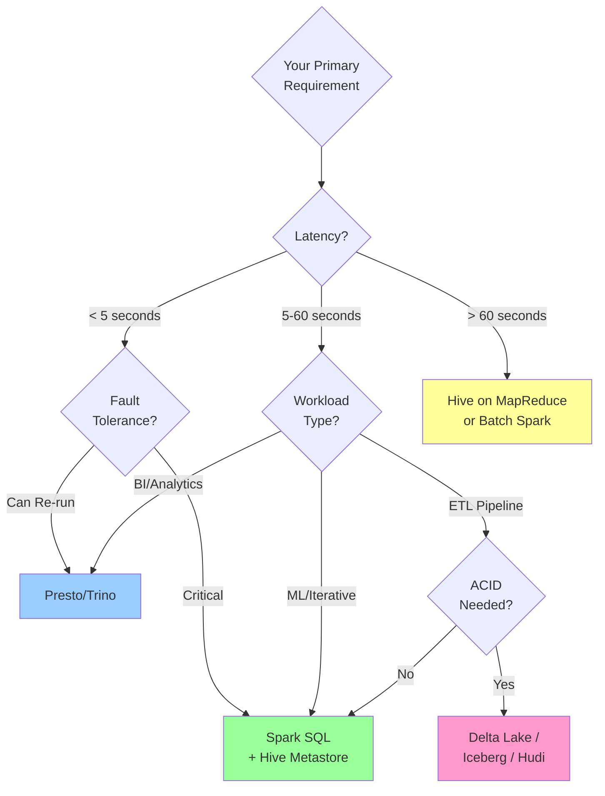

### The Partition Discovery Decision

**Use Manual Registration** when:
- ETL pipelines control all writes
- Partitions added predictably (daily)
- Need deterministic behavior

**Use MSCK REPAIR TABLE** when:
- Ad-hoc data additions
- External processes write data
- Can tolerate discovery lag

**Use Auto-Discovery** when:
- Streaming/continuous ingestion
- Microservices writing independently
- Want hands-off management

**Use Delta Lake/Iceberg** when:
- Need ACID guarantees
- Concurrent writes
- Time travel/audit requirements

---

## Conclusion

The complexity of partition discovery in distributed query engines reflects fundamental tradeoffs:

1. **Performance vs Fault Tolerance** (Presto vs Spark)
2. **Simplicity vs Flexibility** (Centralized HMS vs Distributed logs)
3. **Latency vs Reliability** (Fail-fast vs Checkpointing)
4. **Openness vs Integration** (Open formats vs Vendor ecosystems)

Modern systems are converging on hybrid approaches (Glue+HMS federation, Unity Catalog) that provide best-of-both-worlds solutions.

The key is understanding **why** each system made its choices, so you can select the right tool for your specific requirements.
