# Understanding Partition Discovery in Distributed Query Engines: Architectural Evolution and Design Decisions

## Executive Summary

This comprehensive document traces the architectural evolution of distributed query engines and partition discovery mechanisms from 2000s-era [MapReduce](#glossary) to modern cloud-native solutions. It explores why multiple competing technologies ([Hive](#glossary), [Spark](#glossary), [Presto](#glossary)/[Trino](#glossary), [Delta Lake](#glossary), [Apache Iceberg](#glossary)) emerged to solve different aspects of the same fundamental problem: how to efficiently query petabytes of data stored as files in distributed systems. The core challenge addressed is the **partition discovery problem**—how query engines discover and track which data partitions exist, where they're located, and how to efficiently prune irrelevant data during query execution. Without effective [partition pruning](#glossary), a query filtering for a single day's data might scan an entire year's worth of files, transforming a 2-second query into a 5-minute ordeal.

The document reveals that seemingly competing technologies actually represent different optimization points on fundamental tradeoff curves: **latency versus fault tolerance** ([Presto](#glossary)'s fail-fast model versus [Spark](#glossary)'s checkpointing), **centralized versus distributed metadata** ([Hive Metastore](#glossary) versus [Delta Lake](#glossary)'s transaction log approach), and **standardization versus integration** (open formats versus vendor-optimized ecosystems). Through detailed analysis of academic research—including Google's foundational [MapReduce](#glossary) paper (2004), Berkeley's [RDD](#glossary) abstraction (2012), and Databricks' [Delta Lake](#glossary) ACID implementation (2020)—we trace how each generation of systems learned from predecessors' limitations. The progression from [Hive](#glossary)'s minute-to-hour query latencies to [Presto](#glossary)'s sub-second responses wasn't just engineering improvement; it required fundamentally different architectural choices, including abandoning mid-query fault tolerance to achieve interactive performance.

For practitioners, this document provides a decision framework for selecting appropriate technologies based on workload characteristics. It explains why [AWS Glue Catalog](#glossary) might replace self-managed [Hive Metastore](#glossary) for cloud-native deployments, when [Delta Lake](#glossary)'s transaction log eliminates the need for `MSCK REPAIR TABLE` commands, and how [Apache Iceberg](#glossary)'s hidden partitioning enables schema evolution without breaking queries. The extensive academic references, architectural diagrams, and real-world tradeoff analyses equip readers to understand not just *what* each technology does, but *why* specific design decisions were made and when to apply them. Whether architecting a new data platform or optimizing existing pipelines, understanding these foundational concepts and evolutionary pressures is essential for making informed technology choices in the distributed query engine landscape.

## Table of Contents
1. [Historical Context: Why Multiple Query Engines Exist](#historical-context)
2. [Fundamental Architectural Concepts](#fundamental-architectural-concepts)
3. [The Metastore Problem: Central vs Distributed Metadata](#the-metastore-problem)
4. [Query Engine Evolution: MapReduce → Spark → Presto/Trino](#query-engine-evolution)
5. [Partition Discovery Mechanisms: Design Tradeoffs](#partition-discovery-mechanisms)
6. [Modern Solutions: Databricks, AWS Glue, Unity Catalog](#modern-solutions)
7. [Conceptual Diagrams](#conceptual-diagrams)
8. [Why Different Technologies Made Different Choices](#why-different-technologies-made-different-choices)
9. [Academic Papers & Research](#academic-papers--research)
10. [Glossary](#glossary)

---

## Historical Context

### The Big Data Problem (2000s)

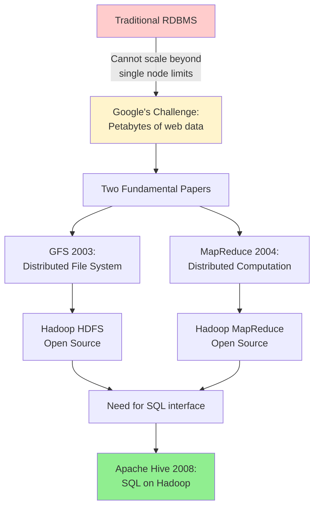

**Why [Hive](#glossary) Was Created:**
- Data analysts knew SQL, not Java [MapReduce](#glossary)
- Need to query petabytes of log data in [HDFS](#glossary)
- Solution: Translate SQL → [MapReduce](#glossary) jobs
- [Hive Metastore](#glossary) created to manage table schemas/[partitions](#glossary)

**The Original Tradeoff:**
- **Gain**: SQL interface, schema management
- **Cost**: Very high [latency](#glossary) (minutes to hours)
- **Why acceptable**: Batch analytics workflows, overnight jobs

---

## Fundamental Architectural Concepts

### Shared-Nothing vs Shared-Disk Architecture

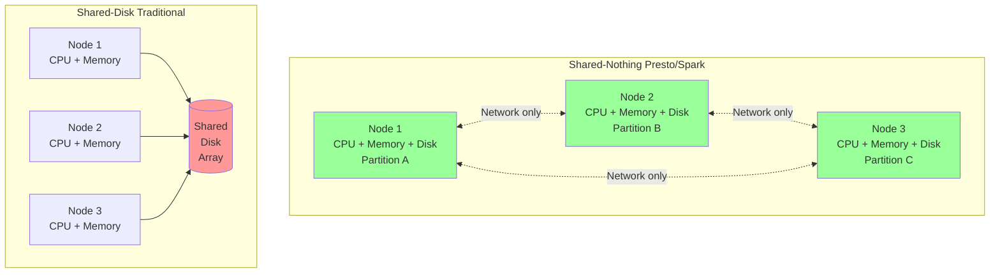

### Key Research: SQL-on-Hadoop Full Circle

**Paper**: Floratou et al. (2014) - *"SQL-on-Hadoop: Full Circle Back to Shared-Nothing Database Architectures"*

**Core Finding**: [Shared-nothing](#glossary) parallel databases (like [Impala](#glossary)) outperform [Hive](#glossary) by 5-20x because:
1. **No [MapReduce](#glossary) overhead**: Direct query execution
2. **In-memory pipelining**: No intermediate disk writes
3. **[Columnar storage](#glossary)**: Read only needed columns
4. **[MPP](#glossary) architecture**: True parallelism without batch job scheduling

**Tradeoff**:
- **[Shared-Nothing Architecture](#glossary)**: Scale-out easily, but data must be [partitioned](#glossary) correctly
- **Shared-Disk**: Simpler data management, but shared storage becomes bottleneck

---

## The Metastore Problem

### Why Metadata Management is Crucial

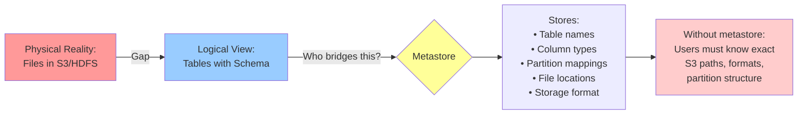

### The Hive Metastore Design Decision

**Original Problem (2008):**
- [HDFS](#glossary) has no schema concept (just files)
- Need to track: "table `users` = files at `/warehouse/users/*` with schema (id, name, country)"
- [Partitioned](#glossary) table: track each [partition](#glossary) separately

**Design Choice: Relational Database Backend**
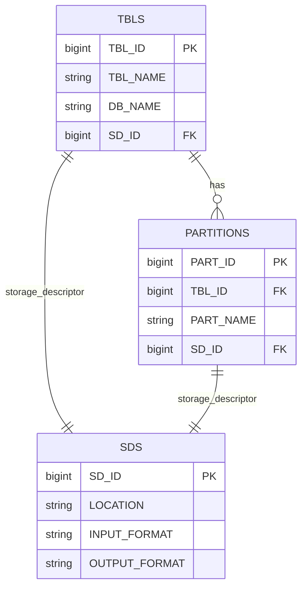

**Why MySQL/PostgreSQL Backend:**
- [ACID](#glossary) transactions for metadata updates
- Concurrent access from multiple [query engines](#glossary)
- Standard SQL queries to fetch metadata
- Battle-tested reliability

### Hive Metastore Architecture

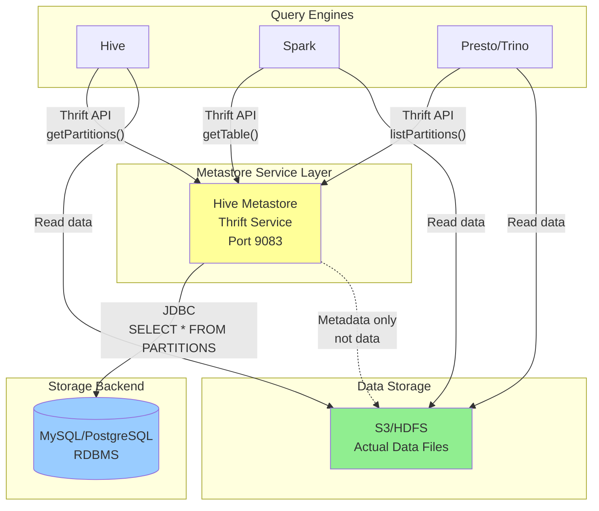

**The [Partition](#glossary) Problem:**
- Table with 10,000 [partitions](#glossary) = 10,000 rows in PARTITIONS table
- Query: "SELECT * WHERE dt='2025-10-14'" requires:
  1. Query [metastore](#glossary) for [partition](#glossary) metadata
  2. Get [S3](#glossary) location for that [partition](#glossary)
  3. Read only files in that [partition](#glossary) ([partition pruning](#glossary))

---

## Query Engine Evolution

### Why Each Engine Was Created

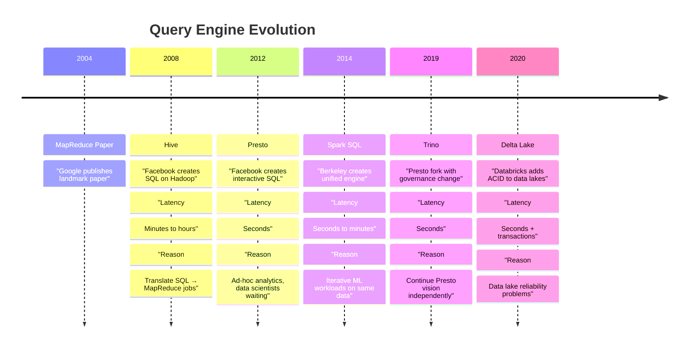

### MapReduce Limitations (Why Spark/Presto Exist)

**Research**: "Apache Spark: A unified engine for big data processing" (Zaharia et al.)

**MapReduce Fundamental Problem:**
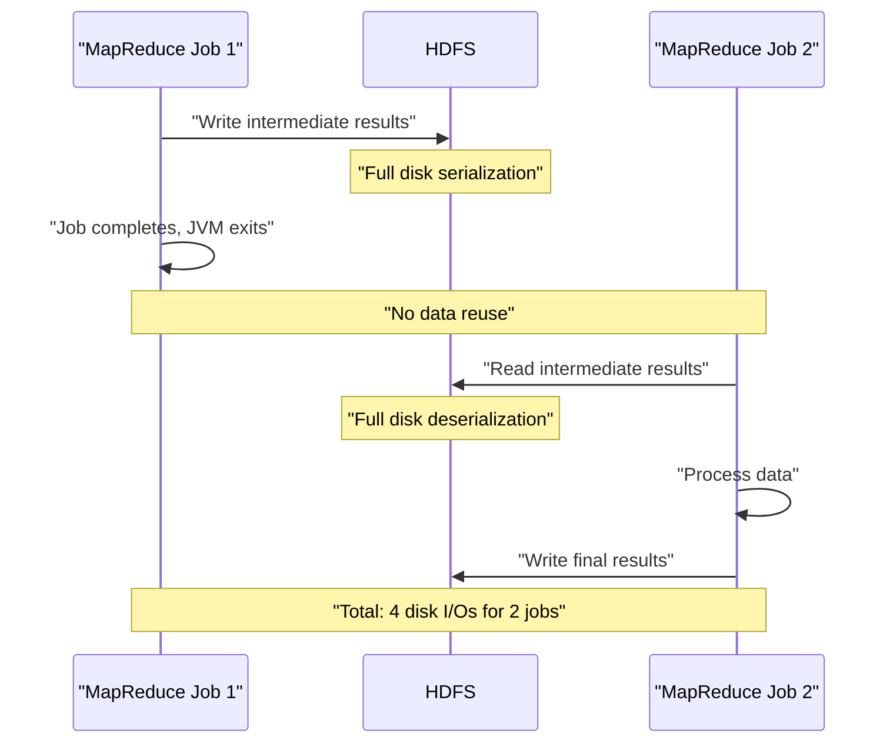

**Why This Fails for:**

1. **Iterative ML Algorithms:**
   - 100 iterations = 200 disk I/Os
   - Each iteration: read full dataset from disk
   - Example: Logistic regression on 100GB data

2. **Interactive Queries:**
   - User waits 30s for [MapReduce](#glossary) job to start
   - Then waits for computation
   - Total: 2-3 minutes minimum

3. **Multi-stage Queries:**
   - JOIN requires [shuffle](#glossary) (disk write/read)
   - GROUP BY requires [shuffle](#glossary) (disk write/read)
   - Each [shuffle](#glossary): minutes of overhead

### [Spark](#glossary)'s Solution: In-Memory Computation

**Key Innovation: [Resilient Distributed Datasets (RDDs)](#glossary)**

```mermaid
graph TB
    subgraph MR["MapReduce"]
        MR1["Read HDFS"] --> MR2["Map"]
        MR2 --> MR3["Write to Disk"]
        MR3 --> MR4["Read from Disk"]
        MR4 --> MR5["Reduce"]
        MR5 --> MR6["Write to Disk"]
    end

    subgraph SP["Spark"]
        SP1["Read HDFS"] --> SP2["Transformation 1<br/>In Memory"]
        SP2 --> SP3["Transformation 2<br/>In Memory"]
        SP3 --> SP4["Transformation 3<br/>In Memory"]
        SP4 --> SP5["Action: Write Result"]
    end

    style MR3 fill:#ffcccc
    style MR4 fill:#ffcccc
    style MR6 fill:#ffcccc
    style SP2 fill:#90EE90
    style SP3 fill:#90EE90
    style SP4 fill:#90EE90
```

**Tradeoff:**
- **Gain**: 10-100x faster for iterative workloads
- **Cost**: Higher memory requirements, more complex [fault tolerance](#glossary)

### [Presto](#glossary)'s Solution: [MPP](#glossary) SQL Engine

**Research**: "Presto: SQL on Everything" (Sethi et al., 2019)

**Key Design Decision: No Fault Tolerance During Query**

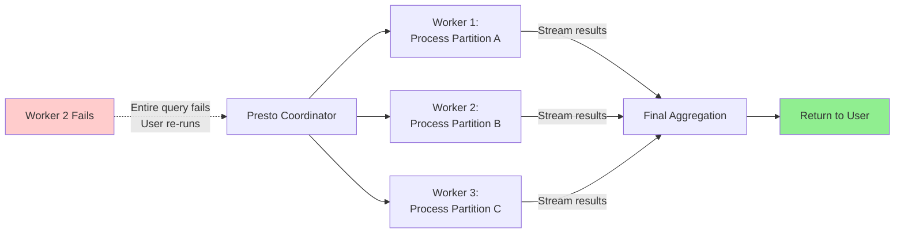

**Why This Design:**
- **Goal**: Sub-second [latency](#glossary) for interactive queries
- **Assumption**: Queries are short (seconds), failure probability low
- **Tradeoff**: Re-run failed query vs. complex checkpointing

**Contrast with [Spark](#glossary):**
- [Spark](#glossary): Checkpoint progress, recover from failures (good for long jobs)
- [Presto](#glossary): Fail fast, re-run query (good for short queries)

---

## Partition Discovery Mechanisms

### Why [Partition Discovery](#glossary) Matters

**Problem Statement:**
```
S3 Bucket Reality:
s3://bucket/sales/
├── dt=2025-01-01/
│   ├── part-0001.parquet (100MB)
│   └── part-0002.parquet (100MB)
├── dt=2025-01-02/
│   ├── part-0001.parquet (100MB)
│   └── part-0002.parquet (100MB)
└── ... (365 partitions)

Query: SELECT sum(revenue) FROM sales WHERE dt='2025-01-01'

Without [partition discovery](#glossary):
- Scan all 73GB (365 × 200MB)
- Runtime: 5 minutes

With [partition discovery](#glossary):
- Scan only 200MB (1 [partition](#glossary))
- Runtime: 2 seconds
```

### Three Approaches to Partition Discovery

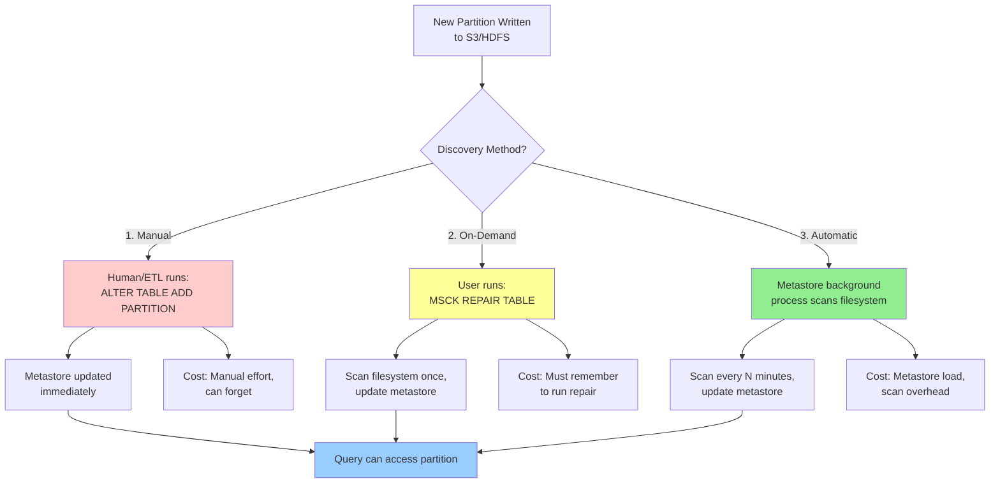

### Research: Metadata Management at Scale

**Paper**: "SingularFS: A Billion-Scale Distributed File System Using a Single Metadata Server" (Guo et al., 2023)

**Key Finding**: Even with billions of files, a single optimized metadata server can handle:
- 1M+ metadata ops/second
- Sub-millisecond [latency](#glossary)

**Implications for [Partition Discovery](#glossary):**
- [Metastore](#glossary) is rarely the bottleneck (filesystem scan is)
- Scanning [S3](#glossary) for [partitions](#glossary) is expensive: [LIST operations](#glossary)
- [S3 LIST](#glossary): ~5,000 keys/request, costs money

**Design Tradeoff:**
```
Automatic Discovery Frequency:
- Every 1 minute: Low latency, high cost (LIST calls)
- Every 10 minutes: Medium latency, medium cost
- Manual/On-demand: No background cost, human overhead
```

### Spark's Direct Read Partition Discovery

**Different Philosophy: Bypass Metastore**

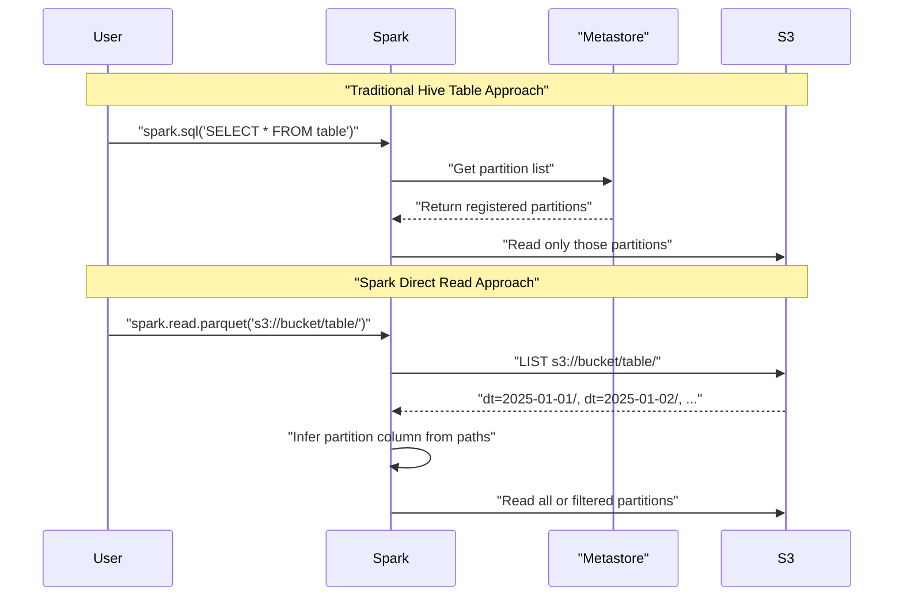

**Why This Exists:**
- **Use Case**: [Data science](#glossary) exploration, no predefined schema
- **Advantage**: No [metastore](#glossary) dependency, discover [partitions](#glossary) automatically
- **Disadvantage**: Slower (must [LIST S3](#glossary)), no [partition](#glossary) metadata caching

**Configuration:**
```python
# Infer partition column types
spark.conf.set("spark.sql.sources.partitionColumnTypeInference.enabled", "true")

# For nested partitions
df = spark.read.option("basePath", "s3://bucket/table/").parquet("s3://bucket/table/country=US/")
# Without basePath: "country" not recognized as partition
# With basePath: "country" correctly inferred
```

### MSCK REPAIR TABLE Workflow

```mermaid
sequenceDiagram
    participant ETL as "ETL Process"
    participant S3
    participant User
    participant Hive as "Hive/Spark"
    participant HMS as "Metastore DB"

    Note over ETL,HMS: "Data Ingestion Phase"
    ETL->>S3: "Write data:<br/>s3://bucket/sales/dt=2025-01-01/"
    ETL->>S3: "Write data:<br/>s3://bucket/sales/dt=2025-01-02/"
    ETL->>S3: "Write data:<br/>s3://bucket/sales/dt=2025-01-03/"

    Note over ETL,HMS: "Partitions exist in S3<br/>but NOT in metastore"

    Note over ETL,HMS: "Discovery Phase"
    User->>Hive: "MSCK REPAIR TABLE sales"

    Hive->>S3: "LIST s3://bucket/sales/"
    S3-->>Hive: "dt=2025-01-01/<br/>dt=2025-01-02/<br/>dt=2025-01-03/"

    Hive->>Hive: "Parse directory names<br/>Extract partition values"

    Hive->>HMS: "SELECT partitions<br/>FROM metastore"
    HMS-->>Hive: "No partitions found"

    loop For each partition
        Hive->>HMS: "INSERT INTO PARTITIONS<br/>(dt='2025-01-01', location=...)"
        Hive->>HMS: "INSERT INTO PARTITIONS<br/>(dt='2025-01-02', location=...)"
        Hive->>HMS: "INSERT INTO PARTITIONS<br/>(dt='2025-01-03', location=...)"
    end

    HMS-->>Hive: "3 partitions added"
    Hive-->>User: "Partitions not in metastore:<br/>sales:dt=2025-01-01<br/>sales:dt=2025-01-02<br/>sales:dt=2025-01-03<br/>Repair: Added 3 partitions"

    Note over ETL,HMS: "Query Phase (now works)"
    User->>Hive: "SELECT * FROM sales<br/>WHERE dt='2025-01-01'"
    Hive->>HMS: "Get partition location"
    HMS-->>Hive: "s3://bucket/sales/dt=2025-01-01/"
    Hive->>S3: "Read data files"
    S3-->>Hive: "Return data"
    Hive-->>User: "Query results"

    style S3 fill:#90EE90
    style HMS fill:#99ccff
```

**[MSCK REPAIR TABLE](#glossary) Considerations:**

**Advantages:**
- Manual control over when discovery happens
- No background overhead
- Works for batch ingestion patterns
- [Idempotent](#glossary) (safe to run multiple times)

**Disadvantages:**
- Must remember to run after adding [partitions](#glossary)
- Scans entire table directory (slow for large tables)
- Blocks while running (can take minutes)
- [S3 LIST operations](#glossary) cost money at scale

**Alternatives:**
- `ALTER TABLE ADD PARTITION` (manual, faster, specific)
- `discover.partitions=true` ([automatic discovery](#glossary), continuous)
- [Delta Lake](#glossary)/[Iceberg](#glossary) (no MSCK needed)

---

## Modern Solutions

### AWS Glue Catalog vs Hive Metastore

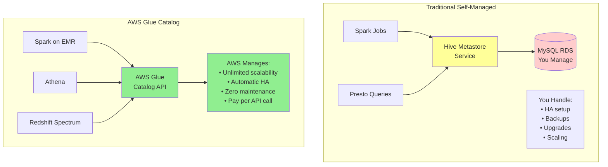

**Research**: AWS Lake Formation integration (2023)

**Key Innovation**: Glue can now manage external Hive Metastore resources
- Import existing HMS tables into Glue
- Unified catalog across HMS + Glue
- Gradual migration path

**Tradeoff Analysis:**

| Aspect | Self-Managed HMS | AWS Glue Catalog |
|--------|------------------|------------------|
| **Cost** | EC2 + RDS monthly | Per-request pricing ($1/million) |
| **Ops Burden** | High (HA, backups, scaling) | Zero |
| **Vendor Lock-in** | None | AWS-specific |
| **Multi-Region** | Complex setup | Built-in |
| **Partition Auto-Discovery** | Manual config | Built-in Glue Crawlers |
| **Fine-grained Permissions** | External system needed | Lake Formation integration |

### AWS Glue Crawler Workflow

```mermaid
sequenceDiagram
    participant S3
    participant Crawler as "Glue Crawler"
    participant Classifier as "Built-in Classifiers"
    participant Catalog as "Glue Data Catalog"
    participant Athena

    Note over S3,Catalog: "Scheduled Crawler Run (e.g., daily at 2am)"

    Crawler->>S3: "LIST s3://bucket/datalake/"
    S3-->>Crawler: "sales/, customers/, orders/"

    loop For each table path
        Crawler->>S3: "Sample files from sales/"
        S3-->>Crawler: "part-00001.parquet, part-00002.parquet"

        Crawler->>Classifier: "Infer schema from Parquet"
        Classifier-->>Crawler: "Schema: id:bigint, name:string, amount:double"

        Crawler->>S3: "Detect partitions: dt=2025-01-01/, dt=2025-01-02/"
        S3-->>Crawler: "Found 365 partitions"

        Crawler->>Catalog: "CREATE/UPDATE TABLE sales<br/>with schema + partitions"
    end

    Catalog-->>Crawler: "Catalog updated"

    Note over S3,Catalog: "Now ready to query"

    Athena->>Catalog: "SHOW TABLES"
    Catalog-->>Athena: "sales, customers, orders"

    Athena->>Catalog: "DESCRIBE sales"
    Catalog-->>Athena: "Schema + partition info"

    Athena->>S3: "Query data"

    style Crawler fill:#ffff99
    style Catalog fill:#90EE90
    style Classifier fill:#99ccff
```

**[Glue Crawler](#glossary) Benefits:**
- **Automatic schema inference**: No manual DDL
- **[Partition discovery](#glossary)**: Automatically finds new [partitions](#glossary)
- **[Schema evolution](#glossary) detection**: Updates when schema changes
- **Multi-format support**: [Parquet](#glossary), JSON, CSV, Avro, ORC
- **Built-in scheduling**: Run hourly, daily, weekly, or on-demand
- **Incremental [crawls](#glossary)**: Only scan new/changed data

**When to Use [Glue Crawlers](#glossary):**
- AWS-native [data lake](#glossary) architecture
- Schema not known upfront (exploratory analytics)
- Multiple data formats in same lake
- Want zero-maintenance metadata management
- Acceptable [latency](#glossary) (crawler runs periodically, not real-time)

### Databricks Delta Lake

**Research**: "Delta Lake: High-Performance ACID Table Storage over Cloud Object Stores" (Armbrust et al., 2020 VLDB)

**Core Problem Delta Solves:**
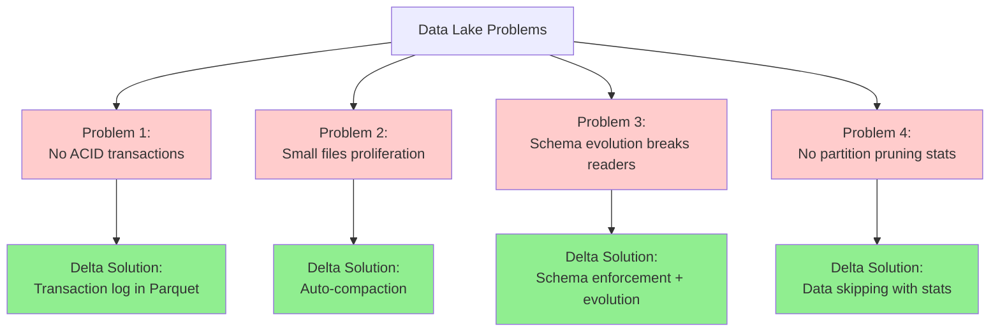

**Partition Discovery in Delta Lake:**
```
Traditional Hive:
s3://bucket/table/
├── dt=2025-01-01/
│   └── data.parquet
└── _SUCCESS (empty marker file)

Delta Lake:
s3://bucket/table/
├── _delta_log/
│   ├── 00000000000000000000.json (transaction 0)
│   ├── 00000000000000000001.json (transaction 1)
│   └── 00000000000000000002.json (transaction 2)
└── dt=2025-01-01/
    └── part-00000-xxxxx.snappy.parquet

Transaction log entry:
{
  "add": {
    "path": "dt=2025-01-01/part-00000.parquet",
    "partitionValues": {"dt": "2025-01-01"},
    "size": 1234567,
    "stats": "{\"numRecords\":1000,\"minValues\":{...},\"maxValues\":{...}}"
  }
}
```

**Why This Matters for [Partition Discovery](#glossary):**
1. **No [MSCK REPAIR](#glossary) needed**: [Transaction log](#glossary) is source of truth
2. **Atomic [partition](#glossary) adds**: [ACID](#glossary) guarantees
3. **[Data skipping](#glossary)**: Statistics enable pruning within [partitions](#glossary)
4. **[Time travel](#glossary)**: Query historical [partitions](#glossary)

**Tradeoff:**
- **Gain**: Reliability, performance, [ACID](#glossary)
- **Cost**: [Delta Lake](#glossary) format (not standard [Parquet](#glossary)), [vendor lock-in](#glossary)

### Apache Iceberg Architecture

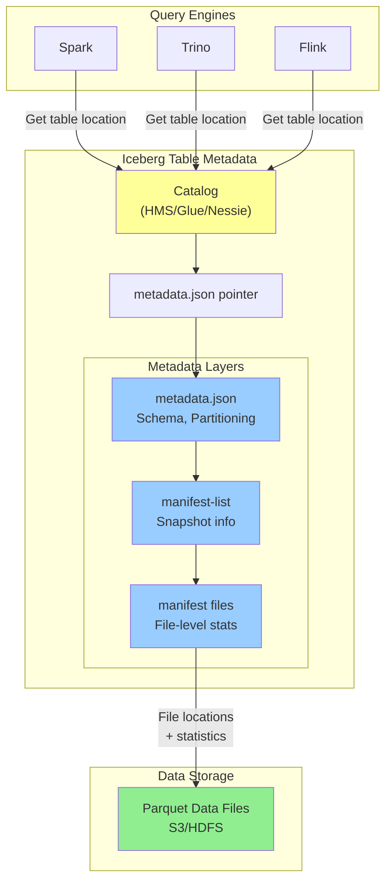

**Key [Iceberg](#glossary) Features:**

1. **[Hidden Partitioning](#glossary)**: [Partition](#glossary) columns not exposed in queries
   - Query: `SELECT * FROM table WHERE date = '2025-01-01'`
   - [Iceberg](#glossary) automatically prunes by year/month/day [partitions](#glossary)
   - No need to change queries when repartitioning

2. **[Time Travel](#glossary)**: Access historical [snapshots](#glossary)
   - Each commit creates new [metadata.json](#glossary)
   - Old [snapshots](#glossary) retained for configurable time
   - Query: `SELECT * FROM table VERSION AS OF 'snapshot-id'`

3. **[Schema Evolution](#glossary)**: Add/drop/rename columns safely
   - Column IDs track fields across schema changes
   - Readers use schema at write time
   - No breaking changes to existing data

**Iceberg vs Delta Lake vs Hive:**

| Feature | Apache Iceberg | Delta Lake | Traditional Hive |
|---------|---------------|------------|------------------|
| **Metadata Storage** | JSON + Avro manifests | Parquet transaction log | RDBMS (MySQL/Postgres) |
| **Hidden Partitioning** | Yes | No | No |
| **Time Travel** | Yes (via snapshots) | Yes (via versions) | No |
| **Multi-Engine** | Excellent (Spark, Trino, Flink) | Good (Spark native, others limited) | Excellent |
| **Partition Evolution** | Yes (automatic) | Manual repartitioning | Manual ALTER TABLE |
| **Schema Evolution** | Column IDs (safe) | Schema enforcement | ALTER TABLE needed |
| **ACID** | Yes | Yes | No (without transactions) |
| **Vendor Neutrality** | Apache Foundation | Databricks (open source) | Apache Foundation |

---

## Conceptual Diagrams

### Complete Partition Discovery Flow

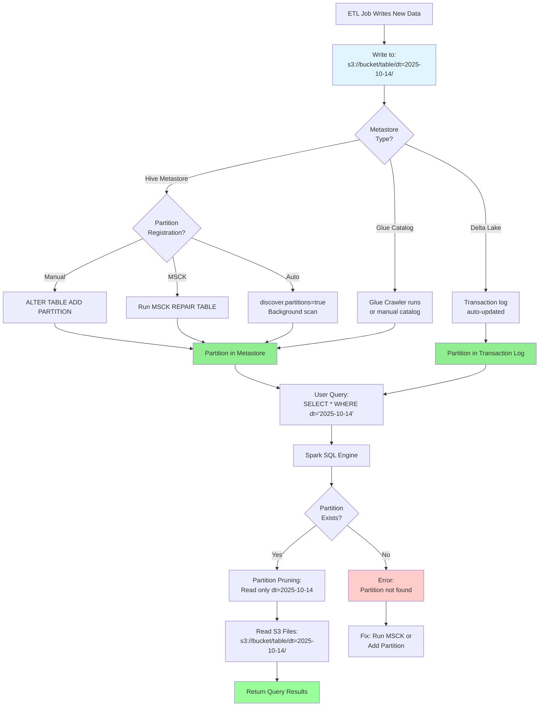

### Query Engine Architecture Comparison

```mermaid
graph TB
    subgraph H["Hive on MapReduce (2008)"]
        H1["SQL Query"] --> H2["Parse to AST"]
        H2 --> H3["Optimize Plan"]
        H3 --> H4["Generate MapReduce Jobs"]
        H4 --> H5["Submit to YARN"]
        H5 --> H6["Map Tasks Read HDFS"]
        H6 --> H7["Shuffle to Disk"]
        H7 --> H8["Reduce Tasks"]
        H8 --> H9["Write Results"]

        H_TIME["Total: 2-10 minutes"]
    end

    subgraph S["Spark SQL (2014)"]
        S1["SQL Query"] --> S2["Parse to Logical Plan"]
        S2 --> S3["Catalyst Optimizer"]
        S3 --> S4["Physical Plan"]
        S4 --> S5["Tungsten Code Gen"]
        S5 --> S6["Execute in Memory"]
        S6 --> S7["Pipeline Stages"]
        S7 --> S8["Return Results"]

        S_TIME["Total: 5-60 seconds"]
    end

    subgraph P["Presto/Trino (2012)"]
        P1["SQL Query"] --> P2["Parse + Plan"]
        P2 --> P3["Distributed Plan"]
        P3 --> P4["Workers Stream Data"]
        P4 --> P5["Pipelined Execution"]
        P5 --> P6["Return Results"]

        P_TIME["Total: 1-10 seconds"]
    end

    style H7 fill:#ffcccc
    style H9 fill:#ffcccc
    style S6 fill:#90EE90
    style P4 fill:#90EE90
```

### Partition Pruning at Query Time

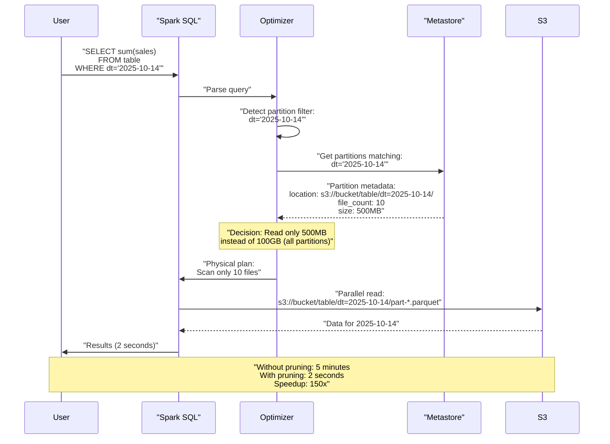

### Partition Pruning with File-Level Statistics

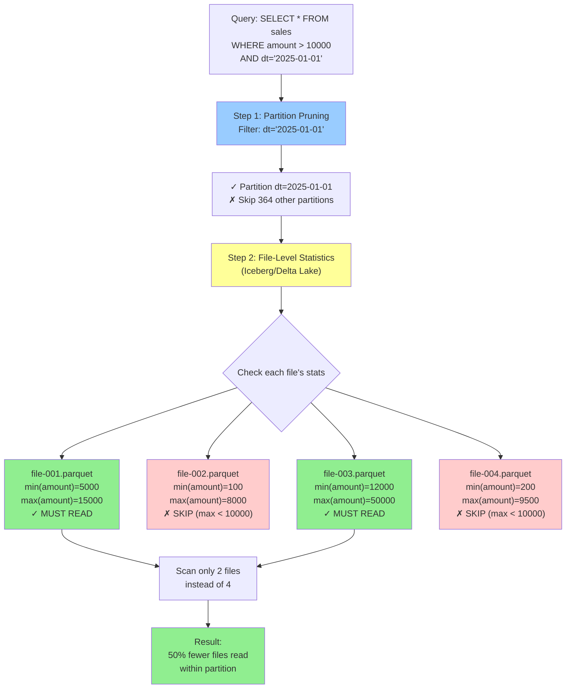

**Data Skipping Effectiveness:**

Traditional Hive (no file stats):
- Partition pruning: 365 partitions → 1 partition
- Must read ALL files in partition: 4 files (2GB)
- Time: 10 seconds

Iceberg/Delta Lake (with file stats):
- Partition pruning: 365 partitions → 1 partition
- File-level pruning: 4 files → 2 files (1GB)
- Time: 5 seconds
- **Additional 50% speedup from statistics**

### Small Files Problem and Compaction

```mermaid
graph TB
    subgraph "Problem: Streaming Writes Create Small Files"
        STREAM["Streaming Job<br/>Writes every 5 minutes"]
        STREAM --> SF1["00:00 → file-001.parquet (10MB)"]
        STREAM --> SF2["00:05 → file-002.parquet (10MB)"]
        STREAM --> SF3["00:10 → file-003.parquet (10MB)"]
        STREAM --> SF4["... 288 files per day ..."]
        STREAM --> SF5["23:55 → file-288.parquet (10MB)"]

        SF_RESULT["Total: 288 small files (2.8GB)"]
    end

    subgraph "Impact on Query Performance"
        QUERY["Query: SELECT * WHERE dt='2025-01-01'"]
        QUERY --> OVERHEAD["Open 288 files<br/>288 HTTP requests to S3<br/>288 × file open overhead<br/>288 × metadata reads"]
        OVERHEAD --> SLOW["Query time: 30 seconds"]
    end

    subgraph "Solution: Compaction"
        COMPACT["Compaction Process<br/>(Delta Lake OPTIMIZE / Iceberg)"]
        COMPACT --> REWRITE["Rewrite 288 files → 3 files"]
        REWRITE --> LF1["file-compacted-001.parquet (1GB)"]
        REWRITE --> LF2["file-compacted-002.parquet (1GB)"]
        REWRITE --> LF3["file-compacted-003.parquet (800MB)"]

        LF_RESULT["Total: 3 large files (2.8GB)<br/>Same data, fewer files"]
    end

    subgraph "After Compaction Performance"
        QUERY2["Query: SELECT * WHERE dt='2025-01-01'"]
        QUERY2 --> FAST_PATH["Open 3 files<br/>3 HTTP requests<br/>3 × overhead"]
        FAST_PATH --> FAST["Query time: 3 seconds<br/>10x faster!"]
    end

    SF_RESULT --> COMPACT
    OVERHEAD -.->|"Problem"| COMPACT

    style SF_RESULT fill:#ffcccc
    style SLOW fill:#ffcccc
    style LF_RESULT fill:#90EE90
    style FAST fill:#90EE90
    style COMPACT fill:#ffff99
```

**Small Files Problem Details:**

**Why [Small Files](#glossary) Hurt Performance:**
1. **Metadata overhead**: Each file has metadata (schema, stats, footer)
2. **Network overhead**: [S3](#glossary) GetObject call per file
3. **Task scheduling**: [Spark](#glossary) creates tasks per file (scheduling overhead)
4. **Memory pressure**: File handles consume memory
5. **[Catalog](#glossary) bloat**: [Iceberg](#glossary) [manifest files](#glossary) grow with file count

**Optimal File Size:**
- **Target**: 128MB - 1GB per file
- **Too small** (< 10MB): Excessive overhead
- **Too large** (> 2GB): Reduced parallelism, memory issues

**Compaction Strategies:**

| Strategy | When to Run | Trade-offs |
|----------|-------------|------------|
| **Synchronous** | After each write | Low latency, high overhead |
| **Asynchronous** | Background job | Best for streaming, eventual consistency |
| **Scheduled** | Daily/hourly | Simple, predictable, may lag |
| **Threshold-based** | When file count > N | Adaptive, but can lag |

**[Table Format](#glossary) Support:**

- **[Delta Lake](#glossary)**: `OPTIMIZE` command, auto-optimize on write
- **[Iceberg](#glossary)**: [Spark](#glossary) procedures, Flink [compaction](#glossary) actions
- **Hudi**: Inline/async [compaction](#glossary), clustering
- **[Hive](#glossary)**: Manual `INSERT OVERWRITE` (rewrites all data)

---

## Why Different Technologies Made Different Choices

### Decision Matrix

```mermaid
graph TB
    START["Design a Query Engine"] --> Q1{"Primary<br/>Use Case?"}

    Q1 -->|"Batch Analytics<br/>Overnight Jobs"| HIVE["Hive on MapReduce<br/>2008-2014"]
    Q1 -->|"Iterative ML<br/>Graph Processing"| SPARK["Spark<br/>2014+"]
    Q1 -->|"Interactive BI<br/>Ad-hoc Queries"| PRESTO["Presto/Trino<br/>2012+"]
    Q1 -->|"Reliable Data Lake<br/>ACID needed"| DELTA["Delta Lake<br/>2020+"]

    HIVE --> HIVE_CHOICE["Choices:<br/>✓ Fault tolerance<br/>✓ Works on commodity hardware<br/>✗ High latency acceptable"]

    SPARK --> SPARK_CHOICE["Choices:<br/>✓ In-memory caching<br/>✓ Unified batch+streaming<br/>✗ Higher memory needs"]

    PRESTO --> PRESTO_CHOICE["Choices:<br/>✓ Low latency priority<br/>✓ Federated queries<br/>✗ No fault tolerance"]

    DELTA --> DELTA_CHOICE["Choices:<br/>✓ Transaction log<br/>✓ ACID guarantees<br/>✗ Custom format"]

    style HIVE_CHOICE fill:#ffff99
    style SPARK_CHOICE fill:#99ff99
    style PRESTO_CHOICE fill:#99ccff
    style DELTA_CHOICE fill:#ff99cc
```

### The Metastore Centralization Debate

**Research**: "Progressive Optimization in a Shared-Nothing Parallel Database" (Han et al., 2007)

**Two Philosophies:**

**Centralized Metadata (Hive Metastore, Glue Catalog):**
```
Pros:
✓ Single source of truth
✓ ACID updates to metadata
✓ Multi-engine compatibility (Spark, Presto, Hive all use same metastore)
✓ Access control in one place

Cons:
✗ Single point of failure (mitigated with HA)
✗ Potential bottleneck (mitigated with caching)
✗ Network hop for every query
```

**Distributed Metadata (Embedded in Data - Delta Lake):**
```
Pros:
✓ No external dependency
✓ Metadata versioned with data
✓ Scalability (each table has own log)
✓ Atomic updates (filesystem atomicity)

Cons:
✗ Harder to query across tables
✗ Custom format (vendor lock-in)
✗ Discovery harder (must scan transaction logs)
```

**The Industry Trend:**
```mermaid
timeline
    title Metadata Management Evolution
    2008 : "Centralized HMS" : "MySQL backend" : "All engines depend on it"
    2015 : "HMS bottleneck recognized" : "Caching layers added" : "HA setups common"
    2020 : "Delta Lake / Iceberg" : "Metadata in table" : "Self-contained"
    2023 : "Hybrid approaches" : "Glue Catalog + HMS federation" : "Unity Catalog (Databricks)" : "Open Table Formats"
```

### Partition Discovery: When to Use What

| Scenario | Recommended Approach | Why |
|----------|---------------------|-----|
| **Daily ETL pipeline** | Manual `ADD PARTITION` in ETL script | Deterministic, no surprises |
| **Ad-hoc data drops** | `MSCK REPAIR TABLE` on-demand | Flexibility, run when needed |
| **Streaming ingestion** | Hive auto-discovery (`discover.partitions=true`) | Continuous new partitions |
| **AWS-native stack** | Glue Crawler scheduled | Managed service, auto-discovery |
| **ACID requirements** | Delta Lake (auto in transaction log) | Reliability, no MSCK needed |
| **Data science exploration** | Spark direct read with inference | No schema upfront |
| **Multi-cloud** | Iceberg/Hudi with catalog service | Portability |

---

## Academic Papers & Research

### Foundational Papers

**1. MapReduce: Simplified Data Processing on Large Clusters**
- Authors: Dean & Ghemawat (Google, 2004)
- Link: https://research.google/pubs/pub62/
- **Key Contribution**: Defined batch processing paradigm that influenced all subsequent systems
- **Limitation**: Identified in follow-up research as unsuitable for interactive/iterative workloads

**2. Resilient Distributed Datasets: A Fault-Tolerant Abstraction for In-Memory Cluster Computing**
- Authors: Zaharia et al. (Berkeley, 2012)
- Link: https://www.usenix.org/conference/nsdi12/technical-sessions/presentation/zaharia
- **Key Contribution**: RDD abstraction enabling in-memory computation
- **Impact**: Foundation for Spark, 10-100x speedup over MapReduce

**3. SQL-on-Hadoop: Full Circle Back to Shared-Nothing Database Architectures**
- Authors: Floratou et al. (Microsoft, 2014)
- Link: https://www.microsoft.com/en-us/research/publication/sql-hadoop-full-circle-back-shared-nothing-database-architectures/
- **Key Contribution**: Showed MPP databases (Impala) outperform MapReduce-based Hive
- **Insight**: "We've come full circle back to 1980s parallel database designs"

**4. Presto: SQL on Everything**
- Authors: Sethi et al. (Facebook, 2019)
- Link: https://trino.io/paper.html
- **Key Contribution**: Federated query engine architecture
- **Design Decision**: Fail-fast model for low latency vs. fault tolerance

**5. Delta Lake: High-Performance ACID Table Storage over Cloud Object Stores**
- Authors: Armbrust et al. (Databricks, 2020)
- Link: https://www.researchgate.net/publication/344970177_Delta_lake_high-performance_ACID_table_storage_over_cloud_object_stores
- **Key Contribution**: ACID transactions on S3 via transaction log
- **Impact**: Changed assumption that data lakes can't have ACID properties

### Metadata Management Research

**6. SingularFS: A Billion-Scale Distributed File System Using a Single Metadata Server**
- Authors: Guo et al. (USENIX ATC, 2023)
- Link: https://www.usenix.org/conference/atc23/presentation/guo
- **Key Finding**: Single optimized metadata server can handle billions of files
- **Implication**: Metastore is rarely the bottleneck in partition discovery

**7. Comprehensive and Comprehensible Data Catalogs: The What, Who, Where, When, Why, and How of Metadata Management**
- Authors: Subramaniam et al. (2021)
- Link: https://arxiv.org/abs/2103.07532
- **Key Contribution**: Framework for understanding metadata catalog design (5W1H model)

**8. XFSC: A Catalogue of Trustable Semantic Metadata for Data Services and Providers**
- Authors: Arnold et al. (2025)
- Link: https://arxiv.org/abs/2501.14473
- **Key Contribution**: Federated catalog architecture for multi-cloud

### Query Optimization Research

**9. Progressive Optimization in a Shared-Nothing Parallel Database**
- Authors: Han et al. (IBM, 2007)
- Link: https://research.ibm.com/publications/progressive-optimization-in-a-shared-nothing-parallel-database
- **Key Contribution**: Adaptive query optimization in distributed systems

**10. Benchmarking Distributed Stream Data Processing Systems**
- Authors: Lopez et al. (2018)
- Link: https://arxiv.org/abs/1802.08496
- **Key Contribution**: Comparative evaluation of Spark, Flink, Storm

### Partition Management Research

**11. Handling Data Skew in Multiprocessor Database Computers Using Partition Tuning**
- Authors: Hua & Lee (VLDB, 1991)
- Link: https://www.sigmod.org/publications/dblp/db/conf/vldb/HuaL91.html
- **Key Contribution**: Early work on partition skew problems

**12. AutoComp: Automated Data Compaction for Log-Structured Tables in Data Lakes**
- Authors: Cong et al. (2024)
- Link: https://arxiv.org/abs/2504.04186
- **Key Problem**: Small files proliferation in partitioned tables
- **Solution**: Automatic compaction framework

### Industry Whitepapers

**13. Apache Hive Design Documentation**
- Link: https://hive.apache.org/docs/latest/design_27362072/
- **Coverage**: Metastore architecture, partition management

**14. Apache Spark SQL Programming Guide**
- Link: https://spark.apache.org/docs/latest/sql-programming-guide.html
- **Coverage**: Partition discovery mechanisms, catalog integration

**15. AWS Glue Data Catalog Documentation**
- Link: https://docs.aws.amazon.com/glue/latest/dg/catalog-and-crawler.html
- **Coverage**: Managed metadata catalog, crawler architecture

**16. Databricks Delta Lake Documentation**
- Link: https://docs.databricks.com/delta/index.html
- **Coverage**: Transaction log design, ACID semantics

### Comparative Studies

**17. Evaluating Hive and Spark SQL with BigBench**
- Authors: Poggi et al. (2015)
- Link: https://arxiv.org/abs/1512.08417
- **Key Finding**: Spark SQL 3-5x faster than Hive for TPC-DS workloads

**18. Performance Evaluation of Trino, Spark, and Hive on MR3**
- Authors: MR3 Research (2023)
- Link: https://mr3docs.datamonad.com/blog/2023-05-31-trino-spark-hive-performance-1.7/
- **Key Finding**: Trino best for interactive, Spark best for complex transformations

### AWS-Specific Research

**19. AWS Lake Formation and Glue Catalog Announce Support for Apache Hive Metastore Resources**
- Link: https://aws.amazon.com/about-aws/whats-new/2023/04/aws-lake-formation-glue-catalog-apache-hive-metastore-resources/
- **Coverage**: Hybrid metastore federation

**20. Using Apache Hive Metastore as the Metadata Catalog with Amazon Athena**
- Link: https://aws.amazon.com/about-aws/whats-new/2020/06/use-apache-hive-metastore-metadata-catalog-amazon-athena/
- **Coverage**: Integration patterns

### Conference Proceedings

**21. VLDB (Very Large Data Base) Endowment Archive**
- Link: https://www.vldb.org/pvldb/
- **Relevant Topics**: Partition pruning, metadata management, distributed query processing

**22. ACM SIGMOD Conference Proceedings**
- Link: https://sigmod.org/publications/
- **Relevant Topics**: Query optimization, distributed databases

---

## Key Takeaways

### Why This Complexity Exists

1. **No Universal Solution**: Different workloads need different tradeoffs
2. **Historical Evolution**: Each system built on lessons from predecessors
3. **Storage vs Compute Separation**: Cloud object stores changed game
4. **Scale Requirements**: Techniques that work at GB don't work at PB

### When to Use Each Approach

**Decision Framework for Query Engine Selection:**

Use these criteria to select the appropriate [query engine](#glossary) and [partition discovery](#glossary) strategy based on your specific requirements and constraints.

```mermaid
graph TD
    START{"Your Primary<br/>Requirement"} --> A{"Latency?"}

    A -->|"< 5 seconds"| B{"Fault<br/>Tolerance?"}
    A -->|"5-60 seconds"| C{"Workload<br/>Type?"}
    A -->|"> 60 seconds"| D["Hive on MapReduce<br/>or Batch Spark"]

    B -->|"Critical"| SPARK["Spark SQL<br/>+ Hive Metastore"]
    B -->|"Can Re-run"| PRESTO["Presto/Trino"]

    C -->|"ML/Iterative"| SPARK
    C -->|"BI/Analytics"| PRESTO
    C -->|"ETL Pipeline"| ETL{"ACID<br/>Needed?"}

    ETL -->|"Yes"| DELTA["Delta Lake /<br/>Iceberg / Hudi"]
    ETL -->|"No"| SPARK

    style SPARK fill:#99ff99
    style PRESTO fill:#99ccff
    style DELTA fill:#ff99cc
    style D fill:#ffff99
```

### The [Partition Discovery](#glossary) Decision

**Use Manual Registration** when:
- [ETL](#glossary) pipelines control all writes
- [Partitions](#glossary) added predictably (daily)
- Need deterministic behavior

**Use [MSCK REPAIR TABLE](#glossary)** when:
- Ad-hoc data additions
- External processes write data
- Can tolerate discovery lag

**Use [Auto-Discovery](#glossary)** when:
- Streaming/continuous ingestion
- Microservices writing independently
- Want hands-off management

**Use [Delta Lake](#glossary)/[Iceberg](#glossary)** when:
- Need [ACID](#glossary) guarantees
- Concurrent writes
- [Time travel](#glossary)/audit requirements

---

## Conclusion

The complexity of [partition discovery](#glossary) in [distributed query engines](#glossary) reflects fundamental tradeoffs:

1. **Performance vs [Fault Tolerance](#glossary)** ([Presto](#glossary) vs [Spark](#glossary))
2. **Simplicity vs Flexibility** (Centralized [HMS](#glossary) vs Distributed logs)
3. **[Latency](#glossary) vs Reliability** (Fail-fast vs Checkpointing)
4. **Openness vs Integration** (Open formats vs [Vendor](#glossary) ecosystems)

Modern systems are converging on hybrid approaches ([Glue](#glossary)+[HMS](#glossary) federation, [Unity Catalog](#glossary)) that provide best-of-both-worlds solutions.

The key is understanding **why** each system made its choices, so you can select the right tool for your specific requirements.

---

## Glossary

### Core Concepts

**ACID**
- Atomicity, Consistency, Isolation, Durability - properties that guarantee database transactions are processed reliably. In data lakes, ACID ensures that concurrent reads/writes don't corrupt data and that partial writes don't leave tables in inconsistent states.

**Apache Hive**
- SQL query engine built on top of Hadoop MapReduce (originally) that translates SQL queries into MapReduce jobs. Created by Facebook in 2008 to enable analysts to query HDFS data using SQL instead of writing Java code. Now supports multiple execution engines including Spark and Tez.

**Apache Iceberg**
- Open table format for huge analytic datasets, providing ACID transactions, time travel, schema evolution, and hidden partitioning. Unlike Delta Lake, Iceberg is designed for multi-engine compatibility (Spark, Trino, Flink) and vendor neutrality under Apache Foundation governance.

**Apache Spark**
- Unified analytics engine for large-scale data processing, created at UC Berkeley in 2014. Key innovation is in-memory computation using RDDs (Resilient Distributed Datasets), enabling 10-100x speedup over MapReduce for iterative workloads like machine learning.

**AWS Glue Catalog**
- Fully managed metadata repository service provided by AWS, compatible with Apache Hive Metastore API. Eliminates operational overhead of running and scaling Hive Metastore infrastructure. Integrates with AWS services like Athena, Redshift Spectrum, and EMR.

**Columnar Storage**
- Data storage format that organizes data by columns rather than rows (e.g., Parquet, ORC). Enables reading only needed columns for a query instead of entire rows, dramatically improving analytical query performance. Critical for query engines like Presto and Spark.

**Compaction**
- Process of rewriting many small data files into fewer large files to improve query performance. Essential for streaming ingestion patterns that create many small files. Supported natively by Delta Lake (OPTIMIZE), Iceberg, and Hudi.

**Data Lake**
- Storage repository that holds vast amounts of raw data in its native format (files) until needed. Typically uses object storage (S3, ADLS, GCS) with schema-on-read approach. Contrasts with data warehouses that require schema-on-write and structured tables.

**Data Skipping**
- Query optimization technique where the engine uses file-level statistics (min/max values, null counts) to skip reading files that provably don't contain matching data. Iceberg and Delta Lake maintain these statistics in metadata to enable aggressive data skipping.

**Delta Lake**
- Open-source storage layer created by Databricks that brings ACID transactions to data lakes using a transaction log. Stores metadata as Parquet files alongside data, enabling features like time travel, schema evolution, and upserts/deletes on data lakes.

### Metadata & Catalog Terms

**Catalog**
- System that stores metadata about databases, tables, columns, and partitions. Maps logical table names to physical file locations. Examples: Hive Metastore, AWS Glue Catalog, Unity Catalog, Nessie.

**Glue Crawler**
- AWS service that automatically scans data in S3, infers schemas, detects partitions, and creates/updates tables in Glue Data Catalog. Eliminates manual DDL creation and partition management. Can run on schedule or on-demand.

**Hidden Partitioning**
- Iceberg feature where partition columns are not exposed in query predicates. The table internally partitions by year/month/day, but queries use the original date column. Enables changing partitioning scheme without rewriting queries.

**Hive Metastore (HMS)**
- Centralized metadata repository that stores information about Hive tables, partitions, schemas, and storage locations. Uses relational database backend (MySQL/PostgreSQL) with Thrift service API. De facto standard for data lake metadata in Hadoop ecosystem.

**Manifest File**
- In Iceberg/Delta Lake, a file listing data files with their statistics (row count, min/max values, null counts). Enables fast query planning and data skipping without scanning actual data files. Manifest-lists group manifests for snapshot management.

**Metastore**
- Service that maintains metadata about data location, schema, partitions, and storage format. Bridges gap between physical reality (files) and logical view (tables). Essential for partition pruning and query planning.

**Metadata.json**
- In Iceberg tables, the root metadata file containing table schema, partition spec, snapshots, and pointers to manifest files. Atomic updates to this file enable ACID transactions. Each commit creates new metadata.json version.

**MSCK REPAIR TABLE**
- Hive/Spark command that scans filesystem to discover partitions not registered in metastore. Stands for "MetaStore Check Repair". Needed when data is written directly to storage without updating metastore metadata.

**Partition**
- Subdivision of a table's data based on column values (e.g., date, country). Each partition is stored in separate directory, enabling partition pruning. Critical for query performance on large datasets - queries can skip irrelevant partitions entirely.

**Partition Discovery**
- Process by which query engines find which partitions exist for a table. Methods include: manual registration (ALTER TABLE ADD PARTITION), on-demand scanning (MSCK REPAIR TABLE), automatic background scanning, or embedded in table format (Delta Lake/Iceberg transaction log).

**Partition Pruning**
- Query optimization where the engine eliminates partitions from scan based on query filters. If query has `WHERE date='2025-01-01'`, only that partition is read instead of all 365 daily partitions. Provides 100x+ speedup on partitioned tables.

**Schema Evolution**
- Ability to change table schema (add/drop/rename columns) without rewriting existing data files. Delta Lake and Iceberg support safe schema evolution through column metadata and read-time schema resolution.

**Schema-on-Read**
- Data lake pattern where schema is applied when reading data, not when writing. Allows storing raw data in flexible formats. Contrasts with schema-on-write (traditional databases) which enforces schema at ingestion time.

**Snapshot**
- Point-in-time view of a table's data in Iceberg/Delta Lake. Each write operation creates new snapshot. Old snapshots retained for time travel queries and rollback. Snapshots reference immutable manifest/data files.

**Storage Descriptor**
- In Hive Metastore schema, object containing physical storage information: location (S3/HDFS path), file format (Parquet/ORC), SerDe (serializer/deserializer), bucket/sort columns. Referenced by both table and partition metadata.

**Table Format**
- Specification for organizing data files, metadata, and transaction semantics in data lakes. Examples: Apache Iceberg, Delta Lake, Apache Hudi. Provides ACID, time travel, schema evolution beyond basic Hive tables.

**Thrift**
- RPC (Remote Procedure Call) framework used by Hive Metastore for client-server communication. Query engines (Spark, Presto, Hive) use Thrift API to fetch metadata. Enables language-agnostic access to metastore.

**Time Travel**
- Feature in Delta Lake/Iceberg allowing queries of historical table versions. Implemented via snapshot retention. Useful for auditing, rollback, reproducible experiments. Example: `SELECT * FROM table VERSION AS OF '2025-01-01'`.

**Transaction Log**
- In Delta Lake, ordered record of every transaction (write/update/delete) to a table, stored as JSON files in `_delta_log/` directory. Provides ACID guarantees and source of truth for table state without external metastore dependency.

### Query Engine Terms

**Catalyst Optimizer**
- Spark SQL's extensible query optimizer that transforms logical plans into optimized physical plans. Uses rule-based and cost-based optimization. Enables predicate pushdown, column pruning, join reordering, and code generation.

**Coordinator**
- In Presto/Trino, the master node that receives queries, creates execution plans, and coordinates worker nodes. Does not process data itself - only manages query execution and aggregates results from workers.

**Distributed Query Engine**
- System that executes SQL queries across cluster of machines, processing data in parallel. Examples: Presto, Trino, Spark SQL, Impala. Contrasts with single-node engines like PostgreSQL.

**ETL (Extract, Transform, Load)**
- Data pipeline pattern for moving and transforming data between systems. Extract from sources, transform (clean/aggregate/join), load into destination (data warehouse/lake). Common pattern for partition creation in data lakes.

**Fault Tolerance**
- System's ability to continue operating when components fail. Spark checkpoints progress and recovers from failures. Presto deliberately lacks fault tolerance for low latency - queries fail fast and must be re-run.

**HDFS (Hadoop Distributed File System)**
- Distributed file system created by Apache Hadoop project, based on Google's GFS. Stores large files across cluster with replication. Designed for sequential reads of large files, not random access. Being replaced by S3/cloud object stores.

**MapReduce**
- Programming model for processing large datasets with parallel distributed algorithm on cluster. Google paper (2004) introduced concept: Map phase processes input, Reduce phase aggregates results. Hadoop's implementation became foundation for big data processing but is slow for interactive queries.

**MPP (Massively Parallel Processing)**
- Database architecture where multiple processors work together on single query, each processing subset of data. Presto and Trino are MPP engines. Enables sub-second queries on petabyte-scale data through parallelism.

**Parquet**
- Open-source columnar storage format optimized for analytics. Stores data by columns with compression and encoding. Industry standard for data lakes. Supports nested data structures and schema evolution.

**Predicate Pushdown**
- Query optimization where filter conditions (predicates) are pushed to data source to reduce data read. Example: `WHERE date='2025-01-01'` pushed to storage layer, which only reads matching files. Critical for partition pruning.

**Presto**
- Distributed SQL query engine created by Facebook (2012) for interactive analytics. Designed for low latency (seconds) on large datasets. Uses MPP architecture with no fault tolerance during query. Forked into Trino project (2019).

**Query Planning**
- Process of converting SQL into execution plan. Involves parsing, logical optimization (using algebra), physical planning (choosing algorithms/operators), and cost-based decisions. Metastore metadata crucial for accurate planning.

**RDD (Resilient Distributed Dataset)**
- Spark's fundamental abstraction: immutable distributed collection of objects that can be processed in parallel. Supports transformations (map, filter) and actions (count, collect). Tracks lineage for fault tolerance.

**S3 (Simple Storage Service)**
- AWS object storage service that stores files as objects in buckets. Became dominant storage layer for cloud data lakes, replacing HDFS. Advantages: unlimited scalability, pay-per-use, durability. Disadvantage: higher latency than HDFS.

**Shared-Nothing Architecture**
- Distributed system design where each node has independent CPU, memory, and disk. Nodes communicate only over network. Enables horizontal scalability. Used by Spark, Presto, and parallel databases. Contrasts with shared-disk (traditional SAN/NAS).

**Shuffle**
- Data redistribution operation in distributed queries where data is repartitioned across nodes. Required for operations like JOIN, GROUP BY, ORDER BY. Expensive operation involving network I/O. MapReduce writes shuffle to disk; Spark does in memory when possible.

**SQL-on-Hadoop**
- Category of tools providing SQL interface to data in Hadoop/HDFS. Includes Hive (MapReduce-based), Impala (MPP), Spark SQL, Presto. Academic research (2014) showed MPP engines 5-20x faster than MapReduce approach.

**Trino**
- Fork of Presto (2019) continuing original project vision under Linux Foundation governance. Maintains same architecture: distributed MPP SQL engine for interactive analytics. Compatible with Presto but independently developed.

**Tungsten**
- Spark's execution engine that generates optimized bytecode for queries. Performs whole-stage code generation, avoiding virtual function calls and serialization overhead. Part of Spark SQL's performance advantage over generic RDD operations.

**Worker Node**
- In distributed query engines (Presto/Spark), machines that execute query tasks on data partitions. Receive instructions from coordinator/driver and process data in parallel. Scale horizontally to handle more data.

**YARN (Yet Another Resource Negotiator)**
- Hadoop's cluster resource manager that schedules and monitors applications. Allocates CPU/memory to MapReduce jobs, Spark applications, etc. Manages multi-tenancy on Hadoop clusters.

### AWS & Cloud Terms

**Amazon Athena**
- Serverless query service using Presto/Trino engine to query S3 data via SQL. Uses AWS Glue Data Catalog for metadata. Pay-per-query pricing based on data scanned. No infrastructure management required.

**AWS Lake Formation**
- Service for building, securing, and managing data lakes on AWS. Provides centralized permissions, data catalog federation, and cross-account access. Built on top of Glue Data Catalog with enhanced governance features.

**EMR (Elastic MapReduce)**
- AWS managed cluster platform running big data frameworks (Spark, Hive, Presto, Flink). Handles provisioning, configuration, and scaling. Can use S3 as storage and Glue Catalog as metastore.

**Redshift Spectrum**
- Feature of Amazon Redshift that queries data directly in S3 without loading into Redshift. Uses AWS Glue Data Catalog for metadata. Enables querying data lake alongside warehouse data in single query.

**S3 LIST Operation**
- S3 API call that lists objects in bucket/prefix. Used by MSCK REPAIR TABLE and partition discovery. Can be expensive at scale (costs money, takes time). Returns up to 1000 objects per call, requiring pagination for large prefixes.

### Operations & Performance Terms

**Auto-discovery**
- Automated partition detection mechanism where metastore periodically scans filesystem to find new partitions. Configured in Hive with `discover.partitions=true` and `discover.partitions.interval`. Reduces manual overhead but adds background load.

**Crawling**
- Process of scanning data storage to infer schemas and discover partitions. AWS Glue Crawlers automate this. Trade-off: automatic discovery vs. cost and latency of periodic scans.

**Data Skew**
- Imbalance in data distribution across partitions causing some nodes to process far more data than others. Example: 90% of data in one partition, 10% across others. Leads to stragglers and poor parallelism.

**File Listing**
- Operation to enumerate files in directory (HDFS/S3). Expensive for tables with millions of files. Iceberg/Delta Lake avoid repeated listings by maintaining file lists in metadata.

**Horizontal Scaling**
- Adding more machines to cluster to increase capacity. Shared-nothing architectures (Spark, Presto) scale horizontally well. Contrasts with vertical scaling (bigger machines).

**Idempotent**
- Operation that can be run multiple times with same result. MSCK REPAIR TABLE is idempotent - running twice doesn't create duplicate partitions. Important for reliability and retry logic.

**Latency**
- Time from query submission to first results. Presto/Trino optimize for low latency (seconds). Hive on MapReduce had high latency (minutes). Critical metric for interactive analytics.

**Small Files Problem**
- Performance issue where many small files (< 10MB) cause excessive overhead from file operations, metadata, and task scheduling. Common with streaming ingestion. Solved by compaction into larger files (128MB-1GB optimal).

**Throughput**
- Amount of data processed per unit time. MapReduce optimizes for high throughput on batch jobs. Presto/Trino optimize for low latency over maximum throughput.

### Historical & Research Terms

**GFS (Google File System)**
- Google's distributed file system (2003 paper) that inspired HDFS. Designed for large files, sequential access, and commodity hardware. Demonstrated feasibility of storing petabytes on cheap machines.

**Impala**
- Cloudera's MPP SQL engine for Hadoop, created 2012. Showed that shared-nothing parallel database architecture outperforms MapReduce for SQL queries. Research paper: "Impala: A Modern, Open-Source SQL Engine for Hadoop" (2015).

**Unity Catalog**
- Databricks' unified governance solution for data and AI assets across clouds. Provides centralized metadata, access control, lineage, and audit. Represents industry trend toward hybrid catalog approaches.

**Vendor Lock-in**
- Dependence on specific vendor's proprietary technology making migration difficult/expensive. Delta Lake (despite being open source) has some Databricks optimization. Iceberg designed explicitly to avoid lock-in.
