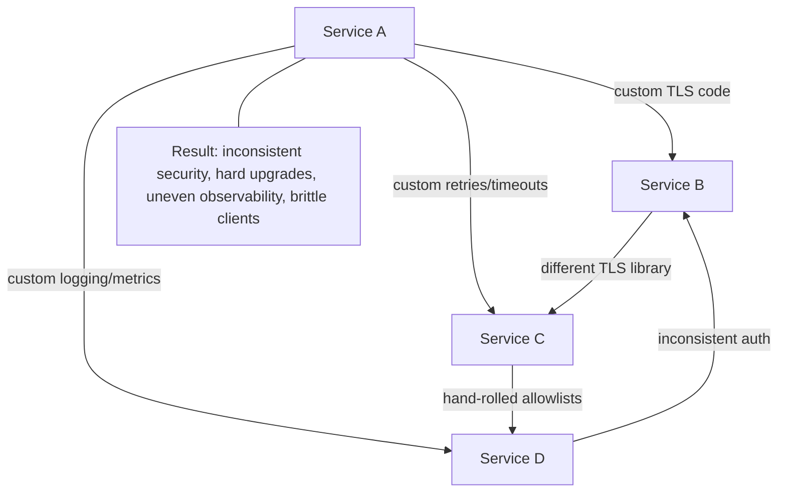
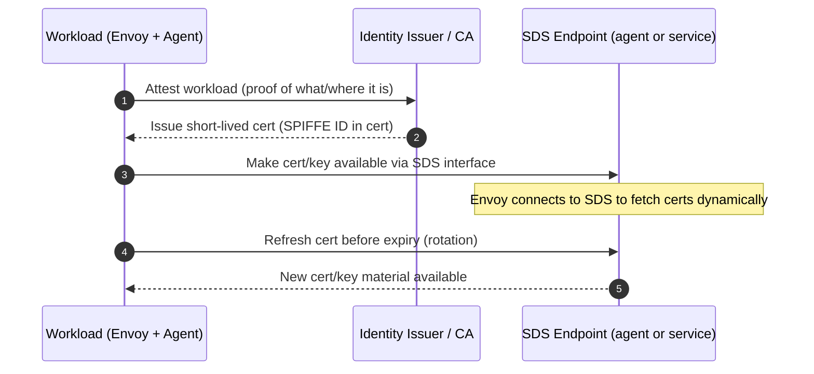
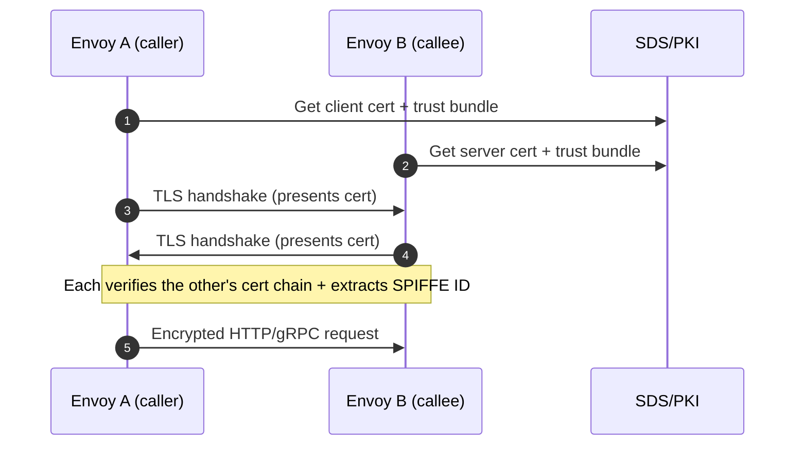
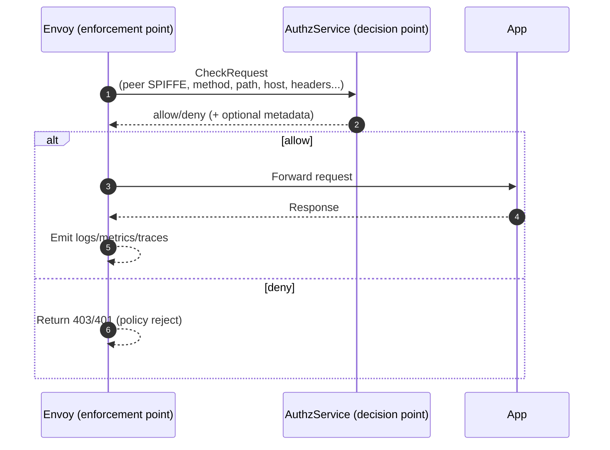
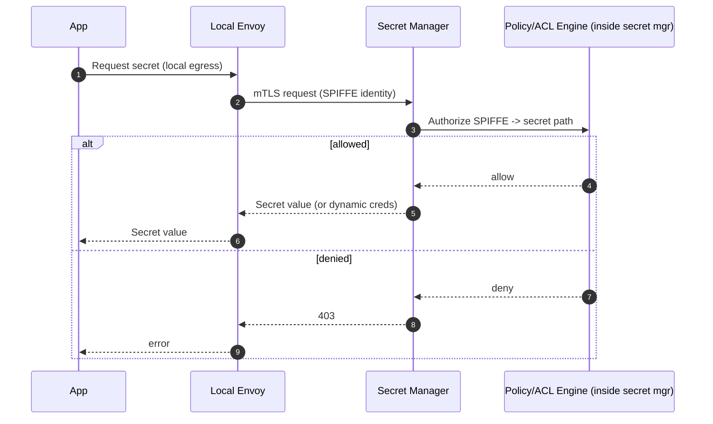
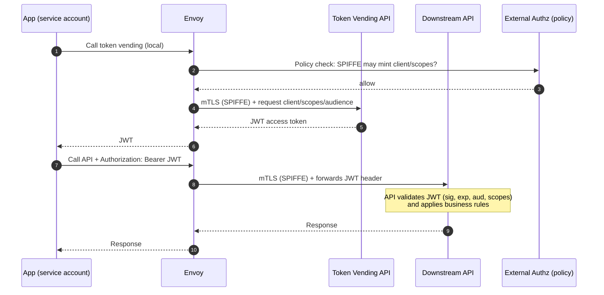
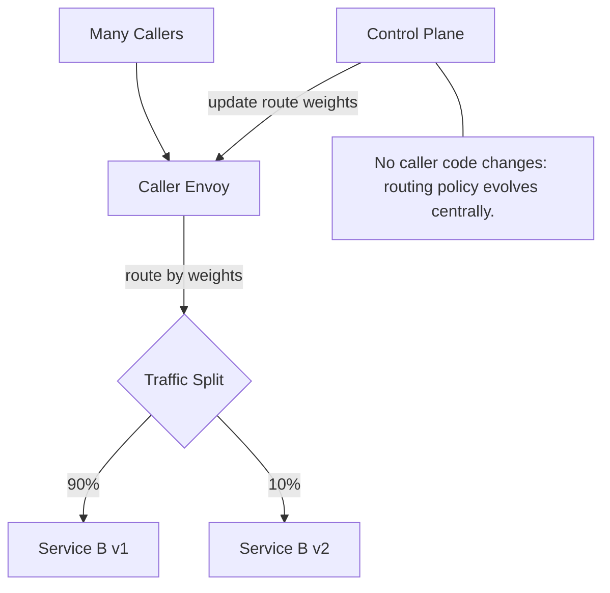

## The problem we’re solving (and the context)

In a large company, **hundreds or thousands of services** need to talk to each other over the network. If every team implements “secure service-to-service calls” themselves, you get a predictable mess:

- Some services use TLS correctly, some don’t.
- Certificate rotation breaks random clients.
- Logging and metrics are inconsistent, so incidents are hard to debug.
- Each language stack implements retries/timeouts differently (or not at all).
- Access control becomes scattered (“we added an allowlist in service A, but forgot service B…”).

At the same time, the company needs to **evolve** continuously: move services, split/merge APIs, add canaries, lock down sensitive endpoints, rotate secrets, introduce new auth requirements—without coordinating a synchronized rewrite across every application.

So the core system-design goal is:

> **Make internal service-to-service communication secure, consistent, observable, and easy to change—without requiring every service team to reinvent networking and security.**

The pattern that solves this at scale is: **“put a standard proxy next to every service”** and push common networking/security responsibilities into that proxy + shared control plane. That’s the foundation of an **Envoy-based service mesh** with **SPIFFE identities**, **mTLS**, **external authorization**, **central secret management**, and **optional OAuth tokens** for user/client context.

---

## What this is *not* about (common misinterpretations)

This is **not** primarily about:
- **Business logic permissions** like “can user edit this board?” or “is this user an admin?” Those remain inside application code and product policy.
- **How to deploy services** (Kubernetes, VMs, CI/CD). Deployment decides *where code runs*; the mesh decides *how services talk* once they run.
- **A single global API gateway** pattern (though edge ingress exists). A mesh is mostly about *east-west* traffic (service-to-service), not only *north-south* (internet-to-service).
- **Replacing OAuth/OIDC**. The mesh handles workload identity and transport security; OAuth handles user/client identity and scopes.
- **Magical security without work**. You still must define policies, audiences, and boundaries—but you define them centrally and enforce them uniformly.

---

## What you should be able to do after studying this (learning outcomes)

After you internalize these concepts, you should be able to:

1. **Explain request flow clearly**
   - Describe exactly what happens on a call: *App A → Envoy A → Envoy B → App B*.
   - Point to where encryption, identity, authorization, routing, retries, and telemetry happen.

2. **Reason about boundaries and responsibilities**
   - Know what belongs in application code vs the mesh.
   - Know what information each component *must* have, and what it *intentionally does not know*.

3. **Debug real failures systematically**
   - Distinguish “network unreachable” vs “routing misconfig” vs “mTLS identity mismatch” vs “authz denied” vs “JWT invalid”.
   - Know which logs/metrics to check conceptually (proxy access logs, authz decision logs, control plane config status, cert issuance status).

4. **Evolve systems safely**
   - Understand how to roll out routing changes (canary, failover, retries/timeouts) without application redeploys.
   - Understand how identity and secrets rotate without downtime.

5. **Design new internal APIs correctly**
   - Decide when SPIFFE/mTLS alone is enough vs when you need JWTs for end-user/client context.
   - Define policy boundaries: “who may call what”, “who may mint tokens”, “who may read secrets”.

---

## The solution in plain terms (with real-world analogies)

Think of your company like a city with many offices (services) that exchange packages (requests). You want:

- Packages sealed so nobody can read/alter them (**encryption**).
- A way to prove the sender is a real office, not an impostor (**identity**).
- Rules for which offices may send what kinds of packages to which other offices (**authorization**).
- Tracking numbers and delivery logs so you can debug lost packages (**observability**).
- The ability to reroute deliveries during road closures without redesigning every office’s mailroom (**evolvability**).

A service mesh does this by giving every office a standardized mailroom clerk (Envoy sidecar) and giving city hall a routing/policy office (control plane). Offices (apps) don’t need to become experts in logistics and security—they just hand packages to their mailroom clerk.

---

# Components: boundaries, responsibilities, contracts (practical view)

## 1) Application / Service

### What it is (generic)
Your business program: an API server, worker, bot, internal tool, etc.

### What it does in this system
- **Speaks “plain” local traffic** to its local proxy (often `localhost`).
- Adds **application meaning**: what endpoint to call, what data to send, what response means.
- Enforces **business rules** and domain permissions *after* the request is admitted into the service.

**Daily-life example:**  
A bot receives a Slack command and then calls an internal GraphQL API. The bot code should focus on “parse request → call API → format response”, not “implement TLS and retry logic and cert rotation”.

### What it is not
- Not the system that rotates TLS certificates.
- Not responsible for discovering which machines run the destination service.
- Not the canonical enforcement point for “service A may call service B” (that’s the mesh policy layer).

### Contract you rely on
- “If I send my request to the local proxy and label the destination, the platform will securely deliver it and give me consistent logs/metrics.”

---

## 2) Envoy sidecar (data plane proxy)

### What it is (generic)
A local “traffic manager” process running next to your app that:
- Receives inbound and outbound traffic
- Applies rules (routing, retries/timeouts)
- Establishes encrypted connections
- Emits telemetry
- Calls out to authz decision services when needed

### What it does in this system
- **Egress:** takes your app’s outbound request and securely delivers it to the right destination.
- **Ingress:** accepts inbound requests, verifies identity, checks policy, forwards to your app.
- Produces **uniform logs/metrics** so every service has comparable observability.

**Daily-life example:**  
If a downstream service is flaky, Envoy can apply standardized timeouts and retries so you don’t have 20 different retry behaviors across languages.

### What it is not
- Not your app’s business logic.
- Not the central brain; it follows instructions (config) from the control plane.
- Not a “VPN” that magically secures traffic without identity—its security comes from certs + policy + enforcement.

### Contract it enforces
- “Every service call is authenticated (who is calling), encrypted, authorized (is it allowed), and logged.”

---

## 3) The service mesh (as a whole)

### What it is (generic)
A company-wide networking layer built from:
- Many local proxies (data plane)
- A config distributor (control plane)
- Identity and authorization building blocks

### What it does in this system
- Makes security and reliability **default**, not optional.
- Centralizes policy, while keeping enforcement local (at every proxy).
- Enables safe evolution: reroutes, canaries, gradual rollout, consistent enforcement.

**Daily-life example:**  
You can shift 10% of traffic to a new version of a service (canary) without changing every caller’s code.

### What it is not
- Not a replacement for careful API design.
- Not a substitute for application authorization and validation.
- Not your deployment system.

### Contract
- “If you onboard correctly, you get secure, observable service-to-service calls by default.”

---

## 4) Identity & certs: SPIFFE + PKI + SDS

### What it is (generic)
- **SPIFFE ID:** a standardized “workload identity name” (like a passport identity for software).
- **PKI certificates:** cryptographic proof tying that identity to a key.
- **SDS:** a mechanism for Envoy to fetch/rotate certs automatically.

### What it does in this system
- Gives each workload a cryptographic identity it can present during mTLS.
- Ensures certs rotate automatically, reducing outages and manual work.
- Lets proxies verify “this caller is truly service X” before any request is accepted.

**Analogy:**  
SPIFFE is like an employee badge. mTLS is the badge scan at the door. SDS is badge renewal happening automatically so nobody’s badge expires unexpectedly.

### What it is not
- Not user login.
- Not a secret store for arbitrary secrets.
- Not authorization (“who you are” is not the same as “what you may do”).

### Contract
- “Every proxy can reliably prove its identity and verify peers, without app code managing keys.”

---

## 5) External authorization service (Pastis/cAuthZ-style)

### What it is (generic)
A centralized “policy decision service” that proxies consult for allow/deny decisions using request attributes.

### What it does in this system
- Envoy asks: “Caller identity X wants METHOD+PATH on HOST. Allowed?”
- Returns **allow/deny** consistently across all services.
- Policies can be RBAC (role-based) and/or ABAC (attribute-based).

**Analogy:**  
A building lobby has security guards (Envoy). The guards don’t memorize every rule; they consult a policy desk (AuthzService) that knows the rules and updates them centrally.

### What it is not
- Not your product’s domain-level permission system.
- Not a replacement for TLS/identity.
- Not where secrets live.

### Contract
- “Envoy supplies standardized request context; AuthzService returns a clear decision quickly.”

---

## 6) Control plane: Git-backed config + xDS distributor

### What it is (generic)
A pipeline that turns human-managed intent (often stored in Git) into dynamic proxy configuration pushed via xDS.

### What it does in this system
- You define high-level routing/policy intent in versioned config.
- The control plane validates and compiles it.
- Envoy gets updates via streaming config (xDS), without restart.

**Analogy:**  
Git is the “law book,” the control plane is the “printing press + distribution,” and Envoy sidecars are “traffic lights” that receive updated rules. Traffic lights don’t read law books; they receive official updates.

### What it is not
- Not a manual per-service config file on disk.
- Not the service discovery system itself (it consumes endpoint data).
- Not an app runtime dependency you call on every request.

### Contract
- “Envoy gets its rules from xDS, not from Git directly; config changes roll out safely and consistently.”

---

## 7) Secret manager (Vault/Knox-like)

### What it is (generic)
A system to store and control access to sensitive values (API keys, DB passwords, OAuth client secrets), with audit logs and rotation.

### What it does in this system
- Services authenticate using **workload identity (SPIFFE/mTLS)**.
- Secret manager decides which workload may read which secrets.
- Access is auditable and revocable.

**Daily-life example:**  
A service needs a database password at startup. Instead of baking it into config or environment variables forever, it fetches it securely and the secret manager logs who accessed it.

### What it is not
- Not the PKI system (even if it can issue certs, it’s a separate responsibility).
- Not the network policy system for API calls.
- Not “just configuration storage”.

### Contract
- “Present workload identity → get only the secrets you’re permitted to read → every access is logged.”

---

## 8) Internal OAuth + token vending API

### What it is (generic)
An OAuth/OIDC system that issues JWTs (tokens) plus a non-interactive token broker (“token vending”) for service accounts.

### What it does in this system
- Separates two identities:
  - **SPIFFE/mTLS**: which *service* is calling.
  - **JWT**: which *user/client/scopes* the request is acting under.
- Token vending is typically protected so only approved workloads can mint specific tokens.

**Daily-life example:**  
A backend service calls another API that needs user-level permissions (e.g., “read reports for user U”). The backend uses a JWT so the downstream can evaluate scopes/claims, while SPIFFE still proves which service made the call.

### What it is not
- Not a replacement for SPIFFE identity.
- Not a “mint any token you want” system.
- Not the place for application business rules.

### Contract
- “Workload proves itself via SPIFFE → receives a tightly scoped JWT → downstream APIs validate JWT claims for app-layer authorization.”

---

# Glossary (plain language, minimal jargon, with similes)

**Service**  
A program that offers a capability over the network (like a restaurant offering a menu).

**Request / Response**  
A question and an answer. “Give me user profile X” → “Here it is.”

**Service-to-service call**  
One service calling another service’s API (like one department emailing another to request data).

**Proxy (Envoy)**  
A middleman that forwards requests. Like a mailroom clerk who routes mail, checks rules, and records deliveries.

**Sidecar**  
A helper process deployed next to your app. Like a security guard stationed at each office door.

**Data plane**  
The part that handles real traffic. Like roads and traffic lights.

**Control plane**  
The part that tells the data plane what to do. Like the city traffic management office.

**xDS**  
A set of APIs for sending configuration to proxies. Like a live feed of updated traffic rules to traffic lights.

**Routing**  
Choosing where a request goes. Like choosing which address a package should be delivered to.

**Service discovery**  
Finding the current set of instances of a service. Like looking up which branch locations of a store are open right now.

**mTLS (mutual TLS)**  
Both sides prove who they are using certificates, and the traffic is encrypted. Like both people showing ID before exchanging a locked briefcase.

**TLS certificate**  
A cryptographic ID card used in TLS. It proves a name is tied to a key.

**SPIFFE ID**  
A standard “software identity name.” Like a passport number for a workload, not for a human.

**PKI / Certificate Authority (CA)**  
The system that issues certificates. Like the government office issuing passports.

**SDS**  
A way for Envoy to fetch/refresh certificates automatically. Like automatic passport renewal delivered to your mailbox.

**Authentication (authn)**  
Proving who you are. Like showing your badge.

**Authorization (authz)**  
Deciding what you’re allowed to do. Like “badge gets you into the building, but only certain floors.”

**RBAC**  
Access based on roles (e.g., “admin”, “reader”). Like job titles controlling access.

**ABAC**  
Access based on attributes (e.g., service name, environment, sensitivity). Like rules such as “contractors can enter only weekdays 9–5.”

**External authorization service**  
A policy decision engine Envoy asks for allow/deny. Like a security desk that looks up rules.

**JWT**  
A signed token that carries claims (who/what/scopes). Like a stamped permission slip that can be verified without calling the issuer every time.

**OAuth**  
A standard way to obtain and use tokens. Like a formal system for issuing permission slips.

**Token vending (token broker)**  
A non-interactive way for services to obtain tokens. Like an internal kiosk that issues approved badges to staff machines.

**Secret manager (Vault-like)**  
A secure safe that stores passwords/keys and logs access. Like a bank vault with a sign-in ledger.

**Observability**  
Knowing what’s happening: logs, metrics, traces. Like receipts + CCTV + delivery tracking.

**Access log**  
A record of each request (who called, what path, latency). Like a visitor logbook at reception.

**Metrics**  
Numbers over time (error rate, latency, traffic). Like a dashboard showing how busy a store is.

**Trace**  
A “breadcrumb trail” of one request as it travels across services. Like a package tracking history across facilities.

**Retries / Timeouts**  
Rules for how to handle slow/failing calls. Like “wait 5 seconds for a reply, try once more, then give up.”

**Canary rollout**  
Send a small percentage of traffic to a new version first. Like testing a new checkout lane with 5% of customers.

---

## Where you’ll feel this in practice (everyday scenarios)

1. **“Why is my call getting 403/denied?”**  
   Often means: identity succeeded (mTLS worked) but **authz policy** rejected it. You debug by asking: *Which identity did Envoy see? What exact route/method/path was evaluated?*

2. **“It worked yesterday, now it’s failing”**  
   Could be:
   - Config changed (control plane pushed a new route/policy)
   - Cert/identity issue (SDS/cert rotation problems)
   - Endpoint set changed (discovery)

3. **“Why are there no logs for my service calls?”**  
   Usually means the call bypassed the proxy or you’re looking at app logs instead of proxy access logs/metrics. In a mesh, the proxy is the consistent observation point.

4. **“We need to rotate secrets without downtime”**  
   You rely on the secret manager’s rotation + controlled access, and you design services to refresh secrets safely.

5. **“We need a new internal API and want it secure by default”**  
   You design:
   - Which SPIFFE identities may call it (mesh authz)
   - Whether it requires JWTs for user context (OAuth)
   - How secrets are fetched (secret manager)

---

## What to learn next (a practical study path)

1. **Network + HTTP fundamentals (just enough)**
   - HTTP/1.1 Host vs HTTP/2 :authority
   - Timeouts, retries, idempotency (what’s safe to retry)

2. **Identity and trust**
   - Why mTLS is stronger than “shared API keys”
   - How certificate rotation avoids outages

3. **Policy design**
   - Designing RBAC/ABAC rules that won’t become unmaintainable
   - Separating “service may call service” from “user may do action”

4. **Operational debugging**
   - How to reason from symptoms (5xx, 4xx, latency) to the responsible layer:
     - routing vs identity vs authz vs app logic

If you want, I can turn this into a “mini-curriculum” with 5–7 short labs (purely conceptual or with toy examples) like: *trace a request*, *diagnose a deny*, *design a token vending policy*, *design least-privilege secret access*, and *roll out a canary safely*.


Below is a **diagram-heavy follow-up** you can use as an educational + practical mental model pack. I’ll keep each diagram **generic** (Envoy + SPIFFE + external authz + secret manager + OAuth/token vending) and add just enough commentary so you know **what question the diagram answers**.

> Tip: Read these in order. They move from “what problem are we solving?” → “what flows happen?” → “how do config/identity/policy/observability actually work?”

---

# 0) The problem: “every team re-implements networking” (anti-pattern)

This shows the world **without** a mesh: duplicated TLS/auth/routing/logging across services.



---

# 1) The solution at 10,000 ft: “standardize the network edge of every service”

This shows the **core mesh contract**: apps talk locally; proxies do the hard stuff.

```mermaid
graph TD
  subgraph WorkloadA[Workload A]
    AppA[App A]
    EnvoyA[Envoy Sidecar A]
    AppA <-->|local plaintext HTTP/gRPC| EnvoyA
  end

  subgraph WorkloadB[Workload B]
    EnvoyB[Envoy Sidecar B]
    AppB[App B]
    EnvoyB <-->|local plaintext HTTP/gRPC| AppB
  end

  EnvoyA -->|mTLS + SPIFFE identity| EnvoyB

  CP[Control Plane<br/>(Git intent -> xDS)] -->|xDS config| EnvoyA
  CP -->|xDS config| EnvoyB

  ID[Identity/PKI<br/>(SPIFFE + CA + SDS)] -->|certs/trust bundles| EnvoyA
  ID -->|certs/trust bundles| EnvoyB

  Authz[External Authz<br/>(RBAC/ABAC decisions)] <-->|ext_authz| EnvoyA
  Authz <-->|ext_authz| EnvoyB
```

---

# 2) Inside one workload: “ingress vs egress” responsibilities

This clarifies the **boundary**: the app doesn’t accept traffic from the world; Envoy does.

```mermaid
graph TD
  subgraph Workload[One Workload Instance]
    Net[Network] --> IngressL[Envoy Ingress Listener]
    IngressL -->|policy checks| Filters[Envoy Filters<br/>(mTLS verify, ext_authz, rate limit, JWT check)]
    Filters -->|forward| App[App Port]

    App -->|outbound to localhost| EgressL[Envoy Egress Listener]
    EgressL -->|route + LB + retries| Up[Upstream Cluster Selection]
    Up -->|mTLS| Net2[Network to Destination Envoy]
  end
```

---

# 3) Control plane pipeline: “Git intent → validated config → xDS streams”

This answers: **“How does a change in Git become behavior in proxies?”**

```mermaid
graph TD
  Git[Git Repo<br/>(routing + policy intent)]
  CI[Validation/Compilation<br/>(lint, templates, safety checks)]
  XDS[xDS Distributor<br/>(snapshot + streaming)]
  SD[Service Discovery<br/>(endpoints/health)]
  Envoy1[Envoy Sidecar A]
  Envoy2[Envoy Sidecar B]

  Git --> CI --> XDS
  SD --> XDS

  XDS -->|LDS/RDS/CDS/EDS updates| Envoy1
  XDS -->|LDS/RDS/CDS/EDS updates| Envoy2

  Note["Key contract: Envoy never reads Git; it only consumes xDS."]
  XDS --- Note
```

---

# 4) Identity lifecycle: “SPIFFE → cert issuance → SDS → rotation”

This answers: **“Where do certs come from, and how do they rotate without app code?”**



---

# 5) mTLS handshake: “how Envoy learns the caller’s identity”

This answers: **“How does the callee know who is calling?”**



---

# 6) External authorization (ext_authz): “decision vs enforcement split”

This answers: **“Who decides allow/deny, and who enforces it?”**



---

# 7) Secret access: “SPIFFE authenticates; secret store authorizes”

This answers: **“How do services read secrets safely and least-privilege?”**



---

# 8) Token vending + downstream API: “SPIFFE gets token; JWT carries user/client context”

This answers: **“When do we need JWTs if we already have SPIFFE?”**



---

# 9) Observability: “where logs/metrics/traces come from (and why it’s consistent)”

This answers: **“Why does a mesh make debugging easier?”**

```mermaid
graph TD
  subgraph Workload[Workload]
    App[App]
    Envoy[Envoy Sidecar]
  end

  Envoy -->|access logs| Logs[Log Pipeline / Storage]
  Envoy -->|metrics (latency, RPS, errors)| Metrics[Metrics TSDB]
  Envoy -->|traces (spans/context)| Traces[Tracing Backend]

  App -->|optional app logs| Logs
  App -->|optional custom metrics| Metrics

  Note["Mesh benefit: even if apps differ, Envoy emits a consistent baseline of telemetry for every hop."]
  Envoy --- Note
```

---

# 10) Safe evolution: canary rollout without client code changes (traffic split)

This answers: **“How do we ship changes safely across many callers?”**



---

## If you want even more diagrams, tell me which “chapter” you want next

Pick 2–3 and I’ll expand into a full set:

1) **Failure-mode maps** (why you get 401 vs 403 vs 503 vs timeouts, and which component is responsible)  
2) **Multi-hop traces** (one request across 5 services, showing spans and where retries happen)  
3) **Policy design diagrams** (RBAC/ABAC examples; least privilege; “break-glass” access)  
4) **Multi-environment / multi-cluster meshes** (prod vs staging; trust domains; federation)  

Say which ones you want and whether you prefer **more sequence diagrams** or **more component graphs**.

