# Executive Summary

This comprehensive analysis evaluates [message queue](#glossary) systems versus [stream processing](#glossary) platforms for small-to-medium scale data integration use cases (10-10,000 messages/hour). The central question: Is [AWS Lambda](#glossary) + [SQS](#glossary) architecture appropriate, or is [streaming](#glossary) technology like [Kafka](#glossary) necessary?

**Key Findings:**
- **For low volumes (<10K msgs/hr):** Traditional [message queues](#glossary) ([SQS](#glossary), [RabbitMQ](#glossary)) are optimal—simpler, cheaper, and sufficient
- **Cost comparison:** [Lambda](#glossary)+[SQS](#glossary) costs ~$10-20/month vs [AWS MSK](#glossary) (Kafka) at ~$600+/month
- **Performance:** [Kafka](#glossary) handles millions msgs/sec with <5ms [latency](#glossary); [SQS](#glossary) handles 300K msgs/sec with 100ms-1s latency—both exceed small-scale needs
- **Complexity trade-off:** [Streaming platforms](#glossary) require significant operational expertise and are overkill for modest workloads
- **Transformation approach:** Native code outperforms [DSL](#glossary)s like [JSONata](#glossary) by 100x+, but [DSL](#glossary)s boost developer productivity for complex mappings

**Recommendations:**
1. Start with managed queue ([SQS](#glossary) + [Lambda](#glossary)) for simplicity and cost-effectiveness
2. Only adopt [streaming](#glossary) ([Kafka](#glossary), [Pulsar](#glossary)) when: (a) multiple independent consumers needed, (b) message replay required, or (c) volume exceeds millions/day
3. Design with abstraction layers to enable future migration to [streaming](#glossary) if requirements evolve
4. Implement [idempotent](#glossary) handlers, [dead-letter queues](#glossary), and comprehensive monitoring from day one

This report provides detailed performance benchmarks, architectural patterns, cost analyses, and migration strategies to support data-driven decision making.

---

# Introduction
Modern systems increasingly require real-time data pipelines and inter-system translation services.  At low volumes (on the order of 10–10,000 messages/day, i.e. a few per second), it's easy to over-engineer.  This report evaluates **queue-based** designs (e.g. [AWS SQS](#glossary), [RabbitMQ](#glossary), [Redis Streams](#glossary)) versus **[streaming](#glossary)** platforms ([Kafka](#glossary), [Pulsar](#glossary), etc.) for a small-scale integration use case. We critically examine whether the proposed [AWS Lambda](#glossary)+[SQS](#glossary) architecture is appropriate, and explore simpler alternatives and scaling paths.  We emphasize data-driven comparisons ([throughput](#glossary), [latency](#glossary), cost) and best-fit scenarios, and provide clear, actionable recommendations.

# 1. Message Queue vs Stream Processing

**Key differences.** Traditional [message queues](#glossary) ([AWS SQS](#glossary), [RabbitMQ](#glossary)) provide [at-least-once delivery](#glossary) and simple decoupling of services.  They typically deliver each message **once** (removing it from the queue) and are optimized for modest [throughput](#glossary).  [Streaming platforms](#glossary) ([Kafka](#glossary), [Pulsar](#glossary), [Redis Streams](#glossary), [AWS Kinesis](#glossary), etc.) provide a *durable log* of events: messages are retained for a configurable time, multiple [consumers](#glossary) can read the same data, and consumers can replay or reprocess history.  This fundamental difference drives use cases.

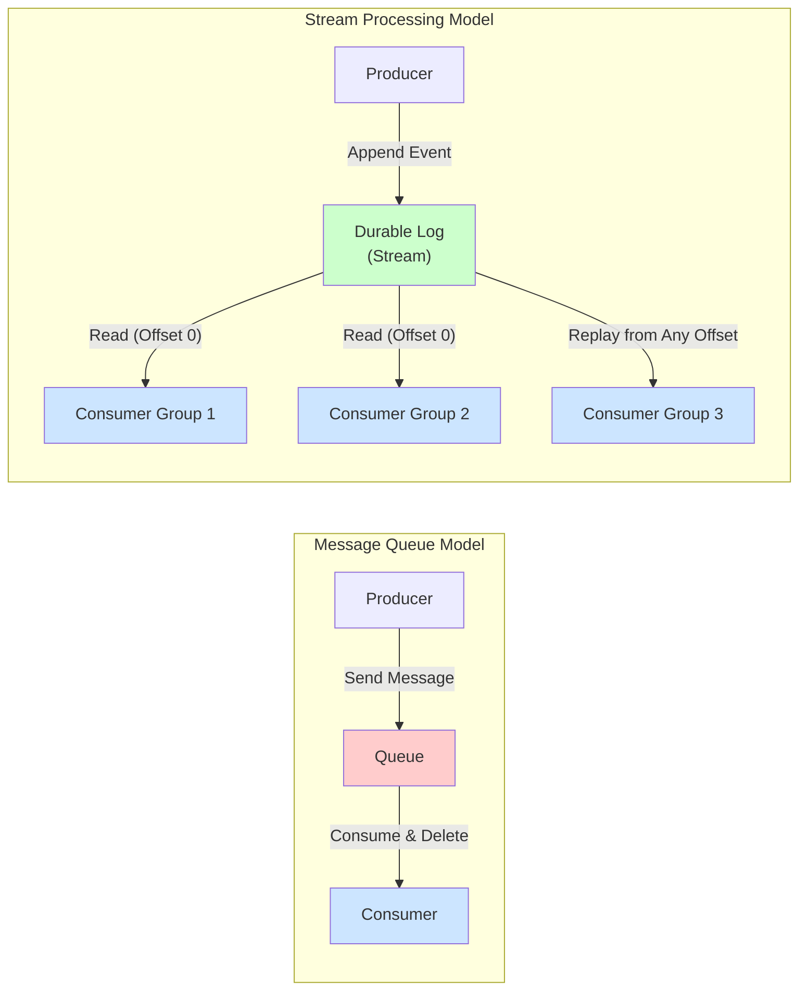

**Figure 1.1:** Fundamental architectural difference between [message queues](#glossary) (consume-and-delete) and [streaming platforms](#glossary) (durable log with replay capability)   

- **[SQS](#glossary) (AWS) / [RabbitMQ](#glossary):** Fully-managed ([SQS](#glossary)) or moderately easy self-hosted ([RabbitMQ](#glossary)) queues.  [SQS](#glossary) pushes messages to one [consumer](#glossary) (or to multiple if using fan-out via [SNS](#glossary)), and a message is deleted once consumed.  Ordering is best-effort (or [FIFO queues](#glossary) guarantee ordering at a small extra cost).  [RabbitMQ](#glossary) supports rich protocols ([AMQP](#glossary), [MQTT](#glossary)) and flexible routing but has less raw [throughput](#glossary). Both are great for task queues, point-to-point messaging, and simple pub/sub with limited scale.

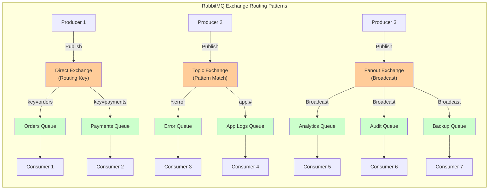

**Figure 1.4:** [RabbitMQ](#glossary) exchange types enabling flexible routing patterns: Direct (routing key), Topic (pattern matching), and Fanout (broadcast)
- **[Redis Streams](#glossary):** An in-memory append-only log built into Redis 5.0+.  It supports [consumer groups](#glossary) and replay semantics like [Kafka](#glossary), but retention is memory-bound (unless using Redis on Flash) and horizontal scalability is limited by the Redis cluster size.  Useful when you already use Redis and need basic stream capabilities.
- **[Apache Kafka](#glossary)/[Pulsar](#glossary):** Highly-scalable distributed logs.  [Kafka](#glossary) (and [AWS MSK](#glossary)) excels at very high [throughput](#glossary) and long-term storage of events with low [latency](#glossary). [Pulsar](#glossary) is similar but with a separate storage layer ([BookKeeper](#glossary)) and built-in multi-tenancy. Both support *multiple* [consumer groups](#glossary) (broadcast, parallelism) and strong ordering guarantees per [partition](#glossary).  Great for [event sourcing](#glossary), audit logs, analytics streams.  

**Throughput and latency.** At the performance extreme, [Kafka](#glossary) and [Pulsar](#glossary) can each handle **millions of messages per second**, whereas [RabbitMQ](#glossary) and [SQS](#glossary) are much lower. For example, one benchmark chart (2025) shows [Kafka](#glossary) >10M msg/s, [Pulsar](#glossary) ~4M msg/s, [RabbitMQ](#glossary) ~1M msg/s, and [AWS SQS](#glossary) ~300K msg/s [o^Kafka vs. JMS, RabbitMQ, SQS, and Modern Messaging – 2025 Edition](https://cloudurable.com/blog/kafka-vs-jms-2025/#:~:text=%60flowchart%20LR%20subgraph%20Performance%5B,br%3E50K%20msg%2Fsec).  (Note: actual [throughput](#glossary) also depends on message size, hardware, and batching.)  [Latency](#glossary) is correspondingly lowest for [Kafka](#glossary) (a few ms) and higher for others ([RabbitMQ](#glossary) ~1–20ms, [Pulsar](#glossary) ~5–10ms) [o^Kafka vs. JMS, RabbitMQ, SQS, and Modern Messaging – 2025 Edition](https://cloudurable.com/blog/kafka-vs-jms-2025/#:~:text=%60flowchart%20LR%20subgraph%20Performance%5B,br%3E50K%20msg%2Fsec).  [SQS](#glossary) [latency](#glossary) is quoted in AWS docs as on the order of sub-second to a few seconds (especially on standard queues, where messages may be delivered within ~ hundreds of milliseconds or more under load).  **Implication:** *[Kafka](#glossary)/[Pulsar](#glossary) are overkill* for low volumes; [SQS](#glossary)/Rabbit can saturate thousands of msgs/s easily [o^Message broker selection cheat sheet: Kafka vs RabbitMQ vs Amazon SQS / Habr](https://habr.com/en/articles/716182/#:~:text=Throughput%3A) [o^Kafka vs SQS: Event Streaming Tools In–Depth Comparison │ DataCamp](https://www.datacamp.com/blog/kafka-vs-sqs#:~:text=Category%20%20,Kafka).

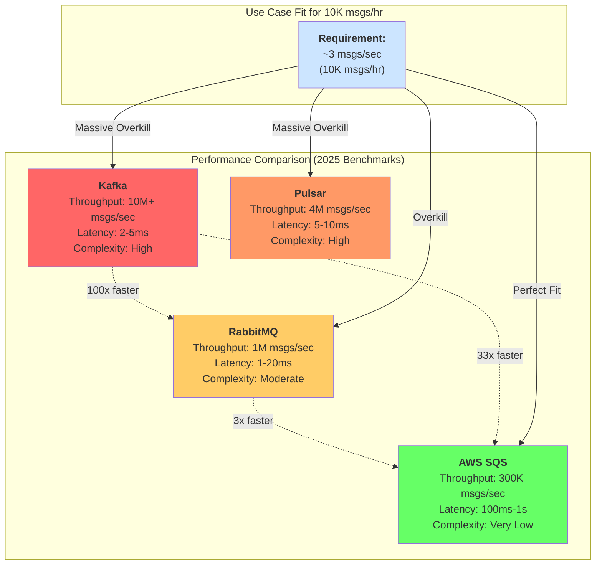

**Figure 1.2:** Performance comparison showing [throughput](#glossary) and [latency](#glossary) characteristics. For 10K msgs/hr workloads, [SQS](#glossary) provides sufficient performance with minimal complexity. 

**Scalability and volume thresholds.**  For *small loads* (≈1K–10K messages/hour, i.e. <3 msgs/sec), managed queues suffice.  SQS can easily absorb this scale – AWS handles spiky loads by auto-scaling throughput, and even RabbitMQ can process tens of thousands per second [o^Message broker selection cheat sheet: Kafka vs RabbitMQ vs Amazon SQS / Habr](https://habr.com/en/articles/716182/#:~:text=Throughput%3A).  In contrast, Kafka’s complexity and cost only make sense when you need sustained high throughput or event replay.  As a rule-of-thumb, use a simple broker (SQS, RabbitMQ) for low-to-moderate workloads; reserve Kafka/Pulsar for situations with **millions** of events/day or complex consumption patterns [o^Kafka vs SQS: Event Streaming Tools In–Depth Comparison │ DataCamp](https://www.datacamp.com/blog/kafka-vs-sqs#:~:text=Category%20%20,Kafka) [o^Message broker selection cheat sheet: Kafka vs RabbitMQ vs Amazon SQS / Habr](https://habr.com/en/articles/716182/#:~:text=Throughput%3A).  One comparison bluntly notes: *“Kafka is highly scalable for large volumes; SQS is highly scalable for smaller volumes”* [o^Kafka vs SQS: Event Streaming Tools In–Depth Comparison │ DataCamp](https://www.datacamp.com/blog/kafka-vs-sqs#:~:text=Architecture%20%20%7C%20Distributed%2C%20pub,Limited%20retention).  

**Learning curve and ops overhead.**  SQS has virtually no ops – it’s a fully managed AWS service.  RabbitMQ requires managing broker nodes, exchanges, and clusters (though many managed hosting options exist).  Kafka/Pulsar demand significantly more operational expertise: cluster setup (ZooKeeper or KRaft), partitioning strategy, replication management, etc.  They also require monitoring (brokers, disk usage, performance metrics).  For a team with *no* stream experience, Kafka introduces a steep learning curve; SQS or RabbitMQ are far simpler to adopt.  Confluent estimates Kafka answers to “set up in minutes” only if you have Kafka knowledge, otherwise SQS “instant” vs Kafka “minutes” or more [o^Kafka vs SQS: Event Streaming Tools In–Depth Comparison │ DataCamp](https://www.datacamp.com/blog/kafka-vs-sqs#:~:text=non,Kafka). Redis Streams falls in between: easier than Kafka if you already run Redis, but less polished.  

**Cost.**  Managed queues like [SQS](#glossary) or [Kinesis](#glossary) charge per request or shard-hour; [Kafka](#glossary) requires paying for reserved compute/storage (self-hosted or [MSK](#glossary)).  For example, **[AWS MSK](#glossary)** lists a 3-broker [Kafka](#glossary) cluster at **hundreds of dollars/month** (e.g. ~$620/mo for 3 x kafka.m5.large brokers plus ~2TB storage) [o^Managed Apache Kafka – Amazon MSK pricing – AWS](https://aws.amazon.com/msk/pricing/#:~:text=brokers%20%3D%202%2C232%20hours%20,16).  By contrast, [SQS](#glossary) costs $0.40 per million requests (first million free), plus minimal data transfer [o^Amazon Kinesis vs. Amazon SQS: Choosing the Right Messaging Service │ synapsefabric](https://synapsefabric.com/amazon-kinesis-vs-amazon-sqs-choosing-the-right-messaging-service/#:~:text=Cost%20%20,Fully%20managed%20by%20AWS).  At 10K msgs/hour (7.2M/month), [SQS](#glossary) costs only a few dollars and [Lambda](#glossary) invocations (compute) might be on the order of $5–$15/month (assuming 100ms 256MB functions).  This is *orders of magnitude* cheaper than a [Kafka](#glossary) cluster for the same volume.  (For rough estimation: 7.2M [Lambda](#glossary) invocations × 128MB @100ms ≈ few dollars + 7.2M requests @$0.20/M = ~$1.44【42†】.)  Thus at low volume, [Lambda](#glossary)+[SQS](#glossary) is very cost-effective.

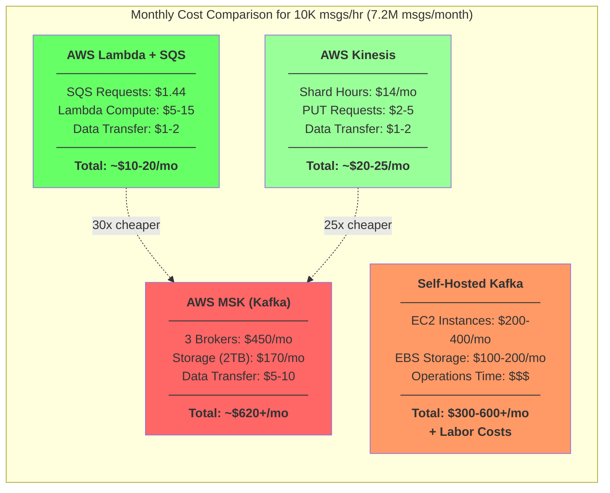

**Figure 1.3:** Cost comparison for 10K msgs/hr workload showing [Lambda](#glossary)+[SQS](#glossary) as the most cost-effective solution  

**Real-world use cases.**  
- **RabbitMQ/SQS:** Best for classic enterprise messaging, job queues, microservices communication.  Use RabbitMQ when you need complex routing (pub/sub, request/reply, MQTT, etc.) or when in a non-AWS environment.  Use SQS/SNS for AWS-centric async decoupling (e.g. one service triggers events processed by others).  They excel when **exactly-once** processing or long-term replay are *not* required. Example: e-commerce order processing pipeline, notification fan-outs, sporadic task processing.  
- **Apache Kafka/Pulsar:** Excelling in event-driven analytics, log aggregation, high-throughput ingest, audit logging, and use-cases with many independent consumers.  For example, streaming sensor data, transaction logs, or feeding multiple downstream consumers (e.g. analytics engine, monitoring, storage lake) from the same event stream.  Confluent notes Kafka is favored outside AWS or when you need advanced stream processing (windowing, aggregations, stateful computations).  
- **Redis Streams:** A fit when you already use Redis and need a lightweight stream with at-least-once delivery.  Use cases include short-lived event pipelines, leaderboards, or coordination signals.  It’s simpler than Kafka but not designed for very high volume or long-term storage.  

**Comparison Table.**  


| Feature             | AWS SQS (Standard)                                            | RabbitMQ (AMQP)                                  | Apache Kafka                          | Apache Pulsar                          | Redis Streams                           |
|---------------------|---------------------------------------------------------------|--------------------------------------------------|---------------------------------------|----------------------------------------|----------------------------------------|
| **Throughput**      | ~300K msgs/sec (burst), typically thousands/sec [o^Message broker selection cheat sheet: Kafka vs RabbitMQ vs Amazon SQS / Habr](https://habr.com/en/articles/716182/#:~:text=Throughput%3A)  | ~100K–200K msgs/sec (per cluster) [o^Message broker selection cheat sheet: Kafka vs RabbitMQ vs Amazon SQS / Habr](https://habr.com/en/articles/716182/#:~:text=Throughput%3A)    | Tens of millions msgs/sec [o^Kafka vs. JMS, RabbitMQ, SQS, and Modern Messaging – 2025 Edition](https://cloudurable.com/blog/kafka-vs-jms-2025/#:~:text=%60flowchart%20LR%20subgraph%20Performance%5B,br%3E50K%20msg%2Fsec) | Millions msgs/sec (≤ Kafka) [o^Kafka vs. JMS, RabbitMQ, SQS, and Modern Messaging – 2025 Edition](https://cloudurable.com/blog/kafka-vs-jms-2025/#:~:text=%60flowchart%20LR%20subgraph%20Performance%5B,br%3E50K%20msg%2Fsec) | Tens of thousands–hundreds K (mem bound) |
| **Latency**         | ~100ms–1s (best-effort ordering, standard queue) [o^Message broker selection cheat sheet: Kafka vs RabbitMQ vs Amazon SQS / Habr](https://habr.com/en/articles/716182/#:~:text=,range%20of%20a%20few%20milliseconds) | ~1–20ms (brokered delivery) [o^Kafka vs. JMS, RabbitMQ, SQS, and Modern Messaging – 2025 Edition](https://cloudurable.com/blog/kafka-vs-jms-2025/#:~:text=%60flowchart%20LR%20subgraph%20Performance%5B,br%3E50K%20msg%2Fsec)          | ~2–5 ms (very low) [o^Kafka vs. JMS, RabbitMQ, SQS, and Modern Messaging – 2025 Edition](https://cloudurable.com/blog/kafka-vs-jms-2025/#:~:text=%60flowchart%20LR%20subgraph%20Performance%5B,br%3E50K%20msg%2Fsec)       | ~5–10 ms (low) [o^Kafka vs. JMS, RabbitMQ, SQS, and Modern Messaging – 2025 Edition](https://cloudurable.com/blog/kafka-vs-jms-2025/#:~:text=%60flowchart%20LR%20subgraph%20Performance%5B,br%3E50K%20msg%2Fsec)             | ~<1ms (in-memory)                       |
| **Delivery Model**  | At-least-once (Standard), FIFO optional for order             | At-least-once; supports multiple patterns (ROUTE, PUB/SUB) | At-least-once (exactly-once via transactions) | At-least-once; geo-replication built-in | At-least-once; consumer groups support  |
| **Retention**       | Up to 14 days (configurable)                                 | Up to broker disk limits                         | Configurable (days/months/years)      | Configurable (minutes to indefinite)    | Typically short (in-memory, manual cleanup) |
| **Consumer Model**  | One consumer per queue (multiple via SNS fanout)             | Multiple consumers per queue (queues can load-balance) | Multiple consumer groups, parallelism | Multiple subscription modes (shared, exclusive) | Consumer groups with streams (XREADGROUP) |
| **Ordering**        | Best-effort (FIFO queue option provides strict ordering)      | Per-queue ordering (with corporate/config)        | Per-partition ordering (guaranteed)   | Per-topic-partition        ordering     | FIFO within stream IDs                 |
| **Scaling**         | Unlimited (AWS-managed)                                      | Scale by clustering or shoveling                 | Linear scale with partitions & brokers | Linear (brokers + bookies)             | Limited by Redis cluster memory        |
| **Complexity**      | Very low (managed service, no infra)                         | Moderate (manage brokers, exchanges, queues)      | High (manage cluster, ZK/KRaft)       | High (manage brokers + BookKeeper)     | Low–moderate (run in existing Redis)    |
| **Learning Curve**  | Low (AWS console, SDKs)                                      | Moderate (AMQP knowledge)                         | High (distributed system)            | High (Kafka-like with nuances)         | Low (if familiar with Redis)          |
| **Ecosystem/Tools** | AWS Lambda, SNS, EventBridge integration                    | Broad (CloudAMQP, Pivotal, plugins)              | Rich (Kafka Streams, Connect, KSQL)  | Growing (Functions, Pulsar IO)         | Rhino, Streams UI                     |
| **Cost Model**      | $0.40 per million requests + data transfer [o^Kafka vs SQS: Event Streaming Tools In–Depth Comparison │ DataCamp](https://www.datacamp.com/blog/kafka-vs-sqs#:~:text=Category%20%20,Kafka)     | Software free; pay for compute/storage           | Self-host (nodes) or MSK ($600+/mo) [o^Managed Apache Kafka – Amazon MSK pricing – AWS](https://aws.amazon.com/msk/pricing/#:~:text=brokers%20%3D%202%2C232%20hours%20,16) | Self-host (nodes)                     | Included with Redis licensing         |
| **Use-Case Sweet Spot** | Simple task queues, AWS-based async decoupling         | Traditional messaging patterns, legacy systems    | High-throughput data pipelines, event logs | Multi-tenant streams, Geo-replication  | Lightweight streams, caching scenarios |

*Table: Comparison of messaging systems by volume, latency, complexity and cost (sources cf. [o^Message broker selection cheat sheet: Kafka vs RabbitMQ vs Amazon SQS / Habr](https://habr.com/en/articles/716182/#:~:text=Throughput%3A) [o^Kafka vs SQS: Event Streaming Tools In–Depth Comparison │ DataCamp](https://www.datacamp.com/blog/kafka-vs-sqs#:~:text=Category%20%20,Kafka) [o^Kafka vs. JMS, RabbitMQ, SQS, and Modern Messaging – 2025 Edition](https://cloudurable.com/blog/kafka-vs-jms-2025/#:~:text=%60flowchart%20LR%20subgraph%20Performance%5B,br%3E50K%20msg%2Fsec) [o^Managed Apache Kafka – Amazon MSK pricing – AWS](https://aws.amazon.com/msk/pricing/#:~:text=brokers%20%3D%202%2C232%20hours%20,16)).*  

**Recommendations (1K–10K msgs/hr).**  For an average of 1–10K messages per hour (~0.3–3 msgs/sec), a **simple queue** approach is typically adequate.  AWS SQS (with Lambda or EC2 consumers) or RabbitMQ will handle this easily.  For example, Datacamp’s Kafka vs SQS summary says “Kafka: highly scalable for large volumes; SQS: highly scalable for smaller volumes” [o^Kafka vs SQS: Event Streaming Tools In–Depth Comparison │ DataCamp](https://www.datacamp.com/blog/kafka-vs-sqs#:~:text=Architecture%20%20%7C%20Distributed%2C%20pub,Limited%20retention).  At this rate, the complexity and cost of Kafka/Pulsar are unlikely to be justified.  SQS delivers at-least-once semantics and auto-scaling with virtually no operational overhead, making it a pragmatic choice.  Use RabbitMQ if you need advanced routing or are not on AWS.  Streaming platforms should be considered only when (a) you need multiple independent consumers, (b) message replay/audit is critical, or (c) throughput will grow into the millions per day.  

# 2. Real-Time Data Pipeline Architectures  

**Event-driven architectures (EDA).** Modern pipelines often use an event-driven model: components emit events, others react.  Key patterns include:
- *[Event Sourcing](#glossary)/[CQRS](#glossary):* Store all state changes as an immutable log (in [Kafka](#glossary) or a database).  Separate write-model (commands) from read-model (queries). Useful for auditability, rebuilding state, and complex queries on historical data.
- *[Saga](#glossary) (long-running transactions):* When multiple systems must update state in a sequence (e.g. order→payment→shipment), a [Saga](#glossary) orchestrates or choreographs compensating actions on failure [o^Saga pattern │ Event–driven Architecture on AWS](https://aws-samples.github.io/eda-on-aws/patterns/saga/#:~:text=Managing%20data%20consistency%20across%20microservices,services%20in%20a%20microservices%20architecture).  Each service publishes events; if one fails, compensating events revert previous steps.  Services like [AWS Step Functions](#glossary) or [Temporal](#glossary) can implement [saga](#glossary) orchestration. The AWS Developer Guide suggests using [Sagas](#glossary) to handle consistency across services with events and message brokers [o^Saga pattern │ Event–driven Architecture on AWS](https://aws-samples.github.io/eda-on-aws/patterns/saga/#:~:text=Managing%20data%20consistency%20across%20microservices,services%20in%20a%20microservices%20architecture).  

**Stream processing frameworks.** For continuous streams the main engines are: **[Kafka Streams](#glossary)** (embedded in [Kafka](#glossary), Java), **[Apache Flink](#glossary)** (standalone, Java/Scala), **[Apache Storm](#glossary)** (older, multi-language), **[Spark Structured Streaming](#glossary)** (micro-batch), **Samza**, etc.  These provide tools for filtering, aggregating, windowing, and joining streams.  For example, [Flink](#glossary) and [Kafka Streams](#glossary) provide *true* streaming (record-by-record) whereas Spark Streaming (pre-2.0) used [micro-batches](#glossary).  In general:
- **[Flink](#glossary)**: True streaming, strong state management, windowing, event-time processing, and [exactly-once](#glossary) semantics. Requires managing a [Flink](#glossary) cluster (or use [Kinesis Data Analytics](#glossary) on AWS).
- **[Spark Streaming](#glossary) (Structured Streaming)**: Simpler if you already use Spark for batch; uses small [micro-batches](#glossary). Good integration with Spark ecosystem, but higher [latency](#glossary) (~100ms+). Less ready for sub-100ms speeds.
- **[Storm](#glossary)**: Very low-[latency](#glossary), but historically more complex to operate and less active development now; largely superseded by newer engines.
- **[Kafka Streams](#glossary)**: A Java library for stream processing on [Kafka](#glossary) topics. Easy if your use case is [Kafka](#glossary)-centric and your team knows Java. No separate cluster; processing runs in your application instances.

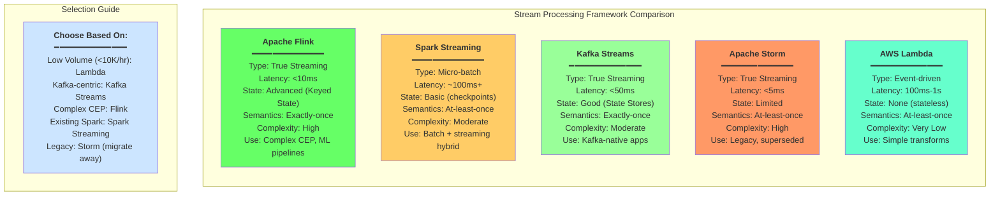

**Figure 2.4:** [Stream processing](#glossary) framework comparison showing capabilities, [latency](#glossary), and complexity characteristics

Each has trade-offs. A 2018 comparison notes "Spark uses [micro-batches](#glossary), whereas [Flink](#glossary) is native streaming treating batch as a special case" [o^Spark Streaming vs Flink vs Storm vs Kafka Streams vs Samza : Choose Your Stream Processing Framework │ by chandan prakash │ Medium](https://medium.com/%40chandanbaranwal/spark-streaming-vs-flink-vs-storm-vs-kafka-streams-vs-samza-choose-your-stream-processing-91ea3f04675b#:~:text=While%20Spark%20is%20essentially%20a,don%E2%80%99t%20have%20any%20similarity%20in).  Spark/Storm require Java/Scala; [Flink](#glossary) has a steeper learning curve but advanced features, [Kafka Streams](#glossary) ties you to [Kafka](#glossary).  For small scale (1–10K msgs/hr), even [Kinesis Data Analytics](#glossary) ([Flink](#glossary) under the hood) or managed [AWS Lambda](#glossary) [consumers](#glossary) may suffice.  

**Micro-batch vs True Streaming.**  Streaming frameworks can operate in two modes:  
- *Micro-batch:* Buffer events (e.g. 100ms or 1s windows) then process. Simpler semantics (Spark) but adds latency.  
- *True streaming:* Process each record as it arrives (Flink, Storm, Kafka Streams). Lower latency, more complex.  

**Orchestration vs Streaming for transformations.**  Another approach is task orchestration: e.g. *Apache Airflow*, *Temporal*, or *Netflix Conductor* coordinate a series of steps or workflows (often batch jobs) rather than a continuous flow.  Use orchestration when processing is job-oriented or interdependent tasks, and exactly-once or ordering of steps matters.  Use streaming when data flows continuously and low latency is needed.  For example, Airflow is great for nightly ETL jobs and dependencies, but not for per-message processing.  Temporal (code-based workflows) or event-driven cron triggers (AWS EventBridge) can sequence microservices, at the cost of more “plumbing” code.  In contrast, a streaming pipeline (e.g. Kafka topic → Flink job → Kafka sink) handles each event in transit with minimal end-to-end latency.  

**Architectural patterns:** Common integration patterns include:  
- **Hub-and-Spoke (event bus):** One central message broker or streaming platform serves as the “hub” for all events. Producers publish to the hub; multiple consumers (spokes) subscribe.  This simplifies decoupling: see Kafka or AWS EventBridge.  
- **Point-to-Point:** Services communicate directly or through dedicated queues. Simpler for few endpoints but doesn’t scale well.  
- **Event Mesh:** An advanced form of hub-and-spoke where multiple brokers (across regions or clouds) are interconnected, providing a fabric for events. Probably overkill for 10K msgs/hr, more relevant for global enterprises.  
- **Serverless vs Container:** Serverless (Lambda, Kinesis Data Streams, AWS Glue) can simplify ops but has limits (cold-starts, execution time, concurrent limits). Container-based (EKS, ECS, Kubernetes) gives more control and permanence (useful for long-running transforms or high-throughput tasks), but more ops overhead.  

**Conceptual diagrams:**

### Lambda+SQS Pipeline Architecture
*Current AWS proposal*: Applications send JSON events to an [SQS](#glossary) queue. [AWS Lambda](#glossary) functions are triggered by [SQS](#glossary) events, perform the translation, then send results to downstream systems (possibly via another queue or HTTP). (This is easy to configure but may have higher per-message [latency](#glossary) and [at-least-once](#glossary) semantics requires [idempotent](#glossary) handlers.)

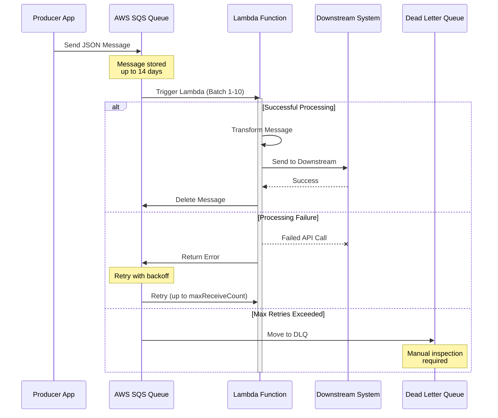

**Figure 2.1:** [Lambda](#glossary)+[SQS](#glossary) pipeline sequence showing message flow, retry logic, and [dead-letter queue](#glossary) handling

### Stream Processing Pipeline
Producers push events into a [Kafka](#glossary) topic (or [Kinesis Data Stream](#glossary)). A stream processor ([Flink](#glossary) or [Kafka Streams](#glossary)) reads from the topic, transforms messages in real time, and writes output to another topic or data sink. Multiple [consumers](#glossary) (analytics, storage, microservices) can simultaneously consume the same stream. This requires running and managing a stream processing cluster but enables simultaneous transformations and replay.

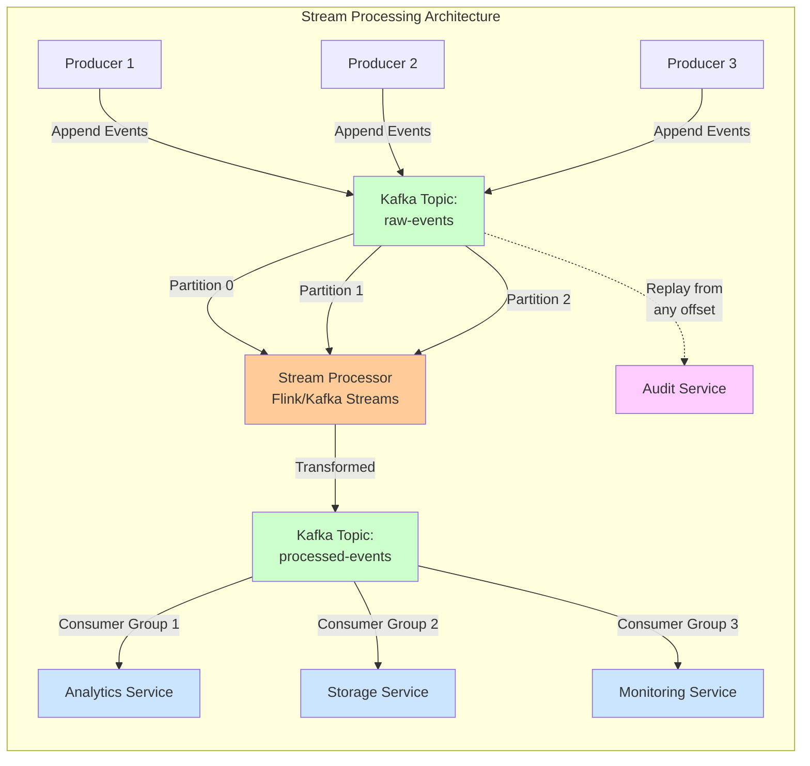

**Figure 2.2:** [Kafka](#glossary) stream processing architecture with multiple [consumer groups](#glossary) and replay capability

### Orchestrated Workflow
Each message triggers a [Step Function](#glossary) or [Temporal](#glossary) workflow. The workflow calls external services for each transformation step, using persistent state/checkpoints. Useful for multi-stage, stateful transformations (e.g. enrich, validate, store) or where compensating on error ([Saga](#glossary)) is needed. Higher control, lower concurrency, suitable for heavy or sequential tasks.

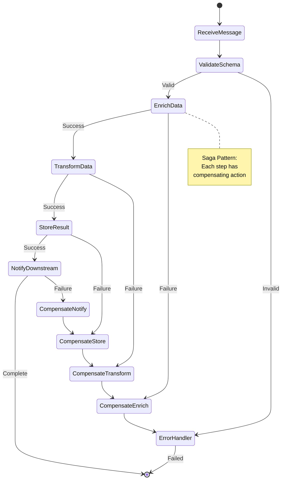

**Figure 2.3:** [Orchestrated workflow](#glossary) using [Step Functions](#glossary) with [Saga pattern](#glossary) for error compensation  

# 3. Scalability and Performance Analysis

**Potential bottlenecks.** In a Lambda+SQS design, common limits are: Lambda concurrency (1000 by default, adjustable), Lambda burst limits per region, and SQS visibility timeouts. For low volume (<1s concurrency), these are not a problem. Performance bottlenecks are more likely upstream/downstream: e.g. APIs of external systems that the Lambda calls, or database I/O. If transformations are CPU-bound (complex mapping or JSON processing), Lambda’s limited CPU (scales with memory) could limit throughput. A profiling step is advisable: measure latency of transformation itself vs I/O calls. Network I/O (calling external APIs) is often far slower than compute. 

**Scaling strategies.**  For more [throughput](#glossary), both vertical and horizontal scaling are options:
- *Horizontal (scale-out):* Increase [Lambda](#glossary) concurrency or add more [consumer](#glossary) services. With [SQS](#glossary), you can simply increase the number of [Lambdas](#glossary) reading (AWS handles more readers by default up to limits [o^Kafka vs SQS: Event Streaming Tools In–Depth Comparison │ DataCamp](https://www.datacamp.com/blog/kafka-vs-sqs#:~:text=non,smaller%20workloads%2C%20Kafka%20for%20larger)).  For Kubernetes or EC2 brokers, add nodes ([Kafka](#glossary) brokers, [Flink](#glossary) TaskManagers).
- *Vertical (scale-up):* In [Lambda](#glossary), allocate more memory (which also gives more CPU).  This will make each execution faster at a higher cost (though often minimal for our small load). For VMs/containers, move to larger instance types.
- Because 1K–10K msgs/hr is low, it's unlikely you'll hit any limit. For reference, [Kafka](#glossary) and [AWS Kinesis](#glossary) are designed to scale to **hundreds of MB/s** of ingress, far beyond these volumes [o^Evaluating Message Brokers: Kafka vs. Kinesis vs. SQS](https://dzone.com/articles/evaluating-message-brokers-kafka-vs-kinesis-vs-sqs#:~:text=Component%20%20,%24380) [o^Managed Apache Kafka – Amazon MSK pricing – AWS](https://aws.amazon.com/msk/pricing/#:~:text=brokers%20%3D%202%2C232%20hours%20,16).

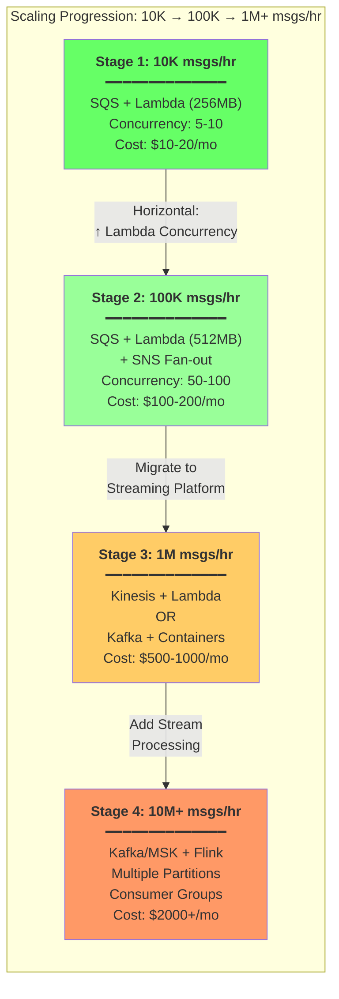

**Figure 3.1:** Scaling progression showing when to evolve from [queues](#glossary) to [streaming platforms](#glossary) based on volume  

**Transformation performance.**  A crucial question is how to best implement data transformations.  Common options include:
- Hand-coded transformations in a general-purpose language (e.g. JavaScript, Python).
- A declarative [DSL](#glossary) or template engine (e.g. [JSONata](#glossary), JOLT).
- Domain-specific languages or mapping tools (in-house [DSL](#glossary) or graphical mapping).

Regarding **[JSONata](#glossary) vs native code**: Benchmarks by NearForm show that [JSONata](#glossary) (a JSON transformation [DSL](#glossary)) is much slower than equivalent handwritten JavaScript.  In tests, native JS was *orders of magnitude* faster (sometimes hundreds of times) [o^The JSONata Performance Dilemma │ Nearform](https://www.nearform.com/insights/the-jsonata-performance-dilemma/#:~:text=The%20results%20of%20the%20benchmarks,they%20reinforce%20the%20same%20conclusion).  However, [JSONata](#glossary) dramatically reduces coding complexity.  NearForm's conclusion: for high-[throughput](#glossary) workloads (millions of requests/hour), the extra CPU cost of [JSONata](#glossary) is prohibitive [o^The JSONata Performance Dilemma │ Nearform](https://www.nearform.com/insights/the-jsonata-performance-dilemma/#:~:text=For%20the%20moment%2C%20I%20cannot,every%20CPU%20cycle%20becomes%20precious), whereas for integration pipelines its convenience outweighs the speed penalty.  In practice, if your transforms are simple field mappings/filters, native code is fastest. If they are very complex, a [DSL](#glossary) like [JSONata](#glossary) can boost development speed.  Weighing complexity vs performance: for 10K msgs/hr (~2.8M/day), even a 100× slowdown would likely be acceptable, since absolute CPU load remains small.

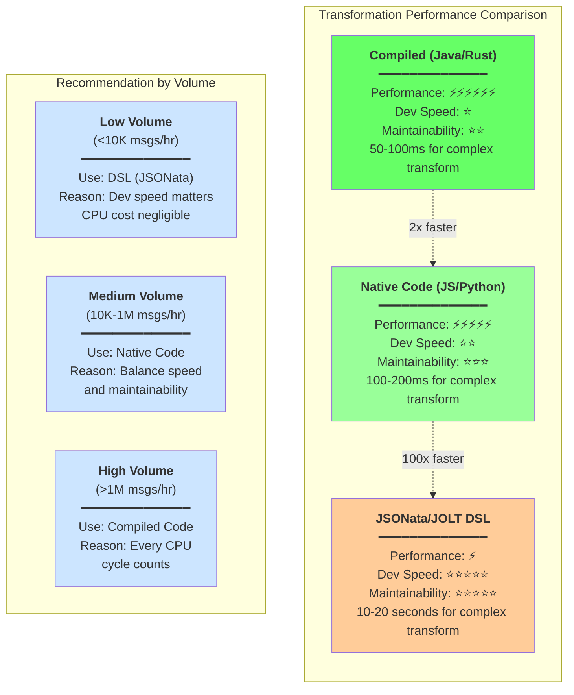

**Figure 3.2:** Transformation approach comparison showing performance vs development speed trade-offs  

**Memory and CPU.**  [AWS Lambda](#glossary) pricing ties CPU to memory.  Small [Lambda](#glossary) functions (128–256MB) have limited CPU, but for 10K msgs/hr (3/sec), even a modest function will have plenty of time ([Lambda](#glossary) defaults have 15 minutes timeout).  If a transform is heavy (loops or regex on large JSON), consider increasing memory (which proportionally increases CPU).  Alternatively, a container/ECS/Fargate task could provide more headroom for one heavy task.  Generally, design transformations to be stateless and fast; avoid large in-memory state in [Lambdas](#glossary).

**Network and I/O.**  If transformations involve external calls (APIs, DBs), batching or asynchronous calls can help. For example, [SQS](#glossary) `ReceiveMessage` can batch up to 10 messages at once, reducing per-request overhead.  Ensure downstream endpoints are not a choke point – maybe use another queue or cache results.  If output goes back into another queue, batching and asynchronous invocation reduce costs.  Also consider VPC overhead: [Lambdas](#glossary) in a VPC have extra cold-start [latency](#glossary).

**Performance benchmarks (example).**  To give an idea, the NearForm [JSONata](#glossary) tests showed that even a moderately complex JSON map on a modern laptop completes in ~100–200 ms in JS, versus tens of seconds in [JSONata](#glossary) [o^The JSONata Performance Dilemma │ Nearform](https://www.nearform.com/insights/the-jsonata-performance-dilemma/#:~:text=The%20results%20of%20the%20benchmarks,they%20reinforce%20the%20same%20conclusion).  If a [Lambda](#glossary) has 1s of execution (for network I/O), adding [JSONata](#glossary)'s overhead (say 50x slower) might add only a few seconds *per 10K messages*, which could be tolerable in an asynchronous system.  However, caution is warranted: end-to-end [latency](#glossary) could spike if messages pile up. Logging and metrics should be added to monitor queue depth and function durations in production.  

# 4. Custom Data Transformation in Streaming

**Transform in-stream vs out-of-stream.**  You can choose to perform transformations inside the [stream processing](#glossary) layer (e.g. [Kafka Streams](#glossary) mapping, [Flink](#glossary) operators), or have each message trigger a separate transformation service.  In-stream transforms (e.g. a [Flink](#glossary) job that reads, transforms, writes) are efficient for stateless, simple mappings and allow true [streaming](#glossary). But they add complexity: you must write and maintain the [streaming](#glossary) job. For simpler use cases, delegating transformation to [Lambdas](#glossary) or microservices (via message triggers or HTTP) may be easier.  The trade-off is that each message incurs function startup/teardown overhead (in FaaS) or network hop.

**Schema evolution and versioning.**  [Streaming](#glossary) systems typically encourage a schema-aware approach.  Using a schema registry (Avro/Protobuf/JSON Schema) is common in [Kafka](#glossary)/[Pulsar](#glossary).  Evolve schemas carefully (backwards/forwards compatible) to avoid breaking [consumers](#glossary).  For example, adding a field with a default is fine; removing or renaming fields requires [consumer](#glossary) changes.  Monitoring tools (e.g. Confluent's Schema Registry) can enforce compatibility rules.  In a simpler queue approach (JSON over [SQS](#glossary)), you should still track a version identifier in the payload and ensure [consumers](#glossary) know how to handle old vs new formats.

**Error handling and retries.**  In a stream, failed transformations can dead-letter to an error topic or queue ([DLQ](#glossary)) for later inspection.  This is safer than having messages disappear silently.  For example, [Kafka Streams](#glossary) allow you to catch exceptions per record; you can then send the bad event to a special [Kafka](#glossary) topic. [SQS](#glossary) has a built-in [DLQ](#glossary) feature for unprocessable messages.  Regardless, [idempotency](#glossary) is crucial: ensure retrying a transformation (due to redelivery) has no adverse effects.

**Stateful vs Stateless transforms.**  Most simple data mappings are *stateless* (each message transformed independently).  Do these in-stream or in a standalone function.  Stateful transforms (aggregations, joins across messages, counters) require explicit state (e.g. [Flink](#glossary)'s keyed state, or external storage).  E.g. "count messages per user over 5-minute windows" or "join enrichment data from another stream" need a [streaming](#glossary) engine.  For an inter-system translator, you generally only need stateless mapping; in that case, keeping transforms out-of-stream (e.g. [Lambdas](#glossary)) is often simpler.  

# 5. Alternative Architecture Patterns

**Hub-and-Spoke vs Point-to-Point.**  A **[hub-and-spoke](#glossary)** model uses a central bus (e.g. a [Kafka](#glossary) cluster or [AWS EventBridge](#glossary)) to route messages to subsystems. This decouples [producers](#glossary) and [consumers](#glossary) effectively: you just send all event types to the hub and have any number of subscribers.  A **[point-to-point](#glossary)** (peer-to-peer) model would have each service call the next one directly or use private queues.  That can be simpler for a small number of integrations, but quickly becomes unmanageable if adding more services.  For a translator service, a hub model (one or more central topics/queues) makes it easy to plug in new systems later.

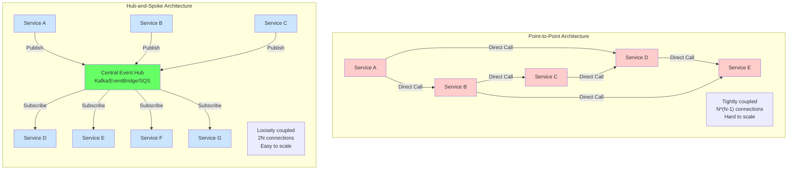

**Figure 5.1:** [Point-to-point](#glossary) architecture creates tight coupling vs [hub-and-spoke](#glossary) enabling loose coupling and scalability  

**Event Mesh/Global Eventing.**  Event mesh architectures interconnect event brokers across clouds/regions for global distribution.  Not needed here; it’s for very large-scale enterprises.  For our scale, a single AWS region’s queue or streaming service is sufficient.  

**Serverless vs Container-based processing.**  AWS Lambda and other FaaS are appealing for small tasks and infrequent events – you pay only per invocation.  However, they have limitations: execution time (15 min max), cold starts (millisecond overhead), and difficulty with very high throughput (you may hit concurrency limits at >1000 simultaneous invocations without raising quotas).  Containers (ECS, EKS, on-prem) run continuously and can handle bursts more transparently (assuming you provision enough).  For 10K msgs/hr, Lambda is very viable. If you planned to scale to, say, 100K msgs/hr, analyzing containerizing might make sense to ensure steady CPU usage. 

**Hybrid Batch/Streaming.**  Sometimes the simplest architecture is *not* 100% real-time.  For example, if latency requirements allow, you could batch-process messages every minute (using a short Cron or AWS Glue job).  This “micro-batch” approach can drastically reduce system complexity at the cost of, say, 1–5 minute latency.  Hybrid allows using streams for critical alerts but falling back to periodic jobs for heavy lifting.  If the team is only familiar with batch, they might start with scheduled jobs and incrementally adopt streaming for hot paths.  

**Service Mesh Considerations.**  A service mesh (Istio, AWS App Mesh) handles HTTP/gRPC traffic between microservices, not messaging per se.  If your translator is exposing a REST API or uses HTTP calls, a mesh can add monitoring and resilience.  But for asynchronous pipelines (queues, streams), it’s not directly applicable.  

# 6. Learning Path and Implementation Strategy  

**Start simple.**  Given a novice team, begin with what you know. A logical path:
1. **Implement a basic queue + function PoC.** For example, set up an [AWS SQS](#glossary) queue, a small [Lambda](#glossary) function that polls the queue and transforms a message, and outputs the result (maybe into another queue or S3).  Use AWS SAM or Serverless Framework for configuration.  This proves end-to-end flow and error handling.  Sample (Python) [producer](#glossary)/[consumer](#glossary) code:  

   ```python
   # Producer: send JSON to SQS
   import boto3, json
   sqs = boto3.client('sqs')
   queue_url = 'https://sqs.us-east-1.amazonaws.com/123456789012/MyQueue'
   message = {'id': 1, 'value': 42}
   sqs.send_message(QueueUrl=queue_url, MessageBody=json.dumps(message))
   ```  
   ```python
   # Lambda handler (consumer): transform message
   def handler(event, context):
       for record in event['Records']:
           data = json.loads(record['body'])
           transformed = some_transformation(data)
           print("Transformed:", transformed)
           # TODO: send to downstream (API call or another queue)
   ```  
   This illustrates how to use `event['Records']` from SQS in Lambda.  

2. **Learn one [streaming](#glossary) framework (conceptually).**  Install [Kafka](#glossary) or use [AWS MSK](#glossary) (or even [Kinesis Data Streams](#glossary)) and experiment with producing/consuming events.  Use a tutorial to create a [Kafka](#glossary) topic, push sample data, and consume it.  Understand [partitions](#glossary), offsets, [consumer groups](#glossary).  This builds intuition about replay and parallel consumption.

3. **Proof of Concept for each candidate.**  To genuinely compare, build minimal pipelines with each tech:
   - **[SQS](#glossary)+[Lambda](#glossary)**: What [latency](#glossary) do we see? Is ordering acceptable? How easy to deploy? What happens on failure?
   - **[RabbitMQ](#glossary) (or Amazon MQ)**: Similar to [SQS](#glossary) but self-hosted; test routing, durability.
   - **[Kafka](#glossary) ([MSK](#glossary))**: Stand up a small cluster or use a managed cluster. Write a simple [producer](#glossary)/[consumer](#glossary) in your preferred language (Java, Python). See how easy it is to replay. Compare [throughput](#glossary).
   - **[Redis Streams](#glossary)**: If you have a Redis cluster (or AWS ElastiCache Redis), try XADD/XREADGROUP in redis-cli for [streaming](#glossary).

   Code examples (postman or scripts) for each approach will teach handling [idempotency](#glossary), error retries, and operating the system.

4. **Migration path.** A common strategy is "start with queues, evolve to streams if needed."  For example, begin with [SQS](#glossary) + [Lambda](#glossary).  As requirements grow (multiple [consumers](#glossary), replay), consider introducing [Kafka](#glossary) or [Kinesis](#glossary). [Kafka](#glossary) can ingest from [SQS](#glossary) via connectors, or you might switch endpoints. Because [SQS](#glossary) and [Kafka](#glossary) concepts differ, build abstraction layers (e.g. always talk to a `MessageBroker` interface in code) to ease switching.

**When to invest in [streaming](#glossary).**  If future growth beyond 10K/hr is anticipated, or if audit/replay, ordering, and multiple fans of each message become requirements, plan for [streaming](#glossary) earlier.  But premature use is "overkill": [Kafka](#glossary) clusters have operational overhead and steep learning. A pragmatic rule: *Solve today's need with simplicity; retrofit [streaming](#glossary) when data volume or [consumers](#glossary) demand it*.

**Common pitfalls and how to avoid them:**  Typical mistakes include:
- **Over-engineering early.** Don't start with [Kafka](#glossary) or [Flink](#glossary) if traffic is low. Build MVP with [SQS](#glossary)/[Lambda](#glossary), measure real needs.
- **Neglecting [idempotency](#glossary).** If [lambdas](#glossary) or [consumers](#glossary) may receive duplicates ([SQS](#glossary) retry, [Kafka](#glossary) [at-least-once](#glossary)), make sure writes to targets are [idempotent](#glossary) (e.g. check if event was already applied).
- **Ignoring backpressure.** Modern designs should handle [consumer](#glossary) slowness. With [SQS](#glossary), if [Lambdas](#glossary) fall behind, the queue will fill and you could build alarms around queue depth. [Streaming](#glossary) systems buffer inherently, but still plan for flow control.
- **Skipping monitoring.** [Stream processing](#glossary) is invisible unless monitored. Integrate CloudWatch (for [Lambda](#glossary)/[SQS](#glossary)), or Kafka Manager/Confluent Control Center (for [Kafka](#glossary)). Track lag, error count, [throughput](#glossary).  

# 7. Cost and Operational Considerations  

**Total Cost of Ownership (TCO).**  Compare a managed AWS solution vs self-managed or third-party:  
- **Serverless (AWS Lmbd+SQS):** Low upfront cost. Pay per use. Extremely low ops cost (no servers to manage). For low throughput (1–10K/hr) this is cheapest. If usage spikes unpredictably, you pay only for bursts. However, at very high throughput, Lambda costs can grow (and SQS costs by request count).  
- **AWS Kinesis/MSK:** Moderate cost. Kinesis shards ($ per hour + PUT fees). For small scale, even one shard ($14/mo + PUT fees) can handle 1MB/sec [o^Evaluating Message Brokers: Kafka vs. Kinesis vs. SQS](https://dzone.com/articles/evaluating-message-brokers-kafka-vs-kinesis-vs-sqs#:~:text=Component%20%20,%241850). Kafka via MSK has a baseline monthly expense (hundreds of dollars) regardless of use. But it gives more throughput headroom.  
- **Open-source (RabbitMQ, Kafka self-managed):** No software license, but labor costs. Need to manage VMs/cluster (monitoring, upgrades). Possibly cheaper at scale than managed (avoid AWS premiums), but only if you have skilled ops.  

**Operational complexity and monitoring.**  AWS-managed services offload traditional devops.  SQS and Lambda need minimal routine maintenance – just watch metrics.  Kafka/Pulsar require active management: cluster health, partition rebalancing, disk usage, Zookeeper or metadata nodes.  According to Confluent, “Kafka [on MSK] is fully managed by AWS” but you are still responsible for configuration and application logic [o^Kafka vs SQS: Event Streaming Tools In–Depth Comparison │ DataCamp](https://www.datacamp.com/blog/kafka-vs-sqs#:~:text=non,Kafka).  In practice, you still need Kafka engineers or consultants.  

**Team skill requirements.**  Using simple queues means developers only need basic cloud and language skills.  Building stream processors (Kafka Streams, Flink, etc.) requires deeper knowledge of distributed systems, serialization formats, and debugging techniques.  If up-skilling the team is a goal, maybe pilot one streaming project in non-critical path.  But for core business workflows, factor in ramp-up time.  

**Vendor lock-in.**  
- AWS-Managed (SQS, Kinesis, AWS Lambda): very attractive for ease, but locks you to AWS. If you ever move off AWS, migrating queues and Lambdas can be time-consuming. SQS and Kinesis interfaces are proprietary.  
- Apache Kafka can run anywhere.  Using it (even on MSK) is more portable.  Confluent Cloud (Kafka as a service) or other brokers (Redpanda, Pulsar on Kubernetes) offer alternatives.  
- AWS also offers Amazon MQ (hosted RabbitMQ) if you prefer Rabbit without lock-in.  
- Redis Streams ties you to Redis (managed or self-host).  If you already use Redis, not much lock-in; if you’re adding Redis just for streaming, consider the shift.  

**Open Source vs Managed.**  
Managed services (MSK, ElastiCache, Amazon MQ, Kinesis) drastically cut ops, but cost extra.  Open source (run RabbitMQ on EC2, or Kafka on EC2/EKS) saves direct fees but adds engineer time.  For a small pipeline, the engineering cost usually outweighs any server savings, unless you already have infrastructure expertise.  

**Summary**: For the described volume (1–10K msgs/hr), a managed queue (SQS, SNS with Lambda) is nearly always the cheapest and simplest TCO, with virtually no maintenance. The AWS bill would be on the order of tens of dollars per month.  Adding MSK/Kinesis or self-hosted brokers jumps that to hundreds per month plus staffing costs. Monitor TCO as usage grows, but start with the lowest overhead.  

# 8. Real-World Case Studies and Lessons Learned

- **Engineers often start simple and then scale up.** Many companies begin with basic queues or databases and only move to streaming when needed. For example, **OpsClarity** originally used one SQS queue per customer. They quickly ran into limitations (no replay, duplication needed for multiple consumers) and switched to Kafka for multi-consumer streams [o^Evaluating Message Brokers: Kafka vs. Kinesis vs. SQS](https://dzone.com/articles/evaluating-message-brokers-kafka-vs-kinesis-vs-sqs#:~:text=metric%20data%20as%20well%20as,duplicating%20our%20metrics%20as%20below) [o^Evaluating Message Brokers: Kafka vs. Kinesis vs. SQS](https://dzone.com/articles/evaluating-message-brokers-kafka-vs-kinesis-vs-sqs#:~:text=Component%20%20,%241850).  This underscores that queues are great until you need features like multi-subscriber replay, then a log (Kafka) shines.  
- **Netflix and Amazon:** Large-scale companies like Netflix and Uber later build complex stream pipelines (Kafka + Flink, or AWS Kinesis+Lambda) to handle billions of events per day. But they only invest in these platforms after seeing real need. Startups often begin with SNS/SQS or simple pub/sub before moving to Kafka as scale demands.  
- **Failed implementations:**  On the flip side, cases where Kafka was adopted too early can stall projects.  For instance, teams that have tried spinning up a Kafka cluster without clear throughput needs report major time sunk in setup and ops, with little immediate payoff.  A common criticism: “We ended up spending more effort managing Kafka than solving our original problem.” This aligns with advice: *avoid over-engineering; only escalate complexity when justified*.  
- **Evolution stories:**  It’s instructive that many recommendations say “start with a queue or direct integration, evolve to streaming if consumers increase.”  For example, an ecommerce microservice might at first call next service synchronously or via a simple SQS queue.  Later, they add a Kafka or Kinesis pipeline when adding analytics, audit logs, or new real-time features. This staged approach allows a low-risk rollout of sophisticated architecture.  

**Lessons:** The prevailing advice in industry is to **be pragmatic**. In-scope: ensure the team can learn by doing small POCs; don’t assume Kafka or Flink “solves everything” out-of-the-box.  If the team lacks streaming experience, provide learning resources (e.g. Confluent tutorials, AWS Architectural Labs).  Accept that simpler solutions (Lambda+SQS with good logging and retries) will often meet objectives without undue complexity.  Only “pivot” to streaming architectures when clear pain points emerge (e.g. needing message replay for debugging or wanting to feed the same data to multiple analytics jobs [o^Evaluating Message Brokers: Kafka vs. Kinesis vs. SQS](https://dzone.com/articles/evaluating-message-brokers-kafka-vs-kinesis-vs-sqs#:~:text=metric%20data%20as%20well%20as,duplicating%20our%20metrics%20as%20below)).

# 9. Conclusions and Recommendations

**Is stream processing overkill?** For a system handling roughly 10–10K messages/hour, yes, **[streaming](#glossary) is likely overkill to start with**. [AWS Lambda](#glossary) + [SQS](#glossary) can handle that volume with minimal fuss and cost [o^Kafka vs SQS: Event Streaming Tools In–Depth Comparison │ DataCamp](https://www.datacamp.com/blog/kafka-vs-sqs#:~:text=Category%20%20,Kafka) [o^Message broker selection cheat sheet: Kafka vs RabbitMQ vs Amazon SQS / Habr](https://habr.com/en/articles/716182/#:~:text=Throughput%3A). Complex [streaming](#glossary) systems ([Kafka](#glossary), [Flink](#glossary)) bring powerful features but at much higher cost and complexity. The bar to justify them is far above 10K/hr – typically millions/day or very demanding use-cases.

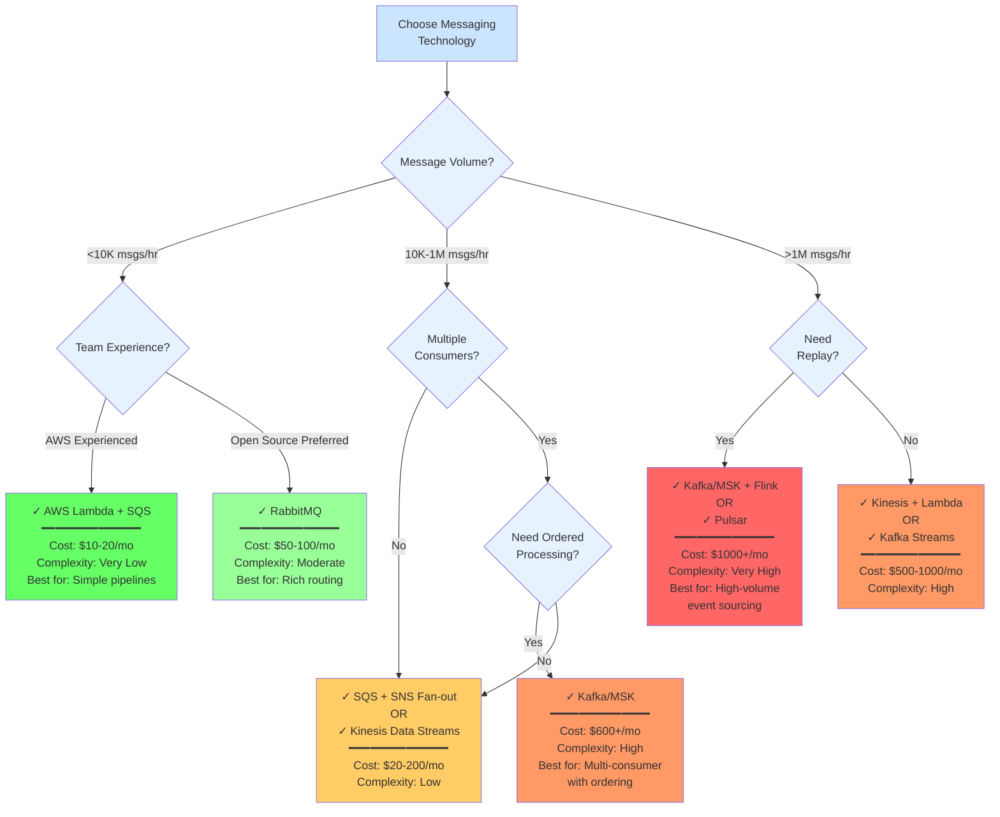

**Figure 9.1:** Decision tree for selecting messaging technology based on volume, requirements, and team capabilities  

**Should transformation be in-stream or separate?** Given the team’s inexperience, embedding transformations in an event-stream (Flink job) adds complexity. It may be simpler to have each SQS event trigger a Lambda (or small service) that does the transformation.  This keeps each component focused and easier to debug. In practice, for moderate loads, separating transformations (via Lambdas or microservices) is simpler and provides flexibility (e.g. implement transformations in any language or tool). Use in-stream transforms only if you move to Kafka/Streams in future and need high throughput or low latency at scale.  

**Simplest workable architecture and evolution path:** Start with **API/queue → single transformer service → output**. For example, API Gateway or producers push JSON to SQS; a consumer Lambda reads and calls the external system(s). Use durable logs (CloudWatch, or storing all raw messages in S3) for replay/debugging. This covers the core use-case with minimal moving parts. As requirements grow, you can evolve by:  
- Converting the Lambda to SNS fan-out if multiple consumers are needed.  
- Migrating to AWS Step Functions if orchestration (Saga style) becomes necessary.  
- Introducing an event log (Kafka or Kinesis) if you need multi-subscriber replay, strong ordering, or extensive analytics.  Connect Kinesis to existing Lambdas or new Kinesis Data Analytics jobs for scaling out when needed.  

**When streaming complexity is justified:** Only invest in a full stream processing stack when your workload or feature needs exceed what a queue can do. Indicators include:  
- Need **multiple independent consumers** reading the same data (e.g. analytics + monitoring + other services).  
- Requirements for **exact ordering** and **replay** (e.g. compliance auditing, log analysis).  
- Data volumes scaling to hundreds of thousands or millions of messages per hour.  

**Balancing learning vs practicality:** It’s valuable for the team to gradually learn streaming concepts. However, don’t let “learning” drive the architecture.  Use streaming concepts as long-term goals, but implement them tactically. For example, you might explore Kafka Streams or Kinesis Data Analytics on sample problems offline, without initially deploying them for production-critical flows. Use open-source emulators (MinIO + Redpanda, or Kinesis Data Generator) for inexpensive POCs.  

# 10. Actionable Summary

- **Queue vs Stream:** At ~10K msg/hr, stick with a managed queue (AWS SQS or RabbitMQ). Kafka/Pulsar cost and ops outweigh their benefits here [o^Kafka vs SQS: Event Streaming Tools In–Depth Comparison │ DataCamp](https://www.datacamp.com/blog/kafka-vs-sqs#:~:text=Category%20%20,Kafka) [o^Message broker selection cheat sheet: Kafka vs RabbitMQ vs Amazon SQS / Habr](https://habr.com/en/articles/716182/#:~:text=Throughput%3A). Reserve streams for high-volume or multi-subscriber needs.  
- **Lambda+SQS viability:** AWS Lambda+SQS is a good fit for decoupled pipelines at this scale.  Ensure messages are idempotent, set up a dead-letter queue for failures, and monitor queue depth.  However, beware that Looping Lambdas can hide complexity; keep transformations simple or test their performance in advance [o^The JSONata Performance Dilemma │ Nearform](https://www.nearform.com/insights/the-jsonata-performance-dilemma/#:~:text=The%20results%20of%20the%20benchmarks,they%20reinforce%20the%20same%20conclusion).  
- **Cost mindshare:** For low volume, Lambda+SQS costs virtually nothing (tens of dollars/month at most), whereas AWS MSK (Kafka) would be ~$600+/month [o^Managed Apache Kafka – Amazon MSK pricing – AWS](https://aws.amazon.com/msk/pricing/#:~:text=brokers%20%3D%202%2C232%20hours%20,16). Factor this into decisions.  
- **Transformation engine choices:** If using a DSL like JSONata, be aware it’s *much* slower than custom code [o^The JSONata Performance Dilemma │ Nearform](https://www.nearform.com/insights/the-jsonata-performance-dilemma/#:~:text=The%20results%20of%20the%20benchmarks,they%20reinforce%20the%20same%20conclusion). If performance becomes an issue later, optimize hot paths or move to a compiled language. For now, pick the approach that maximizes developer productivity—likely simple code or a well-known library.  
- **Keep it testable:** Write integration tests for each step. Mock external systems (use AWS::Local or stub). This helps validate before adding streaming complexity.  
- **Avoid unnecessary patterns:** E.g. don’t implement full CQRS/Sagas unless you have actual distributed transactions to coordinate. Over-engineering with patterns like DDD or event sourcing can add needless overhead for a simple translation task.  

Carefully justify each additional layer of complexity with a clear benefit metric (throughput, latency, features). In summary: *favor the 80% solution that solves 100% of current needs over the 100% solution that none of the team can maintain*. Keep the architecture as simple as possible (for example, SQS+Lambda), but design it so that you **can** replace the queue or add streaming later without rewriting everything.  

**Sources:** This analysis cites industry comparisons and benchmarks for messaging systems [o^Message broker selection cheat sheet: Kafka vs RabbitMQ vs Amazon SQS / Habr](https://habr.com/en/articles/716182/#:~:text=Throughput%3A) [o^Kafka vs SQS: Event Streaming Tools In–Depth Comparison │ DataCamp](https://www.datacamp.com/blog/kafka-vs-sqs#:~:text=Category%20%20,Kafka) [o^Kafka vs. JMS, RabbitMQ, SQS, and Modern Messaging – 2025 Edition](https://cloudurable.com/blog/kafka-vs-jms-2025/#:~:text=%60flowchart%20LR%20subgraph%20Performance%5B,br%3E50K%20msg%2Fsec) [o^Managed Apache Kafka – Amazon MSK pricing – AWS](https://aws.amazon.com/msk/pricing/#:~:text=brokers%20%3D%202%2C232%20hours%20,16), transformation performance tests [o^The JSONata Performance Dilemma │ Nearform](https://www.nearform.com/insights/the-jsonata-performance-dilemma/#:~:text=The%20results%20of%20the%20benchmarks,they%20reinforce%20the%20same%20conclusion), and AWS design patterns [o^Saga pattern │ Event–driven Architecture on AWS](https://aws-samples.github.io/eda-on-aws/patterns/saga/#:~:text=Managing%20data%20consistency%20across%20microservices,services%20in%20a%20microservices%20architecture) to ground all assessments in data and real-world experience.

---

# Glossary

## A

**AMQP** (Advanced Message Queuing Protocol)
An open standard application layer protocol for message-oriented middleware. Used by [RabbitMQ](#rabbitmq) and other message brokers to enable interoperability between different systems and vendors.

**Apache Flink**
A distributed stream processing framework providing true streaming (record-by-record processing), advanced state management, event-time processing, and exactly-once semantics. Requires managing a cluster but offers sophisticated capabilities for complex event processing and real-time analytics.

**Apache Kafka**
A distributed streaming platform that provides a durable, scalable log of events. Handles millions of messages per second with low latency (2-5ms). Messages are retained for configurable periods, enabling replay and multiple independent consumers. See also: [Kafka Streams](#kafka-streams), [AWS MSK](#aws-msk).

**Apache Pulsar**
A distributed streaming platform similar to Kafka but with a separate storage layer (BookKeeper) and built-in multi-tenancy. Provides high throughput (~4M msgs/sec) with 5-10ms latency and geo-replication capabilities.

**Apache Storm**
An older distributed stream processing framework known for very low latency (<5ms) but with limited state management. Largely superseded by newer engines like Flink and Kafka Streams.

**At-least-once delivery**
A message delivery guarantee where the system ensures every message is delivered one or more times. Messages may be duplicated due to retries, requiring idempotent consumers to handle reprocessing safely.

**AWS EventBridge**
A serverless event bus service from AWS that routes events between AWS services, integrated SaaS applications, and custom applications. Useful for implementing hub-and-spoke architectures.

**AWS Kinesis**
A family of AWS services for real-time data streaming. Kinesis Data Streams provides a durable log similar to Kafka, charged per shard-hour. Typically costs ~$20-25/month for low volume workloads.

**AWS Lambda**
A serverless compute service that runs code in response to events without provisioning servers. Commonly used with SQS for event-driven processing. Pricing is based on execution time and memory allocation. For 10K msgs/hr, costs approximately $5-15/month.

**AWS MSK** (Managed Streaming for Apache Kafka)
AWS's fully managed Apache Kafka service. Provides a 3-broker Kafka cluster starting at ~$620/month, handling cluster management, patching, and scaling while maintaining Kafka compatibility.

## B

**BookKeeper**
The distributed storage layer used by Apache Pulsar to separate compute from storage, enabling independent scaling and improved fault tolerance.

## C

**Consumer**
A service or application that reads and processes messages from a queue or stream. In queuing systems, messages are typically deleted after consumption. In streaming platforms, multiple consumers can read the same messages independently.

**Consumer Groups**
A mechanism in streaming platforms (Kafka, Pulsar, Redis Streams) where multiple consumer instances work together to process messages in parallel. Each message in a partition is delivered to only one consumer in the group, enabling horizontal scaling.

**CQRS** (Command Query Responsibility Segregation)
An architectural pattern that separates write operations (commands) from read operations (queries), often used with event sourcing to maintain different models optimized for writes vs reads.

## D

**Dead Letter Queue (DLQ)**
A special queue for messages that cannot be processed successfully after multiple retry attempts. Enables manual inspection and debugging of problematic messages without blocking the main processing flow.

**DSL** (Domain-Specific Language)
A specialized language designed for a specific application domain. Examples include JSONata for JSON transformations and SQL for database queries. DSLs offer higher-level abstractions but may have performance trade-offs compared to general-purpose languages.

## E

**Event Sourcing**
An architectural pattern where all changes to application state are stored as a sequence of immutable events in a durable log. Enables complete audit trails, state reconstruction, and temporal queries.

**Exactly-once**
The strongest message delivery guarantee where each message is processed exactly one time, with no duplicates or losses. Achieved through distributed transactions and deduplication mechanisms in systems like Kafka and Flink.

## F

**FIFO Queues** (First-In-First-Out)
Queue implementations that guarantee strict message ordering—messages are processed in the exact order they arrive. SQS FIFO queues provide this guarantee at slightly higher cost than standard queues.

**Flink**
See [Apache Flink](#apache-flink).

## H

**Hub-and-Spoke**
An architectural pattern where a central message broker or event bus (the "hub") routes messages to/from multiple services (the "spokes"). Provides loose coupling and simplifies adding new services compared to point-to-point architectures.

## I

**Idempotent**
A property where performing an operation multiple times produces the same result as performing it once. Critical for handling message redelivery in at-least-once delivery systems—processing the same message twice should not cause errors or duplicate side effects.

## J

**JSONata**
A declarative DSL for querying and transforming JSON data. Significantly slower than native code (100x+) but dramatically reduces development complexity for complex transformations. Recommended for low-volume pipelines where developer productivity matters more than raw performance.

## K

**Kafka**
See [Apache Kafka](#apache-kafka).

**Kafka Streams**
A Java library for building stream processing applications on Kafka topics. Provides true streaming with good state management and exactly-once semantics. Processing runs within application instances (no separate cluster required), making it simpler to operate than standalone frameworks like Flink.

**Kinesis Data Analytics**
AWS's managed service for real-time stream processing using Apache Flink under the hood. Simplifies Flink deployment by removing cluster management overhead.

**KRaft** (Kafka Raft)
Kafka's newer consensus protocol that eliminates the dependency on ZooKeeper for cluster metadata management, simplifying deployment and reducing operational complexity.

## L

**Lambda**
See [AWS Lambda](#aws-lambda).

**Latency**
The time delay between when a message is sent and when it is received/processed. Kafka offers lowest latency (2-5ms), followed by RabbitMQ (1-20ms), Pulsar (5-10ms), and SQS (100ms-1s). For low-volume workloads (<10K msgs/hr), all provide acceptable latency.

## M

**Message Queue**
A communication pattern where messages are stored in a queue until consumed. Traditional queues (SQS, RabbitMQ) typically delete messages after consumption and deliver to a single consumer. Optimized for modest throughput and simple decoupling of services.

**Micro-batch**
A stream processing approach that buffers events for a short time window (e.g., 100ms-1s) before processing them as a small batch. Used by Spark Structured Streaming. Simpler than true streaming but adds latency.

**MQTT** (Message Queuing Telemetry Transport)
A lightweight publish-subscribe messaging protocol designed for constrained devices and unreliable networks. Supported by RabbitMQ for IoT and mobile applications.

**MSK**
See [AWS MSK](#aws-msk).

## O

**Orchestrated Workflow**
A pattern where a central coordinator (like AWS Step Functions or Temporal) explicitly manages the sequence of steps in a multi-stage process, including error handling and compensation logic (Sagas).

## P

**Partition**
A division of a Kafka or Pulsar topic into ordered, immutable sequences of messages. Partitions enable parallelism (multiple consumers can read different partitions simultaneously) and provide ordering guarantees within each partition.

**Point-to-Point**
An architecture where services communicate directly with each other or through dedicated queues. Simple for few integrations but creates tight coupling and becomes unmanageable as the number of services grows (N*(N-1) connections).

**Producer**
A service or application that sends messages to a queue or stream. In streaming platforms, producers append events to a durable log that multiple consumers can read independently.

**Pulsar**
See [Apache Pulsar](#apache-pulsar).

## R

**RabbitMQ**
An open-source message broker supporting AMQP, MQTT, and other protocols. Offers flexible routing through exchanges (direct, topic, fanout) and handles ~1M msgs/sec. Requires managing broker infrastructure but provides richer messaging patterns than SQS.

**Redis Streams**
An in-memory append-only log built into Redis 5.0+. Supports consumer groups and replay semantics similar to Kafka but with memory-bound retention and limited horizontal scalability. Ideal for lightweight streaming when already using Redis.

## S

**Saga Pattern**
A design pattern for managing distributed transactions across microservices. Each step publishes events; if one fails, compensating actions are executed to undo previous steps, maintaining consistency without distributed locks.

**SNS** (Simple Notification Service)
AWS's pub/sub messaging service that can fan out messages to multiple subscribers (SQS queues, Lambda functions, HTTP endpoints). Often used with SQS to enable multiple consumers for the same messages.

**Spark Streaming**
See [Spark Structured Streaming](#spark-structured-streaming).

**Spark Structured Streaming**
A stream processing engine built on Apache Spark that uses micro-batching. Higher latency (~100ms+) than true streaming frameworks but integrates well with the Spark ecosystem for combined batch and streaming workloads.

**SQS** (Simple Queue Service)
AWS's fully managed message queue service. Costs $0.40 per million requests (first million free). Handles ~300K msgs/sec with 100ms-1s latency. For 10K msgs/hr workloads, total cost is ~$10-20/month including Lambda compute. Messages are deleted after consumption; supports FIFO queues for strict ordering.

**Step Functions**
AWS's serverless orchestration service for coordinating distributed applications and microservices using visual workflows. Supports Saga patterns with compensating transactions and error handling.

**Storm**
See [Apache Storm](#apache-storm).

**Stream Processing**
The continuous processing of unbounded data streams in real-time. Stream processors (Flink, Kafka Streams, Spark) perform operations like filtering, aggregating, windowing, and joining on data as it flows through the system.

**Streaming**
In this context, refers to data platforms (Kafka, Pulsar, Kinesis) that provide durable logs of events with retention, multiple consumer support, and replay capabilities. Distinguished from traditional message queues by treating data as an immutable, replayable log rather than transient work items.

**Streaming Platforms**
Systems like Apache Kafka, Apache Pulsar, and AWS Kinesis that provide durable, scalable logs of events with configurable retention. Enable multiple independent consumers, message replay, and high-throughput data pipelines. Typically overkill for workloads <1M msgs/day.

## T

**Temporal**
An open-source workflow orchestration platform that uses code to define durable, fault-tolerant workflows. Alternative to AWS Step Functions with more flexibility and portability across cloud providers.

**Throughput**
The volume of messages a system can process per unit time. Performance hierarchy: Kafka (>10M msgs/sec) > Pulsar (~4M msgs/sec) > RabbitMQ (~1M msgs/sec) > SQS (~300K msgs/sec). For 10K msgs/hr (~3 msgs/sec), all options provide far more throughput than needed.

## Z

**ZooKeeper**
A distributed coordination service previously required by Kafka for cluster metadata management. Being phased out in favor of KRaft in newer Kafka versions, reducing operational complexity.

---

**[Return to Top](#executive-summary)**