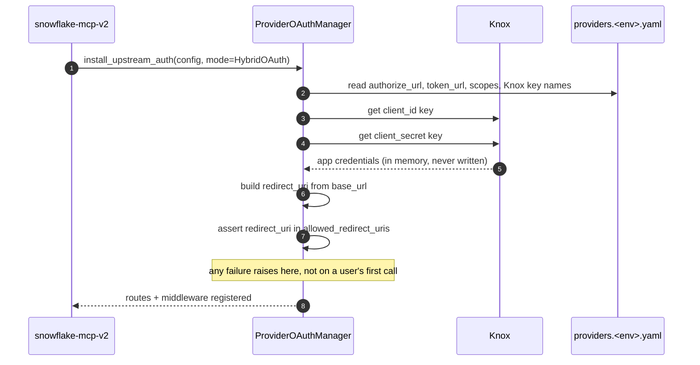
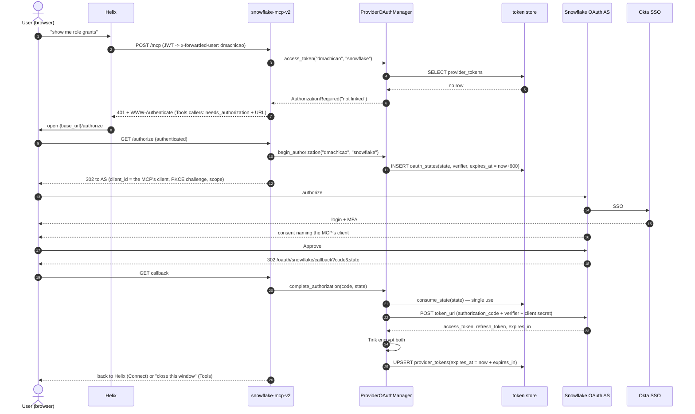
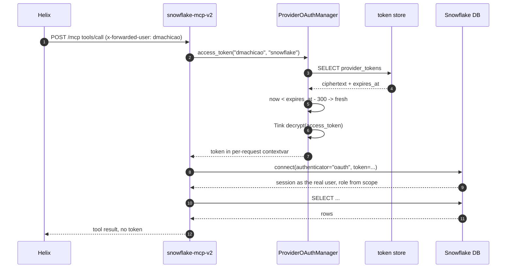
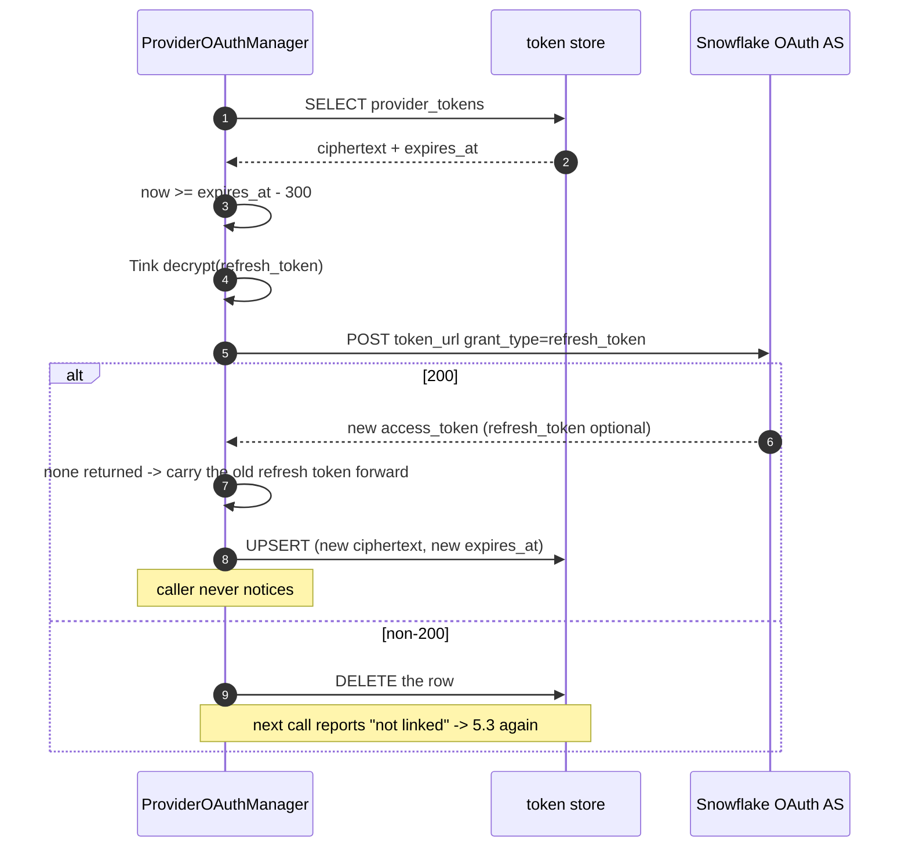

# Snowflake MCP v2 — how the shared OAuth library works

Review document. Everything here was read from source at optimus `3c1f4f6417`
(Mon Sep 14 2026). Nothing under `genai/model_context_protocol/oauth/` had
changed since Sep 11.

Primary sources:

| Claim area | File |
| --- | --- |
| Token lookup, refresh, revoke | `oauth/tokens/manager.py` |
| Authorize URL, code exchange, refresh, revoke HTTP | `oauth/tokens/flow.py` |
| Encryption at rest | `oauth/tokens/encryption.py` |
| User identity resolution | `oauth/tokens/identity.py` |
| SQLite schema | `oauth/tokens/sqlite_store.py` |
| SDS schema and prefixes | `oauth/tokens/sds_store.py`, `oauth/config.py` |
| Backend + isolation contract | `oauth/specs/STORAGE.md` |
| Staging/prod onboarding | `docs/oauth/tidb-sds-setup-process.md` |
| Current v1 auth | `servers/snowflake/auth/auth.py`, `servers/snowflake/clients/snowflake_client.py` |

---

## 1. What the Snowflake MCP does today (v1)

Verified in code, not from the README, which overstates it.

Two authentication paths, **neither per-user**:

- **SPIFFE path** — reads the SPIFFE ID from `x-forwarded-client-cert`, converts
  it to a Knox suffix, fetches
  `it:edp:snowflake:mcp:server:{env}:{suffix}:user` and `:private_key`.
- **JWT + Okta path** — builds `{sub}@pinterest.com` from the JWT, asks Okta for
  GMT groups, filters for `snowflake_`, walks the groups until a Knox key pair
  exists.

Both end at `snowflake.connector.connect(user=<service account>,
private_key=<RSA key>)`. Snowflake sees `SVC_SNOWFLAKE_PROD_...`, never the
human. Query attribution, RBAC, and row-level policy all evaluate as the shared
service account, and everyone in a GMT group is indistinguishable.

There is **no OAuth anywhere in v1**: no 401 challenge, no browser flow, no
token table. The word appears only incidentally in `auth/jwt_utils.py`.

---

## 2. Corrected mental model

### 2.1 Nothing is forged or minted

There is no impersonation, no token exchange, no on-behalf-of grant, and no
service-account-signed assertion. The library implements plain OAuth 2.0
authorization code with refresh tokens.

The only way a Snowflake token for a given human comes into existence is that
**the human opens a browser, logs in as themselves, and clicks approve.** Once.
The MCP then keeps the refresh token, encrypted, and uses it to obtain fresh
access tokens silently.

When a token expires, the MCP sends `grant_type=refresh_token` and *Snowflake*
mints the new token. The MCP never signs or issues anything on its own
authority. The practical consequence: **no prior human consent means no token
exists and none can be produced**, regardless of how valid the Helix JWT is.

### 2.2 The Pinterest JWT is a lookup key, not a credential

`tokens/identity.py` reads `x-forwarded-user` (the LDAP name the mesh resolved
from the JWT) and that string is the storage subject. Identity resolves to a
**row**; it is not traded for anything. Pinterest and Snowflake share no trust
relationship that would permit an exchange.

### 2.3 The consent screen names your MCP, not Helix

`build_authorize_url` sends `client_id = provider.client_id` — the OAuth client
*you* register at Snowflake or Okta for this MCP server. The consent dialog
names that client. Helix never appears in the flow; the provider has never heard
of it. Helix only sends a header identifying the human.

### 2.4 The library is in-process, not a service

It is a Python library running inside the Snowflake MCP process. There is no
separate broker deployment and no network hop. `install_upstream_auth(SERVER,
...)` bolts routes, middleware, and a token manager onto the same FastMCP app
that serves the tools. There is no `token_broker/` component anywhere in the
repo.

`tokens/` is the broker proper — YAML loading, Knox, encryption, store,
authorize/refresh/revoke. The rest of the library is *authorization delivery*.

### 2.5 The 401 is v2, not v1

The `401 + WWW-Authenticate` is **Connect mode in the new library**, one of two
ways v2 says "I have no Snowflake token for you yet."

| Caller | Delivery | When |
| --- | --- | --- |
| Helix (SPIFFE listed) | `401` + `WWW-Authenticate` on `POST /mcp` | At connect time |
| Cursor / Claude / Codex | Tool result with `needs_authorization` + `authorization_url` | On the first tool call needing it |

Same condition, two deliveries, both v2. `HybridOAuth` installs both and selects
per caller from the mesh-verified SPIFFE. **Both fire only when the token row is
missing.** After a user links, neither is ever seen again. Mistaking this for
the steady state is the most common misreading of the library.

---

## 3. Storage

### 3.1 What is in the tables

`provider_tokens`, primary key `(user_id, provider_id)` — one row per person per
provider:

| Column | Holds |
| --- | --- |
| `user_id` | `dmachicao` — LDAP name from `x-forwarded-user` |
| `provider_id` | `snowflake` |
| `access_token` | Snowflake's access token, Tink AES256-GCM ciphertext, base64 |
| `refresh_token` | Snowflake's refresh token, same encryption, nullable |
| `token_type` | `bearer` |
| `expires_at` | epoch seconds, `now + expires_in` at write time |
| `scopes` | what the provider granted |

`oauth_states` — in-flight consent only, deleted on callback:

| Column | Holds |
| --- | --- |
| `state` | opaque token, primary key |
| `user_id` | who the flow belongs to |
| `provider_id` | `snowflake` |
| `code_verifier` | PKCE verifier |
| `redirect_uri` | redirect used for this flow |
| `expires_at` | `now + 600` |

The row is a **cache of what Snowflake handed us**, encrypted, labelled with
whose it is.

### 3.2 Where the tables live, per environment

The `mcp_server_snowflake_` prefix applies **only to SDS**. SQLite uses bare
names; isolation there is the file.

| | DEV / devapp | Staging | Production |
| --- | --- | --- | --- |
| Backend | SQLite file | TiDB via SDS | TiDB via SDS |
| Where | `$OAUTH_DB_PATH` on local disk | database `mcp_oauth_dev` | database `mcp_oauth_prod` |
| SDS cluster | — | `shared-universal-dev` | `shared1-universal-prod` |
| Mesh cluster | — | `table.shareduniversaldev` | `table.shared1universalprod` |
| Table names | `provider_tokens`, `oauth_states` | `mcp_server_snowflake_provider_tokens`, … | identical names |
| Isolation | the file | Pastis on staging pod SPIFFE | Pastis on prod pod SPIFFE |
| Encryption key | local keyset `{db}.dev-token-key` | Knox `tink:aead:itswe:mcp_oauth:mcp_server_snowflake:staging` | same, `:prod` |
| Tables under Hybrid, no DCR | 2 | 6 | 6 |

**Two traps.**

1. Staging's database is literally named `mcp_oauth_dev`. Staging and devapp are
   unrelated despite the name. Pointing a devapp process at SDS is explicitly
   forbidden.
2. **`mcp_oauth_prod` does not exist yet.** No MCP has onboarded it. If Snowflake
   v2 reaches production it is the first, which means onboarding the database,
   the deny-by-default namespace pattern, and the
   `mcp_oauth_prod_tables_by_spiffe` map — not just adding six table
   directories.

Coupling to note: production TTL on the long-lived tables must equal the
provider's refresh-token lifetime. The Snowflake refresh-token lifetime is
therefore an input to the SDS schema, not only a UX question.

### 3.3 DEV restart behavior

The Tink keyset is written beside the database as `{oauth_db_path}.dev-token-key`,
so tokens survive a restart **only if `OAUTH_DB_PATH` is a real file**. With
`:memory:` the keyset is ephemeral and every restart forces re-linking.

---

## 4. Trust model

No single gate. Eight independent checks, each enforced by a different system.

| # | Question | Enforced by | Mechanism |
| --- | --- | --- | --- |
| 1 | Which workload is calling? | Mesh mTLS | SPIFFE in XFCC; selects Connect vs Tools |
| 2 | Which human is calling? | Envoy | Validates the ALF-minted Pinterest JWT, emits `x-forwarded-user` |
| 3 | May they run this tool? | Pastis sidecar | `@authorize_tool(policy=...)` |
| 4 | May this server talk to the provider? | Knox | Client id/secret scoped by MCP service id, never persisted |
| 5 | Can a DB dump be read? | Tink AES256-GCM | Key in Knox in staging/prod; rows are ciphertext |
| 6 | May this pod touch these tables? | Pastis + SDS | Deny-by-default namespace, per-SPIFFE allowlist of the exact 6 names |
| 7 | Is this browser round-trip genuine? | Library | PKCE S256, single-use `state` row (600 s TTL) bound to user + provider + redirect |
| 8 | Did codes go to the right host? | Library | `allowed_redirect_uris` checked at boot |

### 4.1 The actual zero-trust win

Blast radius. Today a leaked Knox key yields a Snowflake service account shared
by an entire GMT group, with no way to revoke one person. After v2, a compromise
yields one person's token, scoped to one Snowflake user and one role,
individually revocable, and self-expiring.

Check 1 is deliberately hardened: the caller is selected by mesh-verified SPIFFE
and never by `x-forwarded-user`, because a caller choosing its own header could
opt itself out of gating.

### 4.2 Where it is not zero trust

- **The library trusts `x-forwarded-user` and does not re-validate the JWT.**
  Stated in the `tokens/identity.py` docstring. Anything reaching the MCP port
  without traversing Envoy can assert any identity and read that user's token.
  Mesh-only ingress is what holds this up.
- **The MCP process is a single point of compromise.** It holds the Tink key and
  handles plaintext tokens in memory per call. Owning the pod means reading every
  linked user's token. Encryption at rest defends the database, not the process.
- **`force_delete` is break-glass** and leaves the upstream grant live.

---

## 5. Scenarios

### 5.1 Setup — before any code runs

Not a sequence; a checklist of what must already exist.

| Must exist | Devapp | Staging / prod |
| --- | --- | --- |
| Upstream OAuth client at Snowflake or Okta | yes | yes, one per stage |
| Redirect URI `{base_url}/oauth/snowflake/callback` | `https://mcp-devrestricted-dmachicao.pinterdev.com` | dedicated `.pinadmin.com` host |
| Knox client id + secret | or a DEV env pair | required |
| Knox Tink keyset | no, local file | required |
| Pinterest OAuth client (`internal_oauth.client` in pinconf) | skipped | required per stage |
| SDS tables + Pastis grant + Envoy `thrift.yaml` egress | skipped | required per stage |
| Per-user Snowflake identities and roles | yes | yes |

**Notes.** Ordering is load-bearing: the redirect URI must be registered at the
provider before the first consent, and `allowed_redirect_uris` must agree with
`base_url` before the process will boot. Staging and production are two separate
onboardings, not a promotion — the staging SPIFFE is explicitly denied access to
`mcp_oauth_prod`.

### 5.2 Process boot

**Not in the diagram.** The Tink keyset is *not* fetched here — it loads lazily
on the first encrypt or decrypt, then caches per key for the process lifetime.
Everything else is eager on purpose: a bad YAML, missing secret, or redirect
mismatch must kill the process at boot. This is also why `install_upstream_auth`
lives under `__main__` only — manifest generation and lint import the module and
must not need Knox or a database.

### 5.3 First login (linking) — happens once per user

**Not in the diagram.** The row is keyed on the user resolved from the
`/authorize` **browser session**, not from the tool call that triggered it —
that is why `/authorize` requires forwarded identity, and it is what stops
someone linking their Snowflake account into another person's row. The `state`
row is consumed atomically and checked against both the provider id and its
expiry, so a replayed callback fails.

### 5.4 Steady-state query

**Not in the diagram.** The token reaches the tool only through
`require_oauth_token`, which must be the innermost decorator;
`get_authorized_oauth_token` raises rather than falling back if it is missing.
The response model inherits a base that omits the authorization fields entirely
once `needs_authorization` is false, so a successful result cannot accidentally
carry auth metadata. On the Snowflake side, the token is validated at
`connect()` and the session then lives under Snowflake's own idle and session
policy — it can and will outlive the access token that opened it, which is
normal.

### 5.5 Rotation

**Not in the diagram.** The 300-second buffer fires rotation *before* expiry, so
a request never races the boundary. Delete-on-failure is the important behavior:
a rejected refresh (revoked grant, expired refresh token, rotated client secret)
is indistinguishable from unlinked, so the library discards the row rather than
retrying forever. That makes refresh-token lifetime the real re-consent cadence.
A decryption failure on either field takes the same path.

### 5.6 Unlink

Three host-exposed routes outside `/mcp`, authorized by the host's own Pastis
policy:

| Method | Contacts provider | Deletes row |
| --- | --- | --- |
| `token_status` | no | no |
| `revoke_and_delete` | yes | only if revocation succeeded |
| `force_delete` | **no** | always — break glass |

**Not in the diagram.** The ordering is the design. Deleting first would destroy
the refresh token that is the only credential capable of revoking the grant,
stranding a live Snowflake grant nobody can reach. A transient provider failure
therefore **keeps** the row and reports a retry outcome. A provider with no
`revoke_url` is refused outright rather than quietly degrading into
`force_delete`.

---

## 6. The four clocks

"Session expiry" is not one thing.

| # | Clock | Lifetime | What happens at the end |
| --- | --- | --- | --- |
| 1 | Snowflake access token | `expires_in` from the token response | Refreshed silently 300 s early |
| 2 | Snowflake refresh token | Set by the authorization server | Refresh fails, row deleted, user re-consents |
| 3 | `oauth_states` row | 600 s | Consent restarts; harmless |
| 4 | Snowflake session | Snowflake's own session/idle policy | Reconnect; library has no view of it |

Under Connect there is a fifth, fully independent pair: the opaque MCP access
and refresh tokens between Helix and the MCP, in `access_tokens` /
`refresh_tokens`. Those are "Helix to your MCP" and never touch Snowflake —
different trust boundary, different tables, deliberately never mixed with
`provider_tokens`.

Clock 2 is the one that determines whether v2 is pleasant or annoying, and it is
**unverified**. Snowflake's built-in OAuth caps refresh-token validity; the
current maximum should be confirmed before anything is designed around it.

---

## 7. Open decisions

Not yet resolved. Listed for the review conversation, not re-argued here.

1. **Upstream provider** — Snowflake built-in OAuth security integration, or
   Okta External OAuth with a Snowflake-audience authorization server. Neither
   exists today. Until one does, there is nothing for `providers.<env>.yaml` to
   point at.
2. **Per-user Snowflake identities** — an OAuth token authenticates a Snowflake
   *user*. Today only service accounts exist behind this MCP. Per-user auth needs
   per-person Snowflake users, grants, and a rule for which role a session
   assumes (encoded in the scope as `session:role:<ROLE>`). Owned by the
   Snowflake team.
3. **One-time consent is a product change** — today a Helix question just works
   because the service account is always there. After v2, each user is sent to a
   browser the first time, and again whenever clock 2 expires. Unavoidable with
   this library. If the acceptance criteria forbid user interaction, this library
   is the wrong tool.
4. **Staging/prod infrastructure** — dedicated `.pinadmin.com` host, per-stage
   Pinterest OAuth client wired as `internal_oauth.client`, Pastis principals for
   the browser hops, SDS egress, and the `mcp_oauth_prod` first-onboarding.
   Mostly non-code work.

### Environment status

| Item | State |
| --- | --- |
| Local optimus checkout | Current, `3c1f4f6417` |
| Devapp 1 `devrestricted-dmachicao` | optimus at `0d7ebdd97fc2`, Jul 9 2026 — **no `oauth/` package at all**; needs a pull |
| Devapp 2 `devrestricted-dmachicao-1` | No optimus checkout |
| ITEDP-2647 | Unread — no Atlassian MCP, no Jira CLI, browser allowlist blocks `pinterest.atlassian.net` |
