# Executive Summary

This comprehensive analysis evaluates modern open-source [pipeline orchestration](#glossary) frameworks for building event-driven, conditional data flows with low-latency requirements. The document examines code-first solutions in Go and Python across multiple dimensions: architecture patterns, performance characteristics, [reliability semantics](#glossary), and operational considerations.

## Key Findings

**Performance Tier Classification:**
- **Low-latency tier (sub-second):** [Benthos](#glossary) (Redpanda Connect) and [Apache Camel](#glossary) excel at real-time [API](#glossary)-to-[API](#glossary) processing with [HTTP](#glossary) ingress/egress
- **Medium-latency tier (1-10s):** [Prefect](#glossary) and [Dagster](#glossary) offer Python-native orchestration but carry runtime overhead
- **High-latency tier (10s+):** [Kestra](#glossary), [Temporal](#glossary), and [Argo Workflows](#glossary) provide rich state management and [durability](#glossary) at the cost of scheduling latency

**Recommended Architecture:** [HTTP](#glossary) ingress → durable message broker ([Kafka](#glossary)/[NATS JetStream](#glossary)/[RabbitMQ](#glossary)) → worker pods. This pattern decouples request handling from processing, enabling [backpressure](#glossary) management and multi-day message retention. [Kubernetes](#glossary) itself lacks native queueing capabilities—external brokers are essential for [at-least-once delivery](#glossary) guarantees.

**Framework Selection Criteria:**
- **For streaming pipelines (<100ms latency):** [Benthos](#glossary) offers Go-based performance, [Bloblang DSL](#glossary) transformations, and native broker integration
- **For enterprise integration:** [Apache Camel](#glossary) provides mature [EIP patterns](#glossary), multi-protocol support, and [JVM](#glossary) ecosystem benefits
- **For complex workflows:** [Kestra](#glossary) or [Temporal](#glossary) enable multi-step orchestration with audit trails and persistent state
- **For [Kubernetes](#glossary)-native operations:** [Argo Workflows](#glossary) leverages [CRD](#glossary)-based definitions and pod-per-task isolation

**Critical Performance Metrics:** [Kubernetes](#glossary) pod cold-start latency ranges from 5 seconds (cached images, 99th percentile) to tens of seconds (image pulls). For sub-second [SLA](#glossary) requirements, maintain warm pod pools or use [KEDA](#glossary) with pre-warmed replicas. [Benthos](#glossary) reports single-binary deployment with minimal memory footprint (few MB), while [JVM](#glossary)-based solutions ([Camel](#glossary), [Kestra](#glossary)) incur higher startup costs.

**Reliability Patterns:** Most frameworks implement [at-least-once semantics](#glossary) via retries and [dead-letter queues](#glossary). [Temporal](#glossary) uniquely provides effectively-once guarantees through event sourcing and [idempotent](#glossary) activity design. For true [idempotency](#glossary), all systems require application-level deduplication (cache-based or database-backed).

## Document Scope

This analysis covers:
- 12 framework evaluations (8 code-first, 4 visual/low-code alternatives)
- Comparison matrices across 12 evaluation dimensions
- [Kubernetes](#glossary) deployment patterns and scaling strategies
- State management and [reliability models](#glossary)
- Configuration examples in [YAML](#glossary), Go, and Java
- On-premises vs cloud trade-off analysis
- Licensing and community health assessment

Target audience: Platform architects designing real-time data pipelines, DevOps teams evaluating orchestration platforms, and engineering leaders comparing code-first vs visual workflow tools.

---

# Summary
We surveyed modern open-source [pipeline](#glossary)/[orchestration](#glossary) frameworks (code-first in Go/Python) for event-driven, conditional data flows. For near-real-time [API](#glossary)-to-[API](#glossary) processing ([HTTP](#glossary)-in, [REST](#glossary)-out) with rule-based branching, **[Benthos](#glossary) (Redpanda Connect)** and **[Apache Camel](#glossary)** stand out for low-latency [streaming pipelines](#glossary). Python-based [orchestrators](#glossary) like **[Prefect](#glossary)** or **[Dagster](#glossary)** work but have overhead and typically assume batch or scheduled runs. Heavier [orchestrators](#glossary) ([Kestra](#glossary), [Temporal](#glossary), [Argo](#glossary)) offer rich state and [reliability](#glossary) features but incur latencies in scheduling new work (seconds or more) and are better suited to asynchronous, long-running workflows. For the recommended architecture we advise an [HTTP](#glossary) ingress → durable queue ([Kafka](#glossary)/[NATS](#glossary)/[Rabbit](#glossary)) → worker-pod pattern.  [Benthos](#glossary) can serve as a high-performance worker, or one can write a custom Go [microservice](#glossary) (using [Benthos](#glossary)/[Bloblang](#glossary) libraries or [JSONata](#glossary)) for ultimate control.  [Kestra](#glossary) (or [Argo](#glossary)) may be chosen when complex, multi-step flows can be asynchronous (no immediate [HTTP](#glossary) response needed).  We note that [Kubernetes](#glossary) *itself* does not provide a message queue or [at-least-once delivery](#glossary); to achieve reliable delivery and "days" of buffering, one should add a broker (e.g. [Kafka](#glossary)/[JetStream](#glossary)) [o^Containerized Queues: Messaging in Kubernetes – Alibaba Cloud](https://www.alibabacloud.com/tech-news/a/message_queue/4ogpq8v03zt-containerized-queues-messaging-in-kubernetes#:~:text=Another%20advantage%20of%20containerized%20queues,is%20independent%20of%20the%20containers).  Some metrics: a well-tuned [Kubernetes](#glossary) pod start can be <5 s (99%ile with images cached [o^after a pod is scheduled, it should take < 5 seconds for apiserver to show it as running · Issue #3952 · kubernetes/kubernetes · GitHub](https://github.com/kubernetes/kubernetes/issues/3952#:~:text=match%20at%20L230%2099%25ile%20end,3954)), but cold-starts (image pulls, scheduling) commonly take **seconds to tens of seconds** [o^4 Proven Strategies to Speed Up Kubernetes Pod Boot Times](https://zesty.co/finops-academy/kubernetes/speed-up-pod-boot-times-in-kubernetes/#:~:text=If%20you%E2%80%99re%20running%20applications%20in,inflated%20costs%2C%20and%20lost%20revenue). Frameworks like [Kafka](#glossary)–based connectors ([Benthos](#glossary)) or [KEDA](#glossary) can reduce scale-up latency, but warm pods are still recommended for <100 ms responsiveness.  

# Architecture Diagrams

## Recommended Kubernetes Architecture Pattern

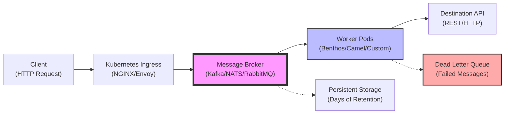

## Benthos Architecture

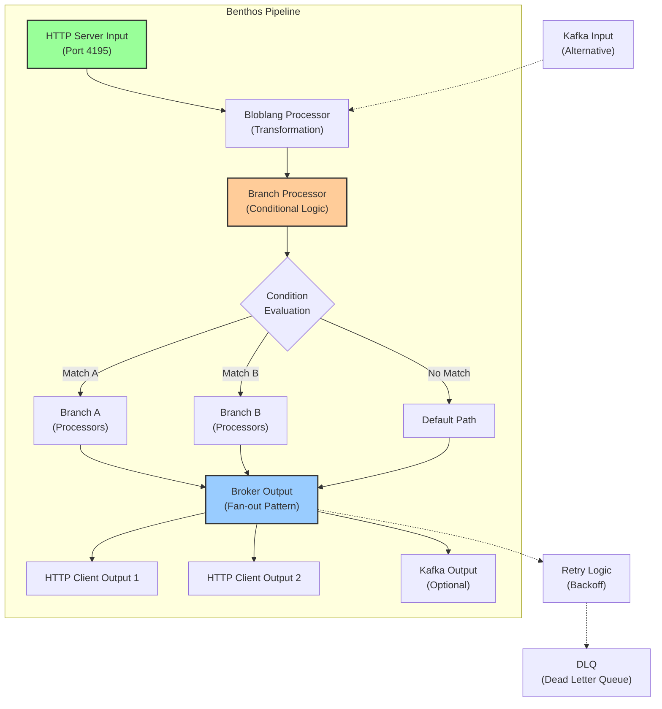

## Temporal Workflow Architecture

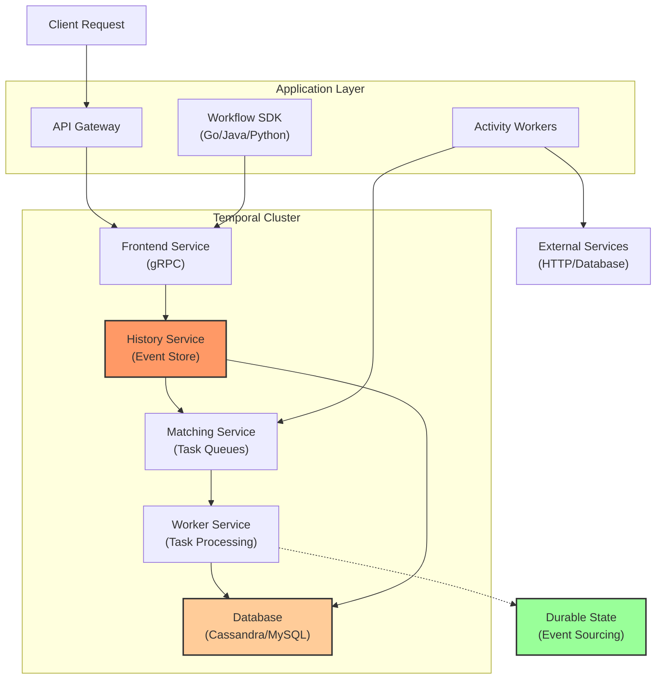

## Airflow DAG Execution Flow

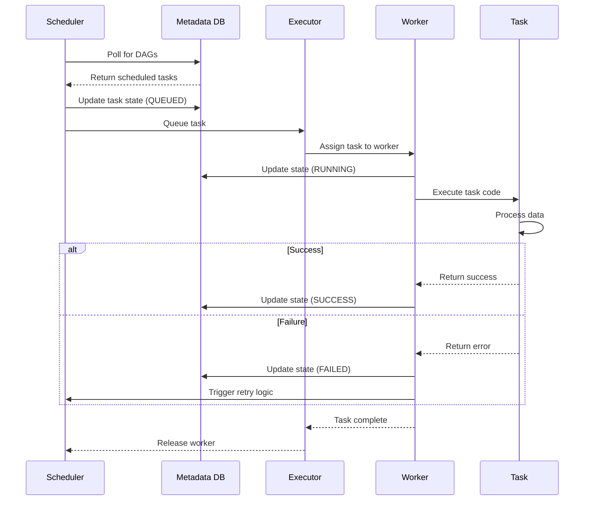

## Framework Latency Comparison

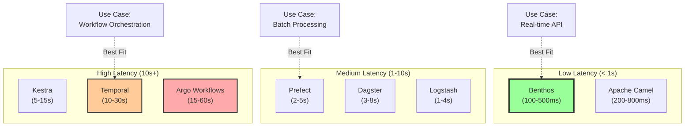

## Kestra Flow Execution Sequence

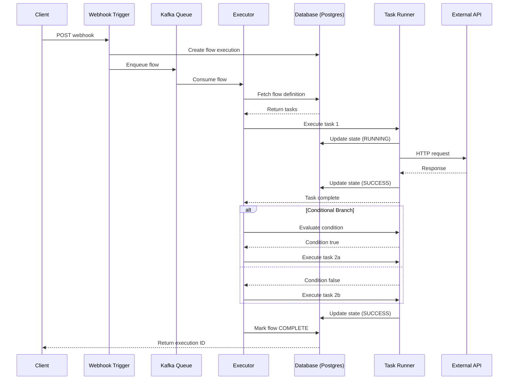

## Apache Camel EIP Routing Pattern

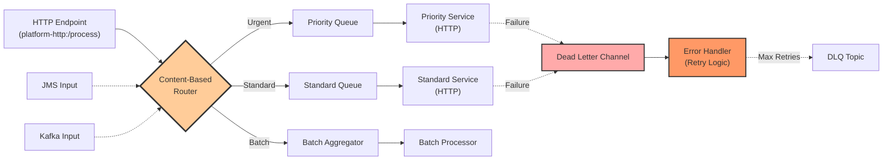

## Kubernetes Pod Lifecycle & Scaling

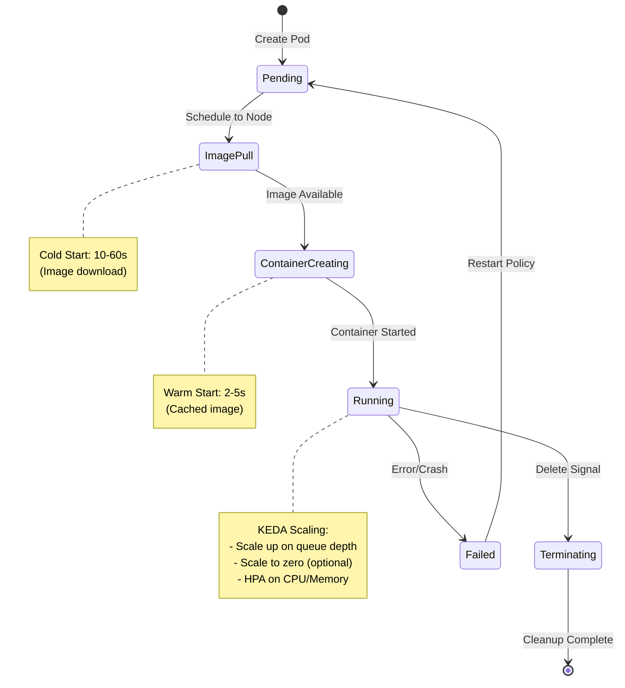

## Message Delivery Semantics Comparison

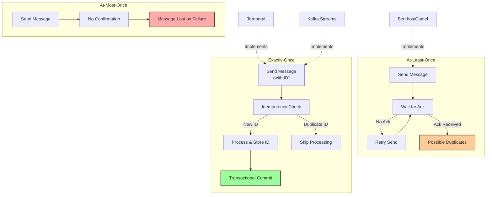

## Argo Workflows DAG Pattern

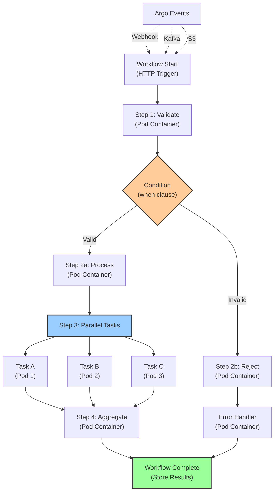

## State Management Models

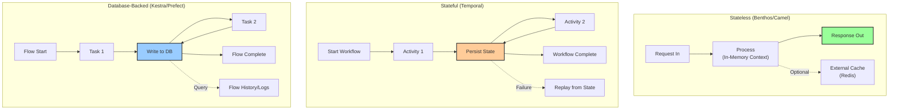

## Cloud vs On-Premises Trade-offs

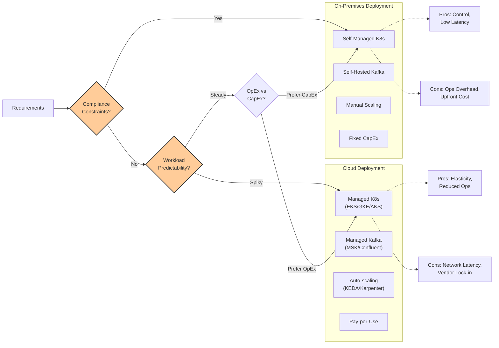

---

# Shortlist & Recommendations
**[Benthos](#glossary) ([Go](#glossary), now Redpanda Connect)** – A high-throughput stream-processing engine with built-in **[HTTP](#glossary) server input**, transformation [DSL](#glossary) ([Bloblang](#glossary)), conditional branching, and broad connector support. It's designed for low-[latency](#glossary) ("single binary… few MB of memory" [o^Redpanda acquires Benthos to expand its end–to–end streaming data platform │ TechCrunch](https://techcrunch.com/2024/05/30/redpanda-acquires-benthos-to-expand-its-end-to-end-streaming-data-platform/#:~:text=complete%20end,%E2%80%9D)) and can read from/write to queues ([Kafka](#glossary), [NATS](#glossary), etc.) and [HTTP](#glossary). [Benthos](#glossary) is MIT-licensed and open source [o^Redpanda acquires Benthos to expand its end–to–end streaming data platform │ TechCrunch](https://techcrunch.com/2024/05/30/redpanda-acquires-benthos-to-expand-its-end-to-end-streaming-data-platform/#:~:text=Indeed%2C%20Redpanda%20has%20already%20integrated,the%20two%20previously%20mentioned%20connectors). It natively supports branching (via the `branch` processor [o^branch │ Benthos](https://v4.benthos.dev/docs/components/processors/branch#:~:text=Conditional%20Branching%E2%80%8B)) and "[fan-out](#glossary)" outputs [o^broker │ Benthos](https://v4.benthos.dev/docs/components/outputs/broker#:~:text=%60%20output%3A%20label%3A%20,0%20byte_size%3A%200%20period%3A). Error handling includes retries and [DLQs](#glossary) (especially when using [brokers](#glossary)). Because it's pure [Go](#glossary), it's lightweight and container-friendly (fast startup, minimal footprint). We recommend [Benthos](#glossary) (Redpanda Connect) for most [streaming](#glossary) pipelining needs.

**[Apache Camel](#glossary) (Java/[JVM](#glossary))** – A mature integration framework supporting [YAML](#glossary) or Java [DSLs](#glossary) (including Camel K/Kamelets for cloud-native [YAML](#glossary)). [Camel](#glossary) has rich [enterprise integration patterns](#glossary) ([EIPs](#glossary)) including **filters**, **content-based routers** (`choice`), [HTTP](#glossary) endpoints (`rest:` or `platform-http`), and error-handling (DeadLetterChannel). It carries mutable "Exchange" context (headers/properties) and can use various expression languages (Simple, SpEL, OGNL, etc.) for rules. [Camel](#glossary) runs on the [JVM](#glossary) (or as lightweight native via Quarkus), so [cold starts](#glossary) can be slower. It fits well in [K8s](#glossary) (via Spring Boot or Karavan). Use [Camel](#glossary) if you need [JMS](#glossary)/[HTTP](#glossary) multi-protocol integration or existing Java expertise. For simple [HTTP](#glossary)->[REST](#glossary) [pipelines](#glossary), it works but is heavier than [Benthos](#glossary). (License: Apache 2.0.) 

**[Kestra](#glossary) (Java)** – An open-source [workflow](#glossary) [orchestrator](#glossary) (declarative [YAML](#glossary)). It is event-driven ([webhook](#glossary) triggers, cron, or queue triggers) and supports conditional branching (via an `If` [task](#glossary) [o^If](https://kestra.io/plugins/core/tasks/flow/io.kestra.plugin.core.flow.if#:~:text=type%3A%20io.kestra.plugin.core.flow.If%20condition%3A%20,Log%20message%3A%20%27Condition%20was%20false)), retries, and persistent state in a backing store. It has a built-in UI/metadata store (with Postgres) and queues [tasks](#glossary) internally. Because it uses a database and a thread pool, [Kestra](#glossary) incurs seconds of scheduling overhead per [task](#glossary), so it's not ideal for sub-second synchronous flows, but excels at complex chains (e.g. [fan-out](#glossary) flows, retries, long-running [tasks](#glossary)). Choose [Kestra](#glossary) when you need [durable](#glossary) audit/history or coordinating multi-step processes asynchronously.

**[Temporal](#glossary) ([Go](#glossary)/Java)** – A [workflow](#glossary) engine with *[durable](#glossary), stateful* [workflows](#glossary). It provides *[exactly-once](#glossary)* processing semantics via [event sourcing](#glossary) ([idempotent](#glossary) by design). Developers write [workflows](#glossary) as code ([Go](#glossary)/Java/…). [Temporal](#glossary) handles retries, versioning, and "activities" in [tasks](#glossary). However, there's no built-in [HTTP](#glossary) trigger; you must call a [gRPC](#glossary)/SDK [API](#glossary) to start a [workflow](#glossary). Input can come from an [API](#glossary) gateway that invokes a [Temporal](#glossary) [workflow](#glossary). [Latency](#glossary) tends to be high for short [tasks](#glossary) (since each activity call involves RPC), but it shines when you want guaranteed end-to-end [reliability](#glossary). (License: MIT.) Think of [Temporal](#glossary) like an [orchestration](#glossary) [microservice](#glossary); it's powerful if [durability](#glossary) > [latency](#glossary).

**[Prefect](#glossary) (Python)** – A Python-native [workflow](#glossary) engine. [Prefect](#glossary) 2.0 (Open Source + cloud) lets you define flows and [tasks](#glossary) in code, with retries and triggers. It supports some conditional logic but is mainly code-driven. You can trigger flows via [API](#glossary)/[webhook](#glossary). [Prefect](#glossary) is more commonly used for data [pipelines](#glossary), and uses a local agent/Orion backend (Postgres) for state. For near real-time [HTTP](#glossary) processing, [Prefect](#glossary) can be used ([HTTP](#glossary)-triggered [tasks](#glossary)), but the overhead of running a Python event loop or a [Prefect](#glossary) "flow run" may add [latency](#glossary). Observability via [Prefect](#glossary) dashboard and logs. (License: Apache/BSD-like.) We list it for Python affinity, but note it may be heavier than [Benthos](#glossary)/[Camel](#glossary).

**[Dagster](#glossary) (Python)** – Another Python-based data [pipeline](#glossary) framework, with an [orchestrator](#glossary) and a UI. [DAGs](#glossary) ("[pipelines](#glossary)") and solids ("[tasks](#glossary)"). It has rich typing and assets, but less built-in for ad-hoc [HTTP](#glossary) triggers (you'd call the CLI/[API](#glossary) to launch). Like [Prefect](#glossary), it's geared to [ETL](#glossary) jobs, not optimized for sub-second paths. Useful for teams already on Python and building complex data flows. (Apache 2.0 license.)

**[Argo Workflows](#glossary) (+ Argo Events)** – A [Kubernetes](#glossary)-native [workflow](#glossary) engine. You define [Workflows](#glossary) ([DAGs](#glossary)/steps) as [CRDs](#glossary) ([YAML](#glossary)). Argo Events can trigger [workflows](#glossary) via [HTTP](#glossary)/[webhook](#glossary) or message buses. Each step runs as a [Kubernetes](#glossary) [Pod](#glossary), so [cold-starts](#glossary) are on the order of **seconds** ([pod](#glossary) creation) [o^after a pod is scheduled, it should take < 5 seconds for apiserver to show it as running · Issue #3952 · kubernetes/kubernetes · GitHub](https://github.com/kubernetes/kubernetes/issues/3952#:~:text=match%20at%20L230%2099%25ile%20end,3954). [Argo](#glossary) is great for containerized [tasks](#glossary) and parallel steps, but its [latency](#glossary) makes it unsuitable for strict low-[latency](#glossary) requirements unless [pods](#glossary) are pre-warmed. Use [Argo](#glossary) when operating fully on [Kubernetes](#glossary) and [tasks](#glossary) require containerized environments (e.g. heavy processing). (License: Apache 2.0.)

**[Logstash](#glossary) (ELK)** – A Java-based log [pipeline](#glossary) tool (Elastic Stack). It has an [HTTP](#glossary) input plugin [o^Http input plugin │ Logstash Reference [8.19] │ Elastic](https://www.elastic.co/guide/en/logstash/current/plugins-inputs-http.html#:~:text=,the%20queue%20is%20busy%2C%20and) and various filters, but is optimized for logs/metrics, not general [API](#glossary) payload routing. Recent versions use Elastic's SSPL/Elastic License (non-issued). It can filter and route messages (with conditionals in the [pipeline](#glossary)), but error-handling is basic. We mention [Logstash](#glossary) only for completeness – it fits less well for [API](#glossary)-triggered branching [pipelines](#glossary).

**Flink (Java/Scala)** – A stream-processing framework (with SQL/CEP). Very powerful for continuous event processing (high-throughput, low-[latency](#glossary)), but is heavier (requires a cluster) and oriented to fixed queries or batch/stream jobs. Likely overkill: it's not code-first in Python/[Go](#glossary), and it lacks easy built-in [HTTP](#glossary) triggers (though you could integrate via [Kafka](#glossary) or [HTTP](#glossary) sources).

**Other [Go](#glossary)/Python libraries** – There are smaller [Go](#glossary) flow libs (e.g. SciPipe) and [FaaS](#glossary) frameworks: e.g., OpenFaaS or Knative. These can chain functions or handle [webhooks](#glossary), but they are not specialized in conditional [DAG](#glossary) logic. For example, you could write a [Go](#glossary) [microservice](#glossary) listening on [NATS](#glossary) ([JetStream](#glossary)) and performing sequential processing (reusable code). We include these as architectural patterns (see later), but they lack a declarative [pipeline](#glossary) [DSL](#glossary) out of box.

**Visual/Low-Code (for contrast)** – [Apache NiFi](#glossary), [Node-RED](#glossary), n8n, Apache Hop, etc. These provide drag-and-drop UIs and many connectors. [NiFi](#glossary) (Apache, Java) is powerful for flow-based data routing, but is not code-first. [Node-RED](#glossary) (Node.js) and n8n (JS) allow [HTTP](#glossary) triggers and logic, but are visual and less appealing if you prefer code. Hop (Apache) is a GUI [ETL](#glossary) tool. We de-emphasize these since the user wants code/config oriented solutions, but they exist (and can be cited as less suitable for a "code-first, one-time config" approach).

# Comparison Tables  

**(1) Code-First / Declarative Frameworks:**  

| Framework         | Language/Runtime      | DAG/Branch/Rules           | Shared Context Model     | HTTP I/O        | Latency Suitability     | Error Handling (Retries/DLQ/etc.)    | Persistence/Backpressure  | Extensibility (Python/Go)         | K8s Deployment Fit           | Observability           | License       | Maturity (stability)       |
|-------------------|-----------------------|----------------------------|--------------------------|-----------------|-------------------------|--------------------------------------|---------------------------|--------------------------------------|-----------------------------|-------------------------|--------------|----------------------------|
| **Benthos (Redpanda Connect)** | Go (single binary) [o^Redpanda acquires Benthos to expand its end–to–end streaming data platform │ TechCrunch](https://techcrunch.com/2024/05/30/redpanda-acquires-benthos-to-expand-its-end-to-end-streaming-data-platform/#:~:text=complete%20end,%E2%80%9D) | Sequential processors, *branch* nodes (Bloblang maps; conditional via `deleted()`) [o^branch │ Benthos](https://v4.benthos.dev/docs/components/processors/branch#:~:text=Conditional%20Branching%E2%80%8B) | Per-message JSON + metadata (immutable message, can add metadata) | HTTP server input & client output [o^http_server │ Benthos](https://v3.benthos.dev/docs/components/inputs/http_server#:~:text=Receive%20messages%20POSTed%20over%20HTTP%28S%29,and%20cert%20files%20are%20specified) | *Low latency (hundreds of µs to ms)*; well-suited for streaming [o^Redpanda acquires Benthos to expand its end–to–end streaming data platform │ TechCrunch](https://techcrunch.com/2024/05/30/redpanda-acquires-benthos-to-expand-its-end-to-end-streaming-data-platform/#:~:text=complete%20end,%E2%80%9D) | Configurable retries/DLQ for outputs (e.g., broker fan-out retries) [o^broker │ Benthos](https://v4.benthos.dev/docs/components/outputs/broker#:~:text=); supports idempotence by design through offset-based inputs | Stateless worker; uses external queues for durability/backpressure (Kafka, NATS, etc.) [o^broker │ Benthos](https://v4.benthos.dev/docs/components/outputs/broker#:~:text=With%20the%20fan%20out%20pattern,passes%20through%20Benthos%20in%20parallel) | Plugins in Go (custom processors) and Bloblang DSL; also supports WASM/JS in scripting proposals [o^branch │ Benthos](https://v4.benthos.dev/docs/components/processors/branch#:~:text=) | Excellent (lightweight container); built-in health/metrics endpoints | Built-in metrics (Prometheus) and logs; optional Swagger | MIT (open source) [o^Redpanda acquires Benthos to expand its end–to–end streaming data platform │ TechCrunch](https://techcrunch.com/2024/05/30/redpanda-acquires-benthos-to-expand-its-end-to-end-streaming-data-platform/#:~:text=Indeed%2C%20Redpanda%20has%20already%20integrated,the%20two%20previously%20mentioned%20connectors) | High (v4.x, used widely in industry) |
| **Apache Camel**   | Java (JVM) or GraalVM | Rich EIPs: *choice/when*, *filter*, *split*, *content-based router*, etc.; supports OGNL, SpEL, WL, Java, etc. | “Exchange” (message + headers/properties) | HTTP via *jetty*, *platform-http*, or *camel-http4*; can expose REST endpoints | Moderate (JVM startup slower); can use Quarkus for faster native | DeadLetterChannel, OnException, etc. for retries; idempotent consumer for dedupe | Stateful only via external components (e.g. JMS transactions, Kafka); supports backpressure via synchronous blocking | High: Java DSL, Spring XML, or YAML (Camel K) for config; many components (JMS, HTTP, DB) | Good (run as Spring Boot/Quarkus); requires JVM image | JMX/metrics support; logs; tracing plugins | Apache 2.0 | High (v3/v4 LTS) |
| **Kestra**        | Java (Kotlin-based)   | Declarative DAG of tasks; *If/choice* task; loops; sub-flows | Flow run context held in DB; tasks share context via state | HTTP webhook trigger via `core.trigger.Webhook` [o^Setup Webhooks to trigger Flows](https://kestra.io/docs/how-to-guides/webhooks#:~:text=triggers%3A%20,a%20secret%20key%3A%201KERKzRQZSMtLdMdNI7Nkr) (also SQS/Kafka triggers in EE) | Higher overhead (seconds) for each execution; suited to async flows | Task-level retries, DLQ options; persistence of run state in Postgres/Kafka | Built-in queues (Kafka-based) for tasks with retention (default ~7d) [o^Configuration](https://kestra.io/docs/configuration#:~:text=match%20at%20L1515%20username%3A%20%24,kestra.ee.license.fingerprint%3A%7D); persistent DB for retries | Extend via plugins (Java/Kotlin); integrations limited to built-ins | Containerized; needs external DB (Postgres) and Kafka (optional) | Web UI/metrics; logs stored in DB; supports Prometheus | Apache 2.0 | Medium (v1.0 LTS released) |
| **Temporal**      | Go, Java (SDKs)      | Code-defined workflows (arbitrary control flow in code) | Durable workflow state (history) in persistence store; each task returns; | No native HTTP input (start via SDK call or custom API) | High latency (hundreds of ms to sec for setup/calls); for long-running workflows | Automatic retries with backoff; “At-least-once but exactly-once by workflow design” (idempotent activities) | Built-in DB (Cassandra/MySQL) with change log; can ack tasks to ensure replay | Extend via code (Go/Java libraries); custom activities | K8s operator available; heavy (multiple services) | Metrics via Prometheus; visibility through web UI | MIT (open source) | High (production at Uber, etc.) |
| **Prefect**       | Python              | DAGs of tasks defined in Python; conditional logic via control-flow (no native *if*, but can call functions) | Flow context variables passed between tasks (Python objects) | Flow runs started via REST API; no dedicated HTTP trigger component | Medium (Python invocation overhead); best for scheduled/batch tasks | Task retries configurable; logs for failures; no built-in DLQ (rollbacks) | Uses local/Cloud backend for state; no built-in broker (user can integrate with queue) | Python functions as tasks; can call arbitrary Python code | Prefect Agent can run on K8s; requires DB for backend | Prefect UI (if used), logs via stdout; some Prom metrics | Apache/BSD-type (Prefect Core is Apache) | Growing (Prefect 2.0 fairly new) |
| **Dagster**      | Python              | DAGs of “ops” and “graphs”; can use conditions in code (still code-first) | No persistent cross-run state by default; context passed per run | Start flows via CLI/API; HTTP triggers possible via API | Medium; not designed for high-throughput events | Retry policies, failure hooks; materializations for outputs (user-managed DLQ) | Uses intermediate storage (filesystem, S3) for data; no built-in queue | Python with type annotations; extends via custom code | Can run in K8s (Dagster-UI, daemon); requires Postgres | Dagster UI for runs; logs; metrics support via Telemetry | Apache 2.0 | Medium (used in analytics pipelines) |
| **Argo Workflows**| YAML/CRD (K8s)      | Directed acyclic flows with `steps` or `DAG`; supports `when` conditions in DAG syntax | Each workflow is isolated; context via artifacts; no shared state except external stores | Triggers via Argo Events (webhook, Kafka, etc.); no built-in HTTP server | High (pod startup latency ~5–10s) [o^after a pod is scheduled, it should take < 5 seconds for apiserver to show it as running · Issue #3952 · kubernetes/kubernetes · GitHub](https://github.com/kubernetes/kubernetes/issues/3952#:~:text=match%20at%20L230%2099%25ile%20end,3954); not for sub-second paths | Step retries (retryStrategy); no DLQ – failed workflow/state must be handled externally | Workflow CRDs persisted in etcd; no native queue (use Argo Events or external brokers) | Steps are containerized tasks; write code in any language in containers | Native on K8s (CRD); must manage Argo controller | Argo UI/CLI; good logs; Prometheus metrics | Apache 2.0 | High (CNCF project, production-tested) |
| **Logstash**      | JVM (JRuby)         | Pipeline of inputs→filters→outputs; predicates (`if` in config) | Event object (fields, metadata) mutated by filters | HTTP input plugin (experimental) [o^Http input plugin │ Logstash Reference [8.19] │ Elastic](https://www.elastic.co/guide/en/logstash/current/plugins-inputs-http.html#:~:text=,the%20queue%20is%20busy%2C%20and); many outputs (Kafka, HTTP, etc.) | Moderate (JVM); optimized for batch of events (not single-event microservices) | Filter errors drop or tag; can retry on output failures (with limited control) | Can buffer events in queue buffer; no durable storage (unless using persistent queue plugin) | Custom filters/plugins in Ruby/Java | Runs in container; heavy footprint | Talks to Elastic (ELK); logs to console or output; basic stats | Elastic License (formerly Apache2) | Long used (ELK stack) |

*Notes:* Benthos’s Bloblang supports rich data transformations (JSON queries, regex, math, etc.) with built-in branches [o^branch │ Benthos](https://v4.benthos.dev/docs/components/processors/branch#:~:text=If%20the%20root%20of%20your,you%20to%20conditionally%20branch%20messages). Camel supports many Expression/Lang for routing.  Kestra’s default installation uses Postgres and Kafka, with topics defaulting to ~7-day retention [o^Configuration](https://kestra.io/docs/configuration#:~:text=match%20at%20L1515%20username%3A%20%24,kestra.ee.license.fingerprint%3A%7D).  None of these (except Temporal) guarantee exactly-once delivery; most follow at-least-once semantics via retries.  For idempotency, designs must ensure the endpoints can handle duplicate events (e.g. by keying).  

**(2) Visual/Low-Code Tools (contrast):**  

| Tool       | Lang/Runtime   | Branching/Rules         | Context Model          | HTTP I/O      | Latency          | Error Handling       | Persistence    | Extensibility        | K8s Fit           | Observability      | License           | Maturity  |
|------------|----------------|-------------------------|------------------------|---------------|------------------|----------------------|----------------|----------------------|-------------------|---------------------|-------------------|-----------|
| **Apache NiFi**  | Java          | Drag-&-drop flows; routes, filters; Expression Language | FlowFile attributes (mutable) | HTTP (ListenHTTP input, InvokeHTTP output) | High (designed for streaming logs, not microsecond-priority) | Retries can be configured per processor; dead branches, DLQs via other flows | FlowFile persistence, replay queues | Custom processors in Java | Yes (NIH; deployment via containers) | Built-in UI, provenance, metrics | Apache 2.0 | High (in use for big data) |
| **Node-RED**     | Node.js       | Flow editor; “switch” or function nodes for conditionals | Message object (mutable JSON) | HTTP In/Out nodes built-in | Moderate (as Node app) | Catch/Link nodes for errors; no built-in DLQ | No inherent persistence (runs in-memory) | JavaScript functions; NPM nodes | Containerizable; lighter than NiFi | Built-in web UI, debug console | Apache 2.0 | High (popular prototyping tool) |
| **n8n**          | Node.js       | Visual workflow; IF branches via “IF” nodes | JSON objects (mutable) | HTTP webhook trigger; HTTP request node | Moderate | Workflow error handling via flows; no DLQ (self-host “webhook node” supports 425 retry) | Push/pull queues (External credentials tasks) | Custom nodes (TypeScript) | K8s-ready (official helm); lightweight | UI, logs, limited metrics | SSPL (custom “Sustainable Use” license) | Growing (open-core) |
| **Apache Hop**   | Java          | GUI DAG builder (previously PDI); conditional hops | Pixelated PP/metric processing (pipeline context layered) | HTTP plugins exist | Moderate | Hop  supports transactions and error hops; limited in-flow error DLQ | None by default (relies on databases/files) | Custom transforms (Java) | Runs standalone or on Kubernetes via helm | GUI, logs, basic metrics | Apache 2.0 | Medium (recently moved to Apache) |

*Notes:* These tools are GUI-centric; while they can perform similar tasks, they require visual design and often lack easy code-based automation. For a “code-first, configure-once” preference, they are less aligned (we list them only as a contrast).

# Architecture Options on [Kubernetes](#glossary)

A recommended pattern for [REST](#glossary)→[REST](#glossary) real-time [pipelines](#glossary) is: **Ingress/[API](#glossary) Gateway → [Message Broker](#glossary)/Queue → [Worker](#glossary) [Pods](#glossary)**. The [HTTP](#glossary) client sends events to your ingress (e.g. NGINX/Envoy/Knative Net), which enqueues the request in a durable buffer ([Kafka](#glossary), [NATS JetStream](#glossary), [RabbitMQ](#glossary), etc.). [Worker](#glossary) [pods](#glossary) then consume the queue, execute the [pipeline](#glossary) (via [Benthos](#glossary), [Camel](#glossary), or custom code), and POST results to destination [APIs](#glossary).

- **Option A: [Benthos](#glossary)-based Workers.** Deploy [Benthos](#glossary) (Redpanda Connect) [pods](#glossary) reading from the queue or [HTTP](#glossary). For example, [Benthos](#glossary) can consume [Kafka](#glossary) topics and output to [HTTP](#glossary) based on conditions. It will handle batching, retries, and [backpressure](#glossary) natively (since [Kafka](#glossary) blocks if outputs back up) [o^broker │ Benthos](https://v4.benthos.dev/docs/components/outputs/broker#:~:text=). Pros: single self-contained binary, fast ([Go](#glossary)), extensive config for JSON/[HTTP](#glossary)+, built-in [HTTP](#glossary) input/output. Cons: Limited to the provided processors/[DSL](#glossary); complex logic can become hard to manage in [YAML](#glossary).

- **Option B: [Go](#glossary) [Microservice](#glossary) ([Benthos](#glossary)/[Bloblang](#glossary) or [JSONata](#glossary)).** Write a custom [Go](#glossary) service using the [[Benthos](#glossary) SDK](https://github.com/benthosdev/benthos) or libraries like [Bloblang](#glossary) for transformation. This gives ultimate flexibility and performance. For example, you might use [[NATS JetStream](#glossary)](https://docs.nats.io/nats-concepts/jetstream) or [Kafka](#glossary) client to pull messages, apply [Bloblang](#glossary) mappings or [JSONata](#glossary) expressions, and then send [HTTP](#glossary) requests. Pros: Full control, minimal overhead. Cons: More development effort; you must implement conditional routing/branching logic in code.

- **Option C: [Kestra](#glossary) Flow [Orchestration](#glossary).** Deploy [Kestra](#glossary) as a service (with Postgres/[Kafka](#glossary)). Use [webhook](#glossary) triggers (or [Kafka](#glossary) triggers) to start flows. Each [task](#glossary) in the flow could be a "core.http" [task](#glossary) or a container [task](#glossary) calling an [HTTP](#glossary) [API](#glossary). Since [Kestra](#glossary) is heavier (Java), use it only if synchronous response is not required. It excels when flows require logging, state tracking, or complex chains of subtasks (with retries, parallel branches). Pros: Visual UI and built-in retries/logs, persistent state (can resume flows). Cons: [Latency](#glossary) ([Kafka](#glossary) round-trips, DB writes) likely tens of seconds for small flows; requires additional infrastructure.

On [Kubernetes](#glossary), [pods](#glossary) can be auto-scaled via the HorizontalPodAutoscaler ([HPA](#glossary)) on CPU/memory, or better via [[KEDA](#glossary)](https://keda.sh/) which can scale on queue length or [HTTP](#glossary) requests. Note: [KEDA](#glossary)'s [HTTP](#glossary) add-on can scale from zero on incoming [HTTP](#glossary) traffic, but this still incurs [pod](#glossary) start [latency](#glossary). In practice, you may keep a small warm pool of [pods](#glossary). In benchmarks, a new [pod](#glossary) hit ~12 s start time in a test cluster (worse case) [o^What is expected distribution for a Kubernetes pod startup time – Stack Overflow](https://stackoverflow.com/questions/49491204/what-is-expected-distribution-for-a-kubernetes-pod-startup-time#:~:text=On%20my%20test%20cluster%2C%20starting,time%2C%20or%20configuring%20the%20cluster), whereas tuned clusters with pre-pulled images can bring 99% of startups under ~5 s [o^after a pod is scheduled, it should take < 5 seconds for apiserver to show it as running · Issue #3952 · kubernetes/kubernetes · GitHub](https://github.com/kubernetes/kubernetes/issues/3952#:~:text=match%20at%20L230%2099%25ile%20end,3954). For sub-second [SLAs](#glossary), we thus recommend maintaining a few replicas ready for traffic.

Importantly, *[Kubernetes](#glossary) itself is not a message queue*. To achieve [at-least-once delivery](#glossary) semantics, use a [broker](#glossary): e.g. **[Kafka](#glossary)** or **[NATS JetStream](#glossary)** can persist messages for "days" (configurable retention) [o^Configuration](https://kestra.io/docs/configuration#:~:text=match%20at%20L1515%20username%3A%20%24,kestra.ee.license.fingerprint%3A%7D). [NATS JetStream](#glossary), [RabbitMQ](#glossary), or Redis Streams can also store events until consumed. In [Kubernetes](#glossary), you would run these as stateful services (or use a managed service in cloud). This decoupling ensures that if [worker](#glossary) [pods](#glossary) crash, unacknowledged messages remain on the [broker](#glossary) [o^Containerized Queues: Messaging in Kubernetes – Alibaba Cloud](https://www.alibabacloud.com/tech-news/a/message_queue/4ogpq8v03zt-containerized-queues-messaging-in-kubernetes#:~:text=Another%20advantage%20of%20containerized%20queues,is%20independent%20of%20the%20containers). [Benthos](#glossary) or custom-[go](#glossary) [workers](#glossary) then pull from these queues. 

In summary, a canonical on-K8s architecture:  

```
Client --> K8s Ingress (API Gateway) --> [Kafka/NATS/RabbitMQ] --(consumed by worker)--> Worker Pod (Benthos/Camel/Go) --> Destination API
```

# State & [Reliability](#glossary) Models

**Per-run vs [Durable](#glossary) State:** Most [pipeline](#glossary) frameworks treat each message execution as isolated. They carry a *context* (message payload plus metadata) through the [DAG](#glossary), but that context lives only in-memory during execution. For example, [Benthos](#glossary) copies a message and its metadata along the [pipeline](#glossary) [o^branch │ Benthos](https://v4.benthos.dev/docs/components/processors/branch#:~:text=Metadata%20fields%20that%20are%20added,and%20so%20on). Temporary caches ([Benthos](#glossary) `cache` resource, [Camel](#glossary)'s aggregator, etc.) provide local state during processing, but none of the code-first tools natively maintain cross-run state (beyond what you integrate).

By contrast, systems like [Temporal](#glossary) or [orchestration](#glossary) engines persist state between steps. [Temporal](#glossary) stores the exact state of [workflow](#glossary) execution (so it can recover or replay). [Kestra](#glossary) and [Prefect](#glossary) record run logs and outputs in a backing store (DB or S3). Some frameworks allow an external cache (Redis/Memcached) or database to be used for lookups (e.g. for deduplication or correlation). For instance, Cougar integration by [Camel](#glossary), user-managed caches in [Benthos](#glossary).

**[Reliability Semantics](#glossary):**

- *[At-Least-Once](#glossary):* Most [pipeline](#glossary) tools follow [at-least-once delivery](#glossary). If a step fails, it can be retried, but this may re-deliver the same data. [Benthos](#glossary) with durable inputs ([Kafka](#glossary)) ensures messages aren't lost and will retry until success [o^broker │ Benthos](https://v4.benthos.dev/docs/components/outputs/broker#:~:text=With%20the%20fan%20out%20pattern,passes%20through%20Benthos%20in%20parallel). [Camel](#glossary)'s [JMS](#glossary) or [Kafka](#glossary) connectors similarly ensure delivery (or put into [Dead Letter queues](#glossary) after retries). [Kestra](#glossary)'s [tasks](#glossary) run until success and record state, effectively [at-least-once](#glossary) (unless explicitly deduplicated). [Prefect](#glossary)/[Dagster](#glossary) rerun failed [tasks](#glossary), again [at-least-once](#glossary).

- *[Exactly-Once](#glossary):* True [exactly-once](#glossary) is hard. [Temporal](#glossary) achieves "effectively-once" by making activities [idempotent](#glossary) and logging every event: it guarantees that each logical event is applied once as long as activities are deterministic. [Kafka](#glossary) Streams and KSQL (not covered here) can do transactional [exactly-once](#glossary). Bitcoin etc not in scope. In practice, to approach [exactly-once](#glossary), you use [idempotency](#glossary) keys or dedupe caches. For example, [Benthos](#glossary) can include a "cache" processor to drop duplicates if seen [o^branch │ Benthos](https://v4.benthos.dev/docs/components/processors/branch#:~:text=If%20the%20,or%20recover%20the%20failed%20messages). [Camel](#glossary) has an *idempotentConsumer* [EIP](#glossary).

- *Best-Effort:* Some lightweight [pipelines](#glossary) (e.g. a simple [Go](#glossary) code with no [DLQ](#glossary) logic) might simply drop or log failures. We avoid recommending these for critical flows. All tools above can be configured for retries and [DLQs](#glossary), except some (e.g. [Prefect](#glossary)/[Dagster](#glossary) rely on external repo or user code for [DLQs](#glossary)).

**Mechanisms:** Typical mechanisms are `[retry](#glossary)` clauses (with backoff), [Dead Letter Topics/Queues](#glossary) (bouncing bad events into a [DLQ](#glossary) for manual review), and [idempotency](#glossary) stores (to filter retries). [Benthos](#glossary) has built-in [retry logic](#glossary) on outputs [o^broker │ Benthos](https://v4.benthos.dev/docs/components/outputs/broker#:~:text=If%20an%20output%20applies%20back,from%20receiving%20unbounded%20message%20duplicates) (blocks on failure by default) and supports piping failures to a separate output. [Kestra](#glossary) [tasks](#glossary) have retry parameters. Canonical practice: respond with 5xx to failed requests so the [broker](#glossary) re-delivers, and use a cache or DB to record processed message IDs.

**Days of Retention (Buffering):** To buffer events when downstream is down, we recommend using a **durable log** like [Kafka](#glossary) or [NATS JetStream](#glossary). [Kafka](#glossary) topics can be configured with several days of retention (e.g. 7+ days by default [o^Configuration](https://kestra.io/docs/configuration#:~:text=match%20at%20L1515%20username%3A%20%24,kestra.ee.license.fingerprint%3A%7D) or longer). [JetStream](#glossary) allows similar stream-based retention and replay. [RabbitMQ](#glossary) with persistence or Redis Streams are alternatives. Then each framework connects: [Benthos](#glossary) has native [Kafka](#glossary)/[NATS](#glossary) support; [Camel](#glossary) has connectors; [Temporal](#glossary)/[Kestra](#glossary) can be triggered by [Kafka](#glossary); [Prefect](#glossary)/[Dagster](#glossary) would need a custom hook. The queue itself provides [backpressure](#glossary): if consumers lag, [Kafka](#glossary) will naturally block producers or buffer (at least until disk fills) [o^Configuration](https://kestra.io/docs/configuration#:~:text=match%20at%20L1515%20username%3A%20%24,kestra.ee.license.fingerprint%3A%7D). 

# Example Configs / Snippets  

**Benthos (YAML)** – HTTP-input to HTTP-output with a conditional branch:  
```yaml
input:
  http_server:
    address: ":4195"
    path: /ingest
pipeline:
  processors:
    - bloblang: |
        root = this
        # Tag messages for routing
        root.destination = if this.age > 18 { "adult" } else { "child" }
    - branch:
        # Only process child branch if marked
        request_map: |
          root = deleted()
          if this.destination == "child" { root = this }
        processors:
          - extract:
              field: {path: ".*", format: "json"}
        result_map: |
          root.child_result = this.payload
output:
  broker:
    pattern: fan_out
    outputs:
      # Adults -> /api/adult
      - http_client:
          url: "http://law-enforcement.local/api/adult"
      # Children -> /api/child
      - http_client:
          url: "http://guardian.local/api/child"
```
This Benthos config (v4 syntax) shows an `http_server` input on port 4195. A Bloblang processor tags messages based on some condition (e.g. age). A `branch`processor conditionally maps only “child” messages to deeper processors (using `deleted()` to skip others). Finally, a broker with `fan_out` sends every message to both HTTP outputs (in practice you’d likely use content-based routing here, or a `switch`). In reality, Benthos requires some trick to only send to one endpoint – e.g. using two pipelines or filters. This is a simplified illustration. 

**Kestra (YAML)** – Webhook trigger with conditional tasks:  
```yaml
id: example_flow
namespace: myteam.orchestration
description: Pipeline triggered via webhook, with conditional branching
tasks:
  - id: check_condition
    type: io.kestra.plugin.core.flow.If
    condition: "{{ ':' in trigger.body.text }}"
    then:
      - id: when_true
        type: io.kestra.plugin.core.log.Log
        message: "Condition matched, processing as EMAIL"
    else:
      - id: when_false
        type: io.kestra.plugin.core.log.Log
        message: "No condition, processing as SMS"
triggers:
  - id: webhook_trigger
    type: io.kestra.plugin.core.trigger.Webhook
    key: abc123secret
```
Here a Kestra Flow uses a **Webhook** trigger (`io.kestra.plugin.core.trigger.Webhook` [o^Setup Webhooks to trigger Flows](https://kestra.io/docs/how-to-guides/webhooks#:~:text=triggers%3A%20,a%20secret%20key%3A%201KERKzRQZSMtLdMdNI7Nkr)). On HTTP request (containing JSON), the `If` task checks a condition (via templating): if the incoming text contains a “:”, it branches accordingly. Each branch runs a logging task. If run on K8s, the user would POST to `http://kestra:8080/api/v1/main/executions/webhook/myteam.orchestration/example_flow/abc123secret`.  Kestra will enqueue the flow execution, then run tasks in sequence. 

**Apache Camel (YAML/Kamelet)** – Example route (in Camel K YAML):  
```yaml
- from:
    uri: "platform-http:/process"
    steps:
      - choice:
          when:
            simple: "${bodyAs(String).contains('urgent')}"
            steps:
              - to: "http://priority-service.local/api/alert"
          otherwise:
            steps:
              - to: "http://standard-service.local/api/submit"
      - filter:
          simple: "${header.retryCount} < 3"
          steps:
            - to: "log:retrying"
```
This Camel snippet (Camel K) defines an HTTP listener (`platform-http:/process`). It uses a `choice` step (like if): if the incoming body contains “urgent”, it routes to one URL; otherwise to another. Then it shows a `filter` example (dropping or logging additional messages). Camel’s `simple` language is used for expressions (requires Camel context to be set up with a HTTP listener component).

**Go microservice (pseudo-code)** – Using NATS JetStream:  
```go
nc, _ := nats.Connect(nats.DefaultURL)
js, _ := nc.JetStream()

// JetStream consumer setup (durable, pull mode)...
sub, _ := js.PullSubscribe("ingest", "worker-group")
for {
    msgs, _ := sub.Fetch(1, nats.MaxWait(5*time.Second))
    for _, msg := range msgs {
        var data MyPayload
        json.Unmarshal(msg.Data, &data)
        // Example conditional logic:
        if strings.Contains(data.OCRText, "invoice") {
            callAPI("http://invoice-extract.local", data)
        } else {
            callAPI("http://other.local", data)
        }
        // Acknowledge:
        msg.Ack()
    }
}
```
This Go sketch shows a JetStream pull consumer. It fetches messages (with built-in durability and replay for  days if desired), checks the content, and POSTs to different APIs. This is not a framework snippet per se, but illustrates how a custom Go service might use a message bus to achieve at-least-once, conditional routing in code.

# On-Prem vs Cloud Trade-offs  

- **Performance:** On-prem K8s (self-managed kubelets) can be tuned for network and storage locality, possibly yielding lower latency for stateful queues. Cloud-managed K8s (EKS/GKE etc.) introduces network hops but often better orchestration. For brokers: self-hosted Kafka/NATS vs managed services (Confluent Cloud, MSK, JetStream). Managed can offload ops, but adds network latency (though typically low, <ms). Both can achieve similar throughput if sized correctly.  

- **Operational Overhead:** On-prem requires you to run and maintain K8s and broker infra. Cloud offers managed services (EKS, GKE, MKS, Kafka services) which reduce ops work. If compliance/sovereignty is not an issue (“compliance not a concern”), cloud is attractive for elasticity and agility.  

- **Cost:** On-prem has fixed CapEx (hardware) and OpEx (admin). Cloud is OpEx, pay-per-use. For spiky workloads, cloud can auto-scale-out easily (especially with KEDA/Karpenter). Clouds also charge sky-high for idle resources, whereas on-prem might just idle.  

- **Managed Options:** In the cloud, you could use services like AWS SQS/SNS or Lambda chaining instead of in-house. However, those might conflict with the code-first preference. You could also use Managed Kafka (Confluent, AWS MSK) to simplify the queue. The question hints “self-hosted SQS alternatives”: e.g. [OpenSearch (Elasticsearch) queues are not usual; Amazon MQ (Rabbit), or Kafka, or NATS].  

- **Lock-in:** Cloud offerings may lock you in (e.g. AWS SNS subscription patterns differ from RabbitMQ), whereas self-hosted (Kafka, NATS) are portable. Kubernetes is itself cloud-agnostic, which is why we focus on K8s deployment patterns.  

- **Scaling to Spikes:** Cloud autoscaling vs on-prem headroom (see [58]). Cloud-native Knative/KEDA can scale to zero but with cold-start latency. On-prem can pre-warm or use HPC-style bursts on private cloud.  

In practice, a mixed approach often works: run K8s + critical tools on cloud Kubernetes (speed and ease), and if needed deploy brokers on managed services.  

# Ops & Observability  

All recommended tools emit logs and metrics. For example, Benthos can export Prometheus metrics (see the `metrics.prometheus: {}` config in its docs [o^Configuration │ Redpanda Connect](https://docs.redpanda.com/redpanda-connect/configuration/about/#:~:text=metrics%3A%20prometheus%3A%20)) and has `/metrics` endpoint. Kestra exposes Prometheus metrics and has a UI showing flow status. Camel (with Spring Boot) can expose Micrometer/JMX stats. Temporal provides built-in visibility via Web UI and Prometheus. Prefect/Dagster have UIs for flow runs and logs (though you may need to host them). 

A typical production setup would offload logs to a centralized system (e.g. EFK/Elastic or Splunk). The question suggests Elasticsearch could be optional: yes, you can push benthos/Camel logs or run Filebeat inside pods if needed. Metric collection (Prometheus + Grafana) is standard. It’s often simplest to let each pipeline pod log to stdout (K8s stream), and use log aggregation separately. 

Health probes: benthos’ HTTP server has `/ping` and `/ready` endpoints [o^HTTP │ Redpanda Connect](https://docs.redpanda.com/redpanda-connect/components/http/about/#:~:text=) for K8s liveness/readiness. Camel/Spring apps have Actuator endpoints. Kestra pods provide health endpoints on readiness (it will only be ready when DB/Kafka are connected). We’d set K8s liveness accordingly. 

In summary, observability is straightforward: vector in logs and metrics (Prometheus & Grafana dashboards per pipeline, alerts on dead-letter queues or error rate). For simplicity, one could push selected pipeline data to Elasticsearch if needed, but it complicates the pipeline (and the user explicitly remarked it can be “decoupled/optional”).  

# Licensing & Community  

- **Benthos (Redpanda Connect)** – MIT (open source) [o^Redpanda acquires Benthos to expand its end–to–end streaming data platform │ TechCrunch](https://techcrunch.com/2024/05/30/redpanda-acquires-benthos-to-expand-its-end-to-end-streaming-data-platform/#:~:text=Indeed%2C%20Redpanda%20has%20already%20integrated,the%20two%20previously%20mentioned%20connectors), actively developed (v4.x), backed by Redpanda (TechCrunch news) and a community of stream-processing users.  
- **Apache Camel** – Apache 2.0 (open) [o^What is the license? :: Apache Camel](https://camel.apache.org/manual/faq/what-is-the-license.html#:~:text=,cxf), very mature (15+ years, many contributors, large ecosystem of connectors).  
- **Kestra** – Apache 2.0 (open; [GitHub indicates Apache] [o^kestra/LICENSE at develop · kestra–io/kestra · GitHub](https://github.com/kestra-io/kestra/blob/develop/LICENSE#:~:text=Breadcrumbs)), moderately mature (recent 1.0 LTS); community building (1.2k stars on GitHub).  
- **Temporal** – MIT (open) [o^temporal/LICENSE at main · temporalio/temporal · GitHub](https://github.com/temporalio/temporal/blob/main/LICENSE#:~:text=temporalio%20%20%2F%20%202,Public), rapidly growing adoption (by Uber, Coinbase, etc.), large community.  
- **Prefect** – Apache 2.0 (open; Prefect Core) [o^prefect/LICENSE at main · PrefectHQ/prefect · GitHub](https://github.com/PrefectHQ/prefect/blob/main/LICENSE#:~:text=1), widely used in data engineering. Prefect Inc. offers a cloud service, but Prefect Core is OSS and community-driven.  
- **Dagster** – Apache 2.0 [o^dagster/LICENSE at master · dagster–io/dagster · GitHub](https://github.com/dagster-io/dagster/blob/master/LICENSE#:~:text=1), active development, community.  
- **Argo** – Apache 2.0 [o^argo–workflows/LICENSE at main · argoproj/argo–workflows · GitHub](https://github.com/argoproj/argo-workflows/blob/main/LICENSE#:~:text=1.%20argo), CNCF project with strong backing (Intuit, etc.), very active.  
- **NiFi** – Apache 2.0, mature (used in enterprises for ETL).  
- **Node-RED** – Originally open (now under JS Foundation/Apache 2.0). Large ecosystem (especially IoT).  
- **n8n** – Shifted to a custom “Sustainable Use License” in 2022, which is not fully open. Its community edition is still around (initial code was MIT+CommonsClause). Use with caution for open-source constraints.  
- **Hop** – Apache 2.0, newer (incubating to top-level).

Uncertainties/Changes: Benthos was recently acquired by Redpanda (May 2024) [o^Redpanda acquires Benthos to expand its end–to–end streaming data platform │ TechCrunch](https://techcrunch.com/2024/05/30/redpanda-acquires-benthos-to-expand-its-end-to-end-streaming-data-platform/#:~:text=Redpanda%20acquires%20Benthos%20to%20expand,end%20streaming%20data%20platform); it has been rebranded *Redpanda Connect*. We confirm the core remains open source [o^Introducing Redpanda Connect](https://www.redpanda.com/blog/redpanda-connect#:~:text=of%20you%20bet%20your%20business,the%20core%20engine%20repo%20here) [o^Redpanda acquires Benthos to expand its end–to–end streaming data platform │ TechCrunch](https://techcrunch.com/2024/05/30/redpanda-acquires-benthos-to-expand-its-end-to-end-streaming-data-platform/#:~:text=Indeed%2C%20Redpanda%20has%20already%20integrated,the%20two%20previously%20mentioned%20connectors). n8n’s license changed recently (as above). Always check the latest repo for license terms.  

# Sources

We have drawn on official documentation and credible reports: [Benthos](#glossary) (Redpanda Connect) docs [o^branch │ Benthos](https://v4.benthos.dev/docs/components/processors/branch#:~:text=Conditional%20Branching%E2%80%8B) [o^HTTP │ Redpanda Connect](https://docs.redpanda.com/redpanda-connect/components/http/about/#:~:text=), Redpanda blog announcing [Benthos](#glossary) acquisition [o^Introducing Redpanda Connect](https://www.redpanda.com/blog/redpanda-connect#:~:text=of%20you%20bet%20your%20business,the%20core%20engine%20repo%20here) [o^Redpanda acquires Benthos to expand its end–to–end streaming data platform │ TechCrunch](https://techcrunch.com/2024/05/30/redpanda-acquires-benthos-to-expand-its-end-to-end-streaming-data-platform/#:~:text=Indeed%2C%20Redpanda%20has%20already%20integrated,the%20two%20previously%20mentioned%20connectors), [Kestra](#glossary) docs and tutorials [o^Setup Webhooks to trigger Flows](https://kestra.io/docs/how-to-guides/webhooks#:~:text=triggers%3A%20,a%20secret%20key%3A%201KERKzRQZSMtLdMdNI7Nkr) [o^If](https://kestra.io/plugins/core/tasks/flow/io.kestra.plugin.core.flow.if#:~:text=type%3A%20io.kestra.plugin.core.flow.If%20condition%3A%20,Log%20message%3A%20%27Condition%20was%20false), [Camel](#glossary) user manual ([EIP](#glossary) references), [Kubernetes](#glossary) and [KEDA](#glossary) docs (for cold-start context) [o^4 Proven Strategies to Speed Up Kubernetes Pod Boot Times](https://zesty.co/finops-academy/kubernetes/speed-up-pod-boot-times-in-kubernetes/#:~:text=If%20you%E2%80%99re%20running%20applications%20in,inflated%20costs%2C%20and%20lost%20revenue) [o^after a pod is scheduled, it should take < 5 seconds for apiserver to show it as running · Issue #3952 · kubernetes/kubernetes · GitHub](https://github.com/kubernetes/kubernetes/issues/3952#:~:text=match%20at%20L230%2099%25ile%20end,3954), Alibaba Cloud article on K8s messaging [o^Containerized Queues: Messaging in Kubernetes – Alibaba Cloud](https://www.alibabacloud.com/tech-news/a/message_queue/4ogpq8v03zt-containerized-queues-messaging-in-kubernetes#:~:text=Another%20advantage%20of%20containerized%20queues,is%20independent%20of%20the%20containers), and GitHub repos for licenses [o^Configuration](https://kestra.io/docs/configuration#:~:text=match%20at%20L1515%20username%3A%20%24,kestra.ee.license.fingerprint%3A%7D) [o^prefect/LICENSE at main · PrefectHQ/prefect · GitHub](https://github.com/PrefectHQ/prefect/blob/main/LICENSE#:~:text=1).  Additional insights came from user blogs and Q&A (StackOverflow, TechCrunch) on pod startup latency [o^after a pod is scheduled, it should take < 5 seconds for apiserver to show it as running · Issue #3952 · kubernetes/kubernetes · GitHub](https://github.com/kubernetes/kubernetes/issues/3952#:~:text=match%20at%20L230%2099%25ile%20end,3954) [o^4 Proven Strategies to Speed Up Kubernetes Pod Boot Times](https://zesty.co/finops-academy/kubernetes/speed-up-pod-boot-times-in-kubernetes/#:~:text=If%20you%E2%80%99re%20running%20applications%20in,inflated%20costs%2C%20and%20lost%20revenue), plus official docs for [Prometheus](#glossary) endpoints [o^HTTP │ Redpanda Connect](https://docs.redpanda.com/redpanda-connect/components/http/about/#:~:text=) and [Benthos](#glossary) components [o^http_server │ Benthos](https://v3.benthos.dev/docs/components/inputs/http_server#:~:text=Receive%20messages%20POSTed%20over%20HTTP%28S%29,and%20cert%20files%20are%20specified) [o^broker │ Benthos](https://v4.benthos.dev/docs/components/outputs/broker#:~:text=).

---

# Glossary

## A

**API (Application Programming Interface)**: A set of protocols and tools that allows different software applications to communicate with each other. In this document, refers primarily to REST APIs for HTTP-based service communication.

**Apache Camel**: A mature, open-source integration framework for Java/JVM that implements Enterprise Integration Patterns (EIPs). Supports YAML or Java DSLs and includes HTTP endpoints, content-based routing, and extensive error handling.

**Argo (Argo Workflows)**: A Kubernetes-native workflow engine that defines workflows as Custom Resource Definitions (CRDs). Each workflow step runs as a separate pod, supporting DAG-based orchestration with conditional execution.

**At-Least-Once Delivery**: A message delivery guarantee where each message is delivered one or more times. Messages may be duplicated if retries occur, requiring idempotent processing or deduplication logic at the application level.

**At-Least-Once Semantics**: The reliability model where systems guarantee message delivery at least once but may deliver duplicates. Most pipeline frameworks (Benthos, Camel, Kestra) implement this pattern with retry mechanisms.

## B

**Backpressure**: A flow control mechanism where downstream components signal upstream components to slow down when they cannot keep up with the processing rate. Essential for preventing memory overflow in streaming systems.

**Benthos**: A high-throughput, Go-based stream processing engine (now Redpanda Connect) designed for low-latency data pipelines. Features include HTTP server input, Bloblang transformation DSL, conditional branching, and broad connector support.

**Bloblang**: A domain-specific language (DSL) built into Benthos for data transformation, mapping, and conditional logic. Supports JSON queries, regex operations, mathematical expressions, and more.

**Bloblang DSL**: See Bloblang. The transformation and mapping language specifically designed for Benthos pipelines.

**Broker**: A message-oriented middleware component that manages message queues and facilitates asynchronous communication between distributed systems. Examples include Kafka, NATS, and RabbitMQ.

## C

**Camel**: See Apache Camel.

**CapEx (Capital Expenditure)**: Upfront costs for physical infrastructure (servers, networking equipment) in on-premises deployments. Contrasts with OpEx (operational expenditure) in cloud environments.

**CRD (Custom Resource Definition)**: A Kubernetes extension mechanism that allows users to define custom resource types. Argo Workflows uses CRDs to define workflow specifications as native Kubernetes objects.

**Cold Start**: The latency incurred when starting a new container or pod from scratch, including image pulling, scheduling, and initialization. Typically ranges from 10-60 seconds in Kubernetes, compared to 2-5 seconds for warm starts with cached images.

## D

**DAG (Directed Acyclic Graph)**: A workflow structure where tasks have directional dependencies without cycles. Common in orchestration frameworks like Airflow, Dagster, and Argo Workflows to define task execution order.

**Dagster**: A Python-based data pipeline framework with orchestration capabilities and a web UI. Features typed assets, rich data lineage, and integration with analytics workflows. Better suited for ELT jobs than real-time streaming.

**Dead Letter Queue (DLQ)**: A separate queue or topic where failed messages are routed after exhausting retry attempts. Enables manual inspection and reprocessing of problematic messages without blocking the main pipeline.

**DLQ**: See Dead Letter Queue.

**DSL (Domain-Specific Language)**: A specialized programming language designed for a specific domain or task. In this document, refers to configuration languages like Bloblang (Benthos), YAML definitions (Kestra, Argo), or Java DSLs (Camel).

**Durability**: The property of a system to persist data reliably, surviving failures and restarts. In workflow orchestration, refers to persisting workflow state to ensure no work is lost during system crashes.

## E

**EIP (Enterprise Integration Patterns)**: A set of design patterns for enterprise application integration, documented by Gregor Hohpe and Bobby Woolf. Apache Camel implements these patterns, including Content-Based Router, Message Filter, Splitter, and Aggregator.

**EIP Patterns**: See EIP.

**ETL (Extract, Transform, Load)**: A data integration pattern for extracting data from sources, transforming it, and loading it into a destination system. Many pipeline frameworks support ETL workflows.

**Exactly-Once**: A message delivery guarantee where each message is processed exactly one time, with no duplicates or losses. Difficult to achieve; requires idempotency mechanisms, transactional processing, or event sourcing (as in Temporal).

**Event Sourcing**: An architectural pattern where state changes are stored as a sequence of events rather than as current state. Temporal uses event sourcing to enable workflow replay and recovery.

## F

**FaaS (Function as a Service)**: A cloud computing model where functions are executed in response to events without managing servers. Examples include AWS Lambda, Azure Functions, and OpenFaaS.

**Fan-Out**: A messaging pattern where a single message is delivered to multiple destinations or consumers simultaneously. Benthos supports fan-out via its broker output pattern.

## G

**Go**: A statically typed, compiled programming language developed by Google. Known for concurrency support, fast compilation, and efficient runtime. Benthos and Temporal are written in Go.

**gRPC**: A high-performance, open-source RPC (Remote Procedure Call) framework developed by Google. Uses Protocol Buffers for serialization and HTTP/2 for transport. Temporal uses gRPC for service communication.

## H

**HPA (HorizontalPodAutoscaler)**: A Kubernetes resource that automatically scales the number of pod replicas based on observed metrics like CPU utilization or custom metrics. Can be enhanced with KEDA for event-driven scaling.

**HTTP (Hypertext Transfer Protocol)**: The foundation of data communication on the web. Most pipeline frameworks in this document support HTTP as an input mechanism (webhooks) or output destination (API calls).

## I

**Idempotency**: The property where performing an operation multiple times has the same effect as performing it once. Critical for at-least-once delivery systems to prevent duplicate processing effects (e.g., using unique message IDs).

**Idempotent**: See Idempotency. An operation or message processing approach that produces consistent results regardless of how many times it's executed.

## J

**JetStream**: See NATS JetStream.

**JMS (Java Message Service)**: A Java API for message-oriented middleware. Provides a common way for Java programs to create, send, receive, and read messages. Apache Camel includes extensive JMS support.

**JSONata**: A lightweight query and transformation language for JSON data. An alternative to Bloblang for data mapping in custom Go microservices.

**JVM (Java Virtual Machine)**: The runtime environment that executes Java bytecode. Frameworks like Apache Camel, Kestra, and Logstash run on the JVM, which impacts startup time and memory footprint compared to native Go binaries.

## K

**Kafka**: A distributed streaming platform for building real-time data pipelines and streaming applications. Provides durable message storage with configurable retention (days to weeks), high throughput, and at-least-once delivery semantics.

**KEDA (Kubernetes Event-Driven Autoscaling)**: A Kubernetes-based event-driven autoscaler that scales workloads based on the number of events in message queues, HTTP requests, or other metrics. Reduces scale-up latency compared to standard HPA.

**Kestra**: An open-source, Java-based workflow orchestrator with declarative YAML definitions. Features webhook triggers, conditional branching (If task), persistent state in Postgres/Kafka, and a built-in UI. Suited for complex, asynchronous multi-step workflows.

**K8s**: See Kubernetes. Common abbreviation for Kubernetes (K + 8 letters + s).

**Kubernetes**: An open-source container orchestration platform for automating deployment, scaling, and management of containerized applications. Most frameworks discussed can be deployed on Kubernetes. Note: Kubernetes itself does not provide message queuing.

## L

**Latency**: The time delay between initiating an action and receiving a response. In pipeline orchestration, refers to the time from event arrival to processing completion. Categorized as low (<1s), medium (1-10s), or high (10s+) in this document.

**Logstash**: A JVM-based data processing pipeline (part of the Elastic Stack) for ingesting, transforming, and forwarding log data. Includes an HTTP input plugin but is optimized for logs/metrics rather than general API orchestration.

## M

**Message Broker**: See Broker.

**Microservice**: An architectural style where applications are composed of small, independent services that communicate over network protocols. Pipeline workers are often deployed as microservices in Kubernetes.

## N

**NATS**: A lightweight, high-performance messaging system for cloud-native applications. NATS JetStream adds persistence, replay, and at-least-once delivery capabilities.

**NATS JetStream**: An extension to NATS that provides streaming, message persistence, and replay capabilities. Supports configurable retention periods (days) and serves as a durable message broker for pipeline architectures.

**NiFi (Apache NiFi)**: A Java-based, visual data integration tool with drag-and-drop flow design. Supports flow-based data routing, provenance tracking, and extensive processors. Not code-first but included for comparison.

**Node-RED**: A Node.js-based visual programming tool for wiring together hardware devices, APIs, and online services. Features a browser-based flow editor with HTTP nodes and JavaScript function support.

## O

**OpEx (Operational Expenditure)**: Ongoing costs for running services, such as cloud computing fees, compared to upfront capital expenditure (CapEx) for on-premises infrastructure.

**Orchestration**: The automated coordination and management of complex workflows, services, or systems. Pipeline orchestration frameworks manage task dependencies, retries, state, and error handling.

**Orchestrator**: See Orchestration. A system or framework that orchestrates workflows.

## P

**Pipeline**: A sequence of data processing stages where the output of one stage becomes the input of the next. In this document, refers to event-driven data flows with conditional branching and transformation logic.

**Pipeline Orchestration**: See Orchestration applied specifically to data pipelines.

**Pod**: The smallest deployable unit in Kubernetes, consisting of one or more containers with shared storage and network resources. Pipeline workers typically run as pods.

**Prefect**: A Python-native workflow orchestration engine (version 2.0+) with open-source and cloud offerings. Defines flows and tasks in code with retry policies and webhook triggers. Better suited for scheduled batch workflows than real-time streaming.

**Prometheus**: An open-source monitoring and alerting toolkit with a time-series database. Most pipeline frameworks (Benthos, Camel, Kestra, Temporal) expose Prometheus metrics for observability.

## R

**RabbitMQ**: A widely-used open-source message broker that implements AMQP (Advanced Message Queuing Protocol). Supports message persistence, routing patterns, and can buffer messages for distributed systems.

**Rabbit**: See RabbitMQ.

**Reliability**: The degree to which a system performs its intended function without failure. In pipeline orchestration, reliability encompasses message delivery guarantees, retry mechanisms, and fault tolerance.

**Reliability Models**: Frameworks for ensuring message delivery and processing in distributed systems. Common models include at-most-once, at-least-once, and exactly-once delivery semantics.

**Reliability Semantics**: See Reliability Models.

**REST (Representational State Transfer)**: An architectural style for distributed systems, typically using HTTP methods (GET, POST, PUT, DELETE) for resource manipulation. Most pipelines discussed handle REST API interactions.

**Retry Logic**: A fault-tolerance mechanism where failed operations are automatically attempted again, often with exponential backoff. Essential for handling transient failures in distributed systems.

## S

**SLA (Service Level Agreement)**: A commitment between a service provider and client defining expected performance metrics (e.g., latency, availability). Sub-second SLA requirements typically necessitate low-latency frameworks like Benthos.

**Streaming**: Processing data continuously as it arrives rather than in discrete batches. Streaming pipelines (Benthos, Kafka Streams, Flink) operate on event streams with low latency.

**Streaming Pipelines**: See Streaming applied to pipeline architectures.

## T

**Task**: A discrete unit of work within a workflow or pipeline. In orchestration frameworks, tasks have dependencies, retry policies, and state tracking.

**Temporal**: A workflow orchestration engine with durable, stateful workflows using event sourcing. Provides effectively-once processing semantics through idempotent activity design. Written in Go with SDKs for multiple languages. Suited for complex, long-running workflows requiring guaranteed reliability.

## W

**Webhook**: An HTTP callback mechanism where an application sends real-time data to other applications when an event occurs. Many orchestration frameworks (Kestra, Argo Events) support webhook triggers.

**Worker**: A process or service that consumes tasks from a queue and executes them. In the recommended architecture pattern, worker pods process messages from the message broker.

**Workflow**: A sequence of tasks or activities with defined dependencies, conditions, and error handling. Orchestration frameworks like Temporal, Kestra, and Argo Workflows manage workflow execution.

## Y

**YAML (YAML Ain't Markup Language)**: A human-readable data serialization language commonly used for configuration files. Most orchestration frameworks (Benthos, Kestra, Camel K, Argo) use YAML for declarative workflow definitions.