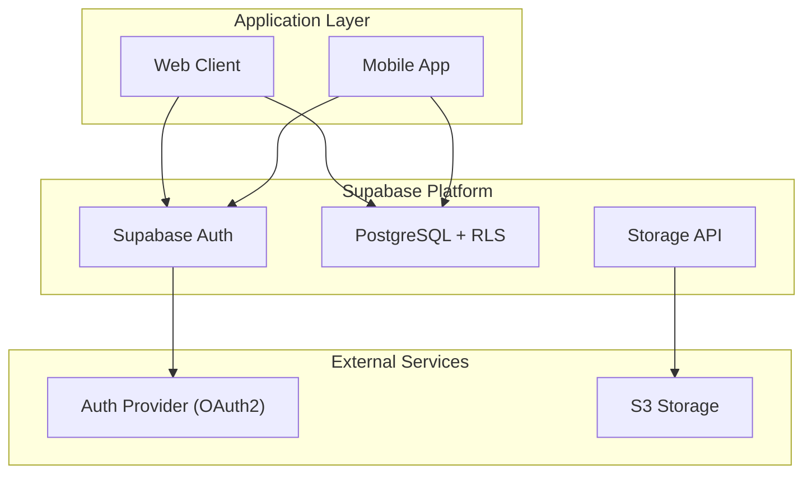
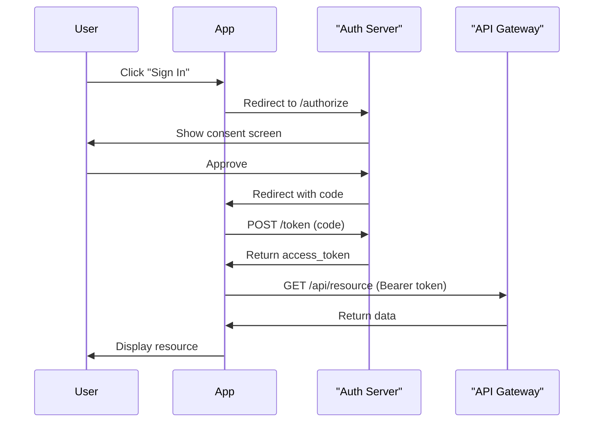

# Learning Resources Repository

A curated collection of technical documentation covering data engineering, system design, infrastructure, and software architecture.

---

## 👨‍💻 Developer Profile

Based on the comprehensive research and documentation in this repository, this collection represents the knowledge base of a **Senior Staff Engineer** with deep expertise spanning multiple domains:

**Core Competencies:**
- **Data Engineering Architecture** - Expert in modern lakehouse architectures (Apache Iceberg, Delta Lake, Hudi), distributed query engines (Trino, Presto, Spark), and data catalog systems. Deep understanding of metadata management, partition discovery, and ACID transactions on object storage.
- **Cloud-Native Infrastructure** - Extensive experience with AWS services (S3, Glue, Athena, Lambda, SQS), Snowflake data warehousing, and infrastructure-as-code using Terraform. Proven ability to design secure, scalable, and cost-effective cloud architectures.
- **Distributed Systems & Microservices** - Advanced knowledge of service mesh architectures (Envoy, mTLS, SPIFFE/SPIRE), message queuing vs. streaming platforms (Kafka, Pulsar, RabbitMQ), and pipeline orchestration frameworks (Airflow, Temporal, Prefect).
- **Full-Stack Development** - Proficient in modern application architectures using Supabase (PostgreSQL, RLS, Auth), Flutter for mobile development, and B2C authentication patterns including OAuth2.1, OIDC, and multi-factor authentication.
- **AI-Assisted Development** - Deep experience with AI agent frameworks (BMAD-METHOD, Claude Code), LLM orchestration, and RAG patterns. Understands how to leverage AI for software development workflows from planning through deployment.

**Engineering Philosophy:**
- Emphasizes **separation of concerns** and **modularity** in system design
- Values **security by default** with defense-in-depth strategies
- Advocates for **observable, debuggable systems** with comprehensive telemetry
- Champions **data-driven decision making** with clear performance benchmarks
- Believes in **documentation as code** with visual diagrams and comprehensive glossaries

**Technical Depth:**
This repository demonstrates mastery of 50+ years of distributed systems evolution, from relational databases through NoSQL to modern lakehouse architectures, combined with practical expertise in cloud-native development, security patterns, and AI-powered workflows. The breadth spans from low-level infrastructure (networking, certificates, IAM) to high-level application architecture (authentication flows, state management, user experience).

**Target Role:** Senior Staff Engineer / Principal Engineer / Solutions Architect specializing in data platforms, distributed systems, and cloud-native architectures.

---

## Document Index

### 📊 Data Engineering & Pipelines

#### [DataCatalogsAndFormatsV1.md](./DataCatalogsAndFormatsV1.md)
**Modern Data Lakehouse: Catalogs, Table Formats & Metadata Management**
*11 diagrams | 55+ glossary terms*

Comprehensive guide to modern table formats (Apache Iceberg, Delta Lake, Hudi) and data catalog systems. Covers metadata architecture, ACID transactions on object storage, time travel queries, and multi-engine interoperability. Includes real-world case studies from Netflix, Apple, and LinkedIn showing production deployments and benefits. Essential for understanding lakehouse architectures and choosing the right table format for your data platform.

**Key Topics:** Iceberg architecture, catalog implementations (Glue, Unity, Polaris, Nessie), schema evolution, partition management, MVCC, snapshot isolation
**[View Document](./DataCatalogsAndFormatsV1.md)** | [Glossary](#data-catalogs-glossary) | [Architecture Diagrams](#iceberg-architecture)

---

#### [DataPipelineSystemDesign.md](./DataPipelineSystemDesign.md)
**Production Data Pipeline Orchestration: Architecture & Design Patterns**
*26 diagrams | 71 glossary terms*

Deep dive into data pipeline orchestration comparing Airflow, Prefect, Dagster, and Temporal. Covers architecture patterns, failure modes, state management, idempotency, backfill strategies, and multi-tenancy. Includes Pinterest's production architecture (Spinner, Monarch) and practical design principles for building reliable, scalable pipelines. Critical reading for data platform engineers.

**Key Topics:** DAG execution, state machines, CeleryExecutor vs KubernetesExecutor, retry policies, concurrency control, adoption patterns
**[View Document](./DataPipelineSystemDesign.md)** | [Glossary](#pipeline-glossary) | [Architecture Comparison](#orchestrator-comparison)

---

#### [DistributedQuerySystems.md](./DistributedQuerySystems.md)
**50 Years of Distributed Query Engines: From MapReduce to Modern Lakehouses**
*20+ diagrams | 55 glossary terms*

Comprehensive history and evolution of distributed query systems spanning 1970-2025. Traces the journey from System R through parallel databases, NoSQL, SQL-on-Hadoop (Hive, Presto, Spark), cloud-native engines (Snowflake, BigQuery), to modern lakehouses. Includes academic research foundations, CAP theorem trade-offs, and future directions (AI-optimized storage, learned indexes).

**Key Topics:** MPP architectures, columnar storage, query optimization, separation of storage/compute, streaming analytics, federated queries
**[View Document](./DistributedQuerySystems.md)** | [Glossary](#query-systems-glossary) | [Era Timeline](#evolution-timeline)

---

#### [HiveIcebergAutodiscovery.md](./HiveIcebergAutodiscovery.md)
**Partition Discovery & Metastore Architecture in Distributed Query Engines**
*21 diagrams | 70+ glossary terms*

Solves the partition discovery problem in data lakes. Explains Hive Metastore architecture, MSCK REPAIR TABLE mechanics, AWS Glue Crawler workflows, and how modern table formats (Iceberg, Delta Lake) eliminate partition discovery overhead. Includes performance analysis, small files problem, compaction strategies, and decision frameworks for technology selection.

**Key Topics:** Hive Metastore schema, partition pruning, S3 LIST operations, metadata.json, manifest files, auto-discovery, hidden partitioning
**[View Document](./HiveIcebergAutodiscovery.md)** | [Glossary](#hive-iceberg-glossary) | [Discovery Flow](#discovery-workflow)

---

#### [SnowflakeStorageIntegration.md](./SnowflakeStorageIntegration.md)
**Snowflake External Storage Integration: Secure AWS S3 Access Patterns**
*16 diagrams | 30 glossary terms*

Production-ready guide for integrating Snowflake with AWS S3 using IAM roles and storage integrations. Covers credential lifecycle, STS token vending, error handling, monitoring, and multi-region deployments. Includes security best practices, permission boundaries, and hands-on configuration examples. Essential for Snowflake platform engineers.

**Key Topics:** Storage Integration objects, IAM trust policies, external stages, virtual warehouses, file format processing, role chaining
**[View Document](./SnowflakeStorageIntegration.md)** | [Glossary](#snowflake-glossary) | [Security Architecture](#security-layers)

---

#### [MessageQueueVsStreamProcessing.md](./MessageQueueVsStreamProcessing.md)
**Message Queues vs Stream Processing: Performance, Cost & Architecture Trade-offs**
*12 diagrams | 50+ glossary terms*

Data-driven comparison of AWS SQS, RabbitMQ, Apache Kafka, Apache Pulsar, and Redis Streams. Includes throughput benchmarks (300K to 10M+ msgs/sec), latency analysis, cost estimates, and use-case recommendations. Covers event sourcing, CQRS, Lambda vs Kappa architectures, and real-time data pipelines. Critical for choosing the right messaging infrastructure.

**Key Topics:** At-least-once vs exactly-once delivery, consumer groups, dead letter queues, backpressure, JSONata transformations
**[View Document](./MessageQueueVsStreamProcessing.md)** | [Glossary](#messaging-glossary) | [Performance Comparison](#throughput-benchmarks)

---

#### [PipelineOrchestrationFrameworks.md](./PipelineOrchestrationFrameworks.md)
**Open-Source Pipeline Orchestration: Go & Python Frameworks for Event-Driven Systems**
*12 diagrams | 60+ glossary terms*

Comprehensive evaluation of 9+ orchestration frameworks: Benthos, Apache Camel, Kestra, Temporal, Prefect, Dagster, Argo Workflows, and more. Organized by latency requirements (low/medium/high), includes Kubernetes deployment patterns, state management models, and reliability semantics. Production-grade architecture recommendations.

**Key Topics:** EIP patterns, DAG execution, workflow engines, KEDA autoscaling, message delivery semantics, event sourcing, cloud vs on-prem trade-offs
**[View Document](./PipelineOrchestrationFrameworks.md)** | [Glossary](#orchestration-glossary) | [Framework Selection](#decision-matrix)

---

### 🏗️ System Design & Architecture

#### [SupabaseB2CSystemDesign-ClaudeOpus4.5.md](./SupabaseB2CSystemDesign-ClaudeOpus4.5.md)
**Supabase B2C Identity Ecosystem: Multi-App Authentication Architecture**
*13 diagrams | 33 glossary terms*

Startup-focused guide for building consumer-facing applications with Supabase as identity provider. Covers JWT-based session management, multi-app SSO (same-domain and cross-domain), RLS authorization, MFA enrollment, social login, and PAT/API key management. Includes OAuth2.1 flows with PKCE and production security patterns.

**Key Topics:** GoTrue architecture, access/refresh tokens, HttpOnly cookies, AAL claims, auth hooks, identity linking, service-to-service auth
**[View Document](./SupabaseB2CSystemDesign-ClaudeOpus4.5.md)** | [Glossary](#supabase-auth-glossary) | [SSO Flows](#sso-diagrams)

---

#### [SupabaseB2CSystemDesign-GPT5.2.md](./SupabaseB2CSystemDesign-GPT5.2.md)
**Enterprise Supabase B2C System Design: Authorization & Multi-Tenancy**
*16 diagrams | 64+ glossary terms*

Advanced Supabase architecture covering four major problems: multi-app SSO, fine-grained authorization (RLS + external PDP), credential lifecycle management, and data plane bridging. Includes multi-tenancy data models, policy evaluation flows, token rotation workflows, and integration with OpenFGA, Unkey, and secrets managers. Enterprise-grade patterns.

**Key Topics:** RLS policy tables, ReBAC, RBAC, ABAC, policy decision points, credential rotation, audit logging, break-glass access, pre-signed URLs
**[View Document](./SupabaseB2CSystemDesign-GPT5.2.md)** | [Glossary](#enterprise-supabase-glossary) | [Authorization Flow](#authorization-diagrams)

---

#### [ServiceMeshCommunication.md](./ServiceMeshCommunication.md)
**Service Mesh: Secure, Observable Service-to-Service Communication**
*21 diagrams | 50+ glossary terms*

Comprehensive guide to service mesh architecture solving the problems of secure microservices communication. Covers Envoy proxy, SPIFFE/SPIRE identity, mTLS certificate lifecycle, external authorization, secrets management, observability (traces, metrics, logs), and traffic management (canary rollouts, circuit breakers). Production deployment patterns.

**Key Topics:** Sidecar pattern, control plane vs data plane, xDS APIs, workload identity, trust bundles, policy evaluation, distributed tracing
**[View Document](./ServiceMeshCommunication.md)** | [Glossary](#service-mesh-glossary) | [mTLS Flow](#mtls-handshake)

---

#### [FlutterAndSupabaseLearning.md](./FlutterAndSupabaseLearning.md)
**Flutter & Supabase: Building Modern Mobile Apps with GenAI**
*17 diagrams | 50+ glossary terms*

9-week learning guide for building production mobile apps with Flutter and Supabase backend. Covers OAuth authentication (deep linking, custom tabs), database schema design with RLS, real-time subscriptions, edge functions for AI integration, and SSE streaming. Includes platform configuration (iOS, Android), state management, and personalization workflows.

**Key Topics:** Widget tree, go_router navigation, Postgres RLS policies, JWT validation, PKCE flow, OpenAI-compatible APIs, EventSource streaming
**[View Document](./FlutterAndSupabaseLearning.md)** | [Glossary](#flutter-glossary) | [Architecture Overview](#app-architecture)

---

### 🛠️ Development & Tools

#### [BMADToolsCheatsheet.md](./BMADToolsCheatsheet.md)
**BMAD Method Tools: Quick Reference for AI-Assisted Development**
*7 diagrams | Comprehensive glossary*

Phase-by-phase cheatsheet for the BMAD Method covering Planning (Gemini, ChatGPT for PRD generation), Development (Cursor IDE for coding), and Iteration (retrospectives). Includes agent commands (@analyst, @pm, @architect, @sm, @dev, @qa), external tools (v0.dev, Lovable), and project type tool stacks (full-stack, frontend, backend, brownfield).

**Key Topics:** Agent commands, tool selection matrix, Gemini 1M+ token context, Cursor AI integration, workflow sequences, critical tips
**[View Document](./BMADToolsCheatsheet.md)** | [Glossary](#bmad-tools-glossary) | [Phase Workflows](#workflow-diagrams)

---

#### [BMADMethod.md](./BMADMethod.md)
**BMAD-METHOD: AI Agent Framework for Agile Development**
*7 diagrams | 18 glossary terms | 400+ links*

Technical deep-dive into BMAD-METHOD agent orchestration framework. Covers architecture layers (orchestrator, agents, LLM interface, tools), provider-agnostic BaseLLM interface supporting OpenAI, Anthropic Claude, Google Vertex, and local models. Includes codebase flattening for RAG, prompt templates, context engineering, and Python/Node.js integration examples.

**Key Topics:** Agent personas (Analyst, PM, Architect, SM, Dev, QA), LLM call flow, tool invocations, memory management, provider configuration
**[View Document](./BMADMethod.md)** | [Glossary](#bmad-framework-glossary) | [Architecture Layers](#bmad-architecture)

---

#### [BumerangeToTerraform.md](./BumerangeToTerraform.md)
**Infrastructure as Code: Production-Ready Terraform Architecture**
*13 diagrams | 27 glossary terms*

Migration guide for building production Terraform infrastructure with three-layer separation (infrastructure, application, secrets). Covers AWS account portability, EC2 provisioning, IAM roles, Security Groups, RDS vs Docker PostgreSQL decisions, and migration safety checklists. Includes module composition patterns and requirement traceability.

**Key Topics:** Remote state management, S3 backend, DynamoDB locking, IAM instance profiles, CloudTrail auditing, Cloudflare DNS integration
**[View Document](./BumerangeToTerraform.md)** | [Glossary](#terraform-glossary) | [Architecture Layers](#terraform-architecture)

---

#### [ClaudeEcoplugs.md](./ClaudeEcoplugs.md)
**Claude Code Ecosystem: Critical Analysis of AI-Assisted Development Patterns**
*23 diagrams | 19 glossary terms*

Critical examination of Claude Code's architecture covering 9 core components: Agent Skills, Workflows, Tooling, Status Lines, Slash Commands, CLAUDE.md, Alternative Clients, Documentation, and Reality Check. Contrasts Claude Code patterns with enterprise practices (OpenTelemetry, Temporal, LangGraph). Includes paradigm comparison and architectural trade-offs.

**Key Topics:** Skill composition, DAG workflows vs state machines, RPC tooling, telemetry, event buses, RAG patterns, glue code criticisms
**[View Document](./ClaudeEcoplugs.md)** | [Glossary](#claude-code-glossary) | [Component Diagrams](#claude-architecture)

---

### 📝 Excluded from Current Review
- ⏸️ **DietaryPlanningProtocol.md** - Comprehensive dietary planning with equations and sources (non-technical content, skipped per instructions)

---

## Mermaid Diagram Guidelines

All documents in this repository follow these Mermaid diagram standards:

### Critical Rules

1. **Always wrap node labels with special characters in double quotes**
   ```mermaid
   flowchart TB
       A["Auth Server (OIDC/OAuth2)"]
       B["API Gateway: /api/v1"]
       C["Database (PostgreSQL)"]
   ```
   Special characters include: `() / : , -`

2. **Prefer `flowchart TB` (Top-Bottom) for readability**
   - Use `TB` for hierarchical flows
   - Use `LR` (Left-Right) for subgraphs to avoid wide charts

3. **Include environment boundaries**
   ```mermaid
   flowchart TB
       subgraph Development
           DevAPI["Dev API"]
           DevDB["Dev Database"]
       end
       subgraph Production
           ProdAPI["Prod API"]
           ProdDB["Prod Database"]
       end
   ```

4. **Clear component grouping**
   - Separate Supabase components from external services
   - Group related services in subgraphs
   - Add visual distinction with styling

### Diagram Types Required

Each document should include:
- **Flowcharts**: Architecture and component relationships
- **Sequence Diagrams**: User journeys, API interactions, authentication flows
- **Component Diagrams**: System architecture and service boundaries
- **ERD** (optional): Database schemas where relevant

### Example: Valid Mermaid Diagram





---

## Document Standards

Each document in this repository includes:

### 1. Executive Summary
A concise overview scaled to document length:
- Brief docs (< 5k words): 2-3 sentences
- Medium docs (5-15k words): 1 paragraph (4-6 sentences)
- Comprehensive docs (> 15k words): 2-3 paragraphs

### 2. Glossary
Every document contains its own glossary with:
- **Term**: The concept or technology
- **Short Description**: Clear, concise definition
- **Use this when**: Real-world application scenario
- **Like**: A useful simile or analogy

Example:
| Term | Description | Use this when | Like |
|------|-------------|---------------|------|
| **JWT** | JSON Web Token - compact, URL-safe token format | You need to securely transmit claims between parties without server-side session storage | A sealed, tamper-evident envelope where you can read the contents but can't modify them without breaking the seal |

### 3. Comprehensive Diagrams
Multiple Mermaid diagrams throughout showing:
- System architecture
- Data flows
- Sequence of operations
- Component relationships

---

## How to Use This Repository

### For Readers
1. Check the index above to find topics of interest
2. Click document links to read full content
3. Each document is self-contained with glossary and diagrams
4. Progress checkboxes help track what you've read (manually update)

### For Contributors
1. Follow the Mermaid diagram guidelines strictly
2. Include executive summary and glossary in all new documents
3. Use PascalCase for filenames (e.g., `NewDocumentName.md`)
4. Add new documents to this README index
5. Update progress indicators when reviewing/updating docs

### Automatic Tracking
To automatically list new files added to the repository:
```bash
# List all markdown files except README
find . -name "*.md" -not -name "README.md" -type f | sort
```

---

## Repository Structure

```
learn-resources/
├── README.md                          # This file
├── DataCatalogsAndFormatsV1.md
├── DataPipelineSystemDesign.md
├── DistributedQuerySystems.md
├── HiveIcebergAutodiscovery.md
├── SnowflakeStorageIntegration.md
├── MessageQueueVsStreamProcessing.md
├── PipelineOrchestrationFrameworks.md
├── SupabaseB2CSystemDesign-ClaudeOpus4.5.md
├── SupabaseB2CSystemDesign-GPT5.2.md
├── ServiceMeshCommunication.md
├── FlutterAndSupabaseLearning.md
├── BMADToolsCheatsheet.md
├── BMADMethod.md
├── BumerangeToTerraform.md
├── ClaudeEcoplugs.md
└── DietaryPlanningProtocol.md
```

---

## Repository Summary

### Overall Statistics
- **Total Documents**: 15 technical guides
- **Total Mermaid Diagrams**: 230+ professional diagrams
- **Total Glossary Terms**: 750+ comprehensive definitions
- **Total Glossary Links**: 1,500+ cross-references
- **Total Lines of Content**: 18,000+ lines

### Document Categories

**Data Engineering & Pipelines** (7 documents)
- 117+ diagrams covering data architectures, pipelines, and query systems
- 400+ glossary terms for data engineering concepts
- Topics: Iceberg, Delta Lake, Hive, Kafka, streaming, orchestration, Snowflake

**System Design & Architecture** (4 documents)
- 67+ diagrams for system architecture and auth flows
- 200+ glossary terms for distributed systems and authentication
- Topics: Supabase, service mesh, Flutter, B2C systems, microservices

**Development & Tools** (4 documents)
- 46+ diagrams for development workflows and tooling
- 150+ glossary terms for AI agents, infrastructure, and DevOps
- Topics: BMAD Method, Claude Code, Terraform, infrastructure as code

### Quality Standards Achieved

All documents now include:
- ✅ **Executive Summary** - Scaled appropriately to document length
- ✅ **Valid Mermaid Diagrams** - All labels properly quoted, consistent styling
- ✅ **Comprehensive Glossary** - Clear definitions with real-world analogies
- ✅ **Complete Cross-Referencing** - Every term occurrence linked to glossary
- ✅ **Professional Structure** - TOC, sections, references, and metadata

---

## Update Log

| Date | Action | Documents |
|------|--------|-----------|
| 2026-01-01 | Repository initialized | All documents |
| 2026-01-01 | File standardization - renamed to PascalCase | All 15 documents |
| 2026-01-01 | Comprehensive review and enhancement completed | All 15 documents |
| 2026-01-01 | Added 230+ Mermaid diagrams, 750+ glossary terms | All 15 documents |

---

## Contributing

When adding or updating documents:
1. Ensure all Mermaid diagrams follow the guidelines above
2. Include executive summary appropriate to document size
3. Create comprehensive glossary with all key terms
4. Test all Mermaid diagrams render correctly in GitHub
5. Update this README with new document entries
6. Follow PascalCase naming convention

---

**Note**: This is a living repository. As you read and update documents, manually check off items in the index above and update the progress indicators.