# SSO Cross-Cutting OWASP Security Patterns

## Executive Summary

Single Sign-On (SSO) ecosystems introduce critical security challenges that map directly to the OWASP Top 10 and OWASP API Security Top 10 failure modes. This document provides an OWASP-oriented security lens for designing secure SSO architectures, covering authentication, authorization, session management, token handling, and API security patterns. The primary threats addressed include [Broken Object Level Authorization (BOLA)](#glossary), [Broken Authentication](#glossary), [OAuth](#glossary)/[OIDC](#glossary) implementation vulnerabilities, [session hijacking](#glossary), and [IDOR](#glossary) attacks.

Modern SSO implementations must address six critical areas: inter-app SSO with shared sessions across multiple domains, distributed frontend/backend authentication patterns using [API gateways](#glossary) and [microservices](#glossary), human-to-human (H2H) and service-to-service (S2S) authentication with user delegation, [MFA](#glossary) and social login with secure session lifecycle management, [Personal Access Token (PAT)](#glossary) and [API key](#glossary) systems for CLI and third-party integrations, and resource-based [authorization](#glossary) using [Row-Level Security (RLS)](#glossary) and storage policies. Each area presents unique security challenges that require careful implementation following OWASP best practices to prevent common attack vectors like [token replay](#glossary), [open redirect](#glossary) exploits, [session fixation](#glossary), and authorization bypass.

This guide maps specific OWASP API Security categories (API1 through API5) to each design pattern, provides concrete implementation guidance aligned with OWASP [Cheat Sheets](#glossary), and identifies common pitfalls that lead to security vulnerabilities. Whether implementing [PKCE](#glossary)-protected [OAuth](#glossary) flows, designing [JWT](#glossary)-based service authentication, or configuring database-level authorization controls, this document ensures your SSO ecosystem adheres to industry-standard security principles and protects against the most prevalent authentication and authorization attacks.

---

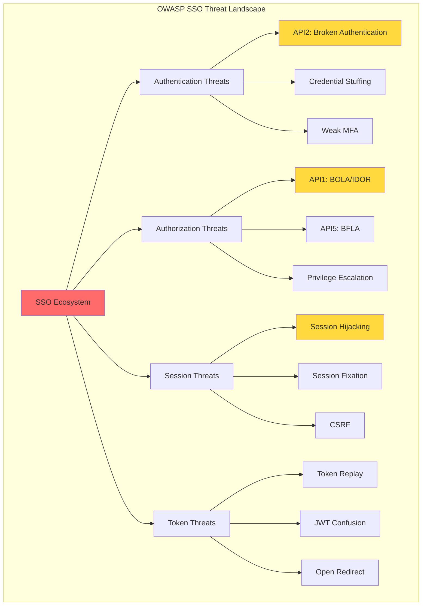

You're right to push for explicit OWASP coverage—because the *same* [ecosystem](#glossary) design choices ([SSO](#glossary), [cookies](#glossary), [tokens](#glossary), [gateways](#glossary), [microservices](#glossary), [API keys](#glossary), [RLS](#glossary)) map directly onto the most common OWASP failure modes.

Below is an **OWASP-oriented lens** on your 6 items: what OWASP is warning you about, what to implement, and the usual pitfalls.

---

## Cross-cutting OWASP "must not fail" areas (apply to all 6)

### A) Broken Access Control / IDOR / BOLA

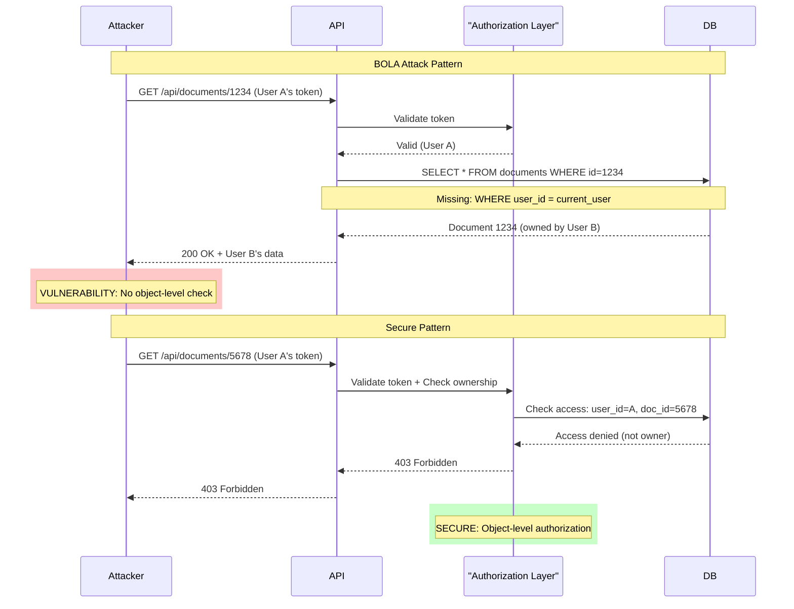

- OWASP API Security Top 10 2023 calls out **API1: [Broken Object Level Authorization (BOLA)](#glossary)** as the top risk: any endpoint using object IDs must enforce object-level checks. ([owasp.org](https://owasp.org/API-Security/editions/2023/en/0x11-t10/?utm_source=openai))
- OWASP [Authorization](#glossary) [Cheat Sheet](#glossary) explicitly warns that "unguessable IDs" aren't enough; you must do access checks on *every request* for the specific object/function. ([cheatsheetseries.owasp.org](https://cheatsheetseries.owasp.org/cheatsheets/Authorization_Cheat_Sheet.html?utm_source=openai))

**Design implication for your [ecosystem](#glossary):** you need a consistent resource-[authorization](#glossary) strategy (your #6) and you need it enforced in *every* entry point ([gateway](#glossary), services, DB/[RLS](#glossary)).

### B) Broken Authentication + session/token compromise

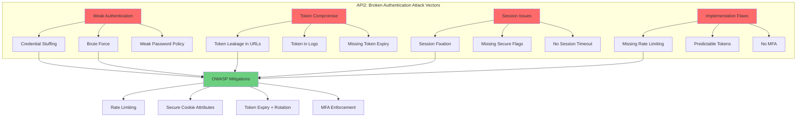

OWASP API Security Top 10 lists **API2: [Broken Authentication](#glossary)**—attackers often compromise [tokens](#glossary) or exploit implementation flaws. ([owasp.org](https://owasp.org/API-Security/editions/2023/en/0x11-t10/?utm_source=openai))
OWASP [Authentication](#glossary) [Cheat Sheet](#glossary) + [Session Management](#glossary) [Cheat Sheet](#glossary) cover the basics ([rate limit](#glossary), secure [session IDs](#glossary), secure [cookies](#glossary), etc.). ([cheatsheetseries.owasp.org](https://cheatsheetseries.owasp.org/cheatsheets/Authentication_Cheat_Sheet.html?utm_source=openai))

**Design implication:** "[SSO](#glossary) works" is not enough; you need anti-enumeration, throttling, secure cookie attributes, safe session lifetimes, and a clean logout story.

### C) OAuth/OIDC implementation mistakes (redirects, state/nonce, open redirects)

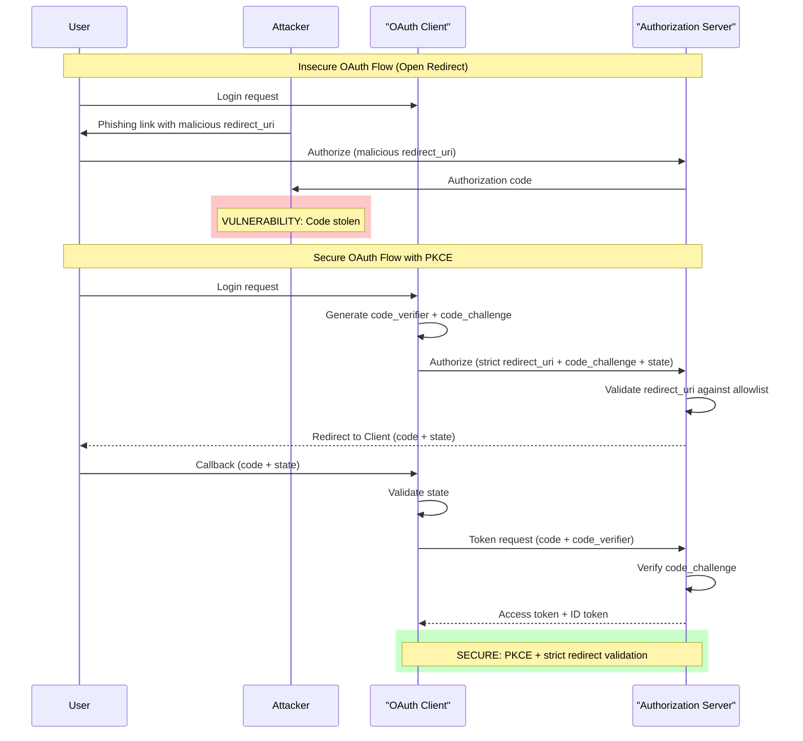

OWASP has a dedicated **[OAuth 2.0](#glossary) [Cheat Sheet](#glossary)** emphasizing critical pitfalls like **[open redirectors](#glossary)** and proper use of `state` / `nonce` / [PKCE](#glossary). ([cheatsheetseries.owasp.org](https://cheatsheetseries.owasp.org/cheatsheets/OAuth2_Cheat_Sheet.html?utm_source=openai))

**Design implication:** your cross-domain "no re-login" (#1) must be done using disciplined [OAuth](#glossary)/[OIDC](#glossary) client rules, or you'll create code/token exfiltration paths.

---

# OWASP-aligned guidance per item

## 1) Inter-app SSO + shared sessions (multi-domain)

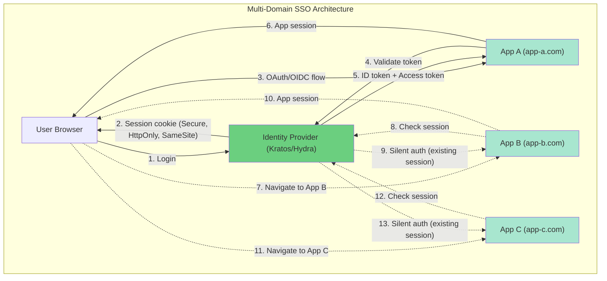

**OWASP concerns**
- **[Session hijacking](#glossary)/[fixation](#glossary)** if [cookies](#glossary)/[sessions](#glossary) are weak or mishandled. ([cheatsheetseries.owasp.org](https://cheatsheetseries.owasp.org/cheatsheets/Session_Management_Cheat_Sheet.html?utm_source=openai))
- **[OAuth](#glossary) redirect flaws** ([open redirects](#glossary), stolen codes/[tokens](#glossary)). ([cheatsheetseries.owasp.org](https://cheatsheetseries.owasp.org/cheatsheets/OAuth2_Cheat_Sheet.html?utm_source=openai))

**Best practices (OWASP-aligned)**
- Use [OIDC](#glossary) [Authorization Code](#glossary) (+ [PKCE](#glossary) when relevant), and treat redirect URIs as *strict allowlists* (no wildcards).
- [Cookies](#glossary): set `Secure`, `HttpOnly`, and appropriate `SameSite` ([Session Management](#glossary) [Cheat Sheet](#glossary) guidance) and prevent caching of responses setting [session IDs](#glossary) (e.g., `Cache-Control: no-store`). ([cheatsheetseries.owasp.org](https://cheatsheetseries.owasp.org/cheatsheets/Session_Management_Cheat_Sheet.html?utm_source=openai))
- Don't "pass [tokens](#glossary)" between apps via URL parameters.

**Common pitfalls**
- Building "[SSO](#glossary)" by redirecting with an [access token](#glossary) in the URL (leaks through logs/history/referrer).
- Weak logout: user logs out of App A but remains logged in elsewhere (confusing UX + risk). Kratos/Hydra need coordinated logout/revocation decisions.

---

## 2) Distributed frontend/backend auth patterns (gateway + microservices)

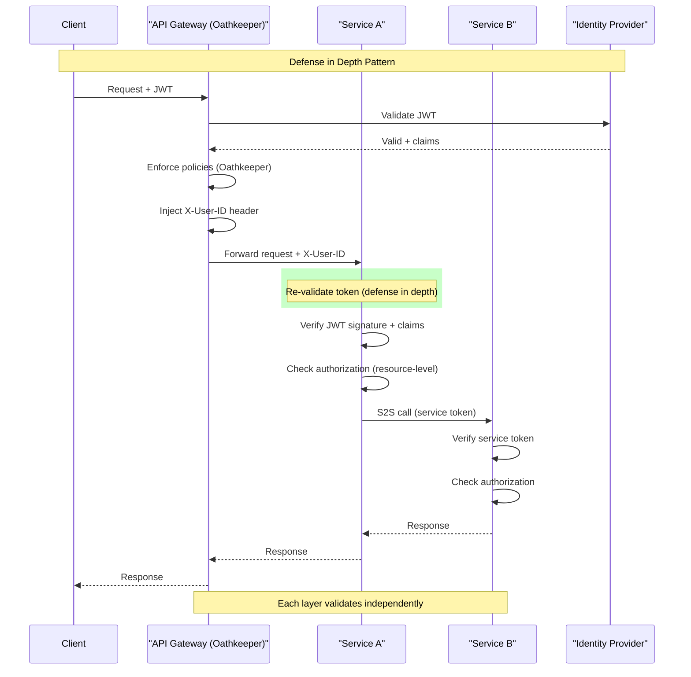

**OWASP concerns**
- **[Broken authentication](#glossary)** if different services validate [tokens](#glossary) differently (or accept missing/incorrect claims). ([owasp.org](https://owasp.org/API-Security/editions/2023/en/0x11-t10/?utm_source=openai))
- **Security misconfiguration** if some internal route bypasses auth [middleware](#glossary). ([owasp.org](https://owasp.org/API-Security/editions/2023/en/0x11-t10/?utm_source=openai))

**Best practices**
- Standardize verification rules in one shared library OR Oathkeeper policy, but still verify in each service (defense in depth).
- Treat identity headers injected by a proxy as **untrusted** unless the service is only reachable behind that proxy.

**Common pitfalls**
- "[Gateway](#glossary)-only auth" while services are still network-accessible (bypass).
- Inconsistent `aud`/issuer validation leading to [token confusion](#glossary) (a [token](#glossary) for one API accepted by another).

---

## 3) H2H + S2S + "on behalf of user"

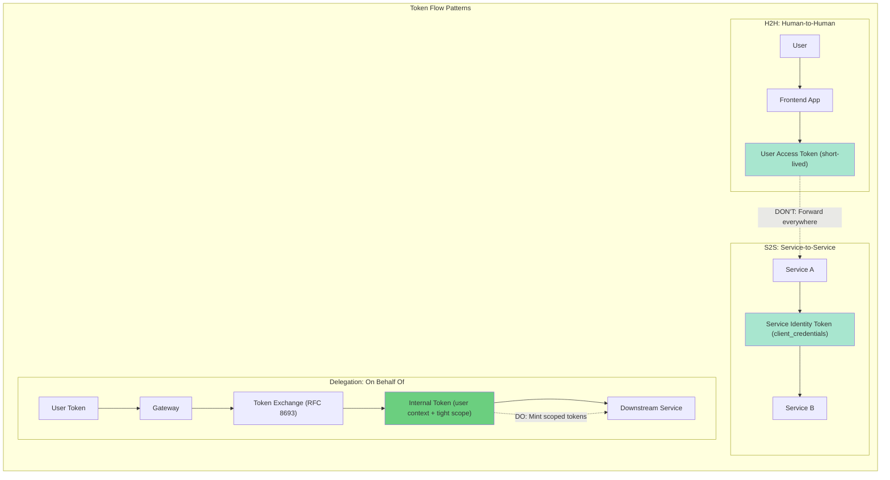

**OWASP concerns**
- [Token replay](#glossary)/abuse if you forward end-user [tokens](#glossary) everywhere.
- [BOLA](#glossary)/[authorization](#glossary) confusion if downstream services rely on "user is authenticated" rather than "user is authorized for *this object*." ([owasp.org](https://owasp.org/API-Security/editions/2023/en/0xa1-broken-object-level-authorization/?utm_source=openai))

**Best practices**
- Separate credentials:
  - user-facing flows (H2H)
  - service identity (S2S)
- For delegation, prefer [token exchange](#glossary) semantics (or at minimum mint short-lived internal [tokens](#glossary) with tight audience/scope).

**Common pitfalls**
- Passing the original user [token](#glossary) to every downstream system (blast radius + accidental over-privilege).
- Services trusting fields in a [JWT](#glossary) like `role=admin` without server-side [authorization](#glossary) checks.

---

## 4) MFA + social login + refresh/logout (UX + security)

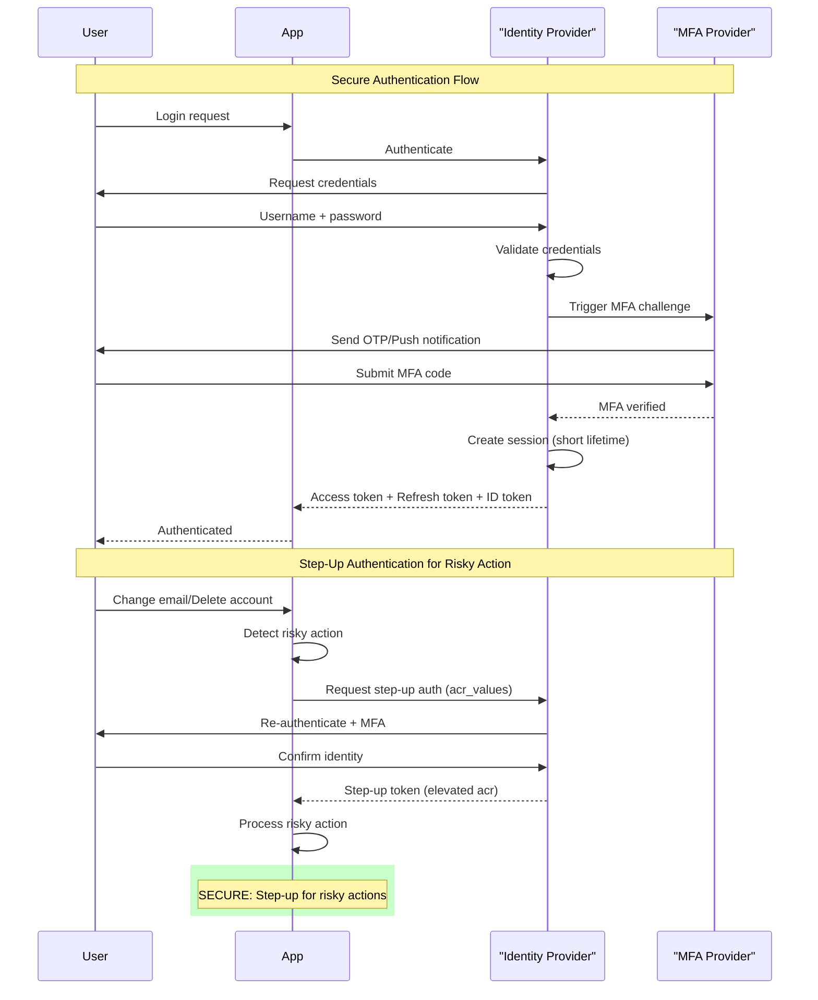

**OWASP concerns**
- [Broken authentication](#glossary) (weak recovery, weak [MFA](#glossary) enrollment, [brute force](#glossary)).
- [Session](#glossary) theft: long-lived [sessions](#glossary) without re-auth after risk events.

**Best practices**
- Require reauthentication / step-up [MFA](#glossary) for risky actions ([Session Management](#glossary) [Cheat Sheet](#glossary) explicitly recommends reauth after risk events). ([cheatsheetseries.owasp.org](https://cheatsheetseries.owasp.org/cheatsheets/Session_Management_Cheat_Sheet.html?utm_source=openai))
- [Rate limit](#glossary) login, [MFA](#glossary), recovery, and token refresh endpoints (OWASP guidance across auth/[session](#glossary) docs). ([cheatsheetseries.owasp.org](https://cheatsheetseries.owasp.org/cheatsheets/Authentication_Cheat_Sheet.html?utm_source=openai))

**Common pitfalls**
- Letting users change email/password or create [API keys](#glossary) without step-up.
- "Remember device" implemented as a long-lived [bearer token](#glossary) in localStorage.

---

## 5) PAT + API key system (CLI + third-party)

```mermaid
flowchart TB
    subgraph "API Key Lifecycle"
        Create["User creates API key"] --> Generate["Generate cryptographically random key"]
        Generate --> Hash["Hash key (bcrypt/argon2)"]
        Hash --> Store["Store hash + metadata in DB"]
        Store --> Display["Display key ONCE to user"]

        subgraph "Key Metadata"
            Meta1["Scopes (read/write)"]
            Meta2["Resource constraints (org/project)"]
            Meta3["Expiry date"]
            Meta4["Rate limits"]
            Meta5["Last used timestamp"]
        end

        Display --> Use["User sends key in requests"]
        Use --> Validate["API validates key"]
        Validate --> CheckHash["Compare hash"]
        CheckHash --> CheckExpiry["Check expiry"]
        CheckExpiry --> CheckScope["Check scopes"]
        CheckScope --> CheckRate["Check rate limits"]
        CheckRate --> Allow["Allow/Deny request"]

        Allow --> Revoke["User revokes key"]
        Revoke --> Delete["Delete from DB"]
    end

    style Generate fill:#6bcf7f
    style Hash fill:#6bcf7f
    style Store fill:#6bcf7f
    style Display fill:#ffd93d
```

**OWASP concerns**
- Falls under **[Broken Authentication](#glossary)** (API2) if [tokens](#glossary) are predictable, long-lived, never rotated, or leaked. ([owasp.org](https://owasp.org/API-Security/editions/2023/en/0x11-t10/?utm_source=openai))
- Also ties to **Unrestricted Resource Consumption (API4)** if keys can be abused to burn compute/SMS/email costs. ([owasp.org](https://owasp.org/API-Security/editions/2023/en/0x11-t10/?utm_source=openai))

**Best practices**
- [Opaque tokens](#glossary), stored **hashed**, with:
  - [scopes](#glossary)
  - resource constraints (org/project allowlist)
  - expiry + rotation + revocation
- Strong [rate limits](#glossary) per [token](#glossary) + anomaly detection.

**Common pitfalls**
- Treating [API keys](#glossary) like passwords but storing them in plaintext (DB leak immediate compromise).
- "One key per org" with no scoping (partner gets god mode).

---

## 6) Resource-based authorization via Postgres RLS + Storage policies (+ external planes)

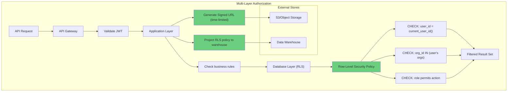

**OWASP concerns**
- Directly targets **[BOLA](#glossary) / [IDOR](#glossary)** (API1) and **[Broken Function Level Authorization](#glossary) (API5)**. ([owasp.org](https://owasp.org/API-Security/editions/2023/en/0x11-t10/?utm_source=openai))
- OWASP [Authorization](#glossary) [Cheat Sheet](#glossary) warns against relying on obscurity and emphasizes checks on every request/object. ([cheatsheetseries.owasp.org](https://cheatsheetseries.owasp.org/cheatsheets/Authorization_Cheat_Sheet.html?utm_source=openai))

**Best practices**
- "Deny by default" posture in your [authorization](#glossary) layer.
- For non-Postgres data planes (warehouse/object store), do not assume DB [RLS](#glossary) automatically protects them—use [signed URLs](#glossary) or projected policies.

**Common pitfalls**
- [RLS](#glossary) bypass via service/admin credentials used in the wrong execution path.
- External stores (S3/warehouse) drifting from the source-of-truth [authorization](#glossary) model.

---

## What I would add to your guide explicitly (so it "addresses OWASP" concretely)

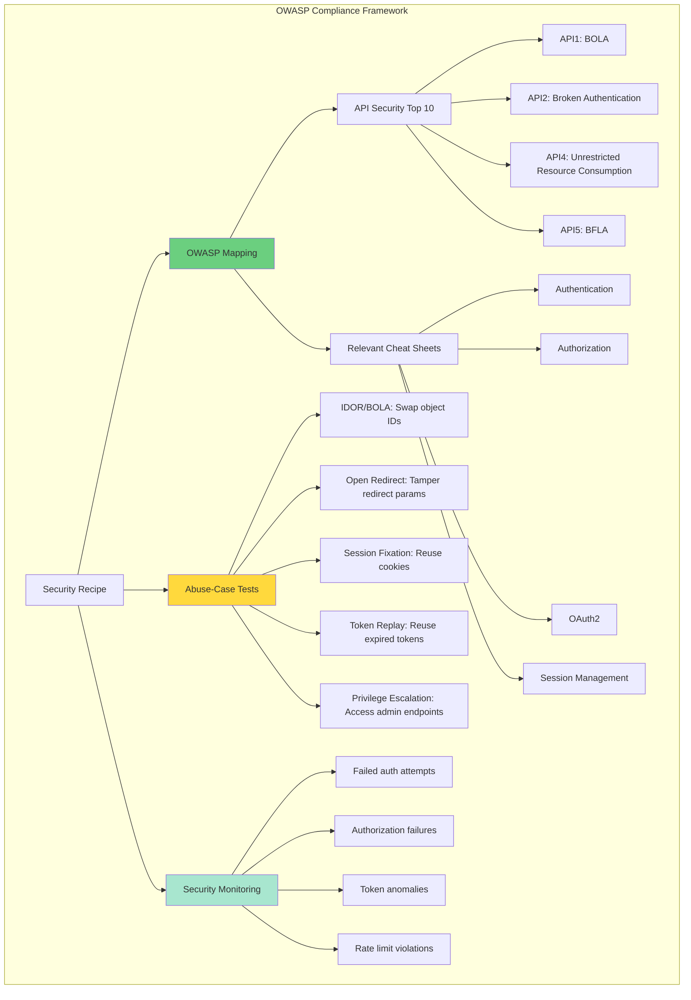

If you want, I'll revise the big recipe guide so each recipe ends with:

1) **OWASP mapping**
- OWASP API Top 10 category coverage (API1, API2, API4, API5, etc.) ([owasp.org](https://owasp.org/API-Security/editions/2023/en/0x11-t10/?utm_source=openai))
- Relevant OWASP [cheat sheets](#glossary) used (Auth, AuthZ, [OAuth2](#glossary), [Session Management](#glossary)) ([cheatsheetseries.owasp.org](https://cheatsheetseries.owasp.org/cheatsheets/Authentication_Cheat_Sheet.html?utm_source=openai))

2) **Abuse-case tests**
- "Try [IDOR](#glossary)/[BOLA](#glossary)": swap object IDs and ensure denial ([owasp.org](https://owasp.org/API-Security/editions/2023/en/0xa1-broken-object-level-authorization/?utm_source=openai))
- "Try [open redirect](#glossary)": tamper redirect parameters ([cheatsheetseries.owasp.org](https://cheatsheetseries.owasp.org/cheatsheets/OAuth2_Cheat_Sheet.html?utm_source=openai))
- "Try [session fixation](#glossary)/hijack": reuse [cookies](#glossary) across login/logout boundaries ([cheatsheetseries.owasp.org](https://cheatsheetseries.owasp.org/cheatsheets/Session_Management_Cheat_Sheet.html?utm_source=openai))

---

### One clarification so I can tailor the OWASP mapping perfectly
Do your apps expose APIs primarily as **REST**, **GraphQL**, or both? (OWASP API1/[BOLA](#glossary) patterns show up differently in GraphQL vs REST, and I'll tailor the "tests you must run" section.) ([owasp.org](https://owasp.org/API-Security/editions/2023/en/0xa1-broken-object-level-authorization/?utm_source=openai))

---

## Glossary

### Access Token
- **Description**: A credential used to access protected resources, typically short-lived and issued by an [authorization server](#glossary) after successful [authentication](#glossary). In [OAuth 2.0](#glossary), [access tokens](#glossary) are [bearer tokens](#glossary) that grant access without requiring additional proof of identity.
- **Use this when**: Making authenticated API requests to resource servers
- **Like**: A temporary key card that grants access to specific rooms in a building

### API Gateway
- **Description**: A server that acts as an entry point for all client requests, handling [authentication](#glossary), [authorization](#glossary), [rate limiting](#glossary), routing, and other cross-cutting concerns before forwarding requests to backend [microservices](#glossary).
- **Use this when**: Building distributed systems with multiple backend services
- **Like**: A security checkpoint at a building entrance that verifies identity before allowing access to different floors

### API Key
- **Description**: A unique identifier used to authenticate API requests, typically a long-lived credential stored securely and sent with each request. Unlike [OAuth tokens](#glossary), [API keys](#glossary) don't expire automatically and are commonly used for server-to-server communication.
- **Use this when**: Providing programmatic access to APIs for CLIs, scripts, or third-party integrations
- **Like**: A permanent building access card issued to long-term tenants

### Authentication
- **Description**: The process of verifying the identity of a user, device, or system, typically through credentials like passwords, tokens, or biometrics. Successful [authentication](#glossary) establishes "who you are" but not "what you can do."
- **Use this when**: Verifying user identity at login or validating tokens
- **Like**: Showing your ID to prove you are who you claim to be

### Authorization
- **Description**: The process of determining what actions an authenticated user is permitted to perform on specific resources. [Authorization](#glossary) happens after [authentication](#glossary) and enforces access control policies using mechanisms like [RBAC](#glossary), [ABAC](#glossary), or [RLS](#glossary).
- **Use this when**: Checking if a user can access a specific resource or perform an action
- **Like**: Checking if your building access card permits entry to a specific floor

### Authorization Code
- **Description**: A temporary credential issued by an [authorization server](#glossary) during the [OAuth 2.0](#glossary) [Authorization Code Flow](#glossary), exchanged by the client for an [access token](#glossary). This code is single-use, short-lived, and prevents direct token exposure to the user agent.
- **Use this when**: Implementing secure OAuth flows for web and mobile applications
- **Like**: A temporary pickup slip you exchange at a counter for the actual item

### Bearer Token
- **Description**: A type of [access token](#glossary) that grants access to whoever possesses it, without requiring additional proof of identity. The token itself is the credential, making secure storage and transmission critical to prevent theft.
- **Use this when**: Implementing OAuth 2.0 token-based authentication
- **Like**: A movie ticket that grants admission to anyone holding it

### BFLA
- **Description**: Broken Function Level Authorization—OWASP API Security API5 vulnerability where attackers access functions they shouldn't by manipulating requests to administrative or privileged endpoints without proper [authorization](#glossary) checks.
- **Use this when**: Testing if regular users can access admin functions
- **Like**: A customer accessing employee-only areas by guessing the door code

### BOLA
- **Description**: Broken Object Level Authorization—OWASP API Security API1 vulnerability (also called [IDOR](#glossary)) where attackers access objects they don't own by manipulating object identifiers without proper object-level [authorization](#glossary) checks.
- **Use this when**: Testing if users can access other users' data by changing IDs
- **Like**: Opening someone else's mailbox by trying different mailbox numbers

### Broken Authentication
- **Description**: OWASP API Security API2 vulnerability encompassing flaws in [authentication](#glossary) mechanisms such as weak credentials, missing [MFA](#glossary), predictable [session IDs](#glossary), [token](#glossary) leakage, or insufficient [rate limiting](#glossary) allowing credential stuffing or [brute force](#glossary) attacks.
- **Use this when**: Assessing authentication implementation security
- **Like**: A lock that can be picked easily or has a spare key hidden under the doormat

### Broken Function Level Authorization
- **Description**: A security vulnerability where applications fail to properly enforce function-level access controls, allowing users to perform actions beyond their privilege level by accessing administrative or privileged API endpoints.
- **Use this when**: Testing if users can escalate privileges to admin functions
- **Like**: A junior employee accessing executive-only meeting rooms

### Brute Force
- **Description**: An attack method where attackers systematically try many passwords, keys, or credentials until finding the correct one. Effective defenses include [rate limiting](#glossary), account lockouts, [MFA](#glossary), and [CAPTCHA](#glossary).
- **Use this when**: Describing password-guessing or credential-stuffing attacks
- **Like**: Trying every possible combination on a padlock until it opens

### CAPTCHA
- **Description**: Completely Automated Public Turing test to tell Computers and Humans Apart—a challenge-response test used to prevent automated attacks like [brute force](#glossary) login attempts or spam by requiring human interaction.
- **Use this when**: Protecting login forms or public endpoints from automated abuse
- **Like**: A bouncer asking a question only humans can answer before entry

### Cheat Sheet
- **Description**: OWASP's concise security guidance documents providing best practices, implementation patterns, and common pitfalls for specific security topics like [authentication](#glossary), [authorization](#glossary), [session management](#glossary), and [OAuth](#glossary).
- **Use this when**: Implementing security controls and need authoritative guidance
- **Like**: A reference card with critical procedures for emergency situations

### Cookie
- **Description**: A small piece of data stored in the user's browser and sent with every request to the same domain, commonly used for [session management](#glossary). Secure [cookies](#glossary) must have `Secure`, `HttpOnly`, and `SameSite` attributes to prevent theft and [CSRF](#glossary) attacks.
- **Use this when**: Maintaining session state in web applications
- **Like**: A wristband given at an event that grants re-entry

### CSRF
- **Description**: Cross-Site Request Forgery—an attack where a malicious website tricks a user's browser into making unintended requests to a different site where the user is authenticated, exploiting the browser's automatic inclusion of [cookies](#glossary).
- **Use this when**: Protecting state-changing operations in web applications
- **Like**: Someone forging your signature on documents while you're logged into your bank

### Ecosystem
- **Description**: The complete set of interconnected applications, services, identity providers, APIs, and security components that work together to provide [SSO](#glossary), [authentication](#glossary), [authorization](#glossary), and resource access across an organization's technology landscape.
- **Use this when**: Describing the holistic security architecture spanning multiple systems
- **Like**: A city's interconnected transportation network with buses, trains, and roads

### Gateway
- **Description**: See [API Gateway](#glossary)—an entry point that centralizes security controls like [authentication](#glossary), [authorization](#glossary), [rate limiting](#glossary), and request routing before forwarding to backend services.
- **Use this when**: Implementing centralized security controls for distributed systems
- **Like**: A reception desk that screens all visitors before directing them

### IDOR
- **Description**: Insecure Direct Object Reference—a vulnerability where applications expose internal object identifiers (like database IDs) without proper [authorization](#glossary) checks, allowing attackers to access unauthorized resources by manipulating IDs. Also called [BOLA](#glossary).
- **Use this when**: Testing if users can access objects by guessing or incrementing IDs
- **Like**: Hotel room keys labeled with room numbers that open any matching room

### JWT
- **Description**: JSON Web Token—a compact, URL-safe token format containing JSON claims that can be signed (JWS) or encrypted (JWE), commonly used for [authentication](#glossary) and [authorization](#glossary). [JWTs](#glossary) are self-contained, including issuer, subject, expiration, and custom claims.
- **Use this when**: Implementing stateless authentication for APIs
- **Like**: A digitally signed passport containing your identity and permissions

### MFA
- **Description**: Multi-Factor Authentication—a security mechanism requiring two or more verification factors (something you know, have, or are) to authenticate, significantly reducing credential compromise risks. Common factors include passwords, OTP codes, push notifications, and biometrics.
- **Use this when**: Protecting high-value accounts or sensitive operations
- **Like**: Requiring both an ID card and fingerprint scan for building access

### Microservices
- **Description**: An architectural pattern where applications are composed of small, independent services communicating via APIs, each with its own database and security boundaries. [Microservices](#glossary) require distributed [authentication](#glossary) and [authorization](#glossary) patterns.
- **Use this when**: Building scalable, independently deployable application components
- **Like**: A city with specialized districts that communicate but operate independently

### Middleware
- **Description**: Software components that intercept and process requests between clients and application logic, commonly used for cross-cutting concerns like [authentication](#glossary), logging, [rate limiting](#glossary), and request validation.
- **Use this when**: Implementing reusable security controls across multiple endpoints
- **Like**: Security checkpoints that inspect all traffic flowing through them

### OAuth
- **Description**: OAuth 2.0—an authorization framework (RFC 6749) enabling third-party applications to obtain limited access to protected resources without exposing user credentials, using [access tokens](#glossary) issued by an [authorization server](#glossary).
- **Use this when**: Enabling secure delegated access to APIs
- **Like**: Giving a valet service limited access to your car without giving them your house keys

### OAuth 2.0
- **Description**: See [OAuth](#glossary)—the industry-standard authorization protocol supporting multiple flows (Authorization Code, Client Credentials, PKCE) for different client types and security requirements.
- **Use this when**: Implementing delegated authorization for web, mobile, or server applications
- **Like**: A framework for issuing temporary access passes to different areas

### OIDC
- **Description**: OpenID Connect—an identity layer built on top of [OAuth 2.0](#glossary) that adds [authentication](#glossary) capabilities through [ID tokens](#glossary), enabling clients to verify user identity and obtain basic profile information through standardized claims.
- **Use this when**: Implementing SSO with identity verification, not just authorization
- **Like**: OAuth with a verified photo ID attached to the access pass

### Open Redirect
- **Description**: A vulnerability where applications accept user-controlled redirect URLs without validation, allowing attackers to redirect victims to malicious sites for phishing or [OAuth](#glossary) code theft. OWASP emphasizes strict redirect URI allowlists.
- **Use this when**: Testing redirect parameters in OAuth flows or post-login redirects
- **Like**: A trusted doorman directing you to a fake exit controlled by criminals

### Opaque Token
- **Description**: A token whose value contains no embedded information (unlike [JWT](#glossary)), requiring the resource server to validate it by calling the [authorization server](#glossary)'s introspection endpoint. [Opaque tokens](#glossary) allow immediate revocation but require additional network calls.
- **Use this when**: Needing fine-grained token revocation or hiding token contents
- **Like**: A claim check ticket that must be validated at the counter to retrieve your item

### PAT
- **Description**: Personal Access Token—a user-generated [API key](#glossary) allowing programmatic access on behalf of a specific user, typically with defined [scopes](#glossary) and expiration. [PATs](#glossary) should be stored hashed and support revocation.
- **Use this when**: Providing CLI or script access without using primary credentials
- **Like**: A spare key you create for a specific person or purpose

### PKCE
- **Description**: Proof Key for Code Exchange (RFC 7636)—an [OAuth](#glossary) extension protecting the [authorization code flow](#glossary) from interception attacks by requiring clients to generate a code challenge/verifier pair, preventing stolen codes from being exchanged for tokens.
- **Use this when**: Implementing OAuth for mobile apps or SPAs
- **Like**: Requiring both a pickup slip and secret password to claim an item

### Rate Limit
- **Description**: A security control restricting the number of requests a client can make within a time window, preventing [brute force](#glossary) attacks, credential stuffing, and resource exhaustion. Limits should apply per user, IP, and [API key](#glossary).
- **Use this when**: Protecting authentication endpoints, APIs, and resource-intensive operations
- **Like**: A rule limiting how many times you can try your PIN before the card locks

### RLS
- **Description**: Row-Level Security—a database security feature (particularly in PostgreSQL) enforcing access control at the row level using policies based on the current user's identity, automatically filtering query results to only authorized data.
- **Use this when**: Implementing multi-tenant authorization or fine-grained data access control
- **Like**: A filing cabinet that automatically hides folders you're not allowed to see

### Row-Level Security
- **Description**: See [RLS](#glossary)—a database-enforced [authorization](#glossary) mechanism filtering rows based on user identity or context, providing defense-in-depth by enforcing access control even if application logic fails.
- **Use this when**: Protecting against BOLA/IDOR at the database layer
- **Like**: A librarian who only shows you books you're permitted to read

### Scope
- **Description**: An [OAuth 2.0](#glossary) mechanism limiting what [access tokens](#glossary) can do, defining specific permissions like "read:users" or "write:posts". [Scopes](#glossary) implement the principle of least privilege by granting only necessary access.
- **Use this when**: Defining granular permissions for OAuth clients or API keys
- **Like**: A key that only opens specific doors, not all doors in a building

### Session
- **Description**: A server-side data structure tracking user state across multiple requests, typically identified by a [session ID](#glossary) stored in a [cookie](#glossary). Secure [sessions](#glossary) require proper [session management](#glossary): rotation, expiration, secure storage, and logout.
- **Use this when**: Maintaining stateful user interactions in web applications
- **Like**: A temporary membership valid for a single visit

### Session Fixation
- **Description**: An attack where attackers set a victim's [session ID](#glossary) before [authentication](#glossary), then hijack the session after the victim logs in. Mitigation requires regenerating [session IDs](#glossary) on login and privilege changes.
- **Use this when**: Testing if session IDs change after authentication
- **Like**: An attacker giving you a locker key, then accessing your locker after you fill it

### Session Hijacking
- **Description**: An attack where attackers steal valid [session IDs](#glossary) through [XSS](#glossary), network sniffing, or other means, then impersonate the victim. Defenses include `HttpOnly` [cookies](#glossary), HTTPS, and [session](#glossary) binding to IP/user-agent.
- **Use this when**: Describing threats to session security
- **Like**: Someone stealing your wristband and using it to impersonate you at an event

### Session ID
- **Description**: A unique, unpredictable identifier linking a user's requests to their server-side [session](#glossary) data, typically stored in a [cookie](#glossary). Secure [session IDs](#glossary) must be cryptographically random, sufficient length (128+ bits), and rotated on privilege changes.
- **Use this when**: Implementing stateful web application authentication
- **Like**: A coat check number linking you to your stored belongings

### Session Management
- **Description**: The complete lifecycle of [sessions](#glossary) including creation, maintenance, validation, expiration, and destruction. Secure [session management](#glossary) follows OWASP guidelines for [session ID](#glossary) generation, [cookie](#glossary) security, timeout, and logout.
- **Use this when**: Designing how users maintain authenticated state across requests
- **Like**: The entire system for issuing, tracking, and revoking temporary access passes

### Signed URL
- **Description**: A URL containing authentication credentials in query parameters (typically a signature and expiration), granting temporary access to specific resources without requiring separate [authentication](#glossary). Commonly used for object storage (S3) access.
- **Use this when**: Providing time-limited direct access to files or resources
- **Like**: A temporary visitor pass with an expiration time printed on it

### SSO
- **Description**: Single Sign-On—an [authentication](#glossary) mechanism allowing users to access multiple applications with one set of credentials, typically implemented using [OIDC](#glossary) or SAML. [SSO](#glossary) improves UX and security by centralizing credential management.
- **Use this when**: Enabling seamless authentication across multiple related applications
- **Like**: One key card that works for multiple buildings in a campus

### Token
- **Description**: A credential representing [authentication](#glossary) or [authorization](#glossary), typically a string (like [JWT](#glossary) or [opaque token](#glossary)) issued after successful login. [Tokens](#glossary) can be [access tokens](#glossary), [refresh tokens](#glossary), or [ID tokens](#glossary), each with different purposes and lifetimes.
- **Use this when**: Implementing stateless authentication for APIs
- **Like**: A ticket or pass that proves you're authorized to be somewhere

### Token Confusion
- **Description**: A vulnerability where [tokens](#glossary) intended for one audience or purpose are accepted by another, typically due to missing or improper validation of `aud` (audience) or `iss` (issuer) claims in [JWTs](#glossary).
- **Use this when**: Testing if tokens for one API work on another API
- **Like**: Using a gym membership card to access a different gym chain

### Token Exchange
- **Description**: An [OAuth](#glossary) extension (RFC 8693) allowing clients to exchange one [token](#glossary) for another with different properties (audience, [scope](#glossary), lifetime), enabling secure delegation and token transformation in complex service architectures.
- **Use this when**: Converting user tokens to service-specific tokens for delegation
- **Like**: Exchanging foreign currency for local currency with proper documentation

### Token Replay
- **Description**: An attack where attackers intercept and reuse valid [tokens](#glossary) to impersonate users or gain unauthorized access. Mitigations include short token lifetimes, [nonce](#glossary) validation, token binding, and one-time tokens.
- **Use this when**: Testing if expired or already-used tokens are still accepted
- **Like**: Recording and replaying someone's building entry code

### XSS
- **Description**: Cross-Site Scripting—an injection vulnerability allowing attackers to execute malicious scripts in victims' browsers, potentially stealing [session IDs](#glossary), [tokens](#glossary), or sensitive data. Defenses include input validation, output encoding, CSP, and `HttpOnly` [cookies](#glossary).
- **Use this when**: Describing client-side injection attacks
- **Like**: Graffiti that tricks people into revealing their passwords

---

## Links:
### OWASP Cheat Sheets / OWASP Guidance
https://cheatsheetseries.owasp.org/cheatsheets/Authentication_Cheat_Sheet.html
https://cheatsheetseries.owasp.org/cheatsheets/Authorization_Cheat_Sheet.html
https://cheatsheetseries.owasp.org/cheatsheets/Session_Management_Cheat_Sheet.html
https://cheatsheetseries.owasp.org/cheatsheets/Cross-Site_Request_Forgery_Prevention_Cheat_Sheet.html
https://cheatsheetseries.owasp.org/cheatsheets/OAuth2_Cheat_Sheet.html
https://cheatsheetseries.owasp.org/cheatsheets/JSON_Web_Token_for_Java_Cheat_Sheet.html
https://owasp.org/API-Security/editions/2023/en/0x11-t10/
https://owasp.org/API-Security/editions/2023/en/0xa1-broken-object-level-authorization/
https://github.com/OWASP/ASVS

### IETF / OAuth / OIDC Core Standards (Primary sources)
https://www.rfc-editor.org/rfc/rfc6749
https://www.rfc-editor.org/rfc/rfc6750
https://www.rfc-editor.org/rfc/rfc7636
https://www.rfc-editor.org/rfc/rfc8252
https://www.rfc-editor.org/info/rfc9700
https://www.ietf.org/rfc/rfc8693
https://www.rfc-editor.org/rfc/rfc7009
https://www.rfc-editor.org/rfc/rfc7662
https://www.ietf.org/rfc/rfc8705
https://www.rfc-editor.org/rfc/rfc9449
https://www.rfc-editor.org/rfc/rfc7523
https://openid.net/specs/openid-connect-core-1_0.html

### NIST / MFA / Digital Identity
https://csrc.nist.gov/pubs/sp/800/63/b/4/final

### W3C / WebAuthn (Passkeys)
https://www.w3.org/TR/webauthn/
https://www.w3.org/TR/webauthn-2/

### Ory (Kratos / Hydra / Oathkeeper) Docs
https://www.ory.com/docs/kratos/
https://www.ory.com/docs/kratos/self-service/
https://www.ory.com/docs/kratos/guides/configuring-cookies/
https://www.ory.sh/docs/kratos/self-service/flows/user-logout
https://www.ory.com/docs/oauth2-oidc/
https://www.ory.com/docs/oauth2-oidc/wellknown-endpoint-discovery
https://www.ory.com/docs/hydra/self-hosted/secrets-key-rotation
https://www.ory.com/docs/hydra/security-architecture
https://www.ory.com/docs/oathkeeper/
https://www.ory.com/docs/oathkeeper/pipeline/authn
https://www.ory.com/docs/oathkeeper/pipeline/mutator

### Traefik (ForwardAuth / Ingress integration)
https://doc.traefik.io/traefik/reference/routing-configuration/http/middlewares/forwardauth/
