# Service Mesh Communication: A Comprehensive Guide

## Executive Summary

This document provides a complete system design perspective on [service mesh](#glossary) architecture, focusing on solving the fundamental challenge of secure, observable, and evolvable [service-to-service communication](#glossary) at scale. In organizations with hundreds or thousands of [microservices](#glossary), allowing each team to implement networking, security, and observability independently leads to inconsistent [TLS](#glossary) implementations, fragmented logging, unreliable [retry](#glossary) logic, and scattered access controls. The [service mesh](#glossary) pattern addresses this by deploying a standardized [proxy](#glossary) ([Envoy](#glossary)) alongside every service and managing these proxies through a centralized [control plane](#glossary), while keeping enforcement local and distributed.

The document covers the complete architecture: [data plane](#glossary) ([Envoy sidecars](#glossary)), [control plane](#glossary) (configuration distribution via [xDS](#glossary)), identity management ([SPIFFE](#glossary)/[mTLS](#glossary)/[SDS](#glossary)), [authorization](#glossary) ([external authorization service](#glossary)), secret management ([Vault](#glossary)-style systems), and user/client context propagation ([OAuth](#glossary)/[JWT](#glossary)). Each component's responsibilities, boundaries, and contracts are clearly defined with practical examples and analogies. The guide emphasizes the separation of concerns: the mesh handles transport security and [workload identity](#glossary), while applications retain business logic and domain-specific [authorization](#glossary). Multiple [Mermaid](#glossary) diagrams illustrate request flows, identity lifecycle, [mTLS](#glossary) handshakes, policy decisions, secret access patterns, and safe deployment strategies like [canary rollouts](#glossary).

Key learning outcomes include understanding the complete request path (App → [Envoy](#glossary) → [Envoy](#glossary) → App), distinguishing failure modes (network vs routing vs identity vs policy vs application), debugging systematically using [access logs](#glossary)/[metrics](#glossary)/[traces](#glossary), and designing secure internal APIs with appropriate identity and [authorization](#glossary) mechanisms. The document serves both as an educational resource for engineers learning distributed systems and as a practical reference for designing, operating, and debugging production [service meshes](#glossary).

---

## The problem we're solving (and the context)

In a large company, **hundreds or thousands of [services](#glossary)** need to talk to each other over the network. If every team implements "secure [service-to-service](#glossary) calls" themselves, you get a predictable mess:

- Some [services](#glossary) use [TLS](#glossary) correctly, some don't.
- Certificate rotation breaks random clients.
- Logging and [metrics](#glossary) are inconsistent, so incidents are hard to debug.
- Each language stack implements [retries](#glossary)/[timeouts](#glossary) differently (or not at all).
- Access control becomes scattered ("we added an allowlist in service A, but forgot service B…").

At the same time, the company needs to **evolve** continuously: move [services](#glossary), split/merge APIs, add [canaries](#glossary), lock down sensitive endpoints, rotate secrets, introduce new auth requirements—without coordinating a synchronized rewrite across every application.

So the core system-design goal is:

> **Make internal [service-to-service communication](#glossary) secure, consistent, observable, and easy to change—without requiring every [service](#glossary) team to reinvent networking and security.**

The pattern that solves this at scale is: **"put a standard [proxy](#glossary) next to every [service](#glossary)"** and push common networking/security responsibilities into that [proxy](#glossary) + shared [control plane](#glossary). That's the foundation of an **[Envoy](#glossary)-based [service mesh](#glossary)** with **[SPIFFE](#glossary) identities**, **[mTLS](#glossary)**, **[external authorization](#glossary)**, **central [secret management](#glossary)**, and **optional [OAuth](#glossary) tokens** for user/client context.

---

## What this is *not* about (common misinterpretations)

This is **not** primarily about:
- **Business logic permissions** like "can user edit this board?" or "is this user an admin?" Those remain inside application code and product policy.
- **How to deploy [services](#glossary)** (Kubernetes, VMs, CI/CD). Deployment decides *where code runs*; the mesh decides *how [services](#glossary) talk* once they run.
- **A single global [API gateway](#glossary)** pattern (though edge [ingress](#glossary) exists). A mesh is mostly about *[east-west](#glossary)* traffic ([service-to-service](#glossary)), not only *[north-south](#glossary)* (internet-to-service).
- **Replacing [OAuth](#glossary)/OIDC**. The mesh handles [workload identity](#glossary) and transport security; [OAuth](#glossary) handles user/client identity and scopes.
- **Magical security without work**. You still must define policies, audiences, and boundaries—but you define them centrally and enforce them uniformly.

---

## What you should be able to do after studying this (learning outcomes)

After you internalize these concepts, you should be able to:

1. **Explain [request](#glossary) flow clearly**
   - Describe exactly what happens on a call: *App A → [Envoy](#glossary) A → [Envoy](#glossary) B → App B*.
   - Point to where encryption, identity, [authorization](#glossary), [routing](#glossary), [retries](#glossary), and telemetry happen.

2. **Reason about boundaries and responsibilities**
   - Know what belongs in application code vs the mesh.
   - Know what information each component *must* have, and what it *intentionally does not know*.

3. **Debug real failures systematically**
   - Distinguish "network unreachable" vs "[routing](#glossary) misconfig" vs "[mTLS](#glossary) identity mismatch" vs "[authz](#glossary) denied" vs "[JWT](#glossary) invalid".
   - Know which logs/[metrics](#glossary) to check conceptually ([proxy](#glossary) [access logs](#glossary), [authz](#glossary) decision logs, [control plane](#glossary) config status, cert issuance status).

4. **Evolve systems safely**
   - Understand how to roll out [routing](#glossary) changes ([canary](#glossary), failover, [retries](#glossary)/[timeouts](#glossary)) without application redeploys.
   - Understand how identity and secrets rotate without downtime.

5. **Design new internal APIs correctly**
   - Decide when [SPIFFE](#glossary)/[mTLS](#glossary) alone is enough vs when you need [JWTs](#glossary) for end-user/client context.
   - Define policy boundaries: "who may call what", "who may mint tokens", "who may read secrets".

---

## The solution in plain terms (with real-world analogies)

Think of your company like a city with many offices ([services](#glossary)) that exchange packages ([requests](#glossary)). You want:

- Packages sealed so nobody can read/alter them (**encryption**).
- A way to prove the sender is a real office, not an impostor (**identity**).
- Rules for which offices may send what kinds of packages to which other offices (**[authorization](#glossary)**).
- Tracking numbers and delivery logs so you can debug lost packages (**[observability](#glossary)**).
- The ability to reroute deliveries during road closures without redesigning every office's mailroom (**evolvability**).

A [service mesh](#glossary) does this by giving every office a standardized mailroom clerk ([Envoy](#glossary) [sidecar](#glossary)) and giving city hall a [routing](#glossary)/policy office ([control plane](#glossary)). Offices (apps) don't need to become experts in logistics and security—they just hand packages to their mailroom clerk.

---

# Components: boundaries, responsibilities, contracts (practical view)

## 1) Application / [Service](#glossary)

### What it is (generic)
Your business program: an [API](#glossary) server, worker, bot, internal tool, etc.

### What it does in this system
- **Speaks "plain" local traffic** to its local [proxy](#glossary) (often `localhost`).
- Adds **application meaning**: what [endpoint](#glossary) to call, what data to send, what [response](#glossary) means.
- Enforces **business rules** and domain permissions *after* the [request](#glossary) is admitted into the [service](#glossary).

**Daily-life example:**
A bot receives a Slack command and then calls an internal GraphQL [API](#glossary). The bot code should focus on "parse [request](#glossary) → call [API](#glossary) → format [response](#glossary)", not "implement [TLS](#glossary) and [retry](#glossary) logic and cert rotation".

### What it is not
- Not the system that rotates [TLS](#glossary) certificates.
- Not responsible for discovering which machines run the destination [service](#glossary).
- Not the canonical enforcement point for "[service](#glossary) A may call [service](#glossary) B" (that's the mesh policy layer).

### Contract you rely on
- "If I send my [request](#glossary) to the local [proxy](#glossary) and label the destination, the platform will securely deliver it and give me consistent logs/[metrics](#glossary)."

---

## 2) [Envoy](#glossary) [sidecar](#glossary) ([data plane](#glossary) [proxy](#glossary))

### What it is (generic)
A local "traffic manager" process running next to your app that:
- Receives inbound and outbound traffic
- Applies rules ([routing](#glossary), [retries](#glossary)/[timeouts](#glossary))
- Establishes encrypted connections
- Emits telemetry
- Calls out to [authz](#glossary) decision [services](#glossary) when needed

### What it does in this system
- **Egress:** takes your app's outbound [request](#glossary) and securely delivers it to the right destination.
- **[Ingress](#glossary):** accepts inbound [requests](#glossary), verifies identity, checks policy, forwards to your app.
- Produces **uniform logs/[metrics](#glossary)** so every [service](#glossary) has comparable [observability](#glossary).

**Daily-life example:**
If a downstream [service](#glossary) is flaky, [Envoy](#glossary) can apply standardized [timeouts](#glossary) and [retries](#glossary) so you don't have 20 different [retry](#glossary) behaviors across languages.

### What it is not
- Not your app's business logic.
- Not the central brain; it follows instructions (config) from the [control plane](#glossary).
- Not a "VPN" that magically secures traffic without identity—its security comes from certs + policy + enforcement.

### Contract it enforces
- "Every [service](#glossary) call is [authenticated](#glossary) (who is calling), encrypted, [authorized](#glossary) (is it allowed), and logged."

---

## 3) The [service mesh](#glossary) (as a whole)

### What it is (generic)
A company-wide networking layer built from:
- Many local [proxies](#glossary) ([data plane](#glossary))
- A config distributor ([control plane](#glossary))
- Identity and [authorization](#glossary) building blocks

### What it does in this system
- Makes security and reliability **default**, not optional.
- Centralizes policy, while keeping enforcement local (at every [proxy](#glossary)).
- Enables safe evolution: reroutes, [canaries](#glossary), gradual rollout, consistent enforcement.

**Daily-life example:**
You can shift 10% of traffic to a new version of a [service](#glossary) ([canary](#glossary)) without changing every caller's code.

### What it is not
- Not a replacement for careful [API](#glossary) design.
- Not a substitute for application [authorization](#glossary) and validation.
- Not your deployment system.

### Contract
- "If you onboard correctly, you get secure, observable [service-to-service](#glossary) calls by default."

---

## 4) Identity & certs: [SPIFFE](#glossary) + [PKI](#glossary) + [SDS](#glossary)

### What it is (generic)
- **[SPIFFE ID](#glossary):** a standardized "[workload identity](#glossary) name" (like a passport identity for software).
- **[PKI](#glossary) certificates:** cryptographic proof tying that identity to a key.
- **[SDS](#glossary):** a mechanism for [Envoy](#glossary) to fetch/rotate certs automatically.

### What it does in this system
- Gives each [workload](#glossary) a cryptographic identity it can present during [mTLS](#glossary).
- Ensures certs rotate automatically, reducing outages and manual work.
- Lets [proxies](#glossary) verify "this caller is truly [service](#glossary) X" before any [request](#glossary) is accepted.

**Analogy:**
[SPIFFE](#glossary) is like an employee badge. [mTLS](#glossary) is the badge scan at the door. [SDS](#glossary) is badge renewal happening automatically so nobody's badge expires unexpectedly.

### What it is not
- Not user login.
- Not a [secret](#glossary) store for arbitrary secrets.
- Not [authorization](#glossary) ("who you are" is not the same as "what you may do").

### Contract
- "Every [proxy](#glossary) can reliably prove its identity and verify peers, without app code managing keys."

---

## 5) [External authorization service](#glossary) (Pastis/cAuthZ-style)

### What it is (generic)
A centralized "policy decision [service](#glossary)" that [proxies](#glossary) consult for allow/deny decisions using [request](#glossary) attributes.

### What it does in this system
- [Envoy](#glossary) asks: "Caller identity X wants METHOD+PATH on HOST. Allowed?"
- Returns **allow/deny** consistently across all [services](#glossary).
- Policies can be [RBAC](#glossary) (role-based) and/or [ABAC](#glossary) (attribute-based).

**Analogy:**
A building lobby has security guards ([Envoy](#glossary)). The guards don't memorize every rule; they consult a policy desk (AuthzService) that knows the rules and updates them centrally.

### What it is not
- Not your product's domain-level permission system.
- Not a replacement for [TLS](#glossary)/identity.
- Not where secrets live.

### Contract
- "[Envoy](#glossary) supplies standardized [request](#glossary) context; AuthzService returns a clear decision quickly."

---

## 6) [Control plane](#glossary): Git-backed config + [xDS](#glossary) distributor

### What it is (generic)
A pipeline that turns human-managed intent (often stored in Git) into dynamic [proxy](#glossary) configuration pushed via [xDS](#glossary).

### What it does in this system
- You define high-level [routing](#glossary)/policy intent in versioned config.
- The [control plane](#glossary) validates and compiles it.
- [Envoy](#glossary) gets updates via streaming config ([xDS](#glossary)), without restart.

**Analogy:**
Git is the "law book," the [control plane](#glossary) is the "printing press + distribution," and [Envoy](#glossary) [sidecars](#glossary) are "traffic lights" that receive updated rules. Traffic lights don't read law books; they receive official updates.

### What it is not
- Not a manual per-[service](#glossary) config file on disk.
- Not the [service discovery](#glossary) system itself (it consumes [endpoint](#glossary) data).
- Not an app runtime dependency you call on every [request](#glossary).

### Contract
- "[Envoy](#glossary) gets its rules from [xDS](#glossary), not from Git directly; config changes roll out safely and consistently."

---

## 7) [Secret manager](#glossary) ([Vault](#glossary)/Knox-like)

### What it is (generic)
A system to store and control access to sensitive values ([API](#glossary) keys, DB passwords, [OAuth](#glossary) client secrets), with audit logs and rotation.

### What it does in this system
- [Services](#glossary) authenticate using **[workload identity](#glossary) ([SPIFFE](#glossary)/[mTLS](#glossary))**.
- [Secret manager](#glossary) decides which [workload](#glossary) may read which secrets.
- Access is auditable and revocable.

**Daily-life example:**
A [service](#glossary) needs a database password at startup. Instead of baking it into config or environment variables forever, it fetches it securely and the [secret manager](#glossary) logs who accessed it.

### What it is not
- Not the [PKI](#glossary) system (even if it can issue certs, it's a separate responsibility).
- Not the network policy system for [API](#glossary) calls.
- Not "just configuration storage".

### Contract
- "Present [workload identity](#glossary) → get only the secrets you're permitted to read → every access is logged."

---

## 8) Internal [OAuth](#glossary) + [token vending](#glossary) [API](#glossary)

### What it is (generic)
An [OAuth](#glossary)/OIDC system that issues [JWTs](#glossary) (tokens) plus a non-interactive token broker ("[token vending](#glossary)") for [service](#glossary) accounts.

### What it does in this system
- Separates two identities:
  - **[SPIFFE](#glossary)/[mTLS](#glossary)**: which *[service](#glossary)* is calling.
  - **[JWT](#glossary)**: which *user/client/scopes* the [request](#glossary) is acting under.
- [Token vending](#glossary) is typically protected so only approved [workloads](#glossary) can mint specific tokens.

**Daily-life example:**
A backend [service](#glossary) calls another [API](#glossary) that needs user-level permissions (e.g., "read reports for user U"). The backend uses a [JWT](#glossary) so the downstream can evaluate scopes/claims, while [SPIFFE](#glossary) still proves which [service](#glossary) made the call.

### What it is not
- Not a replacement for [SPIFFE](#glossary) identity.
- Not a "mint any token you want" system.
- Not the place for application business rules.

### Contract
- "[Workload](#glossary) proves itself via [SPIFFE](#glossary) → receives a tightly scoped [JWT](#glossary) → downstream [APIs](#glossary) validate [JWT](#glossary) claims for app-layer [authorization](#glossary)."

---

# Glossary

## Core Concepts

**ABAC (Attribute-Based Access Control)**
Access control based on attributes such as service name, environment, sensitivity level, or time of day. Unlike role-based access, ABAC evaluates multiple contextual attributes to make authorization decisions. Like rules such as "contractors can enter only weekdays 9–5."

**Access Log**
A detailed record of each request handled by a proxy, including caller identity, method, path, response code, and latency. Essential for debugging and auditing. Like a visitor logbook at reception.

**API (Application Programming Interface)**
A contract that defines how software components communicate. In service mesh contexts, typically HTTP/REST or gRPC interfaces between services.

**API Gateway**
An entry point for external traffic (north-south) that handles authentication, rate limiting, and routing before requests reach internal services. Different from service mesh which focuses on internal (east-west) traffic.

**Authentication (authn)**
The process of proving identity. In a service mesh, this typically happens via mTLS where services present certificates. Like showing your badge at the door.

**Authorization (authz)**
The process of deciding what an authenticated entity is allowed to do. Separate from authentication. Like "your badge gets you into the building, but only certain floors."

**Canary Rollout**
A deployment strategy where a small percentage of traffic is sent to a new version first to validate behavior before full rollout. Like testing a new checkout lane with 5% of customers.

**Certificate Authority (CA)**
The trusted system that issues and signs digital certificates, establishing a chain of trust. In a mesh, the CA issues certificates containing SPIFFE IDs. Like a government office issuing passports.

**Circuit Breaker**
A resilience pattern that prevents cascading failures by stopping requests to a failing service after a threshold is reached, allowing it time to recover.

**Control Plane**
The management layer that configures and coordinates the data plane. Distributes routing rules, policies, and service discovery information via xDS APIs. Like a city traffic management office that programs traffic lights.

**Data Plane**
The layer that handles actual request traffic. Consists of proxies (Envoy sidecars) running alongside each service. Like the roads and traffic lights that handle real vehicles.

**Distributed Tracing**
The ability to follow a single request as it flows through multiple services, correlating logs and spans across service boundaries using trace IDs and span IDs.

**East-West Traffic**
Network traffic between services within a data center or cluster. The primary focus of service mesh. Contrasts with north-south traffic (external to internal).

**Endpoint**
A specific network address (IP:port) where a service instance can be reached. Service discovery systems maintain lists of healthy endpoints for each service.

**Envoy**
A high-performance proxy that forms the data plane of most service meshes. Handles mTLS, routing, load balancing, retries, observability, and policy enforcement.

**External Authorization Service**
A centralized policy decision engine (like OPA, Pastis, or custom implementations) that Envoy consults for allow/deny decisions. Implements RBAC and ABAC policies. Like a security desk that looks up access rules.

**gRPC**
A high-performance RPC framework using HTTP/2 and Protocol Buffers. Commonly used for service-to-service communication and for xDS APIs.

**Health Check**
Automated probes that determine if a service instance is healthy and ready to receive traffic. Used by service discovery and load balancing systems.

**Idempotency**
The property that performing an operation multiple times has the same effect as performing it once. Critical for safe retry logic (GET and PUT are typically idempotent; POST often is not).

**Ingress**
Inbound traffic to a service or cluster. In the context of Envoy, the ingress listener accepts incoming connections.

**JWT (JSON Web Token)**
A signed token format that carries claims about identity, scopes, and permissions. Used to propagate user or client context through service chains. Like a stamped permission slip that can be verified without calling the issuer.

**Load Balancing**
Distributing requests across multiple service instances. Envoy supports various algorithms (round-robin, least-request, consistent hash).

**Mermaid**
A text-based diagramming language used to create flowcharts, sequence diagrams, and other visualizations embedded in markdown documents.

**Metrics**
Quantitative measurements over time (latency percentiles, request rate, error rate, resource utilization). Like a dashboard showing how busy a system is.

**Microservices**
An architectural pattern where applications are composed of small, independent services that communicate over the network. Service meshes are designed to manage microservice communication.

**mTLS (Mutual TLS)**
A variant of TLS where both client and server authenticate each other using certificates, and traffic is encrypted. The foundation of service mesh security. Like both parties showing ID before exchanging a locked briefcase.

**North-South Traffic**
Network traffic flowing between external clients and internal services. Typically handled by API gateways. Contrasts with east-west (internal) traffic.

**OAuth**
An authorization framework for delegated access, commonly used to issue tokens representing user permissions. Service meshes often combine OAuth JWTs with SPIFFE for complete authorization. Like a formal system for issuing permission slips.

**Observability**
The ability to understand system behavior through logs, metrics, and traces. Service meshes provide consistent observability across all services. Like having receipts, CCTV footage, and package tracking.

**PKI (Public Key Infrastructure)**
The complete system of certificate authorities, certificates, trust chains, and processes for issuing and revoking certificates.

**Policy**
Declarative rules that govern behavior (who can call whom, retry configuration, rate limits). Stored centrally but enforced locally by proxies.

**Proxy**
An intermediary that forwards network traffic, applying rules and transformations. Envoy is the most common service mesh proxy. Like a mailroom clerk who routes mail, checks rules, and records deliveries.

**RBAC (Role-Based Access Control)**
Access control based on assigned roles (admin, developer, reader). Simpler than ABAC but less flexible. Like job titles controlling which floors you can access.

**Request**
An outbound message from one service asking another to perform an action or return data.

**Response**
The message returned in reply to a request, containing results, data, or error information.

**Retry**
Automatically re-attempting a failed request. Must be configured carefully considering idempotency and timeout budgets.

**Routing**
The process of selecting where to send a request based on rules (path, headers, weights). Enables canary deployments, A/B testing, and traffic shifting.

**SDS (Secret Discovery Service)**
An xDS API that allows Envoy to dynamically fetch and rotate certificates without restart. Like automatic passport renewal delivered to your mailbox.

**Secret Manager**
A system for securely storing and controlling access to sensitive values (passwords, API keys, certificates). Examples include Vault, Knox, AWS Secrets Manager. Like a bank vault with a sign-in ledger.

**Service**
A program that offers capabilities over the network. In microservices, a discrete unit of functionality. Like a restaurant offering a menu.

**Service Discovery**
The mechanism for finding the current set of healthy instances of a service. Can be DNS-based, API-based (Consul, etcd), or platform-native (Kubernetes). Like looking up which store locations are currently open.

**Service Mesh**
An infrastructure layer that handles service-to-service communication through proxies, providing security (mTLS), observability, traffic management, and reliability without changing application code.

**Service-to-Service Call**
When one service invokes another service's API over the network. The primary type of interaction in microservices architectures.

**Sidecar**
A helper process deployed alongside an application in the same pod or VM. Envoy runs as a sidecar proxy. Like a security guard stationed at each office door.

**SPIFFE (Secure Production Identity Framework For Everyone)**
A standard for workload identity. Defines a portable identity format (SPIFFE ID) and mechanisms for issuing and consuming workload identities. Like a passport number for software, not for humans.

**SPIFFE ID**
A URI that uniquely identifies a workload (e.g., `spiffe://trust-domain/ns/namespace/sa/service-account`). Embedded in X.509 certificates for mTLS.

**Timeout**
The maximum time to wait for a response before giving up. Essential for preventing requests from hanging indefinitely. Usually configured at multiple layers (connection, request, route).

**TLS (Transport Layer Security)**
A cryptographic protocol that encrypts network traffic and optionally authenticates endpoints using certificates. mTLS extends this with mutual authentication.

**TLS Certificate**
A digital document that binds a public key to an identity. Contains the subject (who it identifies), issuer (who signed it), validity period, and the public key. Like a cryptographic ID card.

**Token Vending**
A service that issues OAuth tokens to authenticated workloads (via SPIFFE/mTLS), enabling them to act on behalf of users or clients. Like an internal kiosk that issues approved badges to authorized machines.

**Trace**
A collection of spans representing the complete journey of a request through multiple services. Like a package's tracking history across multiple facilities.

**Trust Bundle**
A collection of trusted CA certificates used to verify peer certificates during TLS handshakes. Distributed to all sidecars.

**Trust Domain**
A boundary of identity authority in SPIFFE. All SPIFFE IDs within a trust domain are issued by the same root of trust. Used to isolate different environments or organizations.

**Vault**
HashiCorp's secret management system. Often used as a generic term for secret managers. Integrates with service meshes for secret distribution and dynamic credential generation.

**Workload**
A running instance of a service, including its application code and sidecar proxy. The unit of identity in SPIFFE.

**Workload Identity**
The cryptographic identity of a service instance (workload), typically represented as a SPIFFE ID in a certificate. Separate from user identity.

**xDS (X Discovery Service)**
A family of APIs (LDS, RDS, CDS, EDS, SDS) used by control planes to dynamically configure Envoy proxies. Like a live feed of updated traffic rules to traffic lights.

**xDS APIs**
- **LDS (Listener Discovery Service)**: Configures listeners (ports/protocols Envoy accepts)
- **RDS (Route Discovery Service)**: Configures routing rules (which paths go where)
- **CDS (Cluster Discovery Service)**: Configures upstream clusters (service backends)
- **EDS (Endpoint Discovery Service)**: Provides endpoint lists (IP:port of service instances)
- **SDS (Secret Discovery Service)**: Provides certificates and keys for mTLS

---

## Where you'll feel this in practice (everyday scenarios)

1. **"Why is my call getting 403/denied?"**
   Often means: identity succeeded ([mTLS](#glossary) worked) but **[authz](#glossary) policy** rejected it. You debug by asking: *Which identity did [Envoy](#glossary) see? What exact [route](#glossary)/method/path was evaluated?*

2. **"It worked yesterday, now it's failing"**
   Could be:
   - Config changed ([control plane](#glossary) pushed a new [route](#glossary)/policy)
   - Cert/identity issue ([SDS](#glossary)/cert rotation problems)
   - [Endpoint](#glossary) set changed ([discovery](#glossary))

3. **"Why are there no logs for my [service](#glossary) calls?"**
   Usually means the call bypassed the [proxy](#glossary) or you're looking at app logs instead of [proxy](#glossary) [access logs](#glossary)/[metrics](#glossary). In a mesh, the [proxy](#glossary) is the consistent observation point.

4. **"We need to rotate secrets without downtime"**
   You rely on the [secret manager](#glossary)'s rotation + controlled access, and you design [services](#glossary) to refresh secrets safely.

5. **"We need a new internal [API](#glossary) and want it secure by default"**
   You design:
   - Which [SPIFFE](#glossary) identities may call it (mesh [authz](#glossary))
   - Whether it requires [JWTs](#glossary) for user context ([OAuth](#glossary))
   - How secrets are fetched ([secret manager](#glossary))

---

## What to learn next (a practical study path)

1. **Network + HTTP fundamentals (just enough)**
   - HTTP/1.1 Host vs HTTP/2 :authority
   - [Timeouts](#glossary), [retries](#glossary), [idempotency](#glossary) (what's safe to [retry](#glossary))

2. **Identity and trust**
   - Why [mTLS](#glossary) is stronger than "shared [API](#glossary) keys"
   - How certificate rotation avoids outages

3. **Policy design**
   - Designing [RBAC](#glossary)/[ABAC](#glossary) rules that won't become unmaintainable
   - Separating "[service](#glossary) may call [service](#glossary)" from "user may do action"

4. **Operational debugging**
   - How to reason from symptoms (5xx, 4xx, latency) to the responsible layer:
     - [routing](#glossary) vs identity vs [authz](#glossary) vs app logic

If you want, I can turn this into a "mini-curriculum" with 5–7 short labs (purely conceptual or with toy examples) like: *[trace](#glossary) a [request](#glossary)*, *diagnose a deny*, *design a [token vending](#glossary) policy*, *design least-privilege secret access*, and *roll out a [canary](#glossary) safely*.

Below is a **diagram-heavy follow-up** you can use as an educational + practical mental model pack. I'll keep each diagram **generic** ([Envoy](#glossary) + [SPIFFE](#glossary) + [external authz](#glossary) + [secret manager](#glossary) + [OAuth](#glossary)/[token vending](#glossary)) and add just enough commentary so you know **what question the diagram answers**.

> Tip: Read these in order. They move from "what problem are we solving?" → "what flows happen?" → "how do config/identity/policy/[observability](#glossary) actually work?"

---

# 0) The problem: “every team re-implements networking” (anti-pattern)

This shows the world **without** a mesh: duplicated TLS/auth/routing/logging across services.

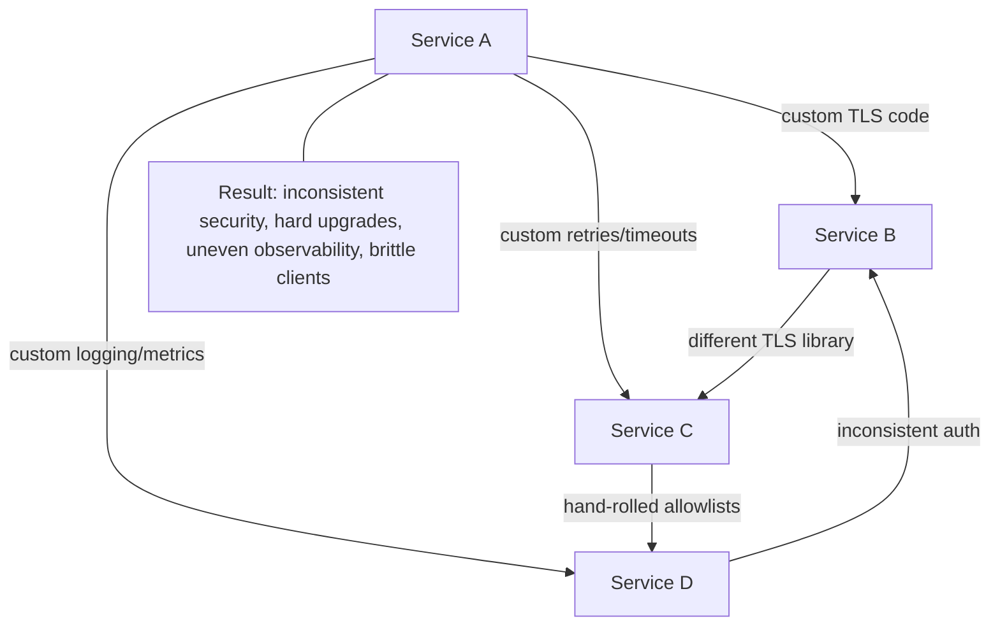
```mermaid
graph TD
  A["Service A"] -->|"custom TLS code"| B["Service B"]
  A -->|"custom retries/timeouts"| C["Service C"]
  A -->|"custom logging/metrics"| D["Service D"]

  B -->|"different TLS library"| C
  C -->|"hand-rolled allowlists"| D
  D -->|"inconsistent auth"| B

  Note1["Result: inconsistent security, hard upgrades, uneven observability, brittle clients"]
  A --- Note1
```

---

# 1) The solution at 10,000 ft: “standardize the network edge of every service”

This shows the **core mesh contract**: apps talk locally; proxies do the hard stuff.

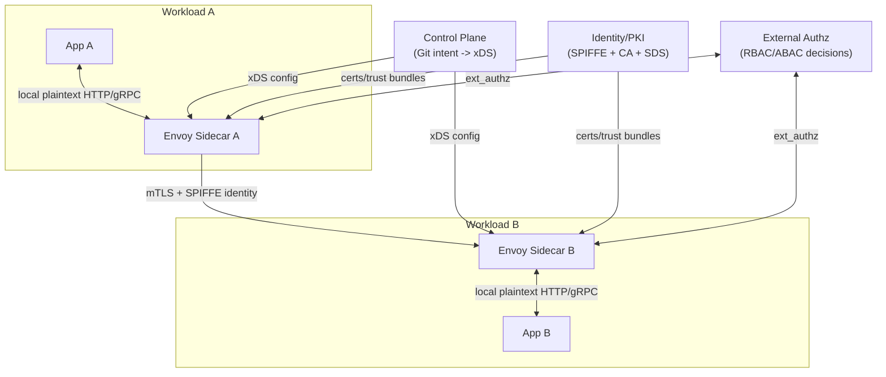
```mermaid
graph TD
  subgraph WorkloadA["Workload A"]
    AppA["App A"]
    EnvoyA["Envoy Sidecar A"]
    AppA <-->|"local plaintext HTTP/gRPC"| EnvoyA
  end

  subgraph WorkloadB["Workload B"]
    EnvoyB["Envoy Sidecar B"]
    AppB["App B"]
    EnvoyB <-->|"local plaintext HTTP/gRPC"| AppB
  end

  EnvoyA -->|"mTLS + SPIFFE identity"| EnvoyB

  CP["Control Plane<br/>(Git intent -> xDS)"] -->|"xDS config"| EnvoyA
  CP -->|"xDS config"| EnvoyB

  ID["Identity/PKI<br/>(SPIFFE + CA + SDS)"] -->|"certs/trust bundles"| EnvoyA
  ID -->|"certs/trust bundles"| EnvoyB

  Authz["External Authz<br/>(RBAC/ABAC decisions)"] <-->|"ext_authz"| EnvoyA
  Authz <-->|"ext_authz"| EnvoyB
```

---

# 2) Inside one workload: “ingress vs egress” responsibilities

This clarifies the **boundary**: the app doesn’t accept traffic from the world; Envoy does.

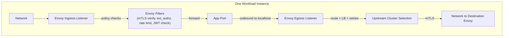
```mermaid
graph TD
  subgraph Workload["One Workload Instance"]
    Net["Network"] --> IngressL["Envoy Ingress Listener"]
    IngressL -->|"policy checks"| Filters["Envoy Filters<br/>(mTLS verify, ext_authz, rate limit, JWT check)"]
    Filters -->|"forward"| App["App Port"]

    App -->|"outbound to localhost"| EgressL["Envoy Egress Listener"]
    EgressL -->|"route + LB + retries"| Up["Upstream Cluster Selection"]
    Up -->|"mTLS"| Net2["Network to Destination Envoy"]
  end
```

---

# 3) Control plane pipeline: “Git intent → validated config → xDS streams”

This answers: **“How does a change in Git become behavior in proxies?”**

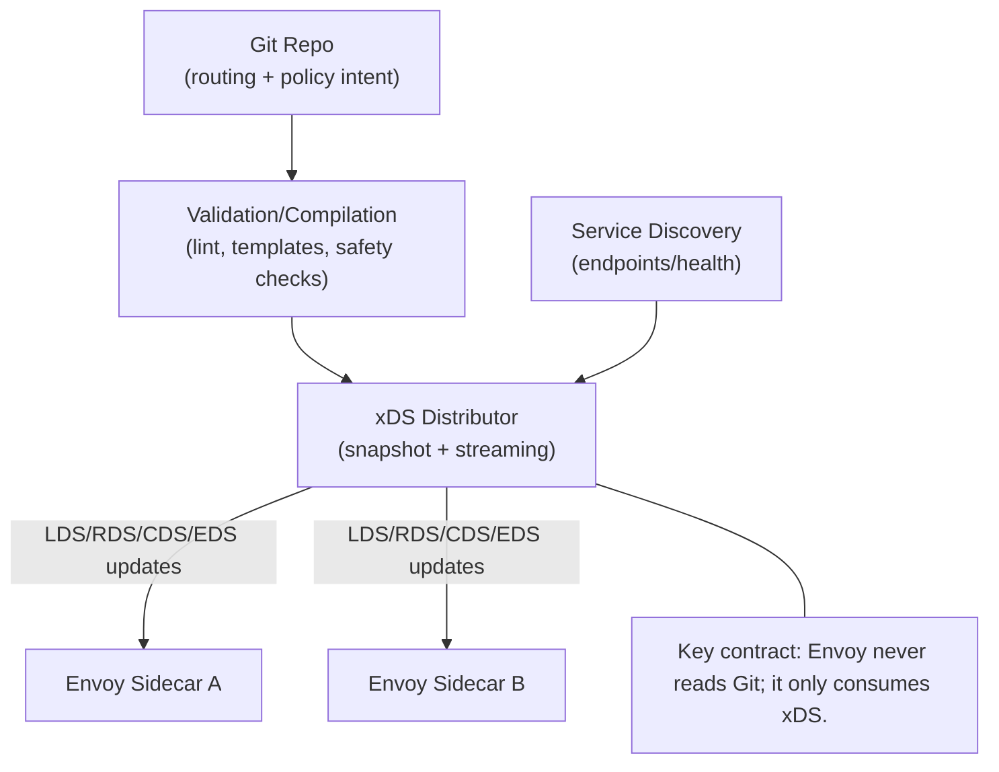
```mermaid
graph TD
  Git["Git Repo<br/>(routing + policy intent)"]
  CI["Validation/Compilation<br/>(lint, templates, safety checks)"]
  XDS["xDS Distributor<br/>(snapshot + streaming)"]
  SD["Service Discovery<br/>(endpoints/health)"]
  Envoy1["Envoy Sidecar A"]
  Envoy2["Envoy Sidecar B"]

  Git --> CI --> XDS
  SD --> XDS

  XDS -->|"LDS/RDS/CDS/EDS updates"| Envoy1
  XDS -->|"LDS/RDS/CDS/EDS updates"| Envoy2

  Note["Key contract: Envoy never reads Git; it only consumes xDS."]
  XDS --- Note
```

---

# 4) Identity lifecycle: “SPIFFE → cert issuance → SDS → rotation”

This answers: **“Where do certs come from, and how do they rotate without app code?”**

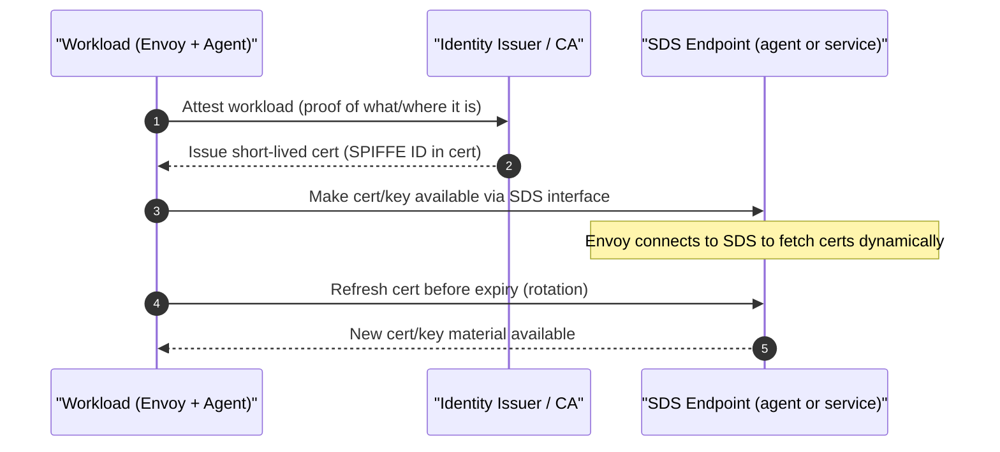
```mermaid
sequenceDiagram
  autonumber
  participant W as "Workload (Envoy + Agent)"
  participant Issuer as "Identity Issuer / CA"
  participant SDS as "SDS Endpoint (agent or service)"

  W->>Issuer: Attest workload (proof of what/where it is)
  Issuer-->>W: Issue short-lived cert (SPIFFE ID in cert)
  W->>SDS: Make cert/key available via SDS interface
  Note over SDS: Envoy connects to SDS to fetch certs dynamically
  W->>SDS: Refresh cert before expiry (rotation)
  SDS-->>W: New cert/key material available
```

---

# 5) mTLS handshake: “how Envoy learns the caller’s identity”

This answers: **“How does the callee know who is calling?”**

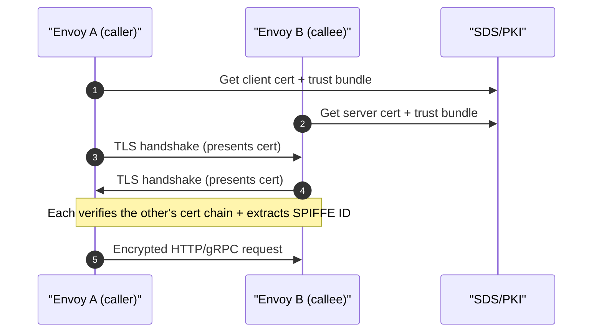
```mermaid
sequenceDiagram
  autonumber
  participant EnvoyA as "Envoy A (caller)"
  participant EnvoyB as "Envoy B (callee)"
  participant SDS as "SDS/PKI"

  EnvoyA->>SDS: Get client cert + trust bundle
  EnvoyB->>SDS: Get server cert + trust bundle

  EnvoyA->>EnvoyB: TLS handshake (presents cert)
  EnvoyB->>EnvoyA: TLS handshake (presents cert)
  Note over EnvoyA,EnvoyB: Each verifies the other's cert chain + extracts SPIFFE ID
  EnvoyA->>EnvoyB: Encrypted HTTP/gRPC request
```

---

# 6) External authorization (ext_authz): “decision vs enforcement split”

This answers: **“Who decides allow/deny, and who enforces it?”**

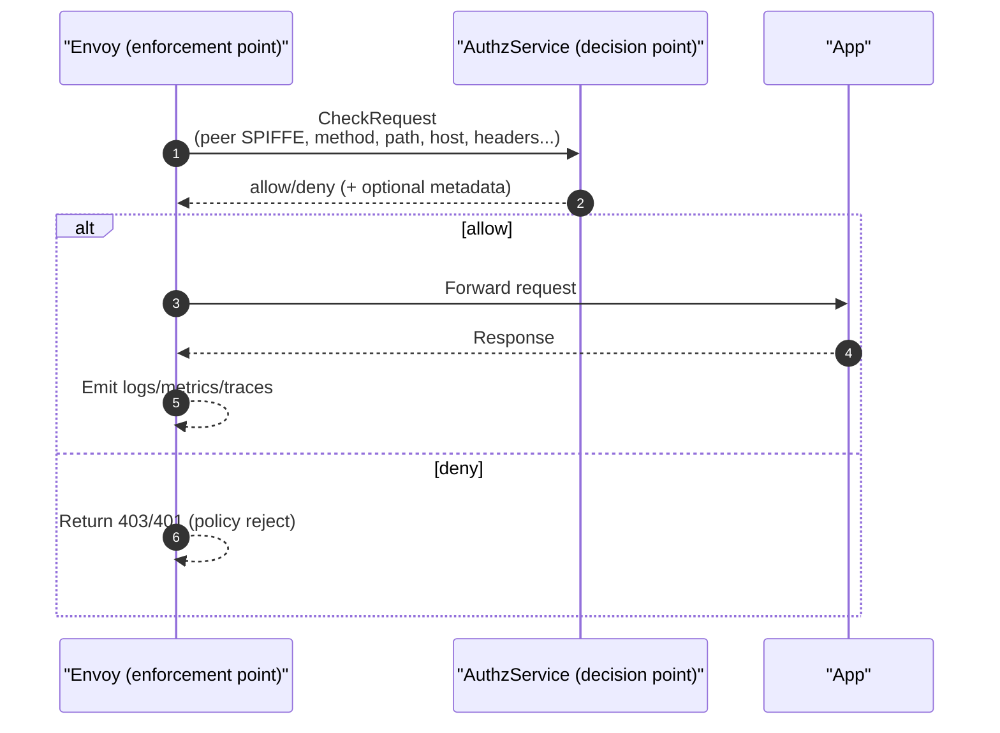
```mermaid
sequenceDiagram
  autonumber
  participant Envoy as "Envoy (enforcement point)"
  participant Authz as "AuthzService (decision point)"
  participant App as "App"

  Envoy->>Authz: CheckRequest<br/>(peer SPIFFE, method, path, host, headers...)
  Authz-->>Envoy: allow/deny (+ optional metadata)
  alt allow
    Envoy->>App: Forward request
    App-->>Envoy: Response
    Envoy-->>Envoy: Emit logs/metrics/traces
  else deny
    Envoy-->>Envoy: Return 403/401 (policy reject)
  end
```

---

# 7) Secret access: “SPIFFE authenticates; secret store authorizes”

This answers: **“How do services read secrets safely and least-privilege?”**

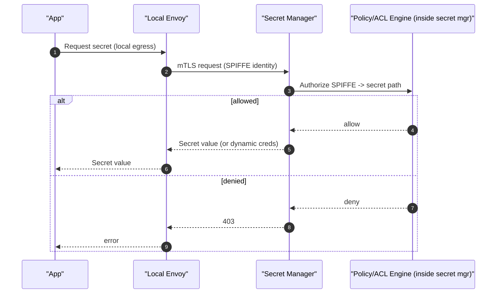
```mermaid
sequenceDiagram
  autonumber
  participant App as "App"
  participant Envoy as "Local Envoy"
  participant Secret as "Secret Manager"
  participant Authz as "Policy/ACL Engine (inside secret mgr)"

  App->>Envoy: Request secret (local egress)
  Envoy->>Secret: mTLS request (SPIFFE identity)
  Secret->>Authz: Authorize SPIFFE -> secret path
  alt allowed
    Authz-->>Secret: allow
    Secret-->>Envoy: Secret value (or dynamic creds)
    Envoy-->>App: Secret value
  else denied
    Authz-->>Secret: deny
    Secret-->>Envoy: 403
    Envoy-->>App: error
  end
```

---

# 8) Token vending + downstream API: “SPIFFE gets token; JWT carries user/client context”

This answers: **“When do we need JWTs if we already have SPIFFE?”**

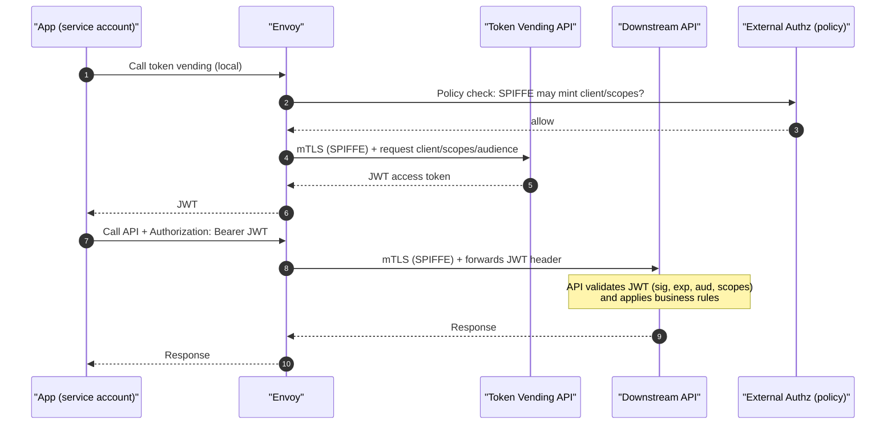
```mermaid
sequenceDiagram
  autonumber
  participant App as "App (service account)"
  participant Envoy as "Envoy"
  participant Vending as "Token Vending API"
  participant API as "Downstream API"
  participant Authz as "External Authz (policy)"

  %% Mint token
  App->>Envoy: Call token vending (local)
  Envoy->>Authz: Policy check: SPIFFE may mint client/scopes?
  Authz-->>Envoy: allow
  Envoy->>Vending: mTLS (SPIFFE) + request client/scopes/audience
  Vending-->>Envoy: JWT access token
  Envoy-->>App: JWT

  %% Use token
  App->>Envoy: Call API + Authorization: Bearer JWT
  Envoy->>API: mTLS (SPIFFE) + forwards JWT header
  Note over API: API validates JWT (sig, exp, aud, scopes)<br/>and applies business rules
  API-->>Envoy: Response
  Envoy-->>App: Response
```

---

# 9) Observability: “where logs/metrics/traces come from (and why it’s consistent)”

This answers: **“Why does a mesh make debugging easier?”**

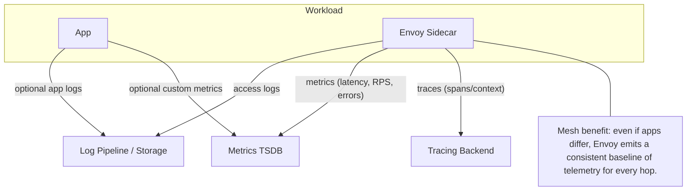
```mermaid
graph TD
  subgraph Workload["Workload"]
    App["App"]
    Envoy["Envoy Sidecar"]
  end

  Envoy -->|"access logs"| Logs["Log Pipeline / Storage"]
  Envoy -->|"metrics (latency, RPS, errors)"| Metrics["Metrics TSDB"]
  Envoy -->|"traces (spans/context)"| Traces["Tracing Backend"]

  App -->|"optional app logs"| Logs
  App -->|"optional custom metrics"| Metrics

  Note["Mesh benefit: even if apps differ, Envoy emits a consistent baseline of telemetry for every hop."]
  Envoy --- Note
```

---

# 10) Safe evolution: canary rollout without client code changes (traffic split)

This answers: **“How do we ship changes safely across many callers?”**

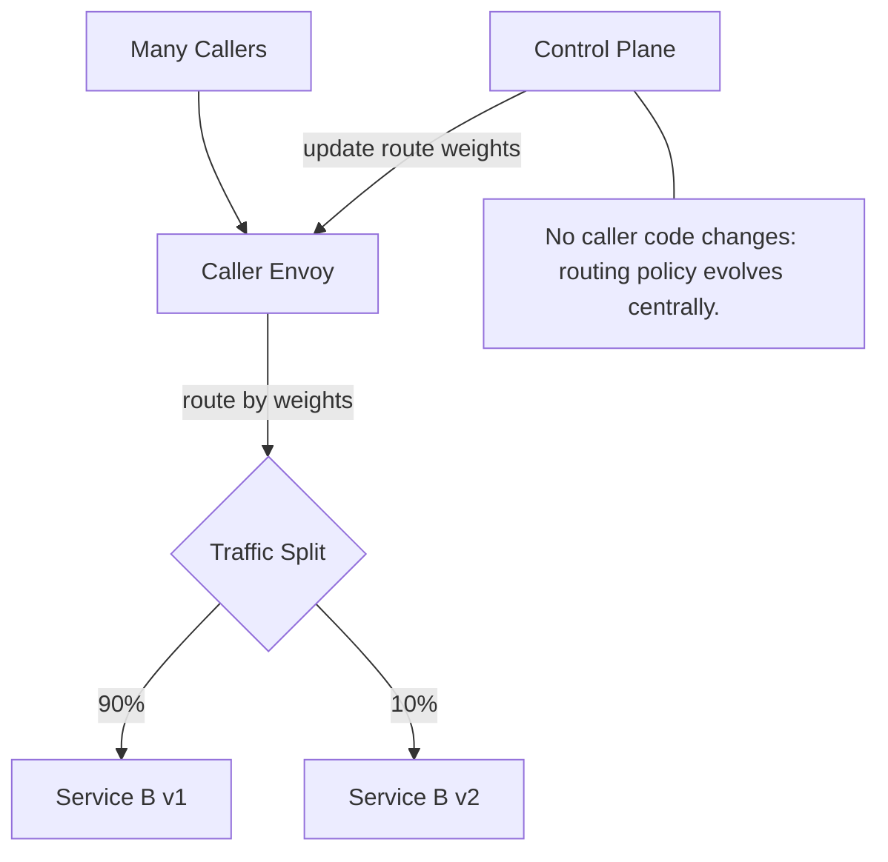
```mermaid
graph TD
  Caller["Many Callers"] --> EnvoyA["Caller Envoy"]
  EnvoyA -->|"route by weights"| Split{"Traffic Split"}
  Split -->|"90%"| Stable["Service B v1"]
  Split -->|"10%"| Canary["Service B v2"]

  CP["Control Plane"] -->|"update route weights"| EnvoyA
  Note["No caller code changes: routing policy evolves centrally."]
  CP --- Note
```

---

# 11) Complete request flow: "end-to-end journey with all security layers"

This answers: **"What happens at every step when Service A calls Service B?"**

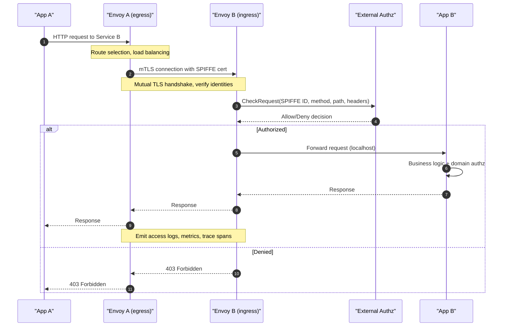
```mermaid
sequenceDiagram
  autonumber
  participant AppA as "App A"
  participant EnvoyA as "Envoy A (egress)"
  participant EnvoyB as "Envoy B (ingress)"
  participant AuthzSvc as "External Authz"
  participant AppB as "App B"

  AppA->>EnvoyA: HTTP request to Service B
  Note over EnvoyA: Route selection, load balancing
  EnvoyA->>EnvoyB: mTLS connection with SPIFFE cert
  Note over EnvoyA,EnvoyB: Mutual TLS handshake, verify identities
  EnvoyB->>AuthzSvc: CheckRequest(SPIFFE ID, method, path, headers)
  AuthzSvc-->>EnvoyB: Allow/Deny decision
  alt Authorized
    EnvoyB->>AppB: Forward request (localhost)
    AppB->>AppB: Business logic + domain authz
    AppB-->>EnvoyB: Response
    EnvoyB-->>EnvoyA: Response
    EnvoyA-->>AppA: Response
    Note over EnvoyA,EnvoyB: Emit access logs, metrics, trace spans
  else Denied
    EnvoyB-->>EnvoyA: 403 Forbidden
    EnvoyA-->>AppA: 403 Forbidden
  end
```

---

# 12) Service mesh architecture layers: "separation of concerns"

This answers: **"How are responsibilities divided across the mesh stack?"**

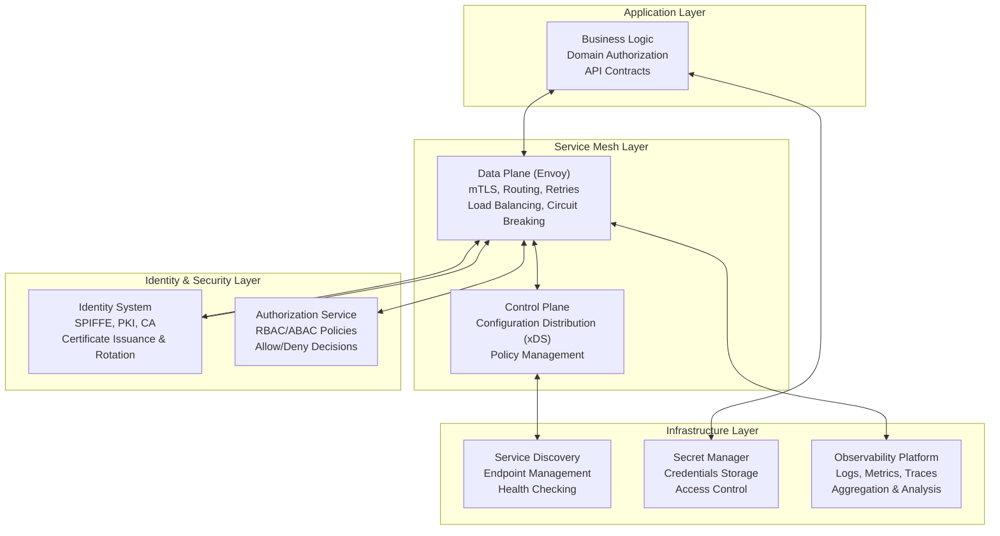
```mermaid
graph TB
  subgraph "Application Layer"
    BizLogic["Business Logic<br/>Domain Authorization<br/>API Contracts"]
  end

  subgraph "Service Mesh Layer"
    DataPlane["Data Plane (Envoy)<br/>mTLS, Routing, Retries<br/>Load Balancing, Circuit Breaking"]
    ControlPlane["Control Plane<br/>Configuration Distribution (xDS)<br/>Policy Management"]
  end

  subgraph "Identity & Security Layer"
    Identity["Identity System<br/>SPIFFE, PKI, CA<br/>Certificate Issuance & Rotation"]
    AuthZ["Authorization Service<br/>RBAC/ABAC Policies<br/>Allow/Deny Decisions"]
  end

  subgraph "Infrastructure Layer"
    Discovery["Service Discovery<br/>Endpoint Management<br/>Health Checking"]
    Secrets["Secret Manager<br/>Credentials Storage<br/>Access Control"]
    Observability["Observability Platform<br/>Logs, Metrics, Traces<br/>Aggregation & Analysis"]
  end

  BizLogic <--> DataPlane
  DataPlane <--> ControlPlane
  DataPlane <--> Identity
  DataPlane <--> AuthZ
  DataPlane <--> Observability
  ControlPlane <--> Discovery
  BizLogic <--> Secrets
  Identity --> DataPlane
```

---

# 13) mTLS certificate rotation: "zero-downtime credential refresh"

This answers: **"How do certificates rotate without service disruption?"**

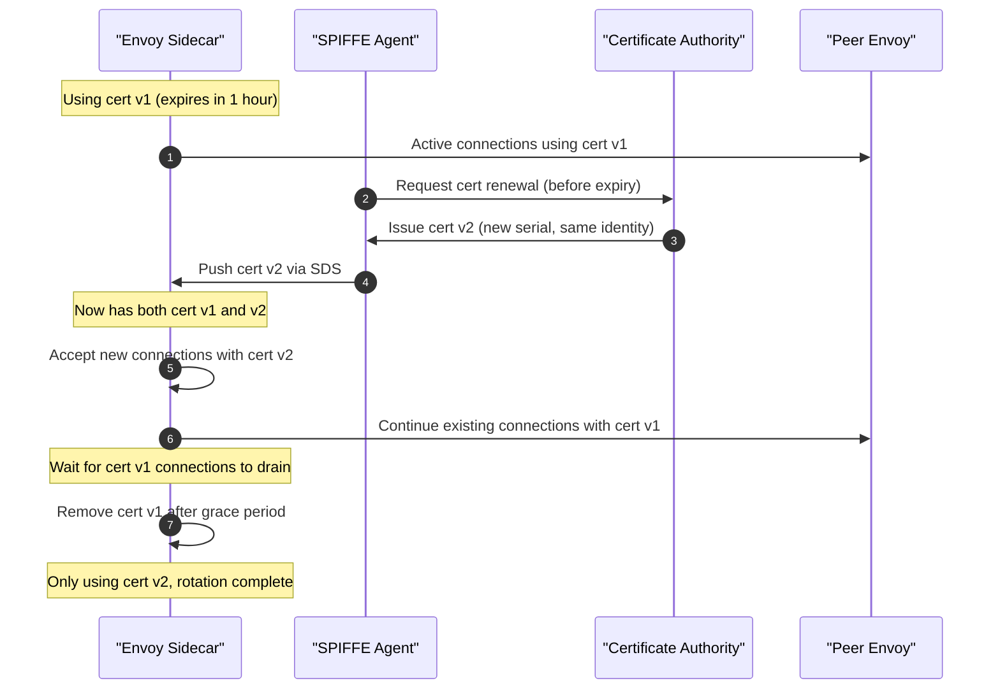
```mermaid
sequenceDiagram
  autonumber
  participant Envoy as "Envoy Sidecar"
  participant Agent as "SPIFFE Agent"
  participant CA as "Certificate Authority"
  participant Peer as "Peer Envoy"

  Note over Envoy: Using cert v1 (expires in 1 hour)
  Envoy->>Peer: Active connections using cert v1

  Agent->>CA: Request cert renewal (before expiry)
  CA->>Agent: Issue cert v2 (new serial, same identity)
  Agent->>Envoy: Push cert v2 via SDS

  Note over Envoy: Now has both cert v1 and v2
  Envoy->>Envoy: Accept new connections with cert v2
  Envoy->>Peer: Continue existing connections with cert v1

  Note over Envoy: Wait for cert v1 connections to drain
  Envoy->>Envoy: Remove cert v1 after grace period

  Note over Envoy: Only using cert v2, rotation complete
```

---

# 14) Traffic management: "advanced routing patterns"

This answers: **"What routing capabilities does the mesh provide?"**

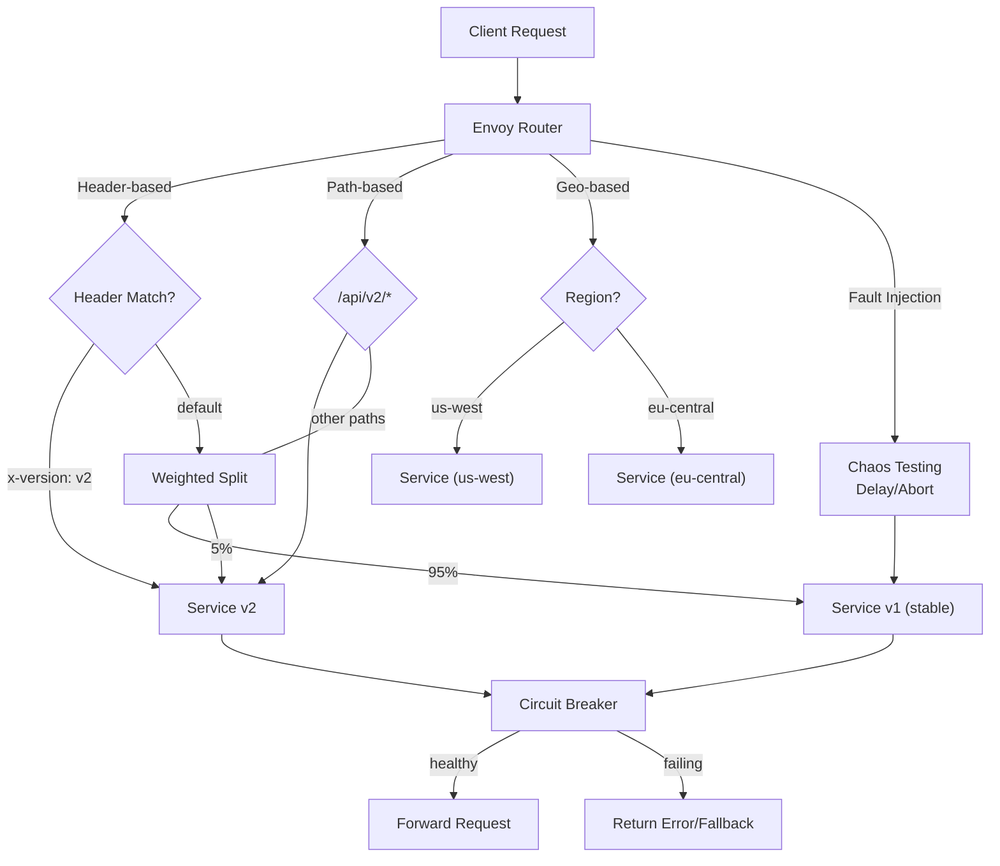
```mermaid
graph TD
  Client["Client Request"] --> Router["Envoy Router"]

  Router -->|"Header-based"| HeaderRoute{"Header Match?"}
  HeaderRoute -->|"x-version: v2"| ServiceV2["Service v2"]
  HeaderRoute -->|"default"| WeightRoute["Weighted Split"]

  Router -->|"Path-based"| PathRoute{"/api/v2/*"}
  PathRoute --> ServiceV2
  PathRoute ---|"other paths"| WeightRoute

  WeightRoute -->|"95%"| ServiceV1["Service v1 (stable)"]
  WeightRoute -->|"5%"| ServiceV2

  Router -->|"Geo-based"| GeoRoute{"Region?"}
  GeoRoute -->|"us-west"| USWest["Service (us-west)"]
  GeoRoute -->|"eu-central"| EUCentral["Service (eu-central)"]

  Router -->|"Fault Injection"| FaultTest["Chaos Testing<br/>Delay/Abort"]
  FaultTest --> ServiceV1

  ServiceV1 --> CircuitBreaker["Circuit Breaker"]
  ServiceV2 --> CircuitBreaker

  CircuitBreaker -->|"healthy"| Success["Forward Request"]
  CircuitBreaker -->|"failing"| Fallback["Return Error/Fallback"]
```

---

# 15) Observability correlation: "distributed tracing across services"

This answers: **"How do we trace a request across multiple services?"**

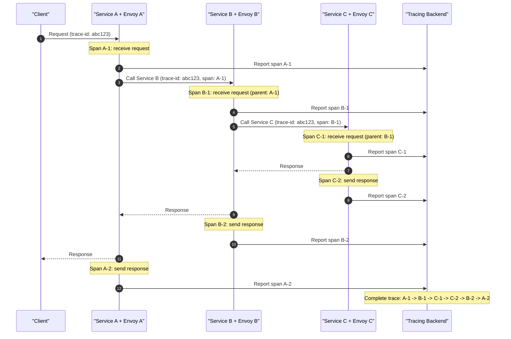
```mermaid
sequenceDiagram
  autonumber
  participant Client as "Client"
  participant ServiceA as "Service A + Envoy A"
  participant ServiceB as "Service B + Envoy B"
  participant ServiceC as "Service C + Envoy C"
  participant Tracing as "Tracing Backend"

  Client->>ServiceA: Request (trace-id: abc123)
  Note over ServiceA: Span A-1: receive request
  ServiceA->>Tracing: Report span A-1

  ServiceA->>ServiceB: Call Service B (trace-id: abc123, span: A-1)
  Note over ServiceB: Span B-1: receive request (parent: A-1)
  ServiceB->>Tracing: Report span B-1

  ServiceB->>ServiceC: Call Service C (trace-id: abc123, span: B-1)
  Note over ServiceC: Span C-1: receive request (parent: B-1)
  ServiceC->>Tracing: Report span C-1

  ServiceC-->>ServiceB: Response
  Note over ServiceC: Span C-2: send response
  ServiceC->>Tracing: Report span C-2

  ServiceB-->>ServiceA: Response
  Note over ServiceB: Span B-2: send response
  ServiceB->>Tracing: Report span B-2

  ServiceA-->>Client: Response
  Note over ServiceA: Span A-2: send response
  ServiceA->>Tracing: Report span A-2

  Note over Tracing: Complete trace: A-1 -> B-1 -> C-1 -> C-2 -> B-2 -> A-2
```

---

# 16) Authorization policy evaluation: "RBAC vs ABAC decision flow"

This answers: **"How are different authorization models applied?"**

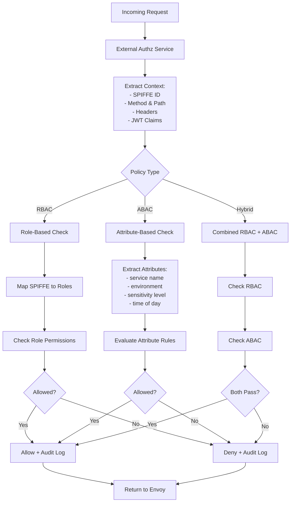
```mermaid
graph TD
  Request["Incoming Request"] --> ExtAuthz["External Authz Service"]

  ExtAuthz --> ExtractContext["Extract Context:<br/>- SPIFFE ID<br/>- Method & Path<br/>- Headers<br/>- JWT Claims"]

  ExtractContext --> PolicyType{"Policy Type"}

  PolicyType -->|"RBAC"| RBACEval["Role-Based Check"]
  RBACEval --> RoleMap["Map SPIFFE to Roles"]
  RoleMap --> RolePerms["Check Role Permissions"]
  RolePerms --> RBACDecision{"Allowed?"}

  PolicyType -->|"ABAC"| ABACEval["Attribute-Based Check"]
  ABACEval --> AttrExtract["Extract Attributes:<br/>- service name<br/>- environment<br/>- sensitivity level<br/>- time of day"]
  AttrExtract --> AttrRules["Evaluate Attribute Rules"]
  AttrRules --> ABACDecision{"Allowed?"}

  PolicyType -->|"Hybrid"| HybridEval["Combined RBAC + ABAC"]
  HybridEval --> RBACFirst["Check RBAC"]
  RBACFirst --> ABACSecond["Check ABAC"]
  ABACSecond --> HybridDecision{"Both Pass?"}

  RBACDecision -->|"Yes"| Allow["Allow + Audit Log"]
  ABACDecision -->|"Yes"| Allow
  HybridDecision -->|"Yes"| Allow

  RBACDecision -->|"No"| Deny["Deny + Audit Log"]
  ABACDecision -->|"No"| Deny
  HybridDecision -->|"No"| Deny

  Allow --> Response["Return to Envoy"]
  Deny --> Response
```

---

# 17) Multi-cluster service mesh: "federated trust domains"

This answers: **"How do services communicate across clusters or environments?"**

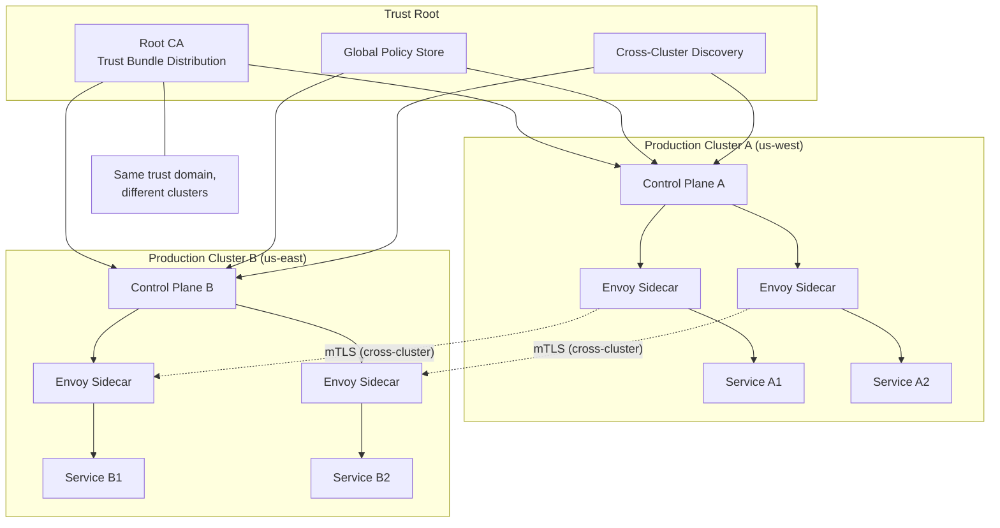
```mermaid
graph TB
  subgraph ClusterA["Production Cluster A (us-west)"]
    direction TB
    CPA["Control Plane A"]
    EnvoyA1["Envoy Sidecar"]
    EnvoyA2["Envoy Sidecar"]
    ServiceA1["Service A1"]
    ServiceA2["Service A2"]

    EnvoyA1 --> ServiceA1
    EnvoyA2 --> ServiceA2
    CPA --> EnvoyA1
    CPA --> EnvoyA2
  end

  subgraph ClusterB["Production Cluster B (us-east)"]
    direction TB
    CPB["Control Plane B"]
    EnvoyB1["Envoy Sidecar"]
    EnvoyB2["Envoy Sidecar"]
    ServiceB1["Service B1"]
    ServiceB2["Service B2"]

    EnvoyB1 --> ServiceB1
    EnvoyB2 --> ServiceB2
    CPB --> EnvoyB1
    CPB --> EnvoyB2
  end

  subgraph TrustRoot["Trust Root"]
    RootCA["Root CA<br/>Trust Bundle Distribution"]
    GlobalPolicy["Global Policy Store"]
    ServiceDiscovery["Cross-Cluster Discovery"]
  end

  RootCA --> CPA
  RootCA --> CPB
  GlobalPolicy --> CPA
  GlobalPolicy --> CPB
  ServiceDiscovery --> CPA
  ServiceDiscovery --> CPB

  EnvoyA1 -.->|"mTLS (cross-cluster)"| EnvoyB1
  EnvoyA2 -.->|"mTLS (cross-cluster)"| EnvoyB2

  Note1["Same trust domain,<br/>different clusters"]
  RootCA --- Note1
```

---

# 18) Failure modes and debugging: "systematic troubleshooting"

This answers: **"How do I diagnose what went wrong?"**

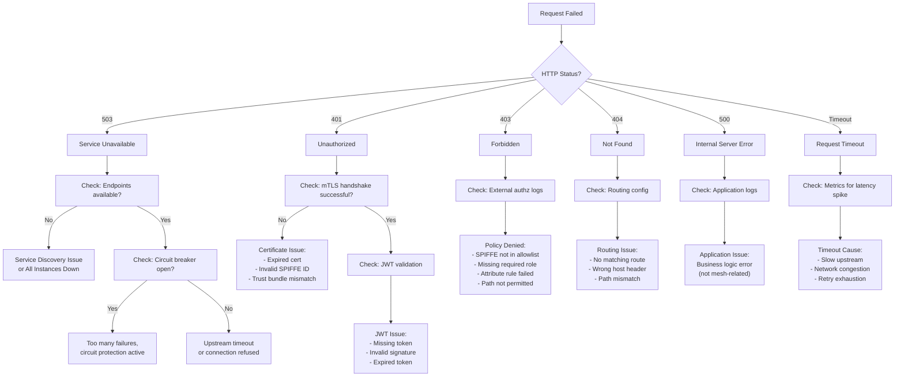
```mermaid
graph TD
  Error["Request Failed"] --> StatusCode{"HTTP Status?"}

  StatusCode -->|"503"| Unavailable["Service Unavailable"]
  Unavailable --> CheckEndpoints["Check: Endpoints available?"]
  CheckEndpoints -->|"No"| DiscoveryIssue["Service Discovery Issue<br/>or All Instances Down"]
  CheckEndpoints -->|"Yes"| CheckCircuit["Check: Circuit breaker open?"]
  CheckCircuit -->|"Yes"| CircuitOpen["Too many failures,<br/>circuit protection active"]
  CheckCircuit -->|"No"| UpstreamTimeout["Upstream timeout<br/>or connection refused"]

  StatusCode -->|"401"| Unauthorized["Unauthorized"]
  Unauthorized --> CheckMTLS["Check: mTLS handshake successful?"]
  CheckMTLS -->|"No"| CertIssue["Certificate Issue:<br/>- Expired cert<br/>- Invalid SPIFFE ID<br/>- Trust bundle mismatch"]
  CheckMTLS -->|"Yes"| CheckJWT["Check: JWT validation"]
  CheckJWT --> JWTIssue["JWT Issue:<br/>- Missing token<br/>- Invalid signature<br/>- Expired token"]

  StatusCode -->|"403"| Forbidden["Forbidden"]
  Forbidden --> CheckAuthz["Check: External authz logs"]
  CheckAuthz --> PolicyDeny["Policy Denied:<br/>- SPIFFE not in allowlist<br/>- Missing required role<br/>- Attribute rule failed<br/>- Path not permitted"]

  StatusCode -->|"404"| NotFound["Not Found"]
  NotFound --> CheckRouting["Check: Routing config"]
  CheckRouting --> RoutingIssue["Routing Issue:<br/>- No matching route<br/>- Wrong host header<br/>- Path mismatch"]

  StatusCode -->|"500"| ServerError["Internal Server Error"]
  ServerError --> CheckAppLogs["Check: Application logs"]
  CheckAppLogs --> AppIssue["Application Issue:<br/>Business logic error<br/>(not mesh-related)"]

  StatusCode -->|"Timeout"| Timeout["Request Timeout"]
  Timeout --> CheckLatency["Check: Metrics for latency spike"]
  CheckLatency --> TimeoutCause["Timeout Cause:<br/>- Slow upstream<br/>- Network congestion<br/>- Retry exhaustion"]
```

---

# 19) Secret rotation lifecycle: "safe credential updates"

This answers: **"How are application secrets rotated without downtime?"**

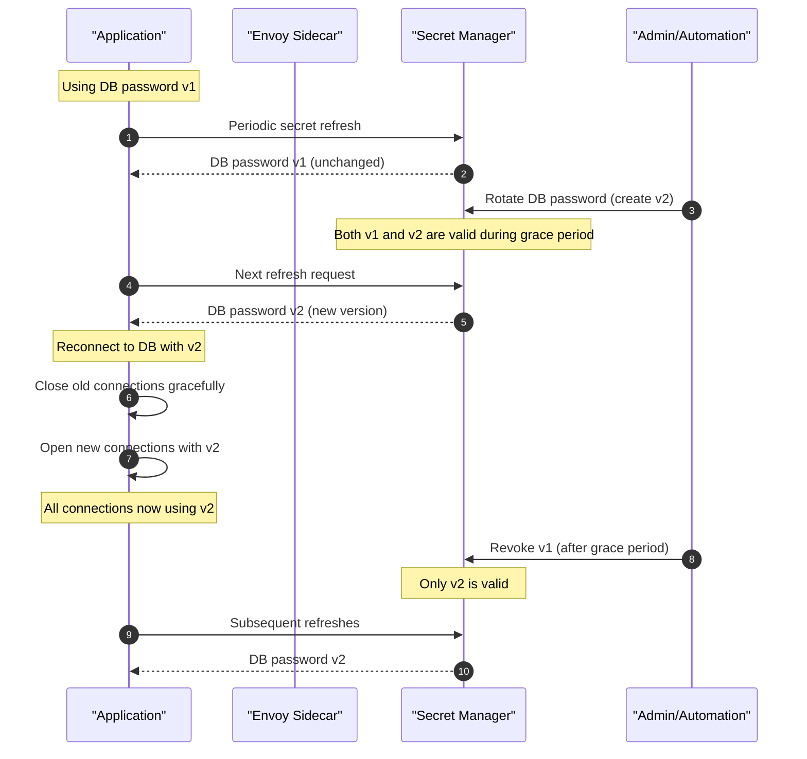
```mermaid
sequenceDiagram
  autonumber
  participant App as "Application"
  participant Envoy as "Envoy Sidecar"
  participant SecretMgr as "Secret Manager"
  participant Admin as "Admin/Automation"

  Note over App: Using DB password v1
  App->>SecretMgr: Periodic secret refresh
  SecretMgr-->>App: DB password v1 (unchanged)

  Admin->>SecretMgr: Rotate DB password (create v2)
  Note over SecretMgr: Both v1 and v2 are valid during grace period

  App->>SecretMgr: Next refresh request
  SecretMgr-->>App: DB password v2 (new version)

  Note over App: Reconnect to DB with v2
  App->>App: Close old connections gracefully
  App->>App: Open new connections with v2

  Note over App: All connections now using v2

  Admin->>SecretMgr: Revoke v1 (after grace period)
  Note over SecretMgr: Only v2 is valid

  App->>SecretMgr: Subsequent refreshes
  SecretMgr-->>App: DB password v2
```

---

# 20) OAuth token flow with mesh: "user context propagation"

This answers: **"How do user permissions flow through service chains?"**

```mermaid
sequenceDiagram
  autonumber
  participant User as "End User"
  participant Gateway as "API Gateway"
  participant ServiceA as "Service A"
  participant TokenVend as "Token Vending"
  participant ServiceB as "Service B"

  User->>Gateway: Request with OAuth token (user token)
  Note over Gateway: Validate user token
  Gateway->>ServiceA: Forward request + user token

  Note over ServiceA: Extract user context from JWT
  ServiceA->>ServiceA: Business logic for user

  ServiceA->>TokenVend: Request service token (mTLS auth)
  Note over TokenVend: Verify SPIFFE ID of Service A
  TokenVend-->>ServiceA: Service token (narrower scope)

  ServiceA->>ServiceB: Call with service token + user context
  Note over ServiceB: Two-level authorization:<br/>1. Service A allowed to call (via mTLS + policy)<br/>2. User allowed to perform action (via JWT)

  ServiceB->>ServiceB: Validate both:<br/>- SPIFFE ID (Service A identity)<br/>- JWT claims (user permissions)

  ServiceB-->>ServiceA: Response (authorized by both layers)
  ServiceA-->>Gateway: Response
  Gateway-->>User: Response
```

---

## If you want even more diagrams, tell me which "chapter" you want next

Pick 2–3 and I’ll expand into a full set:

1) **Failure-mode maps** (why you get 401 vs 403 vs 503 vs timeouts, and which component is responsible)  
2) **Multi-hop traces** (one request across 5 services, showing spans and where retries happen)  
3) **Policy design diagrams** (RBAC/ABAC examples; least privilege; “break-glass” access)  
4) **Multi-environment / multi-cluster meshes** (prod vs staging; trust domains; federation)  

Say which ones you want and whether you prefer **more sequence diagrams** or **more component graphs**.

