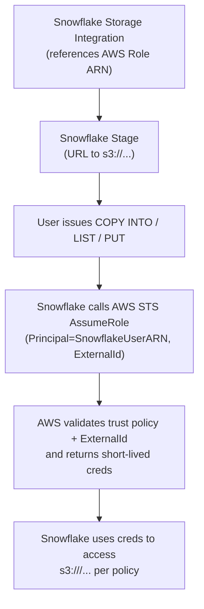
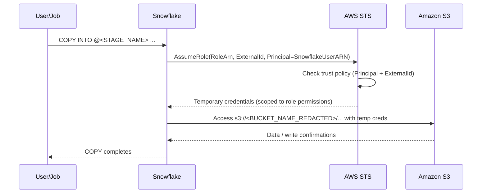

# AWS + Snowflake Storage Integration — Security Basics (Terraform, Roles, Policies)

## What each component is and how they identify each other

- **AWS IAM Role (target role)**: An identity Snowflake assumes to access your S3. Identified by its ARN (`arn:aws:iam::<AWS_ACCOUNT_ID>:role/<ROLE_NAME>`).
- **Trust Policy (who can assume the role?)**: Attached to the role. Lets a specific external principal (Snowflake’s IAM user) assume the role, but only when a correct `ExternalId` is supplied.
- **Permissions Policy (what can the role do?)**: Attached to the role. Grants S3 permissions (e.g., `GetObject`, `PutObject`, `ListBucket`) on specific buckets/prefixes.
- **Snowflake Storage Integration**: A Snowflake object that references your AWS role ARN and restricts S3 locations. Your stages use this integration.
- **Snowflake Stage**: A Snowflake object (e.g., `@my_stage`) bound to the storage integration and a bucket/prefix URL.

Identity linking:
- Snowflake Integration → references AWS Role ARN.
- AWS Role Trust Policy → references Snowflake IAM User ARN, requires `ExternalId`.
- Stage → references Integration → references Role → accesses S3.

## Why “Snowflake IAM user ARN + ExternalId” is secure enough

- Snowflake calls AWS STS `AssumeRole` with:
  - Principal = Snowflake IAM user ARN (must match the trust policy).
  - `ExternalId` (shared secret set in the trust policy).
- AWS validates both before issuing short‑lived credentials scoped by the role’s permissions policy.
- Prevents “confused deputy”: even if someone knows the role ARN, they cannot assume it without both the Snowflake user ARN AND the exact `ExternalId`.

## Minimal Terraform (obfuscated)

```terraform
# Role (WHO can assume) + Permissions (WHAT it can do)
resource "aws_iam_role" "snowflake_s3_access" {
  name               = "<ROLE_NAME>"
  assume_role_policy = <<POLICY
{
  "Version": "2012-10-17",
  "Statement": [{
    "Effect": "Allow",
    "Principal": { "AWS": "arn:aws:iam::<SNOWFLAKE_ACCOUNT_ID>:user/<SNOWFLAKE_USER_NAME>" },
    "Action": "sts:AssumeRole",
    "Condition": { "StringEquals": { "sts:ExternalId": "<EXTERNAL_ID_REDACTED>" } }
  }]
}
POLICY
}

resource "aws_iam_policy" "snowflake_s3_permissions" {
  name   = "<ROLE_POLICY_NAME>"
  policy = <<POLICY
{
  "Version": "2012-10-17",
  "Statement": [{
    "Sid": "S3Access",
    "Effect": "Allow",
    "Action": [ "s3:GetObject", "s3:PutObject", "s3:DeleteObject", "s3:ListBucket", "s3:GetBucketLocation" ],
    "Resource": [
      "arn:aws:s3:::<BUCKET_NAME_REDACTED>",
      "arn:aws:s3:::<BUCKET_NAME_REDACTED>/*"
    ]
  }]
}
POLICY
}

resource "aws_iam_policy_attachment" "attach" {
  name       = "<ATTACH_NAME>"
  roles      = [aws_iam_role.snowflake_s3_access.name]
  policy_arn = aws_iam_policy.snowflake_s3_permissions.arn
}
```

Snowflake SQL (obfuscated):
```sql
-- Storage Integration (references AWS Role ARN; restricts S3 URL scope)
CREATE OR REPLACE STORAGE INTEGRATION <INTEGRATION_NAME>
  TYPE = EXTERNAL_STAGE
  STORAGE_PROVIDER = 'S3'
  STORAGE_AWS_ROLE_ARN = 'arn:aws:iam::<AWS_ACCOUNT_ID>:role/<ROLE_NAME>'
  ENABLED = TRUE
  STORAGE_ALLOWED_LOCATIONS = ('s3://<BUCKET_NAME_REDACTED>/<PREFIX_OPTIONAL>/');

-- Stage (binds to integration + bucket URL)
CREATE OR REPLACE STAGE <STAGE_NAME>
  STORAGE_INTEGRATION = <INTEGRATION_NAME>
  URL = 's3://<BUCKET_NAME_REDACTED>/<PREFIX_OPTIONAL>/'
  FILE_FORMAT = (TYPE = CSV);
```

## End‑to‑end flow (high level)



## Security handshake (detail)



## Role vs Policy (in this setup)

- **Role**: The identity Snowflake temporarily becomes inside AWS (defined once, reusable).
- **Trust Policy** (on the role): WHO may assume the role (Snowflake IAM user) + under WHAT condition (correct `ExternalId`).
- **Permissions Policy** (attached to the role): WHAT actions the role can perform (which S3 buckets/paths, which verbs).

## Why this is secure

- No static AWS keys in Snowflake or code.
- Short‑lived credentials via STS.
- Least privilege via S3‑scoped permissions.
- Dual binding (Principal ARN + ExternalId) prevents confused‑deputy attacks.
- Snowflake stage restricts allowed S3 paths; integration restricts allowed locations.

## Using the stage (example)

```sql
COPY INTO @<STAGE_NAME>/exports/dt=2025-09-24/
FROM (SELECT * FROM <DB>.<SCHEMA>.<TABLE>)
FILE_FORMAT = (TYPE = PARQUET);
```

Glossary
- **ARN**: Amazon Resource Name (unique identifier for AWS entities).
- **ExternalId**: Shared secret in the trust policy; required in AssumeRole calls.
- **STS**: AWS Security Token Service; issues scoped, short‑lived credentials.
- **Stage**: Snowflake abstraction for external storage bound to an integration.
