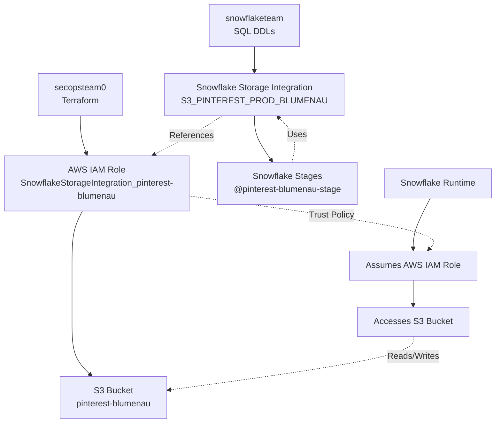
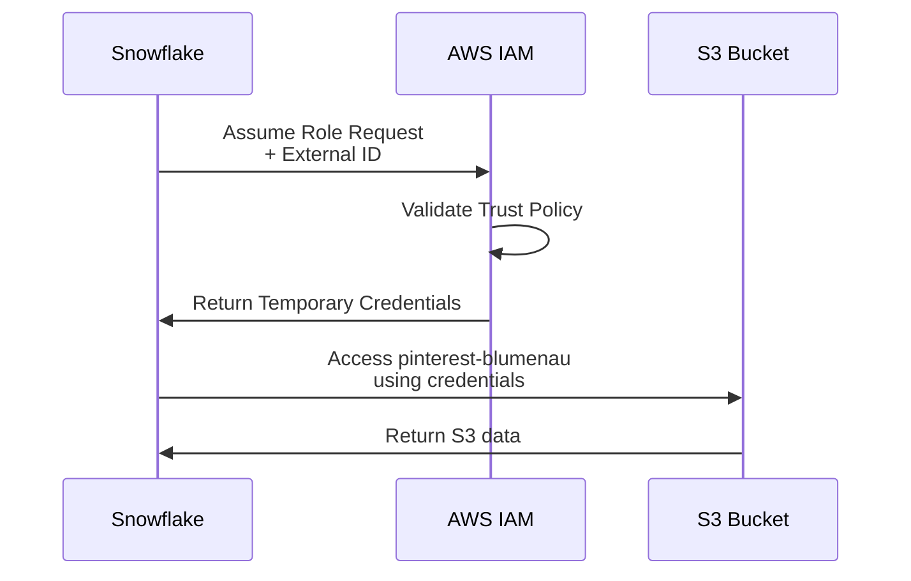

# Pinterest-Blumenau Snowflake Storage Integration

## Overview
This integration allows Snowflake to securely access Pinterest's `pinterest-blumenau` S3 bucket through AWS IAM role assumption.

## Architecture Flow



## Step-by-Step Process

### 1. secopsteam0 Creates AWS Infrastructure
```terraform
# AWS IAM Role with trust policy
resource "aws_iam_role" "SnowflakeStorageIntegration_pinterest-blumenau" {
  assume_role_policy = {
    "Principal": {
      "AWS": "arn:aws:iam::343182919852:user/oqyl-s-v2st0658"
    },
    "Condition": {
      "StringEquals": {
        "sts:ExternalId": "PINTERESTIT_SFCRole=4_XSO0HbFFydOsgyU3TT9gwnsWA1w="
      }
    }
  }
}
```

### 2. snowflaketeam Creates Snowflake Integration
```sql
-- Storage Integration
CREATE STORAGE INTEGRATION S3_PINTEREST_PROD_BLUMENAU
    TYPE=EXTERNAL_STAGE
    STORAGE_PROVIDER='S3'
    STORAGE_AWS_ROLE_ARN='arn:aws:iam::621763355519:role/SnowflakeStorageIntegration_pinterest-blumenau'
    ENABLED=true
    STORAGE_ALLOWED_LOCATIONS=('s3://pinterest-blumenau/');

-- Snowflake Stage
CREATE STAGE PINTEREST_BLUMENAU_STAGE
    FILE_FORMAT = TSV_FORMAT
    STORAGE_INTEGRATION = S3_PINTEREST_PROD_BLUMENAU
    URL = 's3://pinterest-blumenau';
```

### 3. Usage Example
```sql
-- Copy data to S3 via Snowflake stage
COPY INTO @pinterest-blumenau-stage/data/my_table/
FROM (SELECT * FROM my_source_table)
FILE_FORMAT = (TYPE = 'PARQUET');

-- List files in stage
LIST @pinterest-blumenau-stage/data/my_table/;
```

## Security Flow



## Components Summary

| Component | Created By | Purpose |
|-----------|------------|---------|
| AWS IAM Role | secopsteam0 | Allows Snowflake to access S3 |
| S3 Bucket Policy | secopsteam0 | Cross-account S3 permissions |
| Storage Integration | snowflaketeam | Snowflake configuration for AWS |
| Snowflake Stages | snowflaketeam | User-facing S3 access points |

## Key Files
- **Terraform**: `terraform-control-repo/subaccounts/partner_data_sharing_621763355519/iam/roles/SnowflakeStorageIntegration_pinterest-blumenau.tf`
- **SQL**: `spinner-workflows/dags/soxpii_native_tier_3_0/itedp/snowflake-deploy/sql/05_Misc_Deployments/20250327_BLUMENAU_AGENT_ROLE_FIX.sql`
