# AWS + Snowflake Storage Integration — Security Basics (Terraform, Roles, Policies)

## Executive Summary

This document provides a comprehensive guide for securely integrating [Snowflake](#glossary) with [AWS S3](#glossary) storage using [IAM roles](#glossary) and [storage integrations](#glossary). The implementation eliminates static credentials by leveraging [AWS STS](#glossary) [AssumeRole](#glossary) with [ExternalId](#glossary) validation, ensuring secure access through [short-lived credentials](#glossary).

**Key Benefits:**
- **Zero Static Credentials**: No permanent AWS access keys stored in [Snowflake](#glossary)
- **Automatic Token Rotation**: [Short-lived credentials](#glossary) issued by [AWS STS](#glossary) expire automatically
- **Confused Deputy Prevention**: [ExternalId](#glossary) validation prevents unauthorized [role](#glossary) assumption
- **Least Privilege Access**: [Permissions policies](#glossary) restrict access to specific [S3 buckets](#glossary) and operations
- **Infrastructure as Code**: [Terraform](#glossary) configurations enable version-controlled, repeatable deployments

**What You'll Learn:**
- How [IAM roles](#glossary), [trust policies](#glossary), and [permissions policies](#glossary) work together
- The security handshake between [Snowflake](#glossary) and AWS
- [Terraform](#glossary) configuration for automating infrastructure setup
- [Snowflake](#glossary) SQL commands for creating [storage integrations](#glossary) and [stages](#glossary)
- Best practices for multi-environment deployments

This production-ready pattern is suitable for enterprise data pipelines requiring secure, scalable cloud storage integration.

## What each component is and how they identify each other

- **[AWS IAM Role](#glossary) (target role)**: An identity [Snowflake](#glossary) assumes to access your [S3](#glossary). Identified by its [ARN](#glossary) (`arn:aws:iam::<AWS_ACCOUNT_ID>:role/<ROLE_NAME>`).
- **[Trust Policy](#glossary) (who can assume the role?)**: Attached to the [role](#glossary). Lets a specific external [principal](#glossary) ([Snowflake](#glossary)'s IAM user) assume the [role](#glossary), but only when a correct [ExternalId](#glossary) is supplied.
- **[Permissions Policy](#glossary) (what can the role do?)**: Attached to the [role](#glossary). Grants [S3](#glossary) permissions (e.g., `GetObject`, `PutObject`, `ListBucket`) on specific [buckets](#glossary)/prefixes.
- **[Snowflake Storage Integration](#glossary)**: A [Snowflake](#glossary) object that references your AWS [role](#glossary) [ARN](#glossary) and restricts [S3](#glossary) locations. Your [stages](#glossary) use this integration.
- **[Snowflake Stage](#glossary)**: A [Snowflake](#glossary) object (e.g., `@my_stage`) bound to the [storage integration](#glossary) and a [bucket](#glossary)/prefix [URL](#glossary).

Identity linking:
- [Snowflake](#glossary) Integration → references AWS [Role](#glossary) [ARN](#glossary).
- AWS [Role](#glossary) [Trust Policy](#glossary) → references [Snowflake](#glossary) IAM User [ARN](#glossary), requires [ExternalId](#glossary).
- [Stage](#glossary) → references Integration → references [Role](#glossary) → accesses [S3](#glossary).

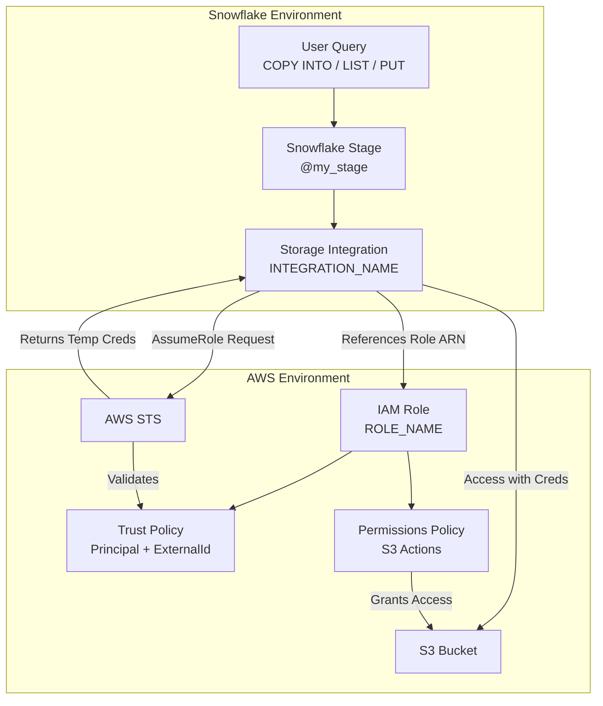

## Why "Snowflake IAM user ARN + ExternalId" is secure enough

- [Snowflake](#glossary) calls [AWS STS](#glossary) [AssumeRole](#glossary) with:
  - [Principal](#glossary) = [Snowflake](#glossary) IAM user [ARN](#glossary) (must match the [trust policy](#glossary)).
  - [ExternalId](#glossary) (shared secret set in the [trust policy](#glossary)).
- AWS validates both before issuing [short-lived credentials](#glossary) scoped by the [role](#glossary)'s [permissions policy](#glossary).
- Prevents [confused deputy attack](#glossary): even if someone knows the [role](#glossary) [ARN](#glossary), they cannot assume it without both the [Snowflake](#glossary) user [ARN](#glossary) AND the exact [ExternalId](#glossary).

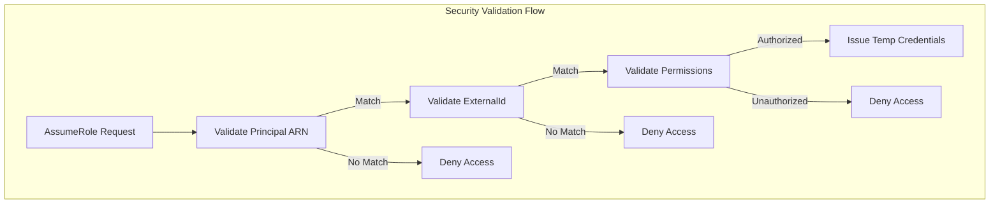

## Minimal Terraform (obfuscated)

This [Terraform](#glossary) configuration creates the [AWS IAM role](#glossary), [trust policy](#glossary), and [permissions policy](#glossary) needed for [Snowflake](#glossary) to securely access [S3](#glossary).

```terraform
# Role (WHO can assume) + Permissions (WHAT it can do)
resource "aws_iam_role" "snowflake_s3_access" {
  name               = "<ROLE_NAME>"
  assume_role_policy = <<POLICY
{
  "Version": "2012-10-17",
  "Statement": [{
    "Effect": "Allow",
    "Principal": { "AWS": "arn:aws:iam::<SNOWFLAKE_ACCOUNT_ID>:user/<SNOWFLAKE_USER_NAME>" },
    "Action": "sts:AssumeRole",
    "Condition": { "StringEquals": { "sts:ExternalId": "<EXTERNAL_ID_REDACTED>" } }
  }]
}
POLICY
}

resource "aws_iam_policy" "snowflake_s3_permissions" {
  name   = "<ROLE_POLICY_NAME>"
  policy = <<POLICY
{
  "Version": "2012-10-17",
  "Statement": [{
    "Sid": "S3Access",
    "Effect": "Allow",
    "Action": [ "s3:GetObject", "s3:PutObject", "s3:DeleteObject", "s3:ListBucket", "s3:GetBucketLocation" ],
    "Resource": [
      "arn:aws:s3:::<BUCKET_NAME_REDACTED>",
      "arn:aws:s3:::<BUCKET_NAME_REDACTED>/*"
    ]
  }]
}
POLICY
}

resource "aws_iam_policy_attachment" "attach" {
  name       = "<ATTACH_NAME>"
  roles      = [aws_iam_role.snowflake_s3_access.name]
  policy_arn = aws_iam_policy.snowflake_s3_permissions.arn
}
```

[Snowflake](#glossary) SQL (obfuscated):
```sql
-- Storage Integration (references AWS Role ARN; restricts S3 URL scope)
CREATE OR REPLACE STORAGE INTEGRATION <INTEGRATION_NAME>
  TYPE = EXTERNAL_STAGE
  STORAGE_PROVIDER = 'S3'
  STORAGE_AWS_ROLE_ARN = 'arn:aws:iam::<AWS_ACCOUNT_ID>:role/<ROLE_NAME>'
  ENABLED = TRUE
  STORAGE_ALLOWED_LOCATIONS = ('s3://<BUCKET_NAME_REDACTED>/<PREFIX_OPTIONAL>/');

-- Stage (binds to integration + bucket URL)
CREATE OR REPLACE STAGE <STAGE_NAME>
  STORAGE_INTEGRATION = <INTEGRATION_NAME>
  URL = 's3://<BUCKET_NAME_REDACTED>/<PREFIX_OPTIONAL>/'
  FILE_FORMAT = (TYPE = CSV);
```

## End‑to‑end flow (high level)

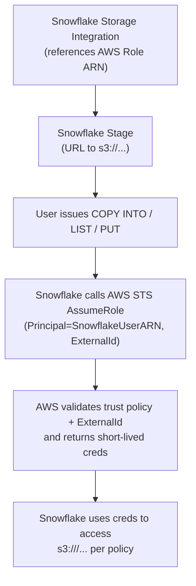

## Security handshake (detail)

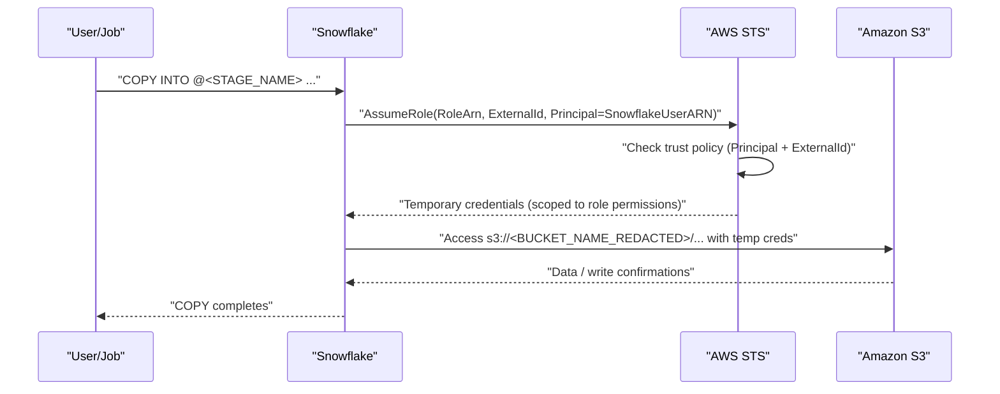

## Complete Integration Workflow

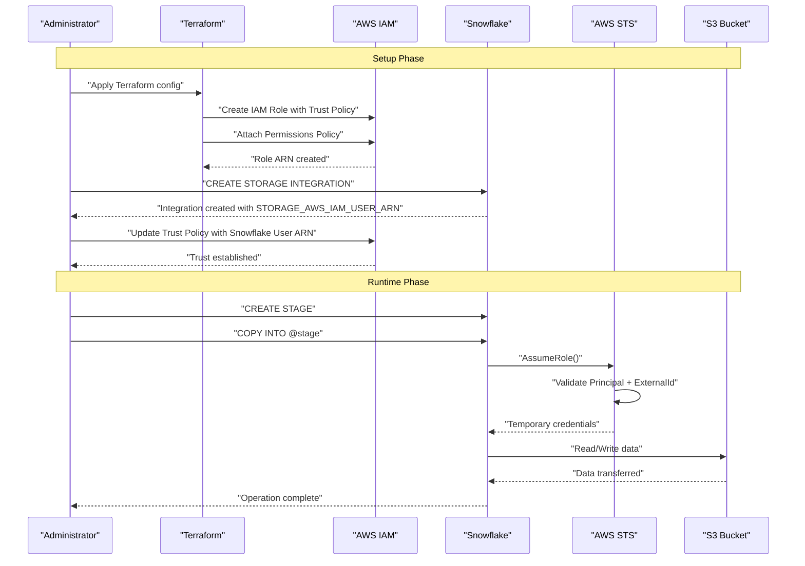

## Role vs Policy (in this setup)

- **[Role](#glossary)**: The identity [Snowflake](#glossary) temporarily becomes inside AWS (defined once, reusable).
- **[Trust Policy](#glossary)** (on the [role](#glossary)): WHO may assume the [role](#glossary) ([Snowflake](#glossary) IAM user) + under WHAT condition (correct [ExternalId](#glossary)).
- **[Permissions Policy](#glossary)** (attached to the [role](#glossary)): WHAT actions the [role](#glossary) can perform (which [S3 buckets](#glossary)/paths, which verbs).

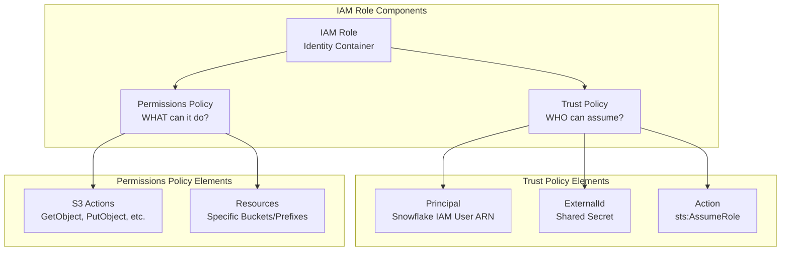

## Why this is secure

- No static AWS keys in [Snowflake](#glossary) or code.
- [Short-lived credentials](#glossary) via [STS](#glossary).
- Least privilege via [S3](#glossary)-scoped permissions.
- Dual binding ([Principal](#glossary) [ARN](#glossary) + [ExternalId](#glossary)) prevents [confused deputy attacks](#glossary).
- [Snowflake stage](#glossary) restricts allowed [S3](#glossary) paths; integration restricts [allowed locations](#glossary).

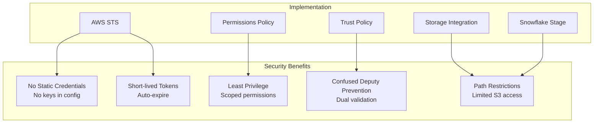

## Using the stage (example)

Once your [stage](#glossary) is configured, you can use [COPY INTO](#glossary) to load or unload data:

```sql
COPY INTO @<STAGE_NAME>/exports/dt=2025-09-24/
FROM (SELECT * FROM <DB>.<SCHEMA>.<TABLE>)
FILE_FORMAT = (TYPE = PARQUET);
```

## Snowflake Virtual Warehouse Architecture

This diagram shows how [Snowflake](#glossary)'s compute layer (virtual warehouses) interacts with storage and external [S3](#glossary) through [storage integrations](#glossary).

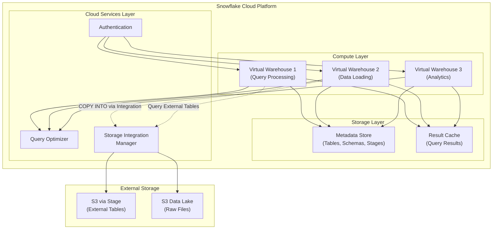

## Data Loading Patterns

Common patterns for loading data into [Snowflake](#glossary) from [S3](#glossary) using [stages](#glossary).

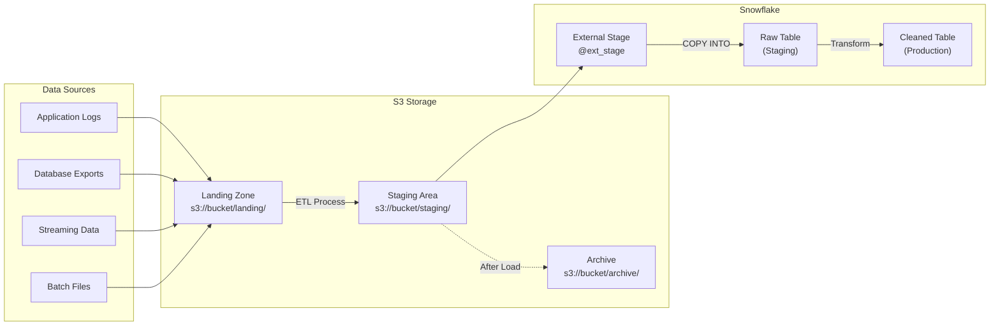

## Multi-Region Deployment Architecture

Enterprise deployment pattern with multiple AWS regions and [Snowflake](#glossary) accounts.

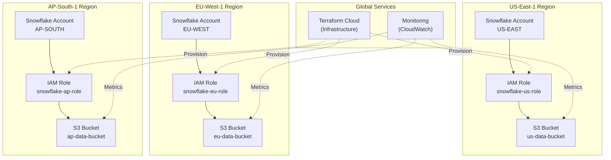

## Credential Lifecycle and Rotation

How [AWS STS](#glossary) credentials are issued, used, and automatically expire.

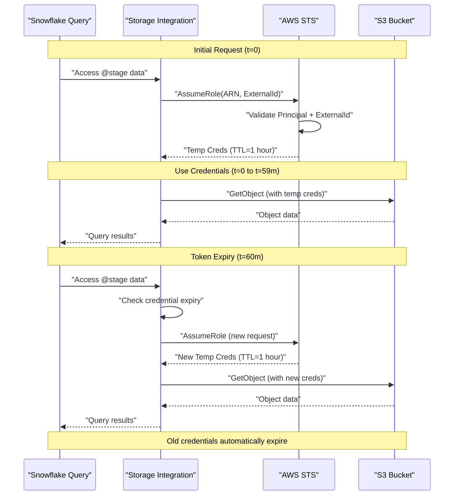

## File Format Processing Flow

How [Snowflake](#glossary) processes different [file formats](#glossary) when loading from [S3](#glossary).

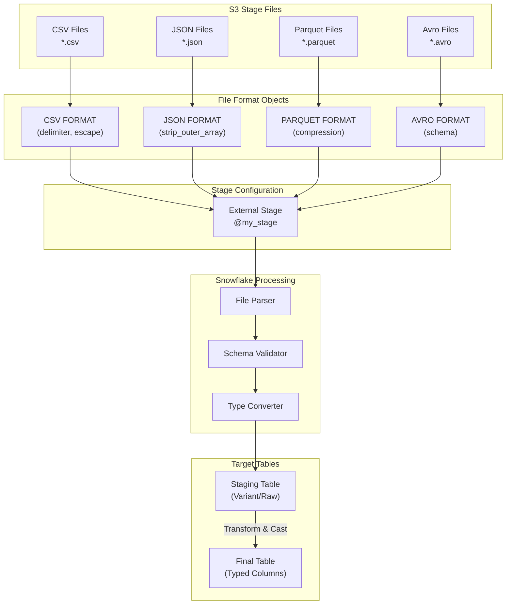

## Error Handling and Monitoring Flow

Monitoring and error handling for [Snowflake](#glossary) [S3](#glossary) integration operations.

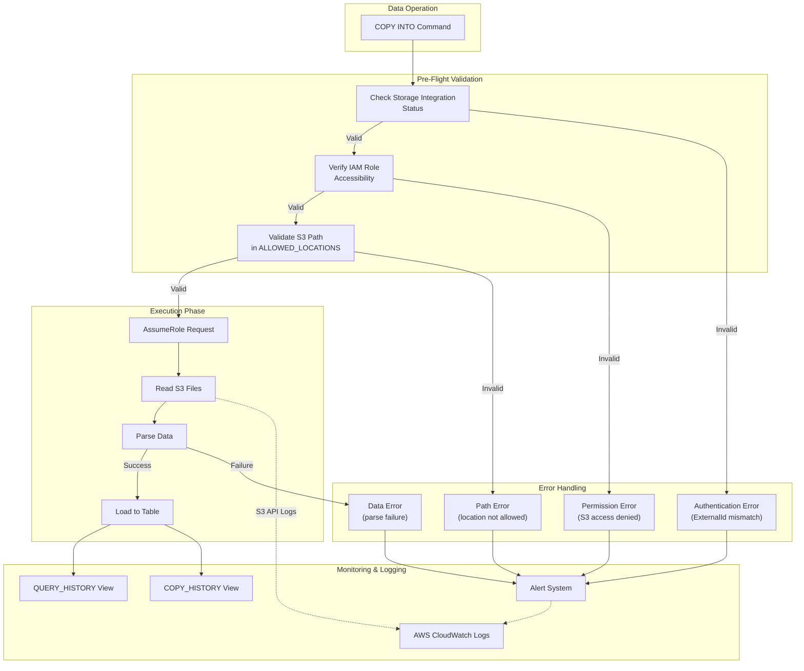

## Snowflake Stage Types Comparison

Comparison of internal vs external [stages](#glossary) and when to use each.

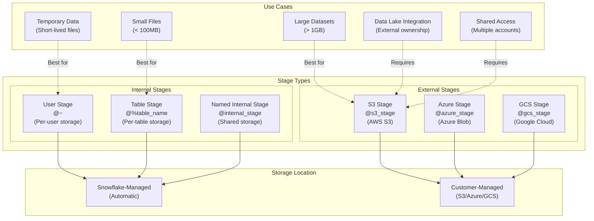

## Permission Boundary Architecture

How [IAM policies](#glossary) create permission boundaries for [Snowflake](#glossary) access.

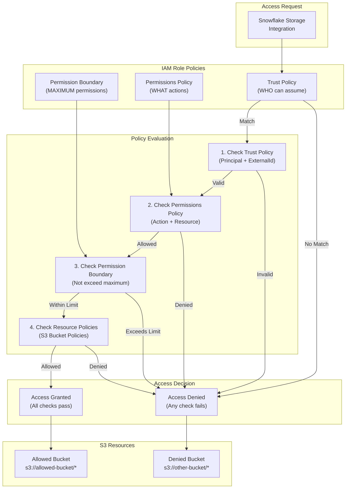

## Comprehensive Glossary {#glossary}

| Term | Description | Use this when | Like |
|------|-------------|---------------|------|
| ARN | Amazon Resource Name - unique identifier for AWS entities following the format `arn:aws:service:region:account-id:resource` | You need to reference any AWS resource like IAM roles, S3 buckets, or users | A global ID card for AWS resources |
| Allowed Locations | Parameter in storage integration restricting which S3 paths Snowflake can access; acts as a whitelist | You want to limit Snowflake access to specific prefixes within buckets | Approved access zones list |
| AssumeRole | AWS STS API call that allows an entity to temporarily take on the permissions of an IAM role | Snowflake needs to access S3 without permanent credentials | Borrowing someone's access badge temporarily |
| AWS IAM Role | An AWS identity with specific permissions that can be assumed by trusted entities (not tied to a specific user or service permanently) | You want to grant temporary access to external services like Snowflake | A temporary identity that can be borrowed |
| AWS STS | AWS Security Token Service - issues temporary, limited-privilege credentials for accessing AWS resources | You need short-lived credentials instead of permanent access keys | A token vending machine for temporary access |
| Confused Deputy Attack | A security vulnerability where an attacker tricks a more privileged service into performing actions on their behalf | Explaining why ExternalId is required in trust policies | Someone tricking a security guard into opening a door for them |
| COPY INTO | Snowflake SQL command to load data from external storage (like S3) into Snowflake tables or vice versa | You need to import/export data between Snowflake and S3 | Data transfer command |
| ExternalId | A shared secret string used in IAM trust policies to prevent confused deputy attacks; must be provided when assuming a role | You're setting up cross-account access or third-party service integration | A password that proves you're the intended service |
| FILE_FORMAT | Snowflake configuration specifying how data files are structured (CSV, JSON, PARQUET, etc.) | You're creating a stage or running COPY commands | Instructions for reading/writing file structure |
| IAM Policy | JSON document defining permissions (what actions are allowed or denied on which resources) | You need to grant or restrict access to AWS resources | A permission rulebook |
| LIST | Snowflake command to view files in an external stage | You need to see what files exist in your S3-backed stage | Directory listing for external storage |
| Permissions Policy | IAM policy attached to a role defining WHAT actions the role can perform on which resources | You need to specify what S3 operations are allowed | Job description of what you can do |
| Principal | The entity (user, role, or service) that can perform actions in AWS; specified in trust policies | You're defining WHO can assume a role | The actor/person attempting to take action |
| PUT | Snowflake command to upload local files to an external stage | You need to upload files from Snowflake to S3 | File upload command |
| S3 Bucket | Amazon Simple Storage Service container for storing objects/files | You need to store data files for Snowflake access | Cloud folder for file storage |
| Short-lived Credentials | Temporary AWS access keys with an expiration time (typically minutes to hours) | You want secure access without permanent keys | Temporary visitor pass vs. permanent badge |
| Snowflake Stage | A Snowflake object representing a location (internal or external like S3) where data files are stored for loading/unloading | You need to reference external storage in Snowflake commands | Named pointer to storage location |
| Snowflake Storage Integration | A Snowflake object that stores configuration for securely accessing external cloud storage (S3, Azure, GCS) | You want to connect Snowflake to external cloud storage securely | Bridge configuration between Snowflake and cloud storage |
| STORAGE_ALLOWED_LOCATIONS | Parameter in storage integration defining which S3 paths Snowflake is permitted to access | You want to restrict Snowflake access to specific S3 buckets/prefixes | Allowed areas list for access |
| STORAGE_AWS_ROLE_ARN | Parameter in storage integration specifying which AWS IAM role Snowflake should assume | You're linking Snowflake to an AWS role | The role identity Snowflake will borrow |
| Role | An AWS IAM identity with attached policies that can be temporarily assumed by trusted entities | You need to grant temporary cross-service access | A uniform that grants specific permissions when worn |
| S3 | Amazon Simple Storage Service - object storage service for storing and retrieving any amount of data | You need scalable, durable cloud storage for data files | Cloud-based file storage system |
| Snowflake | Cloud-based data warehouse platform that separates compute and storage for scalable analytics | You need a data warehouse that scales independently for storage and compute | Elastic cloud data warehouse |
| Stage | A Snowflake object (internal or external) that represents a location where data files are stored | You need to load/unload data between Snowflake and storage | Named reference to a storage location |
| Storage Integration | A Snowflake first-class object that securely connects to external cloud storage without storing credentials | You want secure, credential-free access to S3/Azure/GCS | Secure connector configuration for cloud storage |
| STS | AWS Security Token Service - web service that grants temporary access credentials | You need temporary security credentials for AWS resources | Temporary credential issuer |
| Terraform | Infrastructure as Code (IaC) tool for defining and provisioning cloud resources using declarative configuration | You want to automate and version-control AWS infrastructure setup | Code that builds cloud infrastructure |
| Trust Policy | IAM policy attached to a role defining WHO can assume the role and UNDER WHAT CONDITIONS | You're setting up which external services can assume your role | Guestlist for who can borrow the identity |
| URL (in Stage context) | The S3 path (s3://bucket/prefix/) that the Snowflake stage points to | You're defining where stage files are located | Address of storage location |
| Virtual Warehouse | Snowflake's compute cluster for executing queries and DML operations; can be scaled independently | You need compute resources for query processing or data loading | Scalable compute engine |

## Environment Deployment Pattern

```mermaid
flowchart TB
    subgraph Dev["Development Environment"]
        DevInt["Storage Integration<br/>dev_integration"]
        DevStage["Stage<br/>@dev_stage"]
        DevRole["IAM Role<br/>snowflake-dev-role"]
        DevS3["S3<br/>s3://dev-bucket/"]
    end

    subgraph Stage["Staging Environment"]
        StgInt["Storage Integration<br/>stage_integration"]
        StgStage["Stage<br/>@stage_stage"]
        StgRole["IAM Role<br/>snowflake-stage-role"]
        StgS3["S3<br/>s3://stage-bucket/"]
    end

    subgraph Prod["Production Environment"]
        ProdInt["Storage Integration<br/>prod_integration"]
        ProdStage["Stage<br/>@prod_stage"]
        ProdRole["IAM Role<br/>snowflake-prod-role"]
        ProdS3["S3<br/>s3://prod-bucket/"]
    end

    DevInt --> DevStage
    DevStage --> DevRole
    DevRole --> DevS3

    StgInt --> StgStage
    StgStage --> StgRole
    StgRole --> StgS3

    ProdInt --> ProdStage
    ProdStage --> ProdRole
    ProdRole --> ProdS3
```
