# Multi-Application B2C Ecosystem with Supabase: A Complete System Design Document

**Version:** 1.0  
**Date:** December 31, 2025  
**Audience:** Platform architects, backend engineers, and security teams implementing identity and authorization systems with Supabase

---

## Table of Contents

1. [Glossary](#1-glossary)
2. [Supabase Component Model](#2-supabase-component-model)
3. [Platform Bootstrap Guide](#3-platform-bootstrap-guide)
4. [User Journeys](#4-user-journeys)
5. [API Access Patterns](#5-api-access-patterns)
6. [Credentials System Design](#6-credentials-system-design)
7. [Authorization Design](#7-authorization-design)
8. [Data-Plane / Warehouse Bridging](#8-data-plane--warehouse-bridging)
9. [Best Practices & Anti-Patterns](#9-best-practices--anti-patterns)

---

## 1. Glossary

Understanding identity and authorization terminology is foundational. Each term below includes a definition, analogy, and real-world user experience scenario.

### 1.1 Authentication Protocols

| Term | Definition | Analogy | User Experience |
|------|------------|---------|-----------------|
| **OAuth2** | Authorization framework enabling third-party apps to obtain limited access to user accounts without exposing credentials. Defines grant types (authorization code, client credentials, etc.) | A valet key for your car—gives limited access without the master key | "Sign in with Google" button that asks "Allow Acme App to access your profile?" |
| **OIDC (OpenID Connect)** | Identity layer on top of OAuth2 that adds standardized user identity claims via ID tokens | OAuth2 is the delivery truck; OIDC adds the shipping manifest describing what's inside | After clicking "Sign in with Google," the app knows your name and email without additional API calls |
| **SAML (Security Assertion Markup Language)** | XML-based enterprise SSO protocol, older than OIDC, common in B2B/enterprise contexts | A notarized letter of introduction between organizations | Enterprise user clicks SSO, redirects to company Okta, returns authenticated to SaaS app |

**Key Contrast:** OIDC is modern, JSON/JWT-based, mobile-friendly. SAML is XML-based, browser-centric, enterprise-legacy. Supabase Auth uses OIDC patterns.

### 1.2 Identity Architecture Roles

| Term | Definition | Analogy | User Experience |
|------|------------|---------|-----------------|
| **Authorization Server** | Service that issues tokens after verifying credentials and consent | The bouncer who checks ID and stamps your hand for club entry | The Google consent screen that appears during OAuth login |
| **Identity Provider (IdP)** | System that stores and authenticates user identities (Google, Okta, Supabase Auth) | The DMV that issues and verifies driver's licenses | "Choose how to sign in: Google, GitHub, Email" |
| **Relying Party (RP) / Service Provider (SP)** | Application that trusts an IdP for authentication | A bar that accepts government-issued IDs as proof of age | Your SaaS app that shows "Sign in with Google" |

### 1.3 Tokens and Sessions

| Term | Definition | Analogy | User Experience |
|------|------------|---------|-----------------|
| **Session Cookie** | Server-side session identifier stored in browser cookie | A coat check ticket—you get a number, they keep your coat | Staying logged in after closing and reopening a tab |
| **Access Token** | Short-lived credential authorizing API access | A day pass at a theme park—works today, expires tonight | Token sent with every API request; user doesn't see it |
| **Refresh Token** | Long-lived credential used to obtain new access tokens | A membership card that lets you get new day passes | Seamless session extension without re-login |
| **ID Token** | JWT containing user identity claims, for client consumption only | A business card with your name, email, and photo | App displaying "Welcome, Jane!" after login |
| **JWT (JSON Web Token)** | Compact, URL-safe token format with header.payload.signature structure | A sealed, tamper-evident envelope with contents visible but unmodifiable | The actual format of tokens your app receives |

### 1.4 JWT Anatomy

| Term | Definition | Analogy | User Experience |
|------|------------|---------|-----------------|
| **Claims** | Key-value assertions within a JWT (standard: iss, sub, aud, exp; custom: roles, tenant_id) | Fields on your passport (name, nationality, expiry) | Backend reads `tenant_id` claim to filter data |
| **Issuer (iss)** | Claim identifying who created/signed the token | The government seal on a passport | Services verify token came from trusted Supabase project |
| **Audience (aud)** | Claim specifying intended token recipient(s) | "This letter is addressed to Acme Corp" | Token meant for `api.myapp.com` rejected by `other-api.com` |
| **JWKS (JSON Web Key Set)** | Published set of public keys for verifying JWT signatures | A public registry of official signature samples | Services fetch keys from `/.well-known/jwks.json` to validate tokens |
| **JTI (JWT ID)** | Unique token identifier for revocation/replay tracking | A serial number on a banknote | Detecting if same token is used twice (replay attack) |

### 1.5 Security Mechanisms

| Term | Definition | Analogy | User Experience |
|------|------------|---------|-----------------|
| **PKCE (Proof Key for Code Exchange)** | OAuth2 extension preventing authorization code interception using code_verifier/code_challenge | A two-part claim ticket—need both halves to collect prize | Invisible to users; protects mobile/SPA logins |
| **CSRF (Cross-Site Request Forgery)** | Attack where malicious site triggers authenticated requests; prevented with state/nonce tokens | Someone forging your signature on a check | Users protected by `state` parameter in OAuth flows |
| **Token Rotation** | Issuing new refresh token with each use, invalidating the old one | Musical chairs with refresh tokens—use it or lose it | Stolen token becomes invalid after legitimate user refreshes |
| **Token Revocation** | Explicitly invalidating tokens before expiry | Reporting a credit card stolen | "Sign out all devices" button in settings |

### 1.6 Advanced Token Patterns

| Term | Definition | Analogy | User Experience |
|------|------------|---------|-----------------|
| **STS (Security Token Service)** | Service that exchanges/transforms tokens (e.g., RFC 8693 Token Exchange) | A currency exchange booth at the airport | Backend exchanges user JWT for short-lived S3 credentials |
| **Impersonation** | Acting as another user (admin debugging) with full audit trail | A store manager using master key but logging their own ID | Support agent sees exactly what user sees for debugging |
| **Delegation** | Acting on behalf of a user with constrained permissions | Power of attorney—limited actions on someone's behalf | Calendar app scheduling meetings on your behalf |
| **Token Exchange** | Protocol for swapping one token type for another (RFC 8693) | Trading frequent flyer miles for hotel points | Service exchanges user token for scoped downstream token |

### 1.7 Authorization Models

| Term | Definition | Analogy | User Experience |
|------|------------|---------|-----------------|
| **RBAC (Role-Based Access Control)** | Permissions assigned to roles, roles assigned to users | Job titles determine building access (Engineer → Labs, Manager → Labs + Exec Floor) | "You have the Editor role in this project" |
| **ABAC (Attribute-Based Access Control)** | Permissions based on attributes of user, resource, and environment | TSA screening based on ticket class, destination, time of day | "Premium users can export reports during business hours" |
| **ReBAC (Relationship-Based Access Control)** | Permissions derived from relationships between entities (Google Zanzibar model) | Family tree determines inheritance—relationship defines rights | "You can view this doc because you're in the shared folder" |
| **PEP (Policy Enforcement Point)** | Component that intercepts requests and enforces authorization decisions | The turnstile that blocks or allows entry | RLS policy blocking unauthorized row access |
| **PDP (Policy Decision Point)** | Component that evaluates policies and returns allow/deny decisions | The security guard who decides if ID is valid | Microservice that checks complex permission rules |

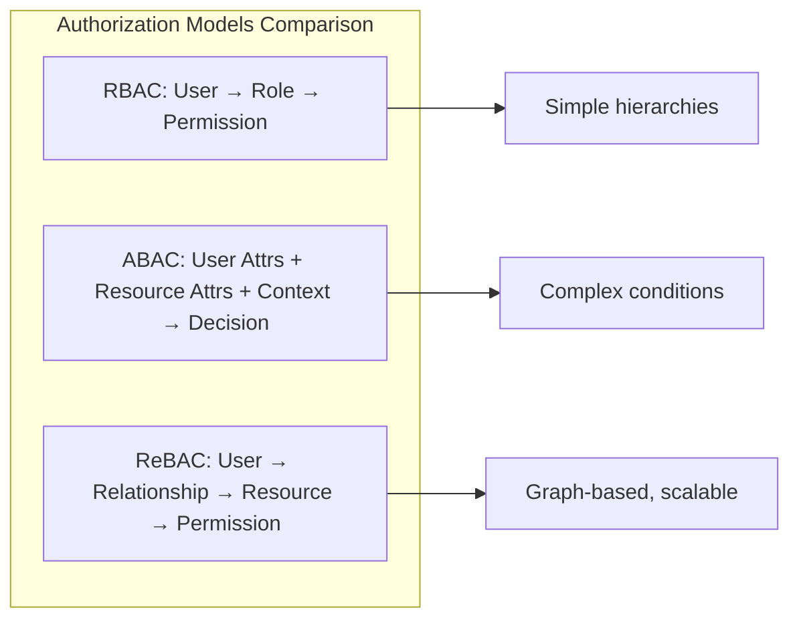
```mermaid
flowchart LR
    subgraph "Authorization Models Comparison"
        RBAC["RBAC: User → Role → Permission"]
        ABAC["ABAC: User Attrs + Resource Attrs + Context → Decision"]
        ReBAC["ReBAC: User → Relationship → Resource → Permission"]
    end
    
    RBAC --> Simple["Simple hierarchies"]
    ABAC --> Complex["Complex conditions"]
    ReBAC --> Graph["Graph-based, scalable"]
```

---

## 2. Supabase Component Model

### 2.1 What Supabase Auth Is (and Isn't)


```mermaid
flowchart TB
    subgraph "Supabase Auth Responsibilities"
        direction TB
        A1["✓ User authentication"]
        A2["✓ Session management"]
        A3["✓ JWT issuance"]
        A4["✓ Social provider integration"]
        A5["✓ MFA orchestration"]
        A6["✓ Password reset flows"]
    end
    
    subgraph "NOT Supabase Auth Responsibilities"
        direction TB
        B1["✗ Fine-grained authorization"]
        B2["✗ Resource-based permissions"]
        B3["✗ Role hierarchy management"]
        B4["✗ External API authorization"]
        B5["✗ Service-to-service auth"]
        B6["✗ PAT/API key management"]
    end
```

**Supabase Auth is conceptually:**
- An **Authorization Server** (OAuth2 terminology) that authenticates users and issues JWTs
- An **OIDC-like session issuer** (though not fully OIDC-compliant for external RPs)
- A **session manager** with built-in refresh token rotation

**Supabase Auth is NOT:**
- A full **Identity Provider** for federating to external applications (no standard OIDC discovery for external RPs)
- An **authorization engine** for complex permission decisions
- A **policy decision point** for resource-based access control

### 2.2 High-Level Architecture

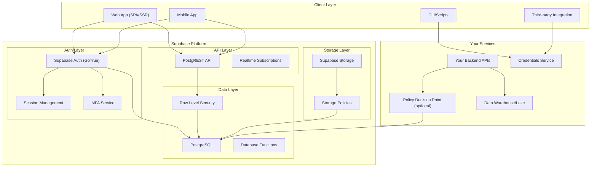
```mermaid
flowchart TB
    subgraph "Client Layer"
        Web["Web App (SPA/SSR)"]
        Mobile["Mobile App"]
        CLI["CLI/Scripts"]
        Integration["Third-party Integration"]
    end
    
    subgraph "Supabase Platform"
        subgraph "Auth Layer"
            GoTrue["Supabase Auth (GoTrue)"]
            Sessions["Session Management"]
            MFA["MFA Service"]
        end
        
        subgraph "Data Layer"
            PG["PostgreSQL"]
            RLS["Row Level Security"]
            Functions["Database Functions"]
        end
        
        subgraph "Storage Layer"
            Storage["Supabase Storage"]
            StoragePolicies["Storage Policies"]
        end
        
        subgraph "API Layer"
            PostgREST["PostgREST API"]
            Realtime["Realtime Subscriptions"]
        end
    end
    
    subgraph "Your Services"
        API["Your Backend APIs"]
        PDP["Policy Decision Point (optional)"]
        CredService["Credentials Service"]
        Warehouse["Data Warehouse/Lake"]
    end
    
    Web --> GoTrue
    Mobile --> GoTrue
    CLI --> CredService
    Integration --> CredService
    
    GoTrue --> Sessions
    GoTrue --> MFA
    GoTrue --> PG
    
    Web --> PostgREST
    Mobile --> PostgREST
    
    PostgREST --> RLS
    RLS --> PG
    
    Storage --> StoragePolicies
    StoragePolicies --> PG
    
    API --> PDP
    PDP --> PG
    API --> Warehouse
```

### 2.3 PostgreSQL + RLS as Authorization Enforcement

Row Level Security (RLS) is Supabase's primary **Policy Enforcement Point (PEP)** for data access.

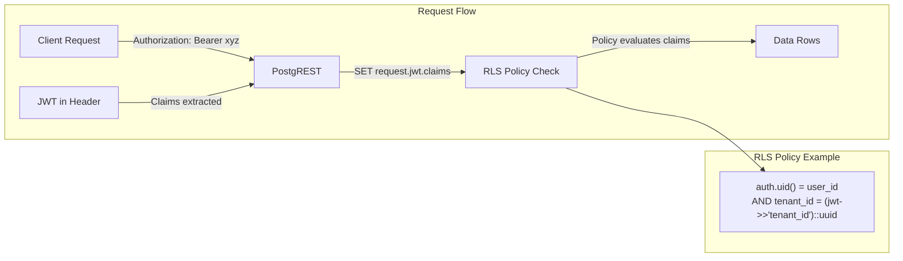
```mermaid
flowchart LR
    subgraph "Request Flow"
        Client["Client Request"]
        JWT["JWT in Header"]
        PostgREST["PostgREST"]
        RLS["RLS Policy Check"]
        Data["Data Rows"]
    end
    
    Client -->|"Authorization: Bearer xyz"| PostgREST
    JWT -->|"Claims extracted"| PostgREST
    PostgREST -->|"SET request.jwt.claims"| RLS
    RLS -->|"Policy evaluates claims"| Data
    
    subgraph "RLS Policy Example"
        Policy["auth.uid() = user_id<br/>AND tenant_id = (jwt->>'tenant_id')::uuid"]
    end
    
    RLS --> Policy
```

**Key RLS Concepts:**
- `auth.uid()`: Returns the authenticated user's ID from the JWT
- `auth.jwt()`: Returns the full JWT payload for custom claims access
- Policies execute **per-row** and are AND-ed with queries
- Policies are defined per **table** and per **operation** (SELECT, INSERT, UPDATE, DELETE)

### 2.4 Storage Policies for Object Access

Supabase Storage policies mirror RLS patterns but for files/objects.

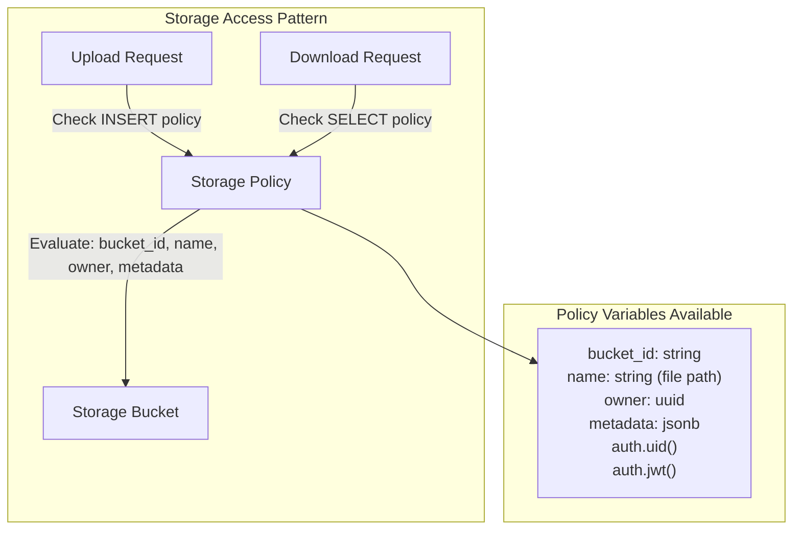
```mermaid
flowchart TB
    subgraph "Storage Access Pattern"
        Upload["Upload Request"]
        Download["Download Request"]
        Policy["Storage Policy"]
        Bucket["Storage Bucket"]
    end
    
    Upload -->|"Check INSERT policy"| Policy
    Download -->|"Check SELECT policy"| Policy
    Policy -->|"Evaluate: bucket_id, name, owner, metadata"| Bucket
    
    subgraph "Policy Variables Available"
        Vars["bucket_id: string<br/>name: string (file path)<br/>owner: uuid<br/>metadata: jsonb<br/>auth.uid()<br/>auth.jwt()"]
    end
    
    Policy --> Vars
```

### 2.5 When to Use a Separate PDP

**Direct RLS is sufficient when:**
- Authorization logic maps cleanly to table/row ownership
- All protected resources are in Supabase Postgres
- Permission model is relatively simple (user owns resource, org membership)

**A separate PDP microservice is valuable when:**
- Complex ReBAC relationships (folder hierarchies, shared resources with inheritance)
- Cross-system authorization (warehouse, external APIs)
- Performance-critical permission checks needing caching
- Audit requirements beyond database logs
- Multi-database or multi-cloud architectures

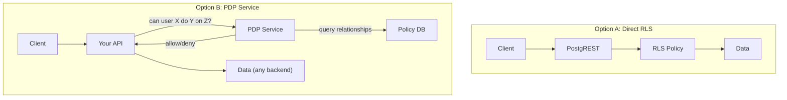
```mermaid
flowchart TB
    subgraph "Option A: Direct RLS"
        A1["Client"] --> A2["PostgREST"]
        A2 --> A3["RLS Policy"]
        A3 --> A4["Data"]
    end
    
    subgraph "Option B: PDP Service"
        B1["Client"] --> B2["Your API"]
        B2 -->|"can user X do Y on Z?"| B3["PDP Service"]
        B3 -->|"query relationships"| B4["Policy DB"]
        B3 -->|"allow/deny"| B2
        B2 --> B5["Data (any backend)"]
    end
```

### 2.6 JWT Validation in Backend Services

All services consuming Supabase JWTs must validate consistently:

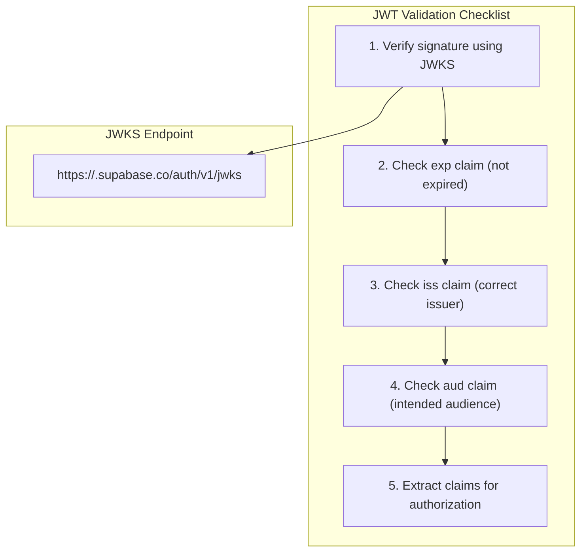
```mermaid
flowchart TB
    subgraph "JWT Validation Checklist"
        V1["1. Verify signature using JWKS"]
        V2["2. Check exp claim (not expired)"]
        V3["3. Check iss claim (correct issuer)"]
        V4["4. Check aud claim (intended audience)"]
        V5["5. Extract claims for authorization"]
    end
    
    V1 --> V2 --> V3 --> V4 --> V5
    
    subgraph "JWKS Endpoint"
        JWKS["https://<project>.supabase.co/auth/v1/jwks"]
    end
    
    V1 --> JWKS
```

**Avoid duplicating auth logic by:**
1. Using a shared library/middleware for JWT validation
2. Centralizing JWKS fetching with caching (refresh every 24h or on signature failure)
3. Defining claim extraction in one place
4. Using the PDP pattern for complex authorization

---

## 3. Platform Bootstrap Guide

### 3.1 Initial Setup Checklist

```markdown
## Platform Bootstrap Checklist

### Phase 1: Project Foundation
- [ ] Create Supabase projects for each environment (dev, staging, prod)
- [ ] Document project URLs and anon/service keys securely
- [ ] Configure environment-specific variables in deployment system
- [ ] Set up secrets management (Vault, AWS Secrets Manager, etc.)

### Phase 2: Auth Configuration
- [ ] Configure Site URL (primary app URL)
- [ ] Add all redirect URIs (each app, each environment)
- [ ] Configure custom SMTP for transactional emails
- [ ] Customize email templates (confirm, reset, magic link)

### Phase 3: Social Providers
- [ ] Register OAuth apps with each provider (Google, GitHub, etc.)
- [ ] Store client IDs in Supabase dashboard
- [ ] Store client secrets in Supabase dashboard (encrypted at rest)
- [ ] Configure scopes (minimal: email, profile)
- [ ] Test each provider in dev environment

### Phase 4: Security Settings
- [ ] Enable MFA (TOTP recommended as baseline)
- [ ] Configure password requirements (min length, complexity)
- [ ] Set session timeouts (access: 1h, refresh: 7-30 days)
- [ ] Enable refresh token rotation
- [ ] Configure rate limiting for auth endpoints

### Phase 5: JWT Configuration
- [ ] Review default JWT expiry (3600s default, adjust if needed)
- [ ] Plan custom claims strategy (tenant_id, roles)
- [ ] Document JWKS endpoint for all consuming services
- [ ] Test JWT validation in each service

### Phase 6: Database Setup
- [ ] Enable RLS on ALL tables (default deny)
- [ ] Create base policies for user data access
- [ ] Set up tenant/org isolation policies
- [ ] Create audit log tables
- [ ] Configure storage buckets and policies

### Phase 7: Observability
- [ ] Enable Supabase logging (Auth, PostgREST, Storage)
- [ ] Set up log forwarding to centralized system
- [ ] Create alerts for auth failures, rate limits
- [ ] Document incident response for auth issues
```

### 3.2 Environment Architecture


```mermaid
flowchart TB
    subgraph "Development"
        DevSupabase["Supabase Project (Dev)"]
        DevApps["Dev Apps (localhost)"]
        DevSecrets["Dev Secrets (local .env)"]
    end
    
    subgraph "Staging"
        StageSupabase["Supabase Project (Staging)"]
        StageApps["Staging Apps (*.staging.myapp.com)"]
        StageSecrets["Staging Secrets (Vault)"]
    end
    
    subgraph "Production"
        ProdSupabase["Supabase Project (Prod)"]
        ProdApps["Production Apps (*.myapp.com)"]
        ProdSecrets["Production Secrets (Vault + HSM)"]
    end
    
    DevApps --> DevSupabase
    StageApps --> StageSupabase
    ProdApps --> ProdSupabase
    
    DevSecrets --> DevApps
    StageSecrets --> StageApps
    ProdSecrets --> ProdApps
```

### 3.3 Redirect URI Configuration

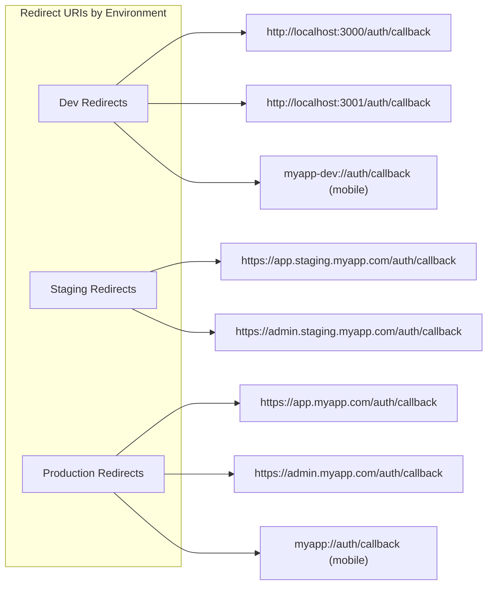
```mermaid
flowchart LR
    subgraph "Redirect URIs by Environment"
        Dev["Dev Redirects"]
        Stage["Staging Redirects"]
        Prod["Production Redirects"]
    end
    
    Dev --> D1["http://localhost:3000/auth/callback"]
    Dev --> D2["http://localhost:3001/auth/callback"]
    Dev --> D3["myapp-dev://auth/callback (mobile)"]
    
    Stage --> S1["https://app.staging.myapp.com/auth/callback"]
    Stage --> S2["https://admin.staging.myapp.com/auth/callback"]
    
    Prod --> P1["https://app.myapp.com/auth/callback"]
    Prod --> P2["https://admin.myapp.com/auth/callback"]
    Prod --> P3["myapp://auth/callback (mobile)"]
```

### 3.4 Bootstrap Sequence Diagram

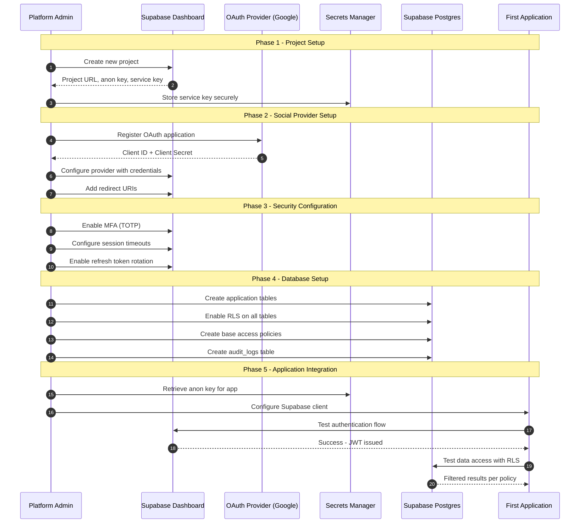
```mermaid
sequenceDiagram
    autonumber
    participant Admin as Platform Admin
    participant Supa as Supabase Dashboard
    participant Provider as OAuth Provider (Google)
    participant Vault as Secrets Manager
    participant DB as Supabase Postgres
    participant App as First Application
    
    Note over Admin,App: Phase 1 - Project Setup
    Admin->>Supa: Create new project
    Supa-->>Admin: Project URL, anon key, service key
    Admin->>Vault: Store service key securely
    
    Note over Admin,App: Phase 2 - Social Provider Setup
    Admin->>Provider: Register OAuth application
    Provider-->>Admin: Client ID + Client Secret
    Admin->>Supa: Configure provider with credentials
    Admin->>Supa: Add redirect URIs
    
    Note over Admin,App: Phase 3 - Security Configuration
    Admin->>Supa: Enable MFA (TOTP)
    Admin->>Supa: Configure session timeouts
    Admin->>Supa: Enable refresh token rotation
    
    Note over Admin,App: Phase 4 - Database Setup
    Admin->>DB: Create application tables
    Admin->>DB: Enable RLS on all tables
    Admin->>DB: Create base access policies
    Admin->>DB: Create audit_logs table
    
    Note over Admin,App: Phase 5 - Application Integration
    Admin->>Vault: Retrieve anon key for app
    Admin->>App: Configure Supabase client
    App->>Supa: Test authentication flow
    Supa-->>App: Success - JWT issued
    App->>DB: Test data access with RLS
    DB-->>App: Filtered results per policy
```

### 3.5 Social Provider Configuration Map

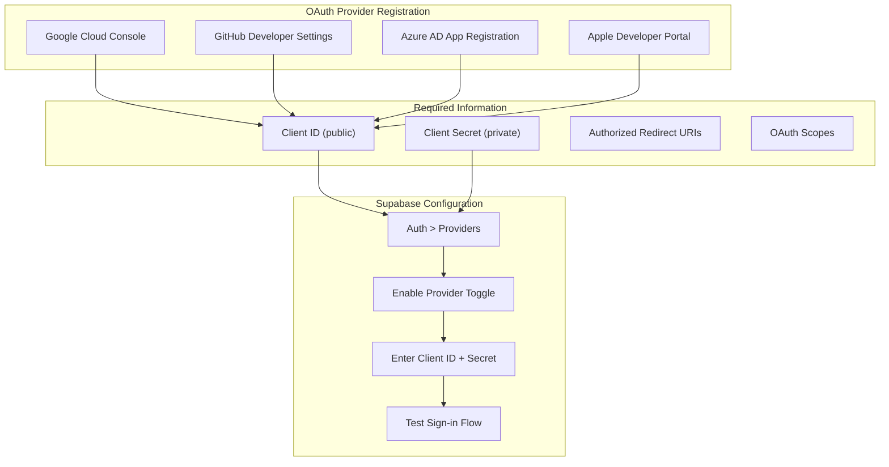
```mermaid
flowchart TB
    subgraph "OAuth Provider Registration"
        Google["Google Cloud Console"]
        GitHub["GitHub Developer Settings"]
        Microsoft["Azure AD App Registration"]
        Apple["Apple Developer Portal"]
    end
    
    subgraph "Required Information"
        ClientID["Client ID (public)"]
        ClientSecret["Client Secret (private)"]
        RedirectURI["Authorized Redirect URIs"]
        Scopes["OAuth Scopes"]
    end
    
    subgraph "Supabase Configuration"
        SupaAuth["Auth > Providers"]
        EnableProvider["Enable Provider Toggle"]
        EnterCreds["Enter Client ID + Secret"]
        TestFlow["Test Sign-in Flow"]
    end
    
    Google --> ClientID
    GitHub --> ClientID
    Microsoft --> ClientID
    Apple --> ClientID
    
    ClientID --> SupaAuth
    ClientSecret --> SupaAuth
    
    SupaAuth --> EnableProvider
    EnableProvider --> EnterCreds
    EnterCreds --> TestFlow
```

### 3.6 Key Management and JWKS

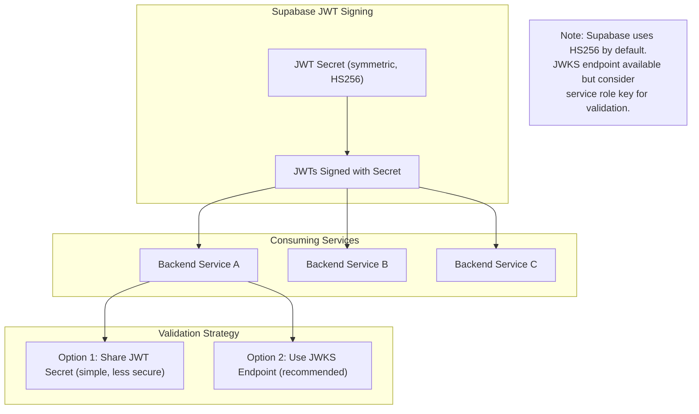
```mermaid
flowchart TB
    subgraph "Supabase JWT Signing"
        JWTSecret["JWT Secret (symmetric, HS256)"]
        JWTIssued["JWTs Signed with Secret"]
    end
    
    subgraph "Consuming Services"
        Service1["Backend Service A"]
        Service2["Backend Service B"]
        Service3["Backend Service C"]
    end
    
    subgraph "Validation Strategy"
        SharedSecret["Option 1: Share JWT Secret (simple, less secure)"]
        JWKS["Option 2: Use JWKS Endpoint (recommended)"]
    end
    
    JWTSecret --> JWTIssued
    JWTIssued --> Service1
    JWTIssued --> Service2
    JWTIssued --> Service3
    
    Service1 --> SharedSecret
    Service1 --> JWKS
    
    Note1["Note: Supabase uses HS256 by default.<br/>JWKS endpoint available but consider<br/>service role key for validation."]
```

**JWKS Considerations:**
- Supabase Auth uses **HS256** (symmetric) by default, not RS256 (asymmetric)
- For service-side validation, you typically use the `JWT_SECRET` from project settings
- Cache the secret; don't fetch on every request
- Consider rotating JWT secret periodically (requires coordinated deployment)

---

## 4. User Journeys

### 4.1 New User Sign-Up with Social Login

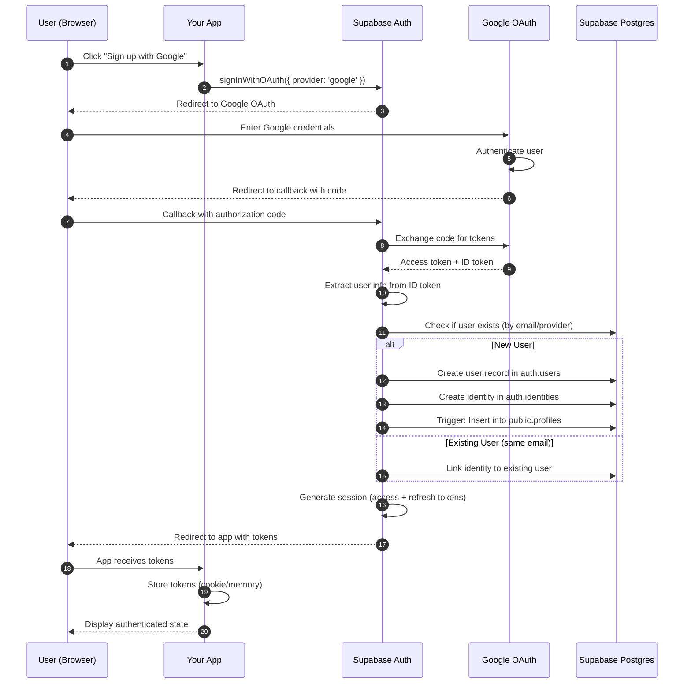
```mermaid
sequenceDiagram
    autonumber
    participant User as User (Browser)
    participant App as Your App
    participant Supa as Supabase Auth
    participant Google as Google OAuth
    participant DB as Supabase Postgres
    
    User->>App: Click "Sign up with Google"
    App->>Supa: signInWithOAuth({ provider: 'google' })
    Supa-->>User: Redirect to Google OAuth
    
    User->>Google: Enter Google credentials
    Google->>Google: Authenticate user
    Google-->>User: Redirect to callback with code
    
    User->>Supa: Callback with authorization code
    Supa->>Google: Exchange code for tokens
    Google-->>Supa: Access token + ID token
    
    Supa->>Supa: Extract user info from ID token
    Supa->>DB: Check if user exists (by email/provider)
    
    alt New User
        Supa->>DB: Create user record in auth.users
        Supa->>DB: Create identity in auth.identities
        Supa->>DB: Trigger: Insert into public.profiles
    else Existing User (same email)
        Supa->>DB: Link identity to existing user
    end
    
    Supa->>Supa: Generate session (access + refresh tokens)
    Supa-->>User: Redirect to app with tokens
    User->>App: App receives tokens
    App->>App: Store tokens (cookie/memory)
    App-->>User: Display authenticated state
```

### 4.2 Existing User Login

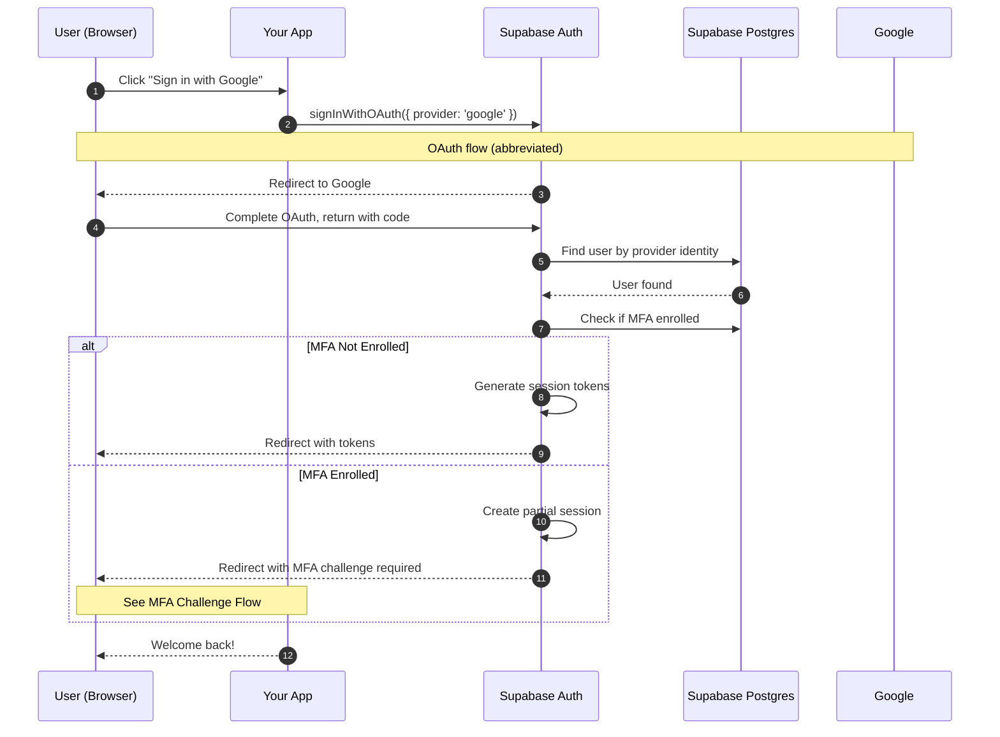
```mermaid
sequenceDiagram
    autonumber
    participant User as User (Browser)
    participant App as Your App
    participant Supa as Supabase Auth
    participant DB as Supabase Postgres
    
    User->>App: Click "Sign in with Google"
    App->>Supa: signInWithOAuth({ provider: 'google' })
    
    Note over User,Google: OAuth flow (abbreviated)
    Supa-->>User: Redirect to Google
    User->>Supa: Complete OAuth, return with code
    
    Supa->>DB: Find user by provider identity
    DB-->>Supa: User found
    
    Supa->>DB: Check if MFA enrolled
    
    alt MFA Not Enrolled
        Supa->>Supa: Generate session tokens
        Supa-->>User: Redirect with tokens
    else MFA Enrolled
        Supa->>Supa: Create partial session
        Supa-->>User: Redirect with MFA challenge required
        Note over User,App: See MFA Challenge Flow
    end
    
    App-->>User: Welcome back!
```

### 4.3 MFA Enrollment Flow

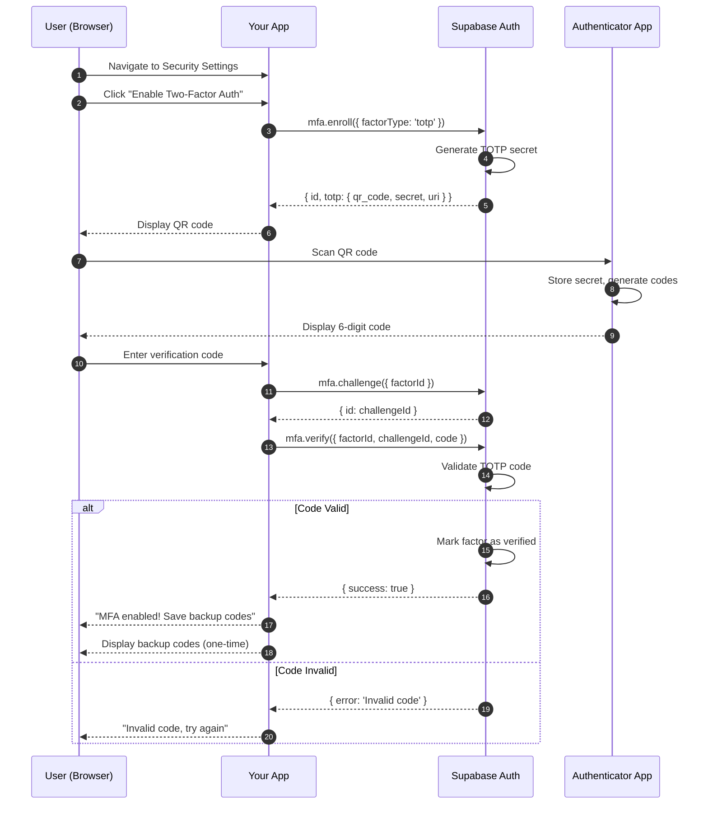
```mermaid
sequenceDiagram
    autonumber
    participant User as User (Browser)
    participant App as Your App
    participant Supa as Supabase Auth
    participant TOTP as Authenticator App
    
    User->>App: Navigate to Security Settings
    User->>App: Click "Enable Two-Factor Auth"
    
    App->>Supa: mfa.enroll({ factorType: 'totp' })
    Supa->>Supa: Generate TOTP secret
    Supa-->>App: { id, totp: { qr_code, secret, uri } }
    
    App-->>User: Display QR code
    User->>TOTP: Scan QR code
    TOTP->>TOTP: Store secret, generate codes
    TOTP-->>User: Display 6-digit code
    
    User->>App: Enter verification code
    App->>Supa: mfa.challenge({ factorId })
    Supa-->>App: { id: challengeId }
    
    App->>Supa: mfa.verify({ factorId, challengeId, code })
    Supa->>Supa: Validate TOTP code
    
    alt Code Valid
        Supa->>Supa: Mark factor as verified
        Supa-->>App: { success: true }
        App-->>User: "MFA enabled! Save backup codes"
        App-->>User: Display backup codes (one-time)
    else Code Invalid
        Supa-->>App: { error: 'Invalid code' }
        App-->>User: "Invalid code, try again"
    end
```

### 4.4 MFA Challenge Flow on Login

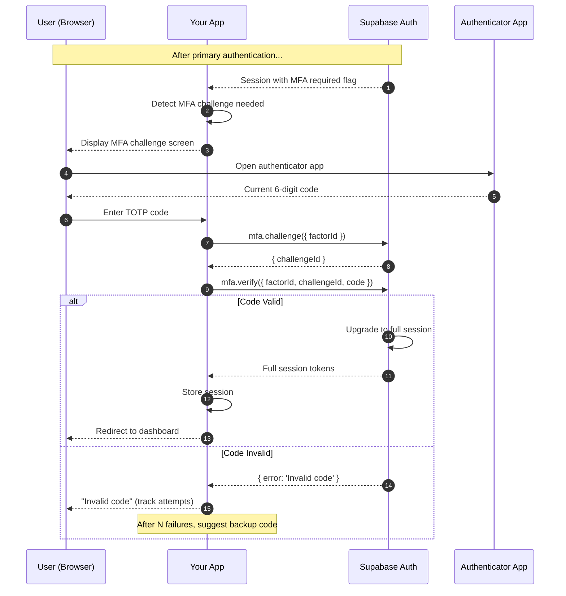
```mermaid
sequenceDiagram
    autonumber
    participant User as User (Browser)
    participant App as Your App
    participant Supa as Supabase Auth
    participant TOTP as Authenticator App
    
    Note over User,Supa: After primary authentication...
    
    Supa-->>App: Session with MFA required flag
    App->>App: Detect MFA challenge needed
    App-->>User: Display MFA challenge screen
    
    User->>TOTP: Open authenticator app
    TOTP-->>User: Current 6-digit code
    
    User->>App: Enter TOTP code
    App->>Supa: mfa.challenge({ factorId })
    Supa-->>App: { challengeId }
    
    App->>Supa: mfa.verify({ factorId, challengeId, code })
    
    alt Code Valid
        Supa->>Supa: Upgrade to full session
        Supa-->>App: Full session tokens
        App->>App: Store session
        App-->>User: Redirect to dashboard
    else Code Invalid
        Supa-->>App: { error: 'Invalid code' }
        App-->>User: "Invalid code" (track attempts)
        Note over App: After N failures, suggest backup code
    end
```

### 4.5 Account Linking Edge Cases

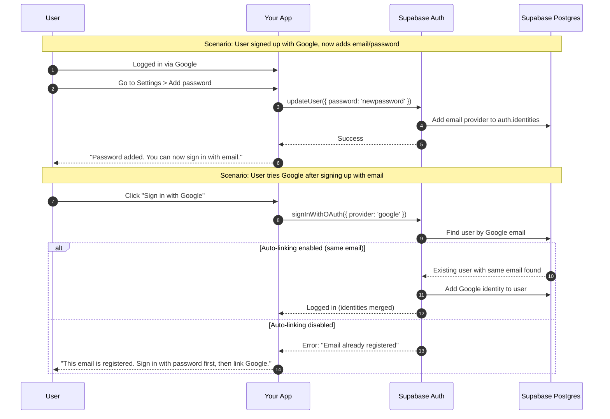
```mermaid
sequenceDiagram
    autonumber
    participant User as User
    participant App as Your App
    participant Supa as Supabase Auth
    participant DB as Supabase Postgres
    
    Note over User,DB: Scenario: User signed up with Google, now adds email/password
    
    User->>App: Logged in via Google
    User->>App: Go to Settings > Add password
    
    App->>Supa: updateUser({ password: 'newpassword' })
    Supa->>DB: Add email provider to auth.identities
    Supa-->>App: Success
    App-->>User: "Password added. You can now sign in with email."
    
    Note over User,DB: Scenario: User tries Google after signing up with email
    
    User->>App: Click "Sign in with Google"
    App->>Supa: signInWithOAuth({ provider: 'google' })
    Supa->>DB: Find user by Google email
    
    alt Auto-linking enabled (same email)
        DB-->>Supa: Existing user with same email found
        Supa->>DB: Add Google identity to user
        Supa-->>App: Logged in (identities merged)
    else Auto-linking disabled
        Supa-->>App: Error: "Email already registered"
        App-->>User: "This email is registered. Sign in with password first, then link Google."
    end
```

**Account Linking Decision Tree:**

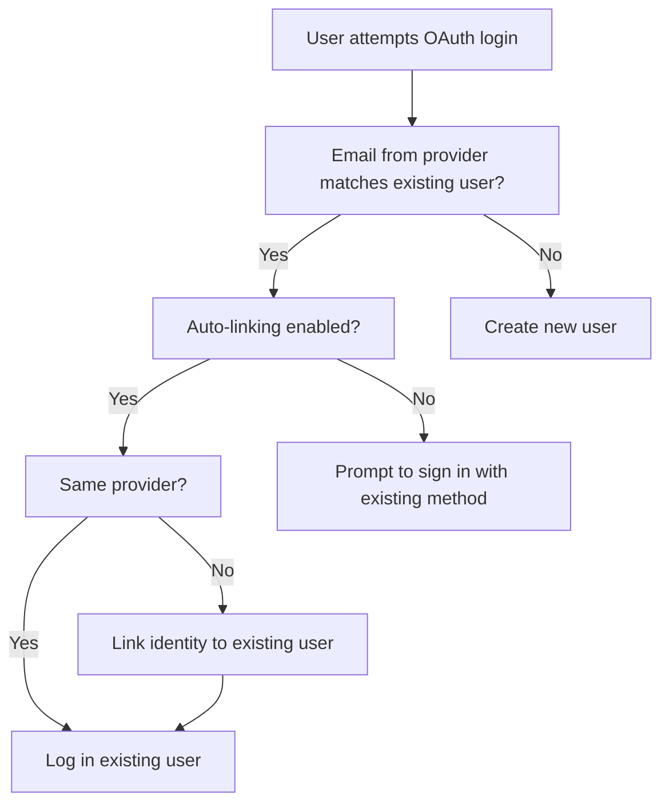
```mermaid
flowchart TB
    Start["User attempts OAuth login"]
    CheckEmail["Email from provider matches existing user?"]
    AutoLink["Auto-linking enabled?"]
    SameProvider["Same provider?"]
    Link["Link identity to existing user"]
    NewUser["Create new user"]
    Login["Log in existing user"]
    Error["Prompt to sign in with existing method"]
    
    Start --> CheckEmail
    CheckEmail -->|Yes| AutoLink
    CheckEmail -->|No| NewUser
    
    AutoLink -->|Yes| SameProvider
    AutoLink -->|No| Error
    
    SameProvider -->|Yes| Login
    SameProvider -->|No| Link
    
    Link --> Login
```

### 4.6 SSO Across Applications

#### 4.6.1 Same Parent Domain (Subdomains)

When apps are on subdomains (app.mycompany.com, admin.mycompany.com), cookies can be shared.

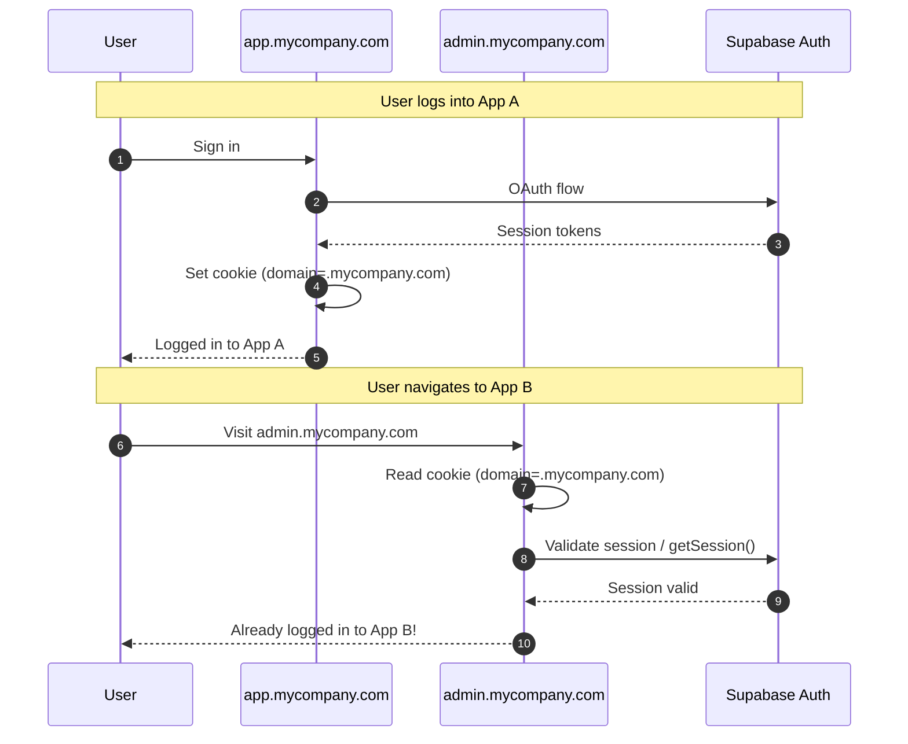
```mermaid
sequenceDiagram
    autonumber
    participant User as User
    participant AppA as app.mycompany.com
    participant AppB as admin.mycompany.com
    participant Supa as Supabase Auth
    
    Note over User,Supa: User logs into App A
    User->>AppA: Sign in
    AppA->>Supa: OAuth flow
    Supa-->>AppA: Session tokens
    AppA->>AppA: Set cookie (domain=.mycompany.com)
    AppA-->>User: Logged in to App A
    
    Note over User,Supa: User navigates to App B
    User->>AppB: Visit admin.mycompany.com
    AppB->>AppB: Read cookie (domain=.mycompany.com)
    AppB->>Supa: Validate session / getSession()
    Supa-->>AppB: Session valid
    AppB-->>User: Already logged in to App B!
```

**Key Configuration:**
```javascript
// Configure Supabase client with shared cookie domain
const supabase = createClient(url, anonKey, {
  auth: {
    storage: customCookieStorage, // Set domain=.mycompany.com
    storageKey: 'sb-auth',
  }
})
```

#### 4.6.2 Different Domains (No Shared Cookies)

When apps are on different domains (myapp.com, myother-service.io), use redirect-based SSO.

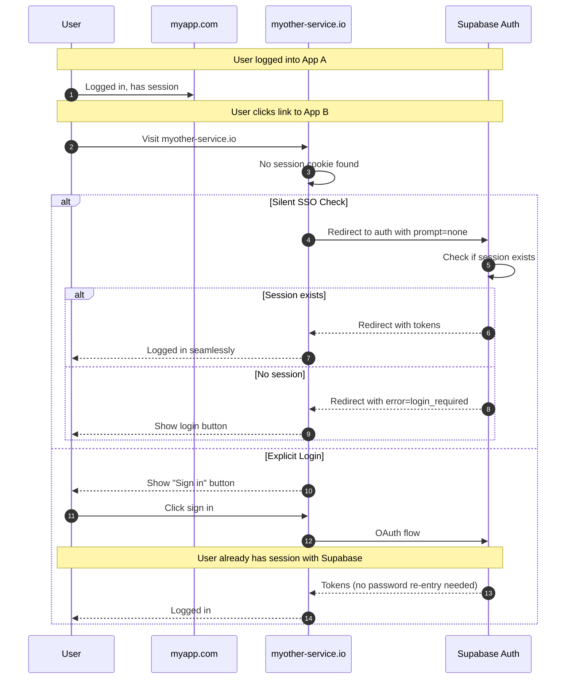
```mermaid
sequenceDiagram
    autonumber
    participant User as User
    participant AppA as myapp.com
    participant AppB as myother-service.io
    participant Supa as Supabase Auth
    
    Note over User,Supa: User logged into App A
    User->>AppA: Logged in, has session
    
    Note over User,Supa: User clicks link to App B
    User->>AppB: Visit myother-service.io
    AppB->>AppB: No session cookie found
    
    alt Silent SSO Check
        AppB->>Supa: Redirect to auth with prompt=none
        Supa->>Supa: Check if session exists
        alt Session exists
            Supa-->>AppB: Redirect with tokens
            AppB-->>User: Logged in seamlessly
        else No session
            Supa-->>AppB: Redirect with error=login_required
            AppB-->>User: Show login button
        end
    else Explicit Login
        AppB-->>User: Show "Sign in" button
        User->>AppB: Click sign in
        AppB->>Supa: OAuth flow
        Note over User,Supa: User already has session with Supabase
        Supa-->>AppB: Tokens (no password re-entry needed)
        AppB-->>User: Logged in
    end
```

**Implementation Notes:**
- Supabase doesn't natively support `prompt=none` for silent SSO
- Implement a "session check" endpoint that attempts OAuth and catches the login_required
- Consider a central "auth portal" app that other apps redirect through

**Cross-Domain SSO Architecture:**

```mermaid
flowchart TB
    subgraph "Domain A: myapp.com"
        AppA["App A"]
        CookieA["Cookie (myapp.com)"]
    end
    
    subgraph "Domain B: other-service.io"
        AppB["App B"]
        CookieB["Cookie (other-service.io)"]
    end
    
    subgraph "Auth Domain: auth.mycompany.com"
        AuthPortal["Auth Portal"]
        SupaAuth["Supabase Auth"]
        CookieAuth["Cookie (auth.mycompany.com)"]
    end
    
    AppA -->|"1. Redirect to auth portal"| AuthPortal
    AuthPortal -->|"2. Supabase OAuth"| SupaAuth
    SupaAuth -->|"3. Session established"| CookieAuth
    AuthPortal -->|"4. Redirect back with code"| AppA
    AppA -->|"5. Exchange code for tokens"| CookieA
    
    AppB -->|"6. Later: redirect to auth portal"| AuthPortal
    AuthPortal -->|"7. Check existing session"| CookieAuth
    CookieAuth -->|"8. Session valid"| AuthPortal
    AuthPortal -->|"9. Redirect with code (no login needed)"| AppB
    AppB -->|"10. Exchange for tokens"| CookieB
```

### 4.7 Token Refresh / Session Renewal

```mermaid
sequenceDiagram
    autonumber
    participant App as Your App
    participant Supa as Supabase Client
    participant Auth as Supabase Auth
    
    Note over App,Auth: Access token expires (default: 1 hour)
    
    App->>Supa: API call with expired access token
    Supa->>Supa: Detect token expired
    Supa->>Auth: POST /token?grant_type=refresh_token
    
    alt Refresh token valid
        Auth->>Auth: Validate refresh token
        Auth->>Auth: Rotate refresh token (issue new one)
        Auth-->>Supa: New access token + new refresh token
        Supa->>Supa: Update stored tokens
        Supa->>Auth: Retry original API call
        Auth-->>Supa: Success response
        Supa-->>App: Success response
    else Refresh token expired/revoked
        Auth-->>Supa: 401 Unauthorized
        Supa->>Supa: Clear session
        Supa-->>App: Session expired event
        App-->>App: Redirect to login
    end
```

**Token Refresh Best Practices:**
- Supabase JS client handles refresh automatically
- Configure `autoRefreshToken: true` (default)
- Listen for `onAuthStateChange` for session events
- Server-side: implement token refresh in middleware

### 4.8 Logout Flows

#### Per-App Logout

```mermaid
sequenceDiagram
    autonumber
    participant User as User
    participant AppA as App A
    participant AppB as App B
    participant Supa as Supabase Auth
    participant DB as Postgres
    
    User->>AppA: Click "Log out"
    AppA->>Supa: signOut({ scope: 'local' })
    Supa-->>AppA: Success
    AppA->>AppA: Clear local session/cookies
    AppA-->>User: Logged out of App A
    
    Note over User,DB: User is still logged into App B
    User->>AppB: Visit App B
    AppB->>Supa: getSession()
    Supa-->>AppB: Session still valid
    AppB-->>User: Still logged in to App B
```

#### Global Logout

```mermaid
sequenceDiagram
    autonumber
    participant User as User
    participant AppA as App A
    participant Supa as Supabase Auth
    participant DB as Postgres
    
    User->>AppA: Click "Log out everywhere"
    AppA->>Supa: signOut({ scope: 'global' })
    Supa->>DB: Invalidate all refresh tokens for user
    Supa-->>AppA: Success
    AppA->>AppA: Clear local session
    AppA-->>User: Logged out everywhere
    
    Note over User,DB: Other sessions will fail on next refresh
    Note over User,DB: Active access tokens still valid until expiry (!)
```

**Global Logout Limitations:**
- Access tokens remain valid until expiry (typically 1 hour)
- For immediate invalidation, implement token blacklist (adds latency)
- Consider shorter access token lifetimes for sensitive apps

### 4.9 Suspicious Login / Re-authentication

```mermaid
sequenceDiagram
    autonumber
    participant User as User
    participant App as Your App
    participant Supa as Supabase Auth
    participant Risk as Risk Detection
    
    User->>App: Attempt sensitive action (change email)
    App->>Risk: Check session risk level
    
    Risk->>Risk: Evaluate factors
    Note over Risk: - Time since last auth<br/>- IP/location change<br/>- Device fingerprint<br/>- Action sensitivity
    
    alt Low Risk
        Risk-->>App: Proceed
        App->>App: Execute action
    else Elevated Risk
        Risk-->>App: Re-auth required
        App-->>User: "Please verify your identity"
        
        alt Password user
            User->>App: Enter password
            App->>Supa: reauthenticate({ password })
        else OAuth user
            User->>App: Click verify button
            App->>Supa: OAuth flow (forced login)
        end
        
        Supa-->>App: Re-auth success
        App->>App: Execute sensitive action
    end
```

**Implementation Note:** Supabase doesn't provide built-in re-auth. Implement by:
1. Tracking `auth_time` claim in session
2. Requiring fresh authentication for sensitive operations
3. Using `signInWithPassword()` or OAuth with `prompt=login`

---

## 5. API Access Patterns

### 5.1 Overview of Access Patterns

```mermaid
flowchart TB
    subgraph "Human-to-Service"
        Browser["Browser/Mobile App"]
        CLI["CLI/Scripts"]
    end
    
    subgraph "Machine-to-Service"
        Integration["Third-party Integration"]
        Backend["Backend Service"]
    end
    
    subgraph "Credential Types"
        SessionToken["Session Token (JWT)"]
        PAT["Personal Access Token"]
        APIKey["API Key"]
        ServiceToken["Service Token"]
    end
    
    subgraph "Your APIs"
        PublicAPI["Public API Gateway"]
        InternalAPI["Internal Services"]
    end
    
    Browser -->|"Session JWT"| SessionToken
    CLI -->|"PAT"| PAT
    Integration -->|"API Key"| APIKey
    Backend -->|"Service Token"| ServiceToken
    
    SessionToken --> PublicAPI
    PAT --> PublicAPI
    APIKey --> PublicAPI
    ServiceToken --> InternalAPI
```

### 5.2 Browser/Mobile Apps with Supabase Tokens

```mermaid
sequenceDiagram
    autonumber
    participant User as User
    participant App as Browser/Mobile App
    participant Supa as Supabase Client
    participant API as Your Backend API
    participant RLS as Postgres + RLS
    
    User->>App: Perform action (view dashboard)
    App->>Supa: getSession()
    Supa-->>App: { access_token, user }
    
    alt Direct Supabase Query
        App->>RLS: Query with access_token
        RLS->>RLS: Validate JWT, apply RLS policies
        RLS-->>App: Filtered results
    else Custom Backend API
        App->>API: Request with Authorization: Bearer {access_token}
        API->>API: Validate JWT (signature, exp, iss, aud)
        API->>API: Extract user_id, tenant_id from claims
        API->>RLS: Query as authenticated user
        RLS-->>API: Results
        API-->>App: Response
    end
    
    App-->>User: Display data
```

**Token Flow for Browser/Mobile:**
- Token stored in memory (SPA) or httpOnly cookie (SSR)
- Supabase client auto-attaches to requests
- RLS policies see `auth.uid()` and `auth.jwt()` claims

### 5.3 CLI/Scripts with Personal Access Tokens (PATs)

```mermaid
sequenceDiagram
    autonumber
    participant Dev as Developer
    participant CLI as CLI Tool
    participant API as Your API
    participant CredDB as Credentials DB
    participant DataDB as Data (Postgres)
    
    Note over Dev,DataDB: One-time: Create PAT in web UI
    Dev->>API: POST /settings/tokens (authenticated session)
    API->>CredDB: Create token record (hashed)
    API-->>Dev: { token: "pat_xxxx...", id, created_at }
    Dev->>Dev: Store token in ~/.myapp/credentials
    
    Note over Dev,DataDB: CLI Usage
    Dev->>CLI: myapp-cli data export --project abc
    CLI->>CLI: Read token from credentials file
    CLI->>API: GET /api/data/export?project=abc
    Note over CLI,API: Header: Authorization: Bearer pat_xxxx...
    
    API->>API: Detect PAT prefix ("pat_")
    API->>CredDB: Hash token, lookup record
    CredDB-->>API: { user_id, scopes, constraints, expires_at }
    
    API->>API: Check: scope includes "data:read"?
    API->>API: Check: project constraint includes "abc"?
    
    alt Authorized
        API->>CredDB: Update last_used_at
        API->>DataDB: Query as user_id with constraints
        DataDB-->>API: Results
        API-->>CLI: Data response
        CLI-->>Dev: Output to terminal/file
    else Unauthorized
        API-->>CLI: 403 Forbidden
        CLI-->>Dev: "Access denied: insufficient scope"
    end
```

### 5.4 Third-Party Integrations with API Keys

```mermaid
sequenceDiagram
    autonumber
    participant Admin as Org Admin
    participant App as Your App
    participant ExtApp as External App (Zapier, etc.)
    participant API as Your API
    participant CredDB as Credentials DB
    
    Note over Admin,CredDB: Setup: Create API Key for integration
    Admin->>App: Navigate to Integrations > New API Key
    Admin->>App: Select: Zapier integration, Project X, Read-only
    App->>API: POST /api/keys
    API->>CredDB: Create API key record
    Note over CredDB: { id, key_hash, tenant_id, scopes,<br/>  resource_constraints, created_by, expires_at }
    API-->>App: { key: "sk_live_xxxx...", id, prefix }
    App-->>Admin: "Copy this key (shown once)"
    Admin->>ExtApp: Paste key in Zapier config
    
    Note over Admin,CredDB: Runtime: External app makes request
    ExtApp->>API: GET /api/projects/x/items
    Note over ExtApp,API: Header: X-API-Key: sk_live_xxxx...
    
    API->>API: Hash key, lookup in CredDB
    CredDB-->>API: Key record with constraints
    
    API->>API: Validate: tenant_id matches? scope matches? resource allowed?
    
    alt Valid
        API->>API: Execute with integration's permissions
        API-->>ExtApp: { items: [...] }
    else Invalid
        API-->>ExtApp: 401/403 Error
    end
```

### 5.5 Service-to-Service (S2S) Patterns

#### 5.5.1 Client Credentials Pattern (Service Identity)

```mermaid
sequenceDiagram
    autonumber
    participant ServiceA as Backend Service A
    participant TokenSvc as Token Service (Your Implementation)
    participant ServiceB as Backend Service B
    participant DB as Postgres
    
    Note over ServiceA,DB: Startup: Service A obtains service token
    ServiceA->>TokenSvc: POST /internal/token
    Note over ServiceA,TokenSvc: Auth: Service certificate or pre-shared secret
    TokenSvc->>TokenSvc: Validate service identity
    TokenSvc->>TokenSvc: Generate short-lived JWT
    Note over TokenSvc: Claims: { sub: "service:A", aud: "internal-api",<br/>  scopes: ["data:read", "data:write"] }
    TokenSvc-->>ServiceA: { access_token, expires_in: 3600 }
    
    Note over ServiceA,DB: Runtime: S2S API call
    ServiceA->>ServiceB: GET /internal/api/resource
    Note over ServiceA,ServiceB: Authorization: Bearer {service_token}
    
    ServiceB->>ServiceB: Validate JWT (same JWKS as user tokens)
    ServiceB->>ServiceB: Check sub starts with "service:"
    ServiceB->>ServiceB: Check scopes include required permissions
    ServiceB->>DB: Query (service role, no RLS)
    DB-->>ServiceB: Results
    ServiceB-->>ServiceA: Response
```

#### 5.5.2 On-Behalf-Of User (Token Exchange / Delegation)

```mermaid
sequenceDiagram
    autonumber
    participant User as User
    participant AppA as Frontend App
    participant ServiceA as Backend Service A
    participant TokenSvc as Token Exchange Service
    participant ServiceB as Backend Service B (Downstream)
    participant DB as Postgres + RLS
    
    User->>AppA: Request requiring Service B data
    AppA->>ServiceA: Request with user's JWT
    Note over AppA,ServiceA: Authorization: Bearer {user_jwt}
    
    ServiceA->>ServiceA: Validate user JWT
    ServiceA->>ServiceA: Need to call Service B on behalf of user
    
    ServiceA->>TokenSvc: POST /token/exchange
    Note over ServiceA,TokenSvc: { subject_token: user_jwt,<br/>  subject_token_type: "urn:ietf:params:oauth:token-type:jwt",<br/>  requested_token_type: "access_token",<br/>  audience: "service-b",<br/>  scope: "data:read" }
    
    TokenSvc->>TokenSvc: Validate subject_token
    TokenSvc->>TokenSvc: Check Service A can request delegation
    TokenSvc->>TokenSvc: Issue scoped token for Service B
    Note over TokenSvc: New token: { sub: user_id, aud: "service-b",<br/>  act: { sub: "service:A" }, scope: "data:read" }
    TokenSvc-->>ServiceA: { access_token: delegated_jwt }
    
    ServiceA->>ServiceB: Request with delegated token
    ServiceB->>ServiceB: Validate token, note "act" claim
    ServiceB->>DB: Query as user_id (RLS applies)
    DB-->>ServiceB: User-scoped results
    ServiceB-->>ServiceA: Response
    ServiceA-->>AppA: Combined response
    AppA-->>User: Display result
```

### 5.6 Access Pattern Summary

```mermaid
flowchart TB
    subgraph "Credential Type"
        ST["Session Token (JWT)"]
        PAT["Personal Access Token"]
        AK["API Key"]
        SvcT["Service Token"]
        DelT["Delegated Token"]
    end
    
    subgraph "Validation"
        V1["JWT Signature + Claims"]
        V2["Hash Lookup + Scope Check"]
        V3["Hash Lookup + Constraint Check"]
        V4["JWT + Service Identity"]
        V5["JWT + Actor Claim"]
    end
    
    subgraph "Authorization Enforcement"
        RLS["RLS (user context)"]
        Scoped["Scoped to PAT permissions"]
        Constrained["Constrained to key resources"]
        ServiceRole["Service role (bypass RLS)"]
        UserRLS["User RLS (via delegation)"]
    end
    
    ST --> V1 --> RLS
    PAT --> V2 --> Scoped
    AK --> V3 --> Constrained
    SvcT --> V4 --> ServiceRole
    DelT --> V5 --> UserRLS
```

| Credential | Issued To | Lifetime | Scope | RLS Behavior |
|------------|-----------|----------|-------|--------------|
| Session Token | User (browser/mobile) | Short (1h) + refresh | Full user permissions | User's `auth.uid()` |
| PAT | User (CLI/scripts) | Long (90d) + rotation | User-defined subset | User's ID with scope limits |
| API Key | Integration/tenant | Long (1y) + rotation | Integration-defined | Integration constraints |
| Service Token | Backend service | Short (1h) | Service permissions | Bypass RLS (service role) |
| Delegated Token | Service on behalf of user | Short (minutes) | Intersection of user + service | User's ID, downstream audit |

---

## 6. Credentials System Design

### 6.1 Data Model

```mermaid
erDiagram
    users ||--o{ personal_access_tokens : "creates"
    users ||--o{ api_keys : "creates"
    users }o--|| tenants : "belongs to"
    tenants ||--o{ projects : "contains"
    tenants ||--o{ api_keys : "scoped to"
    projects ||--o{ resources : "contains"
    personal_access_tokens ||--o{ token_scopes : "has"
    api_keys ||--o{ key_scopes : "has"
    personal_access_tokens ||--o{ audit_events : "generates"
    api_keys ||--o{ audit_events : "generates"
    
    users {
        uuid id PK
        text email
        jsonb metadata
        timestamp created_at
    }
    
    tenants {
        uuid id PK
        text name
        text slug
        timestamp created_at
    }
    
    projects {
        uuid id PK
        uuid tenant_id FK
        text name
        timestamp created_at
    }
    
    resources {
        uuid id PK
        uuid project_id FK
        text resource_type
        text name
        timestamp created_at
    }
    
    personal_access_tokens {
        uuid id PK
        uuid user_id FK
        text name
        text token_prefix
        text token_hash
        timestamp expires_at
        timestamp last_used_at
        inet last_used_ip
        boolean is_revoked
        timestamp created_at
    }
    
    token_scopes {
        uuid id PK
        uuid token_id FK
        text scope
        uuid tenant_id
        uuid project_id
        uuid resource_id
    }
    
    api_keys {
        uuid id PK
        uuid tenant_id FK
        uuid created_by FK
        text name
        text key_prefix
        text key_hash
        text integration_type
        timestamp expires_at
        timestamp last_used_at
        inet last_used_ip
        boolean is_revoked
        timestamp created_at
    }
    
    key_scopes {
        uuid id PK
        uuid key_id FK
        text scope
        uuid project_id
        uuid resource_id
    }
    
    audit_events {
        uuid id PK
        text event_type
        uuid actor_id
        text actor_type
        uuid credential_id
        text credential_type
        text action
        uuid resource_id
        text resource_type
        jsonb metadata
        inet ip_address
        text user_agent
        timestamp created_at
    }
```

### 6.2 Credential Tables DDL

```sql
-- Personal Access Tokens
CREATE TABLE personal_access_tokens (
    id UUID PRIMARY KEY DEFAULT gen_random_uuid(),
    user_id UUID NOT NULL REFERENCES auth.users(id) ON DELETE CASCADE,
    name TEXT NOT NULL,
    token_prefix TEXT NOT NULL,  -- First 8 chars for identification (e.g., "pat_Ab3x...")
    token_hash TEXT NOT NULL,    -- Argon2id or bcrypt hash of full token
    expires_at TIMESTAMPTZ NOT NULL,
    last_used_at TIMESTAMPTZ,
    last_used_ip INET,
    is_revoked BOOLEAN DEFAULT FALSE,
    created_at TIMESTAMPTZ DEFAULT NOW(),
    
    CONSTRAINT valid_expiry CHECK (expires_at > created_at)
);

-- Token scopes (what actions the token can perform)
CREATE TABLE token_scopes (
    id UUID PRIMARY KEY DEFAULT gen_random_uuid(),
    token_id UUID NOT NULL REFERENCES personal_access_tokens(id) ON DELETE CASCADE,
    scope TEXT NOT NULL,           -- e.g., 'read', 'write', 'admin', 'data:read'
    tenant_id UUID REFERENCES tenants(id),    -- NULL = all user's tenants
    project_id UUID REFERENCES projects(id),  -- NULL = all projects in tenant
    resource_id UUID,              -- NULL = all resources in project
    
    CONSTRAINT valid_hierarchy CHECK (
        (tenant_id IS NULL AND project_id IS NULL AND resource_id IS NULL) OR
        (tenant_id IS NOT NULL)
    )
);

-- API Keys (for integrations)
CREATE TABLE api_keys (
    id UUID PRIMARY KEY DEFAULT gen_random_uuid(),
    tenant_id UUID NOT NULL REFERENCES tenants(id) ON DELETE CASCADE,
    created_by UUID NOT NULL REFERENCES auth.users(id),
    name TEXT NOT NULL,
    key_prefix TEXT NOT NULL,     -- First 8 chars (e.g., "sk_live_...")
    key_hash TEXT NOT NULL,       -- Argon2id hash
    integration_type TEXT,        -- 'zapier', 'custom', 'ci_cd', etc.
    expires_at TIMESTAMPTZ,       -- NULL = no expiry (discouraged)
    last_used_at TIMESTAMPTZ,
    last_used_ip INET,
    is_revoked BOOLEAN DEFAULT FALSE,
    created_at TIMESTAMPTZ DEFAULT NOW()
);

-- Key scopes
CREATE TABLE key_scopes (
    id UUID PRIMARY KEY DEFAULT gen_random_uuid(),
    key_id UUID NOT NULL REFERENCES api_keys(id) ON DELETE CASCADE,
    scope TEXT NOT NULL,
    project_id UUID REFERENCES projects(id),  -- NULL = all tenant projects
    resource_id UUID                           -- NULL = all project resources
);

-- Audit events
CREATE TABLE audit_events (
    id UUID PRIMARY KEY DEFAULT gen_random_uuid(),
    event_type TEXT NOT NULL,     -- 'credential.created', 'credential.used', 'credential.revoked'
    actor_id UUID,
    actor_type TEXT NOT NULL,     -- 'user', 'pat', 'api_key', 'service'
    credential_id UUID,
    credential_type TEXT,         -- 'pat', 'api_key', 'session'
    action TEXT,                  -- 'read', 'write', 'delete'
    resource_id UUID,
    resource_type TEXT,
    metadata JSONB DEFAULT '{}',
    ip_address INET,
    user_agent TEXT,
    created_at TIMESTAMPTZ DEFAULT NOW()
);

-- Indexes for performance
CREATE INDEX idx_pat_user ON personal_access_tokens(user_id) WHERE NOT is_revoked;
CREATE INDEX idx_pat_prefix ON personal_access_tokens(token_prefix);
CREATE INDEX idx_apikey_tenant ON api_keys(tenant_id) WHERE NOT is_revoked;
CREATE INDEX idx_apikey_prefix ON api_keys(key_prefix);
CREATE INDEX idx_audit_actor ON audit_events(actor_id, created_at DESC);
CREATE INDEX idx_audit_credential ON audit_events(credential_id, created_at DESC);
```

### 6.3 Hashing and Verification

```mermaid
flowchart TB
    subgraph "Token Creation"
        Generate["Generate cryptographically random token<br/>(32 bytes = 256 bits)"]
        Prefix["Extract prefix (first 8 chars)<br/>e.g., 'pat_xK9m...'"]
        Hash["Hash full token with Argon2id<br/>(memory-hard, salt included)"]
        Store["Store: prefix, hash<br/>Never store plaintext"]
        Return["Return full token to user ONCE"]
    end
    
    Generate --> Prefix --> Hash --> Store --> Return
    
    subgraph "Token Verification"
        Receive["Receive token in request"]
        Extract["Extract prefix"]
        Lookup["Lookup by prefix"]
        Verify["Argon2id verify(token, stored_hash)"]
        Decision{Match?}
        Allow["Allow request"]
        Deny["Deny request"]
    end
    
    Receive --> Extract --> Lookup --> Verify --> Decision
    Decision -->|Yes| Allow
    Decision -->|No| Deny
```

**Security Properties:**
- **Argon2id**: Memory-hard, resistant to GPU/ASIC attacks
- **256-bit entropy**: Computationally infeasible to brute-force
- **Prefix for identification**: Allows users to identify tokens without exposing secrets
- **One-time display**: Token shown only at creation; user must save it

### 6.4 Scoping Model

```mermaid
flowchart TB
    subgraph "Scope Dimensions"
        Action["Action Scopes"]
        Resource["Resource Constraints"]
        Time["Time Constraints"]
    end
    
    subgraph "Action Scopes"
        Read["read"]
        Write["write"]
        Delete["delete"]
        Admin["admin"]
    end
    
    subgraph "Resource Hierarchy"
        Tenant["tenant_id"]
        Project["project_id"]
        ResourceID["resource_id"]
    end
    
    subgraph "Time Constraints"
        Expiry["expires_at"]
        Rotation["rotation_period"]
    end
    
    Action --> Read
    Action --> Write
    Action --> Delete
    Action --> Admin
    
    Resource --> Tenant --> Project --> ResourceID
    
    Time --> Expiry
    Time --> Rotation
```

**Scope Examples:**

| Token Name | Scopes | Constraints | Use Case |
|------------|--------|-------------|----------|
| CI Deploy Token | `write`, `deploy` | Project: `proj_123` | GitHub Actions deployment |
| Read-only Analytics | `read` | Tenant: `tenant_abc` | BI tool data access |
| Full Admin | `admin` | None | Emergency access |
| Single Resource | `read`, `write` | Resource: `res_xyz` | Single document API |

### 6.5 Token Lifecycle

```mermaid
stateDiagram-v2
    [*] --> Created: User creates token
    Created --> Active: Token saved
    Active --> Used: API request
    Used --> Active: Request complete
    Active --> Expired: expires_at passed
    Active --> Revoked: User/admin revokes
    Used --> Rotated: Rotation triggered
    Rotated --> Active: New token issued
    Expired --> [*]
    Revoked --> [*]
    
    note right of Active
        last_used_at tracked
        last_used_ip logged
    end note
    
    note right of Rotated
        Old token invalidated
        New token issued
        Grace period optional
    end note
```

### 6.6 Security Settings UX Requirements

**Page Structure: Security & API Access**

```mermaid
flowchart TB
    subgraph "Security Settings Page"
        subgraph "Account Security"
            Password["Password Management"]
            MFA["Two-Factor Authentication"]
            Sessions["Active Sessions"]
        end
        
        subgraph "Connected Accounts"
            Social["Social Logins (Google, GitHub)"]
            Link["Link/Unlink Providers"]
        end
        
        subgraph "API Access"
            PATs["Personal Access Tokens"]
            APIKeys["API Keys (if admin)"]
        end
        
        subgraph "Activity"
            LoginHistory["Login History"]
            AuditLog["API Activity Log"]
        end
    end
```

**UX Checklist:**

```markdown
## Account Security Section
- [ ] Show current password status (set/not set, last changed)
- [ ] Change password flow with current password verification
- [ ] MFA status indicator (enabled/disabled)
- [ ] MFA setup wizard with QR code and backup codes
- [ ] MFA disable requires re-authentication

## Active Sessions
- [ ] List all active sessions with:
      - Device/browser info
      - IP address (with rough geolocation)
      - Last activity time
      - "Current session" indicator
- [ ] "Sign out" button per session
- [ ] "Sign out all other sessions" button
- [ ] Highlight suspicious sessions (new location/device)

## Connected Accounts
- [ ] List linked providers with account email
- [ ] "Unlink" button (disabled if only auth method)
- [ ] "Link new account" for additional providers
- [ ] Warning when unlinking last auth method

## Personal Access Tokens
- [ ] List tokens with: name, prefix, created date, last used, expiry
- [ ] "Create token" wizard:
      - Name (required)
      - Expiration (30d, 90d, 1y, custom)
      - Scopes (checkboxes: read, write, admin)
      - Resource constraints (optional dropdowns)
- [ ] Show token ONCE after creation with "Copy" button
- [ ] "I've saved this token" confirmation required
- [ ] "Revoke" button with confirmation modal
- [ ] Bulk "Revoke all" option

## API Keys (Admin Only)
- [ ] Similar to PATs but scoped to tenant/org
- [ ] Integration type selector (Zapier, CI/CD, Custom)
- [ ] Project-level constraints
- [ ] Created by / owner information

## Activity & Audit
- [ ] Recent login attempts (success/failure)
- [ ] Failed login alerts
- [ ] Token usage logs (action, resource, timestamp)
- [ ] Export audit log option
```

### 6.7 Threat Model Highlights

```mermaid
flowchart TB
    subgraph "Threats"
        Leakage["Token Leakage"]
        Replay["Replay Attacks"]
        Phishing["Phishing"]
        Stuffing["Credential Stuffing"]
        Brute["Brute Force"]
    end
    
    subgraph "Mitigations"
        M1["Short expiry + rotation"]
        M2["JTI tracking + rate limits"]
        M3["Phishing-resistant MFA (WebAuthn)"]
        M4["Rate limiting + CAPTCHA"]
        M5["Lockout + alerting"]
    end
    
    Leakage -->|"Limit blast radius"| M1
    Replay -->|"Detect reuse"| M2
    Phishing -->|"Hardware keys"| M3
    Stuffing -->|"Throttle attempts"| M4
    Brute -->|"Progressive delays"| M5
```

| Threat | Description | Mitigation |
|--------|-------------|------------|
| **Token Leakage** | Token exposed in logs, git, screenshots | Short expiry, rotation, prefix-only display |
| **Replay Attack** | Stolen token reused | JTI tracking, short lifetimes, IP binding (optional) |
| **Phishing** | User tricked into entering credentials | MFA, security keys, login anomaly detection |
| **Credential Stuffing** | Automated login attempts with leaked passwords | Rate limiting, CAPTCHA, breach detection |
| **Brute Force** | Guessing tokens/passwords | High entropy, lockouts, monitoring |
| **Token Confusion** | Using token for wrong resource | Audience validation, resource constraints |

---

## 7. Authorization Design

### 7.1 Recommended Approach: RLS + Policy Tables (ReBAC-Style)

```mermaid
flowchart TB
    subgraph "Authorization Architecture"
        Request["Incoming Request"]
        Auth["Authentication (Who?)"]
        Authz["Authorization (Can they?)"]
        Data["Data Access"]
    end
    
    subgraph "Policy Evaluation"
        Direct["Direct Ownership<br/>(user_id = auth.uid())"]
        Membership["Org/Team Membership<br/>(user in org.members)"]
        Relationship["Relationship-Based<br/>(user has role on resource)"]
        Inherited["Inherited Permissions<br/>(resource in permitted folder)"]
    end
    
    Request --> Auth --> Authz --> Data
    
    Authz --> Direct
    Authz --> Membership
    Authz --> Relationship
    Authz --> Inherited
```

### 7.2 Policy Tables Schema

```sql
-- Organizations/Tenants
CREATE TABLE organizations (
    id UUID PRIMARY KEY DEFAULT gen_random_uuid(),
    name TEXT NOT NULL,
    slug TEXT UNIQUE NOT NULL,
    created_at TIMESTAMPTZ DEFAULT NOW()
);

-- Organization memberships
CREATE TABLE organization_members (
    id UUID PRIMARY KEY DEFAULT gen_random_uuid(),
    organization_id UUID NOT NULL REFERENCES organizations(id) ON DELETE CASCADE,
    user_id UUID NOT NULL REFERENCES auth.users(id) ON DELETE CASCADE,
    role TEXT NOT NULL CHECK (role IN ('owner', 'admin', 'member', 'viewer')),
    created_at TIMESTAMPTZ DEFAULT NOW(),
    UNIQUE (organization_id, user_id)
);

-- Projects within organizations
CREATE TABLE projects (
    id UUID PRIMARY KEY DEFAULT gen_random_uuid(),
    organization_id UUID NOT NULL REFERENCES organizations(id) ON DELETE CASCADE,
    name TEXT NOT NULL,
    created_at TIMESTAMPTZ DEFAULT NOW()
);

-- Explicit resource permissions (ReBAC)
CREATE TABLE resource_permissions (
    id UUID PRIMARY KEY DEFAULT gen_random_uuid(),
    resource_type TEXT NOT NULL,  -- 'project', 'document', 'dataset'
    resource_id UUID NOT NULL,
    principal_type TEXT NOT NULL, -- 'user', 'org', 'team', 'api_key'
    principal_id UUID NOT NULL,
    permission TEXT NOT NULL,     -- 'read', 'write', 'admin', 'delete'
    granted_by UUID REFERENCES auth.users(id),
    created_at TIMESTAMPTZ DEFAULT NOW(),
    UNIQUE (resource_type, resource_id, principal_type, principal_id, permission)
);

-- Helper function: Check if user has permission
CREATE OR REPLACE FUNCTION has_permission(
    p_user_id UUID,
    p_resource_type TEXT,
    p_resource_id UUID,
    p_permission TEXT
) RETURNS BOOLEAN AS $$
BEGIN
    RETURN EXISTS (
        -- Direct user permission
        SELECT 1 FROM resource_permissions
        WHERE resource_type = p_resource_type
          AND resource_id = p_resource_id
          AND principal_type = 'user'
          AND principal_id = p_user_id
          AND permission = p_permission
        
        UNION
        
        -- Organization membership permission
        SELECT 1 FROM resource_permissions rp
        JOIN organization_members om ON om.organization_id = rp.principal_id
        WHERE rp.resource_type = p_resource_type
          AND rp.resource_id = p_resource_id
          AND rp.principal_type = 'org'
          AND om.user_id = p_user_id
          AND rp.permission = p_permission
    );
END;
$$ LANGUAGE plpgsql SECURITY DEFINER;
```

### 7.3 RLS Policies Implementation

```sql
-- Enable RLS
ALTER TABLE organizations ENABLE ROW LEVEL SECURITY;
ALTER TABLE projects ENABLE ROW LEVEL SECURITY;

-- Organization: User can see orgs they're a member of
CREATE POLICY "Users can view their organizations"
ON organizations FOR SELECT
USING (
    id IN (
        SELECT organization_id 
        FROM organization_members 
        WHERE user_id = auth.uid()
    )
);

-- Projects: User can see projects in their orgs
CREATE POLICY "Users can view projects in their orgs"
ON projects FOR SELECT
USING (
    organization_id IN (
        SELECT organization_id 
        FROM organization_members 
        WHERE user_id = auth.uid()
    )
);

-- Projects: Only admins/owners can create
CREATE POLICY "Admins can create projects"
ON projects FOR INSERT
WITH CHECK (
    EXISTS (
        SELECT 1 FROM organization_members
        WHERE organization_id = projects.organization_id
          AND user_id = auth.uid()
          AND role IN ('owner', 'admin')
    )
);

-- Documents with explicit permissions
CREATE TABLE documents (
    id UUID PRIMARY KEY DEFAULT gen_random_uuid(),
    project_id UUID REFERENCES projects(id),
    title TEXT NOT NULL,
    content TEXT,
    created_by UUID REFERENCES auth.users(id),
    created_at TIMESTAMPTZ DEFAULT NOW()
);

ALTER TABLE documents ENABLE ROW LEVEL SECURITY;

CREATE POLICY "Document read access"
ON documents FOR SELECT
USING (
    -- Creator always has access
    created_by = auth.uid()
    OR
    -- Or has explicit permission
    has_permission(auth.uid(), 'document', id, 'read')
    OR
    -- Or is member of owning org (through project)
    EXISTS (
        SELECT 1 FROM projects p
        JOIN organization_members om ON om.organization_id = p.organization_id
        WHERE p.id = documents.project_id
          AND om.user_id = auth.uid()
    )
);
```

### 7.4 Authorization Check Patterns

#### Direct RLS Enforcement

```mermaid
sequenceDiagram
    autonumber
    participant Client as Client
    participant PostgREST as PostgREST API
    participant RLS as RLS Policy
    participant DB as Postgres
    
    Client->>PostgREST: GET /documents?project_id=eq.123
    Note over Client,PostgREST: Authorization: Bearer {jwt}
    
    PostgREST->>PostgREST: Set role = authenticated
    PostgREST->>PostgREST: Set request.jwt.claims
    PostgREST->>DB: SELECT * FROM documents WHERE project_id = '123'
    
    DB->>RLS: Evaluate policy for each row
    RLS->>RLS: Check auth.uid() ownership
    RLS->>RLS: Check has_permission()
    RLS->>RLS: Check org membership
    RLS-->>DB: Filter to allowed rows
    
    DB-->>PostgREST: Filtered results
    PostgREST-->>Client: { data: [...] }
```

#### PDP Service Pattern

```mermaid
sequenceDiagram
    autonumber
    participant Client as Client
    participant API as Your API
    participant PDP as Policy Decision Point
    participant PolicyDB as Policy Database
    participant DataDB as Data Database
    
    Client->>API: GET /api/documents/456
    Note over Client,API: Authorization: Bearer {jwt}
    
    API->>API: Validate JWT, extract user_id
    
    API->>PDP: POST /authorize
    Note over API,PDP: { subject: user_id, action: "read",<br/>  resource: { type: "document", id: "456" } }
    
    PDP->>PolicyDB: Query permissions
    PolicyDB-->>PDP: Permission records
    PDP->>PDP: Evaluate policy rules
    PDP-->>API: { allowed: true, reason: "org_member" }
    
    alt Allowed
        API->>DataDB: Fetch document 456
        DataDB-->>API: Document data
        API-->>Client: { document: {...} }
    else Denied
        API-->>Client: 403 Forbidden
    end
```

### 7.5 Worked Examples

#### Example 1: User Can Read Only Their Org's Data

**Scenario:** User Alice is a member of "Acme Corp" organization. She should only see Acme's data.

```sql
-- Policy: Users see only their org's data
CREATE POLICY "Org isolation"
ON datasets FOR SELECT
USING (
    organization_id IN (
        SELECT organization_id 
        FROM organization_members 
        WHERE user_id = auth.uid()
    )
);
```

```mermaid
flowchart LR
    Alice["Alice (user_123)"]
    Acme["Acme Corp (org_abc)"]
    Globex["Globex Inc (org_xyz)"]
    
    AcmeData["Acme Datasets"]
    GlobexData["Globex Datasets"]
    
    Alice -->|"member"| Acme
    Acme --> AcmeData
    Globex --> GlobexData
    
    Alice -->|"CAN read"| AcmeData
    Alice -->|"CANNOT read"| GlobexData
```

#### Example 2: Integration Key Limited to Project X, Read-Only

**Scenario:** API key `sk_live_abc123` should only read data from Project X.

```sql
-- Check API key constraints
CREATE OR REPLACE FUNCTION check_api_key_access(
    p_key_id UUID,
    p_action TEXT,
    p_project_id UUID
) RETURNS BOOLEAN AS $$
BEGIN
    RETURN EXISTS (
        SELECT 1 FROM key_scopes
        WHERE key_id = p_key_id
          AND scope = p_action
          AND (project_id IS NULL OR project_id = p_project_id)
    );
END;
$$ LANGUAGE plpgsql;

-- In your API middleware:
-- 1. Validate API key, get key_id
-- 2. For each request: check_api_key_access(key_id, 'read', project_id)
-- 3. If false, return 403
```

```mermaid
flowchart TB
    APIKey["API Key: sk_live_abc123"]
    
    subgraph "Scopes"
        Scope1["scope: read<br/>project_id: project_X"]
    end
    
    subgraph "Requests"
        R1["GET /projects/X/data ✓"]
        R2["GET /projects/Y/data ✗"]
        R3["POST /projects/X/data ✗"]
    end
    
    APIKey --> Scope1
    Scope1 -->|"matches"| R1
    Scope1 -->|"wrong project"| R2
    Scope1 -->|"wrong action"| R3
```

### 7.6 Authorization Decision Flow

```mermaid
flowchart TB
    Start["Authorization Request"]
    
    Start --> ExtractPrincipal["Extract Principal<br/>(user_id, key_id, service_id)"]
    ExtractPrincipal --> ExtractResource["Extract Resource<br/>(type, id, parent)"]
    ExtractResource --> ExtractAction["Extract Action<br/>(read, write, delete)"]
    
    ExtractAction --> CheckOwnership{"Is principal<br/>owner?"}
    CheckOwnership -->|Yes| Allow["ALLOW"]
    CheckOwnership -->|No| CheckDirect{"Has direct<br/>permission?"}
    
    CheckDirect -->|Yes| Allow
    CheckDirect -->|No| CheckInherited{"Has inherited<br/>permission?"}
    
    CheckInherited -->|Yes| Allow
    CheckInherited -->|No| CheckOrgRole{"Has org role<br/>granting access?"}
    
    CheckOrgRole -->|Yes| Allow
    CheckOrgRole -->|No| Deny["DENY"]
    
    Allow --> Audit["Log: ALLOW"]
    Deny --> Audit2["Log: DENY"]
```

---

## 8. Data-Plane / Warehouse Bridging

This section addresses the complex scenario: **A user authenticated via Supabase needs to access data in external systems (data warehouses, object stores, BI tools) with proper authorization enforcement.**

### 8.1 The Challenge

```mermaid
flowchart TB
    subgraph "Identity Plane (Supabase)"
        User["User Identity"]
        SupaAuth["Supabase Auth"]
        JWT["Supabase JWT"]
    end
    
    subgraph "Data Plane (External)"
        Warehouse["Data Warehouse (Snowflake, BigQuery)"]
        ObjectStore["Object Store (S3, GCS)"]
        BITool["BI Tool (Superset, Metabase)"]
    end
    
    Question["How does Warehouse know<br/>what User can access?"]
    
    User --> SupaAuth --> JWT
    JWT --> Question
    Question --> Warehouse
    Question --> ObjectStore
    Question --> BITool
```

**Core Problem:** External systems don't understand Supabase JWTs directly. We need to bridge identity and authorization.

### 8.2 Approach A: STS-Style Short-Lived Credentials

**When to use:**
- External system has its own credential/session model (AWS, Snowflake, BigQuery)
- You can map Supabase identity to external identity
- You need time-limited, scoped access

```mermaid
sequenceDiagram
    autonumber
    participant User as User
    participant App as Your App
    participant STS as Your STS Service
    participant PDP as Policy Decision
    participant Warehouse as Data Warehouse
    
    User->>App: Request: "Query my team's data"
    App->>App: Validate Supabase JWT
    
    App->>STS: POST /sts/credentials
    Note over App,STS: { user_jwt, requested_resource: "warehouse",<br/>  requested_scope: "team_data" }
    
    STS->>STS: Validate user JWT
    STS->>PDP: Can user access team_data?
    PDP-->>STS: Yes, scoped to team_id=xyz
    
    STS->>STS: Generate scoped warehouse credentials
    Note over STS: - Create temp warehouse user/role<br/>- Or: generate signed access token<br/>- Set TTL: 15 minutes
    
    STS-->>App: { credentials: {...}, expires_in: 900 }
    
    App->>Warehouse: Query with scoped credentials
    Note over App,Warehouse: Credentials limited to team_id=xyz data
    Warehouse-->>App: Query results (already filtered)
    App-->>User: Display results
```

**Supabase Mapping:**
- **Identity source:** Supabase Auth JWT (`auth.uid()`, custom claims)
- **Policy check:** Query your RLS-protected policy tables
- **Credential issuance:** Your service generates warehouse-specific credentials

**Implementation Components:**
```mermaid
flowchart TB
    subgraph "Your Infrastructure"
        STSService["STS Service"]
        PolicyDB["Policy DB (Supabase Postgres)"]
    end
    
    subgraph "External Systems"
        AWS["AWS STS (AssumeRole)"]
        Snowflake["Snowflake (OAuth/JWT)"]
        BigQuery["BigQuery (Service Account + IAM)"]
    end
    
    STSService -->|"Query user permissions"| PolicyDB
    STSService -->|"Generate AWS temp creds"| AWS
    STSService -->|"Generate Snowflake token"| Snowflake
    STSService -->|"Impersonate for BigQuery"| BigQuery
```

### 8.3 Approach B: Identity Propagation / Impersonation

**When to use:**
- External system supports user impersonation
- You want external system's native authorization
- Full audit trail at the data layer

```mermaid
sequenceDiagram
    autonumber
    participant User as User
    participant BITool as BI Tool (Superset)
    participant Backend as Your Backend
    participant Warehouse as Data Warehouse
    
    User->>BITool: Login via Supabase OAuth
    BITool->>BITool: Store Supabase session
    
    User->>BITool: Run query on "Sales Dashboard"
    BITool->>Backend: Execute query
    Note over BITool,Backend: Include: user_id from JWT
    
    Backend->>Backend: Validate JWT, extract user identity
    Backend->>Warehouse: Execute query AS USER 'user@domain.com'
    Note over Backend,Warehouse: Impersonation / run-as pattern
    
    Warehouse->>Warehouse: Apply warehouse-native permissions
    Note over Warehouse: Snowflake: RBAC on schemas/tables<br/>BigQuery: IAM + column-level security
    Warehouse-->>Backend: Results (filtered by warehouse authz)
    Backend-->>BITool: Query results
    BITool-->>User: Display dashboard
```

**Identity Mapping Strategy:**

```mermaid
flowchart LR
    subgraph "Supabase Identity"
        SupaUser["user_id: uuid-123<br/>email: alice@acme.com"]
    end
    
    subgraph "Identity Mapping Service"
        Mapper["Map Supabase → Warehouse Identity"]
    end
    
    subgraph "Warehouse Identity"
        SnowUser["Snowflake: ALICE@ACME.COM"]
        BQUser["BigQuery: alice@acme.com"]
    end
    
    SupaUser --> Mapper
    Mapper --> SnowUser
    Mapper --> BQUser
```

**Implementation Notes:**
- Requires service account with impersonation privileges
- Map Supabase `email` to warehouse user identity
- Warehouse handles all authorization natively
- Full audit trail in warehouse logs

### 8.4 Approach C: Capability Tokens / Pre-Signed URLs

**When to use:**
- Object-level access (files, blobs)
- Sharing specific resources without system-wide access
- Time-limited, single-use access

```mermaid
sequenceDiagram
    autonumber
    participant User as User
    participant App as Your App
    participant AuthZ as Authorization Check
    participant Storage as Object Storage (S3/Supabase Storage)
    
    User->>App: Request: "Download report.pdf"
    App->>App: Validate Supabase JWT
    
    App->>AuthZ: Can user access /reports/report.pdf?
    Note over App,AuthZ: Check RLS policy or permission table
    AuthZ-->>App: Allowed (reason: owner)
    
    App->>Storage: Generate pre-signed URL
    Note over App,Storage: Path: /reports/report.pdf<br/>Method: GET<br/>Expires: 5 minutes
    Storage-->>App: https://storage.../report.pdf?signature=xxx&expires=yyy
    
    App-->>User: Redirect to pre-signed URL
    User->>Storage: GET (direct download)
    Storage->>Storage: Validate signature + expiry
    Storage-->>User: File content
```

**Supabase Storage Implementation:**

```mermaid
flowchart TB
    subgraph "Supabase Storage Flow"
        Request["Download Request"]
        RLS["Check Storage Policy"]
        SignedURL["createSignedUrl()"]
        DirectAccess["Direct Download"]
    end
    
    subgraph "Policy Options"
        OptionA["A: User downloads via authenticated request"]
        OptionB["B: Generate signed URL for direct access"]
        OptionC["C: Public bucket (no auth)"]
    end
    
    Request --> RLS
    RLS -->|"Pass"| SignedURL
    SignedURL --> DirectAccess
```

```sql
-- Supabase Storage policy example
CREATE POLICY "Users can access their org's reports"
ON storage.objects FOR SELECT
USING (
    bucket_id = 'reports' 
    AND (storage.foldername(name))[1] IN (
        SELECT o.slug FROM organizations o
        JOIN organization_members om ON om.organization_id = o.id
        WHERE om.user_id = auth.uid()
    )
);
```

### 8.5 Approach Comparison

```mermaid
flowchart TB
    subgraph "Decision Tree: Choose Your Approach"
        Q1{"What type<br/>of resource?"}
        Q2{"External system<br/>supports user identity?"}
        Q3{"Need native<br/>external authz?"}
    end
    
    Q1 -->|"Files/Objects"| C["Approach C:<br/>Pre-signed URLs"]
    Q1 -->|"Structured Data"| Q2
    
    Q2 -->|"No"| A["Approach A:<br/>STS Credentials"]
    Q2 -->|"Yes"| Q3
    
    Q3 -->|"Yes"| B["Approach B:<br/>Impersonation"]
    Q3 -->|"No"| A
```

| Aspect | A: STS Credentials | B: Impersonation | C: Pre-signed URLs |
|--------|-------------------|------------------|-------------------|
| **Use case** | API/query access | BI tools, warehouses | File downloads |
| **Authz location** | Your policy layer | External system | Your policy layer |
| **Credential lifetime** | Minutes | Per-request | Minutes |
| **Audit trail** | Your logs | External system logs | Your logs |
| **Complexity** | Medium | High | Low |
| **Supabase fit** | Custom service | Custom service | Native support |

### 8.6 End-to-End Example: BI Tool with Warehouse Authorization

**Scenario:** User logs into Superset (BI tool) via Supabase Auth, queries Snowflake warehouse. Authorization for tables is managed in Supabase but enforced in Snowflake.

```mermaid
sequenceDiagram
    autonumber
    participant User as User (Browser)
    participant Superset as Superset BI
    participant Gateway as API Gateway
    participant PolicySvc as Policy Service
    participant PolicyDB as Supabase Postgres
    participant STS as STS Service
    participant Snowflake as Snowflake Warehouse
    
    Note over User,Snowflake: Authentication
    User->>Superset: Login
    Superset->>Gateway: OAuth redirect to Supabase
    Gateway-->>User: Supabase login page
    User->>Gateway: Authenticate (Google SSO)
    Gateway-->>Superset: JWT + user session
    Superset->>Superset: Store session
    
    Note over User,Snowflake: Query Execution
    User->>Superset: Run "Monthly Sales" report
    Superset->>Gateway: Query request + JWT
    Gateway->>Gateway: Validate JWT
    
    Gateway->>PolicySvc: What can user access?
    PolicySvc->>PolicyDB: Query permissions
    Note over PolicyDB: RLS filters to user's allowed datasets
    PolicyDB-->>PolicySvc: datasets: [sales_data (read)]
    PolicySvc-->>Gateway: Allowed datasets + scope
    
    Gateway->>STS: Get Snowflake credentials
    Note over Gateway,STS: { user_id, allowed_schemas: ["sales"] }
    STS->>STS: Generate scoped role token
    STS-->>Gateway: Snowflake OAuth token (scoped to sales schema)
    
    Gateway->>Snowflake: Execute query with scoped token
    Snowflake->>Snowflake: Token limits to sales schema
    Snowflake-->>Gateway: Query results
    
    Gateway-->>Superset: Results
    Superset-->>User: Display "Monthly Sales" chart
```

**Architecture Diagram:**

```mermaid
flowchart TB
    subgraph "User Layer"
        Browser["User Browser"]
        BI["Superset BI Tool"]
    end
    
    subgraph "Identity + Policy (Supabase)"
        SupaAuth["Supabase Auth"]
        PolicyDB["Policy Tables (Postgres + RLS)"]
    end
    
    subgraph "Your Services"
        Gateway["API Gateway"]
        PolicySvc["Policy Service"]
        STS["STS / Credential Service"]
    end
    
    subgraph "Data Layer"
        Snowflake["Snowflake"]
        S3["S3 / Object Store"]
    end
    
    Browser --> BI
    BI -->|"1. Login"| SupaAuth
    SupaAuth -->|"2. JWT"| BI
    
    BI -->|"3. Query + JWT"| Gateway
    Gateway -->|"4. Check permissions"| PolicySvc
    PolicySvc -->|"5. Query RLS tables"| PolicyDB
    
    Gateway -->|"6. Get scoped creds"| STS
    STS -->|"7. Snowflake token"| Gateway
    
    Gateway -->|"8. Execute query"| Snowflake
    Snowflake -->|"9. Results"| Gateway
    Gateway -->|"10. Response"| BI
    BI -->|"11. Display"| Browser
```

---

## 9. Best Practices & Anti-Patterns

### 9.1 Token Storage

```mermaid
flowchart TB
    subgraph "DO ✓"
        Memory["In-memory (SPA)"]
        HttpOnly["httpOnly cookie (SSR)"]
        Secure["Secure storage (mobile)"]
    end
    
    subgraph "DON'T ✗"
        LocalStorage["localStorage"]
        SessionStorage["sessionStorage"]
        PlainCookie["Non-httpOnly cookie"]
    end
    
    subgraph "Risks"
        XSS["XSS can steal tokens"]
        CSRF["CSRF without proper protection"]
    end
    
    LocalStorage --> XSS
    SessionStorage --> XSS
    PlainCookie --> XSS
```

**localStorage Exceptions:**
- Acceptable for tokens with very short lifetimes (< 5 minutes)
- Acceptable when combined with other security layers (strong CSP, token binding)
- Native mobile apps have different threat models (use secure keychain/keystore)

### 9.2 Cookie and Session Handling

| Scenario | Recommended Approach |
|----------|---------------------|
| **SPA on same domain as API** | httpOnly cookie set by backend |
| **SPA on different domain** | In-memory storage + refresh via httpOnly cookie |
| **SSR (Next.js, etc.)** | httpOnly cookie, set by server |
| **Mobile app** | Secure storage (iOS Keychain, Android Keystore) |
| **CLI tool** | File with restricted permissions (~/.config/app/credentials) |

**Cookie Configuration:**
```
Set-Cookie: sb-access-token=xxx;
  HttpOnly;          # Not accessible via JavaScript
  Secure;            # HTTPS only
  SameSite=Lax;      # CSRF protection
  Path=/;            # Available site-wide
  Max-Age=3600;      # Matches token expiry
```

### 9.3 Scope and Permission Design

```mermaid
flowchart TB
    subgraph "Principle: Least Privilege"
        Request["What does the token need?"]
        Minimum["Grant minimum required"]
        Time["For minimum time"]
        Resource["For specific resources"]
    end
    
    Request --> Minimum --> Time --> Resource
    
    subgraph "Anti-Pattern"
        GodToken["Token with admin on all resources"]
        NeverExpires["Token that never expires"]
        NoScope["Token with no scope restrictions"]
    end
```

**Scope Hierarchy:**
```
admin                    # Full access (rare)
├── write                # Create, update
│   ├── write:projects   # Projects only
│   └── write:documents  # Documents only
└── read                 # Read-only
    ├── read:projects
    └── read:documents
```

### 9.4 JWT Anti-Patterns

```mermaid
flowchart LR
    subgraph "Anti-Pattern: JWT as Database"
        BigJWT["JWT with 50+ claims"]
        Problem1["Large payload"]
        Problem2["Stale data"]
        Problem3["Can't revoke individual claims"]
    end
    
    BigJWT --> Problem1
    BigJWT --> Problem2
    BigJWT --> Problem3
    
    subgraph "Better: Minimal JWT + Lookup"
        SmallJWT["JWT: sub, tenant_id, roles"]
        Lookup["Lookup detailed permissions"]
        Fresh["Always current data"]
    end
    
    SmallJWT --> Lookup --> Fresh
```

**JWT Should Contain:**
- `sub`: User ID
- `aud`: Intended audience
- `exp`: Expiration
- `iss`: Issuer
- Key identifiers: `tenant_id`, primary `role`

**JWT Should NOT Contain:**
- Full permission matrices
- Detailed user profile data
- Sensitive PII
- Data that changes frequently

### 9.5 Token Lifetime Guidelines

| Token Type | Recommended Lifetime | Rationale |
|------------|---------------------|-----------|
| Access token | 15-60 minutes | Limits exposure window |
| Refresh token | 7-30 days | Balance UX vs security |
| PAT | 90 days max | Regular rotation encouraged |
| API key | 1 year max | With rotation reminders |
| Pre-signed URL | 5-60 minutes | Task-specific access |
| Service token | 1 hour | Auto-refresh in services |

### 9.6 Validation Checklist

```markdown
## Every Service Must Validate:
- [ ] JWT signature (using JWKS or shared secret)
- [ ] `exp` claim (token not expired)
- [ ] `iss` claim (expected issuer: your Supabase project)
- [ ] `aud` claim (intended for this service)
- [ ] `sub` claim exists (user/service identity)

## For Elevated Operations, Also Check:
- [ ] `auth_time` claim (recent authentication)
- [ ] `amr` claim (MFA was used)
- [ ] Custom claims match expected values
```

### 9.7 Audit and Observability

```mermaid
flowchart TB
    subgraph "What to Log"
        Auth["Authentication events"]
        Authz["Authorization decisions"]
        Cred["Credential lifecycle"]
        Sensitive["Sensitive operations"]
    end
    
    subgraph "Event Details"
        Who["Who: user_id, credential_id"]
        What["What: action, resource"]
        When["When: timestamp"]
        Where["Where: IP, user_agent"]
        Result["Result: success/failure, reason"]
    end
    
    Auth --> Who
    Authz --> What
    Cred --> When
    Sensitive --> Where
    
    Who --> Result
    What --> Result
    When --> Result
    Where --> Result
```

**Key Audit Events:**
- Login success/failure
- MFA enrollment/use
- Token creation/revocation
- Permission grants/revokes
- Sensitive data access
- Admin operations

### 9.8 Rate Limiting and Abuse Prevention

```mermaid
flowchart TB
    subgraph "Rate Limit Layers"
        Global["Global: 1000 req/min per IP"]
        User["Per User: 100 req/min"]
        Endpoint["Per Endpoint: varies"]
        Credential["Per Credential: 50 req/min"]
    end
    
    subgraph "Responses"
        R429["429 Too Many Requests"]
        Backoff["Retry-After header"]
        Alert["Alert on anomalies"]
    end
    
    Global --> R429
    User --> R429
    Endpoint --> R429
    Credential --> R429
    
    R429 --> Backoff
    R429 --> Alert
```

**Rate Limit by Sensitivity:**
| Endpoint | Limit | Window |
|----------|-------|--------|
| Login attempts | 5 | 15 minutes |
| Password reset | 3 | 1 hour |
| Token creation | 10 | 1 hour |
| API read | 1000 | 1 minute |
| API write | 100 | 1 minute |

### 9.9 Summary: Do's and Don'ts

```mermaid
flowchart TB
    subgraph "DO ✓"
        D1["Use short-lived access tokens"]
        D2["Implement token rotation"]
        D3["Validate all claims"]
        D4["Use RLS for data access"]
        D5["Hash credentials before storage"]
        D6["Log all auth events"]
        D7["Implement rate limiting"]
        D8["Use httpOnly cookies"]
    end
    
    subgraph "DON'T ✗"
        N1["Store tokens in localStorage"]
        N2["Use long-lived bearer tokens"]
        N3["Skip audience validation"]
        N4["Bypass RLS with service role"]
        N5["Store plaintext secrets"]
        N6["Trust client-provided claims"]
        N7["Ignore failed auth attempts"]
        N8["Use same token everywhere"]
    end
```

### 9.10 Next Steps (Brief Guidance)

**Multi-Tenancy Deep Dive:**
- Tenant isolation strategies (schema per tenant vs RLS vs database per tenant)
- Cross-tenant operations for platform admins
- Tenant-specific customization (branding, auth providers)

**Consent and Scopes UX:**
- OAuth consent screen design
- Progressive permission requests
- Permission management dashboard

**Key/Token Hierarchy:**
- Organization-level master keys
- Project-scoped derivative keys
- Hierarchical revocation (revoke org key → all project keys invalid)

**Advanced MFA:**
- WebAuthn/FIDO2 implementation
- Recovery flows and backup codes
- Adaptive MFA based on risk signals

---

## Appendix: Quick Reference Diagrams

### A. Complete Auth Flow Overview

```mermaid
flowchart TB
    subgraph "Authentication"
        Login["User Login"]
        Social["Social OAuth"]
        MFA["MFA Challenge"]
        Session["Session Issued"]
    end
    
    subgraph "Token Types"
        Access["Access Token (1h)"]
        Refresh["Refresh Token (7d)"]
        PAT["PAT (90d)"]
        APIKey["API Key (1y)"]
    end
    
    subgraph "Authorization"
        RLS["RLS Policies"]
        PolicyTables["Permission Tables"]
        PDP["PDP Service"]
    end
    
    subgraph "Protected Resources"
        Postgres["Postgres Data"]
        Storage["Storage Objects"]
        External["External Systems"]
    end
    
    Login --> Social --> MFA --> Session
    Session --> Access
    Session --> Refresh
    
    Access --> RLS
    PAT --> PolicyTables
    APIKey --> PolicyTables
    
    RLS --> Postgres
    RLS --> Storage
    PolicyTables --> PDP --> External
```

### B. Credential Lifecycle

```mermaid
stateDiagram-v2
    [*] --> Created: User creates
    Created --> Active: Stored securely
    Active --> InUse: API request
    InUse --> Active: Request complete
    Active --> Rotated: Rotation due
    Rotated --> NewActive: New credential
    Active --> Expired: TTL reached
    Active --> Revoked: User/admin action
    Expired --> [*]
    Revoked --> [*]
```

### C. Multi-App SSO Summary

```mermaid
flowchart LR
    subgraph "Same Domain"
        A1["app.myco.com"]
        A2["admin.myco.com"]
        Cookie["Shared Cookie<br/>(domain=.myco.com)"]
    end
    
    A1 --> Cookie
    A2 --> Cookie
    
    subgraph "Different Domains"
        B1["myapp.com"]
        B2["other.io"]
        Portal["Auth Portal<br/>(auth.myco.com)"]
    end
    
    B1 -->|"Redirect"| Portal
    B2 -->|"Redirect"| Portal
```

---

**Document End**

This design document provides a comprehensive foundation for implementing a secure, scalable multi-application B2C ecosystem with Supabase. The patterns and recommendations should be adapted to your specific requirements, threat model, and compliance needs.
