# 1) Glossary (must be first)

> Goal: align vocabulary across product, platform, security, and data teams. Each term includes (a) definition, (b) analogy, (c) what users feel/see in UI.

## OAuth2
- **Definition:** A framework for **authorization** (granting an app permission to call an API). OAuth2 defines flows to obtain access tokens.
- **Analogy:** A valet ticket that lets someone drive *your car* for a specific purpose and time.
- **User scenario:** “Connect Calendar” shows a consent screen; user approves; app later calls an API without asking for password again.

## OIDC (OpenID Connect)
- **Definition:** An **authentication** layer on top of OAuth2. Adds **ID tokens** and standardized identity claims.
- **Analogy:** A verified ID card issued by a trusted authority, plus a receipt for what you allowed.
- **User scenario:** “Sign in with Google” returns you to the app already known as *you*, with profile info.

## SAML (contrast)
- **Definition:** An older enterprise SSO standard using XML assertions, often used for workforce identity.
- **Analogy:** A stamped letter (assertion) handed from one organization to another.
- **User scenario:** Corporate users click “Sign in with Company SSO” and are redirected through their employer’s login.

## Authorization Server
- **Definition:** The system that issues tokens (access/refresh/ID) after authenticating and/or obtaining consent.
- **Analogy:** The ticket booth that issues time-limited passes.
- **User scenario:** You briefly see a hosted login page; after login you land back in the app.

## IdP (Identity Provider)
- **Definition:** A system that authenticates users and provides identity assertions/tokens (could be OIDC or SAML).
- **Analogy:** DMV / passport office verifying identity.
- **User scenario:** “Continue with Google” is using Google as IdP.

## RP / SP (Relying Party / Service Provider)
- **Definition:** The app that **relies on** the IdP/Authorization Server for login (RP in OIDC, SP in SAML).
- **Analogy:** Venue that accepts a verified ID card at the door.
- **User scenario:** Your app doesn’t manage passwords; it accepts Supabase session tokens.

## Session cookie
- **Definition:** A browser cookie representing an authenticated session (often httpOnly). Used for SSO across web apps in a domain scope.
- **Analogy:** A wristband for re-entry at a festival.
- **User scenario:** Open App B in a new tab and you’re already logged in.

## Access token
- **Definition:** A token presented to APIs to authorize requests. Typically short-lived.
- **Analogy:** A hotel keycard that opens certain doors for a limited time.
- **User scenario:** API calls succeed until token expires; then app silently renews.

## Refresh token
- **Definition:** A long(er)-lived credential used to get new access tokens without user re-auth.
- **Analogy:** A membership card used to get new day-passes.
- **User scenario:** You stay logged in for weeks; you aren’t prompted daily.

## ID token
- **Definition:** OIDC token carrying identity claims about the user (who they are), meant for the client/RP.
- **Analogy:** A signed business card from the IdP.
- **User scenario:** App shows your name/email immediately after login.

## JWT
- **Definition:** A signed token format (JSON Web Token). Can be used for access tokens and ID tokens.
- **Analogy:** A tamper-evident sealed envelope containing claims.
- **User scenario:** Invisible; but enables stateless verification by services.

## Claims
- **Definition:** Key-value attributes inside tokens (e.g., `sub`, `email`, `role`, custom claims).
- **Analogy:** The printed details on a ticket (seat, section, time).
- **User scenario:** UI conditionally shows admin settings if claim indicates admin.

## Issuer (`iss`)
- **Definition:** Identifies who issued the token (the token authority).
- **Analogy:** The logo/authority printed on the ticket.
- **User scenario:** Behind the scenes, services reject tokens from unknown issuers.

## Audience (`aud`)
- **Definition:** Intended recipient(s) of the token—what API/service should accept it.
- **Analogy:** Ticket “valid for venue X only”.
- **User scenario:** Token for App A can’t be replayed to App B’s API if configured correctly.

## JWKS
- **Definition:** JSON Web Key Set endpoint exposing public keys used to verify JWT signatures.
- **Analogy:** The public “signature samples” you can compare against.
- **User scenario:** Invisible; enables key rotation without redeploying every service.

## JTI
- **Definition:** Unique token identifier claim. Used for replay detection or revocation lists.
- **Analogy:** A serial number on a banknote.
- **User scenario:** Security team can revoke a specific token instance.

## PKCE
- **Definition:** Proof Key for Code Exchange. Protects OAuth authorization code flows for public clients (SPAs/mobile) against interception.
- **Analogy:** A claim check that must match the original stub.
- **User scenario:** Safer login for mobile apps without client secrets.

## CSRF
- **Definition:** Cross-Site Request Forgery. An attack where a browser is tricked into sending authenticated requests.
- **Analogy:** Someone forges a form submission using your already-open session.
- **User scenario:** Without defenses, clicking a malicious link could change settings.

## Token rotation
- **Definition:** Replacing refresh tokens periodically; old tokens become invalid after use.
- **Analogy:** Changing locks after issuing a new key.
- **User scenario:** If a refresh token leaks, its reuse gets detected.

## Token revocation
- **Definition:** Making a previously issued token (or family) unusable before its expiration.
- **Analogy:** Canceling a ticket.
- **User scenario:** User clicks “Sign out of all devices” and sessions stop working.

## STS (Security Token Service)
- **Definition:** Service that exchanges identity for short-lived credentials to access downstream systems (often cloud storage/warehouse).
- **Analogy:** A cashier that converts your membership into a time-limited wristband for a restricted area.
- **User scenario:** After login, user can query data warehouse without seeing warehouse passwords.

## Impersonation
- **Definition:** A trusted service acts as a user to a downstream system (with strict controls/audit).
- **Analogy:** A manager signs for an employee with recorded approval.
- **User scenario:** “Run query as Alice” is logged, gated, and time-limited.

## Delegation
- **Definition:** Passing a user’s permission to another component to act on their behalf (often via token exchange).
- **Analogy:** Power of attorney for one task.
- **User scenario:** A BI tool can fetch user-authorized data from APIs without storing the user password.

## Token exchange
- **Definition:** Swapping one token for another token suitable for a different audience or system (e.g., OAuth Token Exchange).
- **Analogy:** Exchanging currency at a kiosk for a destination-specific currency.
- **User scenario:** User logs in once; internal services obtain downstream-scoped tokens.

## RBAC
- **Definition:** Role-Based Access Control (roles grant permissions).
- **Analogy:** Job titles determine what doors open.
- **User scenario:** “Admin” role sees billing settings.

## ABAC
- **Definition:** Attribute-Based Access Control (policy based on attributes like org, region, device posture).
- **Analogy:** Rules like “only employees on-site can enter lab.”
- **User scenario:** Access blocked when user is outside allowed region.

## ReBAC
- **Definition:** Relationship-Based Access Control (permissions derived from relationships between principals and resources).
- **Analogy:** “Friend-of-a-friend” style relationship graph controls access.
- **User scenario:** You can open a project if you are a member of its organization.

## PEP / PDP
- **Definition:** Policy Enforcement Point (PEP) enforces decisions; Policy Decision Point (PDP) decides.
- **Analogy:** PDP is the judge; PEP is the bailiff enforcing the ruling.
- **User scenario:** UI shows “You don’t have access” because the API/DB enforced policy.

---

# 2) Supabase component model (high level but concrete)

## Conceptual mapping (Supabase-specific)

### Supabase Auth (GoTrue) is conceptually…
- A **hosted identity + session issuer** (OIDC/OAuth2 *provider-like* behavior) that:
  - authenticates users via email/password, magic links, social providers
  - issues **JWT access tokens** and **refresh tokens**
  - supports MFA (via Supabase Auth MFA features)
  - manages sessions and user identities

### Supabase Auth is *not*…
- A full enterprise IdP (like Okta) with deep SAML/SCIM governance features
- A complete authorization engine for resource graphs (that’s your DB/RLS and optionally a PDP)
- A replacement for service-to-service identity (you will likely add a service identity layer)

### Postgres + RLS is your primary authorization enforcement
- Treat Postgres as the **authoritative policy enforcement point** for anything stored in Postgres.
- RLS policies + security definer functions give you:
  - per-tenant isolation
  - per-resource access control (ReBAC tables)
  - consistent enforcement across all apps and APIs (as long as they access data via Postgres with JWT context)

### Storage + policies is object authorization enforcement
- Supabase Storage integrates with Postgres policies (buckets/objects metadata in Postgres).
- You can enforce “who can read/write object X” using policies tied to `auth.uid()` and relationship tables.

### Optional PDP microservice (when useful)
Use a separate PDP when:
- You need to authorize **non-Postgres** resources (warehouse, S3, external APIs) using the same policy model
- You need **explainability** (“why denied?”) or decision caching at high volume
- You need centralized **policy evaluation** across heterogeneous backends

Avoid a PDP when:
- All critical authorization happens in Postgres + Storage policies
- You can express policies in RLS cleanly and you want minimal moving parts

### Backend services: validating Supabase JWTs without duplicating auth
Pattern:
1) Services validate JWT **signature** (via JWKS), **issuer**, **audience**, **expiry**
2) Services perform **coarse checks** (token valid, user active)
3) Services rely on **Postgres RLS** for fine-grained authorization by using the user JWT when querying Postgres (or by calling RPC functions that do)

Key principle:
- **Do not** re-implement per-resource authorization rules in each service.
- Put rules in **RLS + relationship tables** (and optionally PDP for non-Postgres).

## High-level component diagram

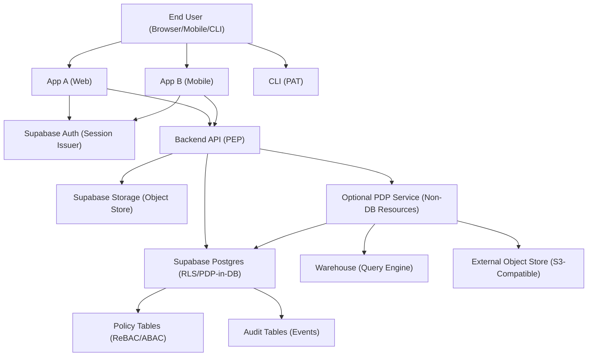

---

# 3) FULL onboarding / “first install” (platform bootstrap) guide

## Bootstrap checklist (conceptual + implementation steps)

### A) Domains, redirect URIs, and SSO topology
- [ ] Decide SSO topology:
  - [ ] **Same parent domain** (e.g., `app-a.example.com`, `app-b.example.com`)
  - [ ] **Different domains** (e.g., `example.com` and `example-app.net`)
- [ ] Register redirect URIs for each app in Supabase Auth settings:
  - [ ] local dev callbacks
  - [ ] staging callbacks
  - [ ] production callbacks
- [ ] Decide session strategy per app:
  - [ ] SSR web apps: prefer **httpOnly cookies** (server-managed)
  - [ ] SPA/mobile: use Supabase client session management (avoid localStorage if possible; see best practices)

### B) Enable social providers
- [ ] Configure providers (Google, Apple, etc.) in Supabase Auth
- [ ] Ensure provider settings match environment (dev/stage/prod)
- [ ] Define account linking strategy:
  - [ ] email-based linking rules (careful with provider email verification)
  - [ ] allow multiple identities per user

### C) Enable MFA
- [ ] Choose MFA factor(s) to support (e.g., TOTP, WebAuthn if supported)
- [ ] Define MFA policy:
  - [ ] optional enrollment with prompts
  - [ ] step-up required for sensitive actions (keys, billing, org admin)
- [ ] Define recovery options:
  - [ ] recovery codes
  - [ ] trusted device policy (if you implement)

### D) JWKS and key management considerations
- [ ] Identify your **issuer** and expected token **audience(s)**
- [ ] Ensure services validate tokens using **JWKS**
- [ ] Plan for key rotation:
  - [ ] cache JWKS with TTL
  - [ ] handle `kid` changes gracefully

### E) Environment separation (dev/stage/prod)
- [ ] Separate Supabase projects per environment
- [ ] Separate OAuth provider apps/credentials per environment
- [ ] Separate storage buckets or prefixes per environment
- [ ] Ensure no cross-environment token acceptance (issuer/aud separation)

### F) Secrets handling
- [ ] Use a secrets manager (KMS-backed) for:
  - [ ] OAuth client secrets (server-side apps)
  - [ ] webhook secrets
  - [ ] service identity private keys (if you mint S2S tokens)
- [ ] Never store plaintext PATs/API keys; store hashed only (see section 6)

### G) Logging and audit baselines
- [ ] Define audit event schema (auth events, credential lifecycle, admin actions, data export)
- [ ] Log security-sensitive actions with:
  - [ ] principal id
  - [ ] resource id
  - [ ] action
  - [ ] decision (allow/deny)
  - [ ] request id, IP, user agent
- [ ] Create “break glass” operational procedures

## Bootstrap component diagram

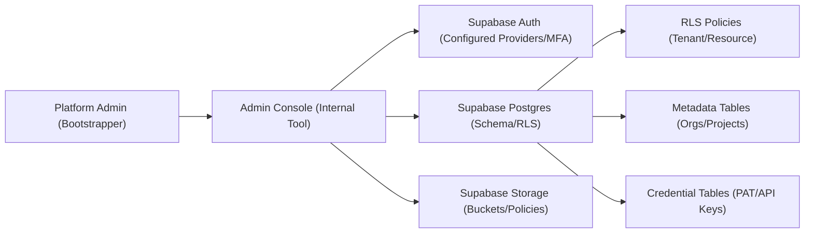

## Bootstrap sequence (admin first-time setup)

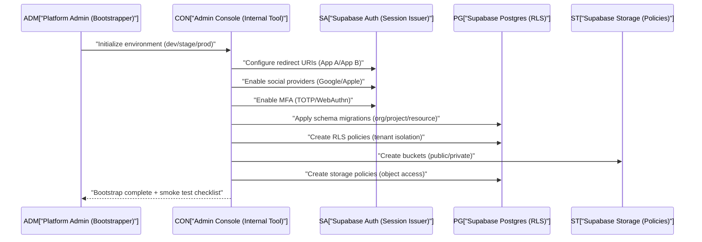

---

# 4) User journeys: detailed sequences

## 4.1 New user sign-up with social login (first time)

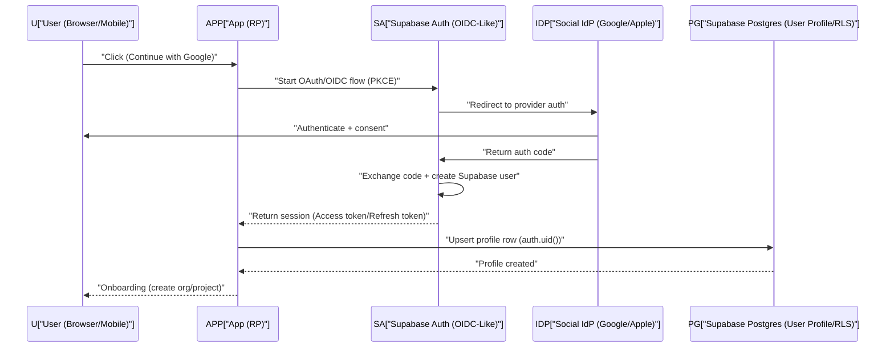

## 4.2 Existing user login

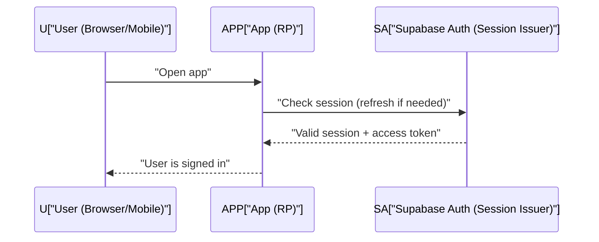

## 4.3 MFA enrollment flow (step-up recommended)

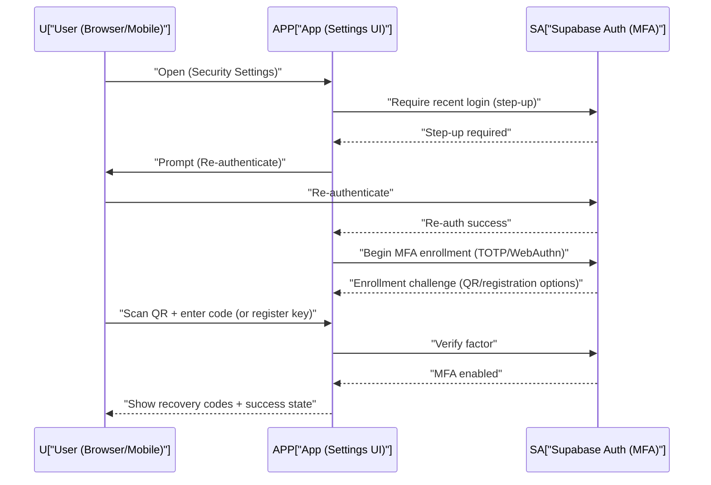

## 4.4 MFA challenge flow on subsequent logins

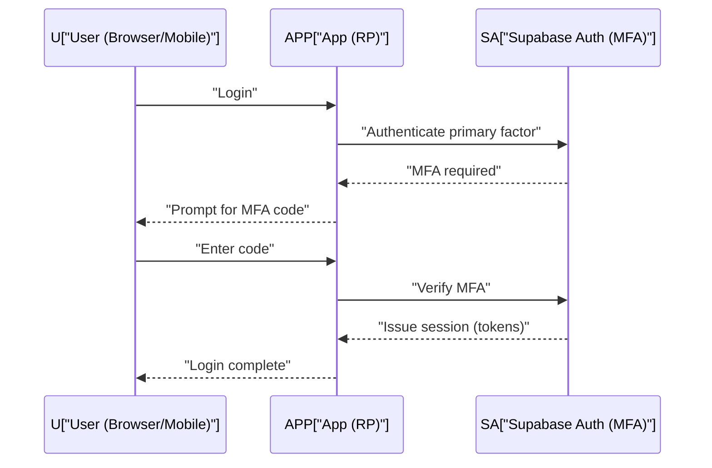

## 4.5 Account linking edge cases

### Case: user signs up with Google then tries email/password
Design rules:
- Prefer **one canonical user** with multiple identities.
- On email/password signup attempt:
  - If email matches existing verified identity, prompt “Link account” and require step-up.

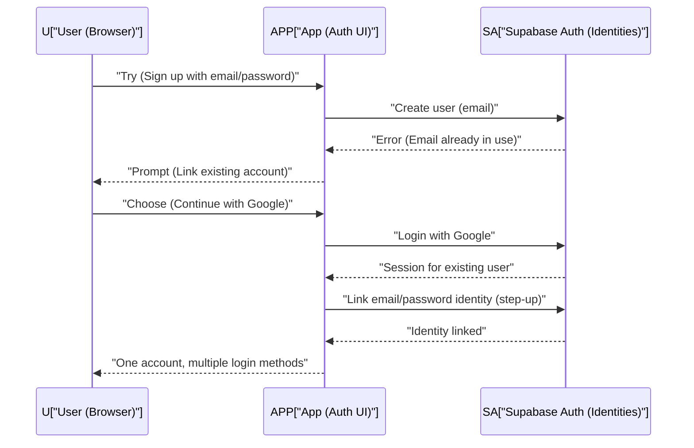

### Case: multiple social providers
- Show “Linked accounts” list; allow unlink only if at least one strong method remains.

## 4.6 SSO across App A and App B

### A) Same parent domain (subdomains) approach
Assumption: you can scope cookies to `.example.com`.

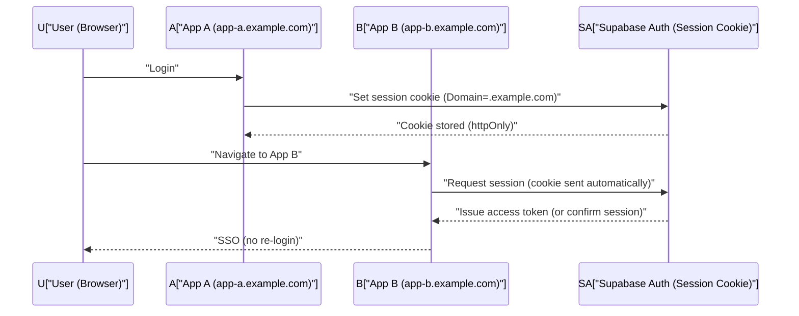

Implementation notes:
- Prefer **server-side session handling** for SSR apps (cookie-based).
- Ensure CSRF defenses for cookie-authenticated endpoints.

### B) Different domains approach (redirect-based; no shared cookies)
You cannot share cookies across `example.com` and `example-app.net`. Use a central “auth broker” flow.

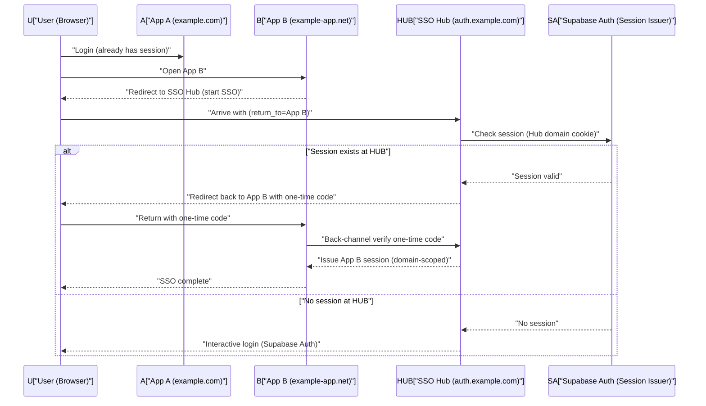

Key idea:
- Use a **central SSO hub domain** that holds the session; other domains perform redirects + one-time-code exchange.

## 4.7 Token refresh / session renewal

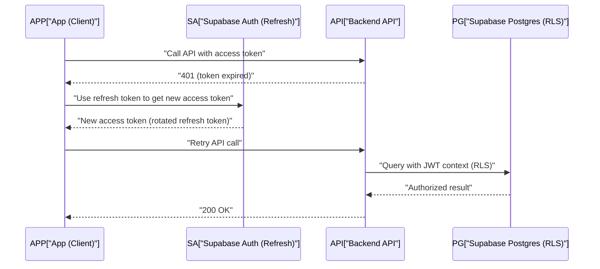

## 4.8 Logout (per-app vs global)

### Per-app logout
- Clear app session (cookies or local session)
- Optionally revoke refresh token family

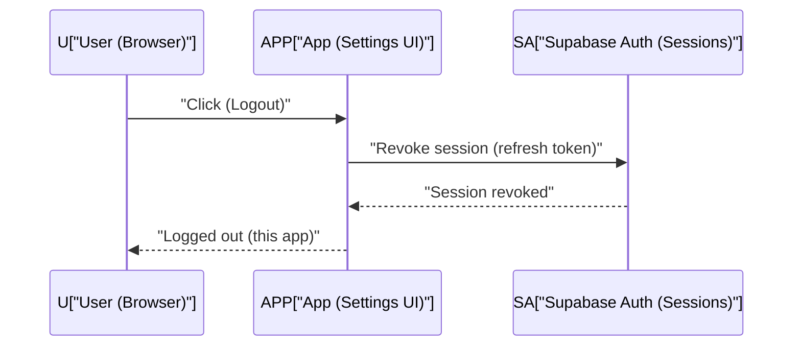

### Global logout (feasible with limitations)
- Requires session management across apps:
  - shared cookie domain (subdomains), or
  - SSO hub coordinating sign-out

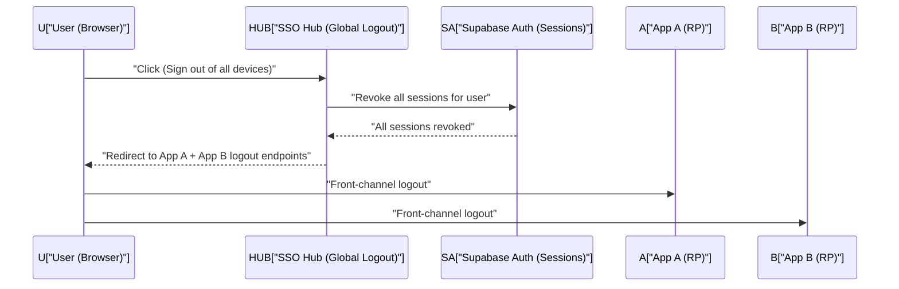

Limitations:
- Front-channel logout can fail if tabs closed or blocked.
- True global logout across different domains is best-effort.

## 4.9 “Suspicious login / re-auth required” UX (high level)
Triggers:
- new device, impossible travel, high-risk IP, user changed email, user managing PATs/API keys
UX requirements:
- show **why** re-auth is required
- require MFA if enabled
- show session/device list after success

---

# 5) API access patterns

## 5.1 Browser/mobile apps calling APIs using Supabase tokens

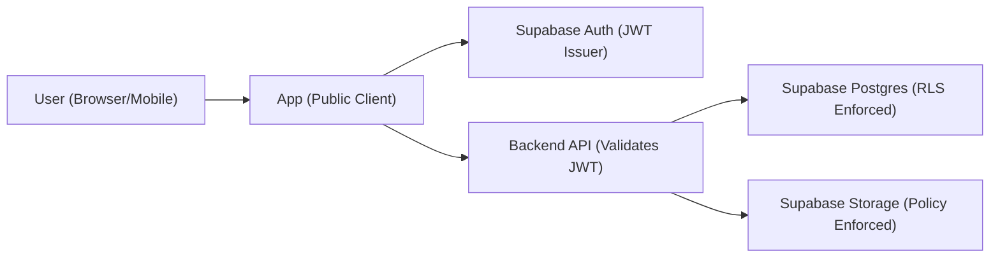

What is presented:
- **Access token (JWT)** to your Backend API (Authorization: Bearer).
What service validates:
- JWT signature via JWKS, `iss`, `aud`, `exp`.
Where authorization is enforced:
- Fine-grained: **Postgres RLS** and **Storage policies**.
- Coarse-grained: API gateway/service checks (rate limits, blocked users).

## 5.2 CLIs/scripts using PATs

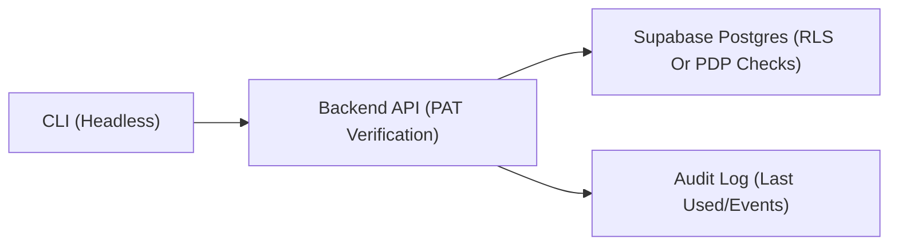

What is presented:
- **PAT** (a long random secret) as `Authorization: Bearer pat_xxx` (or header `X-Api-Token`).
What service validates:
- Hash lookup + constant-time compare; verify not revoked/expired; check scope constraints.
Where authorization is enforced:
- API enforces PAT scope constraints + then uses DB for resource enforcement.

## 5.3 Third-party integrations using API keys

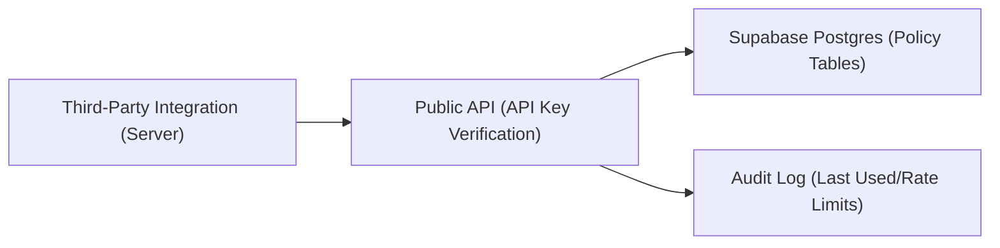

What is presented:
- **Integration API Key** (key id + secret).
What service validates:
- Hash lookup; check allowed origins (optional), IP allowlist (optional), expiry, rotation state.
Where authorization is enforced:
- API checks key’s allowed actions + resource constraints; DB enforces tenancy and resource access.

## 5.4 S2S calls

### A) Client-credentials-like pattern (service identity layer)
Supabase Auth is user-centric; for S2S you typically add a **Service Identity** issuer (or use a gateway) that mints service JWTs.

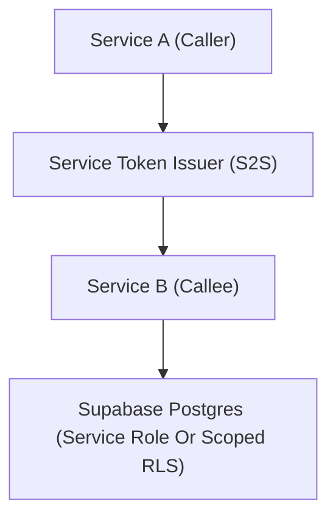

Token presented:
- **Service access token** (JWT) with `sub=service_a`, `aud=service_b`, scopes.
Validation:
- Service B validates STS issuer + audience + expiry.
Authorization:
- Service B enforces route-level scopes; Postgres access either:
  - uses **service role** with *manual* policy checks (high risk), or
  - uses **scoped RLS** via setting session variables and security definer functions (preferred for consistency).

### B) “On behalf of user” propagation (delegation/token exchange)
Use when Service A needs to call Service B while preserving the end-user context.

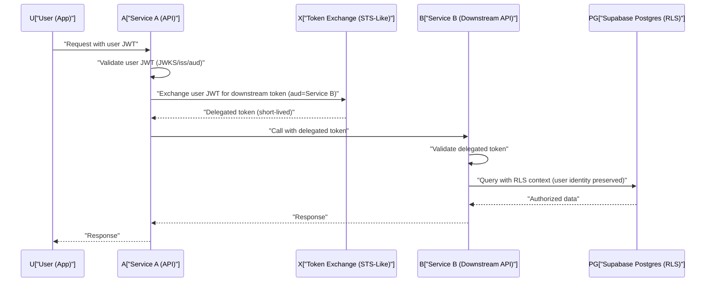

---

# 6) Credentials system design (PATs + API keys)

## 6.1 Data model (tables/fields)

### Core identity / tenancy
- `orgs`
  - `id (uuid pk)`
  - `name`
  - `created_at`
- `org_members`
  - `org_id`
  - `user_id`
  - `role (text)` (optional coarse role)
  - `created_at`
- `projects`
  - `id`
  - `org_id`
  - `name`
- `resources`
  - `id`
  - `project_id`
  - `type (text)` (e.g., "dataset", "dashboard", "bucket", "table")
  - `external_ref (text)` (maps to warehouse table, object prefix, etc.)

### Relationship-based authorization (ReBAC)
- `resource_bindings`
  - `principal_type (text)` (e.g., "user", "integration")
  - `principal_id (uuid)`
  - `resource_id (uuid)`
  - `actions (text[])` (e.g., ["read", "write", "admin"])
  - `conditions (jsonb)` (optional ABAC constraints like region)
  - `created_at`

### Credentials (PATs and API keys)
- `credentials`
  - `id (uuid pk)`
  - `credential_type (text)` -> "pat" | "api_key"
  - `owner_user_id (uuid, null)` (for PATs)
  - `integration_id (uuid, null)` (for API keys)
  - `org_id (uuid)` (tenant boundary)
  - `name (text)`
  - `key_prefix (text)` (non-secret identifier like "pat_abc123")
  - `secret_hash (text)` (argon2id/bcrypt/scrypt output)
  - `scopes (text[])` (actions like "read:datasets", "write:storage")
  - `resource_constraints (jsonb)` (e.g., `{"project_id": "...", "resource_id": "..."}`)
  - `expires_at (timestamptz, null)`
  - `rotated_at (timestamptz, null)`
  - `revoked_at (timestamptz, null)`
  - `last_used_at (timestamptz, null)`
  - `last_used_ip (inet, null)`
  - `created_at`

### Integrations
- `integrations`
  - `id`
  - `org_id`
  - `name`
  - `type (text)` (e.g., "superset", "airflow", "partner_x")
  - `created_at`

### Audit
- `audit_events`
  - `id`
  - `org_id`
  - `principal_type (text)` -> "user" | "integration"
  - `principal_id (uuid)`
  - `action (text)` -> "credential.create", "credential.revoke", "mfa.enable"
  - `resource_type (text)`
  - `resource_id (uuid, null)`
  - `metadata (jsonb)` (ip, ua, request_id, key_prefix)
  - `created_at`

## 6.2 Hash and verify keys (high-level)
- Generate secret once:
  - `secret = random(32..64 bytes)` -> encode (base64url)
  - show it **once** at creation
- Store only:
  - `key_prefix` (public identifier)
  - `secret_hash = argon2id(secret + server_side_pepper)`
- Verification:
  - parse prefix from presented token
  - fetch matching row(s) by `key_prefix`
  - constant-time verify hash
- Rotation:
  - create new credential, mark old as “rotating”
  - allow overlap window, then revoke old

## 6.3 Scoping model
- **Action scopes** (examples):
  - `read:projects`, `write:projects`
  - `read:warehouse`, `query:warehouse`
  - `read:storage`, `write:storage`
  - `admin:credentials`
- **Resource constraints**:
  - `org_id` always bound
  - optional `project_id`
  - optional `resource_id`
  - optional `resource_type`
- **Rules**:
  - PAT max TTL (e.g., 90 days) unless explicitly extended
  - API keys: prefer shorter TTL + rotation reminders
  - “Least privilege by default” in UI (preselect minimal scopes)

## 6.4 UX requirements: “Security & API Access” (professional-grade)

### Page structure
- **Login methods**
  - linked providers list (Google/Apple/email)
  - link/unlink flows with step-up auth
- **MFA**
  - status (enabled/disabled)
  - enroll button, manage factors
  - recovery codes regenerate (step-up)
- **Sessions**
  - active sessions list (device, location approximate, last active)
  - revoke session
  - “sign out of all devices”
- **Personal Access Tokens**
  - list: name, created, last used, expires, scopes summary
  - create PAT wizard:
    - name, expiry, scopes, resource constraints
    - show secret once + copy + download
  - revoke and rotate actions
- **Integration API Keys**
  - list per integration
  - IP allowlist (optional)
  - rotation workflow (create new -> test -> revoke old)

### UX guardrails
- Step-up re-auth for:
  - enabling/disabling MFA
  - creating/revealing recovery codes
  - creating PAT/API key
  - changing email/password
- Warnings:
  - show last-used, never-used, and “seen from new IP”
- Safe defaults:
  - short expirations
  - minimal scopes
  - explicit resource constraint selectors

## 6.5 Threat model highlights
- Leakage (logs, screenshots, client-side storage)
- Replay (stolen bearer token)
- Phishing (fake login, fake PAT creation)
- Credential stuffing (password reuse)
- Abuse:
  - rate limit by principal + IP
  - anomaly detection: impossible travel, sudden token use spikes
  - lockouts / step-up triggers

---

# 7) Authorization design (resource-based)

## 7.1 Recommended approach: RLS + policy tables (ReBAC-style)

### Design goals
- Single policy model used by:
  - Postgres tables (RLS)
  - Storage objects (via policies + metadata tables)
  - APIs (PEP checks + DB as source of truth)
  - Optional PDP for warehouse/external systems

### Canonical “can_access” shape
Create a relationship table like `resource_bindings` and evaluate:
- principal = user (`auth.uid()`) OR integration (`credential.integration_id`)
- resource = project/resource row
- action = read/write/admin

## 7.2 “Can principal do action on resource?” patterns

### Pattern A: Direct DB/RLS enforcement (preferred for Postgres data)
- Service passes user JWT to Postgres
- RLS ensures only allowed rows are visible
- Use security definer RPC for complex operations

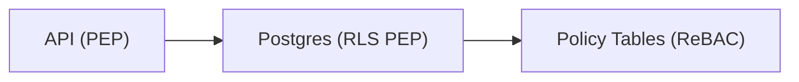

### Pattern B: PDP service (useful beyond Postgres)
- API asks PDP for decision + reason
- PDP reads policy tables from Postgres
- PDP returns allow/deny + constraints (like allowed prefixes)

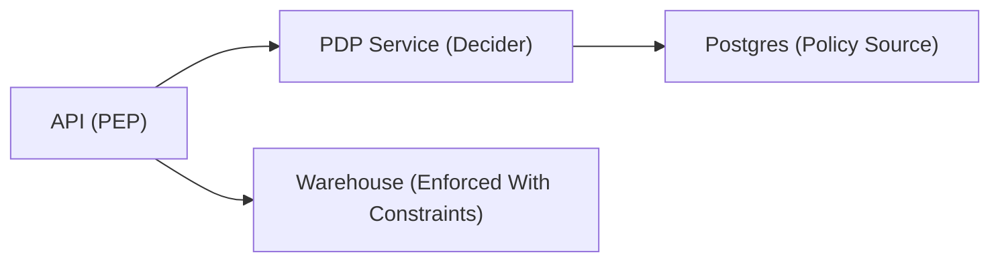

## 7.3 Worked examples

### Example 1: “User can read only their org’s data”
Data model:
- `org_members (org_id, user_id)`
- `projects (org_id, ...)`
RLS concept:
- A row is visible if `exists (org_members where user_id=auth.uid() and org_id=row.org_id)`

```mermaid
flowchart TB
  U["User (auth.uid())"] --> OM["org_members (user_id->org_id)"]
  OM --> P["projects (org_id)"]
  P --> D["domain_table (org_id)"]
```

### Example 2: “Integration key can read only project X and only read operations”
- Integration key resolves to `integration_id` and `org_id`
- Constraint: `resource_constraints.project_id = X`
- Allowed actions: `read:*`
Enforcement:
- API validates key, sets “principal context” for DB calls (via RPC), and DB checks policy bindings.

```mermaid
flowchart LR
  K["API Key (integration)"] --> API["API (PEP)"]
  API --> RPC["RPC (Security Definer)"]
  RPC --> PG["Postgres (Policy Tables/RLS)"]
  PG --> DATA["Project X Rows Only"]
```

---

# 8) Data-plane / warehouse bridging (must be included)

You asked the “Superset-like BI tool” question: user auth via Supabase Auth, but authorization enforced by object store (S3-like) or warehouse rules.

The core problem:
- Supabase Auth proves **who the user is**
- Warehouse/object store needs a way to enforce **what the user can access**
- You need **identity propagation** + **policy translation** from your Supabase policy model to data-plane enforcement.

Below are 3 practical approaches.

---

## Approach A) STS-like: service obtains short-lived data credentials after a policy decision

**When to use**
- Warehouse/object store supports issuing temporary credentials (or you can proxy)
- You want strong centralized control + short-lived access

**How it maps to Supabase**
- Use Supabase Auth identity (`sub`) + Postgres policy tables as the decision source
- Add an **STS service** that mints short-lived downstream credentials (S3 creds, warehouse session token)

### Sequence diagram

```mermaid
sequenceDiagram
  participant U as U["User (BI Tool)"]
  participant BI as BI["BI App (Superset-Like)"]
  participant SA as SA["Supabase Auth (User JWT)"]
  participant PDP as PDP["PDP (Policy Decision)"]
  participant PG as PG["Postgres (Policies/ReBAC)"]
  participant STS as STS["STS (Data Credentials)"]
  participant S3 as S3["Object Store (S3-Compatible)"]

  U->>BI: "Login via Supabase"
  BI->>SA: "Obtain user JWT"
  BI->>PDP: "Request access (action=read, resource=hive_table_X)"
  PDP->>PG: "Evaluate policy (user->org->resource)"
  PG-->>PDP: "Decision (allow) + constraints (prefixes)"
  PDP->>STS: "Mint short-lived S3 creds (scoped to prefixes)"
  STS-->>BI: "Temporary credentials (TTL=15m)"
  BI->>S3: "Read objects using temp creds"
  S3-->>BI: "Objects returned (enforced by S3)"
```

Extra components you need:
- PDP (optional but recommended here)
- STS (credential minting) integrated with your object store/warehouse auth model

---

## Approach B) Warehouse enforces with end-user identity (impersonation/delegation)

**When to use**
- Warehouse supports user principals (or external identity federation)
- You need per-user audit trails in the warehouse

**How it maps to Supabase**
- Supabase Auth remains the user login system
- Add a federation layer that maps Supabase identity (`sub`) to warehouse users/roles
- Use token exchange/delegation to produce a warehouse-accepted token

### Sequence diagram

```mermaid
sequenceDiagram
  participant U as U["User (App)"]
  participant APP as APP["BI App (Client)"]
  participant SA as SA["Supabase Auth (User JWT)"]
  participant X as X["Token Exchange (Delegation)"]
  participant WH as WH["Warehouse (User-Aware)"]
  participant PG as PG["Postgres (Policies/ReBAC)"]

  U->>APP: "Run query (table=hive_table_X)"
  APP->>SA: "Ensure user session (JWT valid)"
  APP->>X: "Exchange Supabase JWT for warehouse token"
  X->>PG: "Check policy (user can query hive_table_X)"
  PG-->>X: "Allow + mapped warehouse role"
  X-->>APP: "Warehouse token (aud=warehouse)"
  APP->>WH: "Submit query with user-delegated token"
  WH-->>APP: "Query results (warehouse enforces)"
```

Extra components you need:
- Token exchange service (STS-like) + mapping layer
- Warehouse configuration for external identity / role mapping

---

## Approach C) Capability tokens / pre-signed URLs (object-level)

**When to use**
- You want simple object access without provisioning identities in warehouse/object store
- Access is object/prefix-based (files, exports, parquet chunks)
- Great for download links and controlled sharing

**How it maps to Supabase**
- Use Postgres policy tables to decide
- Generate **pre-signed URLs** (or storage signed URLs) after decision
- Storage policies still apply for direct access paths

### Sequence diagram

```mermaid
sequenceDiagram
  participant U as U["User (App)"]
  participant APP as APP["App (API)"]
  participant SA as SA["Supabase Auth (JWT)"]
  participant PG as PG["Postgres (Policies/ReBAC)"]
  participant ST as ST["Storage (Signed URL)"]

  U->>APP: "Request download (resource=export_123)"
  APP->>SA: "Validate user JWT"
  APP->>PG: "Authorize via policy tables (can read export_123)"
  PG-->>APP: "Allow"
  APP->>ST: "Create signed URL (TTL=5m)"
  ST-->>APP: "Signed URL"
  APP-->>U: "Return signed URL"
  U->>ST: "Download using signed URL"
  ST-->>U: "Object bytes"
```

Extra components you need:
- Often none beyond your API (signing endpoint), depending on storage

---

# 9) Best practices + anti-patterns (Supabase-focused, practical)

## Best practices
- **Prefer httpOnly cookies for web sessions (SSR)** to reduce XSS token theft risk.
- **Validate JWTs consistently** in every service:
  - signature via JWKS
  - `iss` exact match
  - `aud` match per API
  - `exp` enforced
- **Use Postgres RLS as the default authorization enforcement** for data in Postgres.
- **Use short-lived access tokens** and rotate refresh tokens.
- **Step-up auth for sensitive actions** (MFA changes, PAT/API key creation, billing/admin).
- **Audit everything security-relevant** (credential lifecycle, policy changes, admin actions).
- **Rate limit** by:
  - principal (user/integration)
  - IP
  - endpoint sensitivity (login, token, key usage)

## Anti-patterns (and why)
- **Don’t store JWTs in localStorage**
  - localStorage is readable by XSS; stolen tokens enable replay.
  - Exception: some mobile/embedded contexts where secure storage exists and threat model is different—but treat as explicit decision.
- **Don’t use “service role” broadly in backend services**
  - It bypasses RLS and invites auth logic duplication and mistakes.
  - If you must, wrap access in security definer RPCs that re-apply policy checks.
- **Don’t treat JWTs as a database**
  - Avoid stuffing large authorization graphs into token claims.
  - Use tokens for identity + coarse scopes; keep fine-grained authorization in DB policy tables.
- **Avoid long-lived bearer tokens**
  - Prefer expirations, rotation, and revocation capability.
- **Avoid inconsistent issuer/audience across environments**
  - Prevent dev tokens from working in prod by strict validation.

## Next steps (brief)
- Multi-tenancy hardening: org/project isolation testing, RLS test harness
- Consent/scopes UX: clearer “what this key can do” summaries
- Key/token hierarchy: org-level integrations, project-level keys, per-resource grants
- Abuse prevention roadmap: anomaly detection, progressive challenges, device binding

---

## Appendix: “What to build” (implementation-oriented checklist)

### Build in Postgres (minimum viable platform)
- [ ] `orgs`, `org_members`, `projects`, `resources`
- [ ] `resource_bindings` (ReBAC)
- [ ] `credentials`, `integrations`
- [ ] `audit_events`
- [ ] RLS policies for:
  - org membership row visibility
  - project/resource visibility by org membership
  - credential listing restricted to owner/org admin
  - audit visibility restricted appropriately

### Build in services
- [ ] API middleware:
  - [ ] JWT validation (JWKS, `iss`, `aud`, `exp`)
  - [ ] PAT/API key verification (hash lookup, expiry, revocation)
  - [ ] rate limiting + audit logging
- [ ] Optional PDP:
  - [ ] “can(user, action, resource)” endpoint
  - [ ] explanation payload for UX (“denied because…”)
- [ ] Optional STS/token exchange for warehouse/object store bridging

### Build in UX
- [ ] Login and account linking flows with clear messaging
- [ ] MFA enrollment + challenge + recovery codes
- [ ] Sessions management + global logout best-effort
- [ ] PAT/API key creation wizard + one-time secret display + rotation UX

---

If you want, I can also provide (a) a concrete example schema + sample RLS policy pseudologic for `resource_bindings`, and (b) a recommended token/claim shape for user JWTs vs delegated S2S tokens—without duplicating authorization logic into claims.
