# Supabase B2C Identity Ecosystem (Late 2025/2026)

## Executive Summary

This document provides a comprehensive architectural blueprint for implementing a B2C identity ecosystem using [Supabase](#glossary) as the central authentication and authorization provider across multiple consumer-facing applications. It covers [Supabase Auth](#glossary)'s [JWT](#glossary)-based session management with short-lived access tokens and one-time-use [refresh tokens](#glossary), [RLS](#glossary) (Row-Level Security) for database authorization, multi-app [SSO](#glossary) patterns for both same-domain and cross-domain scenarios, and integration strategies for [MFA](#glossary), social login, [PATs](#glossary), API keys, and service-to-service authentication. The architecture emphasizes security best practices including [PKCE](#glossary), [HttpOnly cookies](#glossary), proper [JWKS](#glossary) rotation, and external service integration with policy decision points like [OpenFGA](#glossary). Key patterns include using [Auth Hooks](#glossary) for custom claims, implementing multi-tenancy through RLS policies, managing credentials securely via hashing and scoping, and bridging user identity to external data systems through [STS](#glossary) credential vending and pre-signed URLs.

**Context:** Startup scenario, greenfield infrastructure, building multiple consumer-facing applications (web & mobile) using [Supabase](#glossary) as identity provider. Assumes a single [Supabase](#glossary) project serving all apps. Focus on conceptual architecture and data-driven patterns (no code). [Supabase](#glossary) scope: authentication ([Auth](#glossary)/[GoTrue](#glossary)), authorization ([RLS](#glossary), policies), storage, and identity hooks. Target audience: senior engineers familiar with SaaS architectures but not deep in auth/NB details.

---

## 1. Supabase Auth Architecture (Circa 2025/26)

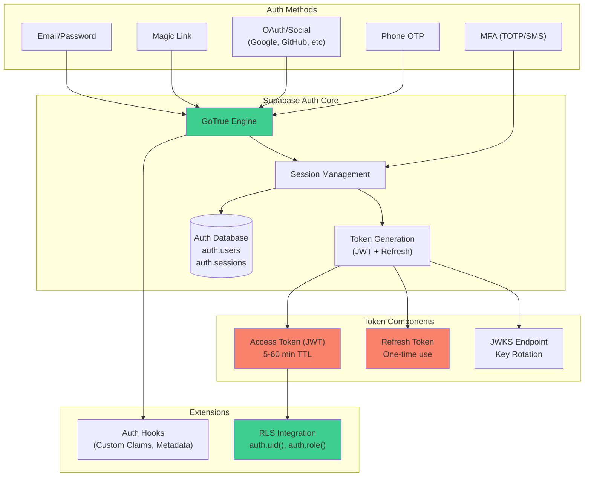

[Supabase Auth](#glossary) ([GoTrue](#glossary)-based) provides session management with short-lived [JWT](#glossary) [access tokens](#glossary) and one-time-use [refresh tokens](#glossary) [User sessions │ Supabase Docs](https://supabase.com/docs/guides/auth/sessions#:~:text=and%20a%20refresh%20token%20which,is%20a%20unique%20string). By default sessions are "indefinite" (persist across browser sessions), but [access tokens](#glossary) expire (typically 5–60 minutes) [o^User sessions │ Supabase Docs](https://supabase.com/docs/guides/auth/sessions#:~:text=and%20a%20refresh%20token%20which,is%20a%20unique%20string). A [refresh token](#glossary) can be exchanged once for a new access/refresh pair, enabling long-lived sessions [o^User sessions │ Supabase Docs](https://supabase.com/docs/guides/auth/sessions#:~:text=and%20a%20refresh%20token%20which,is%20a%20unique%20string). Standard auth flows (email/password, magic link, [OAuth](#glossary)/Social, phone OTP) are built-in. [Supabase](#glossary) supports social login via [OAuth](#glossary) providers (Google, Facebook, Twitter, GitHub, etc.) out‐of‐the‐box [o^Social login │ Supabase Features](https://supabase.com/features/social-login#:~:text=Key%20features) [o^Social Login │ Supabase Docs](https://supabase.com/docs/guides/auth/social-login#:~:text=You%20can%20use%20the%20provider,on%20behalf%20of%20your%20user). When using social login, [Supabase](#glossary) returns *[provider tokens](#glossary)* (e.g. Google [OAuth](#glossary) token) which can be used to call the third-party API on behalf of the user – but only your app manages refreshing those tokens, as [Supabase](#glossary) does not auto-refresh [provider tokens](#glossary) [o^Social Login │ Supabase Docs](https://supabase.com/docs/guides/auth/social-login#:~:text=You%20can%20use%20the%20provider,on%20behalf%20of%20your%20user). [Multi-factor authentication](#glossary) ([MFA](#glossary)) ([TOTP](#glossary) app or SMS) is supported. [Supabase Auth](#glossary) can enforce [MFA](#glossary) by adding an "Authenticator Assurance Level" ([AAL](#glossary)) claim in the [JWT](#glossary): sessions with second factor yield `aal2`, otherwise `aal1` [o^Multi–Factor Authentication │ Supabase Docs](https://supabase.com/docs/guides/auth/auth-mfa#:~:text=1.%20Assurance%20Level%201%3A%20,Time%20Password%20code).

[Supabase Auth](#glossary) is **not** a full-featured [OAuth2](#glossary) authorization server in the legacy sense. Out of the box it only implements [OAuth2](#glossary) **authorization code (with [PKCE](#glossary))** and **refresh** grant types [o^OAuth 2.1 Flows │ Supabase Docs](https://supabase.com/docs/guides/auth/oauth-server/oauth-flows#:~:text=Supabase%20Auth%20supports%20two%20OAuth,1%20grant%20types). (It does *not* support client_credentials, password grant, or implicit/hybrid flows.) Only with the new [OAuth 2.1](#glossary) Server mode (public beta Q4 2025) does it become a general [OAuth](#glossary)/[OIDC](#glossary) provider: enabling it turns your project into an identity provider for third-party apps (issuing codes, tokens, ID tokens, userinfo, etc.) [o^OAuth 2.1 Server │ Supabase Docs](https://supabase.com/docs/guides/auth/oauth-server#:~:text=,third%20parties%20to%20validate%20tokens). In any case, [Supabase](#glossary) focuses on end-user login, not on specialized flows like token introspection; its offering is opinionated (e.g. no password grant, [PKCE](#glossary) mandatory) for modern security [o^OAuth 2.1 Flows │ Supabase Docs](https://supabase.com/docs/guides/auth/oauth-server/oauth-flows#:~:text=Supabase%20Auth%20supports%20two%20OAuth,1%20grant%20types) [o^OAuth 2.1 Server │ Supabase Docs](https://supabase.com/docs/guides/auth/oauth-server#:~:text=,third%20parties%20to%20validate%20tokens).

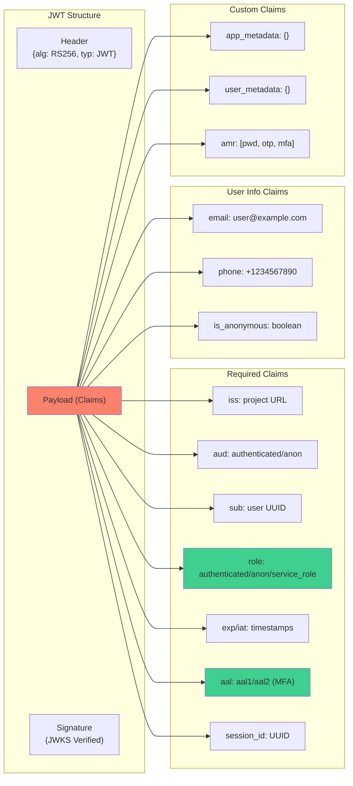

[JWTs](#glossary) from [Supabase](#glossary) have a well-defined format [o^JWT Claims Reference │ Supabase Docs](https://supabase.com/docs/guides/auth/jwt-fields#:~:text=These%20claims%20are%20always%20present,JWTs%20and%20cannot%20be%20removed) [o^JWT Claims Reference │ Supabase Docs](https://supabase.com/docs/guides/auth/jwt-fields#:~:text=%60,%60false). Required claims include `iss` (issuer, your project URL), `aud` (usually `"authenticated"` or `"anon"` for anonymous users [o^JWT Claims Reference │ Supabase Docs](https://supabase.com/docs/guides/auth/jwt-fields#:~:text=%60iss%60%20%20,UUID%29)), `exp`/`iat` (expiry/issued timestamps), `sub` (user UUID), `role` (`authenticated`, `anon`, or `service_role`), `aal` (auth level), `session_id` (UUID linking to `auth.sessions`), and user info like `email`, `phone`, and `is_anonymous` [o^JWT Claims Reference │ Supabase Docs](https://supabase.com/docs/guides/auth/jwt-fields#:~:text=%60iss%60%20%20,426614174000) [o^JWT Claims Reference │ Supabase Docs](https://supabase.com/docs/guides/auth/jwt-fields#:~:text=%60,%60false). Optional claims include `app_metadata` and `user_metadata` (custom JSONs) and `amr` (array of authentication methods). These claims are used in [RLS](#glossary) policies (e.g. `auth.uid()` returns `sub` [o^Row Level Security │ Supabase Docs](https://supabase.com/docs/learn/auth-deep-dive/auth-row-level-security#:~:text=RLS%20is%20a%20Postgres%20primitive,party%20tooling)) and to enforce role-based rules. A [Supabase](#glossary) [access token](#glossary) is signed by either a symmetric secret or (newer) an asymmetric signing key (RSA/ECDSA) to allow local verification via the [JWKS](#glossary) endpoint [o^JWT Signing Keys │ Supabase Docs](https://supabase.com/docs/guides/auth/signing-keys#:~:text=When%20a%20JWT%20is%20issued,the%20new%20Signing%20keys%20system) [o^JWT Signing Keys │ Supabase Docs](https://supabase.com/docs/guides/auth/signing-keys#:~:text=GET%20https%3A%2F%2Fproject). The [JWKS](#glossary) endpoint is at `https://<project>.supabase.co/auth/v1/.well-known/jwks.json` [o^JWT Signing Keys │ Supabase Docs](https://supabase.com/docs/guides/auth/signing-keys#:~:text=GET%20https%3A%2F%2Fproject). Note [Supabase](#glossary) caches [JWKS](#glossary) keys on CDN (~10 min) and libraries cache for 10min, so rollovers take a short time to propagate [o^JWT Signing Keys │ Supabase Docs](https://supabase.com/docs/guides/auth/signing-keys#:~:text=This%20discovery%20endpoint%20is%20cached,on%20the%20Supabase%20client%20library).

[Supabase](#glossary) supports "[Auth Hooks](#glossary)" to customize flows [o^Auth Hooks │ Supabase Docs](https://supabase.com/docs/guides/auth/auth-hooks#:~:text=Hooks%20help%20you%3A). For example, a **Custom [Access Token](#glossary)** hook can inject additional claims into each [JWT](#glossary) [o^Auth Hooks │ Supabase Docs](https://supabase.com/docs/guides/auth/auth-hooks#:~:text=Send%20SMS%20%20,the%20user%20to%20keep%20trying). Hooks can also send SMS/email via custom providers, add metadata on signup, or implement custom [MFA](#glossary)/password checks [o^Auth Hooks │ Supabase Docs](https://supabase.com/docs/guides/auth/auth-hooks#:~:text=Hooks%20help%20you%3A). Hooks are implemented either as HTTP endpoints (external service) or as secure Postgres functions (called by `supabase_auth_admin` role) [o^Auth Hooks │ Supabase Docs](https://supabase.com/docs/guides/auth/auth-hooks#:~:text=Postgres%20FunctionHTTP%20Endpoint) [o^Auth Hooks │ Supabase Docs](https://supabase.com/docs/guides/auth/auth-hooks#:~:text=message%20content%20and%20SMS%20Provider,the%20user%20to%20keep%20trying). This extensibility lets you enforce, for example, business rules during signup or add fine-grained permissions in tokens without modifying [Supabase](#glossary) core.

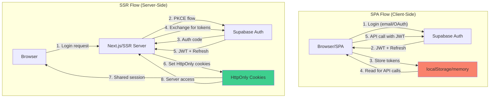

_**Server-Side vs [SPA](#glossary):**_ In client-side ([SPA](#glossary)/mobile) flows, [Supabase](#glossary) stores the access & [refresh tokens](#glossary) in browser memory/localStorage by default [o^Advanced guide │ Supabase Docs](https://supabase.com/docs/guides/auth/server-side/advanced-guide#:~:text=The%20default%20behavior%20if%20you%27re,app%20code%20in%20the%20server). This enables easy API calls but means tokens are not automatically sent to your backend. For server-rendered or multi-page apps ([SSR](#glossary)), [Supabase](#glossary) recommends using **[PKCE](#glossary) flow** and storing tokens in secure, [HttpOnly cookies](#glossary) so both server and client can share session [o^Advanced guide │ Supabase Docs](https://supabase.com/docs/guides/auth/server-side/advanced-guide#:~:text=The%20default%20behavior%20if%20you%27re,app%20code%20in%20the%20server) [o^Advanced guide │ Supabase Docs](https://supabase.com/docs/guides/auth/server-side/advanced-guide#:~:text=To%20maintain%20the%20session%2C%20these,client%20libraries%20provide%20a%20customizable). In other words, [SPAs](#glossary) handle auth entirely in-browser (often using `supabase-js`), while [SSR](#glossary) apps (e.g. Next.js) typically initiate login with [PKCE](#glossary) and sync tokens via cookies to maintain sessions on server and client [o^Advanced guide │ Supabase Docs](https://supabase.com/docs/guides/auth/server-side/advanced-guide#:~:text=The%20default%20behavior%20if%20you%27re,app%20code%20in%20the%20server) [o^Advanced guide │ Supabase Docs](https://supabase.com/docs/guides/auth/server-side/advanced-guide#:~:text=To%20maintain%20the%20session%2C%20these,client%20libraries%20provide%20a%20customizable). (The `@supabase/ssr` library defaults to [PKCE](#glossary) and cookie-based storage.) The key trade‐off: localStorage is convenient but vulnerable to [XSS](#glossary); cookies can be made [HttpOnly](#glossary) but need [CSRF](#glossary) safeguards. [Supabase](#glossary) docs note that the browser can sign out or refresh, updating cookies via ISR, so claim checks (`getClaims()`) only validate signature/expiration but not revocation on server [o^Advanced guide │ Supabase Docs](https://supabase.com/docs/guides/auth/server-side/advanced-guide#:~:text=be%20passed%20around%20to%20different,maintain%20a%20browser%20session%20anyway). 

**Key Points:** Supabase Auth = user-centric login system (sessions with JWT+refresh, built-in social OAuth and MFA) [o^User sessions │ Supabase Docs](https://supabase.com/docs/guides/auth/sessions#:~:text=and%20a%20refresh%20token%20which,is%20a%20unique%20string) [o^Social Login │ Supabase Docs](https://supabase.com/docs/guides/auth/social-login#:~:text=You%20can%20use%20the%20provider,on%20behalf%20of%20your%20user). It is *not* a generic OAuth server by default (no client_credentials, no introspection). It now offers OAuth2.1/OIDC provider features in beta, with discovery and userinfo endpoints [o^OAuth 2.1 Server │ Supabase Docs](https://supabase.com/docs/guides/auth/oauth-server#:~:text=,third%20parties%20to%20validate%20tokens). Tokens include `sub`, `role`, `session_id`, `aal` etc [o^JWT Claims Reference │ Supabase Docs](https://supabase.com/docs/guides/auth/jwt-fields#:~:text=%60iss%60%20%20,426614174000) and are signed and rotated via JWKS [o^JWT Signing Keys │ Supabase Docs](https://supabase.com/docs/guides/auth/signing-keys#:~:text=When%20a%20JWT%20is%20issued,the%20new%20Signing%20keys%20system) [o^JWT Signing Keys │ Supabase Docs](https://supabase.com/docs/guides/auth/signing-keys#:~:text=GET%20https%3A%2F%2Fproject). Auth flows differ for SPA vs SSR: PKCE + cookies vs implicit local tokens [o^Advanced guide │ Supabase Docs](https://supabase.com/docs/guides/auth/server-side/advanced-guide#:~:text=The%20default%20behavior%20if%20you%27re,app%20code%20in%20the%20server). Developers can inject custom logic via Auth Hooks (e.g. add claims) [o^Auth Hooks │ Supabase Docs](https://supabase.com/docs/guides/auth/auth-hooks#:~:text=Hooks%20help%20you%3A).  

---

## 2. Multi-App SSO Patterns with Supabase

**Context:** Multiple B2C apps (web/mobile) share the same Supabase Auth project. We want users to sign in once and access all apps (single sign-on). Two main scenarios: (a) **Subdomains of one corporate domain** (e.g. `app1.example.com`, `app2.example.com`), and (b) **Different domains** (e.g. `app1.com`, `app2.net`). Both use the same Supabase project and DB.

- **Same Parent Domain (Subdomains):** The simplest SSO is to use a common top-level cookie domain. When a user logs in on one subdomain, the login event sets secure cookies (access & refresh) with `Domain=example.com` and `SameSite=Lax` so that sibling apps can read them [o^Supabase auth for same session on multiple sub domains · supabase · Discussion #5742 · GitHub](https://github.com/orgs/supabase/discussions/5742#:~:text=supabase.auth.onAuthStateChange%28%28event%2C%20session%29%20%3D,100%20years%2C%20never%20expires) [o^Supabase auth for same session on multiple sub domains · supabase · Discussion #5742 · GitHub](https://github.com/orgs/supabase/discussions/5742#:~:text=the%20MDN%20documentation%3A). For example, on signin we set:
  ```js
  document.cookie = `sb-access-token=${session.access_token}; Domain=example.com; path=/; max-age=...; SameSite=Lax; Secure`
  ```
  (likewise for refresh). Then any app under `*.example.com` can retrieve the cookie and call `supabase.auth.setSession()` to use that token [o^Supabase auth for same session on multiple sub domains · supabase · Discussion #5742 · GitHub](https://github.com/orgs/supabase/discussions/5742#:~:text=supabase.auth.onAuthStateChange%28%28event%2C%20session%29%20%3D,100%20years%2C%20never%20expires) [o^Supabase auth for same session on multiple sub domains · supabase · Discussion #5742 · GitHub](https://github.com/orgs/supabase/discussions/5742#:~:text=const%20cookies%20%3D%20document.cookie.split%28%2F%5Cs,token). The Supabase client can be configured with `cookieOptions.domain = "example.com"` to do this automatically. This achieves seamless SSO: signing into `auth.example.com` issues cookies that are valid on `app1.example.com` and `app2.example.com`. Ensure cookies use a long `Max-Age` for persistence (some examples use 100-year max, effectively never expiring) [o^Supabase auth for same session on multiple sub domains · supabase · Discussion #5742 · GitHub](https://github.com/orgs/supabase/discussions/5742#:~:text=,age%3D%24%7BmaxAge%7D%3B%20SameSite%3DLax%3B%20secure%60%20%7D). Note: tabs do not auto-notify each other of sign-out events, so you may need client-side logic to detect and clear cookies on logout [o^Supabase auth for same session on multiple sub domains · supabase · Discussion #5742 · GitHub](https://github.com/orgs/supabase/discussions/5742#:~:text=supabase.auth.onAuthStateChange%28%28event%2C%20session%29%20%3D,100%20years%2C%20never%20expires) [o^Supabase auth for same session on multiple sub domains · supabase · Discussion #5742 · GitHub](https://github.com/orgs/supabase/discussions/5742#:~:text=If%20you%20need%20multiple%20domains%2C,function).

  ```mermaid
  sequenceDiagram
      participant App1 as "App1<br/>(app1.example.com)"
      participant Auth as "Supabase Auth"
      participant CookieStore as "Cookie Store<br/>(Domain=example.com)"
      participant App2 as "App2<br/>(app2.example.com)"
      Note over App1,Auth: Login on app1.example.com
      App1->>Auth: User credentials or OAuth flow
      Auth-->>App1: "Issues JWT & Refresh"
      App1->>CookieStore: "Set cookies Domain=example.com"
      Note over CookieStore: Cookies accessible to *.example.com
      Note over App2,Auth: Later, user opens app2.example.com
      App2->>CookieStore: Reads existing cookies
      CookieStore-->>App2: "Returns JWT & refresh from example.com"
      App2->>Auth: "supabase.auth.setSession(tokens) (silent SSO)"
      Auth-->>App2: Session active for user
  ```

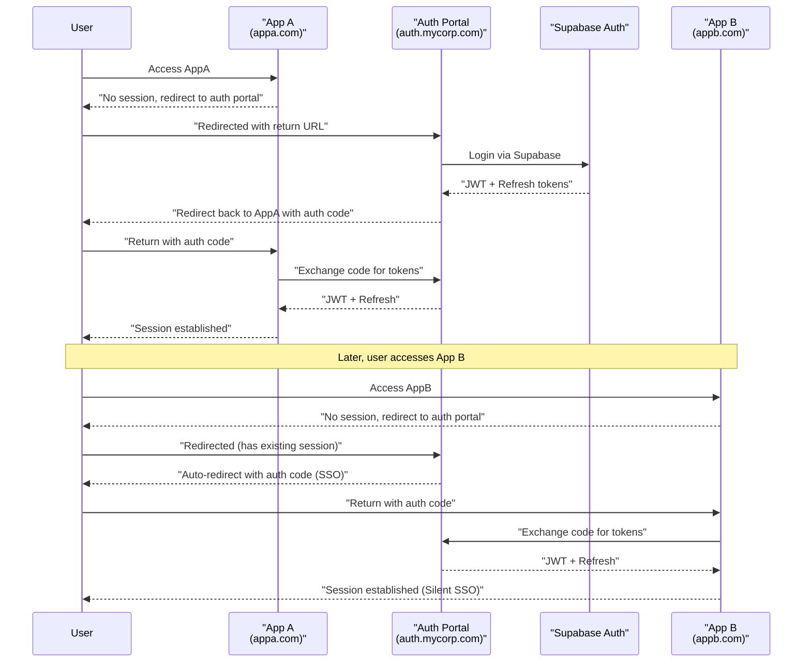

- **Different Domains:** Browsers do **not** share cookies across different domains. To [SSO](#glossary) across domains, we must use explicit redirect flows or centralized login. One common pattern is to treat one domain (e.g. `auth.mycorp.com`) as the “identity portal”. Others (apps) redirect users there for login, then return with tokens. For example, App A on `appA.com` detects no session, so it redirects the user to a central login `auth.mycorp.com/login`. The user signs in (via Supabase auth UI there), then the auth service redirects back to App A with a short-lived JWT or auth code. App A exchanges it for tokens. Other apps (appB.com) similarly use the central login or accept the same token if it carries an audience for them. Essentially, each app becomes an OAuth client of the central site. 

  A variant is using Supabase’s new OAuth2.1 server mode: each app registers as an OAuth client (with its redirect URI). The user logs in via Supabase’s `/authorize` endpoint (redirecting through the project’s OAuth consent UI), and each app can get tokens for its session [o^OAuth 2.1 Flows │ Supabase Docs](https://supabase.com/docs/guides/auth/oauth-server/oauth-flows#:~:text=1.%20Client%20initiates%20authorization%20,refresh%20token%2C%20and%20ID%20token) [o^OAuth 2.1 Server │ Supabase Docs](https://supabase.com/docs/guides/auth/oauth-server#:~:text=,third%20parties%20to%20validate%20tokens). This is effectively making “Sign in with MyApp” possible. In this mode, shared SSO works via standard OAuth/OIDC flows (see Section 10).

  **Limitations:** There is no magic cookie to share across domains, so full cross-domain SSO requires re-login via redirect. Token exchange patterns can help: one app might use a user’s token to call another app’s backend, but ideally each app should verify via Supabase or have its own session. Complex solutions (postMessage between windows, shared storage, etc.) are brittle. 

- **Token Exchange Patterns:** If Supabase is the identity source, apps can exchange user tokens among themselves. For example, App A could obtain an access token (JWT) for user and then give it to App B by embedding it in a redirect URL (not recommended for security) or via back-end transfer. Instead, it's better to use OAuth flows or silent refresh. Supabase’s token endpoint could, in principle, be used to implement an on-behalf-of (RFC 8693) exchange: App B passes the user’s existing token and requests a new token for its own service scopes. Supabase does not natively support RFC 8693, so this would have to be custom. More often, services simply trust the same JWT, since Supabase tokens include `aud` and can be rolled by different client IDs. 

**Key Insight:** Same-domain SSO works via shared cookies (set Domain at parent) [o^Supabase auth for same session on multiple sub domains · supabase · Discussion #5742 · GitHub](https://github.com/orgs/supabase/discussions/5742#:~:text=supabase.auth.onAuthStateChange%28%28event%2C%20session%29%20%3D,100%20years%2C%20never%20expires). Different-domain SSO requires explicit OAuth/OIDC flows or a central login portal (Supabase OAuth server). Token sharing across domains is not automatic; use standard redirect flows where each app uses the Supabase project as its OIDC auth provider [o^OAuth 2.1 Server │ Supabase Docs](https://supabase.com/docs/guides/auth/oauth-server#:~:text=,third%20parties%20to%20validate%20tokens).

---

## 3. Supabase RLS for Authorization

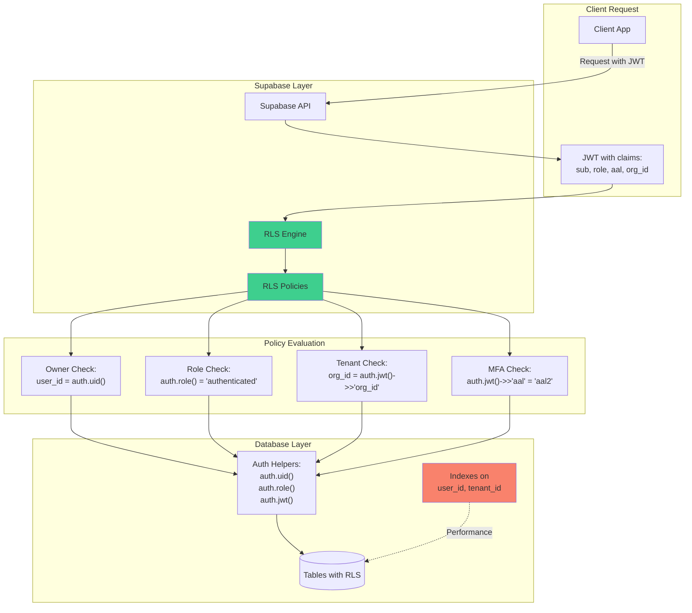

**Context:** We use Postgres [Row-Level Security](#glossary) ([RLS](#glossary)) as the core authorization mechanism. All tables exposed via Supabase API (public schema) must have RLS enabled and policies. We assume a single database, multi-tenant (users belong to orgs/projects), B2C context (each user sees only their own data).

Supabase RLS ties in directly with Auth claims [o^JWT Claims Reference │ Supabase Docs](https://supabase.com/docs/guides/auth/jwt-fields#:~:text=%60iss%60%20%20,426614174000). The `auth.uid()` helper (returns the `sub` from JWT) lets policies check ownership. E.g. a common policy is `ENABLE ROW LEVEL SECURITY; CREATE POLICY ... FOR SELECT USING (auth.uid() = owner_id)` to restrict rows to the owning user [o^Row Level Security │ Supabase Docs](https://supabase.com/docs/learn/auth-deep-dive/auth-row-level-security#:~:text=RLS%20is%20a%20Postgres%20primitive,party%20tooling). Similarly, `auth.jwt()->>'aal' = 'aal2'` could require MFA before certain rows. Remember to include `TO authenticated` (or `anon`) in policies to guard roles [o^Row Level Security │ Supabase Docs](https://supabase.com/docs/learn/auth-deep-dive/auth-row-level-security#:~:text=11). **Design tip:** always index columns used in RLS conditions (e.g. `user_id`, `tenant_id`). Supabase docs note indexing a `user_id` column yielded ~100× speedup on a 100K-row table [o^Supabase Docs │ Troubleshooting │ RLS Performance and Best Practices](https://supabase.com/docs/guides/troubleshooting/rls-performance-and-best-practices-Z5Jjwv#:~:text=,primary%20keys%20or%20unique%20already). If a `users` col is frequently joined or checked, add a btree index. Also, if multiple predicates or joins are needed, consider `SECURITY DEFINER` functions to encapsulate them, to avoid repeated RLS eval (see Performance below) [o^Supabase Docs │ Troubleshooting │ RLS Performance and Best Practices](https://supabase.com/docs/guides/troubleshooting/rls-performance-and-best-practices-Z5Jjwv#:~:text=,bypass%20their%20RLS%20when%20possible).

**[Multi-Tenancy](#glossary):** Include tenant/organization columns on tables and add them to [JWT](#glossary) claims via custom claims or link `auth.uid()`→user profile join. For example, a users table might have `org_id`, and on login an `org_id` claim is added (via a Custom [Access Token](#glossary) hook). Then policies check `(auth.jwt() ->> 'org_id') = org_id_column`. Alternately use linking tables (user→org role table) and functions to check membership. The key is a stable identifier in the token (or via function) to scope data. (See AntStack and LOCKIN blogs on multi-tenant [RLS](#glossary) for examples.) Complex hierarchies (orgs→projects) mean policies may become nested; avoid overly complex SQL in policies. If needed, introduce an external policy system (see [PDP](#glossary) below).

**Performance:** RLS adds a WHERE clause to every query. For simple equality checks (`auth.uid() = col`), performance is fine with proper indexes [o^Supabase Docs │ Troubleshooting │ RLS Performance and Best Practices](https://supabase.com/docs/guides/troubleshooting/rls-performance-and-best-practices-Z5Jjwv#:~:text=,primary%20keys%20or%20unique%20already). But if policies involve joins or heavy functions, queries slow down. Supabase’s own guide recommends: index your policy columns [o^Supabase Docs │ Troubleshooting │ RLS Performance and Best Practices](https://supabase.com/docs/guides/troubleshooting/rls-performance-and-best-practices-Z5Jjwv#:~:text=,primary%20keys%20or%20unique%20already), push filters to queries (`.eq('user_id', currentUserId)` in Supabase client) [o^Supabase Docs │ Troubleshooting │ RLS Performance and Best Practices](https://supabase.com/docs/guides/troubleshooting/rls-performance-and-best-practices-Z5Jjwv#:~:text=,filtering%20but%20only%20for%20security), and use `SECURITY DEFINER` functions to avoid repeated join checks [o^Supabase Docs │ Troubleshooting │ RLS Performance and Best Practices](https://supabase.com/docs/guides/troubleshooting/rls-performance-and-best-practices-Z5Jjwv#:~:text=,bypass%20their%20RLS%20when%20possible). For example, instead of `EXISTS (SELECT 1 FROM roles WHERE auth.uid()=user_id)`, do `SELECT has_role()` where `has_role()` is definer so its result is cached [o^Supabase Docs │ Troubleshooting │ RLS Performance and Best Practices](https://supabase.com/docs/guides/troubleshooting/rls-performance-and-best-practices-Z5Jjwv#:~:text=,bypass%20their%20RLS%20when%20possible). In table scans or limit/offset queries, RLS still filters all rows; measure via `EXPLAIN ANALYZE`. Supabase doc even provides a test showing a policy with an indexed `user_id` ran sub-millisecond vs ~171ms without an index [o^Supabase Docs │ Troubleshooting │ RLS Performance and Best Practices](https://supabase.com/docs/guides/troubleshooting/rls-performance-and-best-practices-Z5Jjwv#:~:text=,primary%20keys%20or%20unique%20already). In summary: design RLS conditions to use indexed columns, avoid OR-chains if possible, and offload complex logic to functions or external systems.

**Enough vs External PDP:** RLS is powerful (“defense in depth” [o^Row Level Security │ Supabase Docs](https://supabase.com/docs/learn/auth-deep-dive/auth-row-level-security#:~:text=RLS%20is%20a%20Postgres%20primitive,party%20tooling)) and often sufficient for typical row-filtering cases (users see their own records, roles, etc.). However, RLS is stateless SQL – it can’t easily express complex policies like “Team A’s users can view objects X or Y, except if project in lockdown,” or context-based policies across services. For very dynamic or graph-based permissions, consider an external Policy Decision Point (PDP). Services like OpenFGA (Zanzibar model) or Permit.io can encode complex relations and answer “Can user U perform action P on resource R?” at runtime. You could integrate these by calling them from your backend or DB (e.g. a PL/pgSQL function calling an external API). Example: before letting a row be returned, you might add a `USING (openfga_check(auth.uid(), table.id))` helper function. Or use OpenFGA to pre-compute group memberships and join via tables. In short, use RLS for straightforward ownership/role checks, and add an external PDP when you need centralized, dynamic policies (especially for cross-tenant or feature-flag style logic).

**Storage Object Policies:** Supabase Storage uses a policy mechanism similar to RLS. You enable RLS on `storage.objects` table and write policies for each CRUD action [o^Storage Access Control │ Supabase Docs](https://supabase.com/docs/guides/storage/security/access-control#:~:text=Access%20policies). For instance, to allow file uploads only to a specific bucket by logged-in users: 
```sql
CREATE POLICY "Allow upload" ON storage.objects 
  FOR INSERT TO authenticated 
  WITH CHECK ( bucket_id = 'my_bucket' AND owner_id = auth.uid() );
``` 
 [o^Storage Access Control │ Supabase Docs](https://supabase.com/docs/guides/storage/security/access-control#:~:text=An%20easy%20way%20to%20get,policy) [o^Storage Access Control │ Supabase Docs](https://supabase.com/docs/guides/storage/security/access-control#:~:text=Allow%20a%20user%20to%20access,uploaded%20by%20the%20same%20user). To allow downloads only to the owning user:
```sql
CREATE POLICY "User download" ON storage.objects 
  FOR SELECT TO authenticated 
  USING (auth.uid() = owner_id);
``` 
This uses helper functions like `storage.foldername()` to parse path [o^Storage Access Control │ Supabase Docs](https://supabase.com/docs/guides/storage/security/access-control#:~:text=bucket_id%20%3D%20%27my_bucket_id%27%20and) [o^Storage Access Control │ Supabase Docs](https://supabase.com/docs/guides/storage/security/access-control#:~:text=Allow%20a%20user%20to%20access,uploaded%20by%20the%20same%20user). Note: by default no access is allowed until policies cover all operations [o^Storage Access Control │ Supabase Docs](https://supabase.com/docs/guides/storage/security/access-control#:~:text=Access%20policies). Storage policies ensure object-level control in sync with your data policies.

_**Performance note:**_ According to Supabase, poorly-indexed RLS can *massively* slow queries [o^Supabase Docs │ Troubleshooting │ RLS Performance and Best Practices](https://supabase.com/docs/guides/troubleshooting/rls-performance-and-best-practices-Z5Jjwv#:~:text=Although%20most%20of%20the%20time,so%20they%20are%20impacted%20too). To test, run queries with and without RLS enabled in a dev DB. Use `EXPLAIN ANALYZE` to spot bottlenecks [o^Supabase Docs │ Troubleshooting │ RLS Performance and Best Practices](https://supabase.com/docs/guides/troubleshooting/rls-performance-and-best-practices-Z5Jjwv#:~:text=For%20very%20slow%20queries%2C%20or,if%20in%20a%20secure%20environment). Supabase suggests creating a service-role client for heavy reporting (bypasses RLS) or exporting data if needed.

**Key Points:** RLS is the primary guard on database records [o^Row Level Security │ Supabase Docs](https://supabase.com/docs/learn/auth-deep-dive/auth-row-level-security#:~:text=Row%20Level%20Security%20in%20Supabase). For multi-tenant apps, include tenant/org IDs in tokens and policies. Always enable RLS on public tables, and write policies linking `auth.uid()` (and other claims) to your data [o^Row Level Security │ Supabase Docs](https://supabase.com/docs/learn/auth-deep-dive/auth-row-level-security#:~:text=Row%20Level%20Security%20in%20Supabase) [o^JWT Claims Reference │ Supabase Docs](https://supabase.com/docs/guides/auth/jwt-fields#:~:text=%60iss%60%20%20,426614174000). Optimize policies with indexes on RLS columns (often user/tenant IDs) to avoid slow scans [o^Supabase Docs │ Troubleshooting │ RLS Performance and Best Practices](https://supabase.com/docs/guides/troubleshooting/rls-performance-and-best-practices-Z5Jjwv#:~:text=,primary%20keys%20or%20unique%20already). If policy complexity grows (many joins or conditionals), consider offloading to an external PDP (OpenFGA, Permit.io, etc.). And don’t forget Storage: object access is controlled by RLS on `storage.objects` [o^Storage Access Control │ Supabase Docs](https://supabase.com/docs/guides/storage/security/access-control#:~:text=Access%20policies).

---

## 4. Credentials System Design (PATs & API Keys)

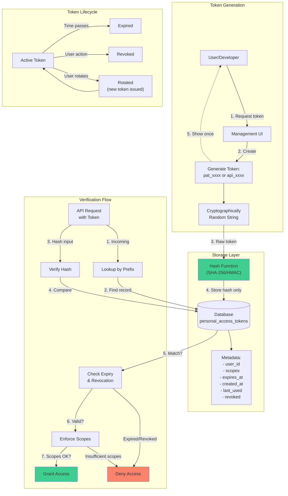

**Context:** We need long-lived tokens for automation: [Personal Access Tokens](#glossary) ([PATs](#glossary)) for end-users/developers, and [API keys](#glossary) for service integrations. These are akin to floating "passwords" which must be securely managed (hashed, rotated, scoped).

- **PATs (Personal Access Tokens):** Typically issued to a user for them to call APIs non-interactively (e.g. CLI, scripts). A PAT should be a random string (e.g. 128-bit or larger) with a short, recognizable prefix (like `pat_` or no prefix). Store **only a hash** (e.g. SHA-256 or better) of the token in the database (in a `personal_access_tokens` table). This way if the DB leaks, the raw token cannot be retrieved [o^Create API key – Unkey Docs](https://www.unkey.com/docs/api-reference/v1/keys/create-api-key#:~:text=,16T17%3A16%3A37.161Z%22%20%7D%2C%20%22roles%22%3A). The table can have columns: `id, user_id, name, hashed_token, created_at, expires_at, revoked, scopes(JSON)`, etc. When issuing a PAT, show the full token once to user; thereafter only the prefix and partial repr are visible.

  **Scopes & Constraints:** Model scopes as either a simple set of flags/strings or relations in a JSON/array column, or via join tables. For example, scopes might include `["read", "write"]` and resource constraints like `project:12345`. Enforce scopes in your API logic (not automatically done by Supabase). You can add RLS policies on your resource tables that check the token’s scopes (which you can include by middleware), or simply have your backend interpret the scopes. RLS could use a table mapping token_id→allowed records if needed. 

  **Rotation & Expiry:** Issued tokens should have an expiration (e.g. 90 days) and the ability to revoke. Store `expires_at`, and query that on each use. To rotate, just issue a new token and mark the old one revoked (set `revoked=true`). Consider a “last used” timestamp for auditing. Since Supabase Auth doesn’t manage PATs, implement these in a custom table with RLS so that each user sees only their own tokens (policy: `user_id = auth.uid()` [o^Storage Access Control │ Supabase Docs](https://supabase.com/docs/guides/storage/security/access-control#:~:text=Access%20policies)).  

  **Integration with Supabase:** You may surface an API (Edge Function or stored proc) where a user provides a PAT. Your code then queries the `personal_access_tokens` table (after hashing input) to authenticate the request as that user. From there, you can set a Supabase session (maybe by minting a custom JWT or using `auth.api.getUserByCookie/token`). Alternatively, use Supabase service (with service_role key server-side) to fetch user info for requests authenticated by PAT. Ensure PAT endpoints are server-side only and not exposed to browser.

- **API Keys:** Similar to PATs but usually for third-party developers or internal service accounts. Design patterns:
  - Use a **prefix**, e.g. `api_live_` or a unique short ID, so logs show partial key without exposing full. The actual key stored by user might be `api_{short}{plaintext}`, and in DB hash only the plaintext. Unkey (an API key management service) demonstrates using prefixes and metadata for keys [o^Create API key – Unkey Docs](https://www.unkey.com/docs/api-reference/v1/keys/create-api-key#:~:text=%7B%20,16T17%3A16%3A37.161Z).
  - Hash storage: Like PATs, store only hashes. E.g. use HMAC or better to verify incoming keys without storing raw.
  - **Scoping:** Store `scopes` or `permissions` alongside each API key (Unkey’s `roles`/`permissions` is an example [o^Create API key – Unkey Docs](https://www.unkey.com/docs/api-reference/v1/keys/create-api-key#:~:text=%7B%20,16T17%3A16%3A37.161Z)). The scopes might reference RLS policies or resource IDs. Your access layer must enforce these (e.g. middleware checks if the key has `write:projects` before allowing insert).
  - **Token Format:** Many systems embed an identifier in the key (e.g. `key_{id}.{random}`) to look up quickly by prefix. The prefix/id part can identify the record, while the secret suffix (hashed) is verified. This aids efficient lookup without table scan.
  - **Rotation & Revocation:** Same as PATs. Expiry optional, but must allow admin to revoke immediately (mark key invalid in DB). A revoked key no longer works despite possibly having a local cache if you use one.

- **Audit & Management:** Use RLS so users can list/manage only *their* tokens/keys (e.g. `user_id = auth.uid()`). Record creation/update in audit logs. Provide UI to rotate/regenerate. Consider sending warning emails near expiry.

- **Working with Supabase Auth:** Personal tokens and API keys are outside Supabase’s native token mechanics, so you build login/verification logic in your services/Edge Functions. For example, when an API request includes a PAT in a header, your Edge Function looks it up (via Supabase client) and then impersonates that user by setting `X-Client-User-id` or calling `auth.api.getUser(accessToken)`. Ensure RLS will treat actions as if by that user (you may insert the user’s `uid` into cutsom claims or directly use Supabase client with `setAuth`).

**Key Points:** Treat PATs/API keys like passwords: store only hashes, include a unique prefix/ID to identify them easily [o^Create API key – Unkey Docs](https://www.unkey.com/docs/api-reference/v1/keys/create-api-key#:~:text=%7B%20,16T17%3A16%3A37.161Z), and require minimal privileges scope. Scopes should be explicit (in DB) and enforced in code or with RLS. Always allow expiration and revocation. Integrate by validating keys server-side (service_role) and then mapping to the user identity for RLS enforcement. External tools (Unkey) can manage keys for you, or build a custom table+RLS.

---

## 5. Service-to-Service (S2S) Authentication

**Context:** Backend services (microservices or crons) need to call APIs securely. These require non-interactive auth. Supabase does not offer OAuth client_credentials (no built-in grant), so two main S2S patterns apply:

- **Static Service Credentials:** The simplest is using Supabase’s *_service_role* secret key for server-side access. This is a static “superuser” key tied to your project. Any call with the service_role key bypasses RLS and is fully privileged, so it must be kept secret and only used in secure backend environments. In practice, you can embed this key in environment variables of your services. However, this is a heavy hammer: any service with that key can do anything. A better practice is to create dedicated service accounts within your DB (e.g. an “api_service” user with limited RLS policies) and use the service_role key to `login` as that user via `auth.api.createUser` or via a custom JWT, then use that for calls.

- **Token Exchange / On-Behalf-of Flows:** If a service needs to call another service **on behalf of a user**, you can forward the user’s Supabase access token. Since Supabase tokens are JWTs, trust-wise you can include the user’s token in the request (as a Bearer) and the receiving service can verify it via the JWKS endpoint [o^JWT Signing Keys │ Supabase Docs](https://supabase.com/docs/guides/auth/signing-keys#:~:text=GET%20https%3A%2F%2Fproject) and apply RLS using `auth.uid()` from that token. Essentially, each service can treat the token as proof of user identity. If an exchange is needed (e.g. different audience or added claims), you would have to implement it yourself: one option is to have the backend exchange the Supabase refresh token for a fresh access token by calling the `/token` endpoint with grant_type `refresh_token`. There is no formal RFC8683 token_exchange endpoint, but you could mimic it by having a trusted service call Supabase’s token API using its refresh token (though refresh tokens are single-use). 

- **RFC8693 (Token Exchange):** Not natively supported. To implement, one service A could send its acquired access token and requested scope to a dedicated auth service, which then authenticates it (via JWKS) and issues a new token with the desired scope or audience. This could be built using Supabase’s OAuth2.1 server (once GA) by registering service A and B as clients, then using a custom endpoint to swap tokens. For now, most S2S workarounds just rely on JWTs and RLS.

- **Service Accounts:** Another approach is to create *S2S service accounts* as special Users in Supabase (e.g. `serviceA@app.com` with password/UUID). A backend service logs in once to get a Supabase JWT and stores that token/refresh safely, then uses it for all calls. The user record can be used in RLS as normal. This decouples from the dangerously-permissioned `service_role`. You can even restrict this user with RLS (e.g. only access certain tables). 

  In OAuth terms, clients could use **Dynamic Client Registration** (MCP) if using AI/agent context [o^OAuth 2.1 Server Capabilities for Supabase Auth · supabase · Discussion #38022 · GitHub](https://github.com/orgs/supabase/discussions/38022#:~:text=Use%20your%20Supabase%20project%20as,LLM%20tools%20that%20support%20MCP), but for simple S2S, static clients suffice.

**Key Points:** Supabase doesn’t have a built-in client_credentials flow. Use either the static **service_role** key (strictly on backend) or create dedicated service accounts/users. For “on-behalf-of user” calls, forward/verify the user’s JWT in your microservices. If you need true token exchange, you’d build a custom solution. In all cases, protect secrets (store service_role outside code, etc.). 

---

## 6. MFA and Social Login

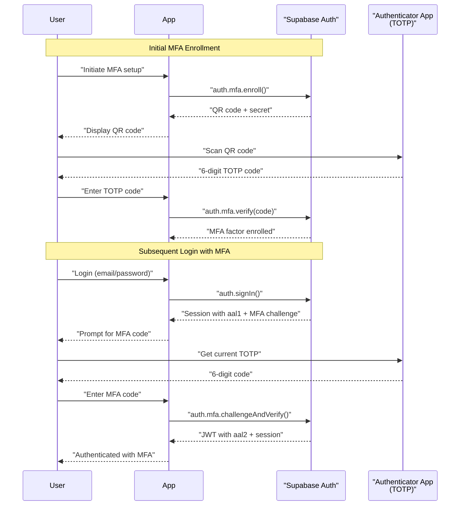

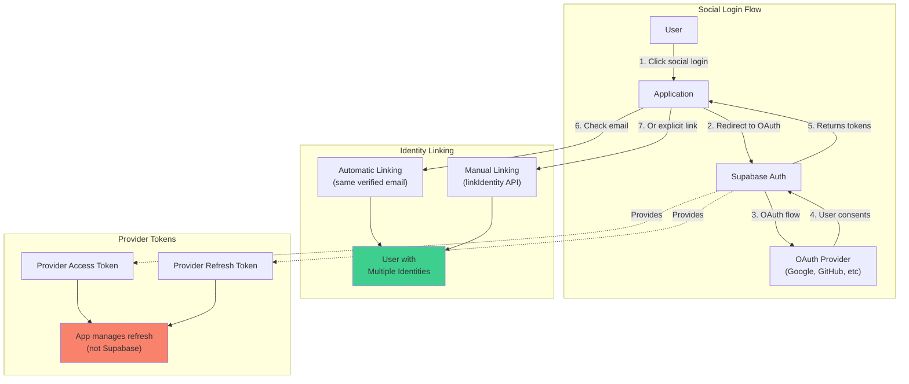

**Context:** We support multi-factor and multiple auth providers. 

- **MFA (Multi-Factor):** Supabase Auth’s MFA adds a second factor after primary login [o^Multi–Factor Authentication │ Supabase Docs](https://supabase.com/docs/guides/auth/auth-mfa#:~:text=Supabase%20Auth%20implements%20MFA%20via,code%20generated%20by%20Supabase%20Auth). It supports TOTP (app authenticator) and SMS OTP [o^Multi–Factor Authentication │ Supabase Docs](https://supabase.com/docs/guides/auth/auth-mfa#:~:text=Supabase%20Auth%20implements%20MFA%20via,code%20generated%20by%20Supabase%20Auth). The flow is: user logs in (email/password or social), then if they have enrolled an MFA factor, Supabase issues an MFA challenge. The user must provide the correct code to complete login. After successful MFA, Supabase issues a session JWT with `aal2` in the `aal` claim [o^Multi–Factor Authentication │ Supabase Docs](https://supabase.com/docs/guides/auth/auth-mfa#:~:text=1.%20Assurance%20Level%201%3A%20,Time%20Password%20code). If user hasn’t enrolled or MFA not required, tokens have `aal1`. You control policies (in dashboard/RLS) to enforce that `aal2` is required for sensitive data. Supabase provides client APIs to list/enroll/verify/unenroll factors, as well as to handle “skip MFA” maybe. Always ensure user enrollment (via UI) before starting.

  Importantly, the MFA assurance level (`aal`) is added *into the token* [o^Multi–Factor Authentication │ Supabase Docs](https://supabase.com/docs/guides/auth/auth-mfa#:~:text=1.%20Assurance%20Level%201%3A%20,Time%20Password%20code). For example, a row-level policy could say `((auth.jwt() ->> 'aal') = 'aal2')` to restrict a table to MFA-complete sessions. Or your backend could refuse calls if `aal` is low. The token still has the same issuer; MFA only changes that claim. 

  Session management with MFA: once the user has `aal2`, refreshing tokens continues to yield `aal2` for the session lifetime (unless user unenrolls factors). Logging out or password change resets factors back to default. 

- **Social Login:** Supabase natively supports many OAuth providers [o^Social login │ Supabase Features](https://supabase.com/features/social-login#:~:text=Key%20features). To configure, one adds provider credentials in the Supabase Dashboard. Users then click e.g. “Sign in with GitHub” and go through OAuth. Supabase then creates (or links) a user account. See [23†L18-L24] for providers. 

- **Account Linking:** Supabase can link multiple identity providers to one user account. By default, it does *automatic linking* if two logins share the same verified email [o^Identity Linking │ Supabase Docs](https://supabase.com/docs/guides/auth/auth-identity-linking#:~:text=Supabase%20Auth%20automatically%20links%20identities,is%20linked%20to%20the%20user). E.g. if a user signs up via Google (with email `user@example.com`) and later logs in via GitHub with that same email, Supabase will link them to the same account [o^Identity Linking │ Supabase Docs](https://supabase.com/docs/guides/auth/auth-identity-linking#:~:text=Supabase%20Auth%20automatically%20links%20identities,is%20linked%20to%20the%20user). This avoids creating duplicate users for the same person. Unverified emails are not auto-linked for security. Identity linking can also be done manually (beta) via client calls [o^Identity Linking │ Supabase Docs](https://supabase.com/docs/guides/auth/auth-identity-linking#:~:text=Supabase%20Auth%20allows%20a%20user,linkIdentity). This is useful if the user has two different emails but wants to merge accounts.

  If a user signed up by one social provider and later wants to add another, your app can call `auth.api.getUserRoles()` or the JS SDK’s `linkIdentity({provider: ...})` [o^Identity Linking │ Supabase Docs](https://supabase.com/docs/guides/auth/auth-identity-linking#:~:text=Supabase%20Auth%20allows%20a%20user,linkIdentity) to prompt OAuth and attach a new identity to the user. You can also unlink identities if a user revokes a linked account [o^Identity Linking │ Supabase Docs](https://supabase.com/docs/guides/auth/auth-identity-linking#:~:text=You%20can%20use%20,to%20unlink%20an%20existing%20identity). Make sure to prevent orphaning the last auth method (Supabase requires ≥2 logins to allow unlink).

- **Session with MFA:** Once MFA is enforced, the login flow may become multi-step. In practice, after the initial credentials are correct, if MFA is required Supabase will respond with an indicator and expect the second factor. Until MFA passes, no access token with `aal2` is given. Once MFA completes, the standard token issuance proceeds. In SPA patterns, your client should catch the `USER_CHALLENGE_FACTOR` event and show the code entry UI, then resume login. The end result: the session cookie or token has `aal2`.

**Key Points:** Supabase supports TOTP and SMS MFA, encoding the result in token’s `aal` claim [o^Multi–Factor Authentication │ Supabase Docs](https://supabase.com/docs/guides/auth/auth-mfa#:~:text=1.%20Assurance%20Level%201%3A%20,Time%20Password%20code). Its social login integrates many providers (Google, GitHub, etc.) with one-click login [o^Social login │ Supabase Features](https://supabase.com/features/social-login#:~:text=1,provider%20according%20to%20your%20needs) [o^Social Login │ Supabase Docs](https://supabase.com/docs/guides/auth/social-login#:~:text=You%20can%20use%20the%20provider,on%20behalf%20of%20your%20user). Accounts with the same verified email will auto-link identities [o^Identity Linking │ Supabase Docs](https://supabase.com/docs/guides/auth/auth-identity-linking#:~:text=Supabase%20Auth%20automatically%20links%20identities,is%20linked%20to%20the%20user); you can also explicitly link/unlink. Use `aal` to gate RLS rules for MFA-restricted data. 

---

## 7. External Service Integration

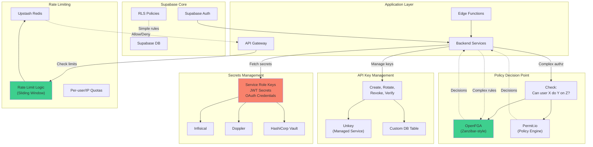

**Context:** We may need specialized authz or infra services beyond what [Supabase](#glossary) offers. This section covers authorized services, secrets management, and rate-limiting integration.

- **OpenFGA (Zanzibar-style):** For fine-grained authorization, OpenFGA (or Google Zanzibar model) can manage hierarchical relationships (e.g. "users in team X have role Y on resources Z"). You can integrate it by making authorization calls from your backend or Edge Functions. For example, before returning a resource, call OpenFGA API (`CheckPermissions`) with user ID and resource; only return data if allowed. This complements RLS: use RLS for simple row filtering, use OpenFGA for complex policy queries. Data sync could involve, say, using Supabase hooks or CRON to update OpenFGA store when permissions change. (OpenFGA is external, so its policies live outside Postgres, giving decoupled PDP.)

- **Permit.io:** Similar role as a PDP. Permit.io is a hosted policy engine supporting various policy syntaxes. You could route permission checks to Permit.io (via HTTP) and act on its decision. For example, in your API layer do `if (await permit.check("user:assignRole")) ...`. The choice between OpenFGA vs Permit depends on preference (OpenFGA is open-source code-based, Permit has UI and SaaS).

- **Unkey (API Key management):** As noted above, Unkey is a managed service for API keys. If onboarded, your app can call Unkey’s APIs to create/rotate keys instead of building your own DB table. Unkey will handle prefixing, hashing, storage, and introspection. It returns the raw key to you (to give to user) but stores only its hash and metadata. Using Unkey can simplify compliance (keys can have attached metadata, owner IDs, etc.) [o^Create API key – Unkey Docs](https://www.unkey.com/docs/api-reference/v1/keys/create-api-key#:~:text=%7B%20,16T17%3A16%3A37.161Z).

- **Secrets Management (Infisical/Doppler):** All credentials (Supabase `service_role` key, JWT secrets, database URLs, client secrets for social login, etc.) should live in a vault. Tools like Infisical or Doppler sync secrets to your environments (as env vars). Do not hard-code secrets or keep them in config files. In architecture, represent secrets access as a read-only step (e.g. Edge Function reads from Doppler at startup). This ensures keys can be rotated centrally and not leaked.

- **Rate Limiting (Upstash Redis):** Supabase Auth limits brute force (e.g. by login attempts), but for API rate limiting, use a separate store. Upstash (serverless Redis) offers an easy rate-limit service: you can call its HTTP endpoints per request (e.g. `RL.GET`/`RL.INCR`) to enforce quotas by user or IP. Alternatively use Redis to implement sliding-window counters. For example, on each request do `INCR user:userid:count`, set expiry 1h; deny if >X. Upstash has a built-in Rate Limit (TS) endpoint for this purpose [o^Serverless Rate Limiting │ Upstash Blog](https://upstash.com/blog/upstash-ratelimit#:~:text=Serverless%20Rate%20Limiting%20,limiting%20is%20a%20standard%20solution). Integrate this in your Edge Function or middleware so that heavy API calls (or even login attempts) are throttled.

**Key Points:** For super-complex or centralized policies, consider **external PDPs**: OpenFGA or Permit.io can handle relationships and dynamic policies outside the DB. For API keys and automation tokens, Unkey (or a custom tokens DB) should manage them. Use secret managers (Infisical, Doppler) to handle Supabase keys and DB credentials. Offload rate-limiting to a Redis service like Upstash to enforce per-user/IP quotas without overloading your DB.

---

## 8. Data Plane / Warehouse Bridging

**Context:** We need to propagate user identity into external data systems (data lake, warehouse, storage) so that queries or access can be attributed to users. Common cases: users writing to S3/Blob storage, or querying BigQuery/Hive with user context.

- **STS Credential Vending:** In cloud environments, one pattern is using Security Token Service (STS). For example, AWS STS can issue short-lived IAM credentials. You could set up Supabase as an OIDC IdP for AWS roles: e.g. configure an IAM OIDC provider for your Supabase domain. Then, in your backend, exchange a user’s Supabase JWT for an AWS STS token (via `AssumeRoleWithWebIdentity`). This yields temp AWS creds scoped to that user’s role. The backend then performs S3/Hive operations with those creds. Similarly, Google Cloud can trust JWTs to mint short-lived service account tokens. This is complex but allows user-level access in external systems.

- **Impersonation / Delegation:** Some platforms allow “impersonating” a service account as the user. For example, BigQuery supports using OAuth ID tokens for authentication if you add your identity provider to Google Cloud. Supabase’s JWT (if it’s an ID token via OIDC) could be used that way. Alternatively, you could have one central account whose queries are labeled with the user’s ID (e.g. add `WHERE owner = '<user>'` in queries). Supabase does not natively do this, so it’s custom integration.

- **Pre-Signed URLs / Capability Tokens:** For object stores, often use pre-signed URLs. Supabase Storage already offers signed URL generation (through `createSignedUrl` API). For raw S3 or the like, your backend can generate a pre-signed URL limited to a specific path (e.g. `/bucket/${auth.uid()}/file.png`). By embedding userID in the key or path and signing for short duration, you grant user-specific access. This is an “unforgeable capability token” approach – the signed URL itself carries the authority. Similarly, for other services one could issue JWT-based capability tokens telling the client, “you have write access to row X”.

- **Data Pipelines:** If using a data warehouse (BigQuery, Snowflake), one might replicate user info. Example: each INSERT could include `created_by = auth.uid()`, or Supabase Edge Hooks could push user info into a streaming table. Or, use a service account to load data but add the user’s ID as a column so audits can link rows back to users.

**Key Points:** To bridge identity externally, use short-lived credentials or signed URLs tied to the user. In AWS/GCP, do OIDC federation via JWT exchange (STS). For object storage, issue pre-signed URLs with paths containing `auth.uid()` and limited TTL. Another approach is to have an intermediate service that takes the Supabase token and performs external calls with its own credentials, tagging them with the user. Ensure any external data ACLs reflect your RLS (e.g. use `auth.uid()` to partition data in the warehouse).

---

## 9. Security Best Practices & Anti-Patterns

**Context:** Key security guidelines in this architecture. We align with OWASP and modern OAuth2.1 recommendations.

- **Token Storage:** Never store access/refresh tokens in plain JavaScript-accessible storage if avoidable. OWASP warns that localStorage is vulnerable to XSS [o^OAuth2 – OWASP Cheat Sheet Series](https://cheatsheetseries.owasp.org/cheatsheets/OAuth2_Cheat_Sheet.html#:~:text=10,constrain%20the%20issued%20tokens). Supabase’s default SPA behavior is using localStorage/`supabase.auth` store [o^Advanced guide │ Supabase Docs](https://supabase.com/docs/guides/auth/server-side/advanced-guide#:~:text=The%20default%20behavior%20if%20you%27re,app%20code%20in%20the%20server), which is simple but at risk if an attacker injects JS. Prefer **HttpOnly, Secure cookies** when possible (e.g. in SSR apps) [o^Advanced guide │ Supabase Docs](https://supabase.com/docs/guides/auth/server-side/advanced-guide#:~:text=The%20default%20behavior%20if%20you%27re,app%20code%20in%20the%20server). If using cookies for SPAs, enable `SameSite=Lax` or `Strict` to mitigate CSRF (Supabase sets Lax by default) [o^Supabase auth for same session on multiple sub domains · supabase · Discussion #5742 · GitHub](https://github.com/orgs/supabase/discussions/5742#:~:text=the%20MDN%20documentation%3A). For tokens in headers, always use `https`. 

- **PKCE for Public Clients:** According to OAuth2.1 and OWASP guidelines, public clients (e.g. SPAs, mobile) *must* use the Authorization Code flow with PKCE [o^OAuth 2.1 Flows │ Supabase Docs](https://supabase.com/docs/guides/auth/oauth-server/oauth-flows#:~:text=Supabase%20Auth%20supports%20two%20OAuth,1%20grant%20types) [o^OAuth2 – OWASP Cheat Sheet Series](https://cheatsheetseries.owasp.org/cheatsheets/OAuth2_Cheat_Sheet.html#:~:text=6,Authorization%20servers%20must%20support%20PKCE). Do **not** use the Implicit flow (it is deprecated [o^OAuth2 – OWASP Cheat Sheet Series](https://cheatsheetseries.owasp.org/cheatsheets/OAuth2_Cheat_Sheet.html#:~:text=Implicit%20Grant%C2%B6) and not supported by Supabase). Supabase’s libraries enable PKCE by default in recommended modes. Ensure any OAuth2 flow uses a state parameter or nonce as well to prevent CSRF [o^OAuth2 – OWASP Cheat Sheet Series](https://cheatsheetseries.owasp.org/cheatsheets/OAuth2_Cheat_Sheet.html#:~:text=1,be%20used%20for%20CSRF%20protection).

- **JWKS/Key Rotation:** Supabase rotates JWT signing keys. Clients should fetch JWKS periodically (10–20 min caching is typical) [o^JWT Signing Keys │ Supabase Docs](https://supabase.com/docs/guides/auth/signing-keys#:~:text=This%20discovery%20endpoint%20is%20cached,on%20the%20Supabase%20client%20library). Long-lived processes should refresh their JWKS cache every few minutes. after rotation, older tokens may fail verification until your cache refreshes. Supabase’s multi-level caching (edge + client) means a rotation could take up to ~20 minutes to fully propagate [o^JWT Signing Keys │ Supabase Docs](https://supabase.com/docs/guides/auth/signing-keys#:~:text=This%20discovery%20endpoint%20is%20cached,on%20the%20Supabase%20client%20library). Build logic to handle a key-not-found error by re-fetching JWKS.

- **Supabase-Specific Pitfalls:** Common mistakes include:
  - **Using `anon` role incorrectly:** Remember, `anon` in JWT (aud) is only for truly anonymous sessions. Logged-in users get `role="authenticated"`. Use `TO authenticated` policies for most data, and treat `anon` as browser-only.
  - **Exposing `service_role` or secrets:** Never leak your service key to clients – it bypasses all security. Trust only server-side with that key.
  - **Not enabling RLS:** Leaving RLS disabled (the default if forgetting to run `ENABLE ROW LEVEL SECURITY`) effectively makes the table wide open to any requester with the anon key. Supabase docs stress always turning on RLS for public tables [o^Row Level Security │ Supabase Docs](https://supabase.com/docs/learn/auth-deep-dive/auth-row-level-security#:~:text=Row%20Level%20Security%20in%20Supabase).
  - **Ignoring MFA enforcement:** Enabling MFA in auth but not checking `aal` in your app means attackers could skip it. Ensure critical actions require AAL2 in code or policies.
  - **Session Fixation/Logout issues:** When using same-domain cookies, ensure logout clears cookies across subdomains (see SSO section) [o^Supabase auth for same session on multiple sub domains · supabase · Discussion #5742 · GitHub](https://github.com/orgs/supabase/discussions/5742#:~:text=supabase.auth.onAuthStateChange%28%28event%2C%20session%29%20%3D,100%20years%2C%20never%20expires).

- **Audit Logging:** Supabase provides detailed Auth audit logs out-of-the-box [o^Auth Audit Logs │ Supabase Docs](https://supabase.com/docs/guides/auth/audit-logs#:~:text=Supabase%20auth%20audit%20logs%20automatically,capture%20all%20authentication%20events%20including). Enable these to capture logins, logouts, password resets, token refreshes, MFA events, etc. Logs are stored in `auth.audit_log_entries` and viewable in dashboard [o^Auth Audit Logs │ Supabase Docs](https://supabase.com/docs/guides/auth/audit-logs#:~:text=Supabase%20auth%20audit%20logs%20automatically,capture%20all%20authentication%20events%20including). Use these for incident investigation. Also log critical actions in your application: failed auth attempts, admin changes, RLS rejections, etc. Ensure your system’s environment is on HTTPS only, with robust logging at API gateways or Edge for monitoring.

- **OWASP Alignment:** Follow the OAuth2.0 Cheat Sheet by OWASP: use `response_type=code` (not implicit) [o^OAuth2 – OWASP Cheat Sheet Series](https://cheatsheetseries.owasp.org/cheatsheets/OAuth2_Cheat_Sheet.html#:~:text=10,constrain%20the%20issued%20tokens), rotate refresh tokens, bound tokens to origin, etc. Especially ensure `scope` limitations – assign only minimal permission in tokens [o^OAuth2 – OWASP Cheat Sheet Series](https://cheatsheetseries.owasp.org/cheatsheets/OAuth2_Cheat_Sheet.html#:~:text=13,every%20request%2C%20whether%20the%20access). Supabase simplifies some aspects (scopes are just `openid/email/profile` by default). But if using custom scopes, treat them with least privilege.

**Key Points:** Store tokens securely (cookies over localStorage when possible) and use HTTPS and PKCE [o^OAuth2 – OWASP Cheat Sheet Series](https://cheatsheetseries.owasp.org/cheatsheets/OAuth2_Cheat_Sheet.html#:~:text=6,Authorization%20servers%20must%20support%20PKCE). Watch Supabase’s cache delays on key rotation [o^JWT Signing Keys │ Supabase Docs](https://supabase.com/docs/guides/auth/signing-keys#:~:text=This%20discovery%20endpoint%20is%20cached,on%20the%20Supabase%20client%20library). Follow OAuth2.1+OWASP best practices (authorization code flow [o^OAuth2 – OWASP Cheat Sheet Series](https://cheatsheetseries.owasp.org/cheatsheets/OAuth2_Cheat_Sheet.html#:~:text=10,constrain%20the%20issued%20tokens)). Always enable and review Supabase’s Auth audit logs [o^Auth Audit Logs │ Supabase Docs](https://supabase.com/docs/guides/auth/audit-logs#:~:text=Supabase%20auth%20audit%20logs%20automatically,capture%20all%20authentication%20events%20including). Avoid anti-patterns like exposing privileged keys or omitting RLS. 

---

## 10. OAuth2/OIDC Concepts (Background)

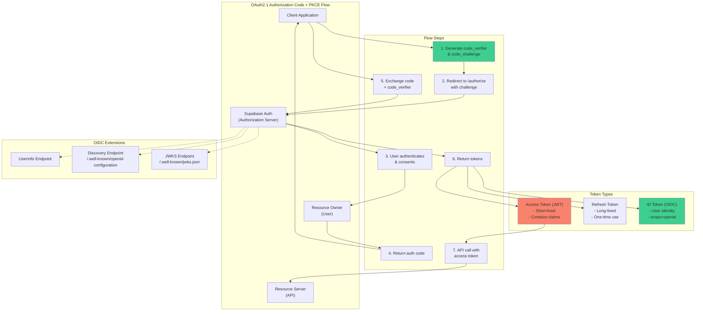

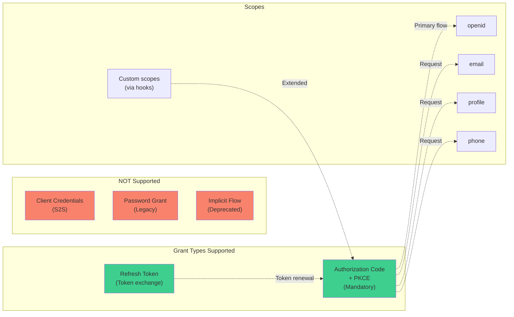

**Context:** Underlying auth standards for context. [Supabase Auth](#glossary) is essentially an [OAuth2.1](#glossary)/[OIDC](#glossary) provider with some bespoke behavior.

- **OAuth2core flows:** In our architecture, the main flows are:
  1. **Authorization Code with PKCE (now mandatory for SPAs and recommended for all clients)** – Users (resource owners) are redirected to Supabase’s `/authorize` endpoint (with `client_id`, `redirect_uri`, etc.), and after login/consent, an authorization code is returned. The client then calls `/token` with `grant_type=authorization_code`, code, and `code_verifier` to obtain an **Access Token** (JWT) and **Refresh Token** [o^OAuth 2.1 Flows │ Supabase Docs](https://supabase.com/docs/guides/auth/oauth-server/oauth-flows#:~:text=Supabase%20Auth%20supports%20two%20OAuth,1%20grant%20types).
  2. **Refresh Token flow** – The client uses `grant_type=refresh_token` to swap a valid refresh token for a new access & refresh pair. Supabase enforces one-time use of refresh tokens, immediately invalidating the old one on exchange [o^User sessions │ Supabase Docs](https://supabase.com/docs/guides/auth/sessions#:~:text=and%20a%20refresh%20token%20which,is%20a%20unique%20string).
  3. **Client Credentials** – *Not supported* by Supabase (no server-to-server flow at the moment) [o^OAuth 2.1 Flows │ Supabase Docs](https://supabase.com/docs/guides/auth/oauth-server/oauth-flows#:~:text=Supabase%20Auth%20supports%20two%20OAuth,1%20grant%20types).
  4. **On-Behalf-Of / Token Exchange (RFC 8693)** – Supabase doesn’t natively implement this, but conceptually one could treat `/token` with a special grant to exchange one token for another with different scopes.

  Supabase also supports **OIDC** on top of OAuth2: if the client requests the `openid` scope, Supabase will issue an **ID Token** (a JWT with the user’s identity claims). It also provides a **UserInfo endpoint** for OIDC (as indicated in their discovery) [o^OAuth 2.1 Server │ Supabase Docs](https://supabase.com/docs/guides/auth/oauth-server#:~:text=,third%20parties%20to%20validate%20tokens). Standard OIDC scopes (`email`, `profile`, `phone`) control what user info is returned [o^OAuth 2.1 Server │ Supabase Docs](https://supabase.com/docs/guides/auth/oauth-server#:~:text=,third%20parties%20to%20validate%20tokens).

- **Token Types:** 
  - **Access Token:** A JWT (signed by Supabase) used to access resources. It includes user identity claims (`sub`, `email`), roles, and session info [o^JWT Claims Reference │ Supabase Docs](https://supabase.com/docs/guides/auth/jwt-fields#:~:text=%60iss%60%20%20,426614174000). It is relatively short-lived (minutes).
  - **Refresh Token:** A random opaque string (not JWT) used only at the OAuth token endpoint to get new tokens. It is long-lived (practically never expires unless used or revoked) [o^User sessions │ Supabase Docs](https://supabase.com/docs/guides/auth/sessions#:~:text=and%20a%20refresh%20token%20which,is%20a%20unique%20string).
  - **ID Token (OIDC):** Also a JWT, primarily for the client to obtain end-user identity. Supabase’s ID token contains similar claims to an access token but is only issued when `scope=openid` [o^OAuth 2.1 Server │ Supabase Docs](https://supabase.com/docs/guides/auth/oauth-server#:~:text=,third%20parties%20to%20validate%20tokens).
  - **Provider Tokens:** When logging in with Google/GitHub, Supabase returns those providers’ access/refresh tokens (for their APIs), but these are **not** stored by Supabase and must be managed by the application [o^Social Login │ Supabase Docs](https://supabase.com/docs/guides/auth/social-login#:~:text=You%20can%20use%20the%20provider,on%20behalf%20of%20your%20user).
  - **Custom Session Cookie:** In SSR mode, the access + refresh sometimes get stored in an HttpOnly cookie (Supabase CLI cookie client).

- **Claims, Issuers, Audiences:** Supabase JWTs include:
  - `iss` (issuer) – always your project’s URL (e.g. `https://<PROJECT>.supabase.co/auth/v1`) [o^JWT Claims Reference │ Supabase Docs](https://supabase.com/docs/guides/auth/jwt-fields#:~:text=%60iss%60%20%20,426614174000).
  - `aud` (audience) – either the literal `"authenticated"` for user tokens or `"anon"` for anonymous ones [o^JWT Claims Reference │ Supabase Docs](https://supabase.com/docs/guides/auth/jwt-fields#:~:text=%60iss%60%20%20,426614174000). (When acting as an OAuth server, `aud` can also contain the client ID string.)
  - `sub` – the user’s unique UUID [o^JWT Claims Reference │ Supabase Docs](https://supabase.com/docs/guides/auth/jwt-fields#:~:text=%60iss%60%20%20,426614174000).
  - `role` – `"authenticated"`, `"anon"`, or `"service_role"` [o^JWT Claims Reference │ Supabase Docs](https://supabase.com/docs/guides/auth/jwt-fields#:~:text=%60iss%60%20%20,426614174000).
  - `aal` – Auth Level as above [o^JWT Claims Reference │ Supabase Docs](https://supabase.com/docs/guides/auth/jwt-fields#:~:text=%60,%60false).
  - Other user info: `email`, `phone`, plus any `app_metadata`/`user_metadata` you add.
  
  When an external resource server verifies the token, it should check `iss` matches your project and that `aud` is appropriate (e.g. “authenticated”) [o^JWT Claims Reference │ Supabase Docs](https://supabase.com/docs/guides/auth/jwt-fields#:~:text=%60iss%60%20%20,426614174000). RLS policies use these claims via helpers (`auth.uid()`, `auth.role()`, etc.).

**Key Points:** Use the **Authorization Code + PKCE** flow for all clients [o^OAuth 2.1 Flows │ Supabase Docs](https://supabase.com/docs/guides/auth/oauth-server/oauth-flows#:~:text=Supabase%20Auth%20supports%20two%20OAuth,1%20grant%20types). Access tokens are short-lived JWTs with user claims, refresh tokens are opaque long-lived. OIDC adds an `id_token` and `userinfo` (supported by Supabase) [o^OAuth 2.1 Server │ Supabase Docs](https://supabase.com/docs/guides/auth/oauth-server#:~:text=,third%20parties%20to%20validate%20tokens). Familiar OAuth concepts apply: Issuers and Audiences in tokens, token lifetimes, and standard scopes for email/profile. Errors in understanding these flows often come from reusing the wrong token type or missing PKCE [o^OAuth 2.1 Flows │ Supabase Docs](https://supabase.com/docs/guides/auth/oauth-server/oauth-flows#:~:text=Supabase%20Auth%20supports%20two%20OAuth,1%20grant%20types) [o^OAuth2 – OWASP Cheat Sheet Series](https://cheatsheetseries.owasp.org/cheatsheets/OAuth2_Cheat_Sheet.html#:~:text=10,constrain%20the%20issued%20tokens). 

---

## Glossary

### A

**AAL (Authenticator Assurance Level)**: A claim in Supabase JWTs that indicates the level of authentication assurance. `aal1` represents single-factor authentication, while `aal2` indicates that multi-factor authentication (MFA) has been completed. Used in RLS policies to enforce MFA requirements for sensitive operations.

**Access Token**: A short-lived JWT (typically 5-60 minutes) issued by Supabase Auth that contains user identity claims (sub, email, role, etc.) and is used to authenticate API requests. Signed using JWKS keys and verified by resource servers.

**API Key**: A long-lived credential issued to third-party developers or service integrations for non-interactive API access. Should be stored as a hash with a recognizable prefix (e.g., `api_live_xxxx`), include scopes/permissions, and support expiration and revocation.

**Auth**: Short for Authentication - the Supabase Auth service based on GoTrue that handles user login, session management, token issuance, MFA, social login, and identity management.

**Auth Hooks**: Extensibility mechanism in Supabase Auth that allows custom logic injection at key points in authentication flows. Can be implemented as HTTP endpoints or secure Postgres functions. Examples include Custom Access Token hooks (add claims), Custom SMS/Email providers, and signup validation hooks.

### B

**B2C (Business-to-Consumer)**: Application architecture pattern where services are designed for end-user consumers rather than businesses. Characterized by social login, self-service registration, and user-centric features.

### C

**CSRF (Cross-Site Request Forgery)**: A security vulnerability where an attacker tricks a user's browser into making unwanted requests. Mitigated in Supabase apps using `SameSite` cookie attributes and PKCE flow.

### G

**GoTrue**: The open-source authentication engine that powers Supabase Auth. Provides JWT-based session management, OAuth2/OIDC flows, and integrates with Postgres for user storage.

### H

**HttpOnly Cookies**: Browser cookies with the HttpOnly flag set, preventing JavaScript access and providing XSS protection. Recommended for storing access and refresh tokens in SSR applications, preferred over localStorage for security.

### I

**Identity Linking**: Supabase feature that associates multiple authentication providers (Google, GitHub, email, etc.) with a single user account. Automatic linking occurs when verified emails match; manual linking available via the `linkIdentity` API.

### J

**JWT (JSON Web Token)**: A compact, URL-safe token format consisting of header, payload (claims), and signature. Supabase issues JWTs as access tokens containing user identity and metadata, signed with JWKS keys for verification.

**JWKS (JSON Web Key Set)**: An endpoint (`/.well-known/jwks.json`) that publishes public keys used to verify JWT signatures. Supabase rotates signing keys periodically; clients cache JWKS with ~10 minute TTL.

### M

**MFA (Multi-Factor Authentication)**: Security mechanism requiring two or more verification factors. Supabase supports TOTP (Time-based One-Time Password via authenticator apps) and SMS OTP. Successful MFA sets the JWT's `aal` claim to `aal2`.

**Multi-Tenancy**: Architecture pattern where a single application instance serves multiple tenants (organizations/customers) with data isolation. Implemented in Supabase using RLS policies with tenant/org IDs in JWT claims and database columns.

### O

**OAuth2.1**: Modern authentication and authorization framework. Supabase implements Authorization Code + PKCE flow and Refresh Token flow. Does NOT support Client Credentials or Implicit flows. Enables "Sign in with Supabase" scenarios.

**OIDC (OpenID Connect)**: Identity layer built on OAuth2 that adds standardized user identity and authentication. Supabase provides OIDC discovery endpoint, UserInfo endpoint, and ID tokens when `scope=openid` is requested.

**OpenFGA**: Open-source authorization system based on Google's Zanzibar. Provides fine-grained, relationship-based access control for complex authorization scenarios beyond RLS capabilities. Can be integrated with Supabase for policy decision point (PDP) functionality.

### P

**PAT (Personal Access Token)**: Long-lived credential issued to individual users for CLI, scripts, or automation. Should use cryptographically random strings with recognizable prefix (e.g., `pat_xxxx`), stored as hashes, and include scopes, expiration, and revocation support.

**PDP (Policy Decision Point)**: External service (like OpenFGA or Permit.io) that evaluates complex authorization policies. Complements RLS for scenarios requiring dynamic, context-aware, or graph-based permissions across services.

**PKCE (Proof Key for Code Exchange)**: OAuth2 extension (RFC 7636) that prevents authorization code interception attacks. Mandatory for SPAs and mobile apps in Supabase. Uses code_verifier and code_challenge to bind authorization code to the client.

**Provider Tokens**: OAuth access and refresh tokens issued by third-party identity providers (Google, GitHub, etc.) during social login. Returned by Supabase but NOT automatically refreshed - application must manage refresh lifecycle.

### R

**Refresh Token**: Long-lived, opaque token used to obtain new access tokens without re-authentication. Supabase enforces one-time use (invalidated immediately after exchange). Typically stored securely alongside access tokens.

**RLS (Row-Level Security)**: Postgres feature that applies WHERE clauses to queries based on the current user. Supabase uses RLS as the primary authorization mechanism, with policies checking JWT claims via `auth.uid()`, `auth.role()`, and `auth.jwt()` helpers.

**Row-Level Security**: See RLS. Database-level security that filters query results per-row based on user identity and policies. Essential for multi-tenant B2C applications. Requires proper indexing on filter columns for performance.

### S

**S2S (Service-to-Service)**: Authentication pattern for backend services communicating without user context. Supabase doesn't provide native client_credentials flow; alternatives include service_role key, service accounts, or JWT forwarding.

**Service Role Key**: Supabase's superuser API key that bypasses all RLS policies. Extremely privileged - must only be used server-side, never exposed to clients. Stored in secrets management systems (Infisical, Doppler).

**SPA (Single-Page Application)**: Client-side web application pattern where routing and rendering occur in the browser. Supabase SPAs typically store tokens in localStorage/memory and use implicit auth flows, contrasting with SSR's cookie-based approach.

**SSO (Single Sign-On)**: Authentication pattern allowing users to authenticate once and access multiple applications. Same-domain SSO uses shared cookies (Domain=example.com); cross-domain requires OAuth/OIDC redirect flows through central identity portal.

**SSR (Server-Side Rendering)**: Application pattern where pages are rendered on the server. Supabase SSR apps use PKCE flow and HttpOnly cookies for session management, enabling both server and client to access the session securely.

**STS (Security Token Service)**: Cloud provider service (AWS STS, Google Cloud STS) that issues temporary credentials. Can be integrated with Supabase via OIDC federation to exchange Supabase JWTs for short-lived cloud credentials.

**Supabase**: Open-source Firebase alternative providing authentication (Auth/GoTrue), database (Postgres with RLS), storage, and real-time subscriptions. Acts as backend-as-a-service for B2C applications.

### T

**TOTP (Time-based One-Time Password)**: Algorithm (RFC 6238) for generating temporary codes synchronized between server and authenticator app. Primary MFA method in Supabase, typically producing 6-digit codes valid for 30 seconds.

### U

**Unkey**: Managed API key service providing creation, hashing, storage, verification, and analytics for API keys and PATs. Alternative to building custom token management infrastructure.

### X

**XSS (Cross-Site Scripting)**: Security vulnerability where attackers inject malicious scripts. localStorage token storage is vulnerable to XSS; HttpOnly cookies provide better protection but require CSRF mitigation.

---

**References:** Official Supabase Docs (Auth, RLS, Storage), Supabase GitHub/Discussions, OAuth2.1/OIDC RFCs, OWASP OAuth cheat sheet, and best-practice sources were used to compile this report [o^User sessions │ Supabase Docs](https://supabase.com/docs/guides/auth/sessions#:~:text=and%20a%20refresh%20token%20which,is%20a%20unique%20string) [o^OAuth 2.1 Flows │ Supabase Docs](https://supabase.com/docs/guides/auth/oauth-server/oauth-flows#:~:text=Supabase%20Auth%20supports%20two%20OAuth,1%20grant%20types) [o^JWT Claims Reference │ Supabase Docs](https://supabase.com/docs/guides/auth/jwt-fields#:~:text=%60iss%60%20%20,426614174000) [o^Supabase auth for same session on multiple sub domains · supabase · Discussion #5742 · GitHub](https://github.com/orgs/supabase/discussions/5742#:~:text=supabase.auth.onAuthStateChange%28%28event%2C%20session%29%20%3D,100%20years%2C%20never%20expires) [o^Supabase Docs │ Troubleshooting │ RLS Performance and Best Practices](https://supabase.com/docs/guides/troubleshooting/rls-performance-and-best-practices-Z5Jjwv#:~:text=,primary%20keys%20or%20unique%20already) [o^Auth Audit Logs │ Supabase Docs](https://supabase.com/docs/guides/auth/audit-logs#:~:text=Supabase%20auth%20audit%20logs%20automatically,capture%20all%20authentication%20events%20including). (Mermaid diagrams illustrate proposed flows.)