# Executive Summary

This comprehensive guide provides a complete reference architecture for building production-grade B2C systems using Supabase as the authentication and authorization foundation. The document addresses the critical challenge of implementing secure, scalable identity management across multiple applications, APIs, and data platforms while maintaining consistent policy enforcement and audit trails.

The architecture presented here solves several complex problems: (1) **Multi-application SSO** - enabling seamless single sign-on across web, mobile, and CLI applications with different domain topologies; (2) **Fine-grained authorization** - implementing relationship-based access control (ReBAC) using Postgres RLS as the primary policy enforcement point; (3) **Credential lifecycle management** - securely managing Personal Access Tokens (PATs) and API keys with proper scoping, rotation, and revocation; and (4) **Data plane bridging** - propagating user identity and authorization policies to external systems like data warehouses and object stores.

The guide is structured to serve both strategic planning and tactical implementation. It begins with a comprehensive glossary to align vocabulary across teams, then provides detailed component architecture, bootstrap procedures, user journey sequences, API access patterns, and concrete data models. Special emphasis is placed on Supabase-specific patterns, security best practices, and anti-patterns to avoid. Whether you're architecting a new B2C platform or evolving an existing system, this document provides the conceptual frameworks and implementation blueprints needed to build a secure, maintainable, and user-friendly authentication and authorization system.

---

# 1) Glossary {#glossary}

> Goal: align vocabulary across product, platform, security, and data teams. Each term includes (a) definition, (b) analogy, (c) what users feel/see in UI.

## OAuth2
- **Definition:** A framework for **authorization** (granting an app permission to call an API). OAuth2 defines flows to obtain access tokens.
- **Analogy:** A valet ticket that lets someone drive *your car* for a specific purpose and time.
- **User scenario:** “Connect Calendar” shows a consent screen; user approves; app later calls an API without asking for password again.

## OIDC (OpenID Connect)
- **Definition:** An **authentication** layer on top of OAuth2. Adds **ID tokens** and standardized identity claims.
- **Analogy:** A verified ID card issued by a trusted authority, plus a receipt for what you allowed.
- **User scenario:** “Sign in with Google” returns you to the app already known as *you*, with profile info.

## SAML (contrast)
- **Definition:** An older enterprise SSO standard using XML assertions, often used for workforce identity.
- **Analogy:** A stamped letter (assertion) handed from one organization to another.
- **User scenario:** Corporate users click “Sign in with Company SSO” and are redirected through their employer’s login.

## Authorization Server
- **Definition:** The system that issues tokens (access/refresh/ID) after authenticating and/or obtaining consent.
- **Analogy:** The ticket booth that issues time-limited passes.
- **User scenario:** You briefly see a hosted login page; after login you land back in the app.

## IdP (Identity Provider)
- **Definition:** A system that authenticates users and provides identity assertions/tokens (could be OIDC or SAML).
- **Analogy:** DMV / passport office verifying identity.
- **User scenario:** “Continue with Google” is using Google as IdP.

## RP / SP (Relying Party / Service Provider)
- **Definition:** The app that **relies on** the IdP/Authorization Server for login (RP in OIDC, SP in SAML).
- **Analogy:** Venue that accepts a verified ID card at the door.
- **User scenario:** Your app doesn’t manage passwords; it accepts Supabase session tokens.

## Session cookie
- **Definition:** A browser cookie representing an authenticated session (often httpOnly). Used for SSO across web apps in a domain scope.
- **Analogy:** A wristband for re-entry at a festival.
- **User scenario:** Open App B in a new tab and you’re already logged in.

## Access token
- **Definition:** A token presented to APIs to authorize requests. Typically short-lived.
- **Analogy:** A hotel keycard that opens certain doors for a limited time.
- **User scenario:** API calls succeed until token expires; then app silently renews.

## Refresh token
- **Definition:** A long(er)-lived credential used to get new access tokens without user re-auth.
- **Analogy:** A membership card used to get new day-passes.
- **User scenario:** You stay logged in for weeks; you aren’t prompted daily.

## ID token
- **Definition:** OIDC token carrying identity claims about the user (who they are), meant for the client/RP.
- **Analogy:** A signed business card from the IdP.
- **User scenario:** App shows your name/email immediately after login.

## JWT
- **Definition:** A signed token format (JSON Web Token). Can be used for access tokens and ID tokens.
- **Analogy:** A tamper-evident sealed envelope containing claims.
- **User scenario:** Invisible; but enables stateless verification by services.

## Claims
- **Definition:** Key-value attributes inside tokens (e.g., `sub`, `email`, `role`, custom claims).
- **Analogy:** The printed details on a ticket (seat, section, time).
- **User scenario:** UI conditionally shows admin settings if claim indicates admin.

## Issuer (`iss`)
- **Definition:** Identifies who issued the token (the token authority).
- **Analogy:** The logo/authority printed on the ticket.
- **User scenario:** Behind the scenes, services reject tokens from unknown issuers.

## Audience (`aud`)
- **Definition:** Intended recipient(s) of the token—what API/service should accept it.
- **Analogy:** Ticket “valid for venue X only”.
- **User scenario:** Token for App A can’t be replayed to App B’s API if configured correctly.

## JWKS
- **Definition:** JSON Web Key Set endpoint exposing public keys used to verify JWT signatures.
- **Analogy:** The public “signature samples” you can compare against.
- **User scenario:** Invisible; enables key rotation without redeploying every service.

## JTI
- **Definition:** Unique token identifier claim. Used for replay detection or revocation lists.
- **Analogy:** A serial number on a banknote.
- **User scenario:** Security team can revoke a specific token instance.

## PKCE
- **Definition:** Proof Key for Code Exchange. Protects OAuth authorization code flows for public clients (SPAs/mobile) against interception.
- **Analogy:** A claim check that must match the original stub.
- **User scenario:** Safer login for mobile apps without client secrets.

## CSRF
- **Definition:** Cross-Site Request Forgery. An attack where a browser is tricked into sending authenticated requests.
- **Analogy:** Someone forges a form submission using your already-open session.
- **User scenario:** Without defenses, clicking a malicious link could change settings.

## Token rotation
- **Definition:** Replacing refresh tokens periodically; old tokens become invalid after use.
- **Analogy:** Changing locks after issuing a new key.
- **User scenario:** If a refresh token leaks, its reuse gets detected.

## Token revocation
- **Definition:** Making a previously issued token (or family) unusable before its expiration.
- **Analogy:** Canceling a ticket.
- **User scenario:** User clicks “Sign out of all devices” and sessions stop working.

## STS (Security Token Service)
- **Definition:** Service that exchanges identity for short-lived credentials to access downstream systems (often cloud storage/warehouse).
- **Analogy:** A cashier that converts your membership into a time-limited wristband for a restricted area.
- **User scenario:** After login, user can query data warehouse without seeing warehouse passwords.

## Impersonation
- **Definition:** A trusted service acts as a user to a downstream system (with strict controls/audit).
- **Analogy:** A manager signs for an employee with recorded approval.
- **User scenario:** “Run query as Alice” is logged, gated, and time-limited.

## Delegation
- **Definition:** Passing a user’s permission to another component to act on their behalf (often via token exchange).
- **Analogy:** Power of attorney for one task.
- **User scenario:** A BI tool can fetch user-authorized data from APIs without storing the user password.

## Token exchange
- **Definition:** Swapping one token for another token suitable for a different audience or system (e.g., OAuth Token Exchange).
- **Analogy:** Exchanging currency at a kiosk for a destination-specific currency.
- **User scenario:** User logs in once; internal services obtain downstream-scoped tokens.

## RBAC
- **Definition:** Role-Based Access Control (roles grant permissions).
- **Analogy:** Job titles determine what doors open.
- **User scenario:** “Admin” role sees billing settings.

## ABAC
- **Definition:** Attribute-Based Access Control (policy based on attributes like org, region, device posture).
- **Analogy:** Rules like “only employees on-site can enter lab.”
- **User scenario:** Access blocked when user is outside allowed region.

## ReBAC
- **Definition:** Relationship-Based Access Control (permissions derived from relationships between principals and resources).
- **Analogy:** “Friend-of-a-friend” style relationship graph controls access.
- **User scenario:** You can open a project if you are a member of its organization.

## PEP / PDP
- **Definition:** Policy Enforcement Point (PEP) enforces decisions; Policy Decision Point (PDP) decides.
- **Analogy:** PDP is the judge; PEP is the bailiff enforcing the ruling.
- **User scenario:** UI shows "You don't have access" because the API/DB enforced policy.

## Supabase
- **Definition:** Open-source Firebase alternative providing Postgres database, authentication (GoTrue), storage, and real-time subscriptions.
- **Analogy:** A complete backend-as-a-service platform with batteries included.
- **User scenario:** Developers provision a Supabase project and get auth, database, and storage in minutes.

## GoTrue
- **Definition:** Supabase's authentication service (JWT-based), supporting email/password, magic links, OAuth providers, and MFA.
- **Analogy:** The security guard at the entrance who verifies identities.
- **User scenario:** Users authenticate through GoTrue and receive JWT tokens for accessing resources.

## RLS (Row Level Security)
- **Definition:** Postgres feature that restricts which rows a user can access in a query based on policies.
- **Analogy:** Personalized filters on database tables, showing only what you're allowed to see.
- **User scenario:** When querying projects table, users only see projects from their organizations.

## B2C (Business-to-Consumer)
- **Definition:** Business model where companies sell products/services directly to individual consumers.
- **Analogy:** A retail store open to the general public rather than wholesale.
- **User scenario:** Anyone can sign up for the service using their personal email or social login.

## SSO (Single Sign-On)
- **Definition:** Authentication scheme allowing users to log in once and access multiple related applications.
- **Analogy:** One master key that opens multiple doors in the same building.
- **User scenario:** Log in to App A, then access App B without entering credentials again.

## Principal
- **Definition:** An entity (user, service, integration) that can be authenticated and authorized.
- **Analogy:** Anyone or anything holding credentials to enter the building.
- **User scenario:** The system tracks whether the requester is a human user or an API integration.

## Tenant
- **Definition:** An isolated unit of organization (typically org/workspace) with its own data and users in a multi-tenant system.
- **Analogy:** Separate apartment units in the same building with shared infrastructure.
- **User scenario:** Each company using your platform has their own org with isolated data.

## Scope
- **Definition:** A permission boundary defining what actions a token or credential can perform.
- **Analogy:** The list of permitted activities on your visitor badge.
- **User scenario:** A PAT with "read:projects" scope can list but not modify projects.

## Step-up authentication
- **Definition:** Requiring users to re-authenticate (often with higher assurance like MFA) before sensitive operations.
- **Analogy:** Asking for your passport even though you already showed your driver's license.
- **User scenario:** Changing account email requires entering password again, even if already logged in.

## Magic link
- **Definition:** Passwordless authentication method where users click a link sent to their email to sign in.
- **Analogy:** A temporary entry code texted to your phone.
- **User scenario:** User enters email, receives link, clicks it, and is automatically logged in.

## Webhook
- **Definition:** HTTP callback that delivers real-time data to other applications when events occur.
- **Analogy:** A doorbell that notifies you when someone arrives.
- **User scenario:** When user signs up, Supabase sends webhook to your CRM to create a contact.

## Service role
- **Definition:** A privileged API key in Supabase that bypasses RLS, intended for server-side admin operations.
- **Analogy:** A master key that opens all locks, meant only for building management.
- **User scenario:** Backend migration scripts use service role to bulk update data across all tenants.

## Anonymous key
- **Definition:** A public API key in Supabase for client-side use with RLS enforcement.
- **Analogy:** A visitor badge that only grants access to public areas.
- **User scenario:** Frontend apps use anonymous key; RLS ensures users only see their own data.

## Security definer
- **Definition:** Postgres function that runs with the privileges of the user who created it, not the caller.
- **Analogy:** A valet who can park cars in restricted areas on your behalf.
- **User scenario:** Users call an RPC function that performs admin operations they normally couldn't do directly.

## TOTP (Time-based One-Time Password)
- **Definition:** MFA method generating temporary codes based on shared secret and current time (e.g., Google Authenticator).
- **Analogy:** A security code that changes every 30 seconds.
- **User scenario:** User scans QR code with authenticator app, then enters 6-digit codes during login.

## WebAuthn
- **Definition:** Web standard for strong authentication using hardware tokens, biometrics, or platform authenticators.
- **Analogy:** Using your fingerprint or security key instead of a password.
- **User scenario:** User touches YubiKey or uses Face ID as second factor.

## PAT (Personal Access Token)
- **Definition:** Long-lived credential for API access, typically used by CLI tools or scripts.
- **Analogy:** A service entrance key for automated deliveries.
- **User scenario:** Developer creates PAT to let CI/CD pipeline deploy to production.

## API Key
- **Definition:** Credential identifying an application or integration, often with scope restrictions.
- **Analogy:** A contractor badge with specific building access permissions.
- **User scenario:** Third-party integration uses API key to sync data with your platform.

## Argon2
- **Definition:** Modern password hashing algorithm, winner of Password Hashing Competition, resistant to GPU attacks.
- **Analogy:** An extremely complex lock that's slow to pick even with power tools.
- **User scenario:** Invisible to users; ensures stolen password hashes can't be easily cracked.

## CORS (Cross-Origin Resource Sharing)
- **Definition:** Browser security mechanism controlling which origins can access your API.
- **Analogy:** A whitelist of trusted messengers who can pick up packages.
- **User scenario:** Your app running on app.example.com can call API at api.example.com.

## XSS (Cross-Site Scripting)
- **Definition:** Security vulnerability where attackers inject malicious scripts into web pages viewed by other users.
- **Analogy:** Slipping a note into someone's mailbox that tricks them when they open it.
- **User scenario:** Without proper defenses, attacker could steal tokens from localStorage.

## httpOnly cookie
- **Definition:** Cookie flag that prevents JavaScript access, protecting against XSS token theft.
- **Analogy:** A sealed package that can only be opened by authorized postal workers.
- **User scenario:** Session cookies can't be stolen even if XSS vulnerability exists.

## Policy table
- **Definition:** Database table storing authorization rules (who can access what resources).
- **Analogy:** The master ledger of permissions and access rights.
- **User scenario:** resource_bindings table defines that Alice can read Project X.

## Warehouse
- **Definition:** Centralized data repository optimized for analytical queries (e.g., Snowflake, BigQuery, Redshift).
- **Analogy:** A massive, organized archive optimized for research and analysis.
- **User scenario:** BI tool queries warehouse to generate company-wide analytics reports.

## Object store
- **Definition:** Storage service for unstructured data (files, blobs) accessed via HTTP APIs (e.g., S3, Supabase Storage).
- **Analogy:** A digital filing cabinet for documents and media.
- **User scenario:** Users upload profile pictures to object store; app retrieves signed URLs.

## Pre-signed URL
- **Definition:** Time-limited URL granting temporary access to a private object without authentication.
- **Analogy:** A temporary visitor pass that expires after an hour.
- **User scenario:** User clicks "Download report" and receives URL valid for 5 minutes.

## Bucket
- **Definition:** Container for organizing objects in storage systems; can have distinct access policies.
- **Analogy:** A separate filing cabinet with its own lock and access rules.
- **User scenario:** "public-assets" bucket for logos; "private-documents" bucket for sensitive files.

## Migration
- **Definition:** Versioned script that modifies database schema or data in a controlled, reproducible way.
- **Analogy:** Building renovation blueprints applied in sequence.
- **User scenario:** Developer writes migration to add MFA fields to users table.

## Idempotent
- **Definition:** Operation that produces the same result no matter how many times it's executed.
- **Analogy:** Pressing an elevator button multiple times doesn't change the outcome.
- **User scenario:** Running the same database migration twice doesn't cause errors.

## Rate limiting
- **Definition:** Controlling the frequency of requests a user/client can make to prevent abuse.
- **Analogy:** A turnstile that only lets one person through every few seconds.
- **User scenario:** After 5 failed login attempts, user must wait 15 minutes to retry.

## Audit log
- **Definition:** Immutable record of security-relevant events (who did what, when).
- **Analogy:** Security camera footage with timestamps.
- **User scenario:** Admin reviews audit log to see who accessed sensitive customer data.

## Break glass
- **Definition:** Emergency access procedure for urgent situations when normal auth fails.
- **Analogy:** Emergency fire alarm that bypasses normal security.
- **User scenario:** On-call engineer uses break glass procedure to restore service during outage.

## Least privilege
- **Definition:** Security principle: grant minimum permissions necessary to perform a task.
- **Analogy:** Giving employees only the keys they need, not every key in the building.
- **User scenario:** Read-only analyst account can't modify production data.

## Zero trust
- **Definition:** Security model assuming no implicit trust; verify every access request regardless of source.
- **Analogy:** Checking ID at every door, even for people already inside.
- **User scenario:** Even internal services must present valid tokens for every request.

## Federation
- **Definition:** Linking identity systems so users can authenticate with credentials from one system to access another.
- **Analogy:** A passport accepted across multiple countries.
- **User scenario:** Company employees use corporate SSO to access third-party SaaS tools.

## Account linking
- **Definition:** Associating multiple authentication methods (email, Google, Apple) with a single user account.
- **Analogy:** Having multiple keys (house key, car key) on the same keyring.
- **User scenario:** User who signed up with email can also log in with Google.

---

# 2) Supabase component model (high level but concrete)

## Conceptual mapping (Supabase-specific)

### [Supabase](#glossary) Auth ([GoTrue](#glossary)) is conceptually…
- A **hosted identity + session issuer** ([OIDC](#glossary)/[OAuth2](#glossary) *provider-like* behavior) that:
  - authenticates users via email/password, [magic links](#glossary), social providers
  - issues **[JWT](#glossary) [access tokens](#glossary)** and **[refresh tokens](#glossary)**
  - supports [MFA](#glossary) (via [Supabase](#glossary) Auth [MFA](#glossary) features)
  - manages [sessions](#glossary) and user identities

### [Supabase](#glossary) Auth is *not*…
- A full enterprise [IdP](#glossary) (like Okta) with deep [SAML](#glossary)/SCIM governance features
- A complete authorization engine for resource graphs (that's your DB/[RLS](#glossary) and optionally a [PDP](#glossary))
- A replacement for service-to-service identity (you will likely add a service identity layer)

### Postgres + [RLS](#glossary) is your primary authorization enforcement
- Treat Postgres as the **authoritative [policy enforcement point](#glossary)** for anything stored in Postgres.
- [RLS](#glossary) policies + [security definer](#glossary) functions give you:
  - per-[tenant](#glossary) isolation
  - per-resource access control ([ReBAC](#glossary) tables)
  - consistent enforcement across all apps and APIs (as long as they access data via Postgres with [JWT](#glossary) context)

### Storage + policies is object authorization enforcement
- [Supabase](#glossary) Storage integrates with Postgres policies ([buckets](#glossary)/objects metadata in Postgres).
- You can enforce "who can read/write object X" using policies tied to `auth.uid()` and relationship tables.

### Optional [PDP](#glossary) microservice (when useful)
Use a separate [PDP](#glossary) when:
- You need to authorize **non-Postgres** resources ([warehouse](#glossary), S3, external APIs) using the same policy model
- You need **explainability** ("why denied?") or decision caching at high volume
- You need centralized **policy evaluation** across heterogeneous backends

Avoid a [PDP](#glossary) when:
- All critical authorization happens in Postgres + Storage policies
- You can express policies in [RLS](#glossary) cleanly and you want minimal moving parts

### Backend services: validating [Supabase](#glossary) [JWTs](#glossary) without duplicating auth
Pattern:
1) Services validate [JWT](#glossary) **signature** (via [JWKS](#glossary)), **[issuer](#glossary)**, **[audience](#glossary)**, **expiry**
2) Services perform **coarse checks** (token valid, user active)
3) Services rely on **Postgres [RLS](#glossary)** for fine-grained authorization by using the user [JWT](#glossary) when querying Postgres (or by calling RPC functions that do)

Key principle:
- **Do not** re-implement per-resource authorization rules in each service.
- Put rules in **[RLS](#glossary) + relationship tables** (and optionally [PDP](#glossary) for non-Postgres).

## High-level component diagram

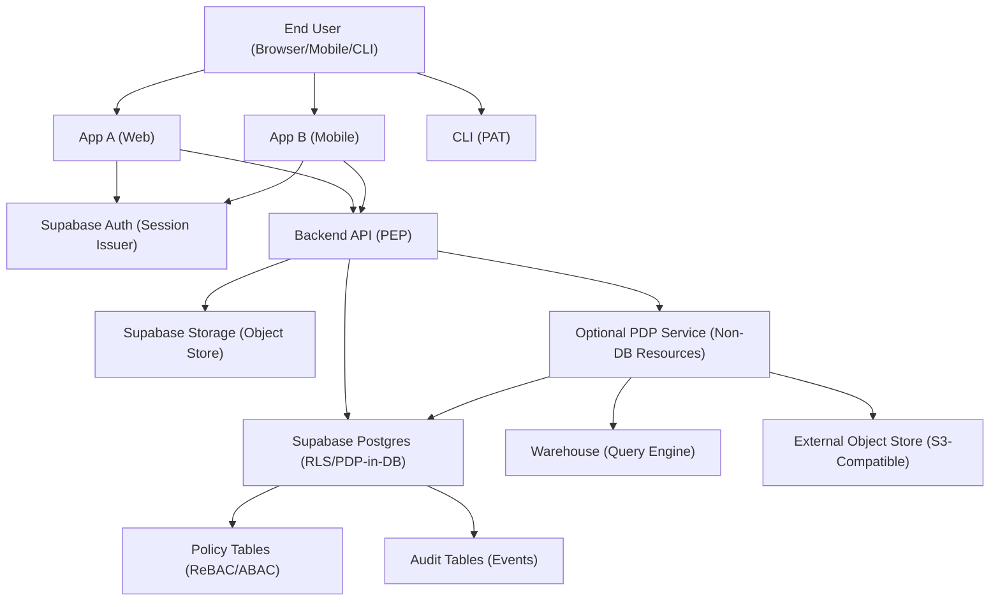

## Authentication and authorization flow layers

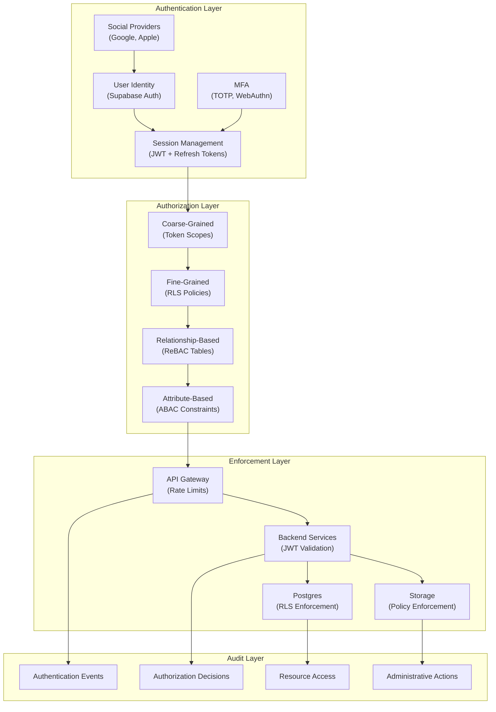

## Token lifecycle and validation flow

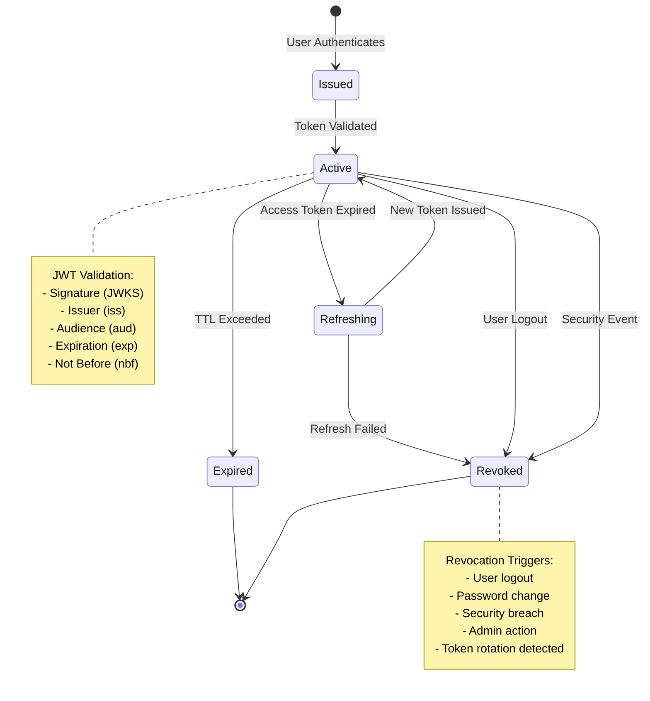

---

# 3) FULL onboarding / “first install” (platform bootstrap) guide

## Bootstrap checklist (conceptual + implementation steps)

### A) Domains, redirect URIs, and [SSO](#glossary) topology
- [ ] Decide [SSO](#glossary) topology:
  - [ ] **Same parent domain** (e.g., `app-a.example.com`, `app-b.example.com`)
  - [ ] **Different domains** (e.g., `example.com` and `example-app.net`)
- [ ] Register redirect URIs for each app in [Supabase](#glossary) Auth settings:
  - [ ] local dev callbacks
  - [ ] staging callbacks
  - [ ] production callbacks
- [ ] Decide [session](#glossary) strategy per app:
  - [ ] SSR web apps: prefer **[httpOnly cookies](#glossary)** (server-managed)
  - [ ] SPA/mobile: use [Supabase](#glossary) client [session](#glossary) management (avoid localStorage if possible; see best practices)

### B) Enable social providers
- [ ] Configure providers (Google, Apple, etc.) in [Supabase](#glossary) Auth
- [ ] Ensure provider settings match environment (dev/stage/prod)
- [ ] Define [account linking](#glossary) strategy:
  - [ ] email-based linking rules (careful with provider email verification)
  - [ ] allow multiple identities per user

### C) Enable [MFA](#glossary)
- [ ] Choose [MFA](#glossary) factor(s) to support (e.g., [TOTP](#glossary), [WebAuthn](#glossary) if supported)
- [ ] Define [MFA](#glossary) policy:
  - [ ] optional enrollment with prompts
  - [ ] [step-up](#glossary) required for sensitive actions (keys, billing, org admin)
- [ ] Define recovery options:
  - [ ] recovery codes
  - [ ] trusted device policy (if you implement)

### D) [JWKS](#glossary) and key management considerations
- [ ] Identify your **[issuer](#glossary)** and expected token **[audience](#glossary)(s)**
- [ ] Ensure services validate tokens using **[JWKS](#glossary)**
- [ ] Plan for key rotation:
  - [ ] cache [JWKS](#glossary) with TTL
  - [ ] handle `kid` changes gracefully

### E) Environment separation (dev/stage/prod)
- [ ] Separate [Supabase](#glossary) projects per environment
- [ ] Separate [OAuth](#glossary) provider apps/credentials per environment
- [ ] Separate storage [buckets](#glossary) or prefixes per environment
- [ ] Ensure no cross-environment token acceptance ([issuer](#glossary)/[aud](#glossary) separation)

### F) Secrets handling
- [ ] Use a secrets manager (KMS-backed) for:
  - [ ] [OAuth](#glossary) client secrets (server-side apps)
  - [ ] [webhook](#glossary) secrets
  - [ ] service identity private keys (if you mint S2S tokens)
- [ ] Never store plaintext [PATs](#glossary)/[API keys](#glossary); store hashed only (see section 6)

### G) Logging and [audit](#glossary) baselines
- [ ] Define [audit](#glossary) event schema (auth events, credential lifecycle, admin actions, data export)
- [ ] Log security-sensitive actions with:
  - [ ] [principal](#glossary) id
  - [ ] resource id
  - [ ] action
  - [ ] decision (allow/deny)
  - [ ] request id, IP, user agent
- [ ] Create "[break glass](#glossary)" operational procedures

## Bootstrap component diagram

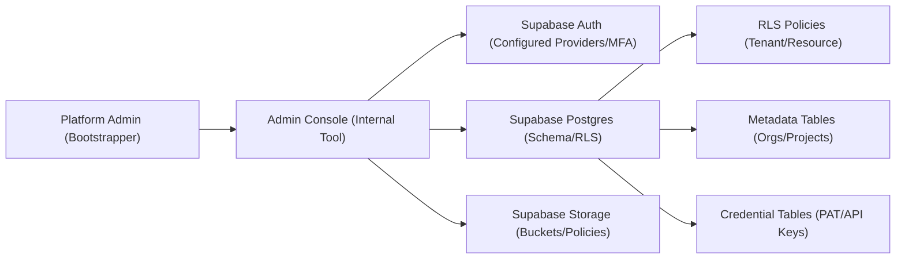

## Bootstrap sequence (admin first-time setup)

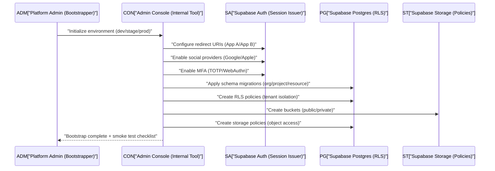

---

# 4) User journeys: detailed sequences

## 4.1 New user sign-up with social login (first time)

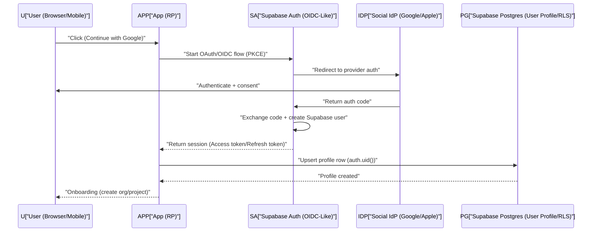

## 4.2 Existing user login

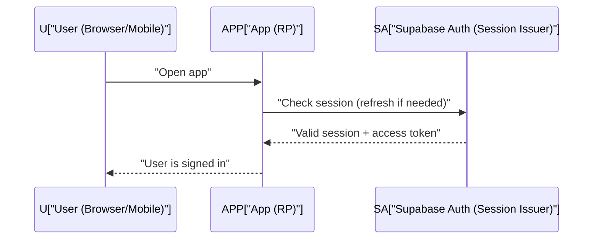

## 4.3 MFA enrollment flow (step-up recommended)

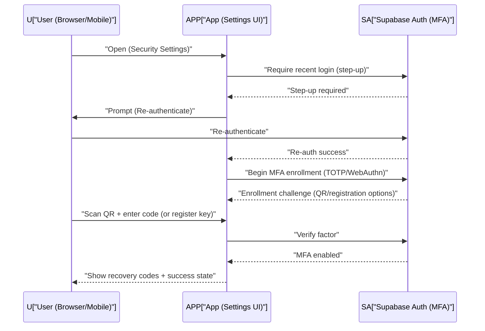

## 4.4 MFA challenge flow on subsequent logins

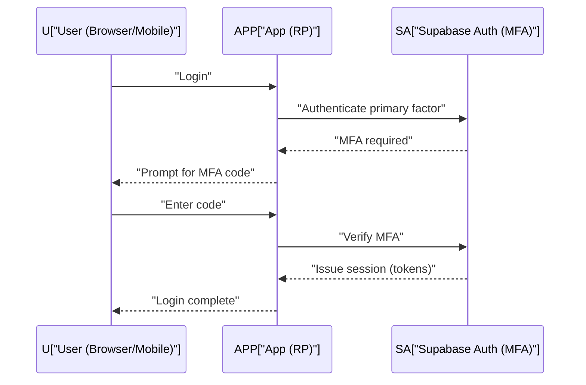

## 4.5 Account linking edge cases

### Case: user signs up with Google then tries email/password
Design rules:
- Prefer **one canonical user** with multiple identities.
- On email/password signup attempt:
  - If email matches existing verified identity, prompt “Link account” and require step-up.

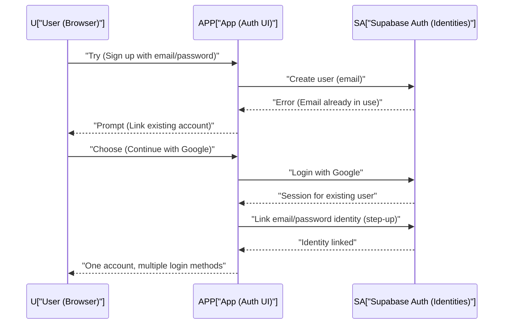

### Case: multiple social providers
- Show “Linked accounts” list; allow unlink only if at least one strong method remains.

## 4.6 SSO across App A and App B

### A) Same parent domain (subdomains) approach
Assumption: you can scope cookies to `.example.com`.

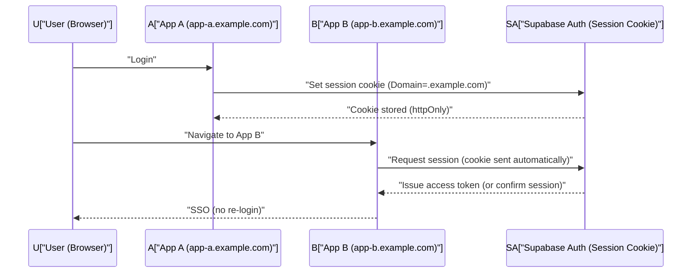

Implementation notes:
- Prefer **server-side session handling** for SSR apps (cookie-based).
- Ensure CSRF defenses for cookie-authenticated endpoints.

### B) Different domains approach (redirect-based; no shared cookies)
You cannot share cookies across `example.com` and `example-app.net`. Use a central “auth broker” flow.

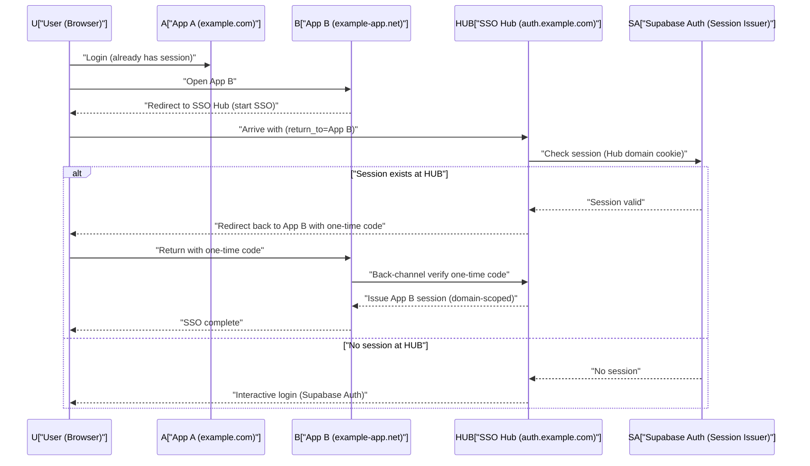

Key idea:
- Use a **central SSO hub domain** that holds the session; other domains perform redirects + one-time-code exchange.

## 4.7 Token refresh / session renewal

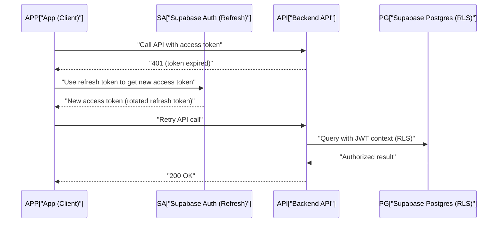

## 4.8 Logout (per-app vs global)

### Per-app logout
- Clear app session (cookies or local session)
- Optionally revoke refresh token family

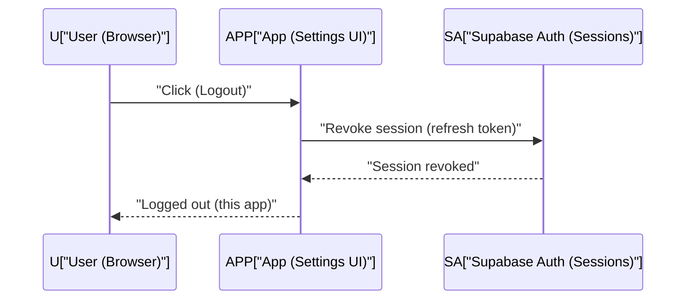

### Global logout (feasible with limitations)
- Requires session management across apps:
  - shared cookie domain (subdomains), or
  - SSO hub coordinating sign-out

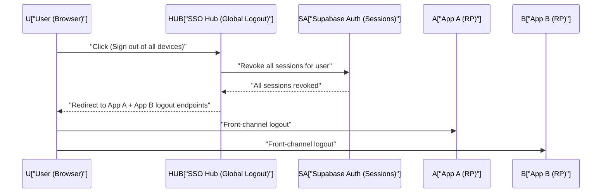

Limitations:
- Front-channel logout can fail if tabs closed or blocked.
- True global logout across different domains is best-effort.

## 4.9 “Suspicious login / re-auth required” UX (high level)
Triggers:
- new device, impossible travel, high-risk IP, user changed email, user managing PATs/API keys
UX requirements:
- show **why** re-auth is required
- require MFA if enabled
- show session/device list after success

## Multi-tenancy data model

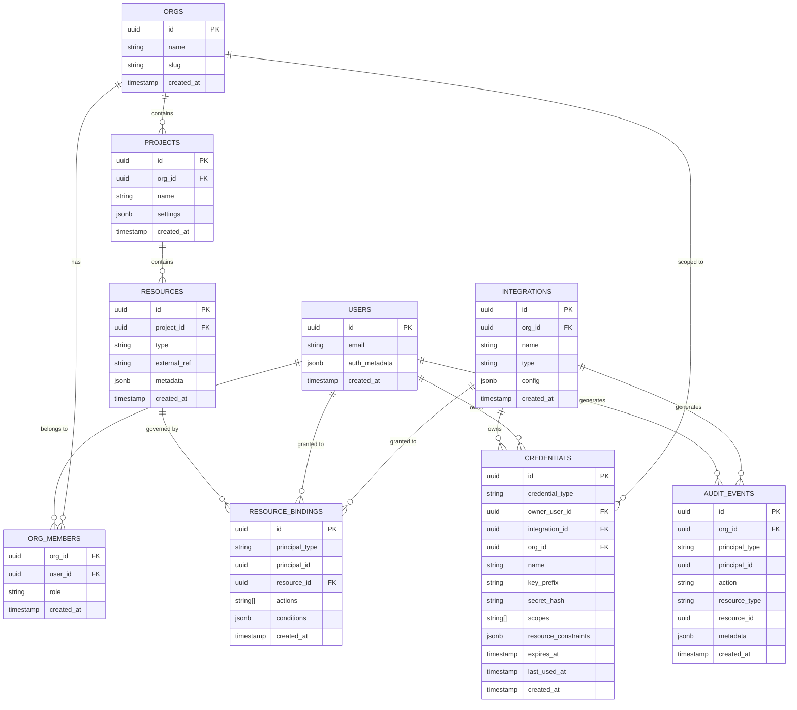

## Credential verification and scoping flow

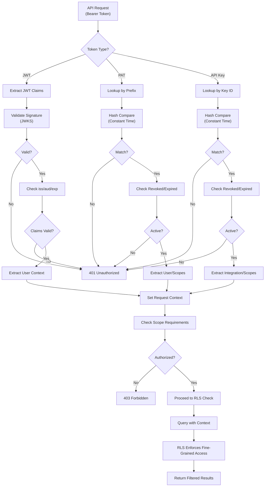

---

# 5) API access patterns

## 5.1 Browser/mobile apps calling APIs using Supabase tokens

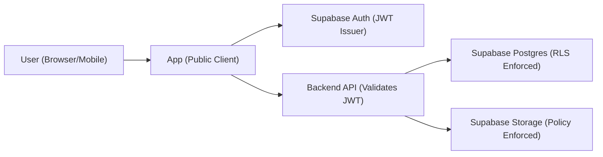

What is presented:
- **[Access token](#glossary) ([JWT](#glossary))** to your Backend API (Authorization: Bearer).
What service validates:
- [JWT](#glossary) signature via [JWKS](#glossary), `[iss](#glossary)`, `[aud](#glossary)`, `exp`.
Where authorization is enforced:
- Fine-grained: **Postgres [RLS](#glossary)** and **Storage policies**.
- Coarse-grained: API gateway/service checks ([rate limits](#glossary), blocked users).

## 5.2 CLIs/scripts using [PATs](#glossary)

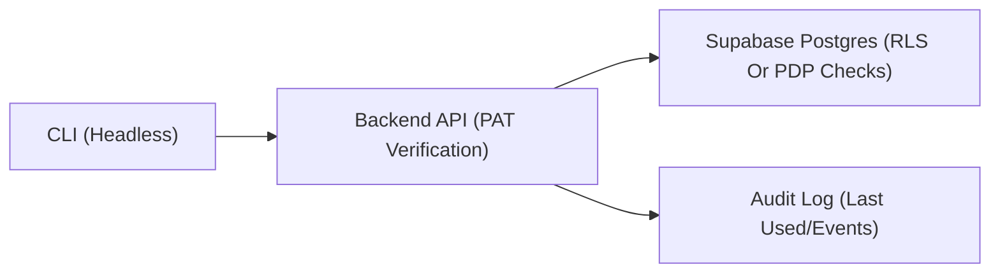

What is presented:
- **[PAT](#glossary)** (a long random secret) as `Authorization: Bearer pat_xxx` (or header `X-Api-Token`).
What service validates:
- Hash lookup + constant-time compare; verify not revoked/expired; check [scope](#glossary) constraints.
Where authorization is enforced:
- API enforces [PAT](#glossary) [scope](#glossary) constraints + then uses DB for resource enforcement.

## 5.3 Third-party integrations using [API keys](#glossary)

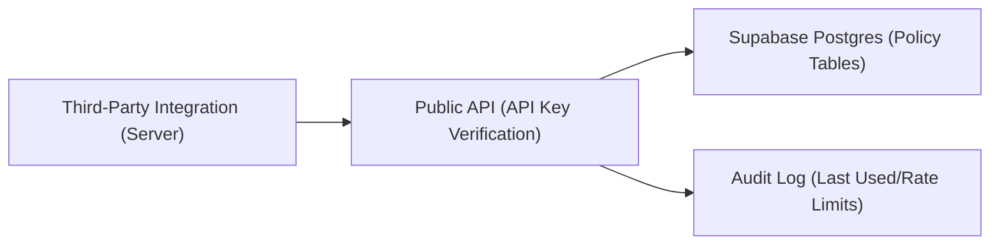

What is presented:
- **Integration [API Key](#glossary)** (key id + secret).
What service validates:
- Hash lookup; check allowed origins (optional), IP allowlist (optional), expiry, rotation state.
Where authorization is enforced:
- API checks key's allowed actions + resource constraints; DB enforces [tenancy](#glossary) and resource access.

## 5.4 S2S calls

### A) Client-credentials-like pattern (service identity layer)
[Supabase](#glossary) Auth is user-centric; for S2S you typically add a **Service Identity** [issuer](#glossary) (or use a gateway) that mints service [JWTs](#glossary).

```mermaid
flowchart TB
  SVC1["Service A (Caller)"] --> STS["Service Token Issuer (S2S)"]
  STS --> SVC2["Service B (Callee)"]
  SVC2 --> PG["Supabase Postgres (Service Role Or Scoped RLS)"]
```

Token presented:
- **Service [access token](#glossary)** ([JWT](#glossary)) with `sub=service_a`, `[aud](#glossary)=service_b`, [scopes](#glossary).
Validation:
- Service B validates [STS](#glossary) [issuer](#glossary) + [audience](#glossary) + expiry.
Authorization:
- Service B enforces route-level [scopes](#glossary); Postgres access either:
  - uses **[service role](#glossary)** with *manual* policy checks (high risk), or
  - uses **scoped [RLS](#glossary)** via setting session variables and [security definer](#glossary) functions (preferred for consistency).

### B) "On behalf of user" propagation ([delegation](#glossary)/[token exchange](#glossary))
Use when Service A needs to call Service B while preserving the end-user context.

```mermaid
sequenceDiagram
  participant U as U["User (App)"]
  participant A as A["Service A (API)"]
  participant X as X["Token Exchange (STS-Like)"]
  participant B as B["Service B (Downstream API)"]
  participant PG as PG["Supabase Postgres (RLS)"]

  U->>A: "Request with user JWT"
  A->>A: "Validate user JWT (JWKS/iss/aud)"
  A->>X: "Exchange user JWT for downstream token (aud=Service B)"
  X-->>A: "Delegated token (short-lived)"
  A->>B: "Call with delegated token"
  B->>B: "Validate delegated token"
  B->>PG: "Query with RLS context (user identity preserved)"
  PG-->>B: "Authorized data"
  B-->>A: "Response"
  A-->>U: "Response"
```

---

# 6) Credentials system design (PATs + API keys)

## 6.1 Data model (tables/fields)

### Core identity / tenancy
- `orgs`
  - `id (uuid pk)`
  - `name`
  - `created_at`
- `org_members`
  - `org_id`
  - `user_id`
  - `role (text)` (optional coarse role)
  - `created_at`
- `projects`
  - `id`
  - `org_id`
  - `name`
- `resources`
  - `id`
  - `project_id`
  - `type (text)` (e.g., "dataset", "dashboard", "bucket", "table")
  - `external_ref (text)` (maps to warehouse table, object prefix, etc.)

### Relationship-based authorization (ReBAC)
- `resource_bindings`
  - `principal_type (text)` (e.g., "user", "integration")
  - `principal_id (uuid)`
  - `resource_id (uuid)`
  - `actions (text[])` (e.g., ["read", "write", "admin"])
  - `conditions (jsonb)` (optional ABAC constraints like region)
  - `created_at`

### Credentials (PATs and API keys)
- `credentials`
  - `id (uuid pk)`
  - `credential_type (text)` -> "pat" | "api_key"
  - `owner_user_id (uuid, null)` (for PATs)
  - `integration_id (uuid, null)` (for API keys)
  - `org_id (uuid)` (tenant boundary)
  - `name (text)`
  - `key_prefix (text)` (non-secret identifier like "pat_abc123")
  - `secret_hash (text)` (argon2id/bcrypt/scrypt output)
  - `scopes (text[])` (actions like "read:datasets", "write:storage")
  - `resource_constraints (jsonb)` (e.g., `{"project_id": "...", "resource_id": "..."}`)
  - `expires_at (timestamptz, null)`
  - `rotated_at (timestamptz, null)`
  - `revoked_at (timestamptz, null)`
  - `last_used_at (timestamptz, null)`
  - `last_used_ip (inet, null)`
  - `created_at`

### Integrations
- `integrations`
  - `id`
  - `org_id`
  - `name`
  - `type (text)` (e.g., "superset", "airflow", "partner_x")
  - `created_at`

### Audit
- `audit_events`
  - `id`
  - `org_id`
  - `principal_type (text)` -> "user" | "integration"
  - `principal_id (uuid)`
  - `action (text)` -> "credential.create", "credential.revoke", "mfa.enable"
  - `resource_type (text)`
  - `resource_id (uuid, null)`
  - `metadata (jsonb)` (ip, ua, request_id, key_prefix)
  - `created_at`

## 6.2 Hash and verify keys (high-level)
- Generate secret once:
  - `secret = random(32..64 bytes)` -> encode (base64url)
  - show it **once** at creation
- Store only:
  - `key_prefix` (public identifier)
  - `secret_hash = argon2id(secret + server_side_pepper)`
- Verification:
  - parse prefix from presented token
  - fetch matching row(s) by `key_prefix`
  - constant-time verify hash
- Rotation:
  - create new credential, mark old as “rotating”
  - allow overlap window, then revoke old

## 6.3 Scoping model
- **Action scopes** (examples):
  - `read:projects`, `write:projects`
  - `read:warehouse`, `query:warehouse`
  - `read:storage`, `write:storage`
  - `admin:credentials`
- **Resource constraints**:
  - `org_id` always bound
  - optional `project_id`
  - optional `resource_id`
  - optional `resource_type`
- **Rules**:
  - PAT max TTL (e.g., 90 days) unless explicitly extended
  - API keys: prefer shorter TTL + rotation reminders
  - “Least privilege by default” in UI (preselect minimal scopes)

## 6.4 UX requirements: “Security & API Access” (professional-grade)

### Page structure
- **Login methods**
  - linked providers list (Google/Apple/email)
  - link/unlink flows with step-up auth
- **MFA**
  - status (enabled/disabled)
  - enroll button, manage factors
  - recovery codes regenerate (step-up)
- **Sessions**
  - active sessions list (device, location approximate, last active)
  - revoke session
  - “sign out of all devices”
- **Personal Access Tokens**
  - list: name, created, last used, expires, scopes summary
  - create PAT wizard:
    - name, expiry, scopes, resource constraints
    - show secret once + copy + download
  - revoke and rotate actions
- **Integration API Keys**
  - list per integration
  - IP allowlist (optional)
  - rotation workflow (create new -> test -> revoke old)

### UX guardrails
- Step-up re-auth for:
  - enabling/disabling MFA
  - creating/revealing recovery codes
  - creating PAT/API key
  - changing email/password
- Warnings:
  - show last-used, never-used, and “seen from new IP”
- Safe defaults:
  - short expirations
  - minimal scopes
  - explicit resource constraint selectors

## 6.5 Threat model highlights
- Leakage (logs, screenshots, client-side storage)
- Replay (stolen bearer token)
- Phishing (fake login, fake PAT creation)
- Credential stuffing (password reuse)
- Abuse:
  - rate limit by principal + IP
  - anomaly detection: impossible travel, sudden token use spikes
  - lockouts / step-up triggers

## RLS policy evaluation flow

```mermaid
flowchart TD
    A["Query Initiated"] --> B["Extract JWT from Context"]
    B --> C["Set auth.uid() Session Variable"]
    C --> D["Parse SQL Query"]

    D --> E{Query Type?}
    E -->|SELECT| F["Apply SELECT Policy"]
    E -->|INSERT| G["Apply INSERT Policy"]
    E -->|UPDATE| H["Apply UPDATE Policy"]
    E -->|DELETE| I["Apply DELETE Policy"]

    F --> J["Evaluate USING Clause"]
    G --> K["Evaluate WITH CHECK Clause"]
    H --> L["Evaluate USING + WITH CHECK"]
    I --> M["Evaluate USING Clause"]

    J --> N{Policy Check}
    K --> N
    L --> N
    M --> N

    N -->|org_members JOIN| O["Check User Org Membership"]
    N -->|resource_bindings JOIN| P["Check Resource Access"]
    N -->|Custom Function| Q["Evaluate Security Definer RPC"]

    O --> R{Authorized?}
    P --> R
    Q --> R

    R -->|Yes| S["Include Row in Result"]
    R -->|No| T["Filter Out Row"]

    S --> U["Return Result Set"]
    T --> U

    U --> V{More Rows?}
    V -->|Yes| J
    V -->|No| W["Query Complete"]
```

## PAT/API key rotation workflow

```mermaid
sequenceDiagram
    participant U as "User/Admin"
    participant UI as "Security Settings UI"
    participant API as "Backend API"
    participant DB as "Credentials Table"
    participant EXT as "External Systems"
    participant AUDIT as "Audit Log"

    U->>UI: "Initiate Key Rotation"
    UI->>API: "Create New Credential (same scope)"
    API->>API: "Generate Secret + Hash"
    API->>DB: "INSERT new credential (active)"
    DB-->>API: "New credential ID"
    API->>AUDIT: "Log credential.create"
    API-->>UI: "Return new secret (show once)"
    UI-->>U: "Display new secret + copy"

    Note over U,EXT: Grace Period (both keys active)

    U->>EXT: "Update configuration with new key"
    EXT->>API: "Test new key"
    API->>DB: "Verify new key"
    DB-->>API: "Valid"
    API-->>EXT: "Success"
    EXT-->>U: "Configuration updated"

    U->>UI: "Mark old key for revocation"
    UI->>API: "Set revocation_at (future timestamp)"
    API->>DB: "UPDATE old credential"
    API->>AUDIT: "Log credential.scheduled_revoke"

    Note over U,EXT: Warning period (notifications)

    loop Scheduled Task
        API->>DB: "Check revocation_at timestamps"
        DB-->>API: "Expired credentials"
        API->>DB: "UPDATE status = revoked"
        API->>AUDIT: "Log credential.revoked"
    end

    Note over U,AUDIT: Old key now revoked, only new key works
```

---

# 7) Authorization design (resource-based)

## 7.1 Recommended approach: [RLS](#glossary) + [policy tables](#glossary) ([ReBAC](#glossary)-style)

### Design goals
- Single policy model used by:
  - Postgres tables ([RLS](#glossary))
  - Storage objects (via policies + metadata tables)
  - APIs ([PEP](#glossary) checks + DB as source of truth)
  - Optional [PDP](#glossary) for [warehouse](#glossary)/external systems

### Canonical "can_access" shape
Create a relationship table like `resource_bindings` and evaluate:
- [principal](#glossary) = user (`auth.uid()`) OR integration (`credential.integration_id`)
- resource = project/resource row
- action = read/write/admin

## 7.2 "Can [principal](#glossary) do action on resource?" patterns

### Pattern A: Direct DB/[RLS](#glossary) enforcement (preferred for Postgres data)
- Service passes user [JWT](#glossary) to Postgres
- [RLS](#glossary) ensures only allowed rows are visible
- Use [security definer](#glossary) RPC for complex operations

```mermaid
flowchart LR
  API["API (PEP)"] --> PG["Postgres (RLS PEP)"]
  PG --> PT["Policy Tables (ReBAC)"]
```

### Pattern B: [PDP](#glossary) service (useful beyond Postgres)
- API asks [PDP](#glossary) for decision + reason
- [PDP](#glossary) reads [policy tables](#glossary) from Postgres
- [PDP](#glossary) returns allow/deny + constraints (like allowed prefixes)

```mermaid
flowchart LR
  API["API (PEP)"] --> PDP["PDP Service (Decider)"]
  PDP --> PG["Postgres (Policy Source)"]
  API --> WH["Warehouse (Enforced With Constraints)"]
```

## 7.3 Worked examples

### Example 1: “User can read only their org’s data”
Data model:
- `org_members (org_id, user_id)`
- `projects (org_id, ...)`
RLS concept:
- A row is visible if `exists (org_members where user_id=auth.uid() and org_id=row.org_id)`

```mermaid
flowchart TB
  U["User (auth.uid())"] --> OM["org_members (user_id->org_id)"]
  OM --> P["projects (org_id)"]
  P --> D["domain_table (org_id)"]
```

### Example 2: “Integration key can read only project X and only read operations”
- Integration key resolves to `integration_id` and `org_id`
- Constraint: `resource_constraints.project_id = X`
- Allowed actions: `read:*`
Enforcement:
- API validates key, sets “principal context” for DB calls (via RPC), and DB checks policy bindings.

```mermaid
flowchart LR
  K["API Key (integration)"] --> API["API (PEP)"]
  API --> RPC["RPC (Security Definer)"]
  RPC --> PG["Postgres (Policy Tables/RLS)"]
  PG --> DATA["Project X Rows Only"]
```

---

# 8) Data-plane / warehouse bridging (must be included)

You asked the “Superset-like BI tool” question: user auth via Supabase Auth, but authorization enforced by object store (S3-like) or warehouse rules.

The core problem:
- Supabase Auth proves **who the user is**
- Warehouse/object store needs a way to enforce **what the user can access**
- You need **identity propagation** + **policy translation** from your Supabase policy model to data-plane enforcement.

Below are 3 practical approaches.

---

## Approach A) STS-like: service obtains short-lived data credentials after a policy decision

**When to use**
- Warehouse/object store supports issuing temporary credentials (or you can proxy)
- You want strong centralized control + short-lived access

**How it maps to Supabase**
- Use Supabase Auth identity (`sub`) + Postgres policy tables as the decision source
- Add an **STS service** that mints short-lived downstream credentials (S3 creds, warehouse session token)

### Sequence diagram

```mermaid
sequenceDiagram
  participant U as U["User (BI Tool)"]
  participant BI as BI["BI App (Superset-Like)"]
  participant SA as SA["Supabase Auth (User JWT)"]
  participant PDP as PDP["PDP (Policy Decision)"]
  participant PG as PG["Postgres (Policies/ReBAC)"]
  participant STS as STS["STS (Data Credentials)"]
  participant S3 as S3["Object Store (S3-Compatible)"]

  U->>BI: "Login via Supabase"
  BI->>SA: "Obtain user JWT"
  BI->>PDP: "Request access (action=read, resource=hive_table_X)"
  PDP->>PG: "Evaluate policy (user->org->resource)"
  PG-->>PDP: "Decision (allow) + constraints (prefixes)"
  PDP->>STS: "Mint short-lived S3 creds (scoped to prefixes)"
  STS-->>BI: "Temporary credentials (TTL=15m)"
  BI->>S3: "Read objects using temp creds"
  S3-->>BI: "Objects returned (enforced by S3)"
```

Extra components you need:
- PDP (optional but recommended here)
- STS (credential minting) integrated with your object store/warehouse auth model

---

## Approach B) Warehouse enforces with end-user identity (impersonation/delegation)

**When to use**
- Warehouse supports user principals (or external identity federation)
- You need per-user audit trails in the warehouse

**How it maps to Supabase**
- Supabase Auth remains the user login system
- Add a federation layer that maps Supabase identity (`sub`) to warehouse users/roles
- Use token exchange/delegation to produce a warehouse-accepted token

### Sequence diagram

```mermaid
sequenceDiagram
  participant U as U["User (App)"]
  participant APP as APP["BI App (Client)"]
  participant SA as SA["Supabase Auth (User JWT)"]
  participant X as X["Token Exchange (Delegation)"]
  participant WH as WH["Warehouse (User-Aware)"]
  participant PG as PG["Postgres (Policies/ReBAC)"]

  U->>APP: "Run query (table=hive_table_X)"
  APP->>SA: "Ensure user session (JWT valid)"
  APP->>X: "Exchange Supabase JWT for warehouse token"
  X->>PG: "Check policy (user can query hive_table_X)"
  PG-->>X: "Allow + mapped warehouse role"
  X-->>APP: "Warehouse token (aud=warehouse)"
  APP->>WH: "Submit query with user-delegated token"
  WH-->>APP: "Query results (warehouse enforces)"
```

Extra components you need:
- Token exchange service (STS-like) + mapping layer
- Warehouse configuration for external identity / role mapping

---

## Approach C) Capability tokens / pre-signed URLs (object-level)

**When to use**
- You want simple object access without provisioning identities in warehouse/object store
- Access is object/prefix-based (files, exports, parquet chunks)
- Great for download links and controlled sharing

**How it maps to Supabase**
- Use Postgres policy tables to decide
- Generate **pre-signed URLs** (or storage signed URLs) after decision
- Storage policies still apply for direct access paths

### Sequence diagram

```mermaid
sequenceDiagram
  participant U as U["User (App)"]
  participant APP as APP["App (API)"]
  participant SA as SA["Supabase Auth (JWT)"]
  participant PG as PG["Postgres (Policies/ReBAC)"]
  participant ST as ST["Storage (Signed URL)"]

  U->>APP: "Request download (resource=export_123)"
  APP->>SA: "Validate user JWT"
  APP->>PG: "Authorize via policy tables (can read export_123)"
  PG-->>APP: "Allow"
  APP->>ST: "Create signed URL (TTL=5m)"
  ST-->>APP: "Signed URL"
  APP-->>U: "Return signed URL"
  U->>ST: "Download using signed URL"
  ST-->>U: "Object bytes"
```

Extra components you need:
- Often none beyond your API (signing endpoint), depending on storage

## Complete authorization decision flow

```mermaid
flowchart TB
    subgraph "Request Processing"
        A["Incoming Request"] --> B["Extract Credentials"]
        B --> C{Credential Type?}
        C -->|JWT| D["Validate JWT"]
        C -->|PAT| E["Validate PAT"]
        C -->|API Key| F["Validate API Key"]
    end

    subgraph "Identity Resolution"
        D --> G["Extract user_id + claims"]
        E --> H["Lookup user_id + scopes"]
        F --> I["Lookup integration_id + scopes"]
        G --> J["Resolve Principal Context"]
        H --> J
        I --> J
    end

    subgraph "Coarse Authorization"
        J --> K["Check Token Scopes"]
        K --> L{Required Scopes Present?}
        L -->|No| M["403 Forbidden"]
        L -->|Yes| N["Check Resource Constraints"]
        N --> O{Constraints Satisfied?}
        O -->|No| M
        O -->|Yes| P["Proceed to Fine-Grained"]
    end

    subgraph "Fine-Grained Authorization"
        P --> Q["Set Session Context<br/>(auth.uid, custom vars)"]
        Q --> R["Execute Query with RLS"]
        R --> S["RLS Policy Evaluation"]
        S --> T{Policy Allows?}
        T -->|No| U["Empty Result Set / Error"]
        T -->|Yes| V["Return Filtered Data"]
    end

    subgraph "Auditing"
        J --> W["Log Authentication Event"]
        L --> X["Log Authorization Decision"]
        T --> Y["Log Data Access"]
        V --> Z["Log Success + Metadata"]
    end

    W --> AA["Audit Database"]
    X --> AA
    Y --> AA
    Z --> AA
```

## Security architecture layers

```mermaid
graph LR
    subgraph "Perimeter Security"
        A1["Rate Limiting"]
        A2["DDoS Protection"]
        A3["IP Allowlisting"]
        A4["Geographic Restrictions"]
    end

    subgraph "Authentication Security"
        B1["Strong Password Policy"]
        B2["MFA Enforcement"]
        B3["Social Provider Verification"]
        B4["Session Management"]
        B5["Token Rotation"]
    end

    subgraph "Authorization Security"
        C1["Principle of Least Privilege"]
        C2["RLS Enforcement"]
        C3["Scope-Based Access"]
        C4["Resource Constraints"]
        C5["Time-Based Policies"]
    end

    subgraph "Data Security"
        D1["Encryption at Rest"]
        D2["Encryption in Transit"]
        D3["Column-Level Security"]
        D4["PII Masking"]
        D5["Data Retention Policies"]
    end

    subgraph "Operational Security"
        E1["Comprehensive Audit Logs"]
        E2["Anomaly Detection"]
        E3["Security Monitoring"]
        E4["Incident Response"]
        E5["Access Reviews"]
    end

    subgraph "Credential Security"
        F1["Secret Hashing (Argon2)"]
        F2["Secure Generation"]
        F3["Rotation Workflows"]
        F4["Revocation Support"]
        F5["Last-Use Tracking"]
    end

    A1 --> B1
    A2 --> B1
    A3 --> B2
    A4 --> B2

    B1 --> C1
    B2 --> C1
    B3 --> C2
    B4 --> C2
    B5 --> C3

    C1 --> D1
    C2 --> D1
    C3 --> D2
    C4 --> D3
    C5 --> D4

    D1 --> E1
    D2 --> E2
    D3 --> E3
    D4 --> E4
    D5 --> E5

    E1 --> F1
    E2 --> F2
    E3 --> F3
    E4 --> F4
    E5 --> F5
```

---

# 9) Best practices + anti-patterns (Supabase-focused, practical)

## Best practices
- **Prefer [httpOnly cookies](#glossary) for web [sessions](#glossary) (SSR)** to reduce [XSS](#glossary) token theft risk.
- **Validate [JWTs](#glossary) consistently** in every service:
  - signature via [JWKS](#glossary)
  - `[iss](#glossary)` exact match
  - `[aud](#glossary)` match per API
  - `exp` enforced
- **Use Postgres [RLS](#glossary) as the default authorization enforcement** for data in Postgres.
- **Use short-lived [access tokens](#glossary)** and rotate [refresh tokens](#glossary).
- **[Step-up](#glossary) auth for sensitive actions** ([MFA](#glossary) changes, [PAT](#glossary)/[API key](#glossary) creation, billing/admin).
- **[Audit](#glossary) everything security-relevant** (credential lifecycle, policy changes, admin actions).
- **[Rate limit](#glossary)** by:
  - [principal](#glossary) (user/integration)
  - IP
  - endpoint sensitivity (login, token, key usage)

## Anti-patterns (and why)
- **Don't store [JWTs](#glossary) in localStorage**
  - localStorage is readable by [XSS](#glossary); stolen tokens enable replay.
  - Exception: some mobile/embedded contexts where secure storage exists and threat model is different—but treat as explicit decision.
- **Don't use "[service role](#glossary)" broadly in backend services**
  - It bypasses [RLS](#glossary) and invites auth logic duplication and mistakes.
  - If you must, wrap access in [security definer](#glossary) RPCs that re-apply policy checks.
- **Don't treat [JWTs](#glossary) as a database**
  - Avoid stuffing large authorization graphs into token [claims](#glossary).
  - Use tokens for identity + coarse [scopes](#glossary); keep fine-grained authorization in DB [policy tables](#glossary).
- **Avoid long-lived bearer tokens**
  - Prefer expirations, rotation, and revocation capability.
- **Avoid inconsistent [issuer](#glossary)/[audience](#glossary) across environments**
  - Prevent dev tokens from working in prod by strict validation.

## Next steps (brief)
- Multi-[tenancy](#glossary) hardening: org/project isolation testing, [RLS](#glossary) test harness
- Consent/[scopes](#glossary) UX: clearer "what this key can do" summaries
- Key/token hierarchy: org-level integrations, project-level keys, per-resource grants
- Abuse prevention roadmap: anomaly detection, progressive challenges, device binding

---

## Appendix: "What to build" (implementation-oriented checklist)

### Build in Postgres (minimum viable platform)
- [ ] `orgs`, `org_members`, `projects`, `resources`
- [ ] `resource_bindings` ([ReBAC](#glossary))
- [ ] `credentials`, `integrations`
- [ ] `audit_events`
- [ ] [RLS](#glossary) policies for:
  - org membership row visibility
  - project/resource visibility by org membership
  - credential listing restricted to owner/org admin
  - [audit](#glossary) visibility restricted appropriately

### Build in services
- [ ] API middleware:
  - [ ] [JWT](#glossary) validation ([JWKS](#glossary), `[iss](#glossary)`, `[aud](#glossary)`, `exp`)
  - [ ] [PAT](#glossary)/[API key](#glossary) verification (hash lookup, expiry, revocation)
  - [ ] [rate limiting](#glossary) + [audit](#glossary) logging
- [ ] Optional [PDP](#glossary):
  - [ ] "can(user, action, resource)" endpoint
  - [ ] explanation payload for UX ("denied because…")
- [ ] Optional [STS](#glossary)/[token exchange](#glossary) for [warehouse](#glossary)/[object store](#glossary) bridging

### Build in UX
- [ ] Login and [account linking](#glossary) flows with clear messaging
- [ ] [MFA](#glossary) enrollment + challenge + recovery codes
- [ ] [Sessions](#glossary) management + global logout best-effort
- [ ] [PAT](#glossary)/[API key](#glossary) creation wizard + one-time secret display + rotation UX

---

If you want, I can also provide (a) a concrete example schema + sample [RLS](#glossary) policy pseudologic for `resource_bindings`, and (b) a recommended token/[claim](#glossary) shape for user [JWTs](#glossary) vs delegated S2S tokens—without duplicating authorization logic into [claims](#glossary).
