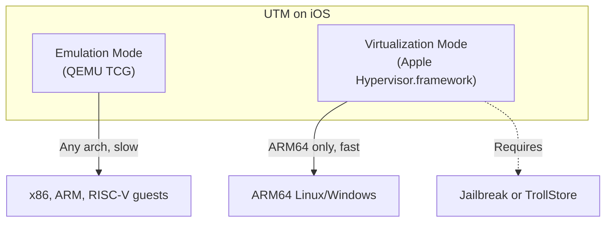
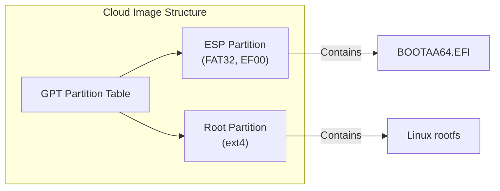
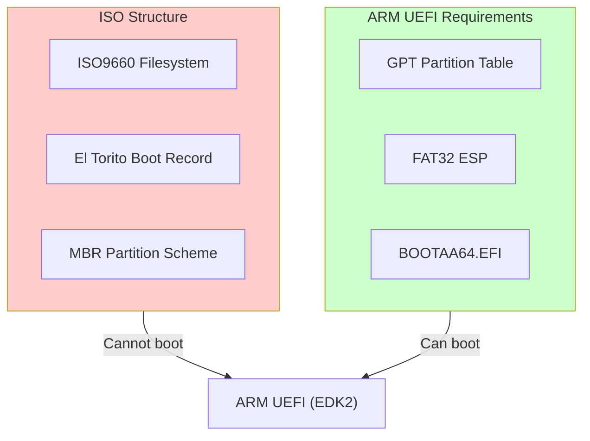
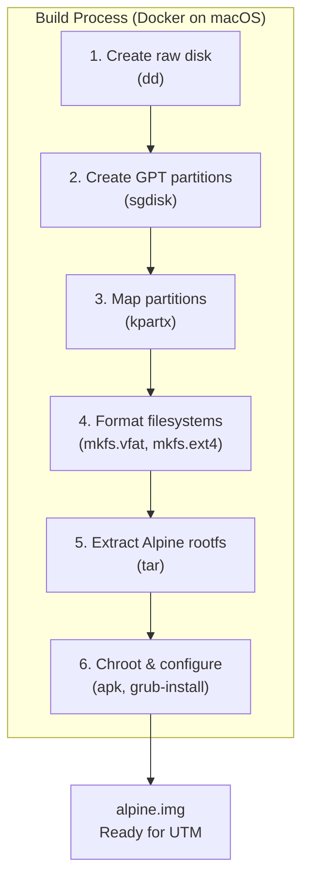
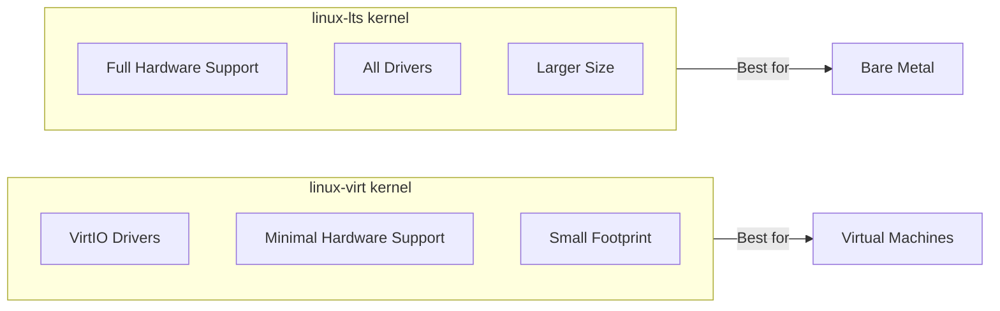
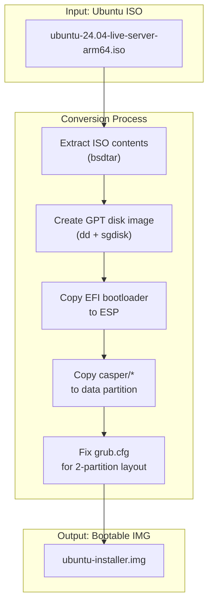
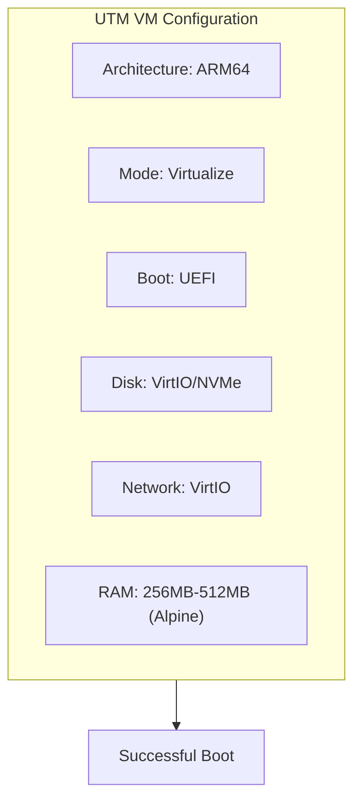
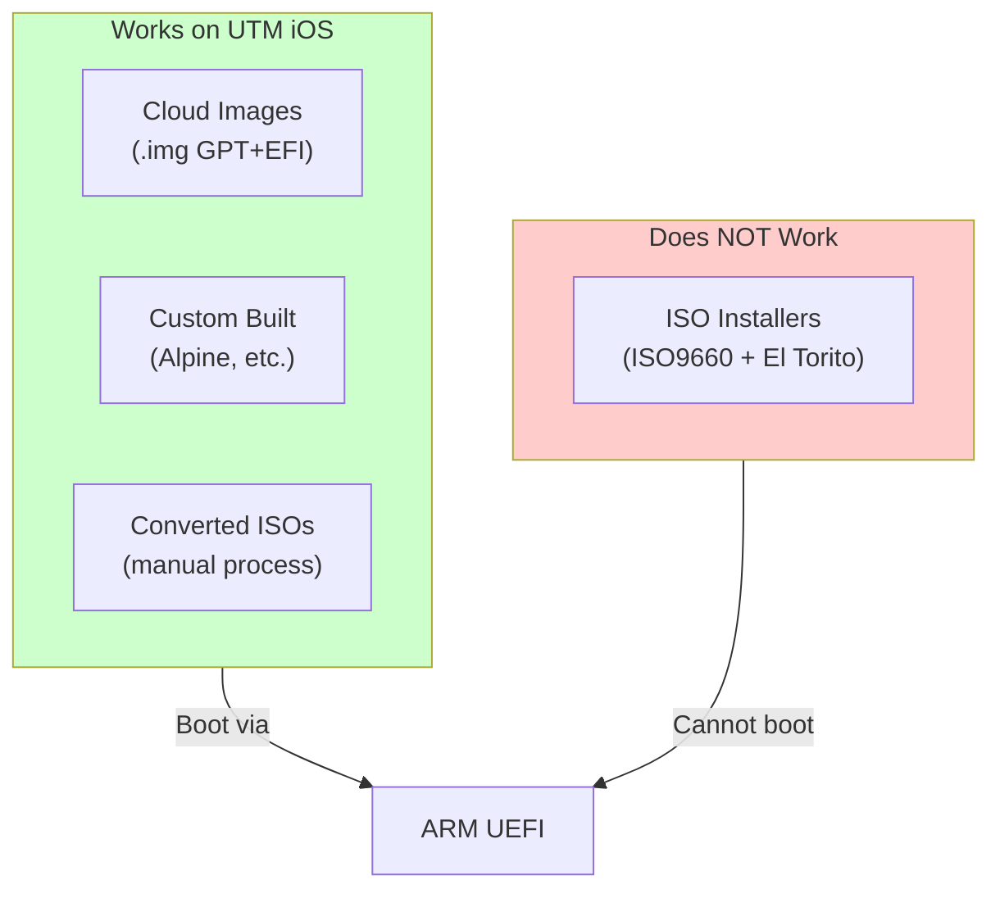

# UTM on iOS - Technical Findings

## Overview

This document captures findings from testing Linux virtual machines on [UTM for iOS](https://getutm.app/). UTM uses [QEMU](https://www.qemu.org/) under the hood and supports both **emulation** (slow, any architecture) and **virtualization** (fast, ARM64 only, requires jailbreak/TrollStore).



---

## What Works

### 1. Pre-installed Cloud Images (.img with GPT+EFI)

**Example:** [`ubuntu-24.04-server-cloudimg-arm64.img`](https://cloud-images.ubuntu.com/releases/24.04/release/)

These work because they are:
- Raw disk images with GPT partition table
- Include EFI System Partition (ESP) with `/EFI/BOOT/BOOTAA64.EFI`
- ARM64 native architecture



**Caveat:** Cloud images require [cloud-init](https://cloud-init.io/) configuration for login credentials. Without it, you cannot log in (no default password).

**Solution:** Create a cloud-init seed disk (FAT32, label `CIDATA`) containing:
```yaml
# user-data
#cloud-config
password: ubuntu
chpasswd:
  expire: false
ssh_pwauth: true
```

### 2. Custom-Built ARM64 Images with GPT+EFI

Any Linux distribution can work if packaged correctly as a GPT disk image with proper EFI boot structure.

**Tested Working:**
- [Alpine Linux](https://alpinelinux.org/) (custom built) - ~1GB image, very lightweight
- [Ubuntu cloud images](https://cloud-images.ubuntu.com/) (with cloud-init seed)

---

## What Does NOT Work

### ISO Installers (Ubuntu, Debian, etc.)

**Example:** `ubuntu-24.04.3-live-server-arm64.iso`



**Why it fails:**

ARM UEFI (EDK2 in QEMU) **cannot boot from**:
- ISO9660 filesystem
- El Torito boot records
- MBR partition schemes

ARM UEFI **requires**:
- GPT partition table
- EFI System Partition (FAT32) with `/EFI/BOOT/BOOTAA64.EFI`

The Ubuntu ARM64 live ISO uses the same ISO9660 + El Torito structure as x86, which works on x86 because BIOS/legacy boot exists. ARM64 has no legacy boot - it's UEFI only.

> **Note:** This is a known Ubuntu oversight - they repackage the same ISO structure for ARM64 without fixing the boot method. See [Ubuntu Bug Discussion](https://bugs.launchpad.net/ubuntu/+source/debian-installer/+bug/1975073).

---

## ARM UEFI Boot Requirements

For an image to boot on UTM iOS (virtualization mode):

| Requirement | Description | Reference |
|-------------|-------------|-----------|
| **GPT** | GUID Partition Table (not MBR) | [UEFI Spec](https://uefi.org/specifications) |
| **ESP** | EFI System Partition, type code `EF00` | [ESP Wikipedia](https://en.wikipedia.org/wiki/EFI_system_partition) |
| **FAT32** | ESP must be FAT32 formatted | Required by UEFI |
| **BOOTAA64.EFI** | Bootloader at `/EFI/BOOT/BOOTAA64.EFI` | ARM64 default boot path |
| **ARM64 kernel** | Native aarch64 Linux kernel | Architecture match |

---

## How Alpine Linux Image Was Built

### Architecture Overview



### Step-by-step Process

#### 1. Create Raw Disk Image
```bash
dd if=/dev/zero of=alpine.img bs=1M count=1024
```

#### 2. Create GPT Partition Table
```bash
# Using sgdisk from gptfdisk package
# Reference: https://www.rodsbooks.com/gdisk/sgdisk.html
sgdisk -Z alpine.img
sgdisk -n 1:0:+100M -t 1:ef00 -c 1:"EFI" alpine.img   # EFI System Partition
sgdisk -n 2:0:0 -t 2:8300 -c 2:"ALPINE" alpine.img   # Root partition
```

#### 3. Setup Loop Device and Format
```bash
# kpartx creates device mappings for partitions
# Reference: https://linux.die.net/man/8/kpartx
kpartx -av alpine.img
# Creates /dev/mapper/loop0p1 and /dev/mapper/loop0p2

mkfs.vfat -F 32 -n EFI /dev/mapper/loop0p1
mkfs.ext4 -L ALPINE /dev/mapper/loop0p2
```

#### 4. Mount and Extract Alpine
```bash
mount /dev/mapper/loop0p2 /mnt/root
mkdir -p /mnt/root/boot/efi
mount /dev/mapper/loop0p1 /mnt/root/boot/efi

# Extract Alpine minirootfs
# Download from: https://alpinelinux.org/downloads/
tar xzf alpine-minirootfs-3.21.5-aarch64.tar.gz -C /mnt/root
```

#### 5. Install Kernel and Bootloader (in chroot)
```bash
chroot /mnt/root /bin/sh

# Setup repositories
# Reference: https://wiki.alpinelinux.org/wiki/Repositories
echo "https://dl-cdn.alpinelinux.org/alpine/v3.21/main" > /etc/apk/repositories
echo "https://dl-cdn.alpinelinux.org/alpine/v3.21/community" >> /etc/apk/repositories

# Install packages
apk update
apk add linux-virt openrc openssh sudo bash grub grub-efi

# Install GRUB for ARM64 EFI
# Reference: https://wiki.alpinelinux.org/wiki/GRUB
grub-install --target=arm64-efi --efi-directory=/boot/efi --boot-directory=/boot --removable --no-nvram
```

#### 6. Configure GRUB
```bash
# Reference: https://www.gnu.org/software/grub/manual/grub/grub.html
cat > /boot/grub/grub.cfg << 'EOF'
set timeout=3
set default=0

menuentry "Alpine Linux" {
    linux /boot/vmlinuz-virt root=LABEL=ALPINE modules=ext4 console=tty0 console=ttyAMA0
    initrd /boot/initramfs-virt
}
EOF
```

#### 7. Configure System
```bash
# Hostname
echo "alpine" > /etc/hostname

# Networking (DHCP)
# Reference: https://wiki.alpinelinux.org/wiki/Configure_Networking
cat > /etc/network/interfaces << 'EOF'
auto lo
iface lo inet loopback

auto eth0
iface eth0 inet dhcp
EOF

# Enable services via OpenRC
# Reference: https://wiki.alpinelinux.org/wiki/OpenRC
rc-update add networking boot
rc-update add sshd default
rc-update add hostname boot

# Create user
adduser -D -s /bin/bash renato
echo "renato:PASSWORD" | chpasswd
addgroup renato wheel
echo "%wheel ALL=(ALL) ALL" >> /etc/sudoers

# fstab - use labels for portability
cat > /etc/fstab << 'EOF'
LABEL=ALPINE    /           ext4    defaults,noatime    0 1
LABEL=EFI       /boot/efi   vfat    defaults            0 2
EOF

# Serial console for ARM (ttyAMA0 is the ARM PL011 UART)
echo "ttyAMA0::respawn:/sbin/getty -L ttyAMA0 115200 vt100" >> /etc/inittab
```

#### 8. Cleanup and Unmount
```bash
sync
umount /mnt/root/boot/efi
umount /mnt/root
kpartx -d alpine.img
```

### Key Components

| Component | Package | Purpose | Reference |
|-----------|---------|---------|-----------|
| `linux-virt` | Kernel optimized for VMs | Has virtio drivers built-in | [Alpine Kernels](https://wiki.alpinelinux.org/wiki/Kernels) |
| `grub-efi` | GRUB for EFI | Provides BOOTAA64.EFI | [GRUB Manual](https://www.gnu.org/software/grub/manual/) |
| `openrc` | Init system | Alpine's default init | [OpenRC](https://wiki.alpinelinux.org/wiki/OpenRC) |
| `openssh` | SSH server | Remote access | [OpenSSH](https://www.openssh.com/) |

### Why `linux-virt` Kernel?

[Alpine's `linux-virt`](https://pkgs.alpinelinux.org/package/v3.21/main/aarch64/linux-virt) kernel is specifically built for virtual machines:
- Includes VirtIO drivers (block, network, console)
- Excludes unnecessary hardware drivers
- Smaller size, faster boot
- Lower memory footprint



---

## Converting Ubuntu ISO to Bootable IMG

It's possible to convert the Ubuntu ARM64 ISO installer to a bootable GPT image:



### Process:
1. Extract ISO contents (using `bsdtar` on macOS)
2. Create GPT disk image with two partitions:
   - ESP (200MB, FAT32) - for EFI bootloader and GRUB
   - Data (3GB+, FAT32) - for casper/kernel/initrd/squashfs
3. Copy EFI files: `/efi/boot/*` to ESP `/EFI/BOOT/`
4. Copy GRUB: `/boot/grub/*` to ESP `/boot/grub/`
5. Copy installer files: `/casper/*` to Data partition
6. Modify `grub.cfg` to search for the data partition by label

### Modified grub.cfg for two-partition layout:
```bash
# Search for partition by filesystem label
search --no-floppy --label --set=ubuntu_part UBUNTU

menuentry "Try or Install Ubuntu Server" {
    set root=$ubuntu_part
    linux   /casper/vmlinuz  --- console=tty0
    initrd  /casper/initrd
}
```

---

## Performance: Ubuntu vs Alpine on iOS

```mermaid
xychart-beta
    title "Resource Usage Comparison"
    x-axis ["Image Size (GB)", "Min RAM (GB)", "Boot Time (rel)", "Battery Impact (rel)"]
    y-axis "Value" 0 --> 4
    bar [3.5, 2, 3, 4] "Ubuntu"
    bar [1, 0.5, 1, 1] "Alpine"
```

| Metric | Ubuntu | Alpine |
|--------|--------|--------|
| Image size | ~3.5GB | ~1GB |
| RAM usage | 1-2GB minimum | 256-512MB |
| Boot time | Slow | Fast |
| Battery drain | High | Low |
| Heat generation | Significant | Minimal |

**Recommendation:** Use Alpine for iOS UTM. Ubuntu is too resource-intensive for iPhone.

---

## UTM iOS Configuration Tips

### For Virtualization Mode (requires jailbreak):



| Setting | Value | Notes |
|---------|-------|-------|
| Architecture | ARM64 (aarch64) | Must match host |
| Mode | Virtualize | Not Emulate |
| Boot | UEFI | Required for GPT images |
| Disk | VirtIO or NVMe | Best performance |
| Network | VirtIO | Best performance |
| RAM | 256-512MB (Alpine) | 2GB+ for Ubuntu |

### Recommended Resources:
- Alpine: 256MB-512MB RAM
- Ubuntu: 2GB+ RAM (not recommended for iPhone)

---

## Files Created

| File | Size | Description |
|------|------|-------------|
| `alpine.img` | 1GB | Pre-installed Alpine Linux, ready to use |
| `ubuntu-installer.img` | 3.5GB | Ubuntu installer converted to bootable IMG |
| `seed.img` | 1MB | Cloud-init seed for Ubuntu cloud images |

---

## Summary



| Image Type | Works? | Notes |
|------------|--------|-------|
| Ubuntu cloud `.img` | Yes | Needs cloud-init seed for credentials |
| Ubuntu live `.iso` | No | ARM UEFI can't boot ISO9660 |
| Ubuntu ISO converted to `.img` | Yes | Requires manual conversion |
| Alpine custom `.img` | Yes | Lightweight, recommended |
| Debian cloud `.img` | Likely | Untested, should work |

---

## References

- [UTM for iOS](https://getutm.app/) - Virtual machines for iPhone/iPad
- [UTM Documentation](https://docs.getutm.app/) - Official docs
- [Alpine Linux](https://alpinelinux.org/) - Lightweight Linux distribution
- [Alpine Wiki](https://wiki.alpinelinux.org/) - Alpine documentation
- [Ubuntu Cloud Images](https://cloud-images.ubuntu.com/) - Pre-built Ubuntu images
- [cloud-init Documentation](https://cloud-init.io/) - Cloud instance initialization
- [UEFI Specification](https://uefi.org/specifications) - UEFI standards
- [QEMU Documentation](https://www.qemu.org/documentation/) - QEMU emulator docs
- [GPT fdisk (sgdisk)](https://www.rodsbooks.com/gdisk/) - GPT partitioning tool
- [GRUB Manual](https://www.gnu.org/software/grub/manual/grub/grub.html) - GRUB bootloader
- [VirtIO Specification](https://docs.oasis-open.org/virtio/virtio/v1.1/virtio-v1.1.html) - Virtual I/O devices
