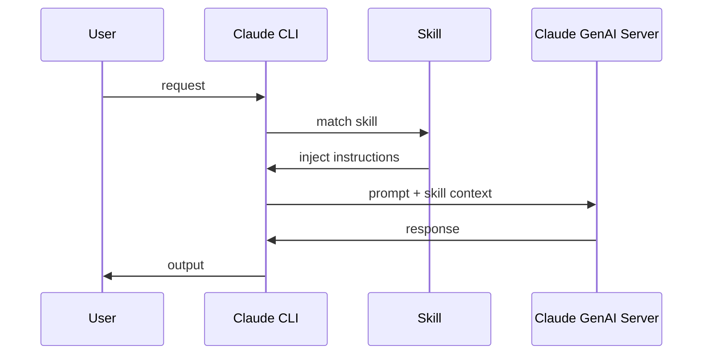
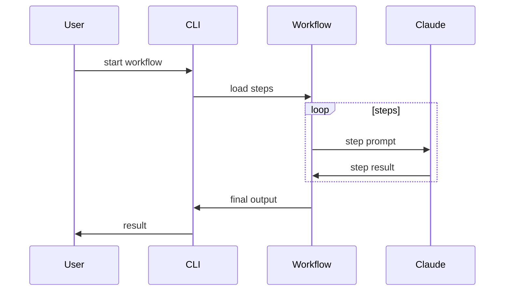
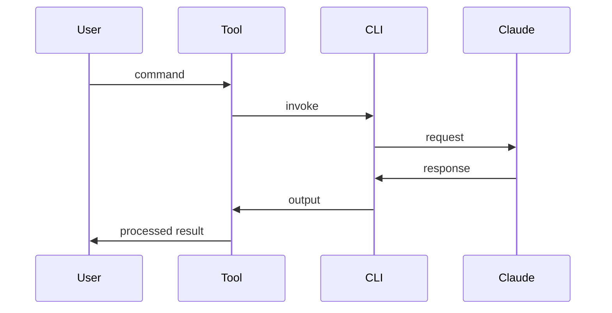
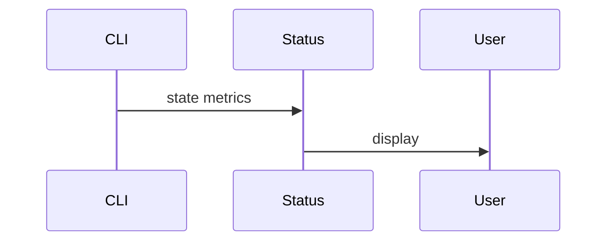
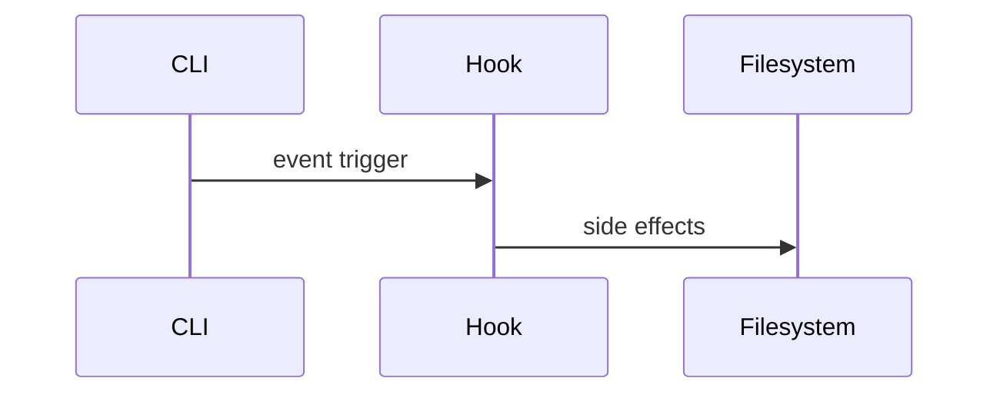
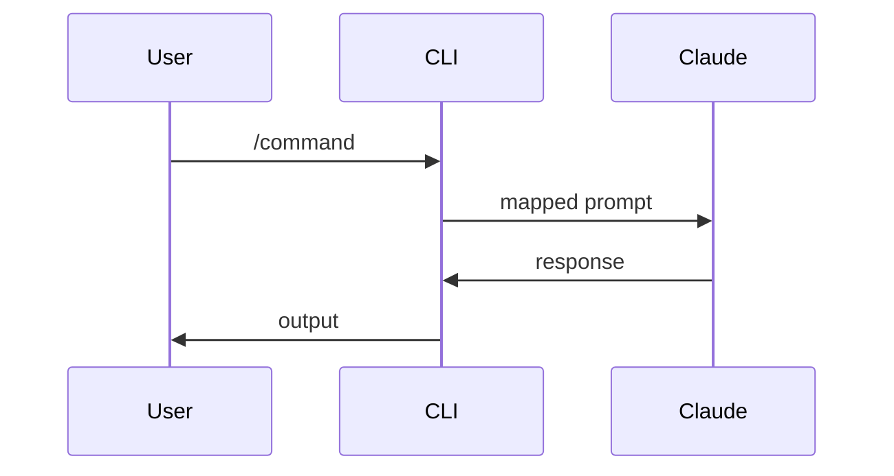
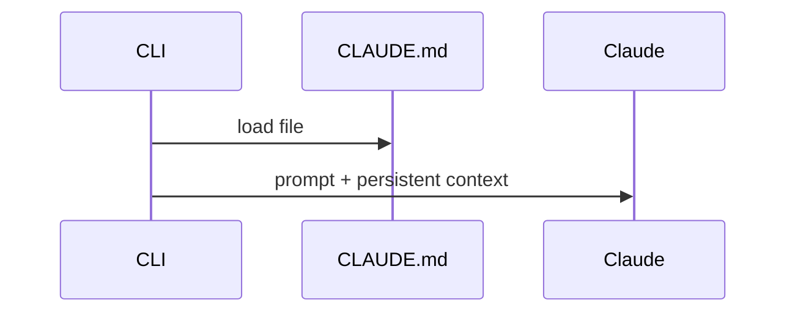
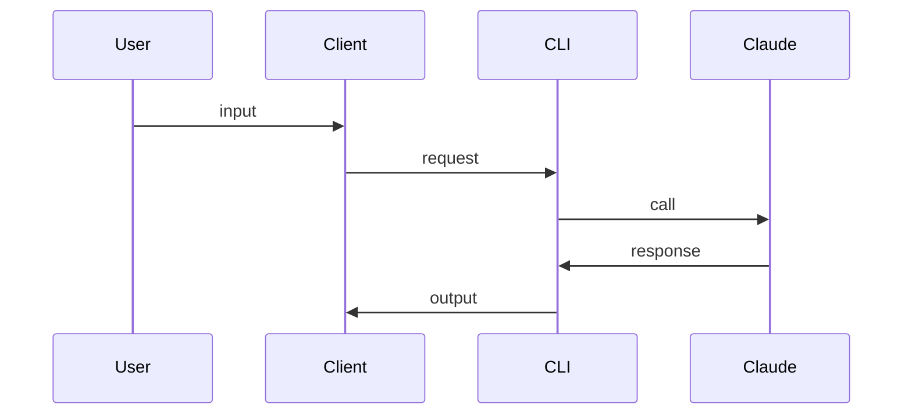
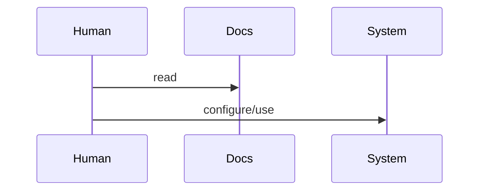

Assumption: **Claude Code CLI (official), local execution, remote Claude GenAI server**.

---

## 1) Agent Skills

**What it is**
Reusable prompt+rules bundles that teach Claude how to perform a specific task type consistently.

**Criticism**

* Prompt-based, not executable logic
* Hard to version-test deterministically
* Hidden coupling to model behavior

**Better / Big-tech practice**

* Explicit task services (Google internal tools)
* Typed agents with contracts (LangGraph, Temporal)
* Deterministic pipelines + LLM only for reasoning

---

## 2) Workflows

**What it is**
Predefined multi-step processes chaining skills into a larger task.

**Criticism**

* Linear, fragile to step failure
* Hard to branch or recover state
* Not observable or resumable

**Better / Big-tech practice**

* DAG-based orchestration (Airflow, Temporal)
* State machines (AWS Step Functions)
* Event-driven pipelines

---

## 3) Tooling

**What it is**
External CLIs/scripts that wrap or manage Claude Code usage.

**Criticism**

* Glue code sprawl
* No shared standard
* Often shell-script fragile

**Better / Big-tech practice**

* Internal SDKs
* Unified dev platforms (Google Piper, Meta internal CLIs)
* Typed APIs + observability baked in

---

## 4) Status Lines

**What it is**
Inline terminal indicators showing runtime state.

**Criticism**

* Superficial visibility
* No historical or aggregate insight

**Better / Big-tech practice**

* Centralized telemetry (Prometheus, OpenTelemetry)
* Dashboards (Grafana, internal tooling)

---

## 5) Hooks

**What it is**
Scripts triggered at lifecycle points (pre/post execution).

**Criticism**

* Implicit behavior
* Order-dependent bugs
* Hard to debug

**Better / Big-tech practice**

* Explicit pipelines
* CI stages with contracts
* Event buses

---

## 6) Slash Commands

**What it is**
Explicit user-triggered command shortcuts.

**Criticism**

* UX sugar only
* No composability
* Hidden logic

**Better / Big-tech practice**

* Structured APIs
* CLI subcommands with flags
* RPC-style invocations

---

## 7) CLAUDE.md Files

**What it is**
Persistent project-level context auto-loaded into every session.

**Criticism**

* Token-heavy
* Global mutable state
* No scope control

**Better / Big-tech practice**

* Versioned specs
* Context retrieved dynamically (RAG)
* Policy engines

---

## 8) Alternative Clients

**What it is**
Non-official frontends for Claude Code.

**Criticism**

* Fragmentation
* Inconsistent behavior
* Maintenance risk

**Better / Big-tech practice**

* Single internal platform
* Opinionated tooling
* Strict interface contracts

---

## 9) Documentation

**What it is**
Human-readable guidance; no runtime role.

**Criticism**

* Drifts from reality
* Not enforced

**Better / Big-tech practice**

* Docs-as-code
* Specs driving generation
* Code = source of truth

---

## High-level reality check

Claude Code ecosystem = **prompt engineering + glue tooling**.
Big tech trend = **explicit systems, state machines, typed APIs, observability, minimal magic**.
